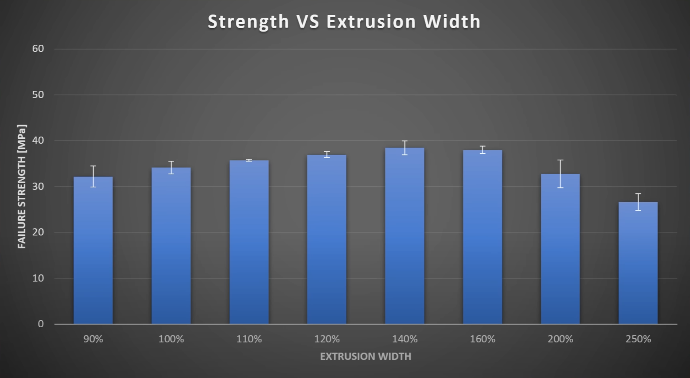
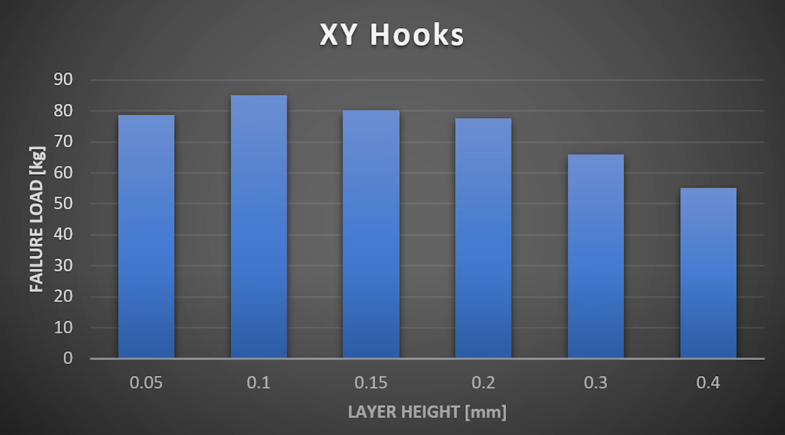
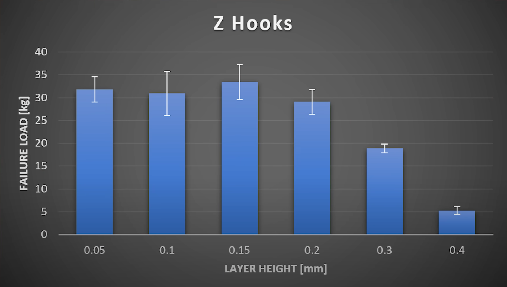
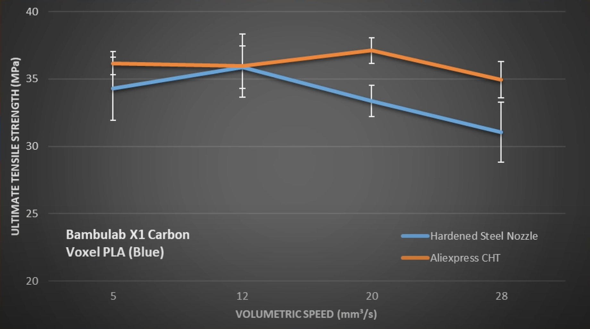
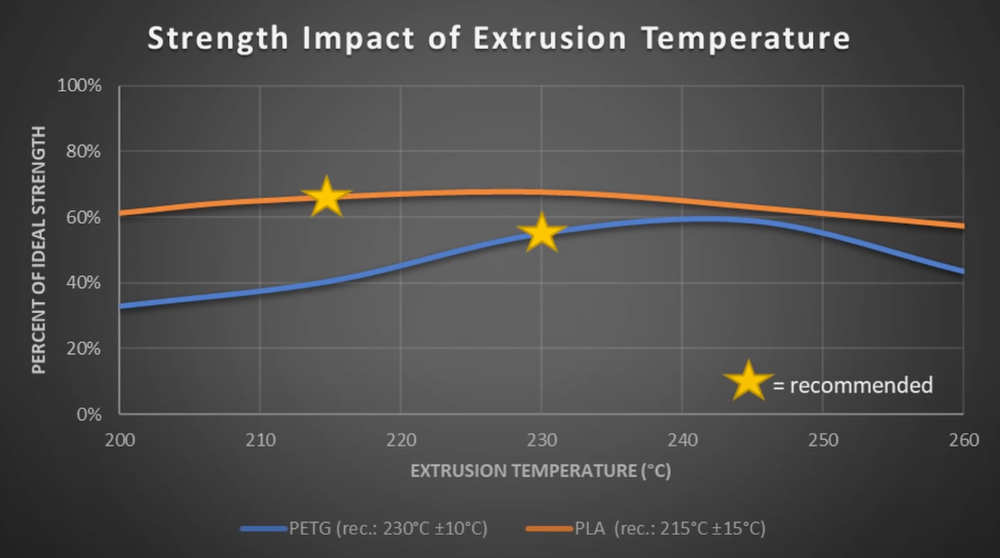
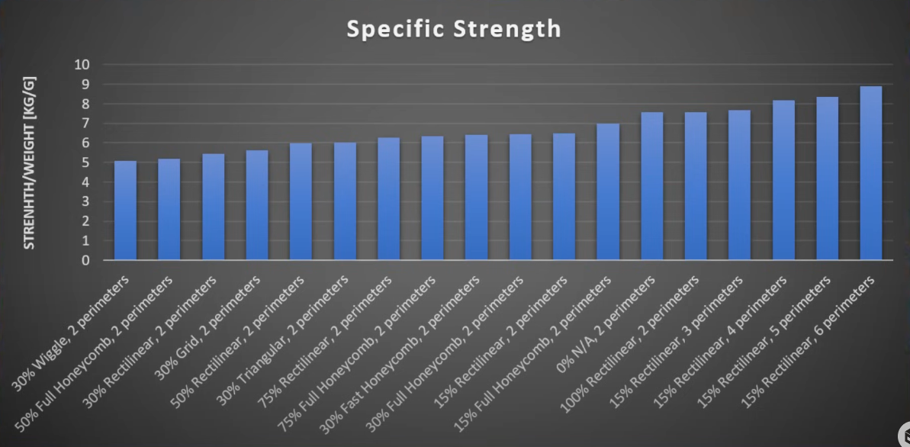
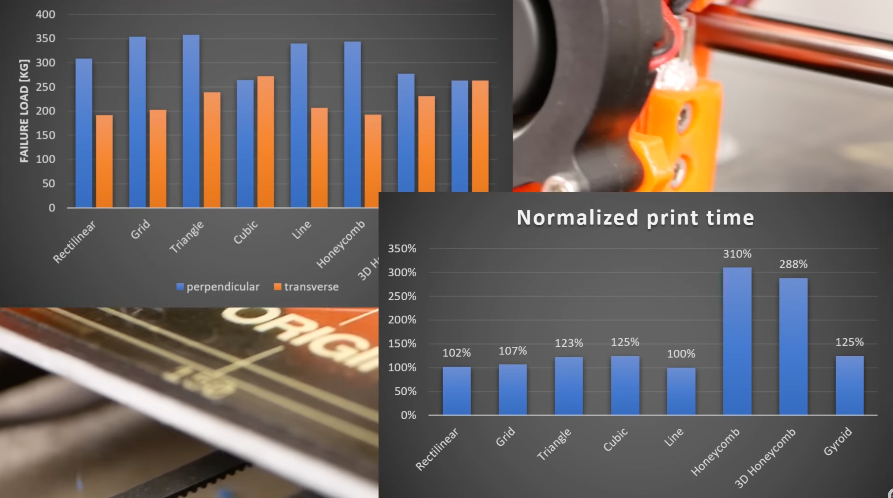
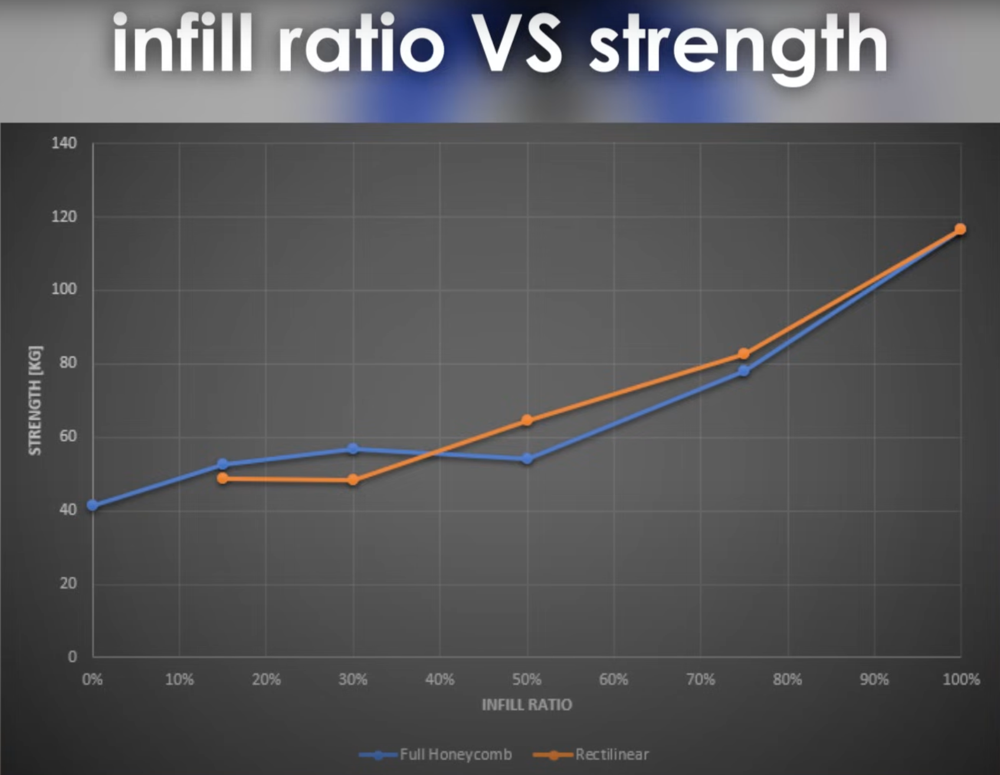
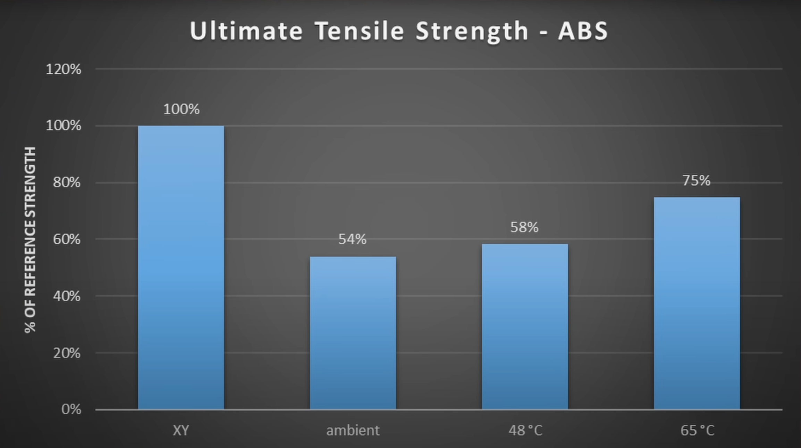

# Принципы прочной печати

В этой статье будут рассказаны методики, благодаря которым можно получить более прочные детали. Статья в большей степени ориентирована на плохо спекающиеся материалы, такие как ABS, ASA, HIPS, PC, PA6 и прочие. Но для большинства других материалов описанные методики тоже будут работать, просто результат будет не так сильно заметен.

## Готовый рецепт

Понимая, что большой части печатников не хочется глубоко зарываться в теорию, а хочется просто готовый рецепт, я сделал таблицу со "средней температурой по больнице". Она не заменит вам прочтение этой статьи целиком, и ни в коем случае не является волшебной таблеткой "сделать хорошо". Но она может являться отправной точкой для самых распространенных случаев.

| Параметр | Оптимум прочность/скорость | Макс. прочность | Примечание |
|:-------- |:-------:|:---------------:|:--------:|
| Охлаждение | 0% | 0% | По возможности держать выключенным, включая только на нависаниях и мостах. Подробнее в [соответствующем разделе](#_9) |
| Ширина линий | 150% от диаметра сопла | 150% от диаметра сопла | Для повышения детализации можно уменьшить ширину линии внешнего периметра до 110-120% |
| Толщина слоя | 33% от ширины линии | 33% от ширины линии | Для повышения детализации можно уменьшать толщину слоя без серьезного падения прочности |
| Скорость печати | < 100 мм/с | < 60 мм/с | Значения указаны для обычных хотэндов - V6, cr-10, mk8 и т.д. и филамента, близкого по свойствам к ABS. Для высокопроизводительных типа Volcano, CHC Pro и подобных примерно в 1.5 раза выше |
| Количество периметров | > 3 | > 4 | Чем больше, тем лучше, но более 6 уже смысла ставить не имеет т.к. проще поставить плотность заполнения 100% |
| Толщина дна и крышки | > 3 * ширина линии | > 4 * ширина линии | Толщина дна и крышки в общем случае должна быть равна толщине стенки модели |
| Тип заполнения | гироид или кубический | гироид или кубический | В специфических задачах могут понадобиться другие типы заполнения |
| Плотность заполнения | 10-30% | 100% | Лучше увеличивать количество периметров, чем плотность заполнения |

!!! note "если ваш принтер на указанной скорости печати сильно рябит, то можно поднять скорость печати только для внешнего периметра. При этом лучше будет уменьшить ширину линий внешнего периметра до 120% от диаметра сопла, чтобы уменьшить объёмный расход при печати этого элемента, и добавить 1 дополнительный периметр для компенсации потери прочности"

## Ширина линий

Имеющиеся на сегодняшний день [тесты](https://youtu.be/9YaJ0wSKKHA?si=rqsQgO97AcGa4ukK) содержат некоторые незначительные противоречия, но, тем не менее, за неимением других данных можно использовать и эти. При тесте специальных образцов относительно небольшого сечения получилось, что максимальная прочность достигается при ширине линий приблизительно 150% от диаметра сопла. Дальше демонстрируется падение прочности. По тестам на разрыв крюков большего сечения, увеличение прочности демонстрируется и дальше, на 200%. Учитывая оба эти теста, а также тот фактор, что при печати линий шириной более 150% от диаметра сопла немного ухудшается внешний вид, считаю что оптимально ставить именно 150% от диаметра сопла.

При таком увеличении ширины линии будет теряться детализация деталей, так что, если она очень важна, то для линий внешнего периметра можно оставить ширину линий сопоставимой с диаметром сопла. В таком случае небольшую потерю прочности из-за уменьшения толщины стенки и неоптимального режима печати внешнего периметра можно будет компенсировать увеличением количества периметров.

## Толщина слоя

Согласно [тестам](https://www.youtube.com/watch?v=fbSQvJJjw2Q), наилучшие результаты по прочности будут при толщине слоя ~0.15мм для ширины линий 0.4мм. При этом возникает вопрос, что в данном случае важнее, абсолютное или относительное значение толщины слоя. Ответ есть в [другом тесте](https://www.youtube.com/watch?v=QfASQ8VgAbk). В нём наибольшую прочность при ширине линии 0.84мм дала толщина слоя 0.3мм. Иными словами, оптимальной толщиной слоя для печати технических моделей является ~1/3 от ширины линии.

## Скорость печати

### Общие рекомендации

Касательно влияния скорости печати на прочность деталей есть [исследование](https://youtu.be/qBvTWFEd7rk?si=9Co5DfoBtvTN5_um), по которому получается, что при печати ПЛА филаментом прочность на расходах 12-20 мм^3/c оказывается выше, чем при низкой скорости печати. Но, скорее всего, это ошибка методики тестирования. Дело в том, что тесты проводились на небольших и, следовательно, быстро печатающихся деталях. Если их печатать при одинаковых настройках охлаждения, то получается, что при медленной печати это охлаждение долго обдувает детали и они успевают достаточно хорошо остыть, а при быстрой не успевают. За счёт этого происходит такой вот эффект повышения прочности с повышением скорости печати. 

В реальности тоже можно добиться такого на небольших деталях, но на средне- и крупноразмерных этого эффекта уже не будет. Кроме того, плохо спекающиеся материалы чаще всего будут печататься без охлаждения вовсе, или с небольшим охлаждением только на ограниченном количестве участков. То есть "поймать" такой эффект в реальной печати будет очень сложно. Зато с повышением скорости печати, а значит, и объёмного расхода, будет ухудшаться прогрев филамента хотэндом. Поэтому можно с достаточно высокой степенью уверенности утвеждать, что чем медленнее идёт печать, тем прочнее будет деталь.

Какие скорости тогда ставить? На данный момент нет точных экспериментальных данных, которые давали бы ответ на этот вопрос. Но, судя по опыту печати, могу дать очень приблизительные, но работающие на практике цифры максимального объёмного расхода для получения прочных моделей. Так как у всех хотэнды очень разные, то придётся посчитать для себя самостоятельно:

$$
Q = k_{str} * Q_{max}
$$

Где:

- $k_{str}$ - коэффициент уменьшения расхода, на данный момент подобрано умозрительно по опыту печати и косвенным данным
- $Q_{max}$ - максимальный объёмный расход по критерию пропуска шагов мотором экструдера

Полученный объёмный расход можно пересчитать в линейную скорость $S$ через ширину линий $w$ и толщину слоя $h$:

$$
S = \dfrac{Q}{w * h}
$$

| Тип материала | $k_{str}$ для технички | $k_{str}$ для художки |
|:------------- |:---------:|:----------:|
| PLA | <0.8 | <0.9 |
| PLA silk/matte | -[^1] | <0.5 |
| PETG | <0.8 | <0.9 |
| ABS; ASA; PC | <0.5 | <0.6 |
| PA12 | <0.8 | -[^1] |
| PA12 GF | <0.5 | -[^1] |
| PA6 / PA66 + CF/GF | <0.5 | -[^1] |
| PP GF | <0.8 | -[^1] |
| TPU | <0.8[^2] | <0.8[^2] |

### Обход диапазонов скоростей с рябью

Рябь - очень противный дефект, который возникает на всех принтерах, и на момент написания статьи не известно способа этот дефект убрать. Благо рябь возникает только на определенных диапазонах скоростей, так что, чаще всего, её можно довольно эффективно обходить стороной. 

Тем не менее, существуют принтеры, которые рябят на всех скоростях до довольно высоких. Например, Bambu Lab P1S рябит на скоростях от 20 до ~200мм/с. Если обходить эти диапазоны скоростей, то прийдётся печатать на скорости выше 200мм/с, и ни о какой прочности деталей из плохо спекающихся материалов так и речи быть не может. Но есть способ получить деталь и без ряби, и с нормальной прочностью:

#### Простой способ

- Скорость печати внешнего периметра выше тех, на которых возникает рябь;
- Ширина линии внешнего периметра 110-120% от диаметра сопла чтобы хотя бы частично компенсировать увеличенный объёмный расход на этом элементе;
- Количество периметров на 1 больше, чем если бы не пытались рябь обходить. Это нужно для компенсации потери прочности внешнего периметра;
- Скорость печати всех внуренних элементов низкая (20-50мм/с);
- Порядок печати периметров снаружи-внутрь.

#### Хитрый способ

Если хотэнд принтера не справляется с печатью периметра на очень высокой скорости, или необходима лучшая детализация без потери прочности, то в prusaslicer и основанных на нём слайсерах можно поступить хитрее:

- толщина слоя вдвое меньше планируемой;
- объединять заполнение каждые 2 слоя;
- остальные параметры согласно простому способу.

## Температура печати

Согласно общим представлениям о том, как слои спекаются между собой, образуя цельную модель, чем выше температура печати, тем больше будет предел прочности на разрыв поперёк слоёв. Тем не менее, по [тестам на PLA и PETG](https://www.youtube.com/watch?v=M3bwJx8ZkMA), прочность растёт только до определенной температуры, а потом начинает падать. Этот эффект не связан с какой-то деградацией материала из-за слишком высокой температуры и пока не имеет какого-то простого и непротиворечивого объяснения. Поэтому логично для этих двух материалов использовать температуры печати около 210°С для PLA и 235°С для PETG.

Логично было бы предположить, что для других материалов существует такая же зависимость, то есть их тоже нежелательно греть выше температур, рекомендованных производителем. Но на данный момент мне не известно тестов, где такое было бы показано. Тем не менее, для любого, кто пытался печатать ABS на рекомендуемых производителями 240-250°С и рекомендуемыми опытными печатниками 270-280°С будет очевидно, что на более высокой температуре детали получаются сильно более прочными. Тот же эффект возникает и с ПК, ПА6, ПА66, АСА, ХИПС и многими другими материалами. Поэтому до появления более объективных данных, всё-таки рекомендую печатать на примерно таких температурах т.к. они хорошо работают на практике:

| Тип материала | Температура хотэнда | Температура стола |
|:------------- |:-------------------:|:-----------------:|
| PLA | 210-220°С | 60°С |
| PETG | 235°С | 75°С |
| ABS; ASA | 280°С | 110°С |
| HIPS | 270°С | 100°С |
| PC | 280-290°С | 120-130°С[^3] |
| PA12 | 250°С | 100°С |
| PA12 GF | 300°С | 120°С |
| PA6; PA66 | 320°С | 130°С[^3] |
| PP GF | 280°С | 130°С |
| TPU | -[^4] | -[^4] |

## Охлаждение

Согласно [тестам](https://www.youtube.com/watch?v=Bl2ESvtBiLo), а также практическим наблюдениям, чем сильнее охлаждаешь модель, тем меньше будет её прочность. Единственное исключение - это если из-за недостатка охлаждения образуются крупные дефекты, которые могут выступать как [концентраторы напряжений](https://ru.wikipedia.org/wiki/%D0%9A%D0%BE%D0%BD%D1%86%D0%B5%D0%BD%D1%82%D1%80%D0%B0%D1%86%D0%B8%D1%8F_%D0%BD%D0%B0%D0%BF%D1%80%D1%8F%D0%B6%D0%B5%D0%BD%D0%B8%D0%B9), вследствие чего общая прочность деталей упадёт. Но вряд ли кому-то нужна будет настолько оплывшая и исказившаяся деталь, так что сомнительно, что кто-то на практике встретится с этим дефектом.

Из выше описанного следует, что величину обдува надо ставить такую, чтобы не было перегрева (поднимающиеся углы, оплывающие тонкие элементы и т.д.), но вот еще немного опустите обдув и он был бы. Так как каждая система на каждом принтере очень индивидуальна и, без преувеличения, 20% обдува на одном принтере могут быть по эффективности равны 100% обдува на другом, то невозможно привести точные рекомендации. Поэтому придётся ограничиться общими.

Условно материалы по требованиям к обдуву можно поделить на те, которые обдув "любят": PLA, качественный PETG, TPU, PA12. И те, которые обдува "боятся": ABS, ASA, HIPS, PA6/66, PETG с большим процентом вторички или нарушенным техпроцессом и подобные. 

Для "любящих" обдув материалов, проблемой, чаще всего, является охладить их достаточно, чтобы не появлялось дефектов печати. Поэтому для них имеет смысл выставить общее охлаждение посильнее (50-100%), а на нависаниях и мостах сильно замедляться, тем самым увеличивая эффективность охлаждения этих участков. Мосты стоит печатать очень медленно и с системой охлаждения, включенной на 100%.

Для "боящихся" обдува материалов чаще всего общий обдув надо либо полностью выключить, либо включать в зависимости от времени слоя. Например, для АБС хорошей отправной точкой будет включать обдув при времени печати слоя менее 30с и плавно увеличивать его до 20-50%[^5]. При настройке охлаждения по углу нависания лучше следовать правилу "если можно заменить обдув замедлением печати этого элемента, то стоит так и сделать". Мосты потребуют охлаждения сильнее, чем обычные нависания, но лучше не увлекаться этим т.к. воздух после столкновения с мостом никуда не пропадёт и охладит также элементы вокруг. 

!!! note "Использование систем охлаждения в виде большого вентилятора, прикрепленного к боковой или задней стенке принтера, и обдувающего весь слой, крайне негативно влияет на прочность деталей. Если вам не хватает охлаждения на печатающей голове, то замедляйте печать, не надо прибегать к костылям в виде дополнительных стационарных вентиляторов"

## Периметры и заполнение

### Количество периметров

Согласно [тестам](https://www.youtube.com/watch?v=AmEaNAwFSfI), увеличение количества периметров заметно больше влияет на рост прочности детали, чем увеличение процента заполнения. Это объясняется тем, что наибольшие нагрузки приходятся на поверхность детали, то есть их в большей степени воспринимают периметры. Так что для достижения высокой прочности лучше ставить большое количество периметров, я для технических деталей ставлю от 4 до 6.

Кроме того, в современных слайсерах существует возможность на каждом чётном слое добавлять дополнительный периметр (alternate extra wall). Теоретически, это должно улучшать прочность в местах контакта заполнения и периметров, тем самым повышая прочность на изгиб и кручение. Тем не менее, мне не удалось найти каких-то внятных тестов влияния этого параметра на прочность деталей, а также я лично не замечал, что после включения этой опции детали становились бы заметно более или менее прочными. Так что использовать эту функцию или нет - решайте сами.

### Тип заполнения

Согласно [тестам](https://www.youtube.com/watch?v=upELI0HmzHc), самыми оптимальными по отношению прочность/время печати типами заполнения являются кубическое (cubic) и гироидное (gyroid). Кроме того, они дают очень хорошее отношение прочности вдоль и поперёк слоёв детали, что будет важно при нагружении детали на изгиб или кручение. Если деталь испытывает нагрузки только поперёк слоёв, то могут быть выгодны треугольники (triangles) и сетка (grid), но в таком случае лучше ориентировать деталь по-другому.

### Плотность заполнения

Согласно [тестам](https://www.youtube.com/watch?v=AmEaNAwFSfI), по мере увеличения плотности заполнения, прочность сначала растёт примерно до уровня 20-30% заполнения. После этого до примерно 50% заполнения она практически не меняется, и только после этого начинает увеличиваться. Учитывая, что между условными 70 и 100% заполнения время печати и траты материала отличается не так чтобы сильно, а прочность отличается очень значимо, получается, что выгодно для художественных деталей использовать 5-10% заполнения, для не особо нагруженных технических 20-30%, для особо нагруженных сразу 100%. 

## Термокамера

Согласно [тестам](https://youtu.be/WrQiUL0jAzc?si=8x_9rUfFUZAYFxHp), прочность зависит от температуры воздуха вблизи печатаемой модели. Пассивная термокамера обычно способна стабильно держать температуру около 40-50°С. Такое повышение температуры способно увеличить прочность поперёк слоёв деталей из ABS на примерно 7%, а из PC на примерно 11%. Учитывая, что такая термокамера уже есть на большом количестве принтеров, а на принтерах, где её нет, её легко получить просто помещением принтера в коробку или шкаф, то прирост для "бесплатного" выглядит значимым, но не критически важным.

Активная термокамера, способная прогреть воздух внутри до ~60-65°С, увеличивает прочность деталей поперёк слоёв на ~20-50%. Это крайне значимая разница, но принтеры с активной термокамерой довольно редки и, обычно, дорого стоят. 

[^1]: материал обычно не применяется для этой цели
[^2]: обычно скорость печати этим филаментом будет ограничена другими факторами, например, способностью подающего механизма стабильно печатать им на высокой скорости
[^3]: у многих принтеров стол не получится нагреть до настолько высокой температуры из-за ограничений нагревателя стола или покрытия стола. В таком случае ставьте максимальную допустимую температуру и старайтесь обеспечить хорошую адгезию другими способами: использованием подходящего клея, печати первого слоя на низкой скорости; очень широких линиях первого слоя и т.д.
[^4]: TPU - это не конкретный материал, а группа материалов, которые могут обладать несколько разными свойствами. Поэтому придётся за основу брать температуру печати, рекомендуемую производителем конкретной катушки филамента, и далее самостоятельно экспериментировать на основе этих данных
[^5]: у разных принтеров эти проценты означают разную мощность теплоотведения. Для более производительных систем охлаждения этот процент должен быть меньше