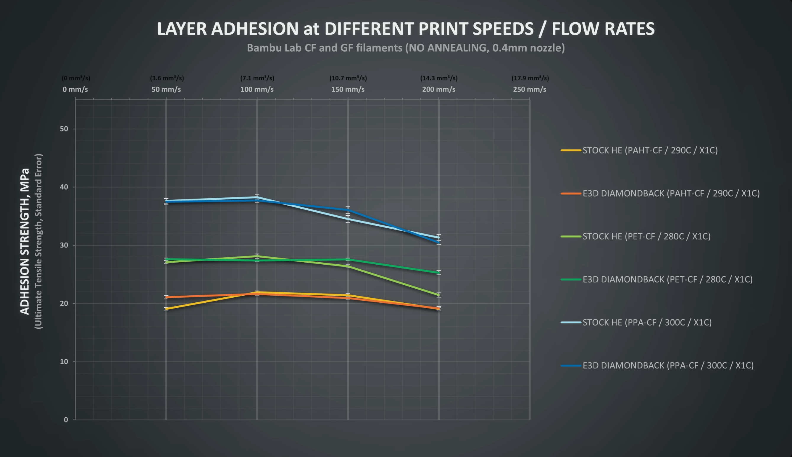
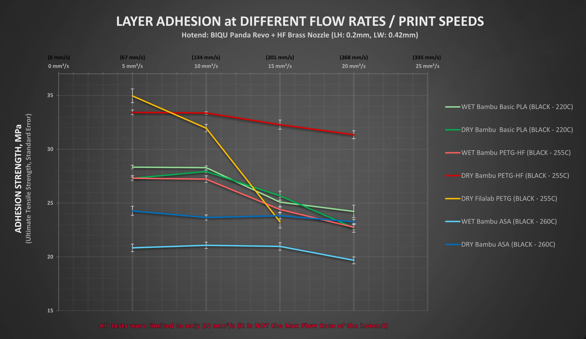

# Принципы прочной печати

<iframe width="800" height="450" src="https://www.youtube.com/embed/nT8IvIctndk?si=rGwEnts7DB9fXgdf" title="YouTube video player" frameborder="0" allow="accelerometer; autoplay; clipboard-write; encrypted-media; gyroscope; picture-in-picture; web-share" referrerpolicy="strict-origin-when-cross-origin" allowfullscreen></iframe>

В этой статье будут рассказаны методики, благодаря которым можно получить более прочные детали. Статья в большей степени ориентирована на плохо спекающиеся материалы, такие как ABS, ASA, HIPS, PC, PA6 и прочие. Но для большинства других материалов описанные методики тоже будут работать.

## Готовый рецепт

Понимая, что большой части печатников не хочется глубоко зарываться в теорию, а хочется просто готовый рецепт, я сделал таблицу со "средней температурой по больнице". Она не заменит вам прочтение этой статьи целиком, и ни в коем случае не является волшебной таблеткой "сделать хорошо". Но она может являться отправной точкой для самых распространенных случаев.

| Параметр | Обозначение | Значение | Комментарий |
| :------- | :---------: | :------: | :---------- |
| Ширины линий | $W$ | $1.5 * \phi_{сопла}$ | Если требуется высокая детализация, то для внешних периметров можно уменьшить. Также рекомендуется ставить 100% от $\phi$ для поддержек т.к. для них повышенная прочность даже вредна |
| Толщина слоя | $H$ | $\le 0.33 * W$ |  |
| Кол-во периметров | $N_{p}$ | $\dfrac{[2 \dots 4]}{W}$ | Количество периметров подбирается таким образом, чтобы толщина стенки была от 2 до 4 миллиметров |
| Толщина крышки и дна | - | $[2 \dots 4]$ | Равна толщине стенки ($N_{p} * W$) |
| Ограничение объёмного расхода | $Q_{lim}$ | $[0.25 \dots 0.5] * Q_{max}$ | Ограничение объёмного расхода зависит от производительности хотэнда. Для лучшей прочности рекомендуется ставить примерно четверть от максимальной производительности хотэнда. Для большей скорости печати можно повышать расход вплоть до примерно половины от максимального объёмного расхода хотэнда |
| Скорость движения печатающей головы | $V$ | $\ge \dfrac{Q_{lim}}{W * H}$ | Лучше всего поставить большие ограничения скоростей движения печатающей головы в слайсере. А реальную скорость печати ограничивать изменением ограничения объёмного расхода |
| Обдув | - | 0% | Так как обдув негативно влияет на прочность деталей, стоит общую часть детали печатать без него. А включать обдув только на элементах, которые без него пропечатать не получается: нависаниях, мостах, мелких элементах и т.д. |

Также есть другие параметры, настройка которых может повлиять на прочность деталей. Подробнее в видео или в соответствующем подразделе ниже.

## Ширина линий

Имеющиеся на сегодняшний день [тесты](https://youtu.be/9YaJ0wSKKHA?si=rqsQgO97AcGa4ukK){ target="_blank" } содержат некоторые незначительные противоречия, но, тем не менее, за неимением других данных можно использовать и эти. При тесте специальных образцов относительно небольшого сечения получилось, что максимальная прочность достигается при ширине линий приблизительно 150% от диаметра сопла. Дальше демонстрируется падение прочности. По тестам на разрыв крюков большего сечения, увеличение прочности демонстрируется и дальше, на 200%. Учитывая оба эти теста, а также тот фактор, что при печати линий шириной более 150% от диаметра сопла немного ухудшается внешний вид, считаю что оптимально ставить именно 150% от диаметра сопла.

При таком увеличении ширины линии будет теряться детализация деталей, так что, если она очень важна, то для линий внешнего периметра можно оставить ширину линий сопоставимой с диаметром сопла. В таком случае небольшую потерю прочности из-за уменьшения толщины стенки и неоптимального режима печати внешнего периметра можно будет компенсировать увеличением количества периметров.

## Толщина слоя

Согласно [тестам](https://www.youtube.com/watch?v=fbSQvJJjw2Q){ target="_blank" }, наилучшие результаты по прочности будут при толщине слоя ~0.15мм для ширины линий 0.4мм. При этом возникает вопрос, что в данном случае важнее, абсолютное или относительное значение толщины слоя. Ответ есть в [другом тесте](https://www.youtube.com/watch?v=QfASQ8VgAbk){ target="_blank" }. В нём наибольшую прочность при ширине линии 0.84мм дала толщина слоя 0.3мм. Иными словами, оптимальной толщиной слоя для печати технических моделей является ~1/3 от ширины линии.

## Периметры, крышка, дно и заполнение

Согласно тестам [1](https://www.youtube.com/watch?v=AmEaNAwFSfI){ target="_blank" } и [2](https://www.youtube.com/watch?v=upELI0HmzHc){ target="_blank" }, больше всего на прочность деталей влияет толщина оболочки, то есть стенок, крышки и дна. От заполнения прочность деталей зависит только во вторую очередь. Да и нелинейно, то есть до плотности примерно 30-50% прочность деталей почти не растёт, а потом уже проще сразу поставить 100%. Следовательно, оптимально будет выставлять такие настройки под разные сценарии печати:

| Параметр | Умеренная прочность | Высокая прочность | Максимальная прочность |
| :------- | :-----------------: | :---------------: | :--------------------: |
| Количество периметров | $\dfrac{2}{W}$ | $\dfrac{4}{W}$ | $\dfrac{4}{W}$ |
| Толщина крышки | $2$ | $4$ | $4$ |
| Толщина дна | $2$ | $4$ | $4$ |
| Шаблон заполнения | Кубический | Кубический | Кубический |
| Плотность заполнения | $[5 \dots 10] %$ | $[5 \dots 10] %$ | $100 %$ |

Где:
$W$ - ширина линии внутренних периметров

## Ограничение объёмного расхода

Зависимость прочности от объёмного расхода исследовалась в множестве тестов: [1](https://youtu.be/QsFdZYigH1g?si=XFtz-QG2BWpjwRDn){ target="_blank" }, [2](https://youtu.be/kignWSzLD7I?si=U7PcWJqOERJi4qfv){ target="_blank" }, [3](https://youtu.be/USeTuR-uOXA?si=gWia5RYC_4eZWQyN){ target="_blank" }, [4](https://youtu.be/PPyiACzsLWM?si=L_N3_jgQ-5H5zR0t){ target="_blank" }, [5](https://youtu.be/SWKhB_4WTkc?si=-3uc7JNNjsq6zrUN){ target="_blank" }. Согласно этим тестам, прочность деталей сначала растёт до определённого расхода, а потом падает. Происходит это из-за того, что до определённого расхода хотэнд нормально справляется с прогревом филамента, но при этом падает время печати слоя и, следовательно, тот не успевает так сильно остыть. А после этого расхода хотэнд начинает сильно недогревать филамент, что даёт падение прочности выше, чем прирост от уменьшения времени слоя. Иными словами, оптимально будет печатать на определённом объёмном расходе.

| Хотэнд | Максимальная прочность | Побыстрее |
| :----- | :--------------------: | :-------: |
| V6 | $4 \space мм^3/с$ | $8 \space мм^3/с$ |
| Volcano | $6 \space мм^3/с$ | $13 \space мм^3/с$ |
| Goliath | $12 \space мм^3/с$ | $25 \space мм^3/с$ |

Для неуказанных хотэндов расход подбирается исходя из того, к какому из указанных он ближе по конструкции.

!!! warning "Не забудьте выставить ограничения скорости движения печатающей головы на разных элементах таким образом, чтобы они не ограничивали объёмный расход ниже того, что указан в профиле материала"

## Температуры хотэнда и стола

Тесты зависимости прочности поперёк слоёв от температуры хотэнда есть, но они противоречивы, а также имеют проблемы в методологии. Поэтому на данный момент не остаётся ничего другого, кроме как пользоваться общепринятыми температурами печати для разных филаментов:

| Филамент | t° хотэнда | t° стола |
| :------- | :---------: | :-------: |
| PLA | $210°C$ | $60°C$ |
| PETG | $235°C$ | $75°C$ |
| ABS / ASA | $280°C$ | $110°C$ |
| HIPS | $270°C$ | $100°C$ |
| PC | $280°C$ | $120°C$ |
| PA12 | $250°C$ | $100°C$ |
| PA6 / PA6.6 | $320°C$ | $130°C$ |
| PP | $280°C$ | $130°C$ |

## Температура термокамеры

Согласно [тестам](https://youtu.be/WrQiUL0jAzc?si=8x_9rUfFUZAYFxHp){ target="_blank" }, прочность зависит от температуры воздуха вблизи печатаемой модели. Пассивная термокамера обычно способна стабильно держать температуру около 40-50°С. Такое повышение температуры способно увеличить прочность поперёк слоёв деталей из ABS на примерно 7%, а из PC на примерно 11%. Учитывая, что такая термокамера уже есть на большом количестве принтеров, а на принтерах, где её нет, её легко получить просто помещением принтера в коробку или шкаф, то прирост для "бесплатного" выглядит значимым, но не критически важным.

Активная термокамера, способная прогреть воздух внутри до ~60-65°С, увеличивает прочность деталей поперёк слоёв на ~20-50%. Это крайне значимая разница, но принтеры с активной термокамерой довольно редки и, обычно, дорого стоят. 

Температуру в термокамере стоит ставить как можно выше, но чтобы она была не больше температуры размягчения печатаемого филамента, а также чтобы её могли вынести элементы внутри принтера.

## Охлаждение

Согласно [тестам](https://www.youtube.com/watch?v=Bl2ESvtBiLo){ target="_blank" }, а также практическим наблюдениям, чем сильнее охлаждаешь модель, тем меньше будет её прочность. Поэтому охлаждение надо настроить таким образом, чтобы обдув был выключен везде, кроме нависающих и мелких элементов. А на них дуть как можно слабее, но чтобы они не оплывали.

Настройка охлаждение - это относительно сложный процесс. Поэтому для ознакомления с ним лучше посмотрите соответствующий раздел в [видео про принципы прочной печати](https://youtu.be/nT8IvIctndk?si=naiIZLLFm18syMOk){ target="_blank" }.

## Шов

Шов - это разрыв в дорожке. В месте, где располагается шов, уменьшается прочность детали. Поэтому важно расположить шов на ненагруженных участках детали, а также оптимизировать его настройки таким образом, чтобы минимизировать потери прочности.

| Параметр | Значение | Комментарий |
| :------- | :------: | :---------- |
| Расположение шва | Выровненный | Самый прочный вариант - "случайный". Но так деталь будет в дефектах. Поэтому лучше выбрать "выровненный" и расположить шов в ненагруженном месте детали |
| Смещение внутренних швов | Вкл. |  |
| Зазор шва | $0%$ | Если при 0% в шве будут пропуски, то можно поставить даже отрицательное значение |
| Косой шов | По ситуации | Теоретически, косой шов должен быть прочнее всего. Но в некоторых случаях он может вызывать дефекты, из-за которых его применение будет нежелательным. Так что пользуйтесь им по ситуации |

## Поддержки

В целом, поддержки на прочность напрямую не влияют. Но некоторые элементы деталей, например, сильные нависания или мосты, можно печатать либо с поддержками, либо с сильным охлаждением. В таком случае для прочности лучше печатать на поддержках и без охлаждения.

## Уменьшить откат при заполнении

Параметр "уменьшить откат при заполнении" надо обязательно выключать т.к., мало того, что он может создать дефекты на внешней поверхности, так он еще и прочность может уменьшить.

## Влажность филамента

По имеющимся на момент написания статьи [тестам](https://youtu.be/USeTuR-uOXA?si=hFQPfco9cxKwHQDv){ target="_blank" }, даже 4 дней на открытом воздухе некоторым филаментам хватает, чтобы детали из них стали заметно менее прочными. Поэтому очень важно просушить филамент после покупки, после чего поместить его в драйбокс с силикагелем, чтобы он оставался сухим.

!!! note "PP и SBS - единственные 2 распространённых вида филамента, которые не вбирают влагу из воздуха. Их сушить не нужно" 