---

authors:
  - makarov
title: Обзор Sovol SV08
icon: material/printer-3d
---

# Обзор Sovol SV08

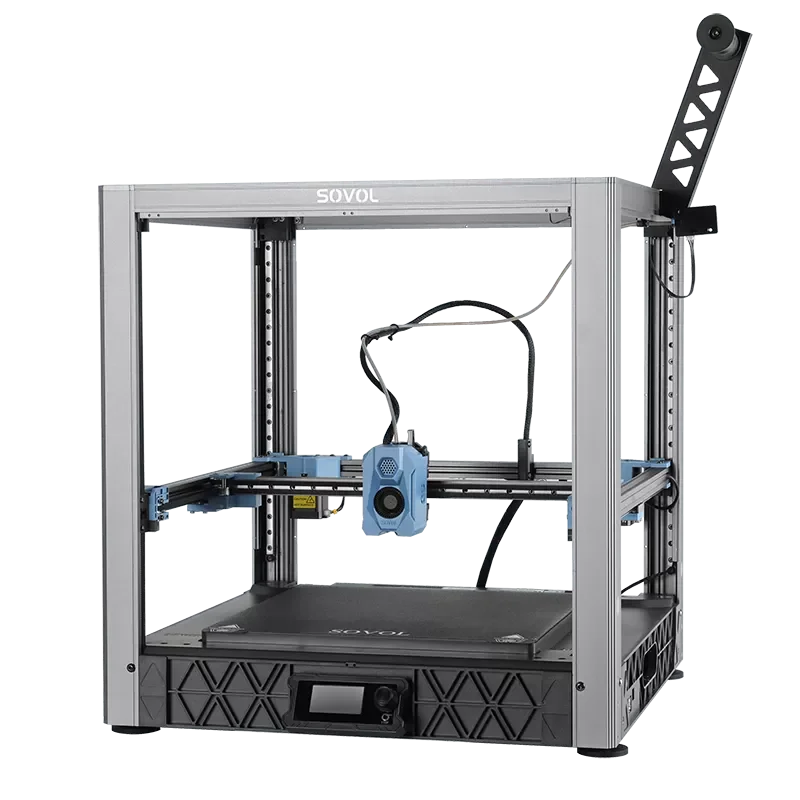

## Про покупку

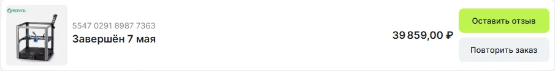

Экземпляр для обзора был куплен в официальном магазине Sovol на AliExress. Ссылку на него можно найти в [3D рекомендаторе](../../part-navi/printers.md). Цена варьируется от 35-40 тысяч рублей в период распродаж до 50-55 в обычное время. Доставка с российского склада, в моём случае курьером прямо до двери. На других площадках, как правило, цена значительно выше, поэтому смысла покупать там я не вижу.

## При чём здесь Voron V2.4

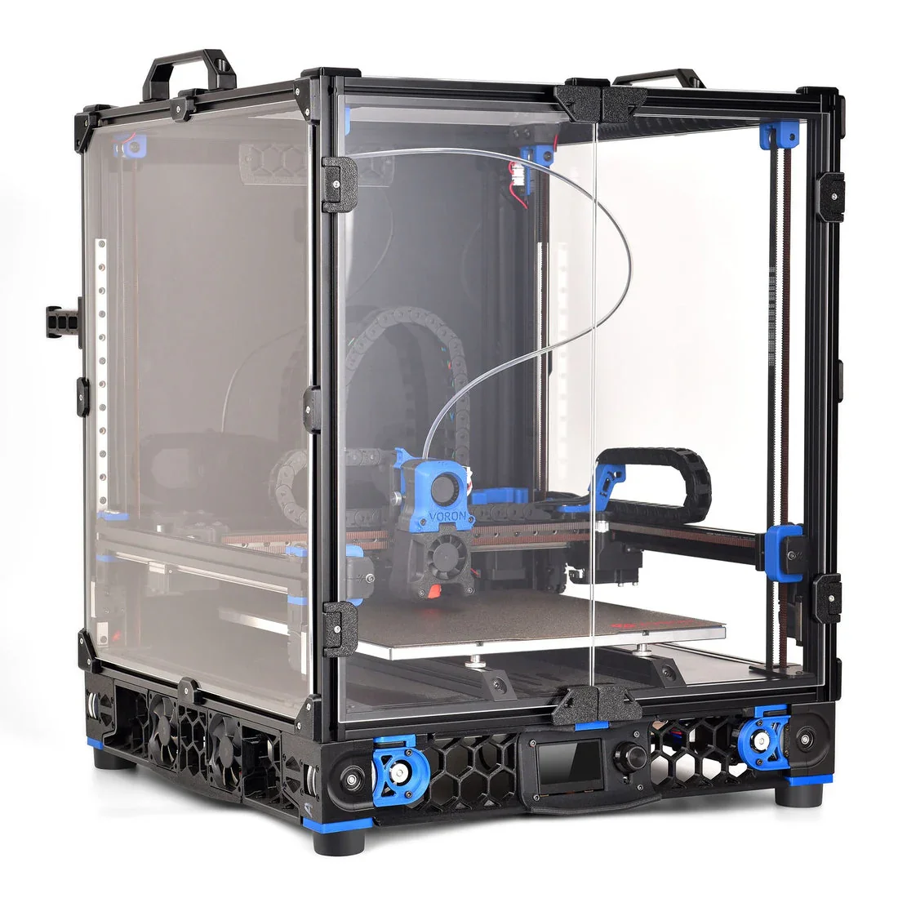

Сами Sovol и многие обзорщики позиционируют SV08 как более дешёвый и простой в сборке аналог Voron V2.4, самого популярного самосборного 3д принтера в мире. Изначально сборка Ворона предполагала покупку всех деталей отдельно. Затем появились kit-наборы, решившие проблему заказа деталей. Логичным продолжением был бы серийный вариант, который и собирать-то особо не нужно будет. Однако, несмотря на внешнее сходство, агрегаты и модификации от оригинального проекта не подходят к SV08. Получается, что Sovol SV08 - не серийный Ворон, а именно что аналог, который следует рассматривать как отдельный принтер.

## Немного про open-source

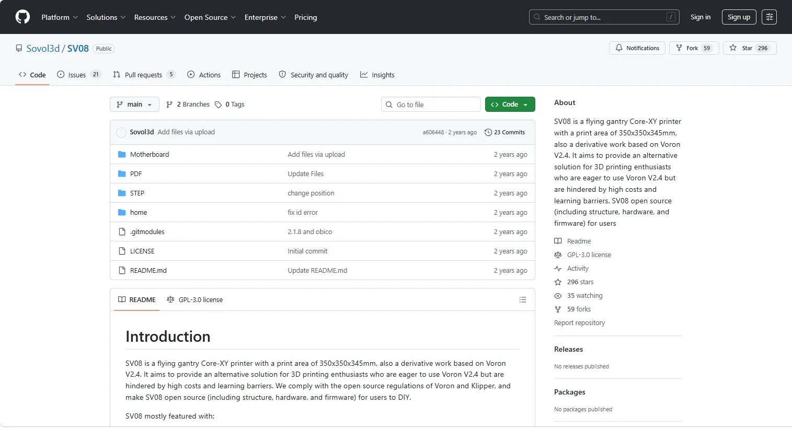 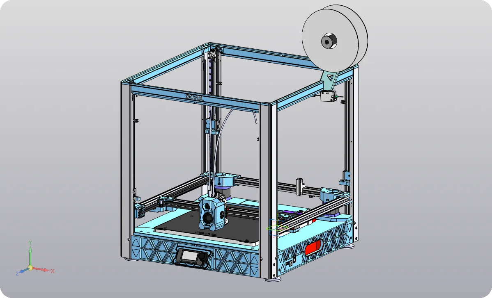

SV08 является open-source проектом в силу родства с Вороном. CAD-модель принтера в формате .step, чертежи большинства деталей, спецификации большинства покупных изделий, а также исходники прошивки опубликованы на [github](https://github.com/Sovol3d/SV08). Для серийных 3д принтеров это редкость. Из популярных производителей политику open-source поддерживают разве что Prusa, и поддерживали Creality в момент выхода первого Ender 3. Остальные же в лучшем случае дают доступ к конфигурации прошивки. Если использовать принтер в заводском исполнении, это не будет играть большой роли, зато в случае доработок значительно упростит процесс.

## Сборка


SV08 поставляется в виде предсобранных узлов, а не полностью собранным, как большинство современных принтеров. Так логистика выходит дешевле, а вероятность повреждения при доставке - значительно ниже. Сборка занимает около полутора часов в размеренном темпе и вряд ли доставит проблем, если внимательно читать инструкцию. Узлы встают друг относительно друга с небольшим перекосом, регулировок не предусмотрено. Проблем с точностью печати или быстрым износом ни я, ни другие владельцы SV08 не замечали. Но всё же неприятно, что принтер, рассчитанный в том числе на энтузистов, не даёт возможности ровно себя собрать.

## Механика

### Тест Input Shaping

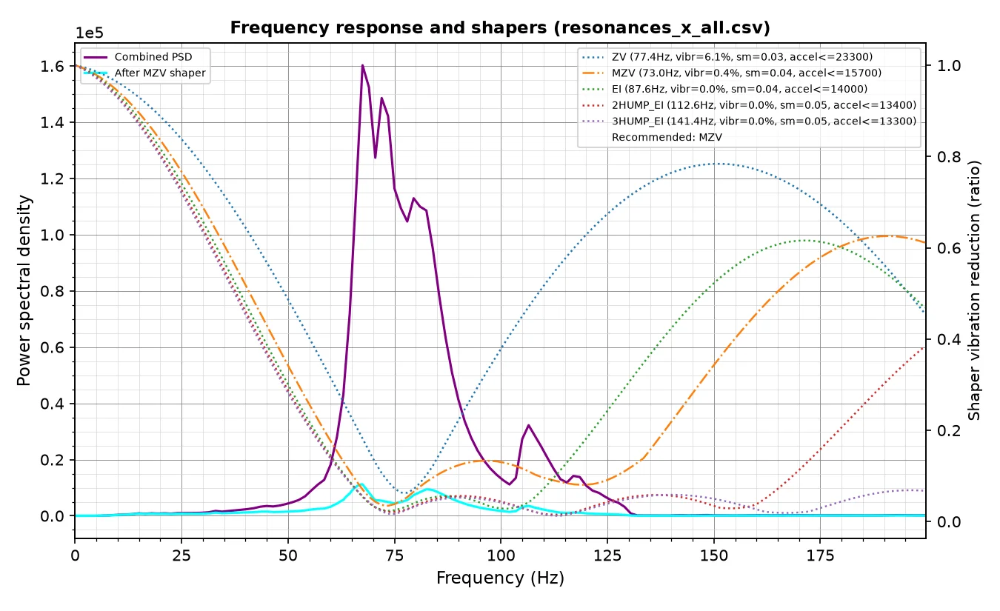
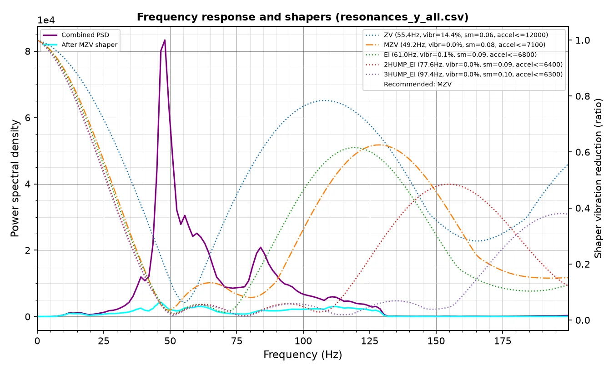

Тесты проводилились в 27 различных точках области печати: около минимальной, средней и максимальной координаты по каждой оси. Шейпер подбирался так, чтобы загасить одновременно все измеренные резонансы. С ним клиппер рекомендует ускорения 7100 мм/с2. Результат хороший для серийного принтера с такой областью печати.

На [отдельной страничке](./sv08_is.md) сделал расширенную версию графика, где можно наглядно увидеть поведение графика в различных координатах области печати. 

### Тест VFA


Выше 130 мм/с ряби нет. На более низких скоростях есть везде, но есть участки с небольшой амплитудой по обеим осям: 20-30 и 80-100 мм/с. Приемлемо.

### Тест точности


До [калибровки точности](../../../calibrations/accuracy/) SV08 даёт ошибку до 0.65 мм на 145 мм. После калибровки размеры на тестовой модели укладывается в ±0.1 мм – хороший результат.

## Стол


Стол – 4 мм алюминиевая плита с 2 мм магнитом. Нагреватель 220 В в виде плоских дорожек, распределённых равномерно по всей площади. Мощности 1 кВт хватает чтобы без проблем греть стол до максимальной температуры чуть больше, чем за пять минут.


Перепад высот порядка 0.3-0.4 мм сохраняется при различных температурах. Для такого размера вполне приемлемо, при желании можно дополнительно уменьшить перепад наклеиванием скотча.


Крепление стола в новых ревизиях принтера сделано интересно. Одна точка в центре жёстко крепится к пластиковому корыту под ним, остальные четыре закреплены как на фото выше и имеют подвижность около миллиметра в плоскости XY. Благодаря этому стол может свободно расширяться при нагреве, и его почти не выгибает. Наличие винтов и пружин теоретически даёт возможность регулировать наклон стола, однако винты не законтрены и могут раскручиваться, если не будут протянуты.


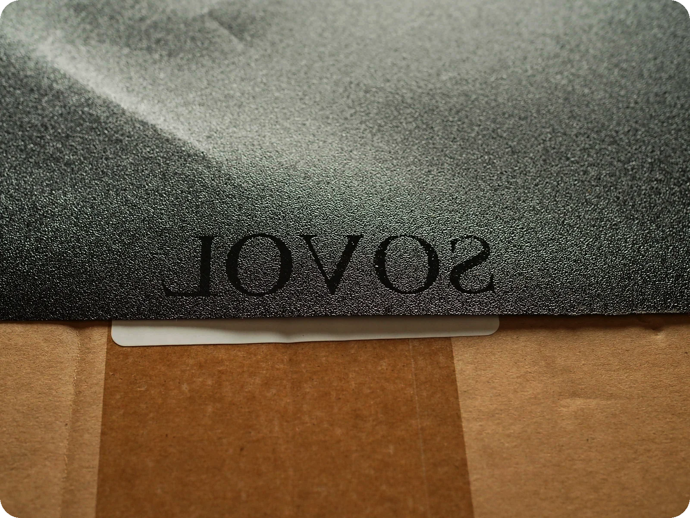

Покрытие стола - стальной лист с PEI покрытием с одной стороны и порошковой окраской с другой. Пиктограммы на стороне с PEI нанесены краской и отпечатываются на детали. На окрашеной стороне печатать теоретически можно, если использовать адгезив.

## Печатающая голова


### Тест объёмного расхода

```vegalite
{
  "$schema": "https://vega.github.io/schema/vega-lite/v5.json",
  "title": {
    "text": "SV08 flow test",
    "subtitle": "PETG; 235ºC",
    "fontSize": 20,
    "subtitleFontSize": 16
  },
  "description": "",
  "width": "container",
  "height": 800,
  "autosize": "pad",
  "data": {
    "values": [
      {
        "hotend": "Theory",
        "Requested_flow": 0,
        "Measured_flow": 0,
        "skipping": true
      },
      {
        "hotend": "Theory",
        "Requested_flow": 100,
        "Measured_flow": 100,
        "skipping": true
      },
      {
        "hotend": "SV08 stock",
        "Requested_flow": 5,
        "Measured_flow": 5,
        "skipping": false
      },
      {
        "hotend": "SV08 stock",
        "Requested_flow": 10,
        "Measured_flow": 9.4,
        "skipping": false
      },
      {
        "hotend": "SV08 stock",
        "Requested_flow": 15,
        "Measured_flow": 13.08,
        "skipping": false
      },
      {
        "hotend": "SV08 stock",
        "Requested_flow": 20,
        "Measured_flow": 14.76,
        "skipping": false
      },
      {
        "hotend": "SV08 stock",
        "Requested_flow": 25,
        "Measured_flow": 17.15,
        "skipping": false
      },
      {
        "hotend": "SV08 fixed",
        "Requested_flow": 5,
        "Measured_flow": 4.9,
        "skipping": false
      },
      {
        "hotend": "SV08 fixed",
        "Requested_flow": 10,
        "Measured_flow": 9.68,
        "skipping": false
      },
      {
        "hotend": "SV08 fixed",
        "Requested_flow": 15,
        "Measured_flow": 14.4,
        "skipping": false
      },
      {
        "hotend": "SV08 fixed",
        "Requested_flow": 20,
        "Measured_flow": 18.8,
        "skipping": false
      },
      {
        "hotend": "SV08 fixed",
        "Requested_flow": 20,
        "Measured_flow": 18.8,
        "skipping": true
      },
      {
        "hotend": "SV08 fixed",
        "Requested_flow": 25,
        "Measured_flow": 18.425,
        "skipping": true
      },
      {
        "hotend": "Volcano + BMG",
        "Requested_flow": 5,
        "Measured_flow": 4.887,
        "skipping": false
      },
      {
        "hotend": "Volcano + BMG",
        "Requested_flow": 10,
        "Measured_flow": 9.645,
        "skipping": false
      },
      {
        "hotend": "Volcano + BMG",
        "Requested_flow": 15,
        "Measured_flow": 14.283,
        "skipping": false
      },
      {
        "hotend": "Volcano + BMG",
        "Requested_flow": 20,
        "Measured_flow": 19.044,
        "skipping": false
      },
      {
        "hotend": "Volcano + BMG",
        "Requested_flow": 25,
        "Measured_flow": 22.6825,
        "skipping": false
      },
      {
        "hotend": "Volcano + BMG",
        "Requested_flow": 25,
        "Measured_flow": 22.6825,
        "skipping": true
      },
      {
        "hotend": "Volcano + BMG",
        "Requested_flow": 30,
        "Measured_flow": 22.44,
        "skipping": true
      }
    ]
  },
  "layer": [
    {
      "mark": {
        "type": "line",
        "point": {"size": 100},
        "clip": true,
        "strokeWidth": 3,
        "tooltip": true
      },
      "encoding": {
        "x": {
          "field": "Requested_flow",
          "type": "quantitative",
          "scale": {"domainMin": 5, "domainMax": 30},
          "axis": {
            "title": "Requested flow, [mm^3/s]",
            "titleFontSize": 16,
            "labelFontSize": 14
          }
        },
        "y": {
          "field": "Measured_flow",
          "type": "quantitative",
          "scale": {"domainMin": 5, "domainMax": 30},
          "axis": {
            "title": "Measured flow, [mm^3/s]",
            "titleFontSize": 16,
            "labelFontSize": 14
          }
        },
        "color": {
          "field": "hotend",
          "type": "nominal",
          "legend": {
            "orient": "top",
            "titleFontSize": 14,
            "labelFontSize": 14,
            "rowPadding": 5,
            "padding": 3,
            "columns": {
              "expr": "floor(width / 155) == 0 ? 1 : floor(width / 155)"
            }
          },
          "scale": {
            "domain": [
              "Theory",
              "SV08 stock",
              "SV08 fixed",
              "Volcano + BMG"
            ],
            "range": [
              "#7f7f7f",
              "#1F78B5",
              "#AEC7E8",
              "#FF7F0D"
            ]
          }
        },
        "opacity": {"condition": {"param": "hotend", "value": 1}, "value": 0.2},
        "strokeDash": {"field": "skipping", "type": "nominal", "legend": null}
      },
      "params": [
        {
          "name": "hotend",
          "select": {"type": "point", "fields": ["hotend"]},
          "bind": "legend"
        }
      ]
    },
    {
      "mark": {
        "type": "text",
        "dx": 5,
        "dy": -10,
        "fontSize": 16,
        "align": "left",
        "clip": true
      },
      "encoding": {
        "x": {
          "field": "Requested_flow",
          "type": "quantitative",
          "scale": {"domainMin": 5, "domainMax": 30}
        },
        "y": {
          "field": "Measured_flow",
          "type": "quantitative",
          "scale": {"domainMin": 5, "domainMax": 30}
        },
        "text": {"field": "Measured_flow"},
        "opacity": {
          "condition": {"param": "hotend", "empty": false, "value": 1},
          "value": 0
        },
        "color": {"field": "hotend"}
      }
    }
  ]
}
```

В стоке у SV08 измернный расход значительно отличается от запрошенного, хотя у Volcano + BMG такого не наблюдается. В реальной печати это приведёт либо к переэкструзии на медленных участках, либо к недоэкструзии на быстрых, смотря как множитель потока настроите. Скорее всего, дело в том, что у BMG зубцы значительно острее, из-за чего им проще заглубляться в пруток и не проскальзывать по нему.
 
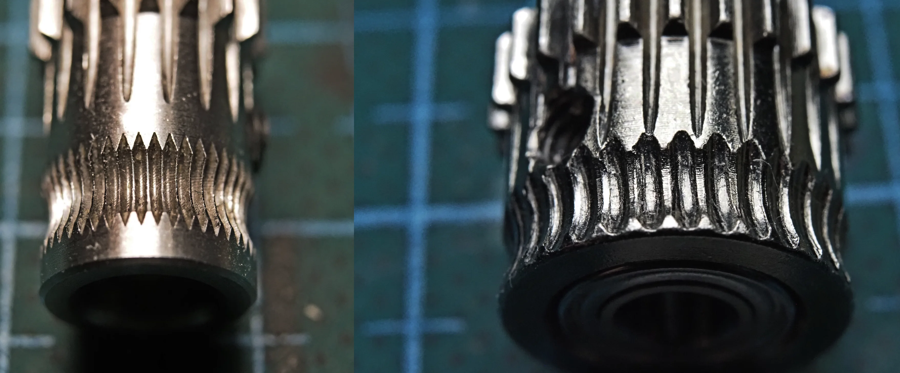

Для проверки этой теории я притянул лапку к корпусу фидера не через пружину, как было в стоке, а жёстко винтом М3х12. Это действительно помогло. В итоге экструдер SV08 ведёт себя аналогично Volcano + BMG, но сдаётся немного раньше. Возможно, хотенд чуть медленнее плавит пруток, возможно момент у фидера поменьше.

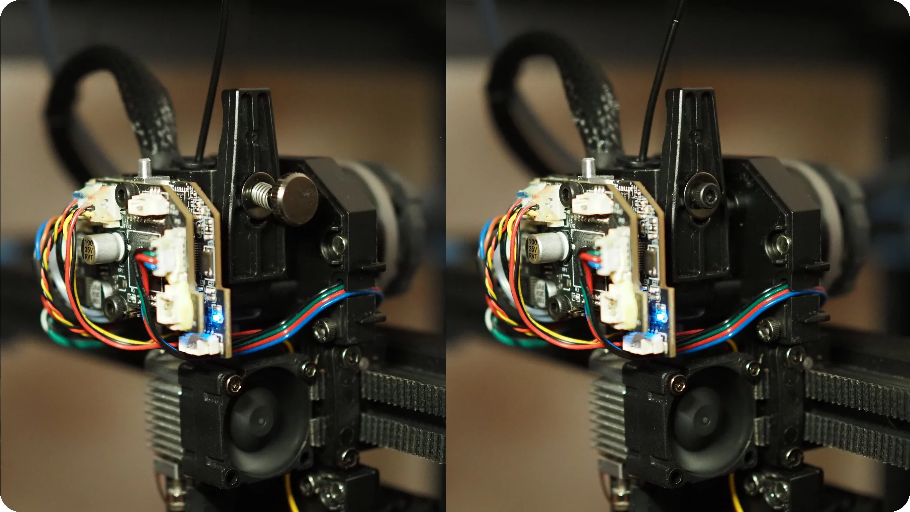

### Тест обдува модели


Тест на PETG печатается без дефектов до 75° при 100% обдуве. Шум при этом как от пылесоса, без преувеличений. Если придушить обороты до 37%, то уровень шума становится аналогичен обдуву Bambu Lab A1 на 100% оборотов, а тест печатается до 70°. Результат отличный, производительности кулера явно достаточно.

### TPU

Со средне-мягким TPU 95A родной экструдер SV08 справляется весьма условно. Калибровка Pressure Advance даёт значение порядка 0.4, но при печати реальной модели пруток почти сразу перестаёт подаваться. С выключенным PA печатать идёт стабильно, но скорость приходится снижать.

### Композиты

В стоке SV08 неспособен печатать композитными материалами, так как родные подающие колёса плохо цепляют твёрдый композитный пруток, а родное сопло неизносостойкое и несъёмное.

## Электроника

### Прошивка

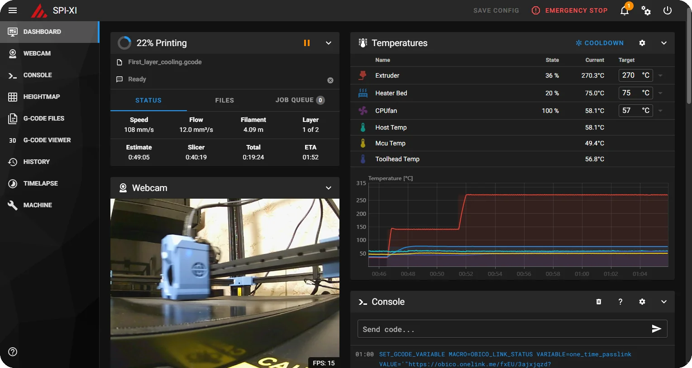

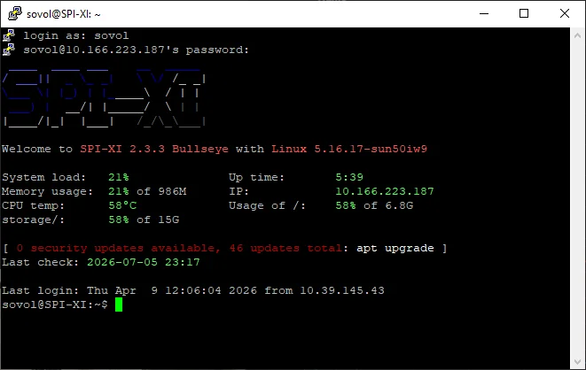

Электроника работает под управлением klipper не самой свежей версии 0.12 с изменениями от производителя. Полноценная веб-морда есть, подключиться по ssh можно. При желании можно накатить и чистый клиппер свежих версий.

### SoC


Железо тут вполне адекватное: микроконтроллеры в основной и переходной платах stm32f103, процессор allwinner h616, драйверы 2209 с подключением по UART на все оси. К процессору и драйверам вопросов прям совсем нет, такие же используются в большинстве самосборных принтеров. MCU может быть слабоват для быстрого принтера с шестью шаговиками, но мне не удалось уронить его в ошибку даже печать сложных моделей с завышенными ускорениями и square_corner_velocity и дроблением шага 1/256 на осях XY.


Подключение принтера к сети осуществляется либо по Wi-Fi 2.4 ГГц, либо с помощью Ethernet кабеля. Есть два USB и один HDMI. Можно пихать дополнительные мцу, флешки, веб-камеры, сенсорные экранчики. Почему-то все разъёмы вывели на правый бок принтера, а не на морду, где ими было бы удобнее пользоваться. Тем более, что торчащие справа провода будут отнимать лишнее пространство, а спереди оно и так зарезервировано под экран.

### Экран


Экран - самый простой 12864. Для сценариев "загрузить/выгрузить филамент", "запустить/остановить печать", "настроить z-offset" его хватает. Для более продвинутых можно подключиться к веб-интерфейсу с телефона.

## Удобство использования и надёжность

### Подвижный портал осей XY

Выглядит красиво, голову обслуживать удобнее, чем на традиционных corexy, да и модель видно лучше. А вот при доработке под высокотемпературную печать он подкинет проблем. Во-первых, нагреватели камеры, фильтры и прочие модули придётся крепить в подвале или за габаритами рамы, чтобы они не мешали движению портала. Во-вторых, моторы осей XY будут греться сильнее, так как находятся внутри термокамеры.

### Независимые приводы оси Z

Не имеют преимуществ вообще. Перед каждой печатью нужно парковать каждый привод индивидуально – это лишнее время. Парковка делается об стол – это потенциальное искривление портала, если стол не идеально плоский или установлен с наклоном. Ну и вишенка на торте: четыре шаговика и четыре драйвера, хотя можно было обойтись одним мотором с одним драйвером и синхроремнём.

### Направляющие

На всех осях стоят рельсовые направляющие: mgn12 c H картекой на X и mgn9 c H картекой на Y и Z. У меня они не люфтят и не заедают, от сообщества также нет отзывов о подобных проблемах.

### Натяжители ремней


Натяжители ремней на осях X, Y и Z одинаковые полуавтоматические. Есть винты, ограничивающие ход ползуна, так что при необходимости натяжение можно немного ослабить. Для корректной работы corexy кинематики этого достаточно.

###  Крышка печатающей головы


Крышка совмещена с обдувом модели, из-за чего провод кулера обдува модели приходится постоянно дёргать туда-сюда. Так как он тонкий, да ещё и в дубовой ПВХ изоляции, хватило его ненадолго. Кроме того, форма и габариты крышки мешают смотреть, что происходит рядом с соплом.   

### Переходная плата


Разъёмы на плате выбраны минимального размера, хотя по габаритам влезли бы и распространённые XH2.54. PH2.0 для нагревателя держит не более 2 ампер, чего даже для родного хотенда маловато, не говоря о более мощных. Picoblade для всего остального были бы приемлемы в обычном серийном принтере, но в SV08 добавят заморочек при апгрейдах. Бонусом все разъёмы обильно залиты клеем, из-за чего при отсоединении легко повредить провода или сам разъём. В моём случае, например, развалился корпус разъёма шаговика.

### Датчик автоуровня

Индуктивный датчик автоуровня имеет температурный дрейф, из-за чего перед печатью необходимо парковать голову вблизи стола и ждать минут десять, пока горячий воздух нагреет датчик до более-менее стабильной температуры. В противном случае он будет показывать погоду на марсе. При первой печати после включения это не проблема, так как столу тоже нужно время, чтобы температура установилась. Но при последующих стол будет горячим, а датчик придётся снова греть.

### Редуктор подающего механизма


Планетарный редуктор в подающем механизме живёт менее тысячи часов, судя по отзывам пользователей. При этом одна шестерня редуктора интегрирована в корпус печатающей головы, а вторая запрессована на шаговике. В итоге при износе проще менять всю голову целиком, причём, желательно, сразу на кастомную без таких детских болячек.

### Датчик наличия филамента


Обычно на бюджетные принтеры лепят датчик типа “механический концевик в коробочке”. Такие работают посредственно и чаще вредят, чем помогают. Тут же внутри коробочки подпружиненная лапка с роликом, которая триггерит оптический концевик. По крайней мере с PETG и TPU 95A работает нормально, так что пусть будет.

### Прошивка

Доступ к конфигурации принтера сильно развязывает руки: если что-то не устраивает, это всегда можно поправить. С установкой апгрейдов также нет проблем: в большинстве случаев получится обойтись правкой конфига, в худшем - перейти на чистый клиппер.

### Шум

Основным источником шума является кулер обдува модели - 63 Дб в метре от принтера при полных оборотах. Но судя по тесту обдува, обороты можно придушить, и тогда шум упадёт до 54 Дб. Механика в стоке тоже шумная, так как драйверы работают в режиме SpreadCycle с дроблением шага 1/16. Если увеличить дробление шага до 1/256, шум становится заметно меньше. Конкретное значение измерить невозможно, так как шум зависит от скорости печати, но ориентировочно 55 Дб. Кулеры хотенда и электроники при печати не слышно. В целом, уровень шума сравним с другими corexy принтерами типа flashforge adventurer 5m и creality k1, а Bambu Lab A1 будет значительно тише, если не включать обдув модели на 100%.

## Выводы

Пора делать выводы. По механике SV08 не имеет каких-либо значимых проблем, при этом показывает хорошие для принтера таких габаритов ускорения и приемлемый уровень ряби. Стол достаточно ровный и способен греться до 115 градусов. Электроника бодрая, прошивка открытая. Однако, голова прям сильно портит ситуацию: буквально каждый из её компонентов имееткосяки той или иной степени критичности. Учитывая это, проще будет заменить её целиком на что-то нормальное, чем решать по очереди все проблемы. Получается, SV08 - принтер для тех, кто готов повозиться. А в таком случае можно не только голову заменить, но и стенки зашить, нагреватель камеры поставить, и получить хороший универсальный принтер с открытой прошивкой за мало денег. 