---

authors:
  - makarov
title: Обзор Sovol SV08
icon: material/printer-3d
---

# Обзор Sovol SV08

## Вступление

<video autoplay loop muted playsinline width="1024" height="428">
  <source src="../pics/sv08_mechanics.mp4" type="video/mp4">
</video>

Сами Sovol и многие обзорщики позиционируют SV08 как более дешёвый и простой в сборке аналог Voron V2.4 — самого популярного самосборного 3D-принтера в мире.

Изначально сборка Ворона предполагала покупку всех деталей отдельно. Затем появились kit-наборы, решившие проблему заказа деталей. Логичным продолжением стал бы серийный вариант, не требующий сборки.

Однако, несмотря на внешнее сходство, агрегаты и модификации от оригинального проекта не подходят к SV08. Получается, Sovol SV08 — не серийный Ворон, а его аналог, который следует рассматривать как самостоятельный принтер.

SV08 является open-source проектом в силу родства с Вороном. CAD-модель принтера в формате .step, чертежи большинства деталей, спецификации большинства покупных изделий, а также исходники прошивки опубликованы на [github](https://github.com/Sovol3d/SV08){ target="_blank" }.

Для серийных 3D-принтеров это редкость. Из популярных производителей политику open-source поддерживают разве что Prusa, а ещё поддерживала Creality в момент выхода первого Ender 3. Остальные же в лучшем случае дают доступ к конфигурации прошивки. В заводском исполнении это не так важно, зато при доработках значительно упрощает жизнь.

## Сборка

<div class="grid cards no-gap cols-2" markdown>

  - 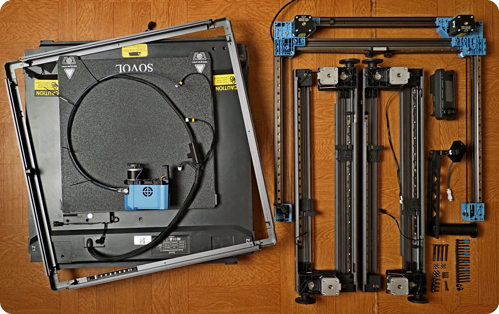
  - 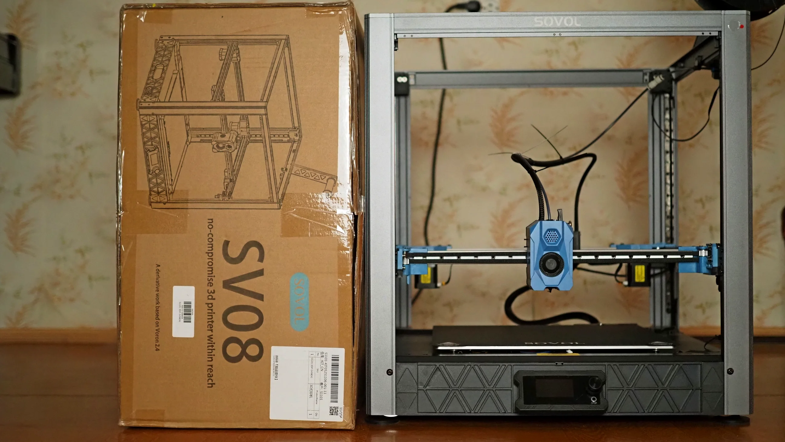

</div>

SV08 поставляется не полностью собранным, как большинство современных принтеров, а в виде предсобранных узлов. Это удешевляет логистику и значительно снижает риск повреждения при доставке.

Сборка занимает около полутора часов в спокойном темпе и при внимательном чтении инструкции проблем не вызывает. Узлы стыкуются с небольшим перекосом, регулировка не предусмотрена. Проблем с точностью печати или быстрым износом ни я, ни другие владельцы SV08 не замечали. Но всё же неприятно, что принтер, рассчитанный в том числе на энтузистов, не даёт возможности ровно себя собрать.

## Тесты механики

Поскольку по конструктиву Sovol SV08 идентичен опенсорсному Voron 2.4, а исходники механики принтера [выложены в открытый доступ](https://github.com/Sovol3d/SV08){ target="_blank" }, описывать механику не имеет смысла. Лучше покажу тесты:

### Input Shaping

<style>
  .graphs-controls { display: flex; flex-wrap: wrap; gap: 0.6em 1.5em;
    padding: 0.9em 1.1em; background: transparent;
    border: 1px solid var(--md-default-fg-color--light, #cccccc);
    border-radius: 6px; margin-bottom: 0.8em; align-items: flex-start;
    color: var(--md-default-fg-color, #222); }
  .graphs-controls label { font-size: 0.75rem; font-weight: 400; line-height: 1.8; }
  .graphs-controls select {
    margin-left: 0.4em; padding: 0.3em 1.6em 0.3em 0.65em;
    font: inherit; font-size: 0.75rem; line-height: 1.5;
    color: var(--md-default-fg-color, #222);
    background-color: var(--md-default-bg-color, #fff);
    -webkit-appearance: none; -moz-appearance: none; appearance: none;
    background-image:
      linear-gradient(45deg, transparent 50%,
        var(--md-default-fg-color--light, #888) 50%),
      linear-gradient(135deg, var(--md-default-fg-color--light, #888) 50%,
        transparent 50%);
    background-position: calc(100% - 0.95em) 50%, calc(100% - 0.55em) 50%;
    background-size: 0.4em 0.4em, 0.4em 0.4em;
    background-repeat: no-repeat;
    border: 1px solid var(--md-default-fg-color--light, #cccccc);
    border-radius: 0.4rem;
    cursor: pointer;
    transition: border-color 125ms, box-shadow 125ms;
  }
  .graphs-controls select:focus {
    outline: none;
    border-color: var(--md-primary-fg-color, #009485);
    box-shadow: 0 0 0 0.2rem var(--md-primary-fg-color--light, #00948533);
  }
  .graphs-ticks { display: flex; flex-wrap: wrap; gap: 0.3em 0.6em;
    padding: 0.7em 1em; background: transparent;
    border: 1px solid var(--md-default-fg-color--light, #cccccc);
    border-radius: 6px; margin-bottom: 0.8em;
    color: var(--md-default-fg-color, #222); }
  .graphs-ticks .curve-group { width: 100%; display: flex; flex-wrap: wrap;
    gap: 0.3em 0.6em; align-items: center; }
  .graphs-ticks .curve-group-hdr { font-weight: 700; font-size: 0.75rem;
    width: 100%; margin-top: 0.3em; line-height: 1.8; }
  .graphs-ticks .curve-row { display: flex; align-items: center; gap: 0.4em;
    font-size: 0.75rem; line-height: 1.8; }
  .graphs-ticks .curve-row input[type="checkbox"] { width: 15px; height: 15px; cursor: pointer; }
  .graphs-ticks .curve-row .curve-swatch { flex: 0 0 auto; display: block; }
  .graphs-ticks .curve-row span { font-family: monospace; }
  #gr_chart svg { border-radius: 8px; overflow: hidden; }
</style>

!!! note "Как читать график"

    График получен путём обработки кривых зависимости `PSD_XYZ` от частоты, снятых в 27 точках области печати: `X={25,175,350}`, `Y={25,175,350}`, `Z={20,175,340}`.

    Кривые распределяются на три группы по девять штук в соответствии с выбором в выпадающем списке <kbd>Изменение вдоль оси</kbd>. Например, при выборе оси `Z`, в одну группу попадут кривые, снятые в 9 точках с одинаковой `Z` координатой.

    Для кривых внутри каждой группы строится одна огибающая, которая и выводится на график.

<div id="gr_loader" style="color:#555;font-style:italic;margin:1em 0;">Загрузка визуализации…</div>

<div id="gr_controls" class="graphs-controls" style="display:none;">
  <div><label>Изменение вдоль оси:
    <select id="gr_group">
      <option value="x">по X</option>
      <option value="y">по Y</option>
      <option value="z" selected>по Z</option>
    </select>
  </label></div>
  <div><label>Шейпер:
    <select id="gr_excite">
      <option value="both" selected>X и Y</option>
      <option value="x">только X</option>
      <option value="y">только Y</option>
    </select>
  </label></div>
</div>

<div id="gr_ticks" class="graphs-ticks" style="display:none;"></div>
<div id="gr_chart" style="width:100%;"></div>

<script>
(async function() {
  const DATA_URL = '../data/envelopes.json';

  // Three fixed coordinates per axis.
  const XS = [25, 175, 325];
  const YS = [25, 175, 325];
  const ZS = [20, 175, 320];
  const fixedVals = { x: XS, y: YS, z: ZS };

  // Bright, distinct colors per fixed-coordinate value.
  //   low  (25 / 20)   -> green
  //   mid  (175)       -> orange
  //   high (325 / 320) -> purple
  const COLORS = ['#2CA02C', '#FF7F0E', '#9467BD'];

  // Vega-Lite dash patterns. Each pattern is a string of comma-separated
  // lengths; pairs (length, gap) repeat.
  //   X-возбуждение -> пунктир
  //   Y-возбуждение -> сплошная
  const DASH_BY_EXCITE = { x_axis: '4,3', y_axis: '1,0' };
  const DASH_BY_EXCITE_LIST = [DASH_BY_EXCITE.x_axis, DASH_BY_EXCITE.y_axis];
  const EXCITE_KEYS = ['x_axis', 'y_axis'];
  const EXCITE_LABELS = { x_axis: 'Шейпер оси X', y_axis: 'Шейпер оси Y' };

  const raw = await fetch(DATA_URL).then(r => r.json());

  // ── Vega loader ───────────────────────────────────────────────────────
  async function loadVega() {
    if (window.vegaEmbed) return;
    const load = (src) => new Promise((ok, fail) => {
      const s = document.createElement('script'); s.src = src;
      s.onload = ok; s.onerror = fail; document.head.appendChild(s);
    });
    document.getElementById('gr_loader').textContent = 'Загрузка библиотеки визуализации…';
    await load('https://cdn.jsdelivr.net/npm/vega@5/build/vega.min.js');
    await load('https://cdn.jsdelivr.net/npm/vega-lite@5/build/vega-lite.min.js');
    await load('https://cdn.jsdelivr.net/npm/vega-embed@6/build/vega-embed.min.js');
  }

  // ── Build the long-form dataset for the current view ──────────────────
  // One row per (freq, fixed-coord, excite). _label is the combined
  // legend entry, _val is the fixed coord (e.g. 20/175/320), _excite
  // is 'x_axis'/'y_axis'. _label is unique per curve, so it can drive
  // the single combined color encoding.
  function buildData(groupDim, excite) {
    const vals = fixedVals[groupDim];
    const freqs = raw.freq;
    const showX = excite === 'both' || excite === 'x';
    const showY = excite === 'both' || excite === 'y';
    const rows = [];
    vals.forEach((v) => {
      const vStr = String(v);
      if (showX) {
        const psd = raw.x_axis[groupDim][vStr];
        for (let k = 0; k < freqs.length; k++) {
          rows.push({
            freq: freqs[k], psd: psd[k],
            _val: vStr, _excite: 'x_axis',
            _label: `${groupDim.toUpperCase()}=${v} (${EXCITE_LABELS.x_axis})`,
          });
        }
      }
      if (showY) {
        const psd = raw.y_axis[groupDim][vStr];
        for (let k = 0; k < freqs.length; k++) {
          rows.push({
            freq: freqs[k], psd: psd[k],
            _val: vStr, _excite: 'y_axis',
            _label: `${groupDim.toUpperCase()}=${v} (${EXCITE_LABELS.y_axis})`,
          });
        }
      }
    });
    return rows;
  }

  // ── Read current checkbox state ──────────────────────────────────────
  // Returns { x_axis: { '20': true, '175': true, '320': true }, y_axis: {...} }
  function getTickStates() {
    const s = { x_axis: {}, y_axis: {} };
    document.querySelectorAll('#gr_ticks input[type="checkbox"]').forEach(cb => {
      const ex = cb.dataset.excite;     // 'x_axis' | 'y_axis'
      const v  = cb.dataset.val;        // string like '20'
      s[ex][v] = cb.checked;
    });
    return s;
  }

  // ── Build curves panel: groups by shaper, each row = checkbox + swatch + label ──
  function buildCurvesPanel(groupDim, excite) {
    const wrap = document.getElementById('gr_ticks');
    wrap.innerHTML = '';
    wrap.style.display = 'flex';

    const vals = fixedVals[groupDim];
    const dimLabel = groupDim.toUpperCase();
    const showX = excite === 'both' || excite === 'x';
    const showY = excite === 'both' || excite === 'y';
    const svgNS = 'http://www.w3.org/2000/svg';

    const groups = [
      ['x_axis', 'Шейпер оси X', showX, '4,3'],
      ['y_axis', 'Шейпер оси Y', showY, '1,0'],
    ].filter(([_, __, show]) => show);

    groups.forEach(([exKey, exLabel, _, dashStr]) => {
      const hdr = document.createElement('div');
      hdr.className = 'curve-group-hdr';
      hdr.textContent = exLabel;
      wrap.appendChild(hdr);

      const group = document.createElement('div');
      group.className = 'curve-group';
      vals.forEach((v, vi) => {
        const row = document.createElement('div');
        row.className = 'curve-row';

        const cb = document.createElement('input');
        cb.type = 'checkbox';
        cb.id = `gr_tick_${exKey}_${v}`;
        cb.checked = true;
        cb.dataset.excite = exKey;
        cb.dataset.val = String(v);
        cb.addEventListener('change', render);

        const svg = document.createElementNS(svgNS, 'svg');
        svg.setAttribute('width', '36');
        svg.setAttribute('height', '10');
        svg.classList.add('curve-swatch');
        const path = document.createElementNS(svgNS, 'path');
        path.setAttribute('d', 'M0,5 L36,5');
        path.setAttribute('stroke', COLORS[vi]);
        path.setAttribute('stroke-width', '3');
        path.setAttribute('fill', 'none');
        path.setAttribute('stroke-dasharray', dashStr);
        svg.appendChild(path);

        const sp = document.createElement('span');
        sp.textContent = `${dimLabel}=${v}`;

        row.appendChild(cb);
        row.appendChild(svg);
        row.appendChild(sp);
        group.appendChild(row);
      });
      wrap.appendChild(group);
    });
  }

  // ── Build Vega-Lite spec ─────────────────────────────────────────────
  // Single line layer. color encodes _label (combined curve name),
  // strokeDash encodes _excite. Visibility via pre-filtered data.
  function makeSpec(groupDim, excite, tickStates) {
    const vals = fixedVals[groupDim];
    const baseData = buildData(groupDim, excite);
    const dimLabel = groupDim.toUpperCase();
    const showX = excite === 'both' || excite === 'x';
    const showY = excite === 'both' || excite === 'y';

    // Add _visible per row, then pre-filter
    const data = baseData
      .map(d => ({
        ...d,
        _visible: tickStates[d._excite][String(d._val)] !== false ? 1 : 0,
      }))
      .filter(d => d._visible > 0);

    // yMax from visible rows
    let yMax = 0;
    data.forEach(d => { if (d.psd > yMax) yMax = d.psd; });
    yMax = Math.max(yMax * 1.08, 1);

    // Build legend domain/range: one entry per visible curve
    const legendDomain = [];
    const legendRange = [];
    vals.forEach((v) => {
      const vi = vals.indexOf(v);
      if (showX) {
        const lbl = `${dimLabel}=${v} (${EXCITE_LABELS.x_axis})`;
        legendDomain.push(lbl); legendRange.push(COLORS[vi]);
      }
      if (showY) {
        const lbl = `${dimLabel}=${v} (${EXCITE_LABELS.y_axis})`;
        legendDomain.push(lbl); legendRange.push(COLORS[vi]);
      }
    });

    const layers = [{
      data: { values: data },
      mark: { type: 'line', strokeWidth: 2.4, clip: true, tooltip: true },
      encoding: {
        x: { field: 'freq', type: 'quantitative',
             axis: { title: 'Частота (Гц)', titleFontSize: 13, labelFontSize: 11 },
             scale: { domain: [0, 200] } },
        y: { field: 'psd', type: 'quantitative',
             axis: { title: 'Power spectral density',
                     titleFontSize: 13, labelFontSize: 11, format: '~e' },
             scale: { domain: [0, yMax] } },
        color: {
          field: '_label', type: 'nominal',
          scale: { domain: legendDomain, range: legendRange },
          legend: null,
        },
        strokeDash: {
          field: '_excite', type: 'nominal',
          scale: { domain: EXCITE_KEYS, range: DASH_BY_EXCITE_LIST },
          legend: null,
        },
        detail: { field: '_label', type: 'nominal' },
      },
    }];

    return {
      $schema: 'https://vega.github.io/schema/vega-lite/v5.json',
      width: 'container',
      height: 480,
      autosize: { type: 'fit', contains: 'padding' },
      config: {
        axis: { labelFontSize: 11, titleFontSize: 13 },
        legend: { labelFontSize: 12, titleFontSize: 13 },
        view: { stroke: 'transparent' },
      },
      title: null,
      layer: layers,
    };
  }

  // ── State + render ───────────────────────────────────────────────────
  let curGroup = 'z', curExcite = 'both';

  async function render() {
    document.getElementById('gr_loader').style.display = 'none';
    document.getElementById('gr_controls').style.display = 'flex';
    const tickStates = getTickStates();
    const spec = makeSpec(curGroup, curExcite, tickStates);
    await vegaEmbed('#gr_chart', spec, {
      actions: false,
      renderer: 'svg',
    });
  }

  function initControls() {
    const sGroup  = document.getElementById('gr_group');
    const sExcite = document.getElementById('gr_excite');
    const onChange = () => {
      curGroup = sGroup.value;
      curExcite = sExcite.value;
      buildCurvesPanel(curGroup, curExcite);
      render();
    };
    sGroup.addEventListener('change', onChange);
    sExcite.addEventListener('change', onChange);
  }

  await loadVega();
  initControls();
  buildCurvesPanel(curGroup, curExcite);
  render();
})();
</script>

Тесты проводились в 27 различных точках области печати: около минимальной, средней и максимальной координаты по каждой оси. Шейпер подбирался так, чтобы загасить одновременно все измеренные резонансы. С ним клиппер рекомендует ускорения 7100 мм/с². Результат хороший для серийного принтера с такой областью печати.

### VFA (рябь)

<figure markdown="span">
    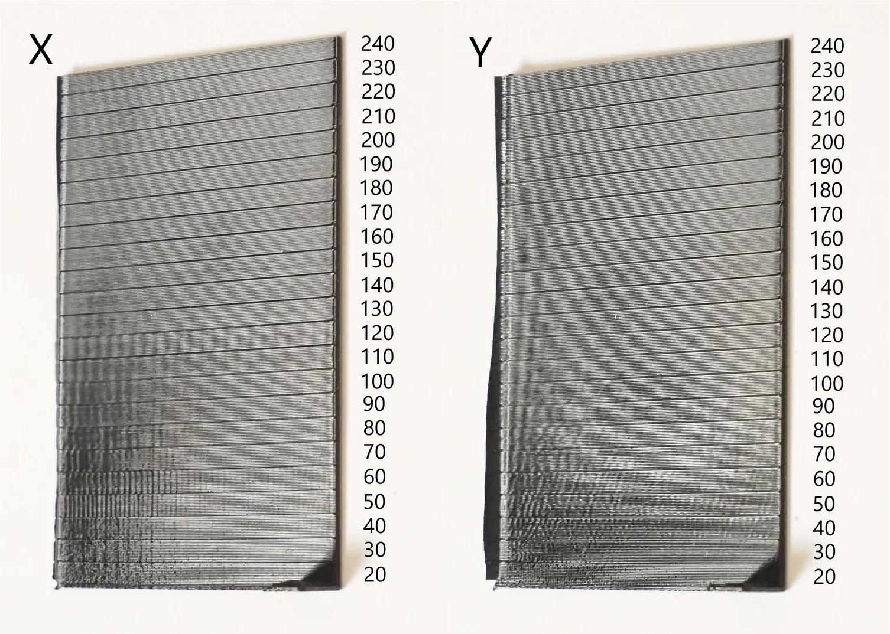{width="600" }
</figure>

Выше 130 мм/с ряби нет. На более низких скоростях есть везде, но есть участки с небольшой амплитудой по обеим осям: 20-30 и 80-100 мм/с. Приемлемо.

### Точность

<figure markdown="span">
    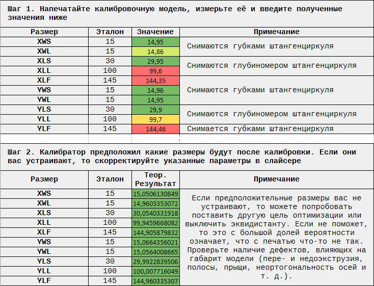{width="600"}
</figure>

До [калибровки точности](../../calibrations/accuracy/) SV08 даёт ошибку до 0.65 мм на 145 мм. После калибровки размеры на тестовой модели укладывается в ±0.1 мм – хороший результат.

## Стол

<div class="grid cards no-gap cols-2" markdown>

  - 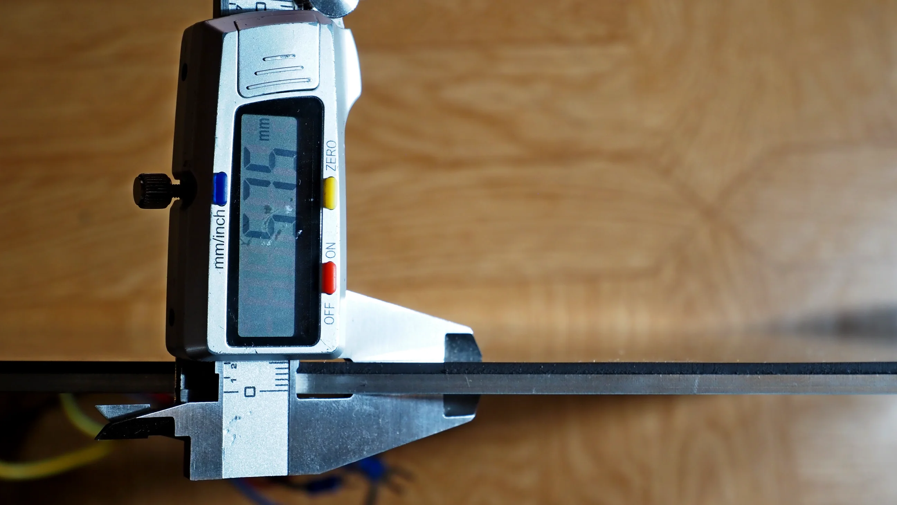
  - 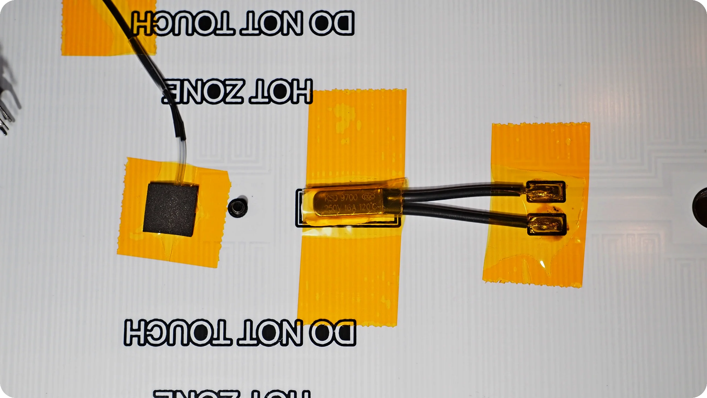

</div>

Стол – 4 мм алюминиевая плита с 2 мм магнитом. Нагреватель 220 В в виде плоских дорожек, распределённых равномерно по всей площади. Мощности 1 кВт хватает, чтобы без проблем греть стол до максимальной температуры чуть больше, чем за пять минут.

<div class="grid cards no-gap cols-3" markdown>


  - 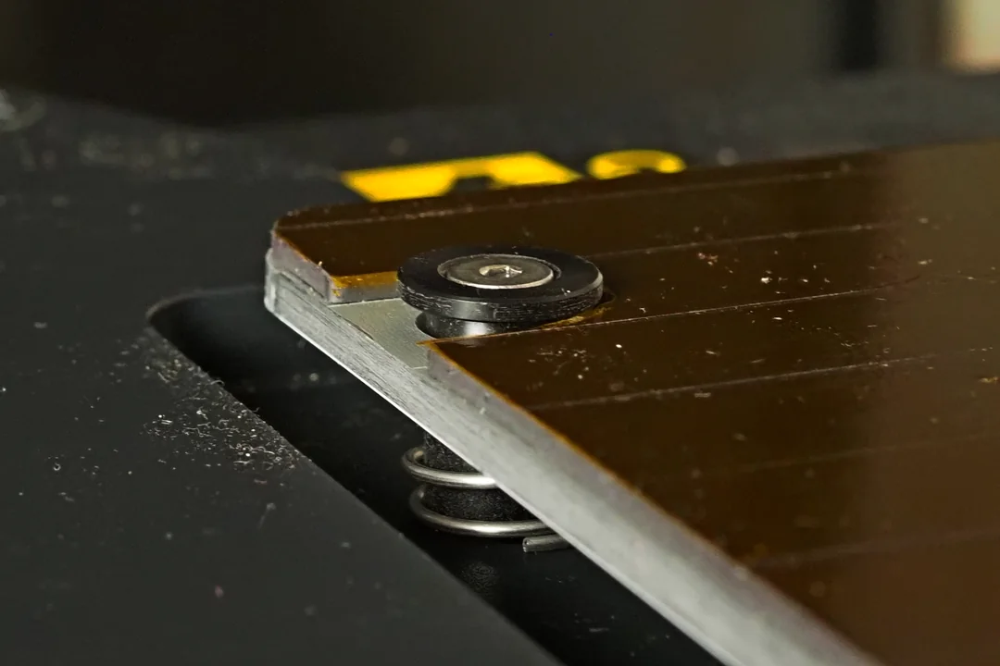
  - 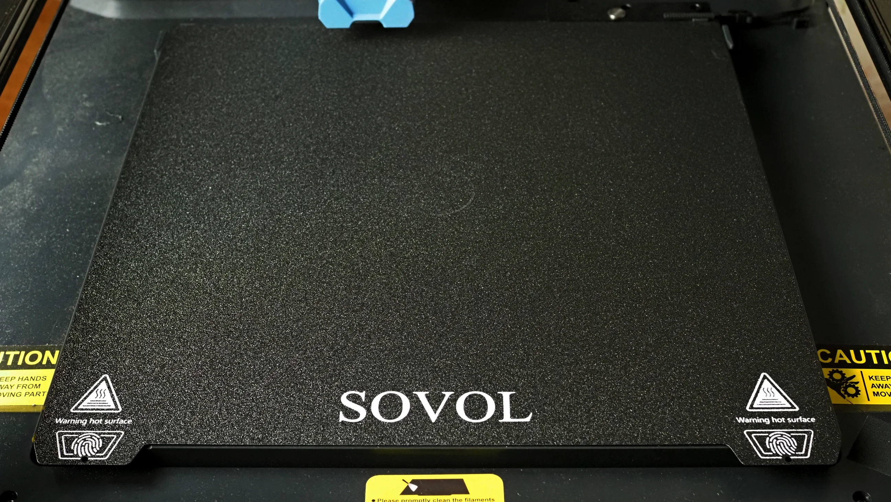
  - 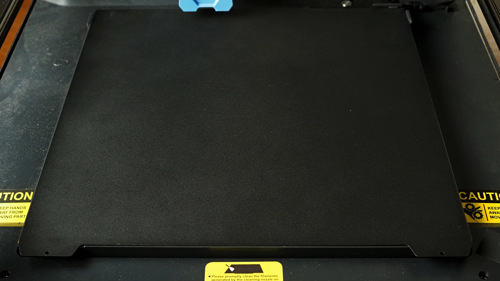
  - 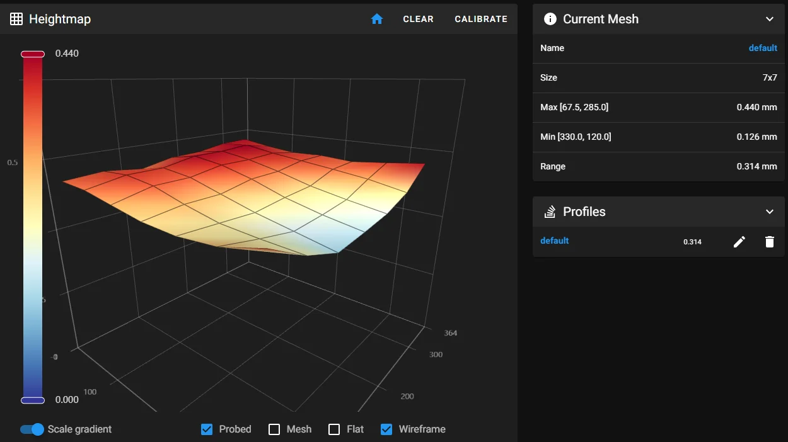
  - 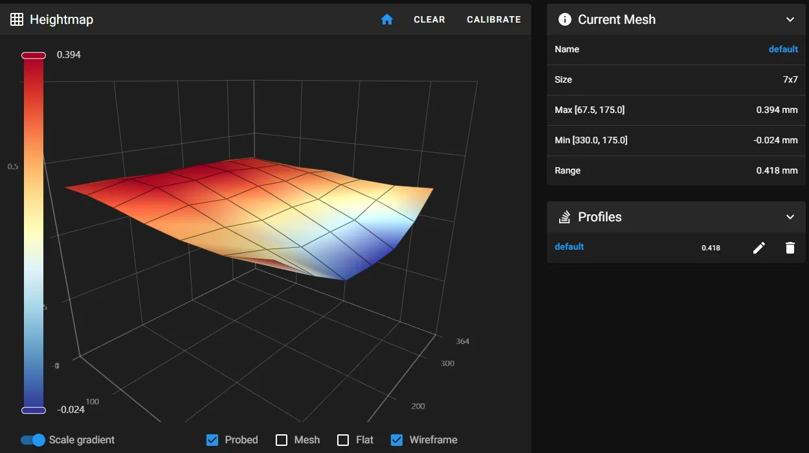
  - 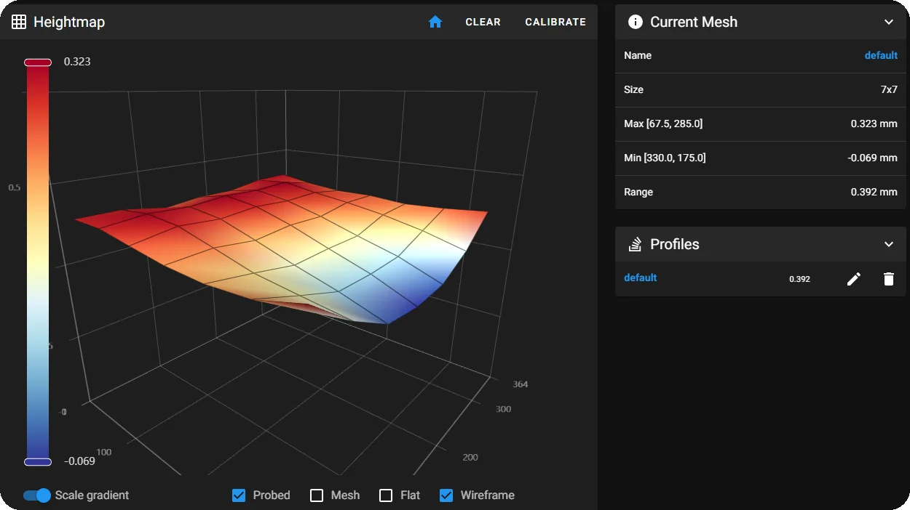

</div>

Перепад высот порядка 0.3-0.4 мм сохраняется при различных температурах. Для такого размера вполне приемлемо, при желании можно дополнительно уменьшить перепад наклеиванием скотча.

Крепление стола в новых ревизиях принтера сделано интересно. Одна точка в центре жёстко крепится к пластиковому корыту под ним, остальные четыре закреплены как на фото выше и имеют подвижность около миллиметра в плоскости XY. Благодаря этому стол может свободно расширяться при нагреве, и его почти не выгибает. Наличие винтов и пружин теоретически даёт возможность регулировать наклон стола, однако винты не законтрены и могут раскручиваться, если не будут протянуты.

Покрытие стола - стальной лист с PEI покрытием с одной стороны и порошковой окраской с другой. Пиктограммы на стороне с PEI нанесены краской и отпечатываются на детали. На окрашенной стороне печатать теоретически можно, если использовать адгезив.

## Печатающая голова

### Описание

<div class="grid cards no-gap cols-3" markdown>

  - 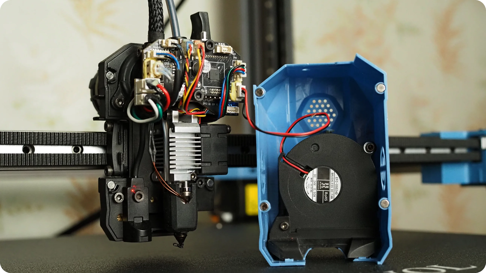
  - 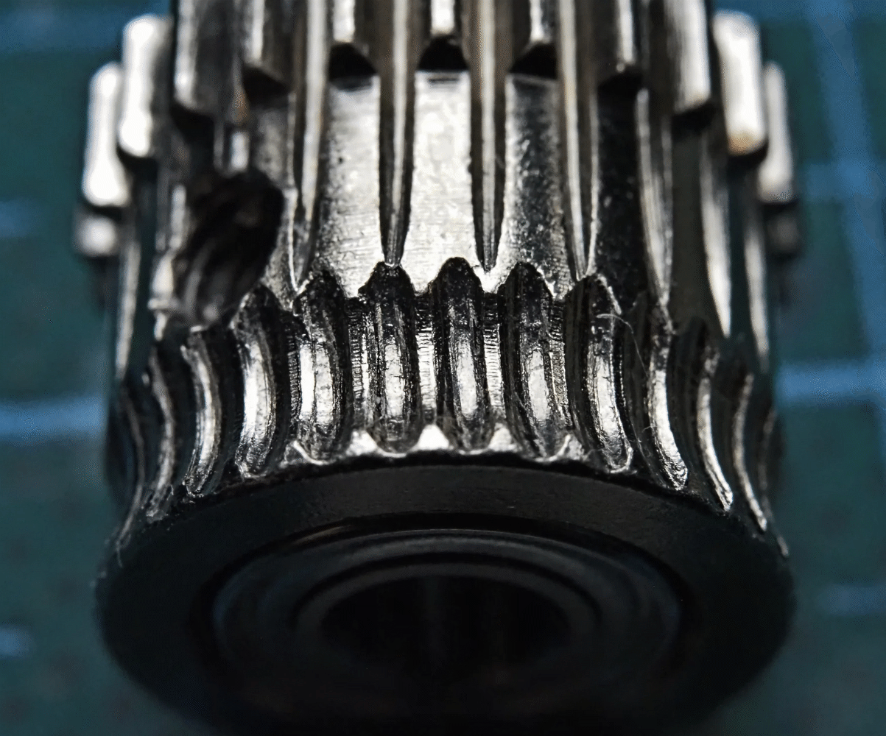
  - 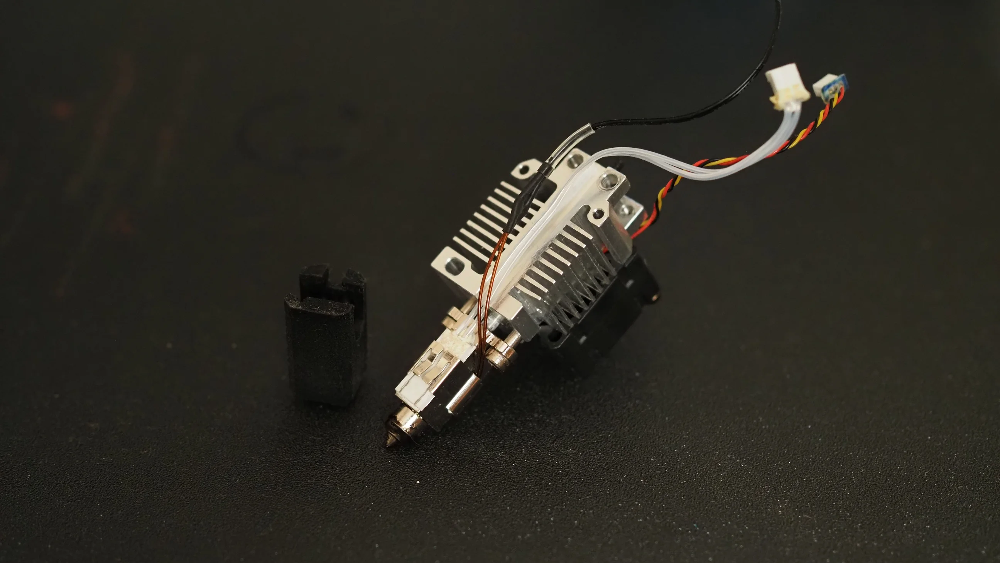

</div>

Печатающая голова полностью своя, не имеющая ничего общего с Voron Afterburner/Stealthburner, но совместима по месту присоединения ремня и точкам крепления к рельсе. Так что печатающие головы, подготовленные под Voron 2.4, можно будет установить на Sovol SV08 с небольшими переделками.

Подающий механизм основан на Orbiter v2, но совместим с ним только по подающим колёсам. Правда, в отличие от оригинального Orbiter, тут они низкокачественные, имеющие очень тупые зубчики. Это приводит к проблемам с экструзией, которые видны и по печати, и по тестам.

Хотэнд уникальный. Сопло совмещено с хитблоком и прикручивается к радиатору на 2 винтика по бокам. В стоке сопло не износостойкое. Нагреватель и термистор такие же, как у старых хотэндов Bambu Lab.

Система охлаждения модели на одной 5020 улитке формата с увеличенным выходом спереди и одной 3010 сзади. Обдув радиатора хотэнда осуществляется вентилятором 2515.

### Тест объёмного расхода

```vegalite
{
  "$schema": "https://vega.github.io/schema/vega-lite/v5.json",
  "title": {
    "text": "SV08 flow test",
    "subtitle": "PETG; 235ºC",
    "fontSize": 20,
    "subtitleFontSize": 16
  },
  "description": "",
  "width": "container",
  "height": 800,
  "autosize": "pad",
  "data": {
    "values": [
      {
        "hotend": "Theory",
        "Requested_flow": 0,
        "Measured_flow": 0,
        "skipping": true
      },
      {
        "hotend": "Theory",
        "Requested_flow": 100,
        "Measured_flow": 100,
        "skipping": true
      },
      {
        "hotend": "SV08 stock",
        "Requested_flow": 5,
        "Measured_flow": 5,
        "skipping": false
      },
      {
        "hotend": "SV08 stock",
        "Requested_flow": 10,
        "Measured_flow": 9.4,
        "skipping": false
      },
      {
        "hotend": "SV08 stock",
        "Requested_flow": 15,
        "Measured_flow": 13.08,
        "skipping": false
      },
      {
        "hotend": "SV08 stock",
        "Requested_flow": 20,
        "Measured_flow": 14.76,
        "skipping": false
      },
      {
        "hotend": "SV08 stock",
        "Requested_flow": 25,
        "Measured_flow": 17.15,
        "skipping": false
      },
      {
        "hotend": "SV08 fixed",
        "Requested_flow": 5,
        "Measured_flow": 4.9,
        "skipping": false
      },
      {
        "hotend": "SV08 fixed",
        "Requested_flow": 10,
        "Measured_flow": 9.68,
        "skipping": false
      },
      {
        "hotend": "SV08 fixed",
        "Requested_flow": 15,
        "Measured_flow": 14.4,
        "skipping": false
      },
      {
        "hotend": "SV08 fixed",
        "Requested_flow": 20,
        "Measured_flow": 18.8,
        "skipping": false
      },
      {
        "hotend": "SV08 fixed",
        "Requested_flow": 20,
        "Measured_flow": 18.8,
        "skipping": true
      },
      {
        "hotend": "SV08 fixed",
        "Requested_flow": 25,
        "Measured_flow": 18.425,
        "skipping": true
      },
      {
        "hotend": "Volcano + BMG",
        "Requested_flow": 5,
        "Measured_flow": 4.887,
        "skipping": false
      },
      {
        "hotend": "Volcano + BMG",
        "Requested_flow": 10,
        "Measured_flow": 9.645,
        "skipping": false
      },
      {
        "hotend": "Volcano + BMG",
        "Requested_flow": 15,
        "Measured_flow": 14.283,
        "skipping": false
      },
      {
        "hotend": "Volcano + BMG",
        "Requested_flow": 20,
        "Measured_flow": 19.044,
        "skipping": false
      },
      {
        "hotend": "Volcano + BMG",
        "Requested_flow": 25,
        "Measured_flow": 22.6825,
        "skipping": false
      },
      {
        "hotend": "Volcano + BMG",
        "Requested_flow": 25,
        "Measured_flow": 22.6825,
        "skipping": true
      },
      {
        "hotend": "Volcano + BMG",
        "Requested_flow": 30,
        "Measured_flow": 22.44,
        "skipping": true
      }
    ]
  },
  "layer": [
    {
      "mark": {
        "type": "line",
        "point": {"size": 100},
        "clip": true,
        "strokeWidth": 3,
        "tooltip": true
      },
      "encoding": {
        "x": {
          "field": "Requested_flow",
          "type": "quantitative",
          "scale": {"domainMin": 5, "domainMax": 30},
          "axis": {
            "title": "Requested flow, [mm^3/s]",
            "titleFontSize": 16,
            "labelFontSize": 14
          }
        },
        "y": {
          "field": "Measured_flow",
          "type": "quantitative",
          "scale": {"domainMin": 5, "domainMax": 30},
          "axis": {
            "title": "Measured flow, [mm^3/s]",
            "titleFontSize": 16,
            "labelFontSize": 14
          }
        },
        "color": {
          "field": "hotend",
          "type": "nominal",
          "legend": {
            "orient": "top",
            "titleFontSize": 14,
            "labelFontSize": 14,
            "rowPadding": 5,
            "padding": 3,
            "columns": {
              "expr": "floor(width / 155) == 0 ? 1 : floor(width / 155)"
            }
          },
          "scale": {
            "domain": [
              "Theory",
              "SV08 stock",
              "SV08 fixed",
              "Volcano + BMG"
            ],
            "range": [
              "#7f7f7f",
              "#1F78B5",
              "#AEC7E8",
              "#FF7F0D"
            ]
          }
        },
        "opacity": {"condition": {"param": "hotend", "value": 1}, "value": 0.2},
        "strokeDash": {"field": "skipping", "type": "nominal", "legend": null}
      },
      "params": [
        {
          "name": "hotend",
          "select": {"type": "point", "fields": ["hotend"]},
          "bind": "legend"
        }
      ]
    },
    {
      "mark": {
        "type": "text",
        "dx": 5,
        "dy": -10,
        "fontSize": 16,
        "align": "left",
        "clip": true
      },
      "encoding": {
        "x": {
          "field": "Requested_flow",
          "type": "quantitative",
          "scale": {"domainMin": 5, "domainMax": 30}
        },
        "y": {
          "field": "Measured_flow",
          "type": "quantitative",
          "scale": {"domainMin": 5, "domainMax": 30}
        },
        "text": {"field": "Measured_flow"},
        "opacity": {
          "condition": {"param": "hotend", "empty": false, "value": 1},
          "value": 0
        },
        "color": {"field": "hotend"}
      }
    }
  ]
}
```


<div class="grid cards no-gap cols-2" markdown>

  - 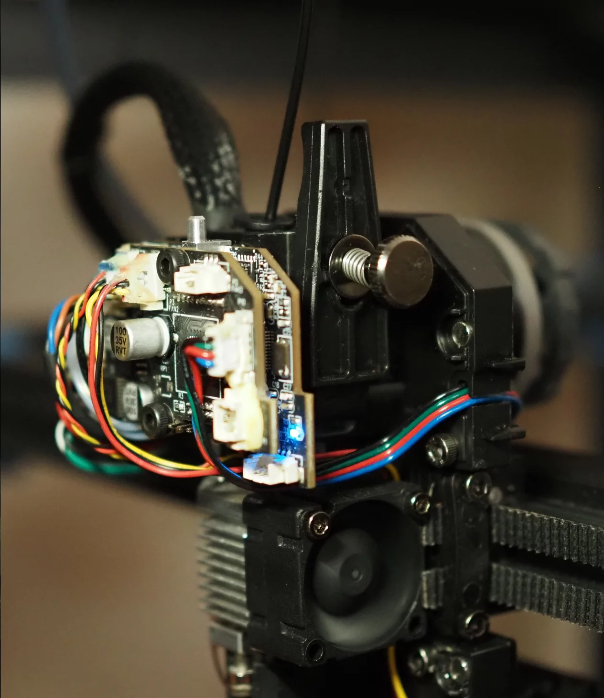
  - 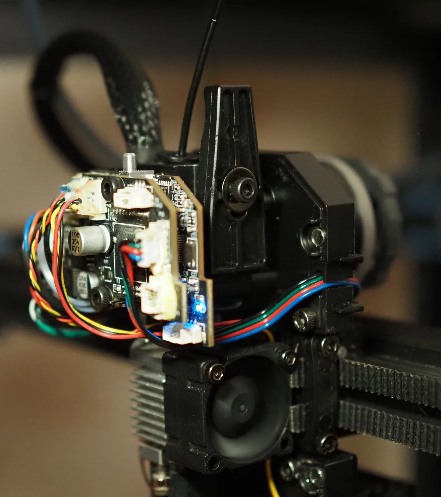

</div>

В стоке у SV08 измеренный расход значительно отличается от запрошенного, хотя у Volcano + BMG такого не наблюдается. В реальной печати это приведёт либо к переэкструзии на медленных участках, либо к недоэкструзии на быстрых, смотря как множитель потока настроите. Скорее всего, дело в некачественных подающих колёсах в стоке.

Для проверки этой теории я притянул лапку к корпусу фидера не через пружину, как было в стоке, а жёстко винтом М3х12. Это действительно помогло. Но печатать так на постоянку - идея не очень хорошая. По-хорошему, проблему надо решать заменой подающих колёс или переходом на другую печатающую голову.

### Тест обдува модели

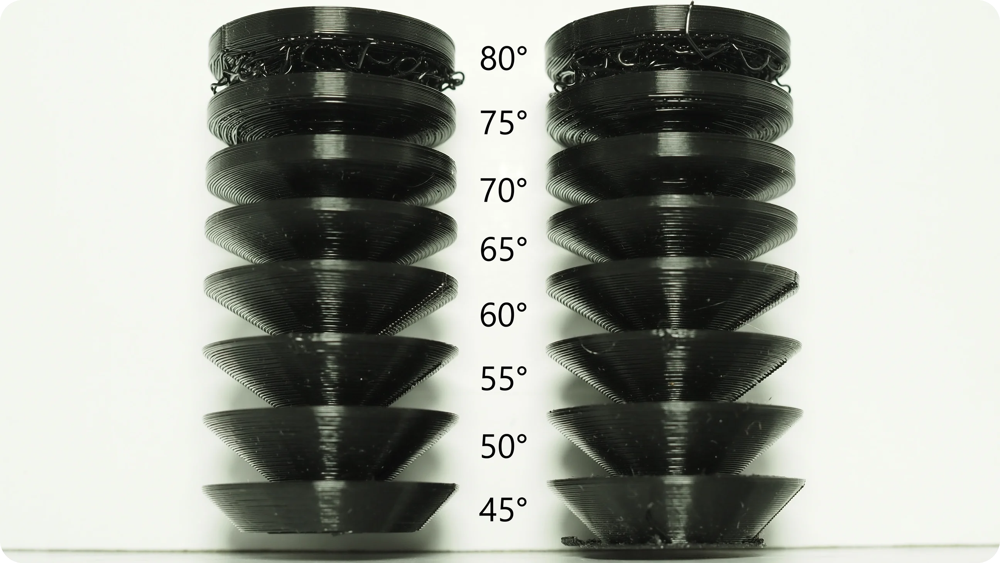

Тест на PETG печатается без дефектов до 75° при 100% обдуве. Шум при этом как от пылесоса, без преувеличений. Если придушить обороты до 37%, то уровень шума становится аналогичен обдуву Bambu Lab A1 на 100% оборотов, а тест печатается до 70°. Результат отличный, производительности кулера явно достаточно.

### Печать эластомерами

Со средне-мягким TPU 95A родной экструдер SV08 справляется с трудом. Калибровка Pressure Advance даёт значение порядка 0.4, но при печати реальной модели пруток почти сразу перестаёт подаваться. С выключенным PA процесс идёт стабильно, но скорость приходится снижать.

### Печать композитами

В стоке SV08 неспособен печатать композитными материалами, так как родные подающие колёса плохо цепляют твёрдый композитный пруток, а родное сопло неизносостойкое и несъёмное.

## Управляющая электроника

<div class="grid cards no-gap cols-3" markdown>

  - 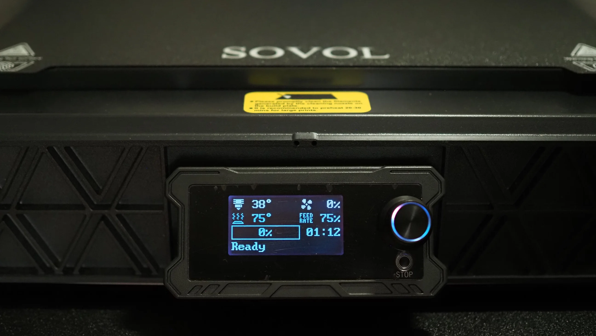
  - 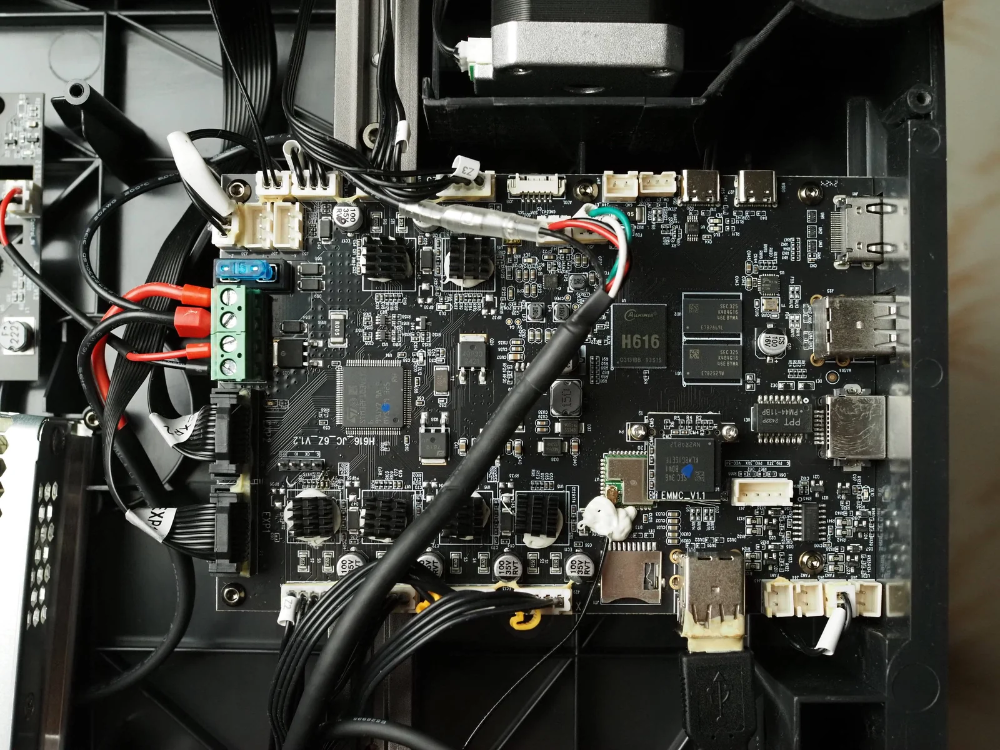
  - 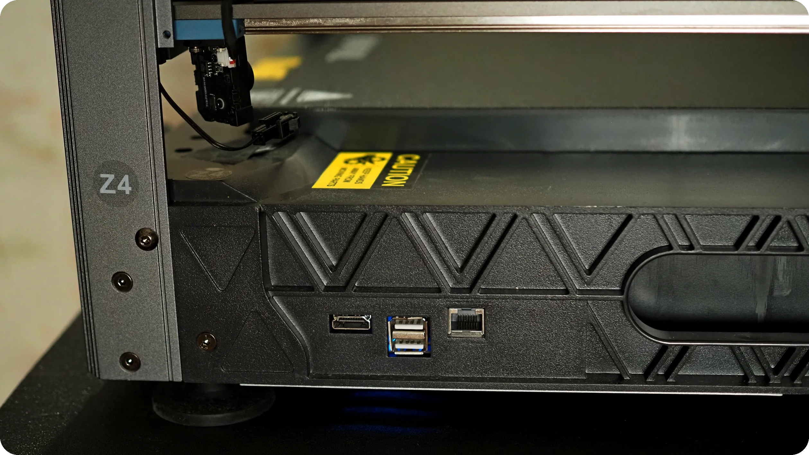

</div>

Управляющая плата имеет вполне адекватное железо:

- Микроконтроллеры материнской и коммутационной плат STM32F103;
- Процессор хоста: Allwinner H616;
- Драйверы TMC2209, подключенные по UART;
- Съёмный eMMC на 8Gb.

К процессору и драйверам претензий нет никаких — такие же используются в большинстве самосборных принтеров. MCU может быть слабоват для быстрого принтера с шестью шаговиками, но мне не удалось уронить его даже при печати сложных моделей с завышенными ускорениями, square_corner_velocity и дроблением шага 1/256 на осях XY.

Электроника работает под управлением Klipper v0.12. В качестве веб-интерфейса используется опенсорсный и очень функциональный Fluidd. Доступ в систему есть полный, можно делать всё что захочется, вплоть до переустановки системы, установки чистого upstream-Klipper и т.д.

По подключениям: Wi-Fi есть. На боковую сторону выведены 2 USB type-A, один HDMI и Ethernet. Можно пихать дополнительные MCU, флешки, веб-камеры, сенсорные экранчики. Почему-то все разъёмы вывели на правый бок принтера, а не на морду, где ими было бы удобнее пользоваться. Тем более, что торчащие справа провода будут отнимать лишнее пространство, а спереди оно и так зарезервировано под экран.

Экран - самый простой mini 12864, как у стокового Voron 2.4. Для сценариев "загрузить/выгрузить филамент", "запустить/остановить печать", "настроить z-offset" его хватает. Для более продвинутых сценариев можно подключиться к веб-интерфейсу с телефона или установить сенсорный экран по своему вкусу.

## Удобство использования и надёжность

В плане удобства и надёжности SV08 скорее хорош: то, что трудно или дорого менять, работает хорошо. Однако есть и косяки, которые, хоть и не так сложно исправляются, впечатление портят сильно.

### Подвижный портал осей XY

Выглядит красиво, голову обслуживать удобнее, чем на традиционных corexy, да и модель видно лучше. А вот при доработке под высокотемпературную печать он подкинет проблем. Во-первых, нагреватели камеры, фильтры и прочие модули придётся крепить в подвале или за габаритами рамы, чтобы они не мешали движению портала. Во-вторых, моторы осей XY будут греться сильнее, так как находятся внутри термокамеры.

### Независимые приводы оси Z

Не имеют преимуществ вообще. Перед каждой печатью нужно парковать каждый привод индивидуально – это лишнее время. Парковка делается об стол – это потенциальное искривление портала, если стол не идеально плоский или установлен с наклоном. Ну и вишенка на торте: четыре шаговика и четыре драйвера, хотя можно было обойтись одним мотором с одним драйвером и синхроремнём.

### Направляющие

На всех осях установлены рельсовые направляющие: mgn12 с H-кареткой на X и mgn9 с H-кареткой на Y и Z. У меня люфтов и заеданий нет, сообщество тоже на подобное не жалуется.

### Натяжители ремней

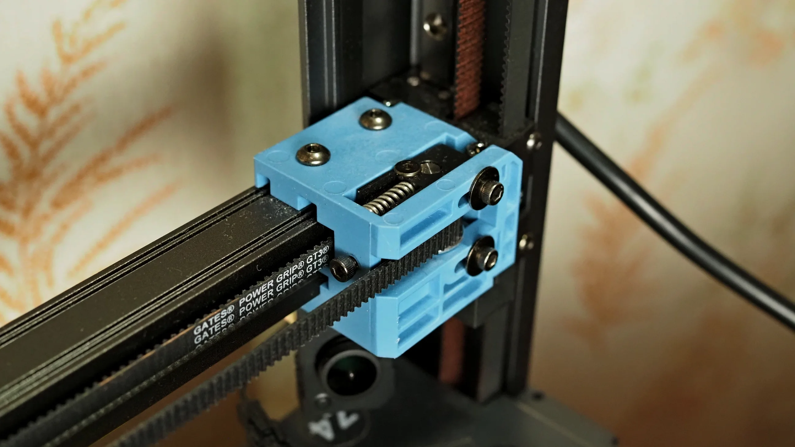{ align="left" width="300" }

Натяжители ремней на осях X, Y и Z одинаковые, полуавтоматические. Винты ограничивают ход ползуна, так что при необходимости натяжение можно немного ослабить. Для корректной работы corexy-кинематики этого достаточно.

<div style="clear: both;"></div>

### Крышка печатающей головы

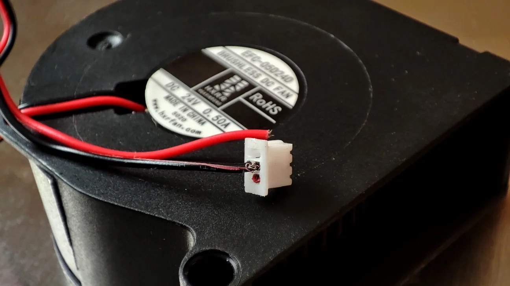{ align="left" width="300" }

Крышка совмещена с обдувом модели, из-за чего провод кулера обдува модели приходится постоянно дёргать туда-сюда. Так как он тонкий, да ещё и в дубовой ПВХ изоляции, хватило его ненадолго. Кроме того, форма и габариты крышки мешают смотреть, что происходит рядом с соплом.

<div style="clear: both;"></div>

### Переходная плата

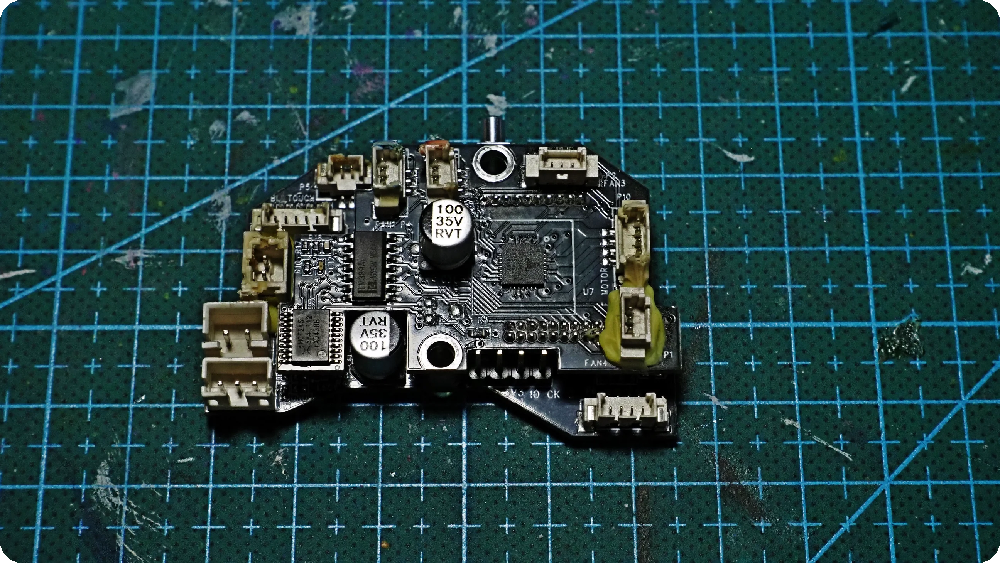{ align="left" width="300" }

Разъёмы на плате выбраны минимального размера, хотя по габаритам влезли бы и распространённые XH2.54. PH2.0 для нагревателя держит не более 2 ампер, чего даже для родного хотенда маловато, не говоря о более мощных. Picoblade для всего остального были бы приемлемы в обычном серийном принтере, но в SV08 добавят заморочек при апгрейдах. Бонусом все разъёмы обильно залиты клеем, из-за чего при отсоединении легко повредить провода или сам разъём. В моём случае, например, развалился корпус разъёма шаговика.

<div style="clear: both;"></div>

### Датчик автоуровня

Индуктивный датчик автоуровня имеет температурный дрейф, из-за чего перед печатью необходимо парковать голову вблизи стола и ждать минут десять, пока горячий воздух нагреет датчик до более-менее стабильной температуры. В противном случае он будет показывать погоду на марсе. При первой печати после включения это не проблема, так как столу тоже нужно время, чтобы температура установилась. Но при последующих стол будет горячим, а датчик придётся снова греть.

### Редуктор подающего механизма

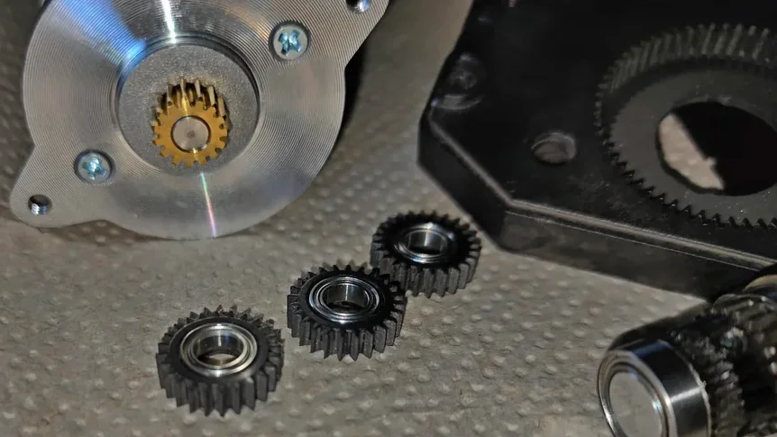{ align="left" width="300" }

Планетарный редуктор в подающем механизме живёт менее тысячи часов, судя по отзывам пользователей. При этом одна шестерня редуктора интегрирована в корпус печатающей головы, а вторая запрессована на шаговике. В итоге при износе проще менять всю голову целиком, причём желательно, сразу на кастомную без таких детских болячек.

<div style="clear: both;"></div>

### Датчик наличия филамента

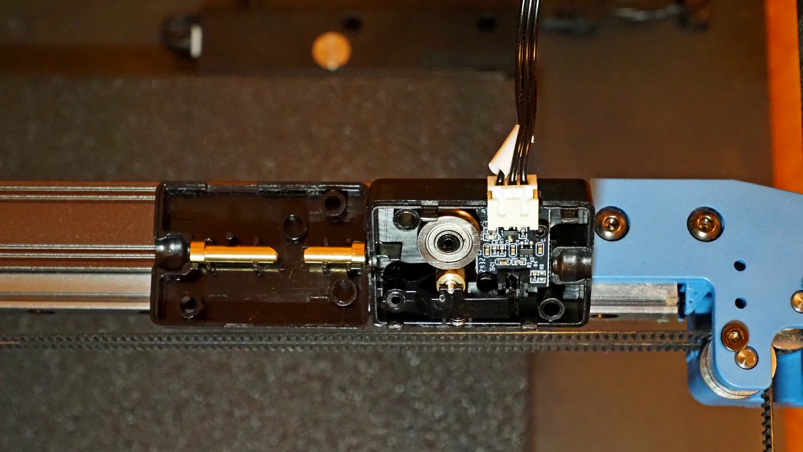{ align="left" width="300" }

Обычно на бюджетные принтеры лепят датчик типа “механический концевик в коробочке”. Такие работают посредственно и чаще вредят, чем помогают. Тут же внутри коробочки подпружиненная лапка с роликом, которая триггерит оптический концевик. По крайней мере с PETG и TPU 95A работает нормально, так что пусть будет.

<div style="clear: both;"></div>

### Прошивка

Доступ к конфигурации принтера сильно упрощает жизнь: если что-то не устраивает, это всегда можно поправить. С установкой апгрейдов проблем тоже нет: в большинстве случаев достаточно правки конфига, в худшем случае — переход на чистый Klipper.

### Шум

Основным источником шума является кулер обдува модели - 63 дБ в метре от принтера при полных оборотах. Но судя по тесту обдува, обороты можно придушить, и тогда шум упадёт до 54 дБ. Механика в стоке тоже шумная, так как драйверы работают в режиме SpreadCycle с дроблением шага 1/16. Если увеличить дробление шага до 1/256, шум становится заметно меньше. Конкретное значение измерить невозможно, так как шум зависит от скорости печати, но ориентировочно 55 дБ. Кулеры хотенда и электроники при печати не слышно. В целом, уровень шума сравним с другими corexy принтерами типа flashforge adventurer 5m и creality k1, а Bambu Lab A1 будет значительно тише, если не включать обдув модели на 100%.

## Выводы

Пора делать выводы. По механике SV08 не имеет каких-либо значимых проблем, при этом показывает хорошие для принтера таких габаритов ускорения и приемлемый уровень ряби. Стол достаточно ровный и способен греться до 115 градусов. Электроника бодрая, прошивка открытая. Однако, голова прям сильно портит ситуацию: буквально каждый из её компонентов имеет косяки той или иной степени критичности. Учитывая это, проще будет заменить её целиком на что-то нормальное, чем решать по очереди все проблемы. Получается, SV08 - принтер для тех, кто готов повозиться. А в таком случае можно не только голову заменить, но и стенки зашить, нагреватель камеры поставить, и получить хороший универсальный принтер с открытой прошивкой за мало денег.
