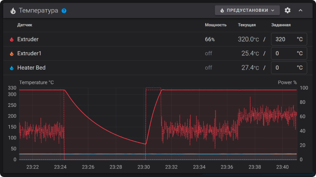
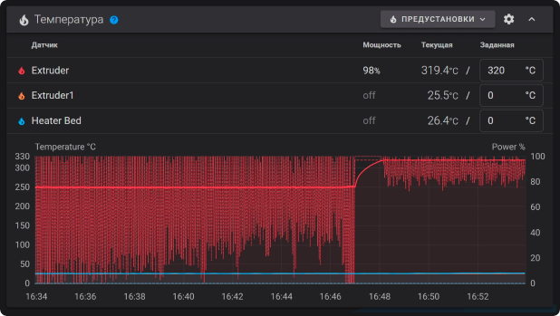

# Сверхпроизводительные хотэнды

## Тарирование термисторов

```vegalite
{
  "$schema": "https://vega.github.io/schema/vega-lite/v5.json",
  "title": {
    "text": "[K3D] Hotend thermistor taring",
    "subtitle": "",
    "fontSize": 20,
    "subtitleFontSize": 16
  },
  "description": "V6 0.4 copper nozzle",
  "width": "container",
  "height": 800,
  "autosize": "pad",
  "data": {
    "values": [
      {
        "hotend": "Goliath",
        "thermistor_temperature": 200,
        "nozzle_temperature": 11,
        "theory": false
      },
      {
        "hotend": "Goliath",
        "thermistor_temperature": 210,
        "nozzle_temperature": 11,
        "theory": false
      },
      {
        "hotend": "Goliath",
        "thermistor_temperature": 220,
        "nozzle_temperature": 12,
        "theory": false
      },
      {
        "hotend": "Goliath",
        "thermistor_temperature": 230,
        "nozzle_temperature": 12.5,
        "theory": false
      },
      {
        "hotend": "Goliath",
        "thermistor_temperature": 240,
        "nozzle_temperature": 13,
        "theory": false
      },
      {
        "hotend": "Goliath",
        "thermistor_temperature": 250,
        "nozzle_temperature": 13.5,
        "theory": false
      },
      {
        "hotend": "Goliath",
        "thermistor_temperature": 260,
        "nozzle_temperature": 14,
        "theory": false
      },
      {
        "hotend": "Goliath",
        "thermistor_temperature": 270,
        "nozzle_temperature": 14.5,
        "theory": false
      },
      {
        "hotend": "Goliath",
        "thermistor_temperature": 280,
        "nozzle_temperature": 15,
        "theory": false
      },
      {
        "hotend": "Goliath",
        "thermistor_temperature": 290,
        "nozzle_temperature": 15,
        "theory": false
      },
      {
        "hotend": "Goliath",
        "thermistor_temperature": 300,
        "nozzle_temperature": 15.2,
        "theory": false
      },
      {
        "hotend": "Goliath",
        "thermistor_temperature": 310,
        "nozzle_temperature": 16,
        "theory": false
      },
      {
        "hotend": "Goliath",
        "thermistor_temperature": 320,
        "nozzle_temperature": 16,
        "theory": false
      },
      {
        "hotend": "CHC XL",
        "thermistor_temperature": 200,
        "nozzle_temperature": 10.3,
        "theory": false
      },
      {
        "hotend": "CHC XL",
        "thermistor_temperature": 210,
        "nozzle_temperature": 11,
        "theory": false
      },
      {
        "hotend": "CHC XL",
        "thermistor_temperature": 220,
        "nozzle_temperature": 11.5,
        "theory": false
      },
      {
        "hotend": "CHC XL",
        "thermistor_temperature": 230,
        "nozzle_temperature": 12.3,
        "theory": false
      },
      {
        "hotend": "CHC XL",
        "thermistor_temperature": 240,
        "nozzle_temperature": 12.7,
        "theory": false
      },
      {
        "hotend": "CHC XL",
        "thermistor_temperature": 250,
        "nozzle_temperature": 13.1,
        "theory": false
      },
      {
        "hotend": "CHC XL",
        "thermistor_temperature": 260,
        "nozzle_temperature": 13.5,
        "theory": false
      },
      {
        "hotend": "CHC XL",
        "thermistor_temperature": 270,
        "nozzle_temperature": 14,
        "theory": false
      },
      {
        "hotend": "CHC XL",
        "thermistor_temperature": 280,
        "nozzle_temperature": 14.4,
        "theory": false
      },
      {
        "hotend": "CHC XL",
        "thermistor_temperature": 290,
        "nozzle_temperature": 14.9,
        "theory": false
      },
      {
        "hotend": "CHC XL",
        "thermistor_temperature": 300,
        "nozzle_temperature": 15.3,
        "theory": false
      },
      {
        "hotend": "CHC XL",
        "thermistor_temperature": 310,
        "nozzle_temperature": 15.6,
        "theory": false
      },
      {
        "hotend": "CHC XL",
        "thermistor_temperature": 320,
        "nozzle_temperature": 16.4,
        "theory": false
      },
      {
        "hotend": "Rapido ACE HF",
        "thermistor_temperature": 200,
        "nozzle_temperature": 1.7,
        "theory": false
      },
      {
        "hotend": "Rapido ACE HF",
        "thermistor_temperature": 210,
        "nozzle_temperature": 1.5,
        "theory": false
      },
      {
        "hotend": "Rapido ACE HF",
        "thermistor_temperature": 220,
        "nozzle_temperature": 1.4,
        "theory": false
      },
      {
        "hotend": "Rapido ACE HF",
        "thermistor_temperature": 230,
        "nozzle_temperature": 1.2,
        "theory": false
      },
      {
        "hotend": "Rapido ACE HF",
        "thermistor_temperature": 240,
        "nozzle_temperature": 1.2,
        "theory": false
      },
      {
        "hotend": "Rapido ACE HF",
        "thermistor_temperature": 250,
        "nozzle_temperature": 0.9,
        "theory": false
      },
      {
        "hotend": "Rapido ACE HF",
        "thermistor_temperature": 260,
        "nozzle_temperature": 0.8,
        "theory": false
      },
      {
        "hotend": "Rapido ACE HF",
        "thermistor_temperature": 270,
        "nozzle_temperature": 0.2,
        "theory": false
      },
      {
        "hotend": "Rapido ACE HF",
        "thermistor_temperature": 280,
        "nozzle_temperature": -0.3,
        "theory": false
      },
      {
        "hotend": "Rapido ACE HF",
        "thermistor_temperature": 290,
        "nozzle_temperature": -0.9,
        "theory": false
      },
      {
        "hotend": "Rapido ACE HF",
        "thermistor_temperature": 300,
        "nozzle_temperature": -1.3,
        "theory": false
      },
      {
        "hotend": "Rapido ACE HF",
        "thermistor_temperature": 310,
        "nozzle_temperature": -2.1,
        "theory": false
      },
      {
        "hotend": "Rapido ACE HF",
        "thermistor_temperature": 320,
        "nozzle_temperature": -2.7,
        "theory": false
      },
      {
        "hotend": "Rapido ACE UHF",
        "thermistor_temperature": 200,
        "nozzle_temperature": -0.5,
        "theory": false
      },
      {
        "hotend": "Rapido ACE UHF",
        "thermistor_temperature": 210,
        "nozzle_temperature": -0.5,
        "theory": false
      },
      {
        "hotend": "Rapido ACE UHF",
        "thermistor_temperature": 220,
        "nozzle_temperature": -0.7,
        "theory": false
      },
      {
        "hotend": "Rapido ACE UHF",
        "thermistor_temperature": 230,
        "nozzle_temperature": -1.2,
        "theory": false
      },
      {
        "hotend": "Rapido ACE UHF",
        "thermistor_temperature": 240,
        "nozzle_temperature": -1.8,
        "theory": false
      },
      {
        "hotend": "Rapido ACE UHF",
        "thermistor_temperature": 250,
        "nozzle_temperature": -2.3,
        "theory": false
      },
      {
        "hotend": "Rapido ACE UHF",
        "thermistor_temperature": 260,
        "nozzle_temperature": -3.1,
        "theory": false
      },
      {
        "hotend": "Rapido ACE UHF",
        "thermistor_temperature": 270,
        "nozzle_temperature": -4.2,
        "theory": false
      },
      {
        "hotend": "Rapido ACE UHF",
        "thermistor_temperature": 280,
        "nozzle_temperature": -5.2,
        "theory": false
      },
      {
        "hotend": "Rapido ACE UHF",
        "thermistor_temperature": 290,
        "nozzle_temperature": -5.6,
        "theory": false
      },
      {
        "hotend": "Rapido ACE UHF",
        "thermistor_temperature": 300,
        "nozzle_temperature": -6.2,
        "theory": false
      },
      {
        "hotend": "Rapido ACE UHF",
        "thermistor_temperature": 310,
        "nozzle_temperature": -6.2,
        "theory": false
      },
      {
        "hotend": "Rapido ACE UHF",
        "thermistor_temperature": 320,
        "nozzle_temperature": -6.9,
        "theory": false
      },
      {
        "hotend": "Theory",
        "thermistor_temperature": 0,
        "nozzle_temperature": 0,
        "theory": true
      },
      {
        "hotend": "Theory",
        "thermistor_temperature": 1000,
        "nozzle_temperature": 0,
        "theory": true
      }
    ]
  },
  "layer": [
    {
      "mark": {
        "type": "line",
        "point": {"size": 100},
        "clip": true,
        "strokeWidth": 3,
        "tooltip": true
      },
      "encoding": {
        "x": {
          "field": "thermistor_temperature",
          "type": "quantitative",
          "scale": {"domainMin": 200, "domainMax": 320},
          "axis": {
            "title": "Thermistor temperature [ºC]",
            "titleFontSize": 16,
            "labelFontSize": 14
          }
        },
        "y": {
          "field": "nozzle_temperature",
          "type": "quantitative",
          "scale": {"domainMin": -8, "domainMax": 18},
          "axis": {
            "title": "Nozzle temperature delta [ºC]",
            "titleFontSize": 16,
            "labelFontSize": 14
          }
        },
        "color": {
          "field": "hotend",
          "type": "nominal",
          "legend": {
            "orient": "top",
            "titleFontSize": 14,
            "labelFontSize": 14,
            "rowPadding": 5,
            "padding": 3,
            "columns": {
              "expr": "floor(width / 155) == 0 ? 1 : floor(width / 155)"
            }
          },
          "scale": {
            "domain": [
              "Goliath",
              "CHC XL",
              "Rapido ACE HF",
              "Rapido ACE UHF",
              "Volcano",
              "Theory"
            ],
            "range": [
              "#1F78B5",
              "#FF7F0D",
              "#2CA02C",
              "#98DF8A",
              "#D62729",
              "#7f7f7f"
            ]
          }
        },
        "opacity": {"condition": {"param": "hotend", "value": 1}, "value": 0.2},
        "strokeDash": {"field": "theory", "type": "nominal", "legend": null}
      },
      "params": [
        {
          "name": "hotend",
          "select": {"type": "point", "fields": ["hotend"]},
          "bind": "legend"
        }
      ]
    },
    {
      "mark": {
        "type": "text",
        "dx": 0,
        "dy": -30,
        "fontSize": 16,
        "align": "center",
        "clip": true
      },
      "encoding": {
        "x": {
          "field": "thermistor_temperature",
          "type": "quantitative",
          "scale": {"domainMin": 200, "domainMax": 340}
        },
        "y": {
          "field": "nozzle_temperature",
          "type": "quantitative",
          "scale": {"domainMin": 200, "domainMax": 320}
        },
        "text": {"field": "nozzle_temperature"},
        "opacity": {
          "condition": {"param": "hotend", "empty": false, "value": 1},
          "value": 0
        },
        "color": {"field": "hotend"}
      }
    }
  ]
}
```

## Тест объёмного расхода

### PETG 235ºC

```vegalite
{
  "$schema": "https://vega.github.io/schema/vega-lite/v5.json",
  "title": {
    "text": "[K3D] Ultra-high-flow hotends flowrate test",
    "subtitle": "PETG; 235ºC; K3D Microfeeder",
    "fontSize": 20,
    "subtitleFontSize": 16
  },
  "description": "V6 0.4 copper nozzle",
  "width": "container",
  "height": 800,
  "autosize": "pad",
  "data": {
    "values": [
      {
        "hotend": "Goliath",
        "volumetric_flow": 5,
        "underextrusion": -1.12,
        "skipping": false
      },
      {
        "hotend": "Goliath",
        "volumetric_flow": 10,
        "underextrusion": -2.26,
        "skipping": false
      },
      {
        "hotend": "Goliath",
        "volumetric_flow": 15,
        "underextrusion": -3.39,
        "skipping": false
      },
      {
        "hotend": "Goliath",
        "volumetric_flow": 20,
        "underextrusion": -4.43,
        "skipping": false
      },
      {
        "hotend": "Goliath",
        "volumetric_flow": 25,
        "underextrusion": -5.02,
        "skipping": false
      },
      {
        "hotend": "Goliath",
        "volumetric_flow": 30,
        "underextrusion": -6.19,
        "skipping": false
      },
      {
        "hotend": "Goliath",
        "volumetric_flow": 35,
        "underextrusion": -7.16,
        "skipping": false
      },
      {
        "hotend": "Goliath",
        "volumetric_flow": 40,
        "underextrusion": -8.46,
        "skipping": false
      },
      {
        "hotend": "Goliath",
        "volumetric_flow": 40,
        "underextrusion": -8.46,
        "skipping": true
      },
      {
        "hotend": "Goliath",
        "volumetric_flow": 45,
        "underextrusion": -10.99,
        "skipping": true
      },
      {
        "hotend": "Goliath",
        "volumetric_flow": 50,
        "underextrusion": -100,
        "skipping": true
      },
      {
        "hotend": "Goliath + ext",
        "volumetric_flow": 5,
        "underextrusion": -1.43,
        "skipping": false
      },
      {
        "hotend": "Goliath + ext",
        "volumetric_flow": 10,
        "underextrusion": -1.74,
        "skipping": false
      },
      {
        "hotend": "Goliath + ext",
        "volumetric_flow": 15,
        "underextrusion": -2.84,
        "skipping": false
      },
      {
        "hotend": "Goliath + ext",
        "volumetric_flow": 20,
        "underextrusion": -4.81,
        "skipping": false
      },
      {
        "hotend": "Goliath + ext",
        "volumetric_flow": 25,
        "underextrusion": -5.01,
        "skipping": false
      },
      {
        "hotend": "Goliath + ext",
        "volumetric_flow": 30,
        "underextrusion": -5.95,
        "skipping": false
      },
      {
        "hotend": "Goliath + ext",
        "volumetric_flow": 30,
        "underextrusion": -5.95,
        "skipping": true
      },
      {
        "hotend": "Goliath + ext",
        "volumetric_flow": 35,
        "underextrusion": -7.92,
        "skipping": true
      },
      {
        "hotend": "Goliath + ext",
        "volumetric_flow": 40,
        "underextrusion": -7.69,
        "skipping": true
      },
      {
        "hotend": "Goliath + ext",
        "volumetric_flow": 45,
        "underextrusion": -11.86,
        "skipping": true
      },
      {
        "hotend": "CHC XL",
        "volumetric_flow": 5,
        "underextrusion": -1.26,
        "skipping": false
      },
      {
        "hotend": "CHC XL",
        "volumetric_flow": 10,
        "underextrusion": -2.49,
        "skipping": false
      },
      {
        "hotend": "CHC XL",
        "volumetric_flow": 15,
        "underextrusion": -3.94,
        "skipping": false
      },
      {
        "hotend": "CHC XL",
        "volumetric_flow": 20,
        "underextrusion": -4.65,
        "skipping": false
      },
      {
        "hotend": "CHC XL",
        "volumetric_flow": 25,
        "underextrusion": -5.46,
        "skipping": false
      },
      {
        "hotend": "CHC XL",
        "volumetric_flow": 30,
        "underextrusion": -7.24,
        "skipping": false
      },
      {
        "hotend": "CHC XL",
        "volumetric_flow": 35,
        "underextrusion": -8.53,
        "skipping": false
      },
      {
        "hotend": "CHC XL",
        "volumetric_flow": 40,
        "underextrusion": -9.85,
        "skipping": false
      },
      {
        "hotend": "CHC XL",
        "volumetric_flow": 40,
        "underextrusion": -9.85,
        "skipping": true
      },
      {
        "hotend": "CHC XL",
        "volumetric_flow": 45,
        "underextrusion": -12.28,
        "skipping": true
      },
      {
        "hotend": "CHC XL",
        "volumetric_flow": 50,
        "underextrusion": -18.35,
        "skipping": true
      },
      {
        "hotend": "CHC XL + ext",
        "volumetric_flow": 5,
        "underextrusion": -0.81,
        "skipping": false
      },
      {
        "hotend": "CHC XL + ext",
        "volumetric_flow": 10,
        "underextrusion": -1.78,
        "skipping": false
      },
      {
        "hotend": "CHC XL + ext",
        "volumetric_flow": 15,
        "underextrusion": -3.3,
        "skipping": false
      },
      {
        "hotend": "CHC XL + ext",
        "volumetric_flow": 20,
        "underextrusion": -4.26,
        "skipping": false
      },
      {
        "hotend": "CHC XL + ext",
        "volumetric_flow": 25,
        "underextrusion": -5.4,
        "skipping": false
      },
      {
        "hotend": "CHC XL + ext",
        "volumetric_flow": 30,
        "underextrusion": -6.53,
        "skipping": false
      },
      {
        "hotend": "CHC XL + ext",
        "volumetric_flow": 35,
        "underextrusion": -6.72,
        "skipping": false
      },
      {
        "hotend": "CHC XL + ext",
        "volumetric_flow": 40,
        "underextrusion": -7.4,
        "skipping": false
      },
      {
        "hotend": "CHC XL + ext",
        "volumetric_flow": 40,
        "underextrusion": -7.4,
        "skipping": true
      },
      {
        "hotend": "CHC XL + ext",
        "volumetric_flow": 45,
        "underextrusion": -9.47,
        "skipping": true
      },
      {
        "hotend": "CHC XL + ext",
        "volumetric_flow": 50,
        "underextrusion": -17.67,
        "skipping": true
      },
      {
        "hotend": "Rapido ACE HF",
        "volumetric_flow": 5,
        "underextrusion": -1.23,
        "skipping": false
      },
      {
        "hotend": "Rapido ACE HF",
        "volumetric_flow": 10,
        "underextrusion": -2.0,
        "skipping": false
      },
      {
        "hotend": "Rapido ACE HF",
        "volumetric_flow": 15,
        "underextrusion": -3.36,
        "skipping": false
      },
      {
        "hotend": "Rapido ACE HF",
        "volumetric_flow": 20,
        "underextrusion": -5.2,
        "skipping": false
      },
      {
        "hotend": "Rapido ACE HF",
        "volumetric_flow": 25,
        "underextrusion": -7.11,
        "skipping": false
      },
      {
        "hotend": "Rapido ACE HF",
        "volumetric_flow": 25,
        "underextrusion": -7.11,
        "skipping": true
      },
      {
        "hotend": "Rapido ACE HF",
        "volumetric_flow": 30,
        "underextrusion": -10.34,
        "skipping": true
      },
      {
        "hotend": "Rapido ACE HF",
        "volumetric_flow": 35,
        "underextrusion": -21.36,
        "skipping": true
      },
      {
        "hotend": "Rapido ACE UHF",
        "volumetric_flow": 5,
        "underextrusion": -1.78,
        "skipping": false
      },
      {
        "hotend": "Rapido ACE UHF",
        "volumetric_flow": 10,
        "underextrusion": -3.07,
        "skipping": false
      },
      {
        "hotend": "Rapido ACE UHF",
        "volumetric_flow": 15,
        "underextrusion": -4.14,
        "skipping": false
      },
      {
        "hotend": "Rapido ACE UHF",
        "volumetric_flow": 20,
        "underextrusion": -5.46,
        "skipping": false
      },
      {
        "hotend": "Rapido ACE UHF",
        "volumetric_flow": 25,
        "underextrusion": -6.91,
        "skipping": false
      },
      {
        "hotend": "Rapido ACE UHF",
        "volumetric_flow": 30,
        "underextrusion": -8.76,
        "skipping": false
      },
      {
        "hotend": "Rapido ACE UHF",
        "volumetric_flow": 35,
        "underextrusion": -10.69,
        "skipping": false
      },
      {
        "hotend": "Rapido ACE UHF",
        "volumetric_flow": 35,
        "underextrusion": -10.69,
        "skipping": true
      },
      {
        "hotend": "Rapido ACE UHF",
        "volumetric_flow": 40,
        "underextrusion": -22.04,
        "skipping": true
      },
      {
        "hotend": "Volcano",
        "volumetric_flow": 5,
        "underextrusion": -2.26,
        "skipping": false
      },
      {
        "hotend": "Volcano",
        "volumetric_flow": 10,
        "underextrusion": -3.55,
        "skipping": false
      },
      {
        "hotend": "Volcano",
        "volumetric_flow": 15,
        "underextrusion": -4.23,
        "skipping": false
      },
      {
        "hotend": "Volcano",
        "volumetric_flow": 20,
        "underextrusion": -4.78,
        "skipping": false
      },
      {
        "hotend": "Volcano",
        "volumetric_flow": 25,
        "underextrusion": -9.27,
        "skipping": false
      },
      {
        "hotend": "Volcano",
        "volumetric_flow": 25,
        "underextrusion": -9.27,
        "skipping": true
      },
      {
        "hotend": "Volcano",
        "volumetric_flow": 30,
        "underextrusion": -25.2,
        "skipping": true
      }
    ]
  },
  "layer": [
    {
      "mark": {
        "type": "line",
        "point": {"size": 100},
        "clip": true,
        "strokeWidth": 3,
        "tooltip": true
      },
      "encoding": {
        "x": {
          "field": "volumetric_flow",
          "type": "quantitative",
          "scale": {"domainMin": 5, "domainMax": 60},
          "axis": {
            "title": "Flow rate [mm^3/s]",
            "titleFontSize": 16,
            "labelFontSize": 14
          }
        },
        "y": {
          "field": "underextrusion",
          "type": "quantitative",
          "scale": {"domainMin": -15, "domainMax": 0},
          "axis": {
            "title": "Underextrusion [%]",
            "titleFontSize": 16,
            "labelFontSize": 14
          }
        },
        "color": {
          "field": "hotend",
          "type": "nominal",
          "legend": {
            "orient": "top",
            "titleFontSize": 14,
            "labelFontSize": 14,
            "rowPadding": 5,
            "padding": 3,
            "columns": {
              "expr": "floor(width / 155) == 0 ? 1 : floor(width / 155)"
            }
          },
          "scale": {
            "domain": [
              "Goliath",
              "Goliath + ext",
              "CHC XL",
              "CHC XL + ext",
              "Rapido ACE HF",
              "Rapido ACE UHF",
              "Volcano"
            ],
            "range": [
              "#1F78B5",
              "#AEC7E8",
              "#FF7F0D",
              "#FFBB78",
              "#2CA02C",
              "#98DF8A",
              "#D62729",
              "#ff9896",
              "#9467bd",
              "#ce6dbd",
              "#bcbd22"
            ]
          }
        },
        "opacity": {"condition": {"param": "hotend", "value": 1}, "value": 0.2},
        "strokeDash": {"field": "skipping", "type": "nominal", "legend": null}
      },
      "params": [
        {
          "name": "hotend",
          "select": {"type": "point", "fields": ["hotend"]},
          "bind": "legend"
        }
      ]
    },
    {
      "mark": {
        "type": "text",
        "dx": 5,
        "dy": -10,
        "fontSize": 16,
        "align": "left",
        "clip": true
      },
      "encoding": {
        "x": {
          "field": "volumetric_flow",
          "type": "quantitative",
          "scale": {"domainMin": 5, "domainMax": 60}
        },
        "y": {
          "field": "underextrusion",
          "type": "quantitative",
          "scale": {"domainMin": -15, "domainMax": 0}
        },
        "text": {"field": "underextrusion"},
        "opacity": {
          "condition": {"param": "hotend", "empty": false, "value": 1},
          "value": 0
        },
        "color": {"field": "hotend"}
      }
    }
  ]
}
```

### PETG 248ºC

```vegalite
{
  "$schema": "https://vega.github.io/schema/vega-lite/v5.json",
  "title": {
    "text": "[K3D] Ultra-high-flow hotends flowrate test",
    "subtitle": "PETG; 248ºC; K3D Microfeeder",
    "fontSize": 20,
    "subtitleFontSize": 16
  },
  "description": "V6 0.4 copper nozzle",
  "width": "container",
  "height": 800,
  "autosize": "pad",
  "data": {
    "values": [
      {
        "hotend": "Goliath",
        "volumetric_flow": 5,
        "underextrusion": -1.22,
        "skipping": false
      },
      {
        "hotend": "Goliath",
        "volumetric_flow": 10,
        "underextrusion": -1.32,
        "skipping": false
      },
      {
        "hotend": "Goliath",
        "volumetric_flow": 15,
        "underextrusion": -2.1,
        "skipping": false
      },
      {
        "hotend": "Goliath",
        "volumetric_flow": 20,
        "underextrusion": -3.2,
        "skipping": false
      },
      {
        "hotend": "Goliath",
        "volumetric_flow": 25,
        "underextrusion": -4.14,
        "skipping": false
      },
      {
        "hotend": "Goliath",
        "volumetric_flow": 30,
        "underextrusion": -4.89,
        "skipping": false
      },
      {
        "hotend": "Goliath",
        "volumetric_flow": 35,
        "underextrusion": -5.57,
        "skipping": false
      },
      {
        "hotend": "Goliath",
        "volumetric_flow": 40,
        "underextrusion": -6.87,
        "skipping": false
      },
      {
        "hotend": "Goliath",
        "volumetric_flow": 45,
        "underextrusion": -7.62,
        "skipping": false
      },
      {
        "hotend": "Goliath",
        "volumetric_flow": 50,
        "underextrusion": -9.69,
        "skipping": false
      },
      {
        "hotend": "Goliath",
        "volumetric_flow": 50,
        "underextrusion": -9.69,
        "skipping": true
      },
      {
        "hotend": "Goliath",
        "volumetric_flow": 55,
        "underextrusion": -12.03,
        "skipping": true
      },
      {
        "hotend": "Goliath",
        "volumetric_flow": 60,
        "underextrusion": -20.09,
        "skipping": true
      },
      {
        "hotend": "Goliath + ext",
        "volumetric_flow": 5,
        "underextrusion": -0.19,
        "skipping": false
      },
      {
        "hotend": "Goliath + ext",
        "volumetric_flow": 10,
        "underextrusion": -1.2,
        "skipping": false
      },
      {
        "hotend": "Goliath + ext",
        "volumetric_flow": 15,
        "underextrusion": -1.94,
        "skipping": false
      },
      {
        "hotend": "Goliath + ext",
        "volumetric_flow": 20,
        "underextrusion": -2.88,
        "skipping": false
      },
      {
        "hotend": "Goliath + ext",
        "volumetric_flow": 25,
        "underextrusion": -4.04,
        "skipping": false
      },
      {
        "hotend": "Goliath + ext",
        "volumetric_flow": 30,
        "underextrusion": -4.85,
        "skipping": false
      },
      {
        "hotend": "Goliath + ext",
        "volumetric_flow": 35,
        "underextrusion": -5.91,
        "skipping": false
      },
      {
        "hotend": "Goliath + ext",
        "volumetric_flow": 40,
        "underextrusion": -6.3,
        "skipping": false
      },
      {
        "hotend": "Goliath + ext",
        "volumetric_flow": 45,
        "underextrusion": -6.75,
        "skipping": false
      },
      {
        "hotend": "Goliath + ext",
        "volumetric_flow": 50,
        "underextrusion": -7.79,
        "skipping": false
      },
      {
        "hotend": "Goliath + ext",
        "volumetric_flow": 50,
        "underextrusion": -7.79,
        "skipping": true
      },
      {
        "hotend": "Goliath + ext",
        "volumetric_flow": 55,
        "underextrusion": -70.47,
        "skipping": true
      },
      {
        "hotend": "CHC XL",
        "volumetric_flow": 5,
        "underextrusion": -1.55,
        "skipping": false
      },
      {
        "hotend": "CHC XL",
        "volumetric_flow": 10,
        "underextrusion": -2.42,
        "skipping": false
      },
      {
        "hotend": "CHC XL",
        "volumetric_flow": 15,
        "underextrusion": -3.07,
        "skipping": false
      },
      {
        "hotend": "CHC XL",
        "volumetric_flow": 20,
        "underextrusion": -3.65,
        "skipping": false
      },
      {
        "hotend": "CHC XL",
        "volumetric_flow": 25,
        "underextrusion": -4.49,
        "skipping": false
      },
      {
        "hotend": "CHC XL",
        "volumetric_flow": 30,
        "underextrusion": -5.62,
        "skipping": false
      },
      {
        "hotend": "CHC XL",
        "volumetric_flow": 35,
        "underextrusion": -7.01,
        "skipping": false
      },
      {
        "hotend": "CHC XL",
        "volumetric_flow": 40,
        "underextrusion": -7.92,
        "skipping": false
      },
      {
        "hotend": "CHC XL",
        "volumetric_flow": 45,
        "underextrusion": -9.14,
        "skipping": false
      },
      {
        "hotend": "CHC XL",
        "volumetric_flow": 50,
        "underextrusion": -10.92,
        "skipping": false
      },
      {
        "hotend": "CHC XL",
        "volumetric_flow": 50,
        "underextrusion": -10.92,
        "skipping": true
      },
      {
        "hotend": "CHC XL",
        "volumetric_flow": 55,
        "underextrusion": -15.35,
        "skipping": true
      },
      {
        "hotend": "CHC XL",
        "volumetric_flow": 60,
        "underextrusion": -22.13,
        "skipping": true
      },
      {
        "hotend": "CHC XL + ext",
        "volumetric_flow": 5,
        "underextrusion": -0.55,
        "skipping": false
      },
      {
        "hotend": "CHC XL + ext",
        "volumetric_flow": 10,
        "underextrusion": -1.78,
        "skipping": false
      },
      {
        "hotend": "CHC XL + ext",
        "volumetric_flow": 15,
        "underextrusion": -3.07,
        "skipping": false
      },
      {
        "hotend": "CHC XL + ext",
        "volumetric_flow": 20,
        "underextrusion": -4.1,
        "skipping": false
      },
      {
        "hotend": "CHC XL + ext",
        "volumetric_flow": 25,
        "underextrusion": -5.01,
        "skipping": false
      },
      {
        "hotend": "CHC XL + ext",
        "volumetric_flow": 30,
        "underextrusion": -5.62,
        "skipping": false
      },
      {
        "hotend": "CHC XL + ext",
        "volumetric_flow": 35,
        "underextrusion": -6.2,
        "skipping": false
      },
      {
        "hotend": "CHC XL + ext",
        "volumetric_flow": 40,
        "underextrusion": -6.98,
        "skipping": false
      },
      {
        "hotend": "CHC XL + ext",
        "volumetric_flow": 45,
        "underextrusion": -8.05,
        "skipping": false
      },
      {
        "hotend": "CHC XL + ext",
        "volumetric_flow": 50,
        "underextrusion": -9.08,
        "skipping": false
      },
      {
        "hotend": "CHC XL + ext",
        "volumetric_flow": 55,
        "underextrusion": -10.76,
        "skipping": false
      },
      {
        "hotend": "CHC XL + ext",
        "volumetric_flow": 55,
        "underextrusion": -10.76,
        "skipping": true
      },
      {
        "hotend": "CHC XL + ext",
        "volumetric_flow": 60,
        "underextrusion": -18.19,
        "skipping": true
      },
      {
        "hotend": "Rapido ACE HF",
        "volumetric_flow": 5,
        "underextrusion": -1.71,
        "skipping": false
      },
      {
        "hotend": "Rapido ACE HF",
        "volumetric_flow": 10,
        "underextrusion": -2.94,
        "skipping": false
      },
      {
        "hotend": "Rapido ACE HF",
        "volumetric_flow": 15,
        "underextrusion": -3.62,
        "skipping": false
      },
      {
        "hotend": "Rapido ACE HF",
        "volumetric_flow": 20,
        "underextrusion": -4.39,
        "skipping": false
      },
      {
        "hotend": "Rapido ACE HF",
        "volumetric_flow": 25,
        "underextrusion": -5.78,
        "skipping": false
      },
      {
        "hotend": "Rapido ACE HF",
        "volumetric_flow": 30,
        "underextrusion": -7.14,
        "skipping": false
      },
      {
        "hotend": "Rapido ACE HF",
        "volumetric_flow": 30,
        "underextrusion": -7.14,
        "skipping": true
      },
      {
        "hotend": "Rapido ACE HF",
        "volumetric_flow": 35,
        "underextrusion": -13.6,
        "skipping": true
      },
      {
        "hotend": "Rapido ACE HF",
        "volumetric_flow": 40,
        "underextrusion": -24.78,
        "skipping": true
      },
      {
        "hotend": "Rapido ACE UHF",
        "volumetric_flow": 5,
        "underextrusion": -0.32,
        "skipping": false
      },
      {
        "hotend": "Rapido ACE UHF",
        "volumetric_flow": 10,
        "underextrusion": -2.0,
        "skipping": false
      },
      {
        "hotend": "Rapido ACE UHF",
        "volumetric_flow": 15,
        "underextrusion": -3.07,
        "skipping": false
      },
      {
        "hotend": "Rapido ACE UHF",
        "volumetric_flow": 20,
        "underextrusion": -3.81,
        "skipping": false
      },
      {
        "hotend": "Rapido ACE UHF",
        "volumetric_flow": 25,
        "underextrusion": -5.04,
        "skipping": false
      },
      {
        "hotend": "Rapido ACE UHF",
        "volumetric_flow": 30,
        "underextrusion": -6.43,
        "skipping": false
      },
      {
        "hotend": "Rapido ACE UHF",
        "volumetric_flow": 35,
        "underextrusion": -7.88,
        "skipping": false
      },
      {
        "hotend": "Rapido ACE UHF",
        "volumetric_flow": 40,
        "underextrusion": -11.02,
        "skipping": false
      },
      {
        "hotend": "Rapido ACE UHF",
        "volumetric_flow": 40,
        "underextrusion": -11.02,
        "skipping": true
      },
      {
        "hotend": "Rapido ACE UHF",
        "volumetric_flow": 45,
        "underextrusion": -20.32,
        "skipping": true
      },
      {
        "hotend": "Volcano",
        "volumetric_flow": 5,
        "underextrusion": -0.61,
        "skipping": false
      },
      {
        "hotend": "Volcano",
        "volumetric_flow": 10,
        "underextrusion": -1.55,
        "skipping": false
      },
      {
        "hotend": "Volcano",
        "volumetric_flow": 15,
        "underextrusion": -2.91,
        "skipping": false
      },
      {
        "hotend": "Volcano",
        "volumetric_flow": 20,
        "underextrusion": -3.65,
        "skipping": false
      },
      {
        "hotend": "Volcano",
        "volumetric_flow": 25,
        "underextrusion": -6.17,
        "skipping": false
      },
      {
        "hotend": "Volcano",
        "volumetric_flow": 25,
        "underextrusion": -6.17,
        "skipping": true
      },
      {
        "hotend": "Volcano",
        "volumetric_flow": 30,
        "underextrusion": -17.25,
        "skipping": true
      }
    ]
  },
  "layer": [
    {
      "mark": {
        "type": "line",
        "point": {"size": 100},
        "clip": true,
        "strokeWidth": 3,
        "tooltip": true
      },
      "encoding": {
        "x": {
          "field": "volumetric_flow",
          "type": "quantitative",
          "scale": {"domainMin": 5, "domainMax": 60},
          "axis": {
            "title": "Flow rate [mm^3/s]",
            "titleFontSize": 16,
            "labelFontSize": 14
          }
        },
        "y": {
          "field": "underextrusion",
          "type": "quantitative",
          "scale": {"domainMin": -15, "domainMax": 0},
          "axis": {
            "title": "Underextrusion [%]",
            "titleFontSize": 16,
            "labelFontSize": 14
          }
        },
        "color": {
          "field": "hotend",
          "type": "nominal",
          "legend": {
            "orient": "top",
            "titleFontSize": 14,
            "labelFontSize": 14,
            "rowPadding": 5,
            "padding": 3,
            "columns": {
              "expr": "floor(width / 155) == 0 ? 1 : floor(width / 155)"
            }
          },
          "scale": {
            "domain": [
              "Goliath",
              "Goliath + ext",
              "CHC XL",
              "CHC XL + ext",
              "Rapido ACE HF",
              "Rapido ACE UHF",
              "Volcano"
            ],
            "range": [
              "#1F78B5",
              "#AEC7E8",
              "#FF7F0D",
              "#FFBB78",
              "#2CA02C",
              "#98DF8A",
              "#D62729",
              "#ff9896",
              "#9467bd",
              "#ce6dbd",
              "#bcbd22"
            ]
          }
        },
        "opacity": {"condition": {"param": "hotend", "value": 1}, "value": 0.2},
        "strokeDash": {"field": "skipping", "type": "nominal", "legend": null}
      },
      "params": [
        {
          "name": "hotend",
          "select": {"type": "point", "fields": ["hotend"]},
          "bind": "legend"
        }
      ]
    },
    {
      "mark": {
        "type": "text",
        "dx": 5,
        "dy": -10,
        "fontSize": 16,
        "align": "left",
        "clip": true
      },
      "encoding": {
        "x": {
          "field": "volumetric_flow",
          "type": "quantitative",
          "scale": {"domainMin": 5, "domainMax": 60}
        },
        "y": {
          "field": "underextrusion",
          "type": "quantitative",
          "scale": {"domainMin": -15.0, "domainMax": 0.0}
        },
        "text": {"field": "underextrusion"},
        "opacity": {
          "condition": {"param": "hotend", "empty": false, "value": 1},
          "value": 0
        },
        "color": {"field": "hotend"}
      }
    }
  ]
}
```

### По хотэндам

#### Goliath

```vegalite
{
  "$schema": "https://vega.github.io/schema/vega-lite/v5.json",
  "title": {
    "text": "[K3D] Goliath flowrate test",
    "subtitle": "PETG; K3D Microfeeder",
    "fontSize": 20,
    "subtitleFontSize": 16
  },
  "description": "V6 0.4 copper nozzle",
  "width": "container",
  "height": 800,
  "autosize": "pad",
  "data": {
    "values": [
      {
        "hotend": "PETG 235 (223)",
        "volumetric_flow": 5,
        "underextrusion": -1.12,
        "skipping": false
      },
      {
        "hotend": "PETG 235 (223)",
        "volumetric_flow": 10,
        "underextrusion": -2.26,
        "skipping": false
      },
      {
        "hotend": "PETG 235 (223)",
        "volumetric_flow": 15,
        "underextrusion": -3.39,
        "skipping": false
      },
      {
        "hotend": "PETG 235 (223)",
        "volumetric_flow": 20,
        "underextrusion": -4.43,
        "skipping": false
      },
      {
        "hotend": "PETG 235 (223)",
        "volumetric_flow": 25,
        "underextrusion": -5.02,
        "skipping": false
      },
      {
        "hotend": "PETG 235 (223)",
        "volumetric_flow": 30,
        "underextrusion": -6.19,
        "skipping": false
      },
      {
        "hotend": "PETG 235 (223)",
        "volumetric_flow": 35,
        "underextrusion": -7.16,
        "skipping": false
      },
      {
        "hotend": "PETG 235 (223)",
        "volumetric_flow": 40,
        "underextrusion": -8.46,
        "skipping": false
      },
      {
        "hotend": "PETG 235 (223)",
        "volumetric_flow": 40,
        "underextrusion": -8.46,
        "skipping": true
      },
      {
        "hotend": "PETG 235 (223)",
        "volumetric_flow": 45,
        "underextrusion": -10.99,
        "skipping": true
      },
      {
        "hotend": "PETG 235 (223)",
        "volumetric_flow": 50,
        "underextrusion": -100,
        "skipping": true
      },{
        "hotend": "PETG 248 (235)",
        "volumetric_flow": 5,
        "underextrusion": -1.22,
        "skipping": false
      },
      {
        "hotend": "PETG 248 (235)",
        "volumetric_flow": 10,
        "underextrusion": -1.32,
        "skipping": false
      },
      {
        "hotend": "PETG 248 (235)",
        "volumetric_flow": 15,
        "underextrusion": -2.1,
        "skipping": false
      },
      {
        "hotend": "PETG 248 (235)",
        "volumetric_flow": 20,
        "underextrusion": -3.2,
        "skipping": false
      },
      {
        "hotend": "PETG 248 (235)",
        "volumetric_flow": 25,
        "underextrusion": -4.14,
        "skipping": false
      },
      {
        "hotend": "PETG 248 (235)",
        "volumetric_flow": 30,
        "underextrusion": -4.89,
        "skipping": false
      },
      {
        "hotend": "PETG 248 (235)",
        "volumetric_flow": 35,
        "underextrusion": -5.57,
        "skipping": false
      },
      {
        "hotend": "PETG 248 (235)",
        "volumetric_flow": 40,
        "underextrusion": -6.87,
        "skipping": false
      },
      {
        "hotend": "PETG 248 (235)",
        "volumetric_flow": 45,
        "underextrusion": -7.62,
        "skipping": false
      },
      {
        "hotend": "PETG 248 (235)",
        "volumetric_flow": 50,
        "underextrusion": -9.69,
        "skipping": false
      },
      {
        "hotend": "PETG 248 (235)",
        "volumetric_flow": 50,
        "underextrusion": -9.69,
        "skipping": true
      },
      {
        "hotend": "PETG 248 (235)",
        "volumetric_flow": 55,
        "underextrusion": -12.03,
        "skipping": true
      },
      {
        "hotend": "PETG 248 (235)",
        "volumetric_flow": 60,
        "underextrusion": -20.09,
        "skipping": true
      },
      {
        "hotend": "PLA 210 (200)",
        "volumetric_flow": 5,
        "underextrusion": -0.61,
        "skipping": false
      },
      {
        "hotend": "PLA 210 (200)",
        "volumetric_flow": 10,
        "underextrusion": -1.93,
        "skipping": false
      },
      {
        "hotend": "PLA 210 (200)",
        "volumetric_flow": 15,
        "underextrusion": -2.41,
        "skipping": false
      },
      {
        "hotend": "PLA 210 (200)",
        "volumetric_flow": 20,
        "underextrusion": -3.42,
        "skipping": false
      },
      {
        "hotend": "PLA 210 (200)",
        "volumetric_flow": 25,
        "underextrusion": -4.34,
        "skipping": false
      },
      {
        "hotend": "PLA 210 (200)",
        "volumetric_flow": 30,
        "underextrusion": -5.59,
        "skipping": false
      },
      {
        "hotend": "PLA 210 (200)",
        "volumetric_flow": 35,
        "underextrusion": -6.5,
        "skipping": false
      },
      {
        "hotend": "PLA 210 (200)",
        "volumetric_flow": 40,
        "underextrusion": -8.43,
        "skipping": false
      },
      {
        "hotend": "PLA 210 (200)",
        "volumetric_flow": 40,
        "underextrusion": -8.43,
        "skipping": true
      },
      {
        "hotend": "PLA 210 (200)",
        "volumetric_flow": 45,
        "underextrusion": -14.52,
        "skipping": true
      },
      {
        "hotend": "PLA 210 (200)",
        "volumetric_flow": 50,
        "underextrusion": -100,
        "skipping": true
      },
      {
        "hotend": "PLA 221 (210)",
        "volumetric_flow": 5,
        "underextrusion": -1.09,
        "skipping": false
      },
      {
        "hotend": "PLA 221 (210)",
        "volumetric_flow": 10,
        "underextrusion": -1.7,
        "skipping": false
      },
      {
        "hotend": "PLA 221 (210)",
        "volumetric_flow": 15,
        "underextrusion": -2.17,
        "skipping": false
      },
      {
        "hotend": "PLA 221 (210)",
        "volumetric_flow": 20,
        "underextrusion": -2.48,
        "skipping": false
      },
      {
        "hotend": "PLA 221 (210)",
        "volumetric_flow": 25,
        "underextrusion": -3.02,
        "skipping": false
      },
      {
        "hotend": "PLA 221 (210)",
        "volumetric_flow": 30,
        "underextrusion": -3.69,
        "skipping": false
      },
      {
        "hotend": "PLA 221 (210)",
        "volumetric_flow": 35,
        "underextrusion": -4.61,
        "skipping": false
      },
      {
        "hotend": "PLA 221 (210)",
        "volumetric_flow": 40,
        "underextrusion": -5.11,
        "skipping": false
      },
      {
        "hotend": "PLA 221 (210)",
        "volumetric_flow": 40,
        "underextrusion": -5.11,
        "skipping": true
      },
      {
        "hotend": "PLA 221 (210)",
        "volumetric_flow": 45,
        "underextrusion": -8.26,
        "skipping": true
      },
      {
        "hotend": "PLA 221 (210)",
        "volumetric_flow": 50,
        "underextrusion": -100,
        "skipping": true
      },
      {
        "hotend": "PLA HF 300 (285)",
        "volumetric_flow": 20,
        "underextrusion": -1.32,
        "skipping": false
      },
      {
        "hotend": "PLA HF 300 (285)",
        "volumetric_flow": 30,
        "underextrusion": -1.29,
        "skipping": false
      },
      {
        "hotend": "PLA HF 300 (285)",
        "volumetric_flow": 40,
        "underextrusion": -2.03,
        "skipping": false
      },
      {
        "hotend": "PLA HF 300 (285)",
        "volumetric_flow": 50,
        "underextrusion": -3.35,
        "skipping": false
      },
      {
        "hotend": "PLA HF 300 (285)",
        "volumetric_flow": 60,
        "underextrusion": -4.4,
        "skipping": false
      },
      {
        "hotend": "PLA HF 300 (285)",
        "volumetric_flow": 60,
        "underextrusion": -4.4,
        "skipping": true
      },
      {
        "hotend": "PLA HF 300 (285)",
        "volumetric_flow": 70,
        "underextrusion": -6.77,
        "skipping": true
      },
      {
        "hotend": "PLA HF 300 (285)",
        "volumetric_flow": 80,
        "underextrusion": -100,
        "skipping": true
      }
    ]
  },
  "layer": [
    {
      "mark": {
        "type": "line",
        "point": {"size": 100},
        "clip": true,
        "strokeWidth": 3,
        "tooltip": true
      },
      "encoding": {
        "x": {
          "field": "volumetric_flow",
          "type": "quantitative",
          "scale": {"domainMin": 5, "domainMax": 80},
          "axis": {
            "title": "Flow rate [mm^3/s]",
            "titleFontSize": 16,
            "labelFontSize": 14
          }
        },
        "y": {
          "field": "underextrusion",
          "type": "quantitative",
          "scale": {"domainMin": -15, "domainMax": 0},
          "axis": {
            "title": "Underextrusion [%]",
            "titleFontSize": 16,
            "labelFontSize": 14
          }
        },
        "color": {
          "field": "hotend",
          "type": "nominal",
          "legend": {
            "orient": "top",
            "titleFontSize": 14,
            "labelFontSize": 14,
            "rowPadding": 5,
            "padding": 3,
            "columns": {
              "expr": "floor(width / 155) == 0 ? 1 : floor(width / 155)"
            }
          },
          "scale": {
            "domain": [
              "PETG 235 (223)",
              "PETG 248 (235)",
              "PLA 210 (200)",
              "PLA 221 (210)",
              "PLA HF 300 (285)"
            ],
            "range": [
              "#1F78B5",
              "#AEC7E8",
              "#FF7F0D",
              "#FFBB78",
              "#2CA02C",
              "#98DF8A",
              "#D62729",
              "#ff9896",
              "#9467bd",
              "#ce6dbd",
              "#bcbd22"
            ]
          }
        },
        "opacity": {"condition": {"param": "hotend", "value": 1}, "value": 0.2},
        "strokeDash": {"field": "skipping", "type": "nominal", "legend": null}
      },
      "params": [
        {
          "name": "hotend",
          "select": {"type": "point", "fields": ["hotend"]},
          "bind": "legend"
        }
      ]
    },
    {
      "mark": {
        "type": "text",
        "dx": 5,
        "dy": -10,
        "fontSize": 16,
        "align": "left",
        "clip": true
      },
      "encoding": {
        "x": {
          "field": "volumetric_flow",
          "type": "quantitative",
          "scale": {"domainMin": 5, "domainMax": 80}
        },
        "y": {
          "field": "underextrusion",
          "type": "quantitative",
          "scale": {"domainMin": -15, "domainMax": 0}
        },
        "text": {"field": "underextrusion"},
        "opacity": {
          "condition": {"param": "hotend", "empty": false, "value": 1},
          "value": 0
        },
        "color": {"field": "hotend"}
      }
    }
  ]
}
```

#### CHC XL

```vegalite
{
  "$schema": "https://vega.github.io/schema/vega-lite/v5.json",
  "title": {
    "text": "[K3D] Goliath flowrate test",
    "subtitle": "PETG; K3D Microfeeder",
    "fontSize": 20,
    "subtitleFontSize": 16
  },
  "description": "V6 0.4 copper nozzle",
  "width": "container",
  "height": 800,
  "autosize": "pad",
  "data": {
    "values": [
      {
        "hotend": "PETG 235 (223)",
        "volumetric_flow": 5,
        "underextrusion": -1.26,
        "skipping": false
      },
      {
        "hotend": "PETG 235 (223)",
        "volumetric_flow": 10,
        "underextrusion": -2.49,
        "skipping": false
      },
      {
        "hotend": "PETG 235 (223)",
        "volumetric_flow": 15,
        "underextrusion": -3.94,
        "skipping": false
      },
      {
        "hotend": "PETG 235 (223)",
        "volumetric_flow": 20,
        "underextrusion": -4.65,
        "skipping": false
      },
      {
        "hotend": "PETG 235 (223)",
        "volumetric_flow": 25,
        "underextrusion": -5.46,
        "skipping": false
      },
      {
        "hotend": "PETG 235 (223)",
        "volumetric_flow": 30,
        "underextrusion": -7.24,
        "skipping": false
      },
      {
        "hotend": "PETG 235 (223)",
        "volumetric_flow": 35,
        "underextrusion": -8.53,
        "skipping": false
      },
      {
        "hotend": "PETG 235 (223)",
        "volumetric_flow": 40,
        "underextrusion": -9.85,
        "skipping": false
      },
      {
        "hotend": "PETG 235 (223)",
        "volumetric_flow": 40,
        "underextrusion": -9.85,
        "skipping": true
      },
      {
        "hotend": "PETG 235 (223)",
        "volumetric_flow": 45,
        "underextrusion": -12.28,
        "skipping": true
      },
      {
        "hotend": "PETG 235 (223)",
        "volumetric_flow": 50,
        "underextrusion": -18.35,
        "skipping": true
      },
      {
        "hotend": "+ ext PETG 235 (223)",
        "volumetric_flow": 5,
        "underextrusion": -0.81,
        "skipping": false
      },
      {
        "hotend": "+ ext PETG 235 (223)",
        "volumetric_flow": 10,
        "underextrusion": -1.78,
        "skipping": false
      },
      {
        "hotend": "+ ext PETG 235 (223)",
        "volumetric_flow": 15,
        "underextrusion": -3.3,
        "skipping": false
      },
      {
        "hotend": "+ ext PETG 235 (223)",
        "volumetric_flow": 20,
        "underextrusion": -4.26,
        "skipping": false
      },
      {
        "hotend": "+ ext PETG 235 (223)",
        "volumetric_flow": 25,
        "underextrusion": -5.4,
        "skipping": false
      },
      {
        "hotend": "+ ext PETG 235 (223)",
        "volumetric_flow": 30,
        "underextrusion": -6.53,
        "skipping": false
      },
      {
        "hotend": "+ ext PETG 235 (223)",
        "volumetric_flow": 35,
        "underextrusion": -6.72,
        "skipping": false
      },
      {
        "hotend": "+ ext PETG 235 (223)",
        "volumetric_flow": 40,
        "underextrusion": -7.4,
        "skipping": false
      },
      {
        "hotend": "+ ext PETG 235 (223)",
        "volumetric_flow": 40,
        "underextrusion": -7.4,
        "skipping": true
      },
      {
        "hotend": "+ ext PETG 235 (223)",
        "volumetric_flow": 45,
        "underextrusion": -9.47,
        "skipping": true
      },
      {
        "hotend": "+ ext PETG 235 (223)",
        "volumetric_flow": 50,
        "underextrusion": -17.67,
        "skipping": true
      },
      {
        "hotend": "PETG 248 (235)",
        "volumetric_flow": 5,
        "underextrusion": -1.55,
        "skipping": false
      },
      {
        "hotend": "PETG 248 (235)",
        "volumetric_flow": 10,
        "underextrusion": -2.42,
        "skipping": false
      },
      {
        "hotend": "PETG 248 (235)",
        "volumetric_flow": 15,
        "underextrusion": -3.07,
        "skipping": false
      },
      {
        "hotend": "PETG 248 (235)",
        "volumetric_flow": 20,
        "underextrusion": -3.65,
        "skipping": false
      },
      {
        "hotend": "PETG 248 (235)",
        "volumetric_flow": 25,
        "underextrusion": -4.49,
        "skipping": false
      },
      {
        "hotend": "PETG 248 (235)",
        "volumetric_flow": 30,
        "underextrusion": -5.62,
        "skipping": false
      },
      {
        "hotend": "PETG 248 (235)",
        "volumetric_flow": 35,
        "underextrusion": -7.01,
        "skipping": false
      },
      {
        "hotend": "PETG 248 (235)",
        "volumetric_flow": 40,
        "underextrusion": -7.92,
        "skipping": false
      },
      {
        "hotend": "PETG 248 (235)",
        "volumetric_flow": 45,
        "underextrusion": -9.14,
        "skipping": false
      },
      {
        "hotend": "PETG 248 (235)",
        "volumetric_flow": 50,
        "underextrusion": -10.92,
        "skipping": false
      },
      {
        "hotend": "PETG 248 (235)",
        "volumetric_flow": 50,
        "underextrusion": -10.92,
        "skipping": true
      },
      {
        "hotend": "PETG 248 (235)",
        "volumetric_flow": 55,
        "underextrusion": -15.35,
        "skipping": true
      },
      {
        "hotend": "PETG 248 (235)",
        "volumetric_flow": 60,
        "underextrusion": -22.13,
        "skipping": true
      },
      {
        "hotend": "+ ext PETG 248 (235)",
        "volumetric_flow": 5,
        "underextrusion": -0.55,
        "skipping": false
      },
      {
        "hotend": "+ ext PETG 248 (235)",
        "volumetric_flow": 10,
        "underextrusion": -1.78,
        "skipping": false
      },
      {
        "hotend": "+ ext PETG 248 (235)",
        "volumetric_flow": 15,
        "underextrusion": -3.07,
        "skipping": false
      },
      {
        "hotend": "+ ext PETG 248 (235)",
        "volumetric_flow": 20,
        "underextrusion": -4.1,
        "skipping": false
      },
      {
        "hotend": "+ ext PETG 248 (235)",
        "volumetric_flow": 25,
        "underextrusion": -5.01,
        "skipping": false
      },
      {
        "hotend": "+ ext PETG 248 (235)",
        "volumetric_flow": 30,
        "underextrusion": -5.62,
        "skipping": false
      },
      {
        "hotend": "+ ext PETG 248 (235)",
        "volumetric_flow": 35,
        "underextrusion": -6.2,
        "skipping": false
      },
      {
        "hotend": "+ ext PETG 248 (235)",
        "volumetric_flow": 40,
        "underextrusion": -6.98,
        "skipping": false
      },
      {
        "hotend": "+ ext PETG 248 (235)",
        "volumetric_flow": 45,
        "underextrusion": -8.05,
        "skipping": false
      },
      {
        "hotend": "+ ext PETG 248 (235)",
        "volumetric_flow": 50,
        "underextrusion": -9.08,
        "skipping": false
      },
      {
        "hotend": "+ ext PETG 248 (235)",
        "volumetric_flow": 55,
        "underextrusion": -10.76,
        "skipping": false
      },
      {
        "hotend": "+ ext PETG 248 (235)",
        "volumetric_flow": 55,
        "underextrusion": -10.76,
        "skipping": true
      },
      {
        "hotend": "+ ext PETG 248 (235)",
        "volumetric_flow": 60,
        "underextrusion": -18.19,
        "skipping": true
      }
    ]
  },
  "layer": [
    {
      "mark": {
        "type": "line",
        "point": {"size": 100},
        "clip": true,
        "strokeWidth": 3,
        "tooltip": true
      },
      "encoding": {
        "x": {
          "field": "volumetric_flow",
          "type": "quantitative",
          "scale": {"domainMin": 5, "domainMax": 60},
          "axis": {
            "title": "Flow rate [mm^3/s]",
            "titleFontSize": 16,
            "labelFontSize": 14
          }
        },
        "y": {
          "field": "underextrusion",
          "type": "quantitative",
          "scale": {"domainMin": -15, "domainMax": 0},
          "axis": {
            "title": "Underextrusion [%]",
            "titleFontSize": 16,
            "labelFontSize": 14
          }
        },
        "color": {
          "field": "hotend",
          "type": "nominal",
          "legend": {
            "orient": "top",
            "titleFontSize": 14,
            "labelFontSize": 14,
            "rowPadding": 5,
            "padding": 3,
            "columns": {
              "expr": "floor(width / 155) == 0 ? 1 : floor(width / 155)"
            }
          },
          "scale": {
            "domain": [
              "PETG 235 (223)",
              "+ ext PETG 235 (223)",
              "PETG 248 (235)",
              "+ ext PETG 248 (235)"
            ],
            "range": [
              "#1F78B5",
              "#AEC7E8",
              "#FF7F0D",
              "#FFBB78",
              "#2CA02C",
              "#98DF8A",
              "#D62729",
              "#ff9896",
              "#9467bd",
              "#ce6dbd",
              "#bcbd22"
            ]
          }
        },
        "opacity": {"condition": {"param": "hotend", "value": 1}, "value": 0.2},
        "strokeDash": {"field": "skipping", "type": "nominal", "legend": null}
      },
      "params": [
        {
          "name": "hotend",
          "select": {"type": "point", "fields": ["hotend"]},
          "bind": "legend"
        }
      ]
    },
    {
      "mark": {
        "type": "text",
        "dx": 5,
        "dy": -10,
        "fontSize": 16,
        "align": "left",
        "clip": true
      },
      "encoding": {
        "x": {
          "field": "volumetric_flow",
          "type": "quantitative",
          "scale": {"domainMin": 5, "domainMax": 60}
        },
        "y": {
          "field": "underextrusion",
          "type": "quantitative",
          "scale": {"domainMin": -15, "domainMax": 0}
        },
        "text": {"field": "underextrusion"},
        "opacity": {
          "condition": {"param": "hotend", "empty": false, "value": 1},
          "value": 0
        },
        "color": {"field": "hotend"}
      }
    }
  ]
}
```

#### Rapido ACE

```vegalite
{
  "$schema": "https://vega.github.io/schema/vega-lite/v5.json",
  "title": {
    "text": "[K3D] Goliath flowrate test",
    "subtitle": "PETG; K3D Microfeeder",
    "fontSize": 20,
    "subtitleFontSize": 16
  },
  "description": "V6 0.4 copper nozzle",
  "width": "container",
  "height": 800,
  "autosize": "pad",
  "data": {
    "values": [
      {
        "hotend": "HF PETG 235 (234)",
        "volumetric_flow": 5,
        "underextrusion": -1.23,
        "skipping": false
      },
      {
        "hotend": "HF PETG 235 (234)",
        "volumetric_flow": 10,
        "underextrusion": -2.0,
        "skipping": false
      },
      {
        "hotend": "HF PETG 235 (234)",
        "volumetric_flow": 15,
        "underextrusion": -3.36,
        "skipping": false
      },
      {
        "hotend": "HF PETG 235 (234)",
        "volumetric_flow": 20,
        "underextrusion": -5.2,
        "skipping": false
      },
      {
        "hotend": "HF PETG 235 (234)",
        "volumetric_flow": 25,
        "underextrusion": -7.11,
        "skipping": false
      },
      {
        "hotend": "HF PETG 235 (234)",
        "volumetric_flow": 25,
        "underextrusion": -7.11,
        "skipping": true
      },
      {
        "hotend": "HF PETG 235 (234)",
        "volumetric_flow": 30,
        "underextrusion": -10.34,
        "skipping": true
      },
      {
        "hotend": "HF PETG 235 (234)",
        "volumetric_flow": 35,
        "underextrusion": -21.36,
        "skipping": true
      },
      {
        "hotend": "UHF PETG 235 (237)",
        "volumetric_flow": 5,
        "underextrusion": -1.78,
        "skipping": false
      },
      {
        "hotend": "UHF PETG 235 (237)",
        "volumetric_flow": 10,
        "underextrusion": -3.07,
        "skipping": false
      },
      {
        "hotend": "UHF PETG 235 (237)",
        "volumetric_flow": 15,
        "underextrusion": -4.14,
        "skipping": false
      },
      {
        "hotend": "UHF PETG 235 (237)",
        "volumetric_flow": 20,
        "underextrusion": -5.46,
        "skipping": false
      },
      {
        "hotend": "UHF PETG 235 (237)",
        "volumetric_flow": 25,
        "underextrusion": -6.91,
        "skipping": false
      },
      {
        "hotend": "UHF PETG 235 (237)",
        "volumetric_flow": 30,
        "underextrusion": -8.76,
        "skipping": false
      },
      {
        "hotend": "UHF PETG 235 (237)",
        "volumetric_flow": 35,
        "underextrusion": -10.69,
        "skipping": false
      },
      {
        "hotend": "UHF PETG 235 (237)",
        "volumetric_flow": 35,
        "underextrusion": -10.69,
        "skipping": true
      },
      {
        "hotend": "UHF PETG 235 (237)",
        "volumetric_flow": 40,
        "underextrusion": -22.04,
        "skipping": true
      },
      {
        "hotend": "HF PETG 248 (247)",
        "volumetric_flow": 5,
        "underextrusion": -1.71,
        "skipping": false
      },
      {
        "hotend": "HF PETG 248 (247)",
        "volumetric_flow": 10,
        "underextrusion": -2.94,
        "skipping": false
      },
      {
        "hotend": "HF PETG 248 (247)",
        "volumetric_flow": 15,
        "underextrusion": -3.62,
        "skipping": false
      },
      {
        "hotend": "HF PETG 248 (247)",
        "volumetric_flow": 20,
        "underextrusion": -4.39,
        "skipping": false
      },
      {
        "hotend": "HF PETG 248 (247)",
        "volumetric_flow": 25,
        "underextrusion": -5.78,
        "skipping": false
      },
      {
        "hotend": "HF PETG 248 (247)",
        "volumetric_flow": 30,
        "underextrusion": -7.14,
        "skipping": false
      },
      {
        "hotend": "HF PETG 248 (247)",
        "volumetric_flow": 30,
        "underextrusion": -7.14,
        "skipping": true
      },
      {
        "hotend": "HF PETG 248 (247)",
        "volumetric_flow": 35,
        "underextrusion": -13.6,
        "skipping": true
      },
      {
        "hotend": "HF PETG 248 (247)",
        "volumetric_flow": 40,
        "underextrusion": -24.78,
        "skipping": true
      },
      {
        "hotend": "UHF PETG 248 (250)",
        "volumetric_flow": 5,
        "underextrusion": -0.32,
        "skipping": false
      },
      {
        "hotend": "UHF PETG 248 (250)",
        "volumetric_flow": 10,
        "underextrusion": -2.0,
        "skipping": false
      },
      {
        "hotend": "UHF PETG 248 (250)",
        "volumetric_flow": 15,
        "underextrusion": -3.07,
        "skipping": false
      },
      {
        "hotend": "UHF PETG 248 (250)",
        "volumetric_flow": 20,
        "underextrusion": -3.81,
        "skipping": false
      },
      {
        "hotend": "UHF PETG 248 (250)",
        "volumetric_flow": 25,
        "underextrusion": -5.04,
        "skipping": false
      },
      {
        "hotend": "UHF PETG 248 (250)",
        "volumetric_flow": 30,
        "underextrusion": -6.43,
        "skipping": false
      },
      {
        "hotend": "UHF PETG 248 (250)",
        "volumetric_flow": 35,
        "underextrusion": -7.88,
        "skipping": false
      },
      {
        "hotend": "UHF PETG 248 (250)",
        "volumetric_flow": 40,
        "underextrusion": -11.02,
        "skipping": false
      },
      {
        "hotend": "UHF PETG 248 (250)",
        "volumetric_flow": 40,
        "underextrusion": -11.02,
        "skipping": true
      },
      {
        "hotend": "UHF PETG 248 (250)",
        "volumetric_flow": 45,
        "underextrusion": -20.32,
        "skipping": true
      }
    ]
  },
  "layer": [
    {
      "mark": {
        "type": "line",
        "point": {"size": 100},
        "clip": true,
        "strokeWidth": 3,
        "tooltip": true
      },
      "encoding": {
        "x": {
          "field": "volumetric_flow",
          "type": "quantitative",
          "scale": {"domainMin": 5, "domainMax": 60},
          "axis": {
            "title": "Flow rate [mm^3/s]",
            "titleFontSize": 16,
            "labelFontSize": 14
          }
        },
        "y": {
          "field": "underextrusion",
          "type": "quantitative",
          "scale": {"domainMin": -15, "domainMax": 0},
          "axis": {
            "title": "Underextrusion [%]",
            "titleFontSize": 16,
            "labelFontSize": 14
          }
        },
        "color": {
          "field": "hotend",
          "type": "nominal",
          "legend": {
            "orient": "top",
            "titleFontSize": 14,
            "labelFontSize": 14,
            "rowPadding": 5,
            "padding": 3,
            "columns": {
              "expr": "floor(width / 155) == 0 ? 1 : floor(width / 155)"
            }
          },
          "scale": {
            "domain": [
              "HF PETG 235 (234)",
              "UHF PETG 235 (237)",
              "HF PETG 248 (247)",
              "UHF PETG 248 (250)"
            ],
            "range": [
              "#1F78B5",
              "#AEC7E8",
              "#FF7F0D",
              "#FFBB78",
              "#2CA02C",
              "#98DF8A",
              "#D62729",
              "#ff9896",
              "#9467bd",
              "#ce6dbd",
              "#bcbd22"
            ]
          }
        },
        "opacity": {"condition": {"param": "hotend", "value": 1}, "value": 0.2},
        "strokeDash": {"field": "skipping", "type": "nominal", "legend": null}
      },
      "params": [
        {
          "name": "hotend",
          "select": {"type": "point", "fields": ["hotend"]},
          "bind": "legend"
        }
      ]
    },
    {
      "mark": {
        "type": "text",
        "dx": 5,
        "dy": -10,
        "fontSize": 16,
        "align": "left",
        "clip": true
      },
      "encoding": {
        "x": {
          "field": "volumetric_flow",
          "type": "quantitative",
          "scale": {"domainMin": 5, "domainMax": 60}
        },
        "y": {
          "field": "underextrusion",
          "type": "quantitative",
          "scale": {"domainMin": -15, "domainMax": 0}
        },
        "text": {"field": "underextrusion"},
        "opacity": {
          "condition": {"param": "hotend", "empty": false, "value": 1},
          "value": 0
        },
        "color": {"field": "hotend"}
      }
    }
  ]
}
```

## Тесты стабильности температуры

### Goliath


### CHC XL



### Rapido ACE


