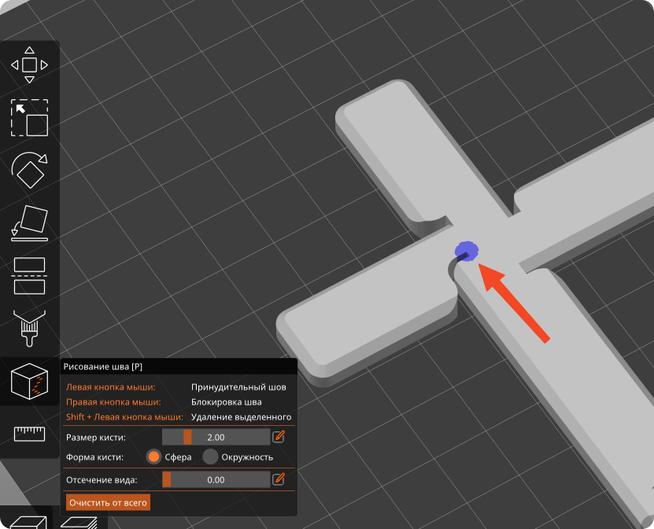
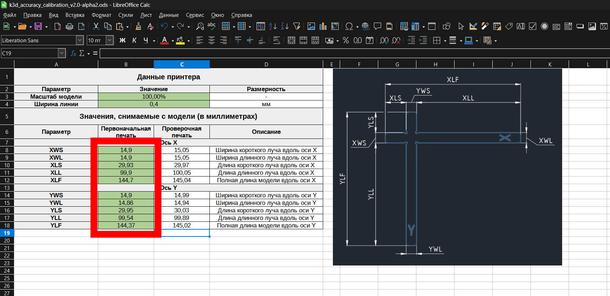
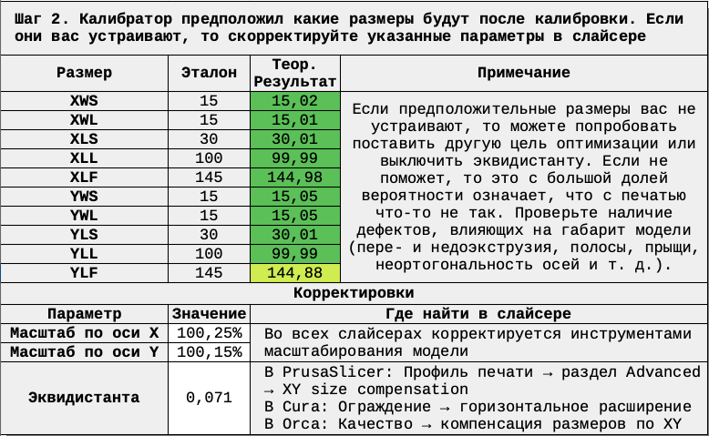
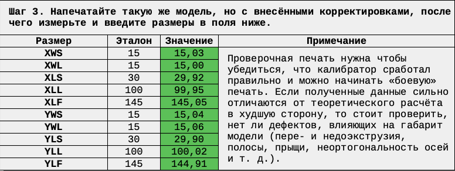
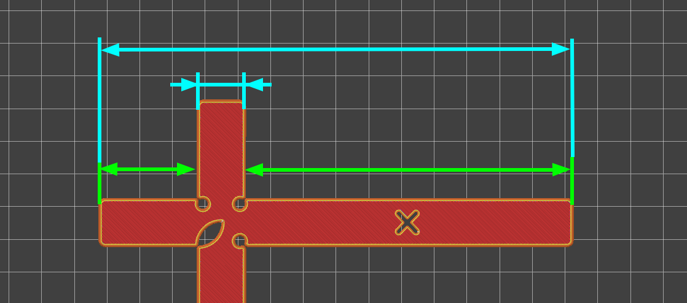

# K3D Тест точности
<figure markdown="span">
    <iframe width="560" height="315" src="https://www.youtube.com/embed/6seFEWIGTtU?si=uu8G1Tx8gjeh4fvN" title="YouTube video player" frameborder="0" allow="accelerometer; autoplay; clipboard-write; encrypted-media; gyroscope; picture-in-picture; web-share" referrerpolicy="strict-origin-when-cross-origin" allowfullscreen></iframe>
</figure>

## Скачать

- [:material-file-document: Таблица v3.0 (LibreOffice)](./releases/calcs/k3d_accuracy_calibration_v3.0.ods){ download="k3d_accuracy_calibration_v3.0.ods" }
- [:material-file-document: Таблица v3.0 (Excel, OpenOffice)](./releases/calcs/k3d_accuracy_calibration_v3.0.xls){ download="k3d_accuracy_calibration_v3.0.xls" }
- [:material-video-3d: Модель v8 STEP](./releases/models/k3d_accuracy_test_v8.stp){ download="k3d_accuracy_test_v8.stp" }
- [:material-video-3d: Модель v8 STL](./releases/models/k3d_accuracy_test_v8.stl){ download="k3d_accuracy_test_v8.stl" }

Старые версии можно найти на [странице релизов](./releases.md).

## Как пользоваться

### Подготовка

На момент этой калибровки у вас уже всё остальное должно быть прям хорошо настроено, принтер должен печатать без дефектов, влияющих на геометрию деталей. К ним относятся слоновья нога, пере- и недоэкструзия, всякие полосы, сильные рябь и эхо и так далее. Как настроить принтер с нуля можно почитать [в статье на сайте](../index.md){ target="_blank" } или в [видео на YouTube канале](https://youtu.be/doenKnVk0Ec){ target="_blank" }.

Также для снятия размеров нужен штангенциркуль, желательно от 150мм и с ценой деления 0.01 - 0.02 мм. Можно использовать штангенциркули с ценой деления больше или размером меньше, но результат будет хуже.

### Печать модели

<figure markdown="span">
    { width="600" }
</figure>

Модель следует распечатать на обычных для вас настройках из материала, для которого вы хотите получить корректировки. Единственное исключение - надо разместить шов на специальном углублении, указанном на изображении выше. В PrusaSlicer и OrcaSlicer это делается с помощью инструмента `рисование шва` (`seam painting`). В Cura такой функциональности нет.

После печати не стоит сразу снимать деталь со стола. Лучше всего будет подождать пока она остынет до комнатной температуры сама. Если покрытие стола съёмное, то можно снять его вместе с деталью и положить на поверхность комнатной температуры, чтобы охлаждение произошло быстрее.

### Снятие размеров

!!! note "Перед снятием размеров рекомендуется проверить, перпендикулярны ли лучи друг другу. Если нет, то надо решить эту проблему до калибровки точности и перепечатать модель" 

В таблице справа есть изображение, с указанием как снимать размеры с детали (обведено жёлтым). Эти размеры необходимо снять штангенциркулем и ввести значения в таблицу (обведено красным). При этом стоит учесть, что размеры XLS, XLL, YLS и YLL снимаются глубиномером, а остальные - губками штангенциркуля.

Зелёный цвет означает, что размер отличается от эталонного на менее чем 0.1мм, салатовый менее 0.2мм, жёлтый менее 0.3мм, красный - более 0.3мм. Если у вас самые большие размеры подсвечены красным, то не стоит пугаться, это в целом нормально для FDM 3D печати. Главное чтобы эти отклонения хорошо компенсировались.

### Теоретический расчёт

<figure markdown="span">
    { width="600" }
</figure>

Таблица рассчитала корректировки и какими предположительно станут размеры после этих корректировок. Если предположительный результат вас устраивает, то вводите указанные корректировки в слайсер. Куда вводятся корректировки описаны в столбце "где найти в слайсере.

Если теоретический результат вас не устраивает, то можно попробовать изменить цель оптимизации или выключить эквидистанту. Чаще всего это ведёт к ухудшению результатов, но в некоторых случаях может произойти и обратное. Если и это не помогает, то перепроверьте, нет ли на тестовой детали дефектов, влияющих на её геометрию - выровнен ли шов, нет ли слоновьей ноги, полос, сильного эхо и т.д. Если есть, то устраните и переделайте калибровку точности с самого начала.

### Проверочная печать

<figure markdown="span">
    { width="600" }
</figure>

Если вы проводите калибровку точности впервые, или вам предстоит ответственная большая печать, то стоит напечатать ту же самую проверочную модель, которую вы печатали в начале калибровки, но уже с введенными корректировками. Если ввести размеры с неё в соответствующие поля в третьем шаге, то получится проанализировать правильно ли сработала методика и на какую точность можно рассчитывать.

<figure markdown="span">
    
</figure>

Если перейти на страницу "Анализ", то можно будет легко посмотреть какие абсолютные и относительные отклонения есть на вашей модели. Проще всего работать с диаграммами справа. Чем ближе кривая "проверка" (жёлтая) к нулю, тем лучше. 

Слева рассчитываются максимальные и средние относительные и абсолютные отклонения. Эти данные нужны просто чтобы самостоятельно не считать величины ошибок. Если они вам ни о чём не говорят, то и не стоит обращать внимание на эти данные.

## Как методика работает

В методике есть два не зависящих друг от друга расчёта: с эквидистантой и без. В общем случае расчёт с эквидистантой даёт лучшие результаты, чем без эквидистанты. Но в некоторых случаях может быть и обратное + в некоторых случаях использование эквидистанты может быть нежелательным. Поэтому пользователю предоставлена возможность по желанию переключаться между этими расчётами.

### Расчёт с эквидистантой

<figure markdown="span">
    { width="700" }
</figure>

Рассмотрим на примере оси Х, по оси Y всё аналогично. Погрешность в каждом размере можно представить состоящей из двух частей: постоянной (эквидистанта) и переменной (масштаб). Калибровочная модель составлена таким образом, что на ней есть 2 типа размеров:

Зеленые размеры снимаются так, что эквидистанта одной стенки размер увеличивает на свою величину, а второй - уменьшает. Иными словами, эквидистанты компенсируют друг друга. Таким образом на эти размеры эквидистанта не действует и мы можем рассчитать масштаб по этим размерам. В виде формул это выглядит так:

$$
X_{n}=X_{n\_0}*\delta_{n}+\Delta_{n}-\Delta_{n}
$$

$$
\delta_{n}=\frac{X_{n}}{X_{n\_0}}
$$

Где:

- $\delta_{n}$ - масштаб размера n
- $\Delta_{n}$ - эквидистанта размера n
- $X_{n}$ - фактически снятый с детали размер n
- $X_{n\_0}$ - эталонное значение размера n

Далее общий масштаб $\delta$ высчитывается как средневзвешенное масштабов:

$$
\delta=\frac{\sum_{n=1}^{n} \delta_{n}*\omega_{n}}{\sum_{n=1}^{n} \omega_{n}}
$$

Где:

- $\omega_{n}$ - вес размера n. Подробнее про расчёт весов см. в соответствующем разделе

Голубые размеры снимаются так, что на них эквидистанты правой и левой стенок складываются. Но из прошлого шага мы уже знаем масштаб, так что мы можем легко вычислить эти эквидистанты:

$$
X_{n}=X_{n\_0}*\delta+2*\Delta_{n}
$$

$$
\Delta_{n}=\frac{X_{n}}{2*X_{n\_0}*\delta}
$$

Далее вычисляется среднее арифметическое эквидистант:

$$
\Delta=\frac{ \sum_{1}^{n=1} \Delta_{n}}{n}
$$

### Расчёт без эквидистанты

Расчёт без эквидистанты значительно проще. Сначала для каждого отдельного размера рассчитывается компенсация масштабом:

$$
\delta_{n}=\frac{X_{n}}{X_{n\_0}}
$$

После этого считается средневзвешенное масштабов:

$$
\delta=\frac{\sum_{n=1}^{n} \delta_{n}*\omega_{n}}{\sum_{n=1}^{n} \omega_{n}}
$$

### Расчёт весов

Веса размеров используются для того, чтобы увеличить или уменьшить вклад определенных размеров в общее значение масштаба. Например, если мы сделаем все размеры равнозначными (уравняем их веса), то расчёт приведёт к уменьшению относительных ошибок. Если мы поставим значение веса соответствующим отношению величины этого размера к сумме всех размеров, то расчёт приведёт к уменьшению абсолютной величины ошибок. Баланс - это среднее между оптимизацией по абсолютной и относительной ошибке. Математически расчёт выглядит так:

- Минимальная абсолютная ошибка:

$$
\omega_{n\_абс}=\frac{X_{n}}{\sum_{n=1}^{n} X_{n}}
$$

- Минимальная относительная ошибка:

$$
\omega_{n\_отн}=\frac{1}{n}
$$

- Баланс между абсолютной и относительной ошибкой:

$$
\omega_{n\_бал}=\frac{\omega_{n\_абс}+\omega_{n\_отн}}{2}
$$

## Если возникли проблемы

Если у вас возникли проблемы с работой этой методики, то лучше всего будет написать свой вопрос в [общий чат K3D](https://t.me/K_3_D/1944046) с тегом @dmitry_sorkin.
