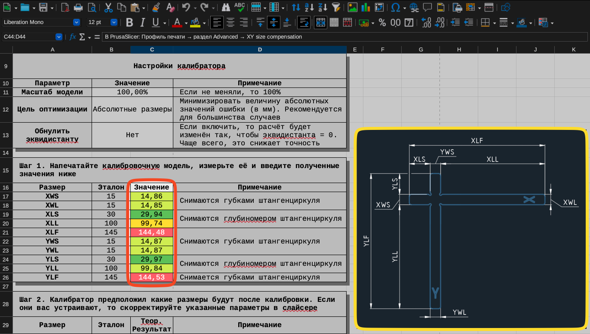
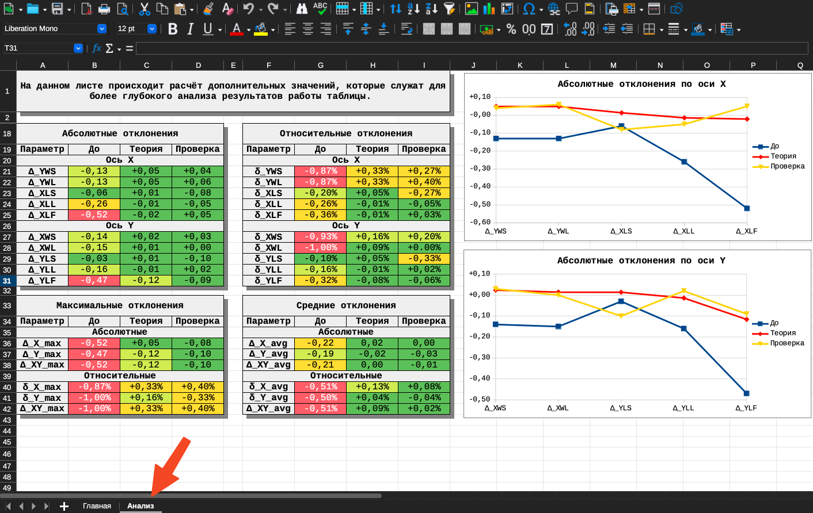

# K3D Тест точности

## Скачать

- [:material-file-document: Таблица v2.0](./releases/calcs/k3d_accuracy_calibration_v2.0.ods){ download="k3d_accuracy_calibration_v2.0.ods" }
- [:material-video-3d: Модель v7 STEP](./releases/models/k3d_accuracy_test_v7.stp){ download="k3d_accuracy_test_v7.stp" }
- [:material-video-3d: Модель v7 STL](./releases/models/k3d_accuracy_test_v7.stl){ download="k3d_accuracy_test_v7.stl" }

Старые версии можно найти на [странице релизов](./releases.md).

## Зачем этот тест нужен?

В FDM 3D печати существует достаточно большое количество факторов, которое влияет на точность размеров получаемых моделей:

- Неправильно подобранное разрешение осей XY влияет на длину перемещений печатающей головки;
- Неправильно подобранный поток утолщает или утоньшает стенки, смещая их внешнюю поверхность относительно "правильного" положения;
- Слишком большой поток и/или пересечение между заполнением и периметрами может "выталкивать" периметры наружу;
- Влажный или бракованный пластик может начинать слегка пениться, увеличивая объём дорожек и приводя к смещению их внешней поверхности;
- Режим работы драйверов шагового двигателя может создавать отклонения от заданной траектории движения;
- Биение диаметра прутка может создавать локальные пере- и недоэкструзии, смещая внешнюю поверхность детали;
- Так как деталь выкладывается из горячего пластика и потом охлаждается, то на неё действует усадка материала, причём в сложной форме.

Это не все причины, которые могут повлиять на размеры деталей, но и этого уже достаточно, чтобы продемонстрировать, что "правильно" настроить свой принтер, чтобы он давал хорошую точность, совсем не легко, а часто даже невозможно. Слишком много факторов, взаимно влияющих друг на друга. Поэтому была придумана методика, которая не пытается исправить причины (для этого есть другие методики), а борется с их последствиями - отклонениями в размерах печатаемых моделей. Такой подход позволяет легко и быстро получить хорошую точность даже с не идеально настроенного принтера.

## Основной принцип методики

### Относительная погрешность

Рассмотрим на примере оси Х, по оси Y всё аналогично. Погрешность положения каждой стенки модели можно представить как состоящую из двух частей: постоянной (эквидистанта модели) и переменной (масштаб модели). На изображении выше зеленые размеры снимаются между двумя стенками, на которые постоянная часть погрешности действует в одном направлении. То есть, если представить снятый с модели размер $X$ через истинный размер $X_{0}$, поправку на масштаб $\delta$, и эквидистанту $\Delta$, то получится следующая формула:

$$
X=X_{0}*\delta+\Delta-\Delta
$$

То есть:

$$
X=X_{0}*\delta
$$

Так как и истинный, и полученный размер мы знаем, то можно легко вычислить масштаб по оси:

$$
\delta=\frac{X}{X_{0}}
$$

### Абсолютная погрешность

Голубые размеры снимаются между стенками, которые смещены эквидистантой в разные стороны. То есть на них влияет и масштаб, который мы вычислили ранее, и удвоенный размер эквидистанты:

$$
X=X_{0}*\delta+2*\Delta
$$

Так как масштаб истинный и снятый с модели размеры мы знаем, плюс уже вычислили масштаб, то можно расчитать величину абсолютной погрешности (эквидистанты):

$$
\Delta=\frac{X}{2*X_{0}*\delta}
$$

Естественно, этот метод является весьма грубым, и не может дать идеальную точность после проведения калибровки. Но он даёт значительное уменьшение погрешностей, чего для практических целей достаточно.

## Инструкция по использованию

### Подготовка

Для использования этой методики необходимо 2 файла: модель и таблица. Их можно найти [странице релизов](./releases.md). Обратите внимание, что таблица подготовлена в LibreOffice и может некорректно работать в других офисных пакетах.

Также для снятия размеров нужен штангенциркуль, желательно от 150мм и с ценой деления 0.01 - 0.02 мм. Можно использовать штангенциркули с ценой деления больше или размером меньше, но результат будет хуже.

### Печать детали

Модель заводится в слайсер и печатается с обычными для вас настройками, кроме одного исключения - шов надо выровнять по ребру на специальном углублении под него. Иначе шов может вносить значительную ошибку в измерения. 

### Ввод данных

В первую очередь стоит ввести масштаб модели в таблице на странице `ввод`. Если вы не изменяли его, то оставьте 100%.

Далее, на том же листе располагаются поля для ввода размеров, а также схема как их снимать. Поля имеют проверку данных, так что, если они подсвечиваются красным, то что-то не так с размером или форматом ввода. Например, размер слишком большой или маленький, или в качестве разделителя использована точка, а не запятая.

!!! warning "На данном этапе значения в колонке `проверочная печать` не заполняются"

### Анализ данных

На странице `Анализ` можно найти информацию касатетельно абсолютных и относительных отклонений и снятых с напечатанной модели (1 столбик), и теоретически рассчитанных размеров после калибровки (2 столбик).

Если теоретический результат оказывается плохим и вас не устраивает, то можно попробовать заново снять размеры с модели. Если это не помогает, то, скорее всего, у принтера есть проблемы с механикой или серьезные проблемы с настройками. Тогда для начала следует заняться поиском и исправлением этих проблем, и только потом вовзращаться к тестам точности.

### Использование результатов

В таблице на странице `Вывод` можно найти данные, которые необходимо будет ввести в слайсер в соотвествующие поля. К сожалению, приходится "крутить" неудобные для изменения параметры - масштаб по осям X и Y. Альтернативного варианта на данный момент нет, так же как и нельзя эти масштабы использовать для изменения разрешения осей.

### Проверочная печать

Для целей проверки, что калибровка сработала верно, и анализа, на какую точность можно расчитывать от этого принтера при текущих настройках, можно сделать проверочную печать. Для неё стоит ввести параметры с листа `Вывод` в слайсер, и нарезать ту же модель с теми же настройками. Данные вводятся на листе `Ввод`, анализ производится на листе `Анализ` в 3 колонке.

## Когда переделывать калибровку?

По моим тестам, результаты этой калибровки не сбиваются, если изменять скорость печати, ширину линий и толщину слоя, количество периметров, тип и плотность заполнения. Но сбиваются, если использовать другой пластик или допустить дефекты печати, например, переэкструзию. Так что перепроводить калибровку следует только при смене типа пластика, или, если вы вынужденно печатаете с какими-то дефектами, например, намеренно допускаете переэкструзию для герметичности деталей.

## Релизы

### Таблица v2.0

[:material-file-document: Таблица v2.0](./releases/calcs/k3d_accuracy_calibration_v2.0.ods){ download="k3d_accuracy_calibration_v2.0.ods" }

Аналогична v2.0-alpha2, за исключением изначально введенных размеров. Смена версии связана с тем, что прошло большое время, таблица протестирована и больше не является альфа версией.

### Таблица v2.0-alpha2

[:material-file-document: Таблица v2.0-alpha2](./releases/calcs/k3d_accuracy_calibration_v2.0-alpha2.ods){ download="k3d_accuracy_calibration_v2.0-alpha2.ods" }

По сравнению с предыдущими версиями:

- Из ввода и расчёта убран поток;
- Расчёт полностью переделан. По предварительным тестам, новая версия работает лучше;
- Ввод замеров проверочной модели перенесен на лист "ввод";

### Модель v7

- [:material-video-3d: Модель v7 STEP](./releases/models/k3d_accuracy_test_v7.stp){ download="k3d_accuracy_test_v7.stp" }
- [:material-video-3d: Модель v7 STL](./releases/models/k3d_accuracy_test_v7.stl){ download="k3d_accuracy_test_v7.stl" }

По сравнению с предыдущей версией:

- Фаска на гранях изменена так, чтобы уменьшить требования к обдуву;
- Надписи сделаны крупнее и насквозь модели, чтобы их было видно с двух сторон.

### Модель v6

[:material-video-3d: Модель v7](./releases/models/k3d_accuracy_test_v6.stp){ download="k3d_accuracy_test_v6.stp" }

По сравнению с предыдущей версией:

- Добавлена "ловушка" для шва, чтобы уменьшить его влияние на снимаемые размеры;
- Добавлена фаска снизу и сверху, чтобы уменьшить влияние крышки и дна, а также слоновьей ноги на снимаемые размеры;
- Уменьшены скругления, чтобы даже при дефектах прохождения поворота, штангенциркуль при измерениях не попал рабочей поверхностью на скругление;
- Модель переведена в точный формат STEP.

### Таблица v1.1

[:material-file-document: Таблица v1.1](./releases/calcs/k3d_accuracy_calibration_v1.1.ods){ download="k3d_accuracy_calibration_v1.1.ods" }

По сравнению с v1.0 исправлены ошибки на листе "анализ".

### Таблица v1.0

Первоначальная версия таблицы из видео.

[:material-file-document: Таблица v1.0](./releases/calcs/k3d_accuracy_calibration_v1.0.ods){ download="k3d_accuracy_calibration_v1.0.ods" }

### Модель v5

Первоначальная версия модели из видео. Может применяться с более новыми версиями таблиц.

[:material-printer-3d-nozzle: Модель v5](releases/models/dimension_test_v5.stl){ download="dimension_test_v5.stl" }

## Если возникли проблемы

Если у вас возникли проблемы с работой этой методики, то лучше всего будет написать свой вопрос в [общий чат K3D](https://t.me/K_3_D/1944046) с тегом @dmitry_sorkin.
