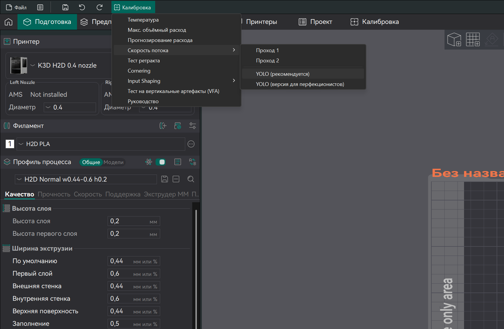

# Калибровка потока

## Особенности калибровки

Поток (множитель потока, flow) - это коэффициент, позволяющий скорректировать количество экструдируемого во время печати филамента. Служит для того, чтобы компенсировать небольшую недо- или переэкструзию, не оказывая влияния на другие аспекты работы экструдера (Pressure Advance, откаты и т.д.).

Для того, чтобы понять в какой момент стоит проводить калибровку потока, надо знать несколько особенностей этого параметра:

- Так как проблемы с разрешением экструдера, PID и Pressure Advance могут повлиять на величину экструзии, то поток следует калибровать после калибровки этих параметров;
- Так как поток влияет на геометрию деталей, то калибровку точности следует проводить после калибровки потока
- Калибровки Input Shaping, включая подбор максимальных ускорений, а также калибровка откатов не оказывают никакого влияния на поток, равно как и наоборот. Поэтому эти калибровки можно проводить в любом удобном для себя порядке
- При правильно подобранном разрешении экструдера, поток не должен выходить за пределы [90...110]%. Исключением являются эластомеры и специальные пенящиеся филаменты. Если значение потока по калибровке выходит за эти пределы, то следует вернуться к калибровке разрешения экструдера, после чего переделать и все следующие за ним калибровки;
- Все экструдеры дают разную недоэкструзию при разном объёмном расходе. На низко- и среднепроизводительных хотэндах (МОР до ~25мм³/с) этот эффект почти незаметен
- Значение потока стоит перекалибровывать при изменении всего, от чего может зависеть количество экструдируемого филамента: сопла, подающего механизма, температуры, типа филамента (а иногда и производителя или даже цвета) и т.д.

Также очень важно понимать, что поток - это не какой-то базовый параметр а-ля разрешение экструдера. Это просто корректировка небольшой недо- или переэкструзии, связанной с неидеальностью работы 3д принтера. Поэтому, если при том значении потока, которое вы получили при калибровке, на реальных деталях наблюдается пере- или недоэкструзия, то стоит на глаз подкрутить значение потока таким образом, чтобы дефекты прошли. Еще одним следствием этого факта является то, что не обязательно получать значение потока именно с помощью калибровки. Допустимо подбирать это значение на глаз по реальной печати. То есть калибровка потока - это не единственно правильный способ нахождения "правильного" значения этого параметра, а всего-лишь простой и быстрый способ подобрать его, не портя реальные детали.

## Калибровка потока средствами OrcaSlicer



!!! note "Рекомендуемый вариант"

1. Выберите профили принтера и материала, для которых вы хотите провести калибровку потока;
2. В верхнем меню выберите `Калибровка` -> `Скорость потока`[^1] -> `YOLO (рекомендуется)`;
3. Напечатайте полученные модели;
4. Выберите ту деталь, поверхность которой наиболее гладкая, без щелей или выпирающих за пределы слоя гребней;
5. Сбросьте проект (`Файл` -> `Новый проект`), изменённые настройки не сохраняйте;
6. Внесите указанную на выбранной детали корректировку в `Настройки материала` -> `Филамент` -> `Коэф. потока модели` и сохраните профиль.

## Калибровка потока в PrusaSlicer


В PrusaSlicer нет встроенной калибровки потока, поэтому её придётся настроить самостоятельно:

1. Скачайте [калибровочную модель](./models/k3d_flow_test.stl){ download="k3d_flow_test.stl } и откройте её в слайсере;
2. Установите следующие настройки:
      1. 0 слоёв дна;
      2. толщина крышки от 1 до 1.5 мм;
      3. 2 периметра;
      4. заполнение 30% прямолинейное;
      5. шайблон заполнения крышки - хорды Архимеда;
      6. множитель потока 1.0;
      7. компенсацию потока на малых областях выключить (если есть);
3. В профиле принтера добавьте в G-код после смены слоя:
```
{if layer_z <= 2}M221 S90
{elsif layer_z <= 3}M221 S92
{elsif layer_z <= 4}M221 S94
{elsif layer_z <= 5}M221 S96
{elsif layer_z <= 6}M221 S98
{elsif layer_z <= 7}M221 S100
{elsif layer_z <= 8}M221 S102
{elsif layer_z <= 9}M221 S104
{elsif layer_z <= 10}M221 S106
{elsif layer_z <= 11}M221 S108
{elsif layer_z <= 12}M221 S110
{endif}
```
4. Нарежьте и напечатайте модель;
5. На получившейся модели поток на первом сегменте равен 90%, на последнем - 110%. Сегмент, на котором поток равен 100%, отмечен кружком на боковой стороне. Выберите тот сегмент, на котором нет щелей, но нет и гребня между центральным кольцом и внешними полукольцами на заполнении;
6. Измените множитель потока в профиле материала и сохраните его;
7. Сбросьте изменения в профилях принтера и печати.

!!! warning "После калибровки не забудьте сбросить изменения в профиле принтера. Если забыли это сделать, то вручную уберите то, что ранее добавляли в G-код после смены слоя"

[^1]: Название "скорость потока" неправильное. Это калибровка именно потока

*[МОР]: Максимальный объёмный расход