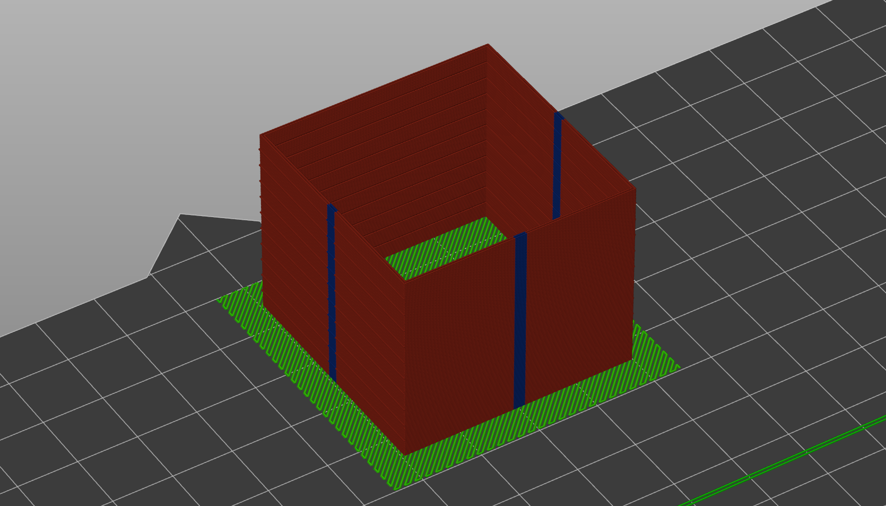
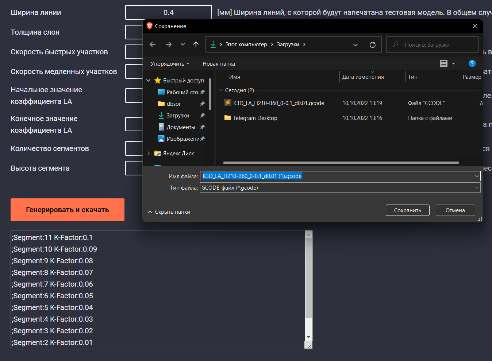
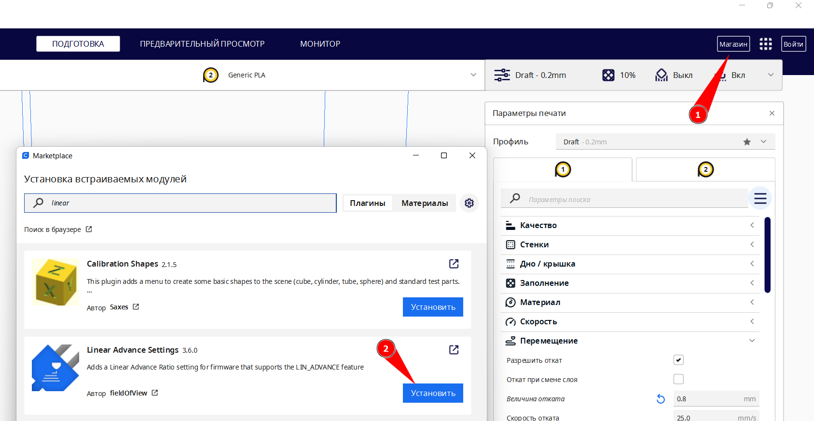
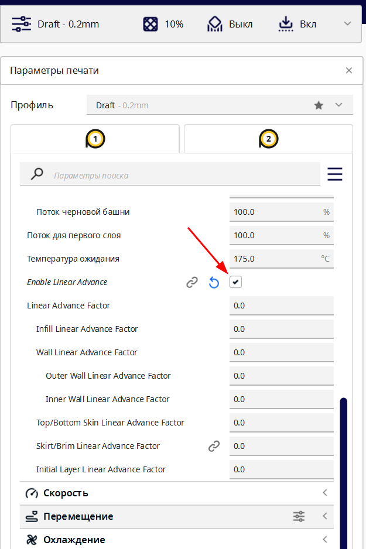
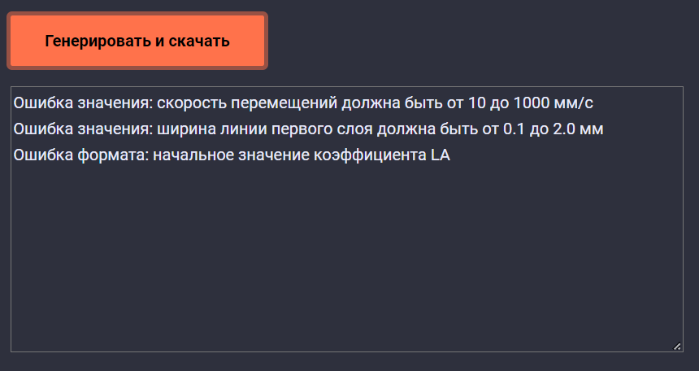

# K3D калибровщик Linear Advance

## Описание



[K3D Калибровщик Linear Advance](./k3d_la.html) генерирует G-code для подбора коэффициента Linear Advance[^1]. Используется методика печати башенки с перепадом скоростей на гранях и ступенчато меняющимся по высоте коэффициентом LA. При этом методика оптимизирована таким образом, чтобы одновременно обеспечить и хорошую видимость результата, и чтобы печать проходила как можно быстрее.

## Плюсы методики K3D

- Коэффициент LA проверяется так, что почти полностью исключено влияение посторонних факторов (скругления углов из-за использования Input shaping`а[^2], недо- и переэкструзии и так далее);

- При снятии показаний с модели надо смотреть только в одно место, а не сверять несколько показаний из разных мест;

- Первый слой зигзагом обеспечивает надежное крепление модели во время печати;

- Перед печатью модели делается прочистка экструдера, что увеличивает шанс успешной печати;

- Сегменты с разными значениями отделены выпирающими слоями, что упрощает съем данных с распечатанной модели;

- Калибратор доступен в виде веб-приложения, то есть может быть использован без предварительной установки;

- Методика оптимизирована по скорости печати. Печать модели чаще всего занимает всего 10-15 минут;

## Как пользоваться калибратором

### Настройки


1. Заходите [на страницу калибратора](./k3d_la.html);
2. Перед вами будет список параметров, которые надо указать соответственно вашим обычным настройкам печати из слайсера;
   1. Слева от каждого параметра есть его название, которое соответствует названию с большинстве слайсеров;
   2. Справа есть подробное описание как параметр работает и какие значения стоит указывать;
   3. Все значения стоит указывать цифрами, в качестве разделителя можно использовать как точку, так и запятую;
   4. Введенные значения сохраняются в памяти браузера, так что можете не бояться закрыть или обновить страницу;
3. Нажимаете на кнопку `Генерировать и скачать`

### Если параметры в допустимых диапазонах



Если введенные вами значения параметров соответствуют допустимым диапазонам, то выведется окно скачивания файла и информационное окно внизу страницы. 

Файл следует сохранить и распечатать на принтере привычным для вас методом. Перед печатью рекомендуется перезагрузить принтер чтобы избежать конфликта с ранее напечатанными файлами.

В информационном окне внизу страницы будут выведены параметры LA[^1] для каждого сегмента. Сегменты нумеруются снизу, то есть самый нижний - сегмент 1, второй снизу - сегмент 2 и так далее. 


Не обязательно сохранять куда-то эти значения, так как информация о том, на каком сегменте какой коэффициент LA также сохраняется внутри G-code файла. Вы можете открыть его любым текстовым редактором, например, [Notepad++](https://notepad-plus-plus.org/), и посмотреть значения там. Также информация о начальном и конечном значении LA, а также о приращении LA за сегмент будет сохранена в названии файла.

### Интерпретация результатов


На распечатанной модели будут видны перепады ширины линии в центрах стенок. Вам надо найти на каком сегменте этот перепад будет меньше всего (на фото указан стрелочкой). Коэффициент LA на этом сегменте и есть искомый коэффициент. При этом важно отметить несколько вещей:

1. Лучше всего определять наличие перепада толщины на ощупь, так как при определении на глаз слишком велика вероятность ошибки;
2. Не стоит смотреть на шов так как при правильном к-факторе LA в большинстве случаев шов будет чуть-чуть выпирать. А полностью ровным шов, скорее всего, будет на завышенном коэффициенте LA;
3. Не стоит смотреть на углы модели так как по ним определить правильность коэффициента LA очень сложно. По перепаду толщины в центре модели это делается проще и точнее.

### Сохранение результатов

#### В Prusaslicer и подобных


В Prusaslicer и подобных лучше всего записать команду на установку к-фактора Linear Advance в профиль пластика. Примеры команд для разных прошивок:

- Marlin: `M900 K0.05`
- Klipper: `SET_PRESSURE_ADVANCE ADVANCE=0.05`
- RRF: `M572 D0 S0.05`

Если у вас несколько принтеров, то лучшим решением будет создание отдельных профилей пластика для каждого принтера. Но так же возможно и использовать условия. Подробнее об этом можно узнать в [видео про настройки Prusaslicer](https://youtu.be/BMbgFgzPcG8).

#### В Cura



В Cura вам надо будет нажать на кнопку `Магазин` в правом верхнем углу. После этого надо найти расширение `Linear Advance settings` и установить его.



После этого в разделе `Материал` появится галочка `Enable Linear Advance`. Если её нажать, то появится несколько пунктов для значений Linear Advance для разных типов линий. Поставьте найденный коэффициент во все поля. 

!!! warning "Внимание"
      LA компенсирует вязкость филамента. Вязкость филамента не меняется в зависимости от типа линии. Таким образом, ставить разные коэффициенты LA для разных типов некорректно.

### Если параметры вне допустимых диапазонов



Если указанные вами параметры выходят из допустимых диапазонов, то окна для скачивания файла выведено не будет. В информационном окне будет выведено какие параметры выходят за допустимые пределы. Исправьте эти значения и попробуйте снова.

## Если что-то не работает

### Не появляется кнопки "генерировать и скачать"

Кнопка Генерировать и скачать появляется после того, как браузер загружает основной исполняемый файл программы. Обычно на это уходит менее 20 секунд, но в редких случаях может уйти больше времени. 

Если в течение 2 минут кнопка не появилась, то попробуйте перезагрузить страницу с помощью сочетания клавиш ++ctrl+f5++.

Если после обновления страницы всё равно не появляется кнопки, то, скорее всего, ваш браузер не поддерживает webassembly. В таком случае рекомендуется установить более современный браузер (Chrome, Firefox, Safari, Edge и т.д. последних версий).

### При нажатии кнопки "генерировать и скачать" ничего не происходит

Скорее всего это значит, что вы ввели недопустимые значения параметров и программа вылетела с ошибкой. В этом случае обновите страницу с помощью сочетаний клавиш ++ctrl+f5++, проверьте все значения и попробуйте еще раз.

### Ошибка "move exceeds maximum extrusion"

Эта ошибка возникает в прошивке klipper и решается внесением строчки `max_extrude_cross_section: 999999` в раздел `extruder` в конфигурации.

Это отключит защиту от выдавливания большого количества пластика на маленьких перемещениях. Отключение этой защиты не приводит ни к каким негативным последствиям, то есть у вас не возникнет дефектов печати, не возникнет ситуаций, опасных для механики принтера и так далее.

В целом, работа этой защиты, скорее всего, забагована. На это указывает несколько вещей:

- Она иногда срабатывает и на g-code из Cura или Prusaslicer, которые после отключения защиты печатаются полностью нормально;
- Тот же g-code из калибратора после отключения защиты печатается нормально, без дефектов;
- Ручной поиск где klipper насчитал такую экструзию на данный момент безуспешен. Ни одна из линий в g-code не имеет такой площади сечения, но klipper её где-то находит;
- На других прошивках эти "проблемные" g-code файлы печатаются так же без ошибок и дефектов.

### Если ничего не помогает

В случае, если ничего не помогает, то рекомендуется попробовать в другом браузере или на другом устройстве, например. на телефоне. Если и это не поможет, то обратитесь [в общий чат K3D](https://t.me/K_3_D) с описанием проблемы и тегом @dmitry_sorkin.

## Помочь проекту

Вы можете помочь в создании калибратора, пройдя короткий опрос (1-2 минуты) или пожертвовав произвольную сумму авторам.

[:material-poll: Пройти опрос](https://forms.yandex.ru/u/634412a0aa24bd4166c7f85d/){ .md-button }

[:material-hand-coin: Пожертвовать из РФ](https://donate.stream/dmitrysorkin){ .md-button }

[:material-hand-coin: Пожертвовать из-за рубежа](https://www.donationalerts.com/r/dsorkin){ .md-button }

## Изменения в версиях

### v1.1

- Исправлены допустимые диапазоны для скоростей печати;
- Исправлена команда на установку потока.

```
Дата: 10.10.2022
Автор: Дмитрий Соркин
Telegram: @dmitry_sorkin
E-mail: dbsorkin@gmail.com
```

[^1]:Linear Advance (кратко LA) - алгоритм, позволяющий выровнять ширину линий по траектории. Так же может называться Pressure Advance или Pressure Control в разных прошивках.

[^2]:Input shaping - алгоритм, позволяющий гасить вибрации в механике с помощью изменения сигналов на перемещения. Минусом метода является скругление углов модели, которое часто ошибочно воспринимается как повод изменить коэффициент Linear Advance
