# Калибровка Pressure Advance

## Особенности работы Pressure Advance


**Pressure Advance** (linear advance, pressure control, flow dynamics) - это алгоритм, который синхронизирует фактическую экструзию через сечение сопла с движениями прутка.

При печати без этого алгоритма, при разгонах возникает недоэкструзия, из-за которой линии становятся уже, чем должны быть. При торможениях происходит обратное - возникает локальная переэкструзия и линии становятся шире, чем должны быть. Это ведёт к ряду дефектов:

* Выпирающие внешние углы;
* Скруглённые внутренние углы, что затрудняет стыковку деталей между собой;
* Недоэкструзия вне углов, вплоть до расслоения периметров и образования разрывов;
* Полосы на деталях из-за нестабильной ширины линий;
* Проблемы на нависаниях и мостиках из-за локальной пере- или недоэкструзии;
* Переэкструзия на пересечении заполнения и периметров => проступание заполнения через периметры и ухудшение точности печати.

Если включить PA и правильно выставить его коэффициент, то экструзия нормализуется. Ширина линий становится такой, какую задал слайсер. Уходят или, по крайней мере, очень сильно уменьшаются все из вышеперечисленных дефектов.

## Особенности калибровки

* Коэффициент PA стоит калибровать после калибровки PID и калибровки разрешения экструдера;
* Коэффициент PA стоит калибровать до калибровок потока, откатов и точности;
* Калибровки PA можно проводить в любой момент относительно калибровок Input Shaping'а, максимального объёмного расхода и теста ряби;
* Значение коэффициента PA обязательно должно перекалибровываться при:
    * Изменении типа филамента;
    * Изменении типа или диаметра сопла;
    * Изменении типа термобарьера;
    * Изменении температуры печати;
* Если у вас хотэнд производительностью примерно до 25мм³/с, то ускорения и объёмный расход мало влияют на коэффициент PA, и можно не учитывать это влияние. Если вы используете высокопроизводительные хотэнды а-ля Goliath/CHC XL и подобных, то правильнее будет учитывать это влияние и калибровать адаптивный PA;
* На момент составления статьи (февраль 2026г), начали появляться принтеры с автоматической калибровкой PA. Но она не всегда точна. Поэтому общая рекомендация - попробовать воспользоваться ей. Если качество печати при этом устроит, то оставить всё как есть. А, если при печати будут дефекты, типичные для неправильного коэффициента PA, то переходить на использование ручной калибровки.

## Выбор методики калибровки

Существует большое количество методик калибровки коэффициента PA. Поэтому остро стоит вопрос, какой из них пользоваться. Для выбора подходящей для ваших задач методики, я составил таблицу с плюсами и минусами разных методик.

| Наименование | Плюсы | Минусы |
| :----------- | :---- | :----- |
| OrcaSlicer "линии" | + Проверяет PA изолированно от IS;<br>+ Быстро печатается;<br>+ Тратит мало материала;<br>+ Легко настроить | - Иногда сложно рассмотреть какая из линий ровнее остальных;<br>- Если есть проблемы с первым слоем, то модель может не напечататься, или напечататься с значимыми дефектами;<br>- Нет возможности откалибровать время сглаживания PA;<br>- Нет возможности откалибровать адаптивный PA |
| OrcaSlicer "башня" | + Не страдает от проблем с первым слоем | - Даже небольшое скругление углов из-за работы Input Shaping'а приведёт к тому, что по этой методике будет подобран заниженный коэффициент PA;<br>- Печатается относительно долго;<br>- Нет возможности откалибровать время сглаживания PA;<br>- Нет возможности откалибровать адаптивный PA |
| OrcaSlicer "шаблон" | + Относительно быстро печатается;<br>+ Тратит мало материала<br>+ Не страдает от проблем с первым слоем | - Скругление углов из-за работы Input Shaping'а приводит к тому, что по этой методике будет полученно заниженное значение коэффициента PA;<br>- Нет возможности откалибровать время сглаживания PA;<br>- Нет возможности откалибровать адаптивный PA |
| [Marlin K-factor calibration pattern](https://marlinfw.org/tools/lin_advance/k-factor.html){ target="_blank" } | см. OrcaSlicer "линии" | см. OrcaSlicer "линии" |
| [Методика из документации Klipper](https://www.klipper3d.org/Pressure_Advance.html){ target="_blank" } | + Не страдает от проблем с первым слоем | - Тратит много материала;<br>- Долго печатается;<br>- Скругление углов из-за работы Input Shaping'а приводит к тому, что по этой методике будет полученно заниженное значение коэффициента PA;<br>- Нет возможности откалибровать время сглаживания PA;<br>- Нет возможности откалибровать адаптивный PA |
| [Kcalibrator](https://github.com/ArtificalSUN/Kcalibrator){ target="_blank"} | + Проверяет PA изолированно от IS;<br>+ Отдельное приложение, работающее без интернета или установки слайсеров | - Нет возможности переопределить стартовый и конечный G-коды не влезая в код вручную;<br>- Нет возможности откалибровать время сглаживания PA;<br>- Нет возможности откалибровать адаптивный PA |
| [K3D калибратор PA](./calibrator.md){ target="_blank" } | + Проверяет PA изолированно от IS;<br>+ Есть возможность калибровки адаптивного PA;<br>+ Есть возможность калибровки времени сглаживания PA | - По сравнению со встроенными в слайсеры методами, сложно настроить |

Исходя из перечисленных выше плюсов и минусов разных слайсеров, на данный момент рекомендуется 2 методики. `OrcaSlicer "линии"` проста в настройке и даёт хорошие результаты, но не позволяет откалибровать время сглаживания и адаптивный PA. И `K3D калибратор PA`, который позволяет откалибровать время сглаживания и адаптивный PA, но сложнее в настройке.

!!! note "Методики калибровки PA из OrcaSlicer есть и в Bambu Studio"

## OrcaSlicer "линии"

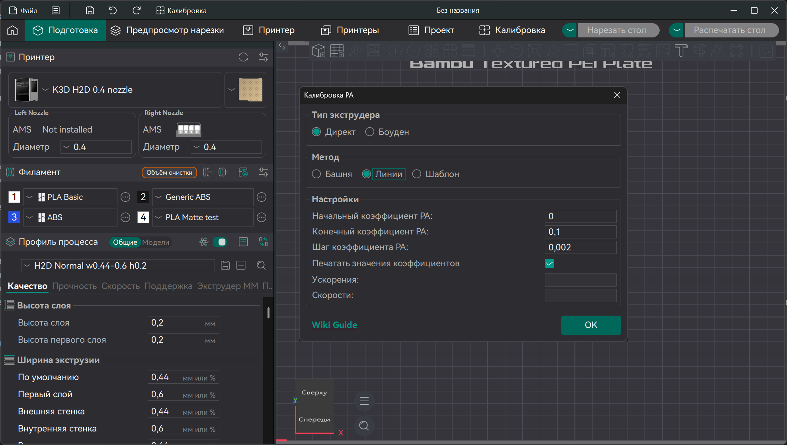

1. В [OrcaSlicer](https://github.com/OrcaSlicer/orcaslicer){ target="_blank" } выберите свой принтер, а также филамент, для которого вы хотите получить коэффициент PA;
2. В верхнем-левом углу окна выберите `Калибровка` -> `Прогнозирование расхода`;
3. В появившемся окне выберите:
      1. Директ
      2. Линии
      3. Начальный коэффициент 0;
      4. Конечный коэффициент 0.1;
      5. Шаг коэффициента 0.005;
      6. Печатать значения коэффициентов вкл.
4. Сгенерируйте G-код и напечатайте его на принтере.

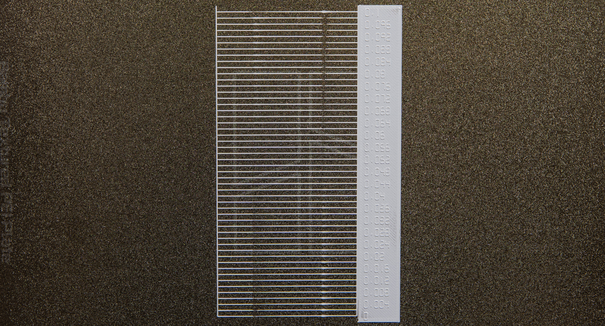

Напечатается шаблон, в котором линии печатаются с переменной скоростью быстро -> медленно -> быстро. В левой части шаблона при недостаточном коэффициенте PA возникает недоэкструзия и утоньшение линии, а при избытке PA возникает переэкструзия. В правой части модели наоборот - при недостатке PA возникает переэкструзия, а при избытке - недоэкструзия.

Вам надо найти такую линию, у которой не будет ни переэкструзии, ни недоэкструзии что в левой, что в правой части модели. То есть, при идеальном коэффициенте PA, изменение скорости печати не должно вызывать перепад толщины линий.

Если на всех линиях есть хоть какие-то перепады ширины линии, и совершенно ровной нет, то надо найти ту линию, на которой перепады толщины меньше, чем на остальных.

После подбора коэффициента PA, его надо сохранить. Как это сделать описано в разделе ["Сохранение результатов"](#_7).

## K3D Калибратор PA

### Особенности методики

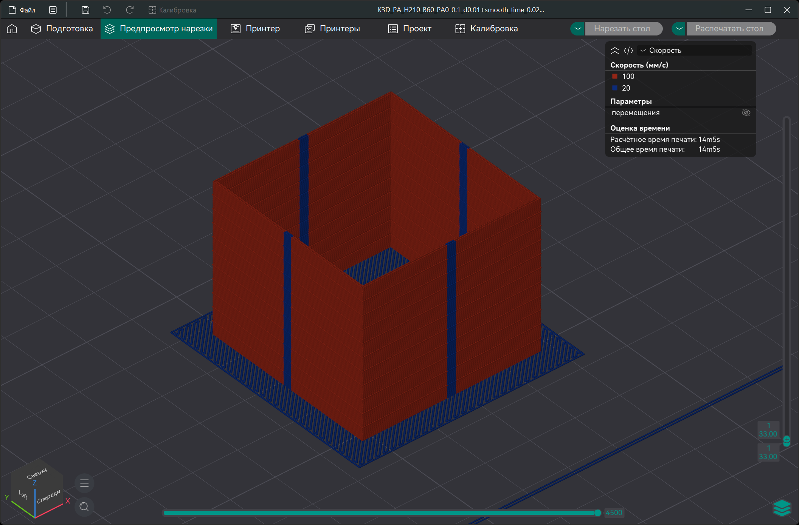

[K3D Калибратор PA](./calibrator.md){ target="_blank" } - веб-приложение, позволяющее сгенерировать G-код для калибровки Pressure Advance.

Принцип похож на таковой из шаблона "линии" в OrcaSlicer. То есть основой теста являются линии с замедленным участком посередине. Если коэффициент PA ниже оптимального, то замедленный участок будет толще, чем участки по бокам. Если, наоборот, коэффициент PA завышен, то участок посередине будет тоньше окружающих.

Особенностью именно этой методики является то, что эти линии печатаются не рядом друг с другом, а друг на друге. Таким образом получаются стенки, которые можно пощупать или посмотреть на них на просвет. Это упрощает снятие данных с напечатанной модели, а также уменьшает требования к качеству печати первого слоя.

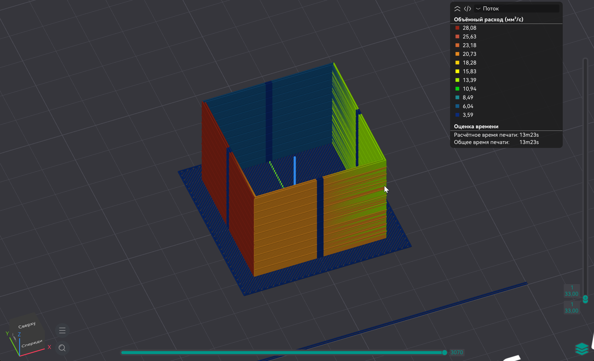

Также в версии 2.0 была добавлена функция калибровки зависимости PA от одного из нескольких дополнительных параметров: времени сглаживания, ускорения или расхода. Это позволяет откалибровать зависимость коэффициента PA от времени сглаживания за 1 печать вместо 3, а адаптивный PA откалибровать за 3 печати вместо 9. Как не сложно догадаться, это экономит очень много времени.

### Настройки калибратора

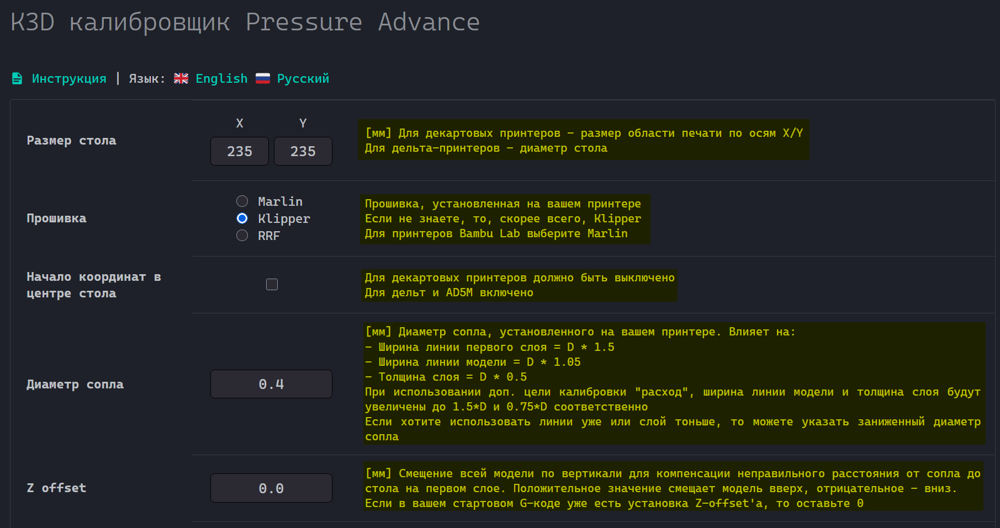

[K3D Калибровщик PA](./calibrator.md){ target="_blank" } составлен таким образом, что инструкции по установке его параметров располагаются прямо рядом с этими параметрами. То есть вам не надо читать каких-то отдельных длинных инструкций. Просто открываете калибровщик, читаете описания параметров, устанавливаете значения этих параметров соответственно написанному, и получаете сгенерированную модель.

### Интерпретация результатов

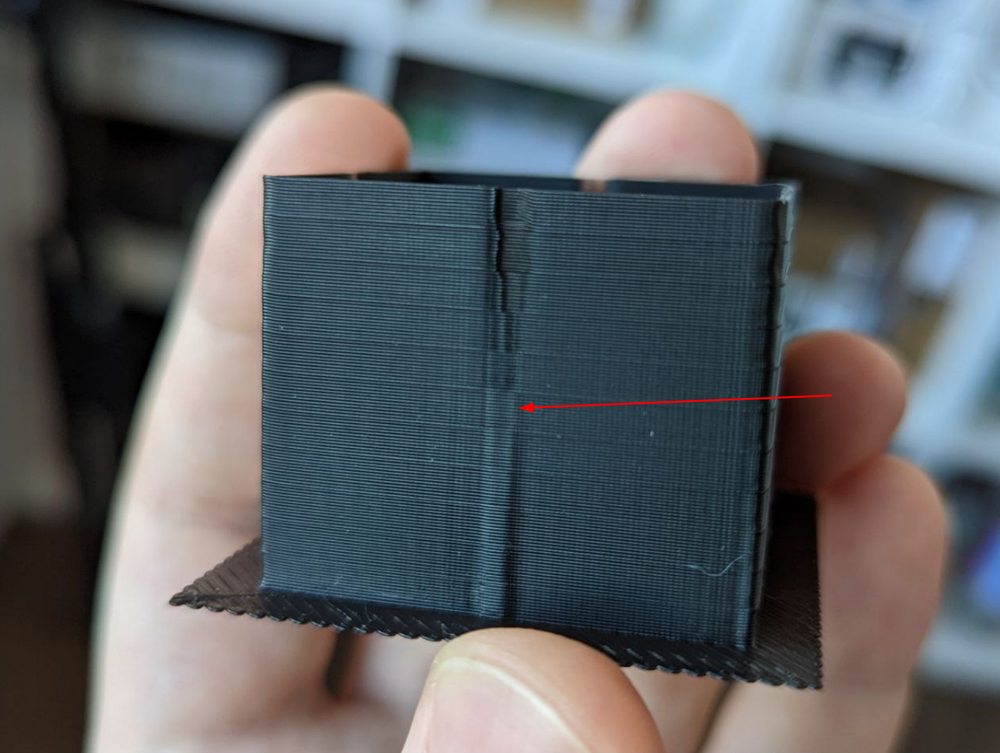

Недостаток PA проявляется как утолщение участка посередине. Избыток PA проявляется как утоньшение участка посередине. Вам необходимо найти такой сегмент, на котором толщина участка посередине будет максимально близка к толщине участков по бокам.

Отдельно стоит отметить, что бывают случаи, когда экструдер принтера не может отработать PA достаточно хорошо. Чаще всего это выглядит как будто бы толщина участка посередине неравномерная, и может с одной стороны выглядеть как утолщение, а с другой - как утоньшение. Иными словами, утолщение из-за недостатка PA проходит позже, чем начинается утоньшение из-за избытка PA. В таком случае стоит выбрать тот сегмент, на котором величина утолщиния равна величине утоньшения.

### Калибровка времени сглаживания

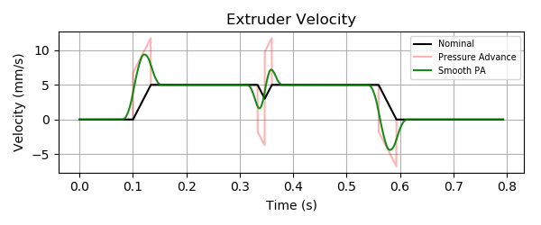

Сглаживание Pressure Advance может быть откалибровано только в прошивке Klipper. Нужно оно для того, чтобы сделать движения экструдера при работе PA более плавными, чтобы нагрузка на подающий механизм снизилась, и он не пропускал шаги при печати сложных элементов.

При относительно небольших ускорениях (до 5000мм/с^2) стандартное значение сглаживания в 0.04с не даёт никаких видимых дефектов. Поэтому, если вы не планируете печатать при ускорениях выше, то зависимость ПА для твёрдых материалов можно оставить штатное значение.

Если вы планируете печатать на высоких ускорениях, то стоит постараться подобрать минимальное время сглаживания, при котором не возникает дефектов. Для этого:

1. Запустите калибровку с доп. целью "время сглаживания". Значения доп. параметра от 0.02 до 0.05;
2. По напечатанной детали найдите ту сторону, на которой нет разрывов после углов и медленного участка в середине. Если таких сторон несколько, то выберите ту, на которой значение сглаживания меньше всего;
3. Коэффициент PA выбирайте именно по этой стороне т.к. его значение зависит от времени сглаживания. На другие стороны не смотрите;
4. [Сохраните полученные данные в профиль филамента](#_7).

Также часто встречается, что при попытке настроить PA для эластомера, не получается подобрать оптимальный коэффициент. В таком случае можно попробовать подобрать коэффициент PA при увеличенном времени сглаживания. Рекомендуется протестировать диапазон 0.04 - 0.07 для средне-мягких, и 0.04 - 0.1 для очень мягких.

### Калибровка адаптивного PA

На принтерах с высокопроизводительными хотэндами и быстрой механикой замечена зависимость коэффициента PA от объёмного расхода и ускорений. Для компенсации этого, в OrcaSlicer был добавлен адаптивный PA, который позволяет указать тройки значений `коэффициент PA + ускорение + объёмный расход`. Несмотря на то, что есть сомнения в правильности такого подхода[^1], альтернативных реализаций адаптивного PA пока нет. Поэтому, придётся калибровать зависимость коэффициента PA от ускорения и объёмного расхода. Делается это таким образом:

1. В [калибраторе](./calibrator.md){ target="_blank" } установите:
      1. Ускорение = 3000;
      2. Допонительная цель калибровки = объёмный расход;
      3. Значения дополнительного параметра от 5 мм^3/c до ~90% от максимального объёмного расхода вашего хотэнда;
2. Сгенерируйте G-код и напечатайте его;
3. В OrcaSlicer в профиле принтера -> `включить прогнозирование расхода` -> `включить адаптивное прогнозирование расхода`;
4. По напечатанной детали определите оптимальный коэффициент PA для задней стороны;
5. Впишите в `измеренные значения адаптивного прогнозирования расхода` через запятую полученное значение PA, расход на задней стенке, 1000. К примеру, если оптимальный коэффициент PA получился 0.05 при расходе 5мм^3/c, то строка должна выглядеть так: `0.05,5,1000`;
6. Повторите пункты 4,5 для других сторон детали, добавляя новые строки в `измеренные значения адаптивного прогнозирования расхода`;
7. Повторите пункты 1-6 для ускорения, равного половине от максимального, и для максимального ускорения;
8. Сохраните профиль филамента.

## Сохранение результатов

### В Prusaslicer

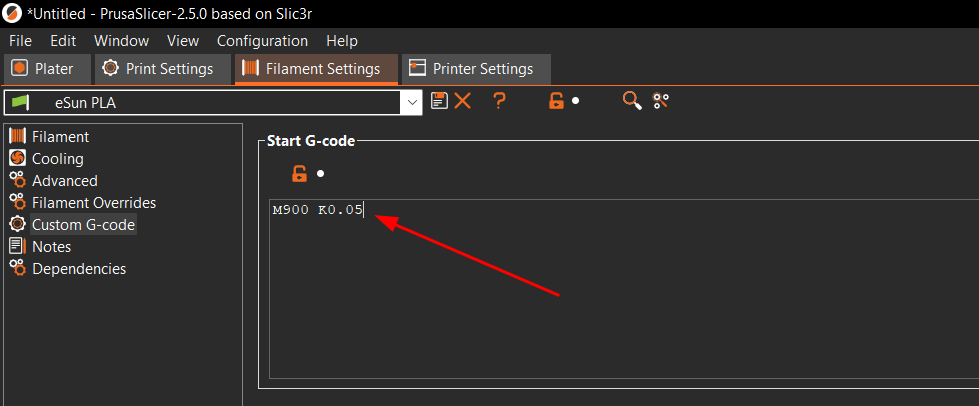

В Prusaslicer и подобных лучше всего записать команду на установку к-фактора Linear Advance в профиль пластика. Примеры команд для разных прошивок:

- Marlin: `M900 K0.05`
- Klipper: `SET_PRESSURE_ADVANCE ADVANCE=0.05 SMOOTH_TIME=0.04`
- RRF: `M572 D0 S0.05`

Если у вас несколько принтеров, то лучшим решением будет создание отдельных профилей пластика для каждого принтера. Но так же возможно и использовать условия. Подробнее об этом можно узнать в [видео про настройки Prusaslicer](https://youtu.be/BMbgFgzPcG8).

### В OrcaSlicer

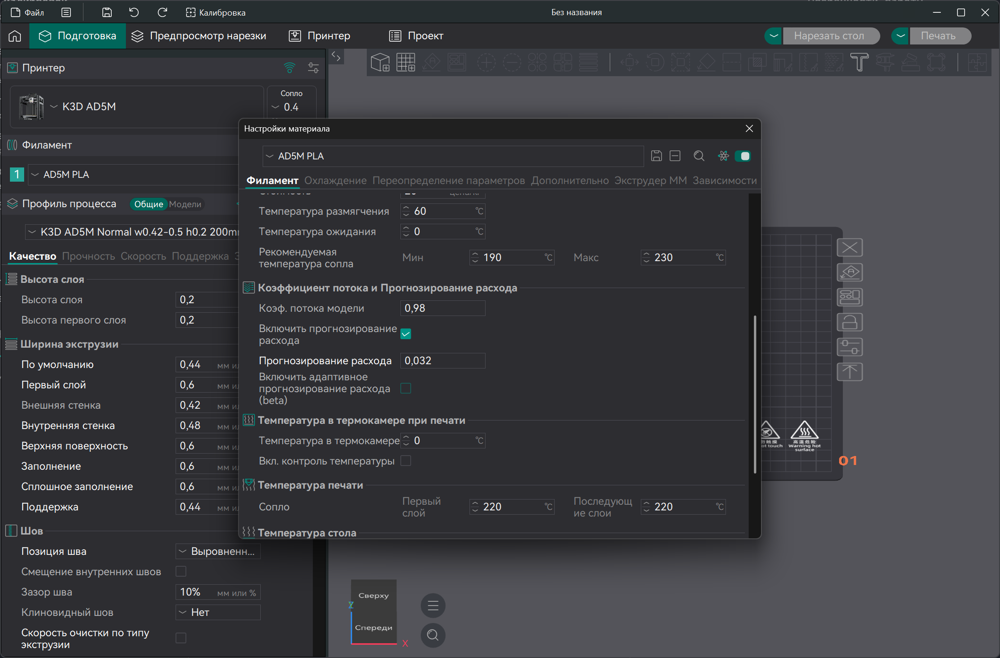

Если вы хотите откалибровать адаптивный PA, то сохранение его результатов описано в [инструкции по калибровке адаптивного PA](#pa).

Если вы используете прошивку Marlin или RRF, которые не поддерживают время сглаживания PA, то можно воспользоваться штатной функцией сохранения коэффициента PA. Для этого в профиле материала перейдите во вкладку `Филамент`, там включите галочку `Включить прогнозирование расхода`, и в поле `Прогнозирование расхода` можно ввести коэффициент PA. Он будет применён при печати после выполнения стартового G-кода.

Если вы хотите сохранить коэффициент вместе со временем сглаживания, то:

1. Проверьте что в профиле материала галочка `Включить прогнозирование расхода` выключена;
2. Перейдите в раздел `Дополнительно`;
3. В `Стартовый G-код филамента` введите команду, подставив свои значения:
```
SET_PRESSURE_ADVANCE ADVANCE=0.05 SMOOTH_TIME=0.04
```
4. Сохраните профиль филамента.

### В Cura

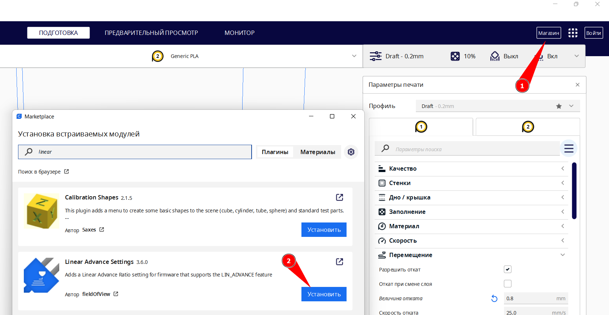

В Cura вам надо будет нажать на кнопку `Магазин` в правом верхнем углу. После этого надо найти расширение `Linear Advance settings` и установить его.

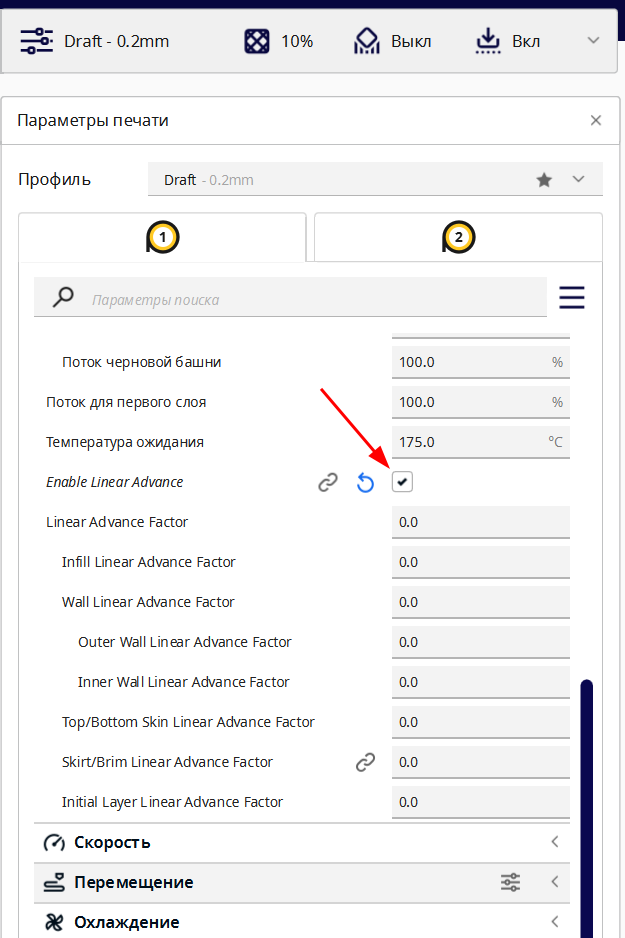

После этого в разделе `Материал` появится галочка `Enable Linear Advance`. Если её нажать, то появится несколько пунктов для значений Linear Advance для разных типов линий. Поставьте найденный коэффициент во все поля. 

!!! warning "Внимание"
      LA компенсирует вязкость филамента. Вязкость филамента не меняется в зависимости от типа линии. Таким образом, ставить разные коэффициенты LA для разных типов некорректно.

## Частые проблемы

### Не появляется кнопки "генерировать и скачать"

Кнопка Генерировать и скачать появляется после того, как браузер загружает основной исполняемый файл программы. Обычно на это уходит менее 20 секунд, но в редких случаях может уйти больше времени. 

Если в течение 2 минут кнопка не появилась, то попробуйте перезагрузить страницу с помощью сочетания клавиш ++ctrl+f5++.

Если после обновления страницы всё равно не появляется кнопки, то, скорее всего, ваш браузер не поддерживает webassembly. В таком случае рекомендуется установить более современный браузер (Chrome, Firefox, Safari, Edge и т.д. последних версий).

### При нажатии кнопки "генерировать и скачать" ничего не происходит

Скорее всего это значит, что вы ввели недопустимые значения параметров и программа вылетела с ошибкой. В этом случае обновите страницу с помощью сочетаний клавиш ++ctrl+f5++, проверьте все значения и попробуйте еще раз.

### Ошибка "move exceeds maximum extrusion"

Эта ошибка возникает в прошивке klipper и решается внесением строчки `max_extrude_cross_section: 999999` в раздел `extruder` в конфигурации.

Это отключит защиту от выдавливания большого количества пластика на маленьких перемещениях. Отключение этой защиты не приводит ни к каким негативным последствиям, то есть у вас не возникнет дефектов печати, не возникнет ситуаций, опасных для механики принтера и так далее.

В целом, работа этой защиты, скорее всего, забагована. На это указывает несколько вещей:

- Она иногда срабатывает и на g-code из Cura или Prusaslicer, которые после отключения защиты печатаются полностью нормально;
- Тот же g-code из калибратора после отключения защиты печатается нормально, без дефектов;
- Ручной поиск где klipper насчитал такую экструзию на данный момент безуспешен. Ни одна из линий в g-code не имеет такой площади сечения, но klipper её где-то находит;
- На других прошивках эти "проблемные" g-code файлы печатаются так же без ошибок и дефектов.

### Если толщина центрального участка не меняется

Проверьте, что файл сгенерирован именно для той прошивки, которая используется на вашем принтере. Команды на установку коэффициента Pressure Advance из одной прошивки не будут работать для других.

Если прошивка выбрана верно, то убедитесь, что проверяемый диапазон значений достаточно широк. Для директов разница в 0.1 уже должна значимо влиять на толщину участка. Для боуденов изменение на 0.5 должно быть хорошо видимо.

Если файл сгенерирован верно, но толщина центрального участка всё равно не меняется, то, скорее всего, у вас прошивка Marlin, собранная без алгоритма Linear Advance. Включить его просто командой не получится, нужно перепрошить принтер такой прошивкой, в которой этот алгоритм был включен во время компиляции. Если вы конфигурируете прошивку самостоятельно, то за включение Linear Advance отвечает директива `#define LIN_ADVANCE` в файле `Configuration_adv.h`.

### Если ничего не помогает

В случае, если ничего не помогает, то рекомендуется попробовать в другом браузере или на другом устройстве, например, на телефоне. Если и это не поможет, то обратитесь [в общий чат K3D](https://t.me/K_3_D) с описанием проблемы и тегом @dmitry_sorkin.

*[PA]: Pressure Advance
*[IS]: Input Shaping

[^1]: калибровка зависимости PA от ускорения - это костыль. Дело в том, что ускорение влияет на коэффициент PA не напрямую, а через изменение скорости изменения объёмного расхода по траектории. Ускорение выше => расход меняется быстрее => меняется температура расплава => меняется его вязкость => меняется коэффициент PA. Но на изменение расхода по траектории влияет не только ускорение, но также изменение ширины линий из-за работы движка Arachne, изменение толщины слоя, геометрия модели и т.д. Иными словами, если делать адаптивный PA правильно, то необходимо учитывать и эти параметры тоже. Но их так много, что откалибровать зависимость PA от них всех было бы почти невозможно. Поэтому правильно было бы реализовать адаптивный PA на уровне прошивке. Он мог бы регулировать коэффициент PA в зависимости от всего 1 параметра - скорости изменения расхода. В таком случае, не требовалось бы учитывать все те параметры, которые влияют на скорость изменения расхода, включая ускорения по осям XY. К сожалению, подобной реализации адаптивного PA пока нет. Поэтому пока приходится пользоваться реализацией из OrcaSlicer, в которой есть возможность указать зависимость PA только от среднего за линию расхода, а также ускорения.