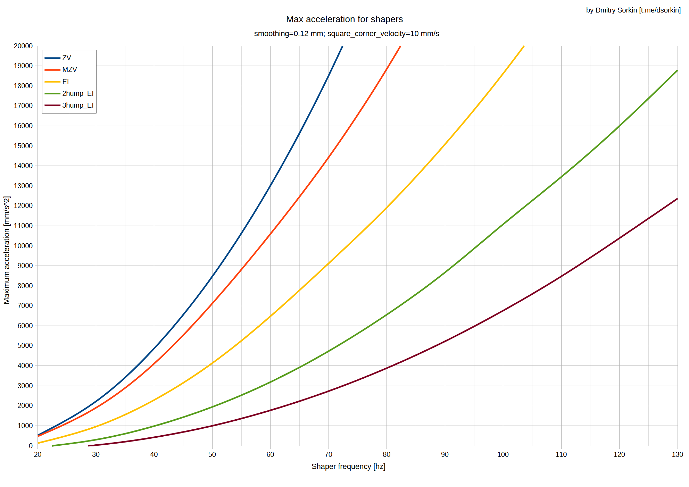
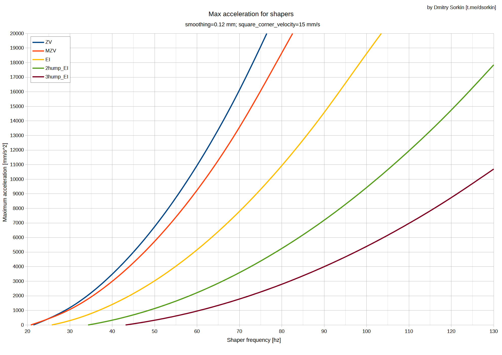
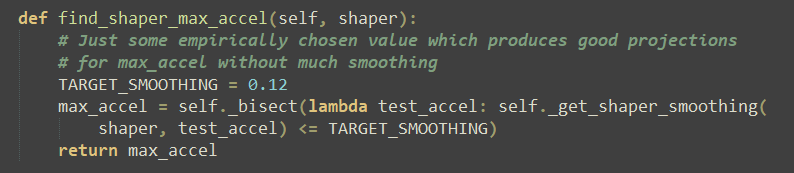

# Ручной подбор частоты Input Shaping

## Подготовка

Перед подбором частоты рекомендуется проверить механику принтера. Убедитесь, что все винты закручены, что все детали на печатающей голове закреплены достаточно жестко, что ремни нормально натянуты и т.д. В случае, если вы собираетесь вносить какие-то изменения в механику принтера, то лучше внести их до подбора частоты, так как изменение массы и конфигурации движущихся частей приведут к необходимости проводить калибровку заново.

### Подготовка прошивки

Для того, чтобы калибровка прошла успешно, нужно будет внести несколько изменений в конфигурационный файл прошивки - `printer.cfg`. Обычно его можно открыть для редактирования через веб-интерфейс. В нём нужно:

1. В разделе `[printer]`:
      1. Установить `max_accel` (максимальное ускорение) как можно большим, но чтобы моторы еще не пропускали шаги. Обычно для дрыгостолов хватает ~5000-8000 мм/с². Для CoreXY и подобных в зависимости от того, насколько хорошая у него механика. Например, для FBG6 и подобных хватит те же 5000-8000 мм/с², а для продвинутых принтеров может понадобиться 10000-20000 мм/с²;
      2. Установить `max_accel_to_decel` равным ускорению, установленному в предыдущем пункте;
2. Добавить пустой раздел `[input_shaper]`. Если он уже есть, то удалять из него ничего не нужно.

Также для проведения теста необходимо будет подготовить тестовый G-код:

1. Скачайте тестовую модель: [:material-printer-3d-nozzle: k3d_ringing_tower.stl](../models/k3d_ringing_tower.stl)
2. Откройте её в любом слайсере и нарежьте со следующими параметрами:
      1. В качестве пластика следует использовать любой простой в печати, желательно тёмного цвета, чтобы эхо было различимо;
      2. Крышку и дно выключить (0 слоёв);
      3. Заполнение выключить (0% плотность);
      4. Кайма около 5 мм, чтобы модель не отрывало при печати;
      5. Скорости и ускорения всех линий предельные для принтера;
3. Загрузите полученный файл в Klipper, но не запускайте печать.

## 1 итерация калибровки

Алгоритм Input Shaping неизбежно приводит к скруглению углов. Величина этого скругления зависит от множества параметров, в том числе типа и частоты шейпера. По типу всё просто: шейпер `zv` скругляет углы меньше остальных, но и гасит вибрации только в очень узком диапазоне частот. `mzv` скругляет углы немного сильнее, но гасит значительно больше вибраций. Далее идут `ei`, `2hump_ei` и `3hump_ei`, каждый из которых скругляет углы значительно больше, чем предыдущий, но и гасит вибрации в значительно более широком диапазоне частот. 

Целью калибровки является подбор наиболее щадящего типа и наиболее высокой частоты шейпера, при которых эхо эффективно гасится. Поэтому, на первый взгляд, логично начинать с наиболее щадящего шейпера - `zv`. Но, к сожалению, этот шейпер эффективен в настолько узком диапазоне частот, что даже проверять его не имеет особого смысла. Так что логичнее всего начать калибровку с шейпера `mzv`, и переходить к следующим шейперам только в том случае, если не получилось добиться хороших результатов на нём.

Чтобы установить шейпер `mzv` на обе оси движения введите команду:

``` dot
SET_INPUT_SHAPER SHAPER_TYPE_X=mzv SHAPER_TYPE_Y=mzv
```

### Ось Y

Введите команды:

``` dot
SET_INPUT_SHAPER SHAPER_FREQ_X=0
```
``` dot
TUNING_TOWER COMMAND=SET_INPUT_SHAPER PARAMETER=SHAPER_FREQ_Y START=30 STEP_DELTA=5 STEP_HEIGHT=3
```

После этого запустите печать ранее нарезнного G-кода и дождитесь её завершения. На получившейся модели каждый сегмент печатается с разной частотой шейпера на ось Y. На нижнем сегменте частота равна таковой из аргумента `START` в предыдущей команде. Каждый следующий сегмент печатается с чатотой на `STEP_DELTA` больше, чем предыдущий.

Осмотрите модель со всех сторон. Не обращайте внимание ни на какие дефекты, кроме эхо после поворотов. Выберите частоту, на которой эхо меньше всего <u>на всех сторонах модели</u>. Если таковых частот несколько, то выберите среднее значение. Это и есть частота шейпера на ось Y в первом приближении.

### Ось X

Введите команды:

``` dot
SET_INPUT_SHAPER SHAPER_FREQ_Y=значение_из_предыдущей_калибровки
```
``` dot
TUNING_TOWER COMMAND=SET_INPUT_SHAPER PARAMETER=SHAPER_FREQ_X START=40 STEP_DELTA=10 STEP_HEIGHT=3
```

После этого запустите печать ранее нарезнного G-кода и дождитесь её завершения. На получившейся модели на оси Y действует шейпер `mzv` с частотой, подобранной ранее. На оси X частота шейпера меняется начиная со значения аргумента `START` с шагом `STEP_DELTA`.

Осмотрите модель со всех сторон. Не обращайте внимание ни на какие дефекты, кроме эхо после поворотов. Выберите частоту, на которой эхо меньше всего <u>на всей модели</u>. Если таких значений несколько, то выберите среднее. Это и есть частота шейпера на ось X в первом приближении.

### Проверочная печать

``` dot
[input_shaper]
shaper_type_x = mzv
shaper_freq_x = {значение для оси Х}
shaper_type_y = mzv
shaper_freq_y = {значение для оси Y}
```

1. Добавьте в printer.cfg код из блока сверху, вставив полученные частоты. Обратите внимание, что частоты вводятся без фигурных скобок
2. Сохраните изменения и сделайте `FIRMWARE_RESTART`
3. Скачайте любую тестовую модель с большим количеством поворотов: 
      1. [:material-printer-3d-nozzle: Лис](./models/fox.stl) (печатать лучше в масштабе 50%)
      2. [:material-printer-3d-nozzle: Кот](./models/calicat.stl)
      3. [:material-printer-3d-nozzle: Кубик](./models/test_cube.stl)
4. Расчитайте максимальные ускорения, как это описано в разделе "подбор максимальных ускорений" ниже;
5. Распечатайте модель с получеными шейперами и ускорениями. Если качество печати вас устраивает, то подбор частот закончен.

## 2 итерация калибровки

В случае, если первая итерация калибровки не дала нужного результата, стоит провести вторую для исключения неправильного подбора частот. В целом, она делается так же, только начинается не с выключения шейпера на ось Х, а с установки значения из первой итерации калибровки.

### Ось Y

1. Введите команду:
``` dot
SET_INPUT_SHAPER SHAPER_FREQ_X=значение_из_предыдущей_калибровки
```
2. Введите команду:
``` dot
TUNING_TOWER COMMAND=SET_INPUT_SHAPER PARAMETER=SHAPER_FREQ_Y START=30 STEP_DELTA=5 STEP_HEIGHT=3
```
1. Запустите печать ранее нарезанной модели;
2. Интерпретируйте как раньше;

### Ось X

1. Введите команду:
``` dot
SET_INPUT_SHAPER SHAPER_FREQ_Y=значение_из_предыдущей_калибровки
```
2. Введите команду:
``` dot
TUNING_TOWER COMMAND=SET_INPUT_SHAPER PARAMETER=SHAPER_FREQ_X START=40 STEP_DELTA=10 STEP_HEIGHT=3
```
3. Запустите печать ранее нарезанной модели;
4. Интерпретируйте как раньше;
5. Сохраните параметры и сделайте `FIRMWARE_RESTART`;
6. Сделайте проверочную печать.

## Проверка шейпера EI

Если вы провели 2-3 итерации калибровки с шейпером `mzv`, но не добились удовлетворяющего вас результата, то стоит попробовать шейпер `ei`. Чтобы установить его на обе оси принтера, введите команду: 

``` dot
SET_INPUT_SHAPER SHAPER_TYPE_X=ei SHAPER_TYPE_Y=ei
```

Далее калибровка делается так же, как с шейпером `mzv`. Обратите внимание, что в прошивке klipper не запрещено устанавливать разные шейперы на оси XY. Если у вас ощущение, что для одной оси хватает шейпера `mzv`, то вы можете установить шейпер `ei` только на другую ось. Тем не менее, для этой калибровки рекомендуется менять шейпер сразу на обе оси. И, если с измененным шейпером получается устраивающий вас результат, то только тогда пытаться "скрестить" результаты калибровки на `mzv` и `ei`.

## Проверка шейперов 2hump_EI и 3hump_EI

Шейперы `2hump_ei` и `3hump_ei` имеют принципиальное отличие от предыдущих. Они гасят вибрации в настолько широком диапазоне частот, что не имеет смысла пытаться применить их к резонансной частоте механики. Поэтому калибровка, хоть и проходит похожим образом, но с одним важным отличием: начальная частота ставится 50 гц, так как эти шейперы на частотах ниже не имеют смысла, а шаг ставится 10 гц.

### Подбор частоты шейпера 2hump_ei для оси Y

1. Введите команду:
``` dot
SET_INPUT_SHAPER SHAPER_TYPE_X=2hump_ei SHAPER_TYPE_Y=2hump_ei SHAPER_FREQ_X=50
```
2. Введите команду:
``` dot
TUNING_TOWER COMMAND=SET_INPUT_SHAPER PARAMETER=SHAPER_FREQ_Y START=50 STEP_DELTA=10 STEP_HEIGHT=3
```
3. Запустите печать ранее нарезанной модели;
4. Интерпретируйте как раньше, но с одним изменением. Если результат вас устраивает на каком-то спектре частот, то выбирайте не среднее, а максимальное значение, чтобы избежать излишнего скругления углов.

### Подбор частоты шейпера 2hump_ei для оси Х

1. Введите команду:
``` dot
SET_INPUT_SHAPER SHAPER_TYPE_X=2hump_ei SHAPER_TYPE_Y=2hump_ei SHAPER_FREQ_Y={значение из предыдущего шага}
```
2. Введите команду:
``` dot
TUNING_TOWER COMMAND=SET_INPUT_SHAPER PARAMETER=SHAPER_FREQ_X START=50 STEP_DELTA=10 STEP_HEIGHT=3
```
3. Запустите печать ранее нарезанной модели;
4. Интерпретируйте как раньше, но с одним изменением. Если результат вас устраивает на каком-то спектре частот, то выбирайте не среднее, а максимальное значение, чтобы избежать излишнего скругления углов;
5. Сохраните параметры и сделайте `FIRMWARE_RESTART`;
6. Сделайте проверочную печать.

### Последний шанс

Если на проверочной модели всё еще остаются значимые вибрации, то повторите подбор для `2hump_ei`, но с шейпером `3hump_ei`. Если и так не получается добиться хорошего результата, то у вашего принтера явно сильные проблемы с механикой. Попробуйте закрепить всё, что может шататься на печатающей голове и балке, увеличить жесткость рамы, заменить ремни на более жёсткие (например, на более широкие) и т.д.

## Подбор максимальных ускорений печати

Когда мы знаем тип и частоту шейпера, которые будем использовать во время печати, мы можем узнать максимальные адекватные ускорения для нашего принтера. Делается это по специальным диаграммам:

### Диаграммы максимального ускорения для шейперов

=== "SCV = 5 mm/s"

      

=== "SCV = 10 mm/s"

      

=== "SCV = 15 mm/s"

      

Скачайте или откройте в новой вкладке изображение, чтобы посмотреть в полном разрешении.

### Как пользоваться этими диаграммами?

1. Откройте диаграмму для вашего значения `square_corner_velocity`. Его можно посмотреть в `printer.cfg` вашего принтера, в разделе `printer`. Если там нет этого параметра, то 5 мм/с;
2. На горизонтальной оси найдите частоту, которая получилась у вас для оси Х;
3. Проведите линию вертикально вверх до кривой, соответствующей подобранному для оси X шейперу;
4. От точки пересечения проведите горизонтальную линию влево. По вертикальной шкале будет понятно максимальное ускорение для оси X;
5. Повторите шаги 2-4 для оси Y;
6. Наименьшее из двух полученных с диаграммы ускорений - это и есть максимальное ускорение для вашего принтера.

### Как вычисляются эти максимальные ускорения?

В прошивке Klipper при автоматическом подборе типа и частоты шейпера с помощью акселерометра также рассчитывается максимальное ускорение для полученных значений. Я взял этот расчёт и построил по нему диаграммы, которые позволяют легко получить абсолютно такие же данные, но при ручной калибровке шейперов. 



Критерий в этом расчёте можно сформулировать так: *"отклонение от изначальной траектории движения не более 0.12 мм"*. Причём 0.12 мм - число, которое было предложено просто потому что даёт хорошие результаты на глаз. Иными словами, критерий не является жестким, и может быть пересмотрен для каждого отдельного человека. 

С точки зрения качества печати, отклонение на 0.12 мм при прохождении угла означает, что детализация упадёт так, будто бы печать идёт соплом на 0.24 мм больше в диаметре. То есть, если печатать на максимальном ускорении, подобранном по этому критерию, с шириной линий 0.4 мм, то внешние углы будут скруглены будто бы ширина линий стоит 0.64 мм. 

Для некоторых применений, например, для печати деталей с мелкими деталями или требовательных к точности геометрии, такое падение детализации может оказаться критичным. В таком случае рекомендуется использовать ускорения ниже, чем эти максимальные. Для других моделей, например, больших деталей или деталей с малым количеством углов, критерий можно ослабить, и допустить скругление углов большим радиусом. Иными словами, можно установить ускорение выше, чем рассчитанное при автокалибровке\по этим диаграммам. 

Тем не менее, крайне не рекомендуется сильно (в 2+ раз) завышать ускорения относительно рассчитанных по этой методике даже на крупных деталях. Скругление углов при работе Input Shaping'а влияет не только на внешние углы моделей, но и на все остальные, включая, например, углы заполнения. Если сильно завысить ускорения, то пересечение заполнения и периметров сильно уменьшится, вплоть до отрыва их друг от друга, что очень сильно повлияет на прочность и жесткость полученной детали. 

Кроме того, обратите внимание, что завышение ускорений приводит к падению детализации, будто бы печать идёт соплом значительно большего диаметра. При этом увеличение скорости печати от увеличения диаметра сопла будет больше, чем от завышения ускорений. Таким образом, сильное завышение ускорений на самом деле не только приводит к ухудшению характеристик изделия, но еще и не выгодно с точки зрения производительности принтера. 