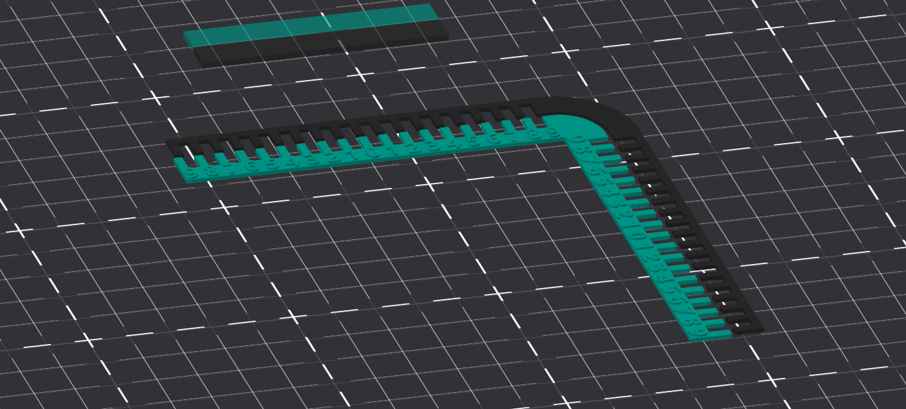
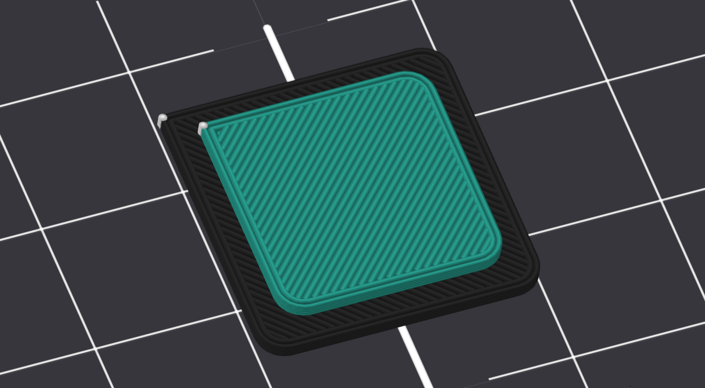
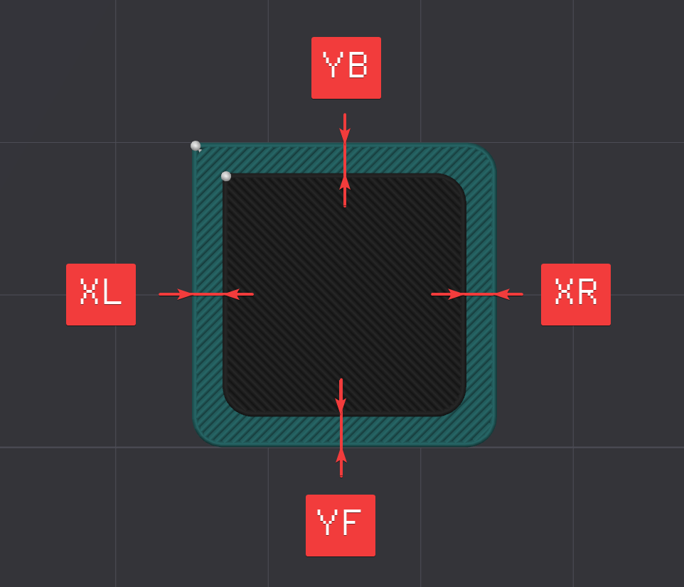

# Калибровка смещения печатающих голов

## Предмет калибровки

Если на принтере, имеющем несколько хотэндов, запустить мультиматериальную печать, то части полученной детали будут смещены друг относительно друга. Этот дефект возникает из-за неидеальности изготовления деталей 3д принтера. Чтобы избежать этого, на подобных принтерах подбирают смещение (offset) по осям X и Y для второго и последующих хотэндов относительно первого.

На многих современных принтерах есть различные системы, позволяющие откалибровать эти смещения автоматически. В таком случае, ручная калибровка может понадобиться только при поломке чего-либо, отвечающего за автоматическую калибровку. На тех принтерах, где автоматической калибровки смещения нет, придётся пользоваться ручной методикой.

## Классическая методика ручной калибровки

Большинство методик ручного подбора оффсета выглядят как две линейки, зубчики одной из которых смещены относительно зубчиков другой. Базовая линейка печатается первым хотэндом, вторая линейка - тем, смещение которого мы хотим откалибровать. После печати на глаз сопоставляется какие зубчики совпадают, и по ним определяется смещение. Хоть эта методика и является очень простой и понятной, но у неё есть множество минусов:

- Относительно высокое время печати;
- Как минимум несколько смен инструмента;
- Достаточно сложно на глаз определить какие из зубчиков сопадают лучше других;
- По большинству подобных моделей нельзя подобрать смещение более 1мм;
- Точность калибровки по этой методике не превосходит ±0.1мм, чего недостаточно для качественной печати.

## Методика K3D

Для исправления проблем этой и подобных ей методик, я придумал новую. В ней печатается очень маленькая деталь, размером всего 20х20х3мм. Она состоит из более широкой части снизу, которая должна печататься первым хотэндом, и более узкой части сверху, печатаемой тем хотэндом, для которого хочется проверить оффсет. После печати штангенциркулем снимается расстояние от стенки узкой части до стенки широкой части слева (XL), справа (XR), спереди (YF) и сзади (YB). Далее оффсеты тестируемой печатающей головы высчитываются по очень простым формулам.

Плюсы этой методики:

- Печатается очень быстро;
- Всего 1 смена инструмента;
- По тестовой модели обычного размера можно определить смещение до 2мм. Но модель можно отмасштабировать и подобрать какое угодно смещение;
- Точность калибровки до ±0.01мм, чего более чем достаточно для качественной печати.

### Как воспользоваться

1. Скачайте [калибровочную модель](./models/k3d_offset_calibration.stl){ download="k3d_offset_calibration.stl"} и откройте её в слайсере;
2. Нарежьте с профилем под максимально высокое качество печати. Любые дефекты на модели могут привести к неправильным значениям смещений;
3. Добавьте смену инструмента на высоте ~2.2мм;
4. Напечатайте деталь;
5. Глубиномером штангенциркуля снимите размеры согласно схеме:

1. Рассчитайте смещения по формулам: $\text{x-offset} = (XL - XR)/2$ ; $\text{y-offset} = (YF - YB)/2$
2. Внесите полученные смещения в конфигурацию прошивки или в слайсер. Если при расчёте получилось отрицательное значение, то так его в конфигурацию и вносите.