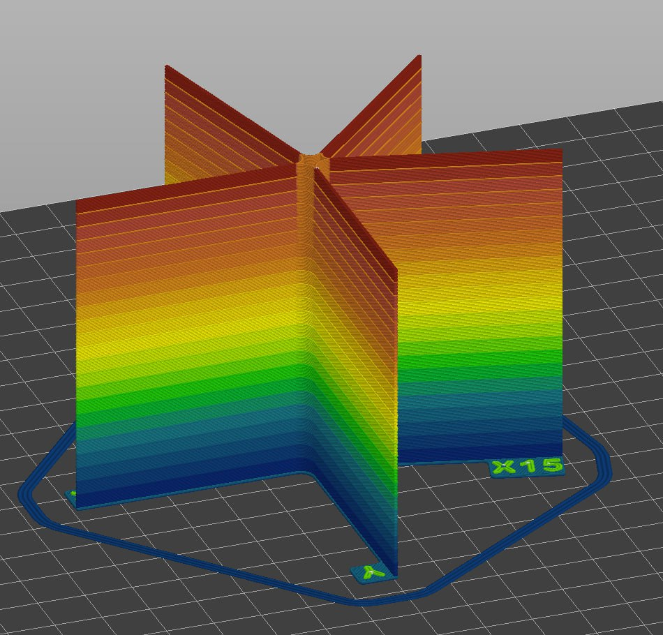

# Тест ряби

Рябь - это дефект, который на данный момент не имеет конструктивного решения. Если она проявляется на вашем принтере, то единственный способ более-менее нормально печатать - это избегать скоростей движения печатающей головки, где этот дефект проявляется. Делается это с помощью печати специально подготовленной модели, в которой есть лучи вдоль осей XY, а также под 15 и 45 градусов к ним. Также модель разделена на горизонтальные сегменты для облегчения интерпретации результатов.

## Скачать

- [:material-download: K3D VFA Test v1](./models/k3d_vfa_test.3mf){ download="k3d_vfa_test.3mf" }

## Настройки печати

Для слайсеров, построенных на базе Slic3r (PrusaSlicer, SuperSlicer, Orca Slicer и т.д.) в файле уже имеются модификаторы параметров печати, которые сделают скорость печати переменной от 20 до 200 мм/с. В этих слайсерах надо просто открыть файл, выбрать обычные для вашего принтера профили печати и распечатать модель.

Для Cura, Simplify3D и других слайсеров, придётся вручную настраивать всё так, чтобы скорость менялась по высоте ступенчато:

- 0.0 - 0.7 мм - любая удобная вам скорость печати;
- 0.7-3.7 - 20 мм/с;
- 3.7-6.7 - 30 мм/с;
- и т.д. до высоты 69.7 мм.

!!! note "Рекомендуется использовать тёмный филамент, который не будет скрывать дефекты поверхности"

## Интерпретация результатов

После печати просто посмотрите на каких сегментах качество печати вас устраивает, а на каких нет. В дальнейшем избегайте скоростей, на которых рябь проявляется сильно.