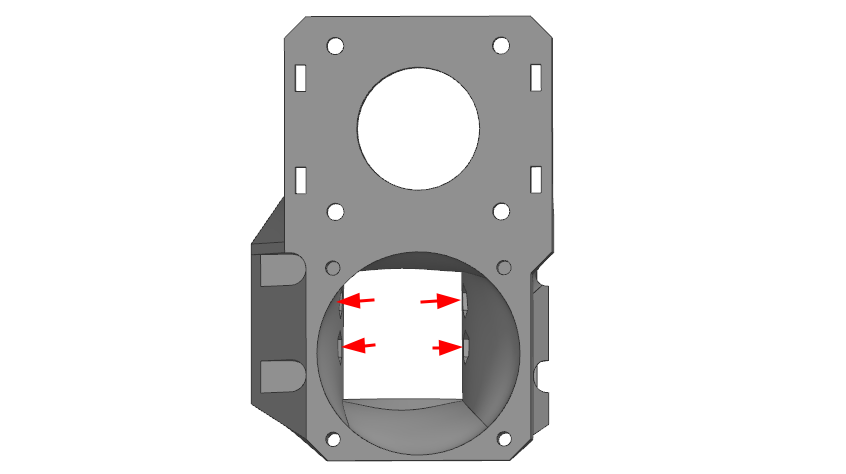
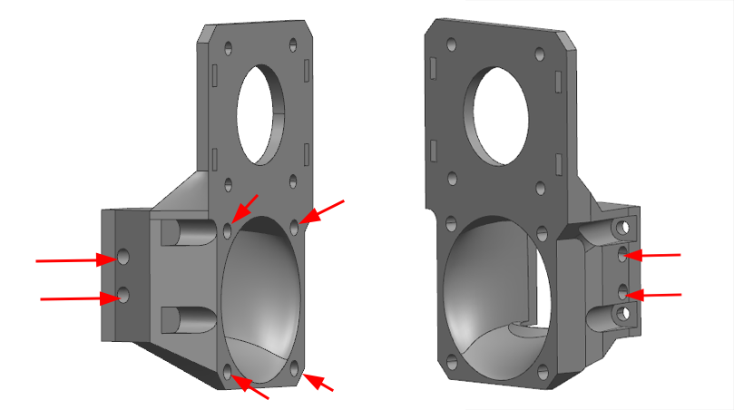
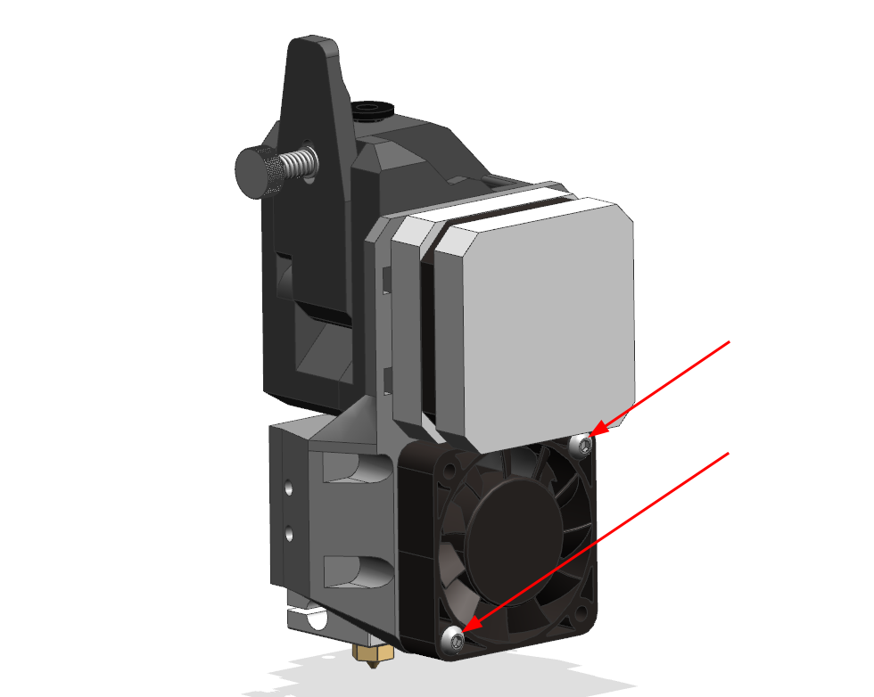
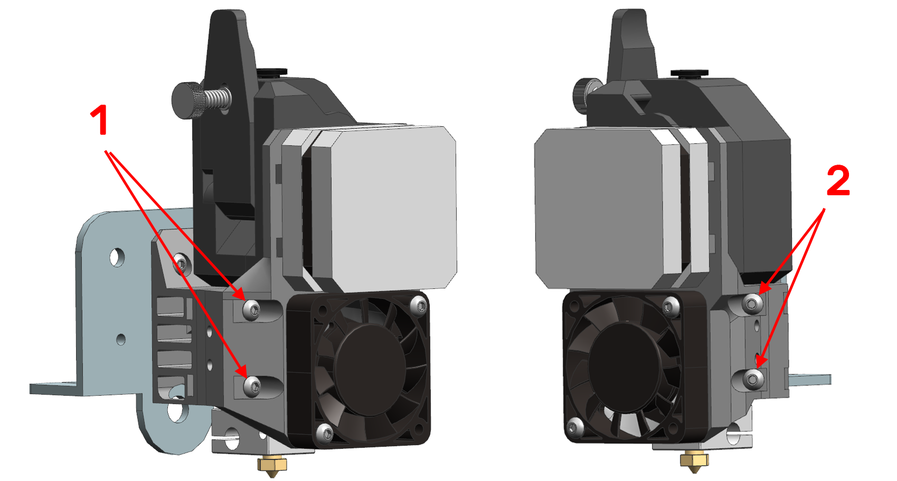
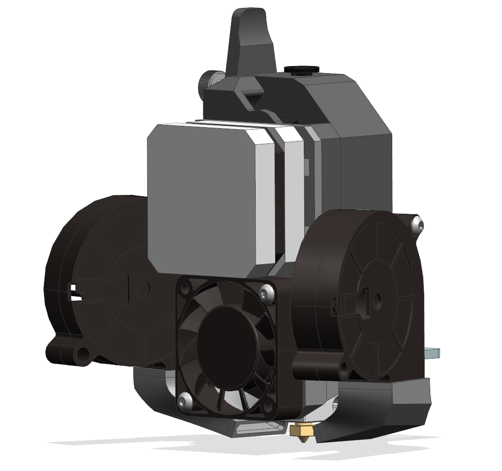

# Сборка K3D EBP

## Подготовка кронштейна (mount)

=== "Вариант на шестигранных гайках М3"

    

    Вставьте 4 гайки в указанные места. Если они плохо держатся, то можно зафиксировать их капельками универсального клея

    :warning: Если гайки плохо лезут, то это означает, что вы плохо подобрали настройки печати и либо деталь дала сильную усадку, либо вы печатали с сильной переэкструзией. В таком случае вам придётся дорабатывать деталь вручную или перепечатать её после перенастройки своего принтера.

=== "Вариант на вплавляемых втулках"

    

    Вплавьте 4 резьбовые втулки в указанные отверстия. Обратите внимание, что отверстия справа не ортогональны основным граням детали, а идут под углом. Важно соблюсти этот угол, так как иначе всё может довольно плохо собираться. 

    Если в процессе вплавки втулок пластик попал внутрь резьбы, то пройдите резьбу метчиком М3.

    Если излишки пластика вылезли выше плоскости, которыми примыкают друг к другу кронштейн и корпус, то эти излишки необходимо будет срезать.

## Установка кронштейна (mount)


Установите кронштейн на каретку оси Х своего принтера и закрепите двумя винтами М3х8 (1). После этого закрутите винт М3х6 (2).

Если в каретке вашего принтера нет отверстия под винт (2), то вы можете либо просверлить отвертие и нарезать в нём резьбу самостоятельно, либо пропустить этот шаг. Эта крепежная точка лишь немного увеличивает жесткость крепления, без неё всё будет работать практически так же.

## Подготовка корпуса (base)

=== "Вариант на шестигранных гайках М3"

    

    Вставьте 4 гайки М3 в указанные шестигранные углубления и просуньте их до конца. Если гайки плохо лезут, то можно помочь себе винтами, закрученными со стороны установки сопел системы охлаждения. Если гайки плохо держатся, то их можно зафиксировать капельками универсального клея.

=== "Вариант на вплавляемых втулках"

    

    Вплавьте 8 резьбовых втулок в указанные отверстия. Оси отверстий перпендикулярны поверхностям, так что по углу можете ориентироваться на это.

    Если в процессе вплавки втулок пластик попал внутрь резьбы, то пройдите резьбу метчиком М3.

    Если излишки пластика вылезли выше плоскости, которыми примыкают друг к другу кронштейн и корпус, то эти излишки необходимо будет срезать.

## Сборка экструдера


Экструдер собирается прямо на корпусе печатающей головы. При этом стоит повернуть хитблок таким образом, чтобы расстояние от него до корпуса было как можно больше.

## Установка вентилятора

=== "С установкой BLTouch"

    

    Если вы хотите установить BLTouch, то вентилятор крепится на 4 точки:
    - В точках (1) вентилятор крепится двумя винтами М3х16 через крепление BLTouch
    - В точках (2) двумя винтами М3х12

=== "Без установки BLTouch"

    

    Если вы не хотите устанавливать BLTouch, то вентилятор крепится двумя винтами М3х12 или М3х14 по диагонали.

## Установка экструдера на каретку принтера



Сборка из предыдущего шага устанавливается на кронштейн и прикручивается двумя винтами М3х20 (1) и двумя М3х10 (2). Лучше сначала закрутить винты слева (1), а потом справа (2).

## Подготовка сопел системы охлаждения

=== "Вариант на шестигранных гайках М3"

    

    Установите гайку в указанное углубление. Если гайка плохо держится, то её можно зафиксировать каплей универсального клея.

=== "Вариант для вплавляемых втулок"

    

    Вплавьте резьбовую втулку в указанное отверстие. Если излишки пластика будут выступать, то срежьте их.

## Установка сопел системы охлаждения


Сопла системы охлаждения устанавливаются каждое на пару винтов. Длина винтов зависит от вариант сборки. Для варианта на гайках используются винты М3х12, для варианта на втулках - М3х6.

:warning: У сопел системы охлаждения **нет** регулировки по высоте. Есть два положения: максимально вверх - для V6 хотэнда, максимально вниз - для Volcano хотэнда. 

:warning: Если вам не хватает возможностей перемещения сопел системы охлаждения, то, скорее всего, вы распечатали детали с переэкструзией, допустили очень сильную усадку или допустили провисание нависающих элементов. В этом случае стоит осмотреть деталь на наличие дефектов и либо исправить их, либо перепечатать деталь с лучше подобранными настройками.

## Установка вентиляторов



Установите вентиляторы в сопла системы охлаждения и закрепите их винтами М3х20, по 1 шт. на каждый вентилятор.

## Подключение электроники

Подключение новых элементов зависит от того, что вы меняли, какой у вас принтер и т.д. Поэтому универсальную инструкцию создать не представляется возможным. Тем не менее, некоторые советы по подключению и настройки электроники дать можно:

- Все вмешательства в электронику должны происходить на полностью отключенном от сети принтере;
- Термистор подключается вместо старого, полярность не важна;
- Если вентилятор обдува радиатора 24в, то он подключается напрямую вместо штатного. Полярность важна;
- Если вентилятор обдува радиатора 12в, то он подключается через понижающий преобразователь;
- Если вентиляторы системы охлаждения 24в, то они подключаются параллельно вместо штатного вентилятора обдува модели;
- Если вентиляторы системы охлаждения 12в, то плюс (красный провод) от них подключается в плюс на выходе понижающего преобразователя. Минусы объединяются и подключаются вместо минуса штатного вентилятора, напрямую в плату. Пример можно посмотреть [здесь](https://youtu.be/Ozurs525QfU?t=1050);

## Что делать после установки

### Внесение изменений в прошивку

В целом, замена экструдера на директ в большинстве случаев не требует вмешательства в прошивку принтера. Исключения только два - если была произведена замена термистора или если был установлен датчик BLTouch, которого ранее не было.

#### Термистор

=== "Marlin"

    В прошивке Marlin требуется внести изменения в файл `Configuration.h`:

    В строке `#define TEMP_SENSOR_0` надо указать номер таблицы. Для NTC100k B3950 - `1`. Для 104GT или 104NT - `5`

    После этого надо пересобрать и установить прошивку. Для разных плат этот процесс различается, так что если вы не знаете как это делается, то вам придётся искать инструкцию самостоятельно.

=== "RepRapFirmware"

    В конфигурации вашего принтера в команде `M308` меняется два параметра:

    | Термистор | T | B |
    |:--------- |:-:|:-:|
    | NTC 100k B3950 | 100000 | 3950 |
    | 104GT или 104NT | 100000 | 4300 |

    Итого команда у вас должна получиться примерно такой:

    ```
    M308 S1 P"e0temp" Y"thermistor" T100000 B4300
    ```

=== "Klipper"

    В файле printer.cfg в разделе `extruder` меняется значение параметра `sensor_type`:

    - Для NTC100k B3950: `Generic 3950`
    - Для 104GT: `ATC Semitec 104GT-2`
    - Для 104NT: `ATC Semitec 104NT-4-R025H42G`

#### BLTouch

Такое положение датчика было выбрано для сохранения доступа к винтам крепления головы, чтобы её было легко снимать на обслуживание. Если этот функционал вам не нужен, то вы можете использовать любое другое крепление для этого проекта, например [это](https://www.thingiverse.com/thing:5569661).

Эта инструкция не носит цели объяснить как с нуля сконфигурировать BLTouch для всех прошивок. Такую инструкцию для интересующей вас прошивки вам придётся искать самостоятельно. Здесь я лишь опишу несколько параметров, специфичных именно для крепления K3D EBP.

=== "Marlin"

    В файле `Configuration.h`:

    ```
    #define NOZZLE_TO_PROBE_OFFSET { 4, -43.25, 0 }
    ```

    Вместо нуля можно указать значения Z-offset, если вы его заранее замерили. Если нет, то оставьте это на потом, этот параметр можно менять и извне прошивки.

=== "RepRapFirmware"

    В конфигурации вашего принтера:

    ```
    G31 P25 X4 Y-42.25 Z0
    ```

    Вместо нуля можно указать значения Z-offset, если вы его заранее замерили.

=== "Klipper"

    В файле `printer.cfg`:

    ```
    x_offset: 4
    y_offset: -43.25
    ```

### Калибровки

После внесения изменений в прошивку, стоит заново повторить все калибровки, которые зависят от печатающей головы в следующем порядке:

1. Калибровка стола и Z-offset
2. [Калибровка PID](https://youtu.be/aizbpcZ7LU0)
3. [Калибровка разрешения экструдера](https://youtu.be/Mga_ezYDTNI). Поток можно оставить 100% для начала и калибровать только в случае пере- или недоэкструзии на моделях
4. [Подбор к-фактора Linear Advance](../calibrations/la/index.md)
5. [Подбор длины и скорости откатов](../calibrations/retractions/index.md)
6. [Подбор частоты Input shaping](https://youtu.be/ZFPkfZEB-XU) (если он есть)

## Поддержать проект

Проект K3D EBP существует и развивается за счёт поддержки сообществом. Если у вас есть желание поддержать автора и тем самым спонсировать выход новых подобных проектов, то это можно сделать следующим образом:

- [Поддержать из РФ](https://donate.stream/dmitrysorkin)
- [Поддержать из-за рубежа](https://www.donationalerts.com/r/dsorkin)
