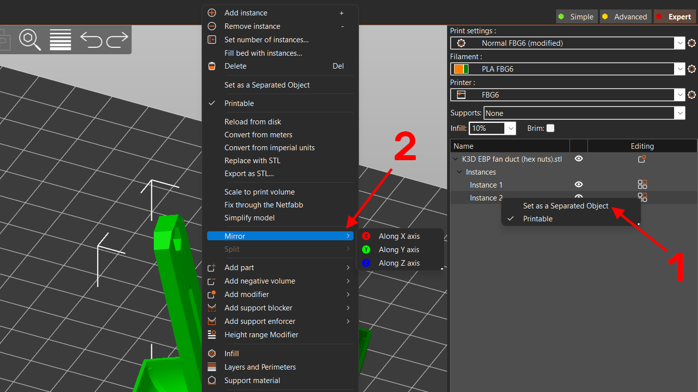
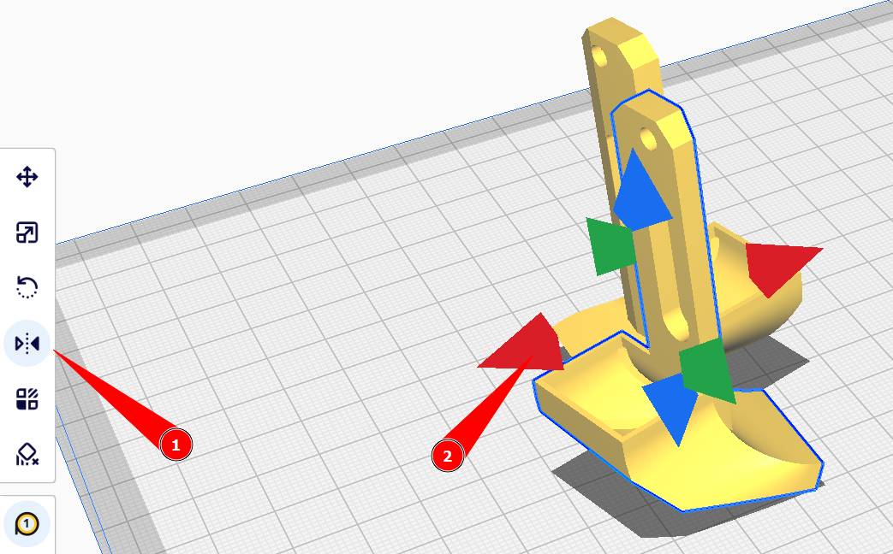
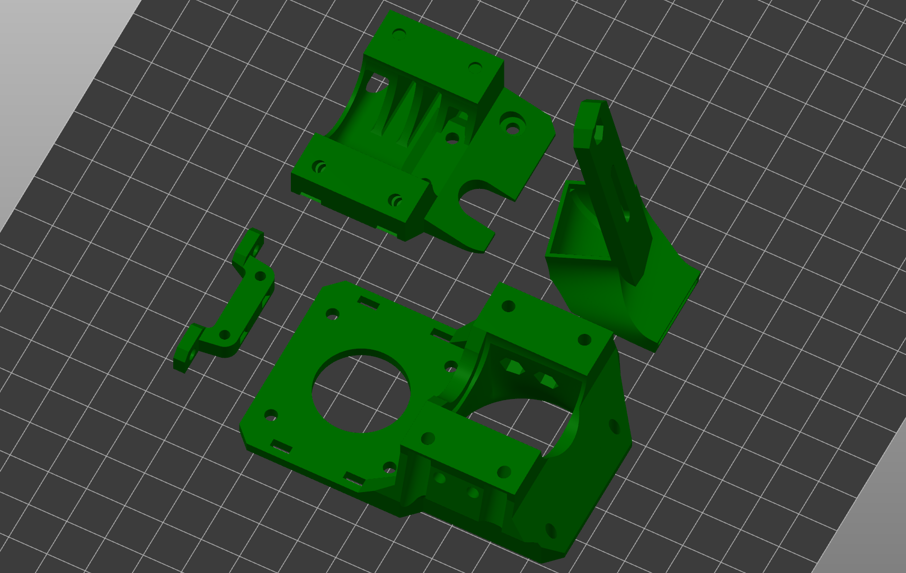
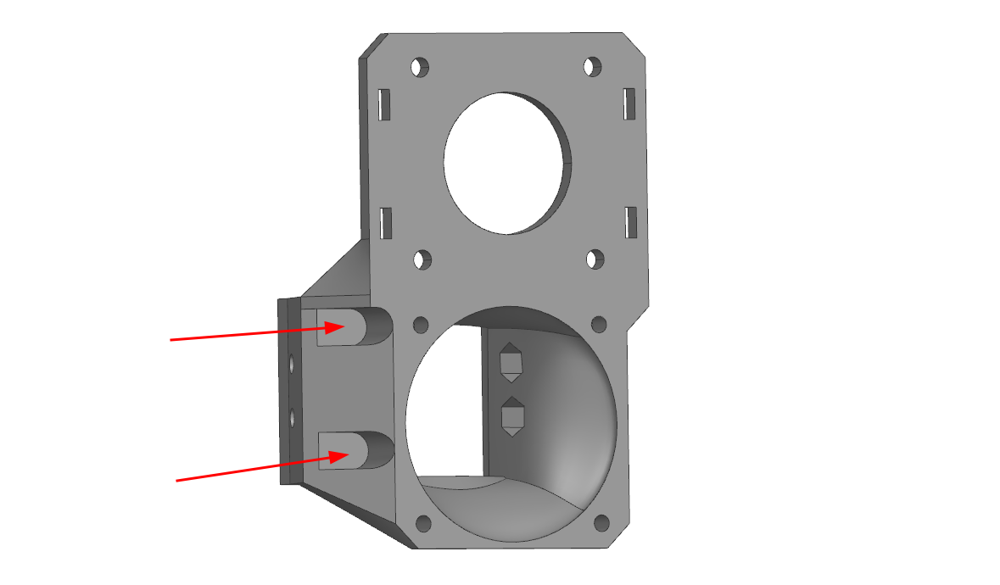

# Печатные детали для K3D EPH

## Скачать модели для печати

Скачать модели и исходники, а также посмотреть списки изменений по версиям вы можете [на странице релизов](./releases.md).

## Настройки печати

### Список деталей

| Наименование | Кол-во | Примечание |
|:------------:|:------:|:----------:|
| Кронштейн (mount) | 1 | |
| Корпус (base) | 1 | |
| Сопло (fan duct) | 2 | Правое и левое сопла зеркальны друг другу, так что используют одну модель, которая отражается уже в слайсере |
| Крепление BLTouch (BLTouch mount) | 0-1 | Крепление опционально и выбирается согласно устанавливаемому хотэнду |

### Как отзеркалить модель

Так как левая модель сопла системы охлаждения зеркальна правой, то придётся отражать вторую модель вручную в слайсере. Другие детали не требуют таких манипуляций.

=== "Prusaslicer"

    

    1. Добавьте два экземпляра правого сопла
    2. В правой панели клик правой кнопкой мыши по любому из пары объектов -> `Set as a separated object`
    3. Правой кнопкой мыши по любому из сопел на столе -> `Mirror` -> `Along X axis`

=== "Cura"

    

    1. Добавьте два экземпляра правого сопла
    2. В левой панели выберите инструмент `Зеркало`
    3. Нажмите на любую из появившихся вокруг модели стрелочку

!!! note "Не забудьте проверить, правильно ли отраженная модель спозиционирована на столе. Если надо, позиционируйте её заново"

### Ориентация моделей



Все модели печатаются без поддержек в указанной на изображении ориентации. Повернуть детали правильным образом можно с помощью инструментов ориентации:

=== "Prusaslicer"

    

    В левом меню инструмент `Place on face` -> клик по поверхности, которой деталь должна соприкасаться со столом

=== "Cura"

    

    В левом меню инструмент `Вращение` -> `Положить плашмя` -> клик по поверхности, которой деталь должна соприкасаться со столом

### Подбор материалов

Детали печатающей головы можно условно разделить на две группы. Первая - сопла системы охлаждения. Практически не испытывают механических нагрузок, но нагружены термически. Так что для их печати не важны прочность и жесткость, но важна термостойкость. В случае, если у вас нет возможности напечатать сопла системы охлаждения из термостойких материалов, их можно напечатать из PETG и обклеить нижнюю часть фольгой. Такие сопла не деформируются при температуре стола до ~90-100°C. Тем не менее, не рекомендуется использовать это решение на постоянной основе.

Остальные детали мало нагружены термически, но сильно механически. Так что для лучших результатов рекомендуется их печать из жестких и прочных материалов.

| Деталь | Предпочтительные материалы | Возможные материалы |
|:------:|:--------------------------:|:-------------------:|
| Корпус | композиты на основе: `PP`, `PA` | `PETG`, `ABS`, `ASA`, `PC`, `PA`, композиты на их основе |
| Кронштейн | композиты на основе: `PP`, `PA` | `PETG`, `ABS`, `ASA`, `PC`, `PA`, композиты на их основе |
| Сопла | `ABS`, `ASA`, `PC`, композиты на их основе | Композиты на основе `PP`, `PA` |
| Крепление BLTouch | Любые материалы, кроме эластомеров | --- |

### Настройки печати

Все детали спроектированы так, что при правильной ориентации не требуют никаких поддержек. Все горизонтальные участки печатаются мостами, которые требуется настроить по [этому видео](https://www.youtube.com/watch?v=Xf8D3R_VADo). 

Также не стоит забывать, что от основной массы деталей требуется высокая прочность и жесткость. Так что, если вы собираетесь печатать детали из плохо спекающегося пластика (`ABS`, `ASA`, `PC`), то рекомендуется поднять температуру, замедлить печать, максимально уменьшить обдув. Для хорошо спекающихся материалов (`PETG`, `PA`, `PP`) это не нужно.

Рекомендуемые значения основных параметров:

| Параметр                         | Значение               | Комментарий |
| -------------------------------- |:----------------------:|:-----------:|
| Ширина линий                     | 0.3-0.6 мм             | Для сопел лучше не превышать 0.5 мм |
| Толщина слоя                     | 0.1-0.3 мм             | |
| Толщина периметров, крышки и дна | 2 мм                   | Для сопел 1-2 периметра |
| Заполнение                       | 100%                   | |
| Поддержки                        | Выключить              | |
| Обнаружение мостов               | Включить               | |
| Заполнение зазоров               | Включить               | |
| Генератор периметров             | Arachne | Для сопел очень желательно, так как они тонкостенные. Для остальных деталей не важно |

## Обработка деталей после печати

После печати детали надо обработать. К обычной обработке вроде удаления каймы и подобного добавляется только необходимость удалить мембраны в отверстиях, указанных на картинках ниже. Эти мембраны нужны только для упрощения печати, в сборке они помешают.

=== "Кронштейн (mount)"

    

=== "Корпус (base)"

    

```
Дата: 21.10.2022
Автор: Дмитрий Соркин
Telegram: @dmitry_sorkin
E-mail: dbsorkin@gmail.com
```