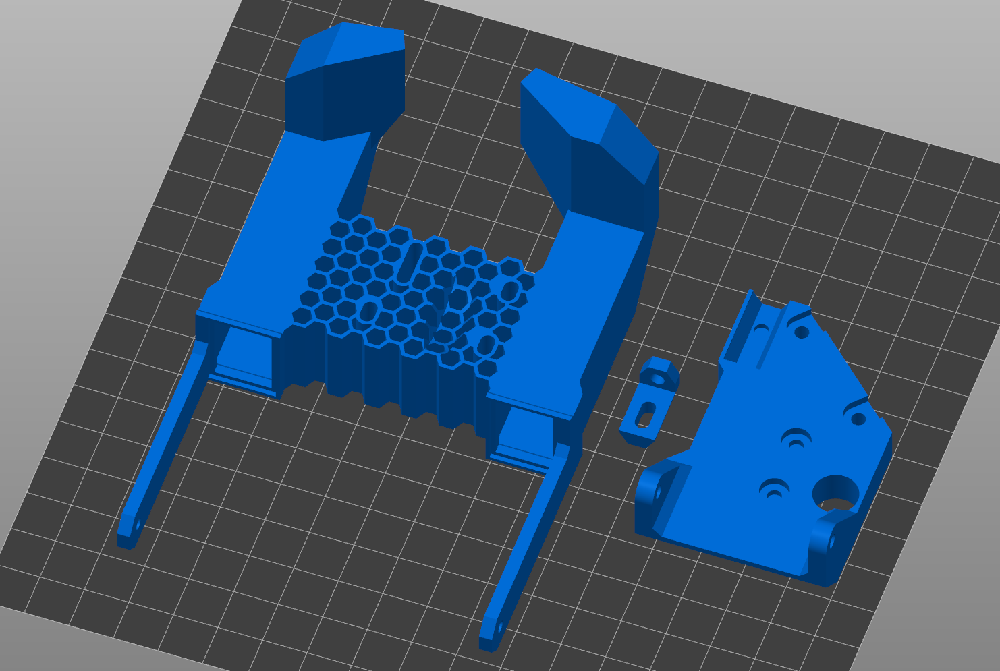
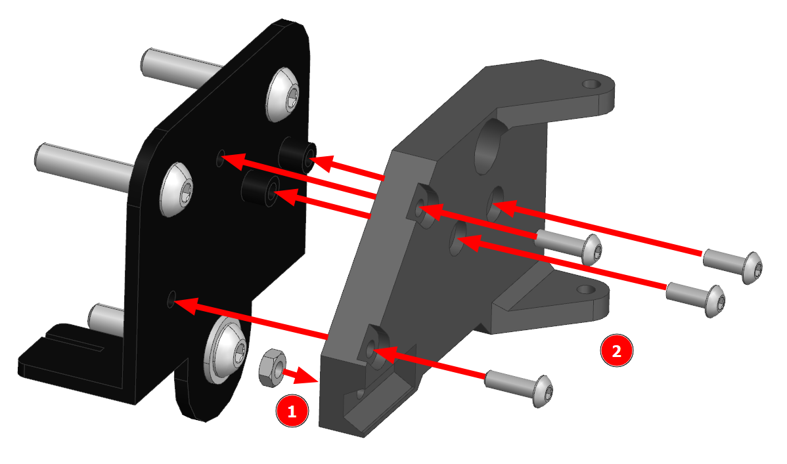
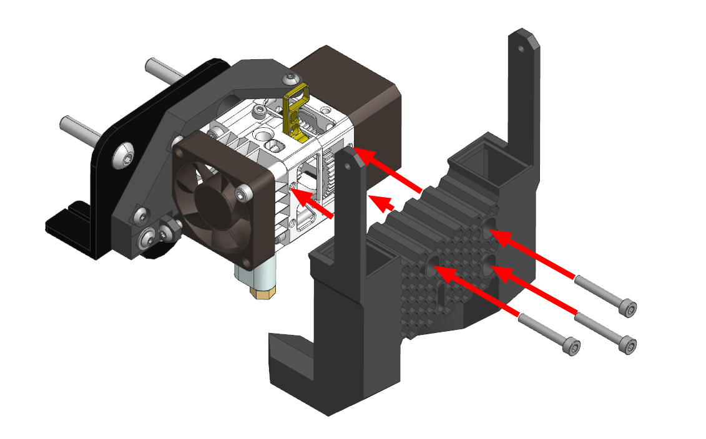
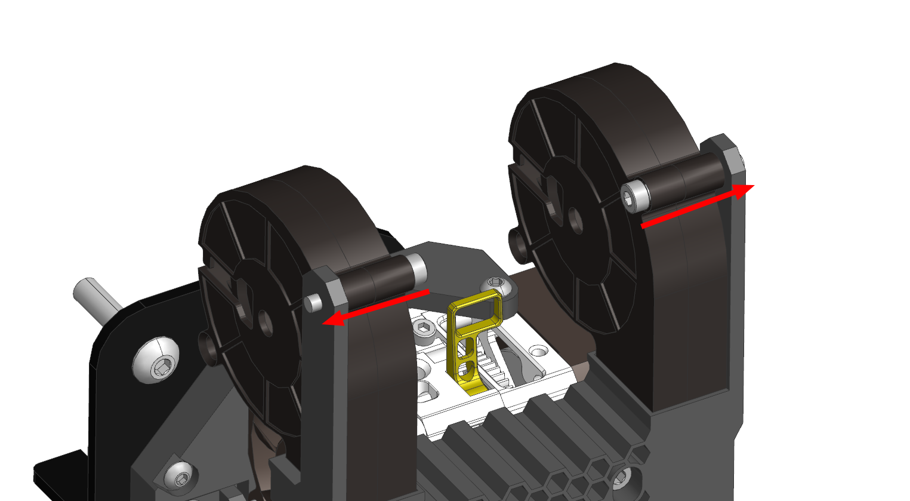
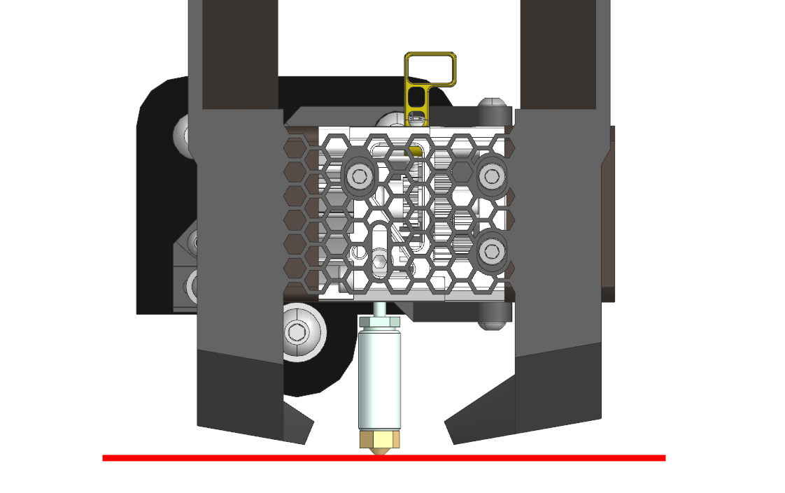

# K3D Ender-3 H2 Printhead


**K3D EHP** - Печатающая голова на основе Biqu H2 для Ender-3 и подобных принтеров. Плюсом является простота, производительность охлаждения и возможность печати даже самыми мягкими видами эластомеров. Минус - относительно высокая цена на экструдер, лежащий в основе этой печатающей головы.

Актуальная версия крепления и системы охлаждени подходит для `H2 V2S` и `H2 V2S Lite`. Для более старых версий (`H2`, `H2 V2`) подходит первая версия системы охлаждения.

## Скачать

- [:material-folder-zip: K3D EHP V2 - Все STL файлы](./releases/v2/k3d_ehp_v2.1.zip){ download="k3d_ehp_v2.1_stl.zip" }
- [:material-video-3d: K3D EHP V2 - Сборка .STEP](./releases/v2/k3d_ehp_v2.1.stp){ download="k3d_ehp_v2.1_assembly.stp" }

Старую версию можно скачать тут: [K3D EHP V1 -  Все файлы](./releases/v1/k3d_ehp_v1_full.zip){ download="k3d_ehp_v1_full.zip" } + [инструкция для старой версии](./guide_old.md)

## Покупные изделия

### Обязательное

| Наименование | Количество | Ссылки | Комментарий |
|:------------ |:----------:|:------:|:----------- |
| Biqu H2 V2S | 1 | [:material-shopping:](https://alli.pub/6ttfek?erid=2SDnje8mFCU "Big Tree Tech co. LTD"){ target="blank" } [:material-shopping:](https://alli.pub/6ttfey?erid=2SDnjeDDD3W "BIGTREETECH Mavellous store"){ target="blank" } | В комплекте биметаллическое горло, хитблок, аналогичный V6, латунное сопло и вентилятор обдува радиатора |
| CRTouch | 0-1 | [:material-shopping:](https://alli.pub/6tusw2?erid=2SDnjdSjafa){ target="blank" } | Датчик автоуровня, подходящий для этой печатающей головы. Нужен для компенсации кривизны стола. Если стол ровный, то датчик не нужен |
| Вентилятор 5015 | 2 | [:material-shopping:](https://alli.pub/6tuuhm?erid=2SDnjcaM1Xe "Younuon Cooling Store"){ target="blank" } [:material-shopping:](https://alli.pub/6tku6t?erid=2SDnjefWUPr "RRF 3D Shop"){ target="blank" } | Первая ссылка - подешевле, хорошо дует, но может вибрировать. Вторая ссылка - подороже, качественнее, но только 12в. Если в плате вашего принтера нет встроенной понижайки до 12в, то вам придётся [купить её отдельно](https://alli.pub/6tustx?erid=2SDnjdEsgQp){ target="blank" } (1шт. на оба вентилятора) |

### Для установки производительного хотэнда

| Наименование | Количество | Ссылки | Комментарий |
|:------------ |:----------:|:------:|:----------- |
| E3D Volcano | 1 | [:material-shopping:](https://alli.pub/6ttghu?erid=2SDnjdoWkTi "5A"){ target="blank" } [:material-shopping:](https://alli.pub/6ttgim?erid=2SDnjdvvgsS "Trianglelab"){ target="blank" } | Алюминиевый предпочтительнее |
| Volcano медное с калёной вставкой | 1 | [:material-shopping:](https://alli.pub/6ttkml?erid=2SDnjePhWAc "Mellow"){ target="blank" } | Подходит для всех материалов. Одной штуки диаметро 0.4мм хватит практически для всех задач |

### Крепеж

| Наименование | Количество | Комментарий |
|:------------ |:----------:|:------ |
| Винт M3x6 ISO 7380 | 2-4 | 2 для крепления экструдера к кронштейну, 2 для крепления CRTouch |
| Винт M3x8 ISO 7380 | 3 | Для крепления кронштейна к каретке и ползуна к кронштейну |
| Винт M3x10 ISO 7380 | 2 | Для крепления кронштейна к каретке |
| Винт M3x16 ISO 7380 | 1 | Для крепления ползуна к экструдеру |
| Винт M3x20 ISO 7380 | 5 | Для системы охлаждения |
| Гайка М3 | 1-3 | 1 для крепления ползуна к кронштейну, 2 опционально для винтов, крепящих вентиляторы к системе охлаждения |
| Шайба М3 | 1 | Под винт крепления ползуна к кронштейну |

## Печать

### Ориентация деталей



Модели следует расположить на столе так, как это показано на изображении выше. Для этого следует использовать средства ориентации в вашем слайсере: 

=== "Prusaslicer"

    

    В левом меню инструмент `Place on face` -> клик по поверхности, которой деталь должна соприкасаться со столом

=== "Cura"

    

    В левом меню инструмент `Вращение` -> `Положить плашмя` -> клик по поверхности, которой деталь должна соприкасаться со столом

### Подбор материалов

| Деталь | Предпочтительные материалы | Возможные материалы |
|:------:|:--------------------------:|:-------------------:|
| Кронштейн (mount) | Любой жесткий с термостокостью >80°C |  |
| Ползун (slider) | Любой жесткий с термостокостью >80°C |  |
| Сопло (fan duct) | `ABS`, `ASA` и композиты на их основе | `PC`, `PA`, `PP` и композиты на их основе |

### Настройки печати

Все детали печатаются без поддержек, если правильно ориентированы на столе. Внутренние структуры сопел печатаются мостами. Решетка имеет толщину ячеек 0.8мм и соплом 0.4мм должна печататься в 2 линии.

## Сборка

### Установка кронштейна на каретку



1. Установите гайку в углубление с обратной стороны кронштейна;
2. Прикрутите кронштейн на винты М3х8 и М3х10.

### Установка экструдера


1. Установите экструдер в кронштейн и закрепите винтами М3х6 сверху и снизу;
2. Прикрепите ползун через указанное отверстие вентилятора на винт М3х16.


Закрепите ползун в кронштейн на винт М3х8. Желательно использовать шайбу, чтобы не повреждать ползун.

### Установка CRTouch (опционально)


Если собираете версию с CRTouch, то закрепите его в систему охлаждения на 2 винта М3х6. Провод выведите наверх через специально предусмотреное углубление или любым другим удобным для вас способом.

### Установка системы охлаждения



Прикрепите систему охлаждения к экструдеру на 3 винта М3х20.



Установите вентиляторы 5015 и закрепите их 2 винтами М3х20.

### Регулировка положения сопел системы охлаждения



Ослабьте винты крепления системы охлаждения и опустите печатающую голову вниз так, чтобы сопло экструдера коснулось поверхности стола. После этого поднимите систему охлаждения так, чтобы от неё до стола было около миллиметра и закрепите всё.

## Подключение электроники

Конкретная схема подключения электрических компонентов нового экструдера зависит от того, на какой принтер вы его устанавливаете. Поэтому создание универсальной схемы невозможно. Тем не менее, дам несколько советов по подключению.

### Нагревательный элемент и термистор

В подавляющем большинстве случаев, нагревательный элемент можно оставить штатный. Если нет, то новый нагреватель подключается вместо штатного без учета полярности.

Если термистор не отличается от штатного по форм-фактору, то можно оставить штатный. Если отличается, то новый термистор подключается вместо штатного без учета полярности.

### Двигатель

Мотор подключается вместо штатного мотора. В большинстве случаев для этого достаточно просто удлинить проводку. Не бойтесь подключить мотор неправильно, это не нанесет ему никакого вреда. После подключения, но перед проверкой, не забудьте отрегулировать ток на мотор экструдера. Некоторую информацию по этому поводу можно найти [в этом видео](https://www.youtube.com/watch?v=MQE7OZ34_eE){ target="blank" }.

Некоторые распространенные проблемы при подключении:

1. Если мотор вообще не реагирует при подаче команды на его движение, то, скорее всего, вы не прогрели хотэнд. В большинстве прошивок стоит защита от работы экструдера при недостаточной температуре;
2. Если мотор крутится не в ту сторону, то это можно исправить в прошивке. Если это затруднительно, то можно поменять порядок пинов в разъёме на зеркальный;
3. Если мотор стучит и не двигается, или двигается нестабильно со стуком, то:
      1. Поменяйте местами два центральных пина в разъёме мотора (2 и 3 пин);
      2. Если предыдущий совет не помог, то поменяйте местами 1 и 3 пин с любой из сторон;
      3. Если после этого мотор всё еще стучит при вращении, то он либо заблокирован (не может провернуть шестерни экструдера), либо разрыв в кабеле.


### Вентиляторы

Все вентиляторы подключается вместо штатных с обязательным соблюдением полярности. При этом вентиляторы обдува модели подключаются параллельно (все плюсы отдельно, все минусы отдельно).

Если вентиляторы системы охлаждения 12в, а питание принтера 24в, то плюс (красный провод) от них подключается в плюс на выходе понижающего преобразователя. Минусы объединяются и подключаются вместо минуса штатного вентилятора, напрямую в плату. Пример можно посмотреть [здесь](https://youtu.be/Ozurs525QfU?t=1050){ target="blank" }.

## Прошивка

В целом, замена экструдера на директ в большинстве случаев не требует вмешательства в прошивку принтера. Исключения только два - если была произведена замена термистора или если был установлен датчик BLTouch, которого ранее не было.

### Термистор

=== "Marlin"

    В прошивке Marlin требуется внести изменения в файл `Configuration.h`:

    В строке `#define TEMP_SENSOR_0` надо указать номер таблицы. Для NTC100k B3950 - `1`. Для 104GT или 104NT - `5`

    После этого надо пересобрать и установить прошивку. Для разных плат этот процесс различается, так что если вы не знаете как это делается, то вам придётся искать инструкцию самостоятельно.

=== "RepRapFirmware"

    В конфигурации вашего принтера в команде `M308` меняется два параметра:

    | Термистор | T | B |
    |:--------- |:-:|:-:|
    | NTC 100k B3950 | 100000 | 3950 |
    | 104GT или 104NT | 100000 | 4300 |

    Итого команда у вас должна получиться примерно такой:

    ```
    M308 S1 P"e0temp" Y"thermistor" T100000 B4300
    ```

=== "Klipper"

    В файле printer.cfg в разделе `extruder` меняется значение параметра `sensor_type`:

    - Для NTC100k B3950: `Generic 3950`
    - Для 104GT: `ATC Semitec 104GT-2`
    - Для 104NT: `ATC Semitec 104NT-4-R025H42G`

### CRTouch

Эта инструкция не носит цели объяснить как с нуля сконфигурировать BLTouch для всех прошивок. Такую инструкцию для интересующей вас прошивки вам придётся искать самостоятельно. Здесь я лишь опишу несколько параметров, специфичных именно для крепления K3D EBP.

=== "Marlin"

    В файле `Configuration.h`:

    ```
    #define NOZZLE_TO_PROBE_OFFSET { 0, -25.2, 0 }
    ```

    Вместо нуля можно указать значения Z-offset, если вы его заранее замерили. Если нет, то оставьте это на потом, этот параметр можно менять и извне прошивки.

=== "RepRapFirmware"

    В конфигурации вашего принтера:

    ```
    G31 P25 X0 Y-25.2 Z0
    ```

    Вместо нуля можно указать значения Z-offset, если вы его заранее замерили.

=== "Klipper"

    В файле `printer.cfg`:

    ```
    x_offset: 0
    y_offset: -25.2
    ```

## Калибровки

После внесения изменений в прошивку, стоит заново повторить все калибровки, которые зависят от печатающей головы в следующем порядке:

1. Калибровка стола и Z-offset
2. [Калибровка PID](https://youtu.be/aizbpcZ7LU0){ target="blank" }
3. [Калибровка разрешения экструдера](https://youtu.be/Mga_ezYDTNI){ target="blank" }. Поток можно оставить 100% для начала и калибровать только в случае пере- или недоэкструзии на моделях
4. [Подбор к-фактора Linear Advance](../calibrations/la/index.md)
5. [Подбор длины и скорости откатов](../calibrations/retractions/index.md)
6. [Подбор частоты Input shaping](https://youtu.be/ZFPkfZEB-XU){ target="blank" } (если он есть)