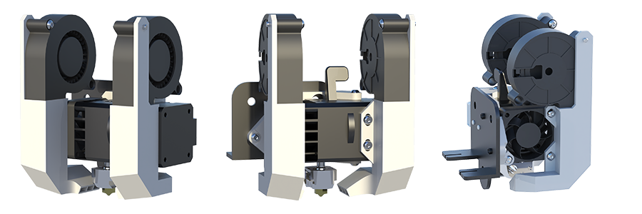
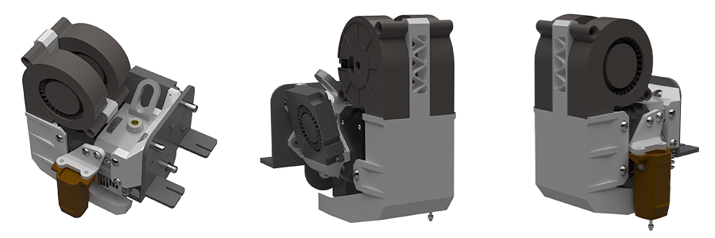

# Апгрейды для Ender-3 и подобных принтеров

## Ender-3 BMG Printhead

Печатающая голова для Ender-3 подобных принтеров, основанная на старой, но всё еще актуальной паре BMG + V6 хотэнд. Хорошо подходит для начинающих печатников, которые собираются печатать в основном твёрдыми материалами.

### Плюсы

- Простая конструкция: всего 4-5 деталей, каждая из которых печатается без поддержек;
- Мощное охлаждение на основе двух вентиляторов типоразмера 5015;
- Простота в обслуживании - всю голову можно снять откручиванием всего 4 винтов;
- На большинстве принтеров не будет потери области печати. На остальных она будет незначительной;
- Низкая стоимость от ~2500р.

### Минусы

- Относительно большое расстояние от подающих колёс до кончика сопла. На печати твёрдыми пластиками не сказывается. Средне-жесткими эластомерами можно печатать с откатами и Linear Advance. Самыми мягкими эластомерами печатать, скорее всего, придётся без LA.

### Ссылки

[:fontawesome-solid-list: Описание](./ebp/index.md){ .md-button } [:octicons-download-16: Релизы](./ebp/releases.md){ .md-button } [:material-file-document-outline: Инструкция](./ebp/bom.md){ .md-button }

## Ender-3 H2 Printhead

Печатающая голова для Ender-3 подобных принтеров, основанная на экструдере Biqu H2. Является одним из топовых решений, подходящих для любых сценариев применения принтера.

### Плюсы

- Модульная структура позволяет использовать только необходимые детали. Например, только кронштейн для Biqu H2, или только систему охлаждения отдельно;
- Простая конструкция. Все детали печатаются без поддержек;
- Мощное охлаждение на основе двух вентиляторов типоразмера 5015;
- Экструдер способен печатать всеми материалами, включая самые мягкие филаменты. Для композитных материалов в продаже есть закалённые подающие колёса;
- На большинстве принтеров не будет потери области печати, или она будет незначительной.

### Минусы

- Относительно высокая цена экструдера, и, как следствие, стоимость всего проекта от ~ 6500р.

### Ссылки

[:fontawesome-solid-list: Описание](./ehp/index.md){ .md-button } [:octicons-download-16: Релизы](./ehp/releases.md){ .md-button } [:material-file-document-outline: Инструкция](./ehp/guide.md){ .md-button }

## Ender-3 Sprite Printhead

Печатающая голова для Ender-3, использующая экструдер Creality Sprite. Является оптимальной по соотношению цена/качество. Охлаждение может быть использовано отдельно, например, для принтеров Ender-3 S1/S1 Pro/S1 Plus.

### Плюсы

- Простая конструкция - всего 2-3 детали, каждая из которых печатается без поддержек;
- Мощное охлаждение на основе двух вентиляторов типоразмера 5015;
- Экструдер способен печатать всеми материалами, включая самые мягкие;
- Сохранена возможность обслуживания - не теряется доступ к винту крепления хотэнда.

### Минусы

- Для экструдера Sprite в продаже нет никаких подающих колёс, в том числе и закалённых. Это значит, что при печати композитами крайне желательно установить датчик движения филамента наподобие [BTT SFS](https://alli.pub/6j6p44).

### Ссылки

[:fontawesome-solid-list: Описание](./esp/index.md){ .md-button } [:octicons-download-16: Релизы](./esp/releases.md){ .md-button } [:material-file-document-outline: Инструкция для Ender-3](./esp/guide_ender3.md){ .md-button } [:material-file-document-outline: Инструкция для Ender-3 S1/S1 Pro/S1 Plus](./esp/guide_ender3.md){ .md-button }