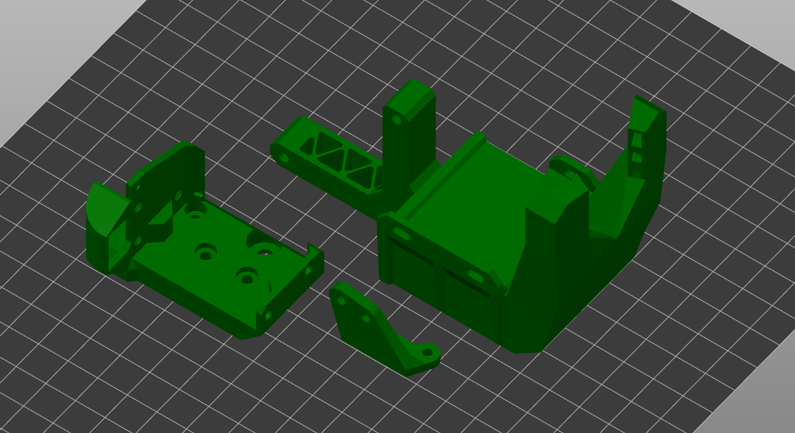
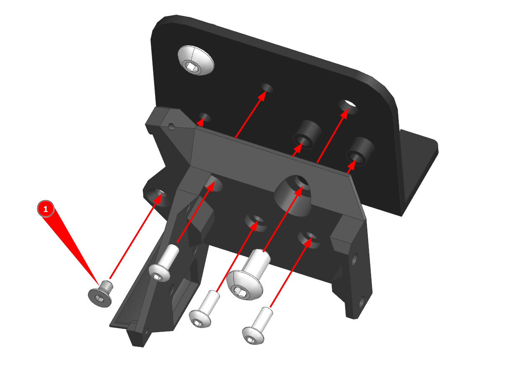
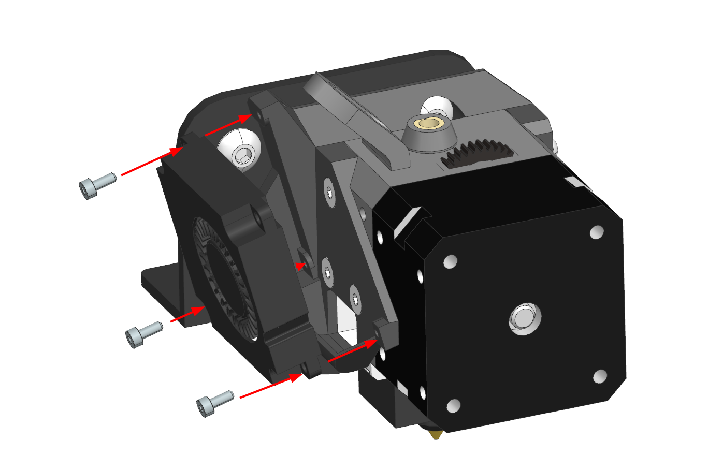
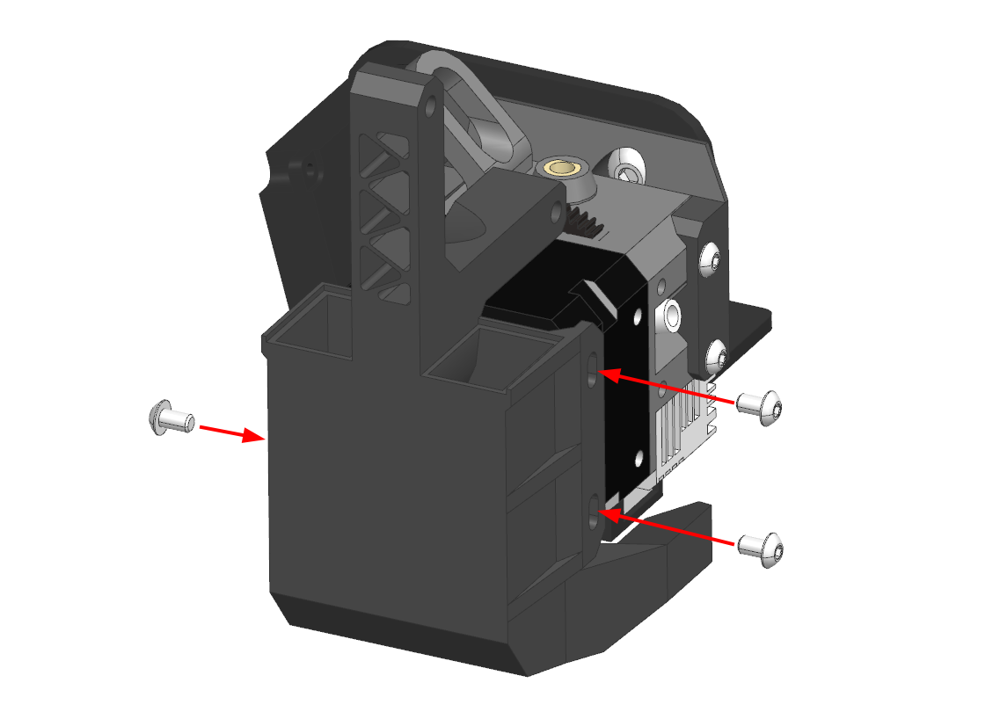
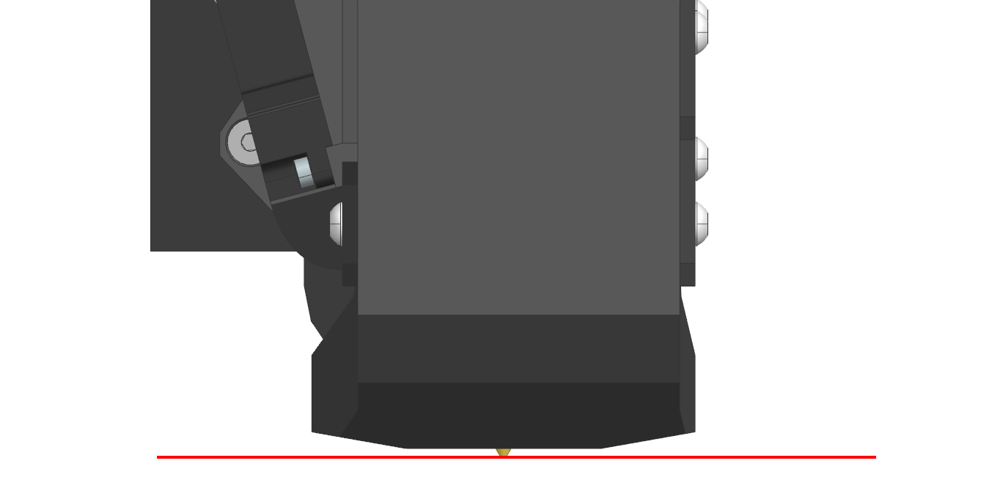
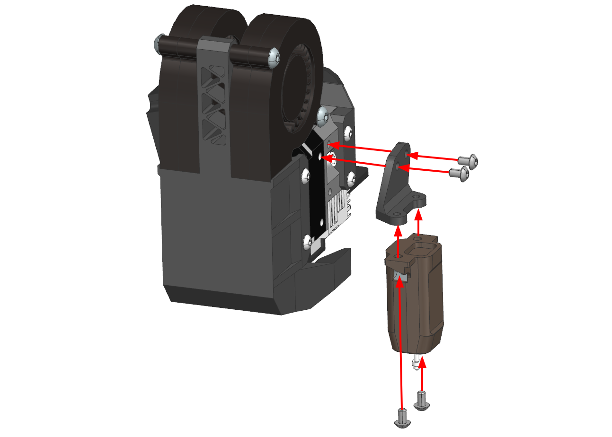
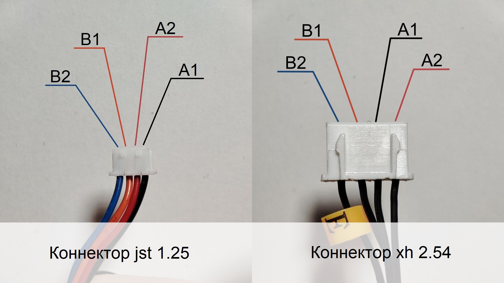

# Инструкция K3D ESP для Ender-3

## Основные детали экструдера и системы охлаждения

| Наименование | Кол-во | Ссылки | Примечание |
|:------------ |:------:|:------:|:---------- |
| Экструдер Sprite | 1 | [:material-shopping:](https://aliclick.shop/s/14s1wn) | Выбирать `Standart extruder` |
| Горло биметалл | 1 | [:material-shopping:](https://alli.pub/6j6ugt) | |
| Сопло латунное mk8 | 0-1 | [:material-shopping:]() | Если не планируете менять хотэнд |
| Сопло стальное закалённое mk8 | 0-1 | [:material-shopping:]() | Для печати композитами. Если не планируете менять хотэнд |
| Вентилятор 5015 | 2 | [:material-shopping:](http://alli.pub/6huh9y) | |
| Винт М3х8 DIN 7380 | 3-4 | [:material-shopping:](https://krepcom.ru/catalog/vinty-razdel/vint_3kh8_s_polukrugloy_golovkoy_i_vnutrennim_shestigrannikom_din_7380_nerzh_stal_a2.htm) | Для 3010 версии кронштейна 4шт., для 4010 - 3шт. |
| Винт М4х20 DIN 7380 | 4 | [:material-shopping:](https://krepcom.ru/catalog/vinty-razdel/vint_4kh20_s_polukrugloy_golovkoy_i_vnutrennim_shestigrannikom_din_7380_nerzh_stal_a2.htm) |  |

!!! warning "Не берите набор сопел всех диаметров. Через сопло 0.4 мм можно давить линии шириной от 0.35 до 0.6 миллиметра вообще без дефектов, до 1 мм с незначительными дефектами. Поэтому одного сопла 0.4 или 0.5 мм хватит на практически все случаи применения"

!!! note "Другие вентиляторы, термистор, нагревательный элемент и остальной крепеж уже есть в комплекте с экструдером"

## Детали для установки хотэнда Volcano

Хотэнд E3D Volcano обладает повышенной производительностью. При этом он не затрудняет печать никакими филаментами. Единственный минус - уменьшение области печати по оси Z на ~8.5мм. 

Для установки хотэнда E3D Volcano надо будет докупить следующие детали:

| Наименование | Кол-во | Ссылки | Примечание |
|:------------ |:------:|:------:|:---------- |
| Хитблок Volcano | 1 | [:material-shopping:](http://alii.pub/6fdbl5) | Выбирать `Aluminium` |
| Сопло Volcano латунное | 0-1 | [:material-shopping:](http://alii.pub/6f6ep5) | Под хотэнд Volcano |
| Сопло Volcano стальное закаленное | 0-1 | [:material-shopping:](http://alii.pub/6fdbkd) | Для печати композитами на Volcano |
| Носок | 0-1 | [:material-shopping:](http://alli.pub/6hqe44) | Выбирать `Volcano PT100` |

## Детали для установки CRTouch

Датчик автоуровня CRTouch аналогичен распространенному BLTouch и позволяет снимать карту высот стола. Это нужно чтобы исправлять кривизну стола. Если стол ровный, то установка датчика не требуется.

| Наименование | Кол-во | Ссылки | Примечание |
|:------------ |:------:|:------:|:---------- |
| CRTouch | 1 | [:material-shopping:](https://alli.pub/6j76kd) |  |
| Винт М3х5 DIN 7380 | 4 | [:material-shopping:](https://krepcom.ru/catalog/vinty-razdel/vint_3kh5_s_polukrugloy_golovkoy_i_vnutrennim_shestigrannikom_din_7380_nerzh_stal_a2.htm) | |

## Печать деталей

### Ориентация моделей



Модели следует расположить на столе так, как это показано на изображении выше. Для этого следует использовать средства ориентации в вашем слайсере: 

=== "Prusaslicer"

    
    
    В левом меню инструмент `Place on face` -> клик по поверхности, которой деталь должна соприкасаться со столом

=== "Cura"

    
    
    В левом меню инструмент `Вращение` -> `Положить плашмя` -> клик по поверхности, которой деталь должна соприкасаться со столом

### Подбор материалов

Детали печатающей головы можно условно поделить на две группы. Первая - сопла системы охлаждения. Практически не испытывают механических нагрузок, но нагружены термически. Так что для их печати не важны прочность и жесткость, но важна термостойкость. В случае, если у вас нет возможности напечатать сопла системы охлаждения из термостойких материалов, их можно напечатать из PETG и обклеить нижнюю часть фольгой. Такие сопла не деформируются при температуре стола до ~90-100°C. Тем не менее, не рекомендуется использовать это решение на постоянной основе.

Остальные детали мало нагружены термически, но сильно механически. Так что для лучших результатов рекомендуется их печать из жестких и прочных материалов.

| Деталь | Предпочтительные материалы | Возможные материалы |
|:------:|:--------------------------:|:-------------------:|
| Кронштейн | композиты на основе: `PP`, `PA` | `PETG`, `ABS`, `ASA`, `PC`, `PA`, композиты на их основе |
| Сопла | `ABS`, `ASA`, `PC`, композиты на их основе | Композиты на основе `PP`, `PA` |

### Настройки печати

Все детали, кроме левого сопла, спроектированы так, что при правильной ориентации не требуют никаких поддержек. Все горизонтальные участки печатаются мостами, которые требуется настроить по [этому видео](https://www.youtube.com/watch?v=Xf8D3R_VADo). 

Также не стоит забывать, что от основной массы деталей требуется высокая прочность и жесткость. Так что, если вы собираетесь печатать детали из плохо спекающегося пластика (`ABS`, `ASA`, `PC`), то рекомендуется поднять температуру, замедлить печать, максимально уменьшить (или даже выключить) обдув. Для хорошо спекающихся материалов (`PETG`, `PA`, `PP`) это не нужно.

Рекомендуемые значения основных параметров:

| Параметр                         | Значение               | Комментарий |
| -------------------------------- |:----------------------:|:-----------:|
| Ширина линий                     | 0.3-0.6 мм             | Для сопел лучше не превышать 0.5 мм |
| Толщина слоя                     | 0.1-0.3 мм             | |
| Толщина периметров, крышки и дна | 2 мм                   | Для сопел 1-2 периметра |
| Заполнение                       | 100%                   | |
| Поддержки                        | Отключить              | |
| Обнаружение мостов               | Включить               | |
| Заполнение зазоров               | Включить               | |
| Генератор периметров             | Arachne                | Для сопел очень желательно, так как они тонкостенные. Для остальных деталей не важно |

### Подготовка кронштейна экструдера


После печати необходимо удалить мембраны из крепежных отверстий кронштейна экструдера. Эти мембраны нужны для облегчения печати.

## Сборка

### Подготовка каретки оси Х принтера


С каретки оси Х принтера надо снять старые элементы экструдера и снять колесо и винт в правом верхнем углу.

### Установка кронштейна экструдера



Установите кронштейн на каретку и прикрутите винтами, как указано на картинке выше. В этот же момент нужно установить правое-верхнее колесо каретки, так как его винт используется в креплении кронштейна экструдера.

Винты используются М3х8 с полукруглой головкой. Типоразмер винта (1) зависит от кронштейна: для 3010 вентилятора - М3х8 с полукруглой головкой, для 4010 - М3х5 с потайной головкой (из комплекта экструдера).

### Установка экструдера


Экструдер в сборе с хотэндом устанавливается в кронштейн радиатором к каретке. После этого крепится на 3 винта М3х5 с потайной головкой слева, и два винта М3х5 с полукруглой головкой справа. Все винты идут в комплекте с экструдером.

### Установка вентилятора охлаждения радиатора



Вентилятор прикручивается к кронштейну экструдера на винты М2х5. 4010 вентилятор крепится на 3 винта, 3010 на два.

### Установка системы охлаждения модели



Сопло системы охлаждения прикручивается к мотору экструдера на 3 винта М3х5 с полукруглой головкой. Затягивать винты на данном этапе не нужно.

### Установка вентиляторов 5015


Вентиляторы крепятся к системе охлаждения модели на 4 винта М4х20. Если система охлаждения распечатана из плохо спекающегося пластика типа ABS и подобных, то может быть хорошей идеей нарезать резьбу метчиком М4 или вплавить резьбовые втулки, так как подобные детали склонны расслаиваться от вкручивания винтов.

### Регулировка положения системы охлаждения



Убедитесь, что сопло хотэнда протянуто на горячую, горло утоплено в радиатор до упора, хотэнд стоит в том положении, в котором он будет работать.

После этого подвиньте экструдер примерно в центр стола и опустите так, чтобы сопло экструдера упёрлось в поверхность. Под сопла системы охлаждения подложите любые элементы около 1мм толщиной, например, скидочные карточки. Убедитесь, что сопла располагаются вертикально, а также касаются карточек. Затяните винты крепления сопел системы охлаждения.

### Установка датчика автоуровня



Датчик BLTouch (CRTouch) крепится к кронштейну на 2 винта М3х5. После этого кронштейн крепится к экструдеру на 2 винта М3х5.

## Подключение электроники

Конкретная схема подключения электрических компонентов нового экструдера зависит от того, на какой принтер вы его устанавливаете. Поэтому создание универсальной схемы невозможно. Тем не менее, дам несколько советов по подключению.

### Нагревательный элемент и термистор

Нагревательный элемент оставляется штатный, нет смысла менять его.

Если термистор не отличается от штатного по форм-фактору, то можно оставить штатный. Если отличается, то новый термистор подключается вместо штатного без учета полярности.

### Двигатель



Мотор подключается вместо штатного мотора. В большинстве случаев для этого достаточно просто удлинить проводку. Не бойтесь подключить мотор неправильно, это не нанесет ему никакого вреда. После подключения, но перед проверкой, не забудьте отрегулировать ток на мотор экструдера. Некоторую информацию по этому поводу можно найти [в этом видео](https://www.youtube.com/watch?v=MQE7OZ34_eE).

Некоторые распространенные проблемы при подключении:

1. Если мотор вообще не реагирует при подаче команды на его движение, то, скорее всего, вы не прогрели хотэнд. В большинстве прошивок стоит защита от работы экструдера при недостаточной температуре;
2. Если мотор крутится не в ту сторону, то это можно исправить в прошивке. Если это затруднительно, то можно поменять порядок пинов в разъёме на зеркальный;
3. Если мотор стучит и не двигается, или двигается нестабильно со стуком, то:
      1. Поменяйте местами два центральных пина в разъёме мотора (2 и 4 пин);
      2. Если предыдущий совет не помог, то поменяйте местами 1 и 3 пин с любой из сторон;
      3. Если после этого мотор всё еще стучит при вращении, то он либо заблокирован (не может провернуть шестерни экструдера), либо разрыв в кабеле.


### Вентиляторы

Все вентиляторы подключается вместо штатных с обязательным соблюдением полярности. При этом вентиляторы обдува модели подключаются параллельно (все плюсы отдельно, все минусы отдельно).

## Прошивка

В целом, замена экструдера на директ в большинстве случаев не требует вмешательства в прошивку принтера. Исключения только два - если была произведена замена термистора или если был установлен датчик BLTouch, которого ранее не было.

### Термистор

=== "Marlin"

    В прошивке Marlin требуется внести изменения в файл `Configuration.h`:
    
    В строке `#define TEMP_SENSOR_0` надо указать номер таблицы. Для NTC100k B3950 - `1`. Для 104GT или 104NT - `5`
    
    После этого надо пересобрать и установить прошивку. Для разных плат этот процесс различается, так что если вы не знаете как это делается, то вам придётся искать инструкцию самостоятельно.

=== "RepRapFirmware"

    В конфигурации вашего принтера в команде `M308` меняется два параметра:
    
    | Термистор | T | B |
    |:--------- |:-:|:-:|
    | NTC 100k B3950 | 100000 | 3950 |
    | 104GT или 104NT | 100000 | 4300 |
    
    Итого команда у вас должна получиться примерно такой:
    
    ```
    M308 S1 P"e0temp" Y"thermistor" T100000 B4300
    ```

=== "Klipper"

    В файле printer.cfg в разделе `extruder` меняется значение параметра `sensor_type`:
    
    - Для NTC100k B3950: `Generic 3950`
    - Для 104GT: `ATC Semitec 104GT-2`
    - Для 104NT: `ATC Semitec 104NT-4-R025H42G`

### BLTouch

Эта инструкция не носит цели объяснить как с нуля сконфигурировать BLTouch для всех прошивок. Такую инструкцию для интересующей вас прошивки вам придётся искать самостоятельно. Здесь я лишь опишу несколько параметров, специфичных именно для крепления K3D EBP.

=== "Marlin"

    В файле `Configuration.h`:
    
    ```
    #define NOZZLE_TO_PROBE_OFFSET { 35.75, -25.1, 0 }
    ```
    
    Вместо нуля можно указать значения Z-offset, если вы его заранее замерили. Если нет, то оставьте это на потом, этот параметр можно менять и извне прошивки.

=== "RepRapFirmware"

    В конфигурации вашего принтера:
    
    ```
    G31 P25 X35.75 Y-25.1 Z0
    ```
    
    Вместо нуля можно указать значения Z-offset, если вы его заранее замерили.

=== "Klipper"

    В файле `printer.cfg`:
    
    ```
    x_offset: 35.75
    y_offset: -25.1
    ```

## Калибровки

После внесения изменений в прошивку, стоит заново повторить все калибровки, которые зависят от печатающей головы в следующем порядке:

1. Калибровка стола и Z-offset
2. [Калибровка PID](https://youtu.be/aizbpcZ7LU0)
3. [Калибровка разрешения экструдера](https://youtu.be/Mga_ezYDTNI). Поток можно оставить 100% для начала и калибровать только в случае пере- или недоэкструзии на моделях
4. [Подбор к-фактора Linear Advance](../calibrations/la/index.md)
5. [Подбор длины и скорости откатов](../calibrations/retractions/index.md)
6. [Подбор частоты Input shaping](https://youtu.be/ZFPkfZEB-XU) (если он есть)

## Поддержать проект

Проект K3D существует и развивается за счёт поддержки сообществом. Если у вас есть желание поддержать автора и тем самым спонсировать выход новых подобных апгрейдов, то это можно сделать следующим образом:

- [Поддержать из РФ](https://donate.stream/dmitrysorkin)
- [Поддержать из-за рубежа](https://www.donationalerts.com/r/dsorkin)
