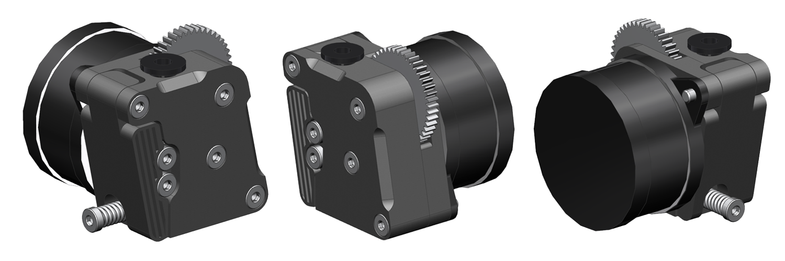

# Инструкция K3D Feeder965

## Необходимые детали

| Наименование | Кол-во | Ссылки | Примечание |
|:------------ |:------:|:------:|:---------- |
| Набор подающих колёс TBG | 1 | [:material-shopping:](https://alli.pub/6r0n96) | 1 набора хватит на 2 фидера, если напечатать или докупить еще 1 шестерню редуктора |
| Шестерня редуктора | 0-1 | [:material-shopping:](https://alli.pub/6r0n96) | Нужна если планируете собирать 2 подающих механизма |
| Подшипник 63zz | 2 | [:material-shopping:](https://alli.pub/6r0pvo) | Если собираете 1 фидер, то 2шт, если 2 - то 6шт. |
| Пружина ID4 OD6 D1 L10 | 1 | [:material-shopping:](https://alli.pub/6r0prl) |  |
| Мотор Nema14 17-20мм | 1 | [:material-shopping:](http://alli.pub/6fdf35) | Рекомендуется брать мотор 20мм, так как с ним МОР будет выше |
| Винт М3х12 | 2 | [:material-shopping:](https://krep-shop.ru/katalog/bolty_i_vinty/din_7984/?offer_id=281247) | С полукруглой или низкой цилиндрической головкой |
| Винт М3х14 | 1 | [:material-shopping:](https://krep-shop.ru/katalog/bolty_i_vinty/din_7984/?offer_id=281247) | Можно обрезать М3х16. С полукруглой или низкой цилиндрической головкой |
| Винт М3х16 | 2 | [:material-shopping:](https://krep-shop.ru/katalog/bolty_i_vinty/din_7984/?offer_id=281247) | С полукруглой или низкой цилиндрической головкой |
| Винт М3х20 | 2 | [:material-shopping:](https://krep-shop.ru/katalog/bolty_i_vinty/din_7984/?offer_id=281247) | С полукруглой или низкой цилиндрической головкой |
| Вплавляемая резьбовая втулка М3х4 | 5 | [:material-shopping:](https://alli.pub/6r0pfj) | Можно заменить на втулки М3х3 |
| Фиттинг | 1 | [:material-shopping:](https://alli.pub/6r0pxm) |  |

## Печать деталей

Оформлю позже

## Сборка

Оформлю позже