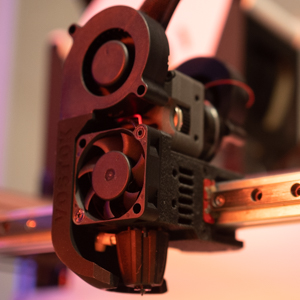
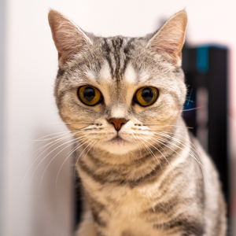

# K3D - всё о 3D печати

<table>
  <tbody>
    <tr>
      <td width=300 style="vertical-align: middle"></td>
      <td style="vertical-align: middle; font-size: 1.2em"><b>K3D VOSTOK</b> - это открытый проект продвинутого самосборного 3D принтера.
		<ul>
		  <li>Быстрый</li>
		  <li>Функциональный</li>
		  <li>Удобный в обслуживании</li>
		  <li>И многое другое...</li>
		</ul>
<a href="./vostok">Страница проекта</a>
</td>
    </tr>
  </tbody>
</table>

<table>
  <tbody>
    <tr>
      <td style="vertical-align: middle; font-size: 1.2em"><b>K3D Minifeeder</b> - небольшой, но способный на многое подающий механизм.
      <ul>
	      <li>Масса в сборе от 95г</li>
	      <li>Частичная совместимость с LGX Lite</li>
	      <li>Низкая стоимость</li>
	      <li>Распространенные запчасти</li>
      </ul>
      <a href="./minifeeder">Страница проекта</a>
      </td>
      <td width=300 style="vertical-align: middle"></td>
    </tr>
  </tbody>
</table>

<table>
  <tbody>
    <tr>
      <td width=300 style="vertical-align: middle"></td>
      <td style="vertical-align: middle; font-size: 1.2em">В наших чатах и каналах вы всегда найдёте ответы на свои вопросы: 
		<ul>
		  <li><a href="http://t.me/dsorkin">Личный телеграм канал Dmitry Sorkin</a></li>
		  <li><a href="http://t.me/K_3_D">Общий чат K3D</a></li>
		  <li><a href="http://t.me/vostok3dp">Новости проекта VOSTOK</a></li>
		  <li><a href="http://t.me/k3d_vostok">Обсуждение проекта VOSTOK</a></li>
		</ul>
	  </td>
    </tr>
  </tbody>
</table>