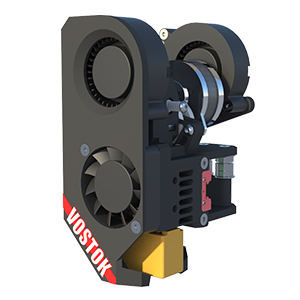
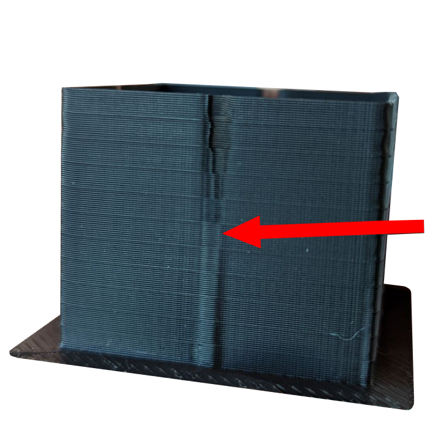
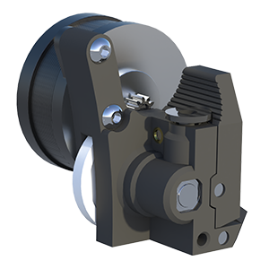
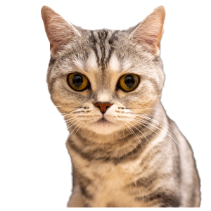

---
hide:
  - navigation
  - toc
---

# K3D - всё о 3D печати

<table>
	<tbody>
		<tr style="min-height: 300px">
			<td width=300 style="vertical-align: middle"></td>
			<td colspan="2" style="vertical-align: middle; font-size: 1.2em"><b>K3D VOSTOK</b> - это открытый проект продвинутого самосборного 3D принтера. 
        <ul>
          <li>IDEX</li>
          <li>Высокая скорость печати</li>
          <li>Размер стола до 510х510 мм</li>
          <li>И многое другое...</li>
        </ul>
        <a href="./vostok">Страница проекта</a>
      </td>
		</tr>
		<tr style="min-height: 300px">
			<td colspan="2" style="vertical-align: middle; font-size: 1.2em">Методики по калибровке FDM 3D принтеров, включающие в том числе и генераторы моделей. 
      <ul>
          <li><a href="./calibrations/">Калибровка принтера с нуля</a></li>
          <li><a href="./calibrations/pid/">Калибровка PID</a></li>
          <li><a href="./calibrations/la/">Калибровка Linear/Pressure Advance</a></li>
          <li><a href="./calibrations/retractions/">Калибровка откатов</a></li>
          <li><a href="./calibrations/accuracy/">Калибровка точности печати</a></li>
          <li><a href="./calibrations/manual_is_calibration/">Ручная калибровка Input Shaping</a></li>
      </ul>
			<td width=300></td>
		</tr>
		<tr style="min-height: 300px">
			<td width=300 style="vertical-align: middle"></td>
			<td colspan="2" style="vertical-align: middle; font-size: 1.2em">Другие проекты K3D: 
      <ul>
        <li><a href="./minifeeder/">Minifeeder</a> - легкий и простой подающий механизм</li>
        <li><a href="./feeder965/">Feeder965</a> - компактный подающий механизм с большим подающим колесом</li>
        <li><a href="./bemege/">BeMeGe</a> - печатный корпус для Bondtech BMG</li>
        <li><a href="./ebp/">EBP</a> - печатающая голова на основе BMG и E3D V6/Volcano</li>
        <li><a href="./esp/">ESP</a> - печатающая голова на основе Sprite extruder</li>
        <li><a href="./ehp/">EHP</a> - печатающая голова на основе Biqu H2</li>
      </ul>
      </td>
		</tr>
		<tr>
			<td colspan="2" style="vertical-align: middle; font-size: 1.2em">Другие ресурсы K3D: 
      <ul>
        <li><a href="http://www.youtube.com/@SorkinDmitry/">YouTube канал Dmitry Sorkin</a></li>
        <li><a href="http://t.me/dsorkin">Телеграм канал Dmitry Sorkin</a></li>
        <li><a href="http://t.me/K_3_D">Общий чат K3D</a></li>
        <li><a href="http://t.me/vostok3dp">Канал проекта VOSTOK</a></li>
        <li><a href="http://t.me/k3d_vostok">Чат проекта VOSTOK</a></li>
      </ul>
      </td>
			<td width=300 style="vertical-align: middle"></td>
		</tr>
	</tbody>
</table>