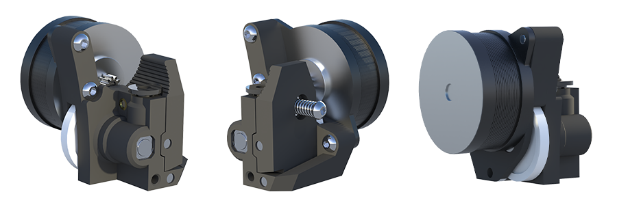

# K3D Minifeeder

**K3D Minifeeder** - это проект подающего механизма, который был спроектирован чтобы заменить LGX Lite на облегченной печатающей голове **K3D VOSTOK**.

## Особенности:

- Малый габарит:
  - Ширина: 38,5 мм;
  - Высота: 47 мм;
  - Глубина без мотора: 27 мм;
- Малый вес. Масса с мотором Nema14 17 мм от 100г;
- Канал для прохождения пластика по центру;
- Точки крепления расположены относительно канала как у LGX Lite;
- Печать без поддержек;
- Открытые исходники.

---

## Материалы

[:material-download: Скачать файлы для печати и исходники](./releases.md){ .md-button }

[:material-file-document: Посмотреть инструкцию по сборке](./minifeeder_assembly.md){ .md-button }
