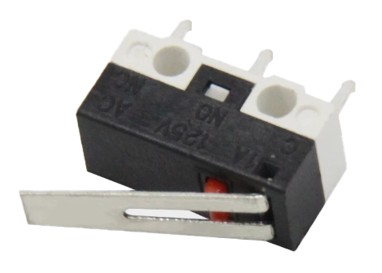
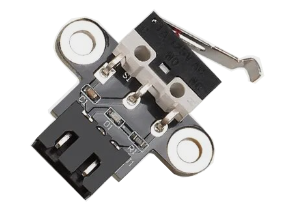
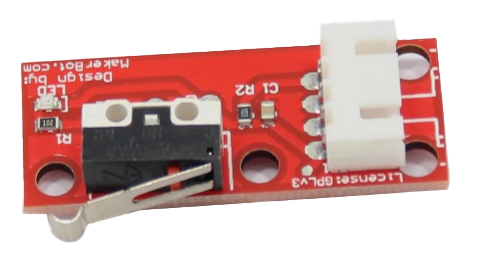
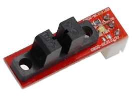
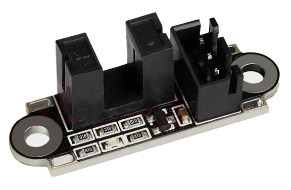

# 3D рекомендатор: электроника

В этом разделе вы можете найти проверенные ссылки на электронику для FDM 3D принтеров.

- [:simple-telegram: Задать вопрос по поводу выбора комплектующих](https://t.me/K_3_D/1944033)
- [:simple-telegram: Сообщить об ошибке в telegram](https://t.me/K_3_D/1944075) - обязательно тегайте @dmitry_sorkin в сообщении, чтобы мне пришло уведомление
- [:octicons-mail-16: Сообщить об ошибке по e-mail](mailto:dbsorkin@gmail.com) - ⚠️ Только для сообщений об ошибках. На вопросы по e-mail не отвечаю

## Материнские платы

### Только MCU

Такие платы "из коробки" подходят только под прошивку Marlin. Чтобы установить на эти платы Klipper необходимо дополнительно устанавливать к ним в пару одноплатный компьютер а-ля Rapberry Pi, Orange Pi или подобных. Обычно комплект из такой мат.платы + одноплатного компьютера оказывается выгоднее как минимум в рамках ремонтопригодности.

| Наименование              | :fontawesome-solid-microchip:{ title="Количество и тип драйверов" } | :material-printer-3d-nozzle:{ title="Максимум хотэндов" } | :material-fan:{ title="Максимум управляемых вентиляторов" } |                                                                                      :material-link:{ title="Ссылки" }                                                                                       | Комментарий                                                                                                                                                                                                                                                                                                                    |
| :------------------------ | :-----------------------------------------------------------------: | :-------------------------------------------------------: | :---------------------------------------------------------: | :----------------------------------------------------------------------------------------------------------------------------------------------------------------------------------------------------------: | :----------------------------------------------------------------------------------------------------------------------------------------------------------------------------------------------------------------------------------------------------------------------------------------------------------------------------- |
| BTT SKR Mini E3 V2        |                             4x tmc2209                              |                             1                             |                              2                              |                                                   [:material-shopping:](https://alli.pub/6votc4?erid=2SDnjeiPVkt "BTT Official store"){ target="_blank" }                                                    | Устанавливается в Ender-3/Ender-3Pro/Ender-3V2/Ender-3 Neo/Ender-3V2 Neo и подобные на штатные крепления. Хуже, чем Cheetah по железу, но легко и просто ставится Marlin                                                                                                                                                        |
| FYSETC Cheetah            |                             4x tmc2209                              |                             1                             |                              3                              |                                                [:material-shopping:](https://alli.pub/7053c9?erid=2SDnjboJqRC "XJW TECH DEMO BOARD Store"){ target="_blank" }                                                | Только под Klipper![^3]. Устанавливается в Ender-3/Ender-3Pro/Ender-3V2/Ender-3 Neo/Ender-3V2 Neo и подобные на штатные крепления. Выбор питания вентиляторов 5\12\24в. У 5в линии питания хватает мощности для подключения к ней одноплатников типа Raspberry/Orange Pi                                                       |
| FLY Micro 4            |                             4x tmc2209                              |                             1                                |                              2                              |                                                [:material-shopping:](https://alli.pub/72s30a?erid=2SDnjdrEzLT "Mellow Store"){ target="_blank" }                                                | Только под Klipper![^3]. Недорогая компактная плата с минимально необходимым набором портов. Можно подключить платы типа EBB CAN без дополнительных адаптеров. Также продётся комплекте с модулем одноплатный компьютер + экран FLY MINIPAD по очень приятной цене.                                                      |

| BTT SKR 1.4               |                              5x pololu                              |                             2                             |                              1                              |                                                     [:material-shopping:](https://alli.pub/7053d1?erid=2SDnjc2eixJ "BTT Brand store"){ target="_blank" }                                                     | Одна из лучших плат цена/качество для одноэкструдерных принтеров. Недостаток портов управляемых вентиляторов компенсируется возможностью подключить вентилятор в порт для второго экструдера                                                                                                                                   |
| Fysetc S6                 |                              6x pololu                              |                             3                             |                              3                              |                                                  [:material-shopping:](https://alli.pub/6tusfx?erid=2SDnjborNdW "FYSETC Official store"){ target="_blank" }                                                  | Популярная плата под принтеры с 6 моторами.                                                                                                                                                                                                                                                                                    |
| BTT Octopus / Octopus Pro |                              8x pololu                              |                             4                             |                              6                              | [:material-shopping:](https://alli.pub/6tusgb?erid=2SDnjbrpMCC "BTT Official store"){ target="_blank" } [:material-shopping:](https://alli.pub/7053df?erid=2SDnjc8ag5g "BTT Brand store"){ target="_blank" } | Плата для продвинутых проектов с большим количеством моторов. У 5в линии питания хватает мощности для подключения к ней одноплатников типа Raspberry/Orange Pi. Есть выбор напряжения питания вентиляторов. В Pro версии (2 ссылка) есть усилитель для PT100/PT1000 и возможность устанавливать высоковольтные драйверы до 60в |
| BTT Octopus Max EZ        |                               10x EZ                                |                             4                             |                              6                              |                                                   [:material-shopping:](https://alli.pub/6tusgp?erid=2SDnjbunKkt "BTT Official store"){ target="_blank" }                                                    | Наиболее "нашпигованная" плата. Много драйверов, питание для одноплатников, возможность подключать 4-проводные вентиляторы, выбор напряжения на вентиляторы, мощный МК, 5 усилителей для PT100/PT1000 и т.д.                                                                                                                   |

### MCU + CPU

Эти платы представляют из себя обычную материнку принтера, совмещенную с компьютером под linux или с подготовленным портом для установки компьютера прямо на материнку. Их имеет смысл брать под установку Klipper если ограничено место в отсеке электроники и комплект из обычной материнки + одноплатного компьютера плохо влезает. Также на эти платы можно установить Marlin, но это имеет мало смысла.

| Наименование       | :fontawesome-solid-microchip:{ title="Количество и тип драйверов" } | :material-printer-3d-nozzle:{ title="Максимум хотэндов" } | :material-fan:{ title="Максимум управляемых вентиляторов" } |                                                   :material-link:{ title="Ссылки" }                                                   | Комментарий                                                                                                                                                                                                                                                                                                                                                                                  |
| :----------------- | :-----------------------------------------------------------------: | :-------------------------------------------------------: | :---------------------------------------------------------: | :-----------------------------------------------------------------------------------------------------------------------------------: | :------------------------------------------------------------------------------------------------------------------------------------------------------------------------------------------------------------------------------------------------------------------------------------------------------------------------------------------------------------------------------------------- |
| BTT Manta M8P V2.0 |                              8x pololu                              |                             4                             |                              7                              | [:material-shopping:](https://alli.pub/7053dt?erid=2SDnjcSNXTp "BTT Official Store. Проверяйте выбранную позицию"){ target="_blank" } | Проверяйте выбранную позицию. В V2.0 заменили МК на мощный H723, позволяющий использовать микрошаг 256 без ограничения скорости печати. Для работы требует установки Raspberry Pi CM4/BTT CB1. Выбор напряжения питания вентиляторов 5\12\24в. Питание драйверов до 48в                                                                                                                      |
| BTT Manta E3EZ     |                                5x EZ                                |                             2                             |                              3                              |                [:material-shopping:](https://alli.pub/6tusin?erid=2SDnjbzEHbv "BTT Official store"){ target="_blank" }                | Устанавливается в Ender-3/Ender-3Pro/Ender-3V2/Ender-3 Neo/Ender-3V2 Neo и подобные на штатные крепления, но может использоваться и на других принтерах. Очень немощный МК, нормально работать будет только под Klipper. Для работы требует установки Raspberry Pi CM4/BTT CB1. Очень дорогое решение, в большинстве случаев лучше обойтись комплектом из отдельной материнки и одноплатника |
| MKS SKIPR          |                              7x pololu                              |                             3                             |                              3                              |             [:material-shopping:](https://alli.pub/6tusj8?erid=2SDnjc3CGAc "Makerbase Official Store"){ target="_blank" }             | Встроен RK3328, 1Gb RAM, 3x USB-A. Съёмная eMMC (опционально). Встроенного Wi-Fi нет, но можно подключить внешний USB адаптер (опционально). Выбор питания вентиляторов 5\12\24в. Со всем необходимым будет стоить как более функциональная отдельная материнка + одноплатник, так что выбирать имеет смысл только если место в отсеке электроники очень ограничено                          |
| FLY C8          |                              8x pololu                              |                             3                             |                              6                              |             [:material-shopping:](https://alli.pub/72s312?erid=2SDnjeJvmQf "Mellow Store"){ target="_blank" }             | Встроен Allwinner H5, 1Gb RAM, 4x USB-A. Встроенная eMMC. Встроенного Wi-Fi нет, но можно подключить внешний USB адаптер (опционально). Выбор питания вентиляторов 5\12\24в. Со всем необходимым будет стоить как более функциональная отдельная материнка + одноплатник, так что выбирать имеет смысл только если место в отсеке электроники очень ограничено                          |

## Одноплатные компьютеры

Для прошивки Klipper эти компьютеры выполняют роль хоста, то есть на них крутятся управляющая часть прошивки, веб-интерфейс и т.д. Для прошивки Marlin такой одноплатный компьютер может хостить Octoprint - веб-интерфейс для удаленного управления принтером. Тем не менее, использование Octoprint является нерациональным, так как для связки Marlin + Octoprint требуется такое же железо, как для Klipper, а возможностей в такой связке будет меньше.

!!! note "Все указанные компьютеры потянут веб-камеру, телеграм бота, работу с несколькими принтерами и т.д."

| Наименование    | :octicons-cpu-24:{ title="Процессор" } | :fontawesome-solid-memory:{ title="Объём оперативной памяти" } | :material-usb:{ title="Количество USB type A портов" } | :material-power-plug:{ title="Напряжение питания" } |                                         :material-link:{ title="Ссылки" }                                         | Комментарий                                                                                                                                                                                                                    |
| :-------------- | :------------------------------------: | :------------------------------------------------------------: | :----------------------------------------------------: | :-------------------------------------------------: | :---------------------------------------------------------------------------------------------------------------: | :----------------------------------------------------------------------------------------------------------------------------------------------------------------------------------------------------------------------------- |
| BTT Pi          |             Allwinner H616             |                              1Gb                               |                           4                            |                       12-24v                        |      [:material-shopping:](https://alli.pub/6tusk0?erid=2SDnjc7eE1e "BTT Official store"){ target="_blank" }      | Есть готовые сборки системы с предустановленным Klipper'ом. Подключается к БП принтера, не нужен отдельный БП или понижающий преобразователь. Брать CAN-адаптер не нужно                                                       |
| Orange Pi 3 LTS |              Allwinner H6              |                              2Gb                               |                           3                            |                         5v                          | [:material-shopping:](https://alli.pub/6tkte1?erid=2SDnjbuPUUg "Shenzhen Xunlong Software Co"){ target="_blank" } | Очень распространенный одноплатник для перевода принтеров на Klipper, множество инструкций написано именно под него. Есть eMMC 8Gb, то есть microSD карточка нужна только для установки системы, дальше плата работает без неё |
| Orange Pi Zero3 |             Allwinner H618             |                              1Gb                               |                           1                            |                         5v                          | [:material-shopping:](https://alli.pub/6w5vps?erid=2SDnjcPondN "Shenzhen Xunlong Software Co"){ target="_blank" } | Одно из самых выгодных предложений по цена/характеристики                                                                                                                                                                      |
| BTT CB1         |             Allwinner H616             |                              1Gb                               |                           -                            |                          -                          |      [:material-shopping:](https://alli.pub/6tuskl?erid=2SDnjcC6Brg "BTT Official store"){ target="_blank" }      | Плата, созданная для замены Raspberry Pi CM4. Используется как модуль для некоторых плат BTT. Не имеет своих портов ввода\вывода и не может быть использована отдельно без специального адаптера                               |
| FLY MINIPAD     |             Allwinner H3               |                              512Mb                             |                           2                            |                    12-24v                          |      [:material-shopping:](https://alli.pub/72s30v?erid=2SDnje5assZ "Mellow Store"){ target="_blank" } [:material-shopping:](https://alli.pub/72s30o?erid=2SDnjduCxu9 "Mellow Store"){ target="_blank" }      | Недорогой одноплатный компьютер, совмещённый с экраном. Подключается к БП принтера, не нужен отдельный БП или понижающий преобразователь. Также продётся комплекте с материнской платой FLY Micro 4 по очень приятной цене.                            |

## Драйверы

Рекомендуется покупать драйверы той же фирмы, что и плата, чтобы избежать проблем совместимости. Выгоднее брать драйверы сразу с платой в комплекте, так что, если есть такая возможность, то лучше ей воспользоваться.

| Тип драйвера       |                                                       BTT                                                       |                                                      MKS                                                      |                                                    FLY                                                     |                                         FYSETC                                          | Комментарий                                                                                                                                                                                                                                                                                        |
| :----------------- | :-------------------------------------------------------------------------------------------------------------: | :-----------------------------------------------------------------------------------------------------------: | :--------------------------------------------------------------------------------------------------------: | :-------------------------------------------------------------------------------------: | :------------------------------------------------------------------------------------------------------------------------------------------------------------------------------------------------------------------------------------------------------------------------------------------------- |
| tmc2209 pololu     |      [:material-shopping:](https://alli.pub/7053el?erid=2SDnjcigPZc "BTT Brand Store"){ target="_blank" }       |          [:material-shopping:](https://alli.pub/6tuslr?erid=2SDnjcJ28z4 "Makerbase Official Store")           | [:material-shopping:](https://alli.pub/6tusmj?erid=2SDnjcLz7Yk "Mellow Official Store"){ target="_blank" } | [:material-shopping:](https://alli.pub/6tusnp?erid=2SDnjcSv4g8 "FYSETC Official Store") | Хороший универсальный драйвер. Ток до 2А. Дробление шагов до 1/256. Интерполяция шагов до 1/256. Напряжение питания до 28в. Подключение к плате по step/dir или UART. При подключении по UART можно использовать sensorless homing                                                                 |
| tmc2209 EZ         |      [:material-shopping:](https://alli.pub/7053fd?erid=2SDnjd5SDWS "BTT Brand Store"){ target="_blank" }       |                                                       -                                                       |                                                     -                                                      |                                            -                                            | То же самое, но для плат BigTreeTech с разъёмами EZ                                                                                                                                                                                                                                                |
| tmc2240 pololu     | [:material-shopping:](https://alli.pub/6tusoa?erid=2SDnjcXN2XA "BigTreeTech Official Store"){ target="_blank" } | [:material-shopping:](https://alli.pub/6tusoo?erid=2SDnjcbozNC "Makerbase Official Store"){ target="_blank" } | [:material-shopping:](https://alli.pub/6tusp9?erid=2SDnjcgFxDE "Mellow Official Store"){ target="_blank" } |                                            -                                            | Ток до 2.1А. Дробление шагов до 1/256. Интерполяция шагов до 1/256. Напряжение питания до 36в. Подключение к плате по SPI. Есть sensorless homing                                                                                                                                                  |
| tmc5160_HV pololu  | [:material-shopping:](https://alli.pub/6tuspu?erid=2SDnjcjDvmv "BigTreeTech Official Store"){ target="_blank" } |                                                       -                                                       | [:material-shopping:](https://alli.pub/6tusqf?erid=2SDnjcoftcx "Mellow Official Store"){ target="_blank" } |                                            -                                            | Ток до 3А. Напряжение до 60в. Дробление шагов до 1/256. Интерполяция шагов до 1/256. Подключение к плате по SPI. Есть sensorless homing. Такие драйверы громче и дороже, чем 2209\2240, так что их имеет смысл брать только под питание высоким напряжением[^2] или под моторы, требующие более 2А |
| tmc5160_HV внешние | [:material-shopping:](https://alli.pub/6tusqm?erid=2SDnjcq9suJ "BigTreeTech Official Store"){ target="_blank" } | [:material-shopping:](https://alli.pub/6tusr7?erid=2SDnjcubqkL "Makerbase Official Store"){ target="_blank" } | [:material-shopping:](https://alli.pub/6tusrl?erid=2SDnjcz3obN "Mellow Official Store"){ target="_blank" } |                                            -                                            | То же самое, только на отдельной внешней плате. Имеют своё питание и разъёмы, благодаря чему могут выдерживать больший ток (зависит от производителя). Имеют смысл только под Nema23 моторы                                                                                                        |
| tmc5160_HV EZ      |      [:material-shopping:](https://alli.pub/7053g5?erid=2SDnjdHJ7mC "BTT Brand Store"){ target="_blank" }       |                                                       -                                                       |                                                     -                                                      |                                            -                                            | То же самое, что tmc5160 HV pololu, но для плат BigTreeTech с разъёмами EZ                                                                                                                                                                                                                         |

Информация по некоторым не указанным драйверам:

- tmc2208 - почти то же самое, что tmc2209, но чуть-чуть дешевле и хуже во всём. Смысла брать мало.
- tmc2225 - tmc2208 в другом корпусе.
- tmc2226 - tmc2209 в другом корпусе. Брать можно в тех же случаях, что и tmc2209.
- tmc5160 - не высоковольтная версия имеет смысл только под Nema23 моторы, которые в 3D принтерах крайне не распространены.
- Любые "серво" драйверы (BTT S42C, MKS SERVO42 и т.п.) не имеют смысла так как контролируют перемещения недостаточно точно. 99% что будут отклонения печатающей головы от траектории движения и геометрия деталей будет нарушаться.
- tmc2100, 2130, a4988, lv8729, drv8825 и т.д. устарели, смысла не имеют.

## Экраны

Если вы собираете электронику под Marlin, то лучшим экраном будет вариация 12864 т.к. через него будет доступна вся функциональность прошивки и не будет никаких ограничений, багов, тормозов и т.д. Цветные сенсорные экранчики под Marlin в большинстве случаев блокируют доступ к части функциональности прошивки (часто даже к бóльшей части функциональности), могут вызывать лаги и дефекты печати и т.д. Поэтому рекомендуется на них деньги не тратить.

Для использования прошивки Klipper экран в большинстве случаев не нужен т.к. эта прошивка управляется через веб-интерфейс, который можно открыть с компьютера или телефона. Для целей мониторинга за печатью или изменения пары настроек на лету 12864 экранчика хватает, при этом подключить и настроить его будет просто. С цветными сенсорными экранами могут быть проблемы, так как у них нет стандартного подключения + конфигурация системы под них не очевидна неопытному пользователю linux. Так что рекомендуется либо избегать таких экранов, либо искать инструкцию по их установке именно к вашей материнской плате, и покупать экран из инструкции.

| Наименование            |                                                               Ссылки                                                               | Комментарий                                                                                                                                                                              |
| :---------------------- | :--------------------------------------------------------------------------------------------------------------------------------: | :--------------------------------------------------------------------------------------------------------------------------------------------------------------------------------------- |
| Mini 12864 (SD сбоку)   | [:material-shopping:](https://alli.pub/6w5vr5?erid=2SDnjckZcaC "Вход под SD сбоку. BigTreeTech Official Store"){ target="_blank" } | Небольшой 12864 экран. Устанавливается в множество современных самосборов. Может быть установлен в принтеры, где предполагается установка SD спереди, при этом доступ к слоту потеряется |
| Mini 12864 (SD спереди) | [:material-shopping:](https://alli.pub/6tustc?erid=2SDnjdARiZn "Вход под SD спереди. Makerbase Official Store"){ target="_blank" } | Такой же экран, но с припаянным разъёмом SD. В некоторые принтеры, рассчитанные на вход SD сбоку не влезет                                                                               |

## Источники питания и преобразователи

Ноунейм блоки питания покупать не стоит т.к. это чревато выходом из строя всей электроники принтера. БП от хороших производителей стоит покупать только в крупных магазинах, которые не станут торговать контрафактом.

| Наименование |  Напряжение   | Мощность |                                                      Ссылки                                                      | Комментарий                                                                                                                                                                                                                           |
| :----------- | :-----------: | :------: | :--------------------------------------------------------------------------------------------------------------: | :------------------------------------------------------------------------------------------------------------------------------------------------------------------------------------------------------------------------------------ |
| RS-15-5      |      5в       |   15Вт   |            [:material-shopping:](https://www.chipdip.ru/product/rs-15-5 "ChipDip"){ target="_blank" }            | Для питания одноплатных компьютеров, если нет возможности запитать от платы или через преобразователь                                                                                                                                 |
| LRS-350-12   |      12в      |  348Вт   |          [:material-shopping:](https://www.chipdip.ru/product/lrs-350-12 "ChipDip"){ target="_blank" }           | Для ремонта старых принтеров на 12в. При сборке принтера такие лучше не использовать                                                                                                                                                  |
| LRS-200-24   |      24в      |  211Вт   |          [:material-shopping:](https://www.chipdip.ru/product/lrs-200-24 "ChipDip"){ target="_blank" }           | Хватит на среднестатистический принтер, если стол запитан отдельно                                                                                                                                                                    |
| LRS-350-24   |      24в      |  350Вт   |          [:material-shopping:](https://www.chipdip.ru/product/lrs-350-24 "ChipDip"){ target="_blank" }           | Хватает на среднестатистический принтер (Ender-3/FBG6 и подобное) с питанием стола, или на продвинутый принтер в "жирной" комплектации без подогрева стола                                                                            |
| LRS-600-24   |      24в      |  600Вт   |          [:material-shopping:](https://www.chipdip.ru/product/lrs-600-24 "ChipDip"){ target="_blank" }           | Для принтеров с большими столами, питающимися от БП                                                                                                                                                                                   |
| LRS-200-48   |      48в      |  211Вт   |          [:material-shopping:](https://www.chipdip.ru/product/lrs-200-48 "ChipDip"){ target="_blank" }           | Для питания моторов в продвинутых принтерах с высоковольтными драйверами                                                                                                                                                              |
| XL4015       | Настраивается |    -     | [:material-shopping:](https://alli.pub/6votic?erid=2SDnjcbLrrC "AITEXM ROBOT Official Store"){ target="_blank" } | Для подключения одноплатников к БП принтера. Также можно использовать для питания светодиодной ленты и прочих потребителей, чьё напряжение питания отличается от напряжения с БП принтера. Ток заявлен до 5А, но это китайские амперы |
| MP1584       | Настраивается |    -     |                [:material-shopping:](https://alli.pub/6tktem?erid=2SDnjbxMT3N){ target="_blank" }                | Для подключения вентиляторов 5-12в к принтеру с питанием 24в. Маленький и дешевый. Макс. ток заявлен до 3А, но это китайские амперы                                                                                                   |

## Датчики автоуровня

Датчик автоуровня используется для компенсации кривизны стола, и не убирает необходимость выставления стола в горизонт ("калибровки" стола). Работает очень просто: строится карта высот, после чего нижняя часть модели **искажается** под эту кривизну. Если у вас стол достаточно ровный, то покупать датчик не имеет смысла. Если стол кривой настолько, чтобы были проблемы с печатью, то рекомендуется сначала попытаться исправить эту кривизну, чтобы модели печатались без искажений. И, только если кривизну исправить не получается, стоит заморачиваться установкой датчика.

| Наименование            |                                                                                                         Ссылки                                                                                                         | Комментарий                                                                                                                                                                                                                                                                              |
| :---------------------- | :--------------------------------------------------------------------------------------------------------------------------------------------------------------------------------------------------------------------: | :--------------------------------------------------------------------------------------------------------------------------------------------------------------------------------------------------------------------------------------------------------------------------------------- |
| 3D Touch                |     [:material-shopping:](https://alli.pub/6tusuw?erid=2SDnjdNHcpY "Trianglelab"){ target="_blank" } [:material-shopping:](https://alli.pub/6tusv3?erid=2SDnjdPmc6t "Kingroon Official Store"){ target="_blank" }      | Клон BLTouch. Могут быть проблемы с глючным поведением, но всё исправимо настройкой прошивки                                                                                                                                                                                             |
| CR Touch                | [:material-shopping:](https://alli.pub/7053gj?erid=2SDnjdVA21x "Creality Official Store"){ target="_blank" } [:material-shopping:](https://alli.pub/7053h4?erid=2SDnjde3wi2 "Creality Maker Store"){ target="_blank" } | Датчик от современных принтеров Creality. Работает аналогично BLTouch, по размеру и креплениям совместим кроме того, что провод подсоединяется по центру датчика. Предпочтительный вариант под проекты                                                                                   |
| BTT Microprobe          |                                                    [:material-shopping:](https://alli.pub/6tusx1?erid=2SDnjdbdWMe "BigTreeTech Official Store"){ target="_blank" }                                                     | *Не совместим с BLTouch!* Небольшой датчик автоуровня для компактных печатающих голов                                                                                                                                                                                                    |
| Славянский зажим яйцами |                                                                                                           -                                                                                                            | Позволяет выровнять не только стол, и но и портал. Может быть использован в борьбе с ящерами                                                                                                                                                                                             |
| SN-04                   |                                                           [:material-shopping:](https://alli.pub/6tusxt?erid=2SDnjdj3SmN "Longwei Store"){ target="_blank" }                                                           | Распространенный тип индуктивных датчиков. Срабатывает только о металл, то есть для использования только со стальными листами. Можно использовать как концевик                                                                                                                           |
| P.I.N.D.A V2            |                                                            [:material-shopping:](https://alli.pub/6tusye?erid=2SDnjdoVQcQ "Trianglelab"){ target="_blank" }                                                            | Индуктивный датчик с компенсацией температурного дрейфа, который используется на принтерах Prusa и некоторых других. При выборе для замены подобного датчика на других принтерах проверяйте диаметр и длину т.к. существует множество внешне похожих, но отличающихся размерами датчиков |

## Концевики

Если меняете концевик на готовом принтере и не хотите лезть в прошивку, то придётся брать такой же, как стоял изначально. Учитывая разнообразие плат с концевиками для разных принтеров, я не могу привести ссылки на все возможные варианты. Но приведу на распространенные, которые встречаются чаще всего.

Механические концевики работают достаточно точно для целей 3д печати и дешево стоят. Оптические более долговечны и срабатывают безконтактно, то есть с ними можно создать такую конструкцию, которая даже в случае не срабатывания концевика не сломается. Индуктивные датчики как концевики в 3д принтерах не распространены.

| Изображение                                                                     |                                                                                                           Ссылки                                                                                                           | Комментарий                                                                                                                          |
| :------------------------------------------------------------------------------ | :------------------------------------------------------------------------------------------------------------------------------------------------------------------------------------------------------------------------: | :----------------------------------------------------------------------------------------------------------------------------------- |
| { width=100 } |                                                        [:material-shopping:](https://alli.pub/6tuubz?erid=2SDnjeyhWY8 "Kingroon Official Store"){ target="_blank" }                                                        | Механический концевик без платы. Для перепайки или прямого подключения к принтеру                                                    |
| { width=100 }    |                                                              [:material-shopping:](https://alli.pub/7053hi?erid=2SDnjdvMoop "Creativity"){ target="_blank" }                                                               | Механический концевик. Используются на Ender-3 и некоторых других принтерах. 3-проводный разъём xh2.54                               |
| { width=100 }                  |                                                        [:material-shopping:](https://alli.pub/6tuucr?erid=2SDnjbosP5J "Kingroon Official Store"){ target="_blank" }                                                        | Механический концевик. 3-проводный разъём xh2.54                                                                                     |
| { width=100 }                  |                                                        [:material-shopping:](https://alli.pub/6tuucy?erid=2SDnjbqMNMe "Kingroon Official Store"){ target="_blank" }                                                        | Механический концевик. 4-проводный разъём xh2.54                                                                                     |
| { width=100 }                     |                                                        [:material-shopping:](https://alli.pub/6tuud5?erid=2SDnjbtKLvL "Kingroon Official Store"){ target="_blank" }                                                        | Оптический концевик. 3-проводный разъём xh2.54 располагается с другой стороны от концевика, что удобно при скрытной укладке проводов |
| { width=100 }                     | [:material-shopping:](https://alli.pub/6tuudc?erid=2SDnjbuoLCg "Kingroon Official Store"){ target="_blank" } [:material-shopping:](https://alli.pub/6tuudq?erid=2SDnjbxmJmN "IdeaFormer Factory Store"){ target="_blank" } | Оптический концевик. 3-проводный разъём xh2.54 с той же стороны, где и сам концевик                                                  |

## Вентиляторы

- Подешевле - вариант с упором на низкую цену, но всё равно относительно тихий и не вибрирующий;
- Потише - вариант с наименьшим уровнем шума при сходной производительности, без огладки на цену.

Если для какого-то типа вентиляторов не указана модель под 24в, то это значит, что я не нашёл такого качественного вентилятора. В этом случае либо можете брать что-то на свой страх и риск, либо подключить 12в вентилятор через понижающий преобразователь.

### Осевые вентиляторы

<table>
<thead>
<tr>
<th style="text-align: left;" scope="col" rowspan="2">Наименование</th>
<th style="text-align: center;" scope="col" colspan="2">Подешевле</th>
<th style="text-align: center;" scope="col" colspan="1">Потише</th>
<th style="text-align: left;" scope="col" rowspan="2">Комментарий</th>
</tr>
<tr>
<th style="text-align: center;" scope="col">12В</th>
<th style="text-align: center;" scope="col">24В</th>
<th style="text-align: center;" scope="col">12В</th>
</tr>
</thead>
<tbody>
<tr>
<td style="text-align: left;">30х30х10 мм</td>
<td style="text-align: center;">
<a href="https://alli.pub/7059zm?erid=2SDnjeh2Bfx" target="_blank" title="Younuon. Проверяйте напряжение и тип разъёма"><svg xmlns="http://www.w3.org/2000/svg" viewBox="0 0 24 24"><path d="M12 13a5 5 0 0 1-5-5h2a3 3 0 0 0 3 3 3 3 0 0 0 3-3h2a5 5 0 0 1-5 5m0-10a3 3 0 0 1 3 3H9a3 3 0 0 1 3-3m7 3h-2a5 5 0 0 0-5-5 5 5 0 0 0-5 5H5c-1.11 0-2 .89-2 2v12a2 2 0 0 0 2 2h14a2 2 0 0 0 2-2V8a2 2 0 0 0-2-2Z"/></svg></a>
<a href="https://alli.pub/705a0l?erid=2SDnjemU9Wz" target="_blank" title="Gdstime. Проверяйте напряжение и тип разъёма"><svg xmlns="http://www.w3.org/2000/svg" viewBox="0 0 24 24"><path d="M12 13a5 5 0 0 1-5-5h2a3 3 0 0 0 3 3 3 3 0 0 0 3-3h2a5 5 0 0 1-5 5m0-10a3 3 0 0 1 3 3H9a3 3 0 0 1 3-3m7 3h-2a5 5 0 0 0-5-5 5 5 0 0 0-5 5H5c-1.11 0-2 .89-2 2v12a2 2 0 0 0 2 2h14a2 2 0 0 0 2-2V8a2 2 0 0 0-2-2Z"/></svg></a>
</td>
<td style="text-align: center;">
<a href="https://alli.pub/705a0s?erid=2SDnjenx8oL" target="_blank" title="Younuon. Проверяйте напряжение и тип разъёма"><svg xmlns="http://www.w3.org/2000/svg" viewBox="0 0 24 24"><path d="M12 13a5 5 0 0 1-5-5h2a3 3 0 0 0 3 3 3 3 0 0 0 3-3h2a5 5 0 0 1-5 5m0-10a3 3 0 0 1 3 3H9a3 3 0 0 1 3-3m7 3h-2a5 5 0 0 0-5-5 5 5 0 0 0-5 5H5c-1.11 0-2 .89-2 2v12a2 2 0 0 0 2 2h14a2 2 0 0 0 2-2V8a2 2 0 0 0-2-2Z"/></svg></a>
<a href="https://alli.pub/705a0z?erid=2SDnjepS85g" target="_blank" title="Gdstime. Проверяйте напряжение и тип разъёма"><svg xmlns="http://www.w3.org/2000/svg" viewBox="0 0 24 24"><path d="M12 13a5 5 0 0 1-5-5h2a3 3 0 0 0 3 3 3 3 0 0 0 3-3h2a5 5 0 0 1-5 5m0-10a3 3 0 0 1 3 3H9a3 3 0 0 1 3-3m7 3h-2a5 5 0 0 0-5-5 5 5 0 0 0-5 5H5c-1.11 0-2 .89-2 2v12a2 2 0 0 0 2 2h14a2 2 0 0 0 2-2V8a2 2 0 0 0-2-2Z"/></svg></a>
</td>
<td style="text-align: center;">
<a href="https://alli.pub/6tuuf3?erid=2SDnjcAdD28" target="_blank" title="Mellow"><svg xmlns="http://www.w3.org/2000/svg" viewBox="0 0 24 24"><path d="M12 13a5 5 0 0 1-5-5h2a3 3 0 0 0 3 3 3 3 0 0 0 3-3h2a5 5 0 0 1-5 5m0-10a3 3 0 0 1 3 3H9a3 3 0 0 1 3-3m7 3h-2a5 5 0 0 0-5-5 5 5 0 0 0-5 5H5c-1.11 0-2 .89-2 2v12a2 2 0 0 0 2 2h14a2 2 0 0 0 2-2V8a2 2 0 0 0-2-2Z"/></svg></a>
</td>
<td style="text-align: left;">Такие часто используются для охлаждения радиатора хотэнда</td>
</tr>
<tr>
<td style="text-align: left;">35х35х10 мм</td>
<td style="text-align: center;"> - </td>
<td style="text-align: center;">
<a href="https://alli.pub/705a16?erid=2SDnjett5vi" target="_blank" title="Gdstime. Проверяйте напряжение и тип разъёма"><svg xmlns="http://www.w3.org/2000/svg" viewBox="0 0 24 24"><path d="M12 13a5 5 0 0 1-5-5h2a3 3 0 0 0 3 3 3 3 0 0 0 3-3h2a5 5 0 0 1-5 5m0-10a3 3 0 0 1 3 3H9a3 3 0 0 1 3-3m7 3h-2a5 5 0 0 0-5-5 5 5 0 0 0-5 5H5c-1.11 0-2 .89-2 2v12a2 2 0 0 0 2 2h14a2 2 0 0 0 2-2V8a2 2 0 0 0-2-2Z"/></svg></a>
</td>
<td style="text-align: center;"> - </td>
<td style="text-align: left;">Используются на Biqu H2</td>
</tr>
<tr>
<td style="text-align: left;">40х40х10 мм</td>
<td style="text-align: center;">
<a href="https://alli.pub/705a1d?erid=2SDnjewr4VQ" target="_blank" title="Younuon. Проверяйте напряжение и тип разъёма"><svg xmlns="http://www.w3.org/2000/svg" viewBox="0 0 24 24"><path d="M12 13a5 5 0 0 1-5-5h2a3 3 0 0 0 3 3 3 3 0 0 0 3-3h2a5 5 0 0 1-5 5m0-10a3 3 0 0 1 3 3H9a3 3 0 0 1 3-3m7 3h-2a5 5 0 0 0-5-5 5 5 0 0 0-5 5H5c-1.11 0-2 .89-2 2v12a2 2 0 0 0 2 2h14a2 2 0 0 0 2-2V8a2 2 0 0 0-2-2Z"/></svg></a>
<a href="https://alli.pub/705a1y?erid=2SDnjf2J2LS" target="_blank" title="Gdstime. Проверяйте напряжение и тип разъёма"><svg xmlns="http://www.w3.org/2000/svg" viewBox="0 0 24 24"><path d="M12 13a5 5 0 0 1-5-5h2a3 3 0 0 0 3 3 3 3 0 0 0 3-3h2a5 5 0 0 1-5 5m0-10a3 3 0 0 1 3 3H9a3 3 0 0 1 3-3m7 3h-2a5 5 0 0 0-5-5 5 5 0 0 0-5 5H5c-1.11 0-2 .89-2 2v12a2 2 0 0 0 2 2h14a2 2 0 0 0 2-2V8a2 2 0 0 0-2-2Z"/></svg></a>
</td>
<td style="text-align: center;">
<a href="https://alli.pub/705a1d?erid=2SDnjewr4VQ" target="_blank" title="Younuon. Проверяйте напряжение и тип разъёма"><svg xmlns="http://www.w3.org/2000/svg" viewBox="0 0 24 24"><path d="M12 13a5 5 0 0 1-5-5h2a3 3 0 0 0 3 3 3 3 0 0 0 3-3h2a5 5 0 0 1-5 5m0-10a3 3 0 0 1 3 3H9a3 3 0 0 1 3-3m7 3h-2a5 5 0 0 0-5-5 5 5 0 0 0-5 5H5c-1.11 0-2 .89-2 2v12a2 2 0 0 0 2 2h14a2 2 0 0 0 2-2V8a2 2 0 0 0-2-2Z"/></svg></a>
<a href="https://alli.pub/705a1y?erid=2SDnjf2J2LS" target="_blank" title="Gdstime. Проверяйте напряжение и тип разъёма"><svg xmlns="http://www.w3.org/2000/svg" viewBox="0 0 24 24"><path d="M12 13a5 5 0 0 1-5-5h2a3 3 0 0 0 3 3 3 3 0 0 0 3-3h2a5 5 0 0 1-5 5m0-10a3 3 0 0 1 3 3H9a3 3 0 0 1 3-3m7 3h-2a5 5 0 0 0-5-5 5 5 0 0 0-5 5H5c-1.11 0-2 .89-2 2v12a2 2 0 0 0 2 2h14a2 2 0 0 0 2-2V8a2 2 0 0 0-2-2Z"/></svg></a>
</td>
<td style="text-align: center;">
<a href="https://alli.pub/6tku4o?erid=2SDnjeV8ZRS" target="_blank" title="RRF 3D Shop"><svg xmlns="http://www.w3.org/2000/svg" viewBox="0 0 24 24"><path d="M12 13a5 5 0 0 1-5-5h2a3 3 0 0 0 3 3 3 3 0 0 0 3-3h2a5 5 0 0 1-5 5m0-10a3 3 0 0 1 3 3H9a3 3 0 0 1 3-3m7 3h-2a5 5 0 0 0-5-5 5 5 0 0 0-5 5H5c-1.11 0-2 .89-2 2v12a2 2 0 0 0 2 2h14a2 2 0 0 0 2-2V8a2 2 0 0 0-2-2Z"/></svg></a>
</td>
<td style="text-align: left;">Такие часто используются для охлаждения радиатора хотэнда. Также эти вентиляторы можно иногда найти в компьютерных магазинах</td>
</tr>
<tr>
<td style="text-align: left;">50х50х10 мм</td>
<td style="text-align: center;">
<a href="https://alli.pub/705a2j?erid=2SDnjbswt9x" target="_blank" title="Younuon. Проверяйте напряжение и тип разъёма"><svg xmlns="http://www.w3.org/2000/svg" viewBox="0 0 24 24"><path d="M12 13a5 5 0 0 1-5-5h2a3 3 0 0 0 3 3 3 3 0 0 0 3-3h2a5 5 0 0 1-5 5m0-10a3 3 0 0 1 3 3H9a3 3 0 0 1 3-3m7 3h-2a5 5 0 0 0-5-5 5 5 0 0 0-5 5H5c-1.11 0-2 .89-2 2v12a2 2 0 0 0 2 2h14a2 2 0 0 0 2-2V8a2 2 0 0 0-2-2Z"/></svg></a>
</td>
<td style="text-align: center;">
<a href="https://alli.pub/705a2j?erid=2SDnjbswt9x" target="_blank" title="Younuon. Проверяйте напряжение и тип разъёма"><svg xmlns="http://www.w3.org/2000/svg" viewBox="0 0 24 24"><path d="M12 13a5 5 0 0 1-5-5h2a3 3 0 0 0 3 3 3 3 0 0 0 3-3h2a5 5 0 0 1-5 5m0-10a3 3 0 0 1 3 3H9a3 3 0 0 1 3-3m7 3h-2a5 5 0 0 0-5-5 5 5 0 0 0-5 5H5c-1.11 0-2 .89-2 2v12a2 2 0 0 0 2 2h14a2 2 0 0 0 2-2V8a2 2 0 0 0-2-2Z"/></svg></a>
</td>
<td style="text-align: center;"> - </td>
<td style="text-align: left;">Используется для охлаждения блока электроники в некоторых принтерах</td>
</tr>
<tr>
<td style="text-align: left;">60х60х10 мм</td>
<td style="text-align: center;">
<a href="https://alli.pub/705a4v?erid=2SDnjbvurie" target="_blank" title="Younuon. Проверяйте напряжение и тип разъёма"><svg xmlns="http://www.w3.org/2000/svg" viewBox="0 0 24 24"><path d="M12 13a5 5 0 0 1-5-5h2a3 3 0 0 0 3 3 3 3 0 0 0 3-3h2a5 5 0 0 1-5 5m0-10a3 3 0 0 1 3 3H9a3 3 0 0 1 3-3m7 3h-2a5 5 0 0 0-5-5 5 5 0 0 0-5 5H5c-1.11 0-2 .89-2 2v12a2 2 0 0 0 2 2h14a2 2 0 0 0 2-2V8a2 2 0 0 0-2-2Z"/></svg></a>
<a href="https://alli.pub/705a5g?erid=2SDnjc2qor2" target="_blank" title="Gdstime. Проверяйте напряжение и тип разъёма"><svg xmlns="http://www.w3.org/2000/svg" viewBox="0 0 24 24"><path d="M12 13a5 5 0 0 1-5-5h2a3 3 0 0 0 3 3 3 3 0 0 0 3-3h2a5 5 0 0 1-5 5m0-10a3 3 0 0 1 3 3H9a3 3 0 0 1 3-3m7 3h-2a5 5 0 0 0-5-5 5 5 0 0 0-5 5H5c-1.11 0-2 .89-2 2v12a2 2 0 0 0 2 2h14a2 2 0 0 0 2-2V8a2 2 0 0 0-2-2Z"/></svg></a>
</td>
<td style="text-align: center;">
<a href="https://alli.pub/705a4v?erid=2SDnjbvurie" target="_blank" title="Younuon. Проверяйте напряжение и тип разъёма"><svg xmlns="http://www.w3.org/2000/svg" viewBox="0 0 24 24"><path d="M12 13a5 5 0 0 1-5-5h2a3 3 0 0 0 3 3 3 3 0 0 0 3-3h2a5 5 0 0 1-5 5m0-10a3 3 0 0 1 3 3H9a3 3 0 0 1 3-3m7 3h-2a5 5 0 0 0-5-5 5 5 0 0 0-5 5H5c-1.11 0-2 .89-2 2v12a2 2 0 0 0 2 2h14a2 2 0 0 0 2-2V8a2 2 0 0 0-2-2Z"/></svg></a>
<a href="https://alli.pub/705a5g?erid=2SDnjc2qor2" target="_blank" title="Gdstime. Проверяйте напряжение и тип разъёма"><svg xmlns="http://www.w3.org/2000/svg" viewBox="0 0 24 24"><path d="M12 13a5 5 0 0 1-5-5h2a3 3 0 0 0 3 3 3 3 0 0 0 3-3h2a5 5 0 0 1-5 5m0-10a3 3 0 0 1 3 3H9a3 3 0 0 1 3-3m7 3h-2a5 5 0 0 0-5-5 5 5 0 0 0-5 5H5c-1.11 0-2 .89-2 2v12a2 2 0 0 0 2 2h14a2 2 0 0 0 2-2V8a2 2 0 0 0-2-2Z"/></svg></a>
</td>
<td style="text-align: center;"> - </td>
<td style="text-align: left;">Используются для охлаждения блока электроники на некоторых принтерах или на некоторых блоках питания</td>
</tr>
</tbody>
</table>

### Центробежные вентиляторы

<table>
<thead>
<tr>
<th style="text-align: left;" scope="col" rowspan="2">Наименование</th>
<th style="text-align: center;" scope="col" colspan="2">Подешевле</th>
<th style="text-align: center;" scope="col" colspan="1">Потише</th>
<th style="text-align: left;" scope="col" rowspan="2">Комментарий</th>
</tr>
<tr>
<th style="text-align: center;" scope="col">12В</th>
<th style="text-align: center;" scope="col">24В</th>
<th style="text-align: center;" scope="col">12В</th>
</tr>
</thead>
<tbody>
<tr>
<td style="text-align: left;">3010</td>
<td style="text-align: center;">
<a href="https://alli.pub/6tuufa?erid=2SDnjcC7CJU" target="_blank" title="Younuon. Проверяйте напряжение и тип разъёма"><svg xmlns="http://www.w3.org/2000/svg" viewBox="0 0 24 24"><path d="M12 13a5 5 0 0 1-5-5h2a3 3 0 0 0 3 3 3 3 0 0 0 3-3h2a5 5 0 0 1-5 5m0-10a3 3 0 0 1 3 3H9a3 3 0 0 1 3-3m7 3h-2a5 5 0 0 0-5-5 5 5 0 0 0-5 5H5c-1.11 0-2 .89-2 2v12a2 2 0 0 0 2 2h14a2 2 0 0 0 2-2V8a2 2 0 0 0-2-2Z"/></svg></a>
<a href="https://alli.pub/705a6m?erid=2SDnjcAFkFk" target="_blank" title="Gdstime. Проверяйте напряжение и тип разъёма"><svg xmlns="http://www.w3.org/2000/svg" viewBox="0 0 24 24"><path d="M12 13a5 5 0 0 1-5-5h2a3 3 0 0 0 3 3 3 3 0 0 0 3-3h2a5 5 0 0 1-5 5m0-10a3 3 0 0 1 3 3H9a3 3 0 0 1 3-3m7 3h-2a5 5 0 0 0-5-5 5 5 0 0 0-5 5H5c-1.11 0-2 .89-2 2v12a2 2 0 0 0 2 2h14a2 2 0 0 0 2-2V8a2 2 0 0 0-2-2Z"/></svg></a>
</td>
<td style="text-align: center;">
<a href="https://alli.pub/6tuufh?erid=2SDnjcDbBap" target="_blank" title="Younuon. Проверяйте напряжение и тип разъёма"><svg xmlns="http://www.w3.org/2000/svg" viewBox="0 0 24 24"><path d="M12 13a5 5 0 0 1-5-5h2a3 3 0 0 0 3 3 3 3 0 0 0 3-3h2a5 5 0 0 1-5 5m0-10a3 3 0 0 1 3 3H9a3 3 0 0 1 3-3m7 3h-2a5 5 0 0 0-5-5 5 5 0 0 0-5 5H5c-1.11 0-2 .89-2 2v12a2 2 0 0 0 2 2h14a2 2 0 0 0 2-2V8a2 2 0 0 0-2-2Z"/></svg></a>
<a href="https://alli.pub/705a6m?erid=2SDnjcAFkFk" target="_blank" title="Gdstime. Проверяйте напряжение и тип разъёма"><svg xmlns="http://www.w3.org/2000/svg" viewBox="0 0 24 24"><path d="M12 13a5 5 0 0 1-5-5h2a3 3 0 0 0 3 3 3 3 0 0 0 3-3h2a5 5 0 0 1-5 5m0-10a3 3 0 0 1 3 3H9a3 3 0 0 1 3-3m7 3h-2a5 5 0 0 0-5-5 5 5 0 0 0-5 5H5c-1.11 0-2 .89-2 2v12a2 2 0 0 0 2 2h14a2 2 0 0 0 2-2V8a2 2 0 0 0-2-2Z"/></svg></a>
</td>
<td style="text-align: center;"> - </td>
<td style="text-align: left;">Редко используются в 3д принтерах</td>
</tr>
<tr>
<td style="text-align: left;">4010</td>
<td style="text-align: center;">
<a href="https://alli.pub/705a77?erid=2SDnjcLdfEA" target="_blank" title="Younuon. Проверяйте напряжение и тип разъёма"><svg xmlns="http://www.w3.org/2000/svg" viewBox="0 0 24 24"><path d="M12 13a5 5 0 0 1-5-5h2a3 3 0 0 0 3 3 3 3 0 0 0 3-3h2a5 5 0 0 1-5 5m0-10a3 3 0 0 1 3 3H9a3 3 0 0 1 3-3m7 3h-2a5 5 0 0 0-5-5 5 5 0 0 0-5 5H5c-1.11 0-2 .89-2 2v12a2 2 0 0 0 2 2h14a2 2 0 0 0 2-2V8a2 2 0 0 0-2-2Z"/></svg></a>
<a href="https://alli.pub/705a7s?erid=2SDnjcR5d5C" target="_blank" title="Gdstime. Проверяйте напряжение и тип разъёма"><svg xmlns="http://www.w3.org/2000/svg" viewBox="0 0 24 24"><path d="M12 13a5 5 0 0 1-5-5h2a3 3 0 0 0 3 3 3 3 0 0 0 3-3h2a5 5 0 0 1-5 5m0-10a3 3 0 0 1 3 3H9a3 3 0 0 1 3-3m7 3h-2a5 5 0 0 0-5-5 5 5 0 0 0-5 5H5c-1.11 0-2 .89-2 2v12a2 2 0 0 0 2 2h14a2 2 0 0 0 2-2V8a2 2 0 0 0-2-2Z"/></svg></a>
</td>
<td style="text-align: center;">
<a href="https://alli.pub/705a77?erid=2SDnjcLdfEA" target="_blank" title="Younuon. Проверяйте напряжение и тип разъёма"><svg xmlns="http://www.w3.org/2000/svg" viewBox="0 0 24 24"><path d="M12 13a5 5 0 0 1-5-5h2a3 3 0 0 0 3 3 3 3 0 0 0 3-3h2a5 5 0 0 1-5 5m0-10a3 3 0 0 1 3 3H9a3 3 0 0 1 3-3m7 3h-2a5 5 0 0 0-5-5 5 5 0 0 0-5 5H5c-1.11 0-2 .89-2 2v12a2 2 0 0 0 2 2h14a2 2 0 0 0 2-2V8a2 2 0 0 0-2-2Z"/></svg></a>
<a href="https://alli.pub/705a7s?erid=2SDnjcR5d5C" target="_blank" title="Gdstime. Проверяйте напряжение и тип разъёма"><svg xmlns="http://www.w3.org/2000/svg" viewBox="0 0 24 24"><path d="M12 13a5 5 0 0 1-5-5h2a3 3 0 0 0 3 3 3 3 0 0 0 3-3h2a5 5 0 0 1-5 5m0-10a3 3 0 0 1 3 3H9a3 3 0 0 1 3-3m7 3h-2a5 5 0 0 0-5-5 5 5 0 0 0-5 5H5c-1.11 0-2 .89-2 2v12a2 2 0 0 0 2 2h14a2 2 0 0 0 2-2V8a2 2 0 0 0-2-2Z"/></svg></a>
</td>
<td style="text-align: center;"> - </td>
<td style="text-align: left;">Используются в основном в стоковых печатающих головах. Не особо производительны, так что при выходе такого из строя лучше будет сразу апгрейдить обдув на 2х 5015</td>
</tr>
<tr>
<td style="text-align: left;">4020</td>
<td style="text-align: center;">
<a href="https://alli.pub/6tuugn?erid=2SDnjcPy6ZE" target="_blank" title="Younuon. Проверяйте напряжение и тип разъёма"><svg xmlns="http://www.w3.org/2000/svg" viewBox="0 0 24 24"><path d="M12 13a5 5 0 0 1-5-5h2a3 3 0 0 0 3 3 3 3 0 0 0 3-3h2a5 5 0 0 1-5 5m0-10a3 3 0 0 1 3 3H9a3 3 0 0 1 3-3m7 3h-2a5 5 0 0 0-5-5 5 5 0 0 0-5 5H5c-1.11 0-2 .89-2 2v12a2 2 0 0 0 2 2h14a2 2 0 0 0 2-2V8a2 2 0 0 0-2-2Z"/></svg></a>
<a href="https://alli.pub/705a8d?erid=2SDnjceRWcJ" target="_blank" title="Gdstime. Проверяйте напряжение и тип разъёма"><svg xmlns="http://www.w3.org/2000/svg" viewBox="0 0 24 24"><path d="M12 13a5 5 0 0 1-5-5h2a3 3 0 0 0 3 3 3 3 0 0 0 3-3h2a5 5 0 0 1-5 5m0-10a3 3 0 0 1 3 3H9a3 3 0 0 1 3-3m7 3h-2a5 5 0 0 0-5-5 5 5 0 0 0-5 5H5c-1.11 0-2 .89-2 2v12a2 2 0 0 0 2 2h14a2 2 0 0 0 2-2V8a2 2 0 0 0-2-2Z"/></svg></a>
</td>
<td style="text-align: center;">
<a href="https://alli.pub/6tuuh1?erid=2SDnjcSw57v" target="_blank" title="Younuon. Проверяйте напряжение и тип разъёма"><svg xmlns="http://www.w3.org/2000/svg" viewBox="0 0 24 24"><path d="M12 13a5 5 0 0 1-5-5h2a3 3 0 0 0 3 3 3 3 0 0 0 3-3h2a5 5 0 0 1-5 5m0-10a3 3 0 0 1 3 3H9a3 3 0 0 1 3-3m7 3h-2a5 5 0 0 0-5-5 5 5 0 0 0-5 5H5c-1.11 0-2 .89-2 2v12a2 2 0 0 0 2 2h14a2 2 0 0 0 2-2V8a2 2 0 0 0-2-2Z"/></svg></a>
<a href="https://alli.pub/705a8d?erid=2SDnjceRWcJ" target="_blank" title="Gdstime. Проверяйте напряжение и тип разъёма"><svg xmlns="http://www.w3.org/2000/svg" viewBox="0 0 24 24"><path d="M12 13a5 5 0 0 1-5-5h2a3 3 0 0 0 3 3 3 3 0 0 0 3-3h2a5 5 0 0 1-5 5m0-10a3 3 0 0 1 3 3H9a3 3 0 0 1 3-3m7 3h-2a5 5 0 0 0-5-5 5 5 0 0 0-5 5H5c-1.11 0-2 .89-2 2v12a2 2 0 0 0 2 2h14a2 2 0 0 0 2-2V8a2 2 0 0 0-2-2Z"/></svg></a>
</td>
<td style="text-align: center;"> - </td>
<td style="text-align: left;">Дуют заметно лучше, чем 4010, но не так хорошо, как 5015. Имеют смысл только если обдув из 5015 не лезет</td>
</tr>
<tr>
<td style="text-align: left;">5015</td>
<td style="text-align: center;">
<a href="https://alli.pub/6tuuh8?erid=2SDnjcXP2xx" target="_blank" title="Younuon. Проверяйте напряжение и тип разъёма"><svg xmlns="http://www.w3.org/2000/svg" viewBox="0 0 24 24"><path d="M12 13a5 5 0 0 1-5-5h2a3 3 0 0 0 3 3 3 3 0 0 0 3-3h2a5 5 0 0 1-5 5m0-10a3 3 0 0 1 3 3H9a3 3 0 0 1 3-3m7 3h-2a5 5 0 0 0-5-5 5 5 0 0 0-5 5H5c-1.11 0-2 .89-2 2v12a2 2 0 0 0 2 2h14a2 2 0 0 0 2-2V8a2 2 0 0 0-2-2Z"/></svg></a>
<a href="https://alli.pub/705a8y?erid=2SDnjcisUTL" target="_blank" title="Gdstime. Проверяйте напряжение и тип разъёма"><svg xmlns="http://www.w3.org/2000/svg" viewBox="0 0 24 24"><path d="M12 13a5 5 0 0 1-5-5h2a3 3 0 0 0 3 3 3 3 0 0 0 3-3h2a5 5 0 0 1-5 5m0-10a3 3 0 0 1 3 3H9a3 3 0 0 1 3-3m7 3h-2a5 5 0 0 0-5-5 5 5 0 0 0-5 5H5c-1.11 0-2 .89-2 2v12a2 2 0 0 0 2 2h14a2 2 0 0 0 2-2V8a2 2 0 0 0-2-2Z"/></svg></a>
</td>
<td style="text-align: center;">
<a href="https://alli.pub/6tuuhm?erid=2SDnjcaM1Xe" target="_blank" title="Younuon. Проверяйте напряжение и тип разъёма"><svg xmlns="http://www.w3.org/2000/svg" viewBox="0 0 24 24"><path d="M12 13a5 5 0 0 1-5-5h2a3 3 0 0 0 3 3 3 3 0 0 0 3-3h2a5 5 0 0 1-5 5m0-10a3 3 0 0 1 3 3H9a3 3 0 0 1 3-3m7 3h-2a5 5 0 0 0-5-5 5 5 0 0 0-5 5H5c-1.11 0-2 .89-2 2v12a2 2 0 0 0 2 2h14a2 2 0 0 0 2-2V8a2 2 0 0 0-2-2Z"/></svg></a>
<a href="https://alli.pub/705a8y?erid=2SDnjcisUTL" target="_blank" title="Gdstime. Проверяйте напряжение и тип разъёма"><svg xmlns="http://www.w3.org/2000/svg" viewBox="0 0 24 24"><path d="M12 13a5 5 0 0 1-5-5h2a3 3 0 0 0 3 3 3 3 0 0 0 3-3h2a5 5 0 0 1-5 5m0-10a3 3 0 0 1 3 3H9a3 3 0 0 1 3-3m7 3h-2a5 5 0 0 0-5-5 5 5 0 0 0-5 5H5c-1.11 0-2 .89-2 2v12a2 2 0 0 0 2 2h14a2 2 0 0 0 2-2V8a2 2 0 0 0-2-2Z"/></svg></a>
</td>
<td style="text-align: center;">
<a href="https://alli.pub/6tku6t?erid=2SDnjefWUPr" target="_blank" title="RRF 3D Shop"><svg xmlns="http://www.w3.org/2000/svg" viewBox="0 0 24 24"><path d="M12 13a5 5 0 0 1-5-5h2a3 3 0 0 0 3 3 3 3 0 0 0 3-3h2a5 5 0 0 1-5 5m0-10a3 3 0 0 1 3 3H9a3 3 0 0 1 3-3m7 3h-2a5 5 0 0 0-5-5 5 5 0 0 0-5 5H5c-1.11 0-2 .89-2 2v12a2 2 0 0 0 2 2h14a2 2 0 0 0 2-2V8a2 2 0 0 0-2-2Z"/></svg></a>
</td>
<td style="text-align: left;">Высокое статическое давление и расход. Используется в большинстве производительных систем охлаждения</td>
</tr>
</tbody>
</table>

### Компрессоры

Используются для создания удалённого обдува, то есть обдува, где тяжелый мощный компрессор расположен на корпусе принтера, и он подаёт воздух по трубке большого диаметра на печатающую голову.

Есть вариант дешевле представленных - взять компрессор от робота-пылесоса и запитать через специальную платку, покупаемую отдельно с рук. Но этот вариант сложнее в реализации для новичков, поэтому, если знаете что для него брать и у кого - берите. Не знаете - берите лучше то, что по ссылкам, меньше проблем будет.

| Наименование |                                           Ссылки                                            | Комментарий                                                                                                              |
| :----------- | :-----------------------------------------------------------------------------------------: | :----------------------------------------------------------------------------------------------------------------------- |
| WS7040       | [:material-shopping:](https://alli.pub/6tuuht?erid=2SDnjcdJz6L "Mellow"){ target="_blank" } | Подключается к 24в, управляется напрямую с материнской платы принтера. Относительно дорогое, но при этом простое решение |
| Трубка 15мм  | [:material-shopping:](https://alli.pub/6tuui7?erid=2SDnjcenyNg "Mellow"){ target="_blank" } | Длина 1.8м. Используется для подачи воздуха от копрессора к печатающей голове                                            |

## Акселерометры

Служат для автоматической калибровки Input Shaping в прошивке Klipper. Для принтеров с кинематиками Prusa (дрыгостол) и CoreXZ нужно 2 датчика - на хотэнд и на стол, или 1 датчик переставлять туда-сюда при калибровке. Для остальных принтеров хватает 1 датчика на печатающую голову.

| Наименование     |                                                     Ссылки                                                      | Комментарий                                                                                                                                                                                                                                                          |
| :--------------- | :-------------------------------------------------------------------------------------------------------------: | :------------------------------------------------------------------------------------------------------------------------------------------------------------------------------------------------------------------------------------------------------------------- |
| GY-291 (ADXL345) |        [:material-shopping:](https://alli.pub/6tku7l?erid=2SDnjejxSEt "Wanzai Store"){ target="_blank" }        | Подключается по SPI, надо паять и обжимать провод + конфигурировать в системе как описано [тут](https://www.klipper3d.org/Measuring_Resonances.html){ target="_blank" }. Зато очень дешево. Если будете брать, то рекомендую взять несколько т.к. они часто косячные |
| Fly-ADXL345      |           [:material-shopping:](https://alli.pub/6tuuie?erid=2SDnjcgGxf2 "Mellow"){ target="_blank" }           | Стоит дороже, но подключается обычным USB Type-C кабелем, за счёт чего значительно удобнее в эксплуатации, если не планируете стационарно устанавливать на принтер                                                                                                   |
| BTT S2DW         | [:material-shopping:](https://alli.pub/6tuuis?erid=2SDnjcjEwDi "BigTreeTech Official Store"){ target="_blank" } | Акселерометр на основе LIS2DW12TR. Подключается с помощью USB Type-C кабеля. Может легко крепиться вместо сопла для наиболее точных измерений                                                                                                                        |

## Веб-камеры

При использовании принтера с Klipper может быть достаточно удобно установить веб-камеру для удалённого контроля за печатью.

| Наименование  |                                                        Ссылки                                                        | Комментарий                                                                                                        |
| :------------ | :------------------------------------------------------------------------------------------------------------------: | :----------------------------------------------------------------------------------------------------------------- |
| Logitech C270 | [:material-shopping:](https://www.dns-shop.ru/product/5b3ed8272511ed20/veb-kamera-logitech-c270/){ target="_blank" } | Очень распространенная камера. Легко установить и настроить, даёт сносную картинку, стоит дешево                   |
| K1 camera     |  [:material-shopping:](https://alli.pub/6tuuj6?erid=2SDnjcqAtM6 "Ender 3D Printer Online Store"){ target="_blank" }  | Камера для установки на Creality K1 или K1 Max. Дешевая, даёт HD разрешение. Не протестирована на других принтерах |

## Твердотельные реле

Чаще всего используются для управления 220в нагревателем стола. При подключении стола достаточно размыкать только 1 из проводов, так что 1 реле должно хватать. Но в некоторых достаточно редких случаях это может давать наводки на термисторы + это не так безопасно, как размыкать сразу оба проводника. Поэтому рекомендуется не экономить и ставить 2 реле.

| Наименование |                                                                                             Ссылки                                                                                             | Комментарий                                                                                                                                                                                  |
| :----------- | :--------------------------------------------------------------------------------------------------------------------------------------------------------------------------------------------: | :------------------------------------------------------------------------------------------------------------------------------------------------------------------------------------------- |
| SSR-10       | [:material-shopping:](https://alli.pub/6tuujd?erid=2SDnjcresdS "Longwei Store"){ target="_blank" } | Твердотельное реле на 10А.                                             |
| BTT Relay    |                                        [:material-shopping:](https://alli.pub/6tuujy?erid=2SDnjcucrC8 "BigTreeTech Official Store"){ target="_blank" }                      | Реле для управления питанием принтера. Удобно тем, что под него достаточно много инструкций и используются распространенные в 3д принтерах разъёмы. Но можно то же самое реализовать дешевле |

`Реклама: ООО "АЛИБАБА.КОМ (РУ)" ИНН 7703380158`[^1]

[^1]: Нет человека или юр.лица, которые заказали бы создание этой страницы или рекламу товаров, приводимых на этой странице. Я создал все статьи в рекомендаторе сам, по своему желанию и в целях сообщества. Тем не менее, по законодательству РФ, любая ссылка на товар является рекламой. Поэтому я вынужден делать эту приписку, чтобы не получить штраф в 100000р.
[^2]: чем выше напряжение питания моторов, тем на больших оборотах в секунду они могут вращаться без потери крутящего момента. В подавляющем большинстве конструкций не достигаются такие высокие обороты в секунду, чтобы не хватало обычных драйверов, так что штука очень узкоспециализированная.
[^3]: на момент написания статьи, под эту плату не было рабочей конфигурации Marlin + у платы нет загрузчика, то есть установка прошивки только через DFU.

*[pololu]: Стандартный разъём для сменных драйверов
*[EZ]: Разъём для сменных драйверов от компании BigTreeTech
*[BTT]: BigTreeTech
*[MKS]: MakerBase
*[FLY]: Суббренд Mellow
*[RAM]: Оперативная память
*[eMMC]: Встроенное хранилище
*[CFM]: Варваская характеристика производительности вентилятора (кубических футов в минуту). 1 варварский CFM = 1.7 цивилизованных м³/ч
