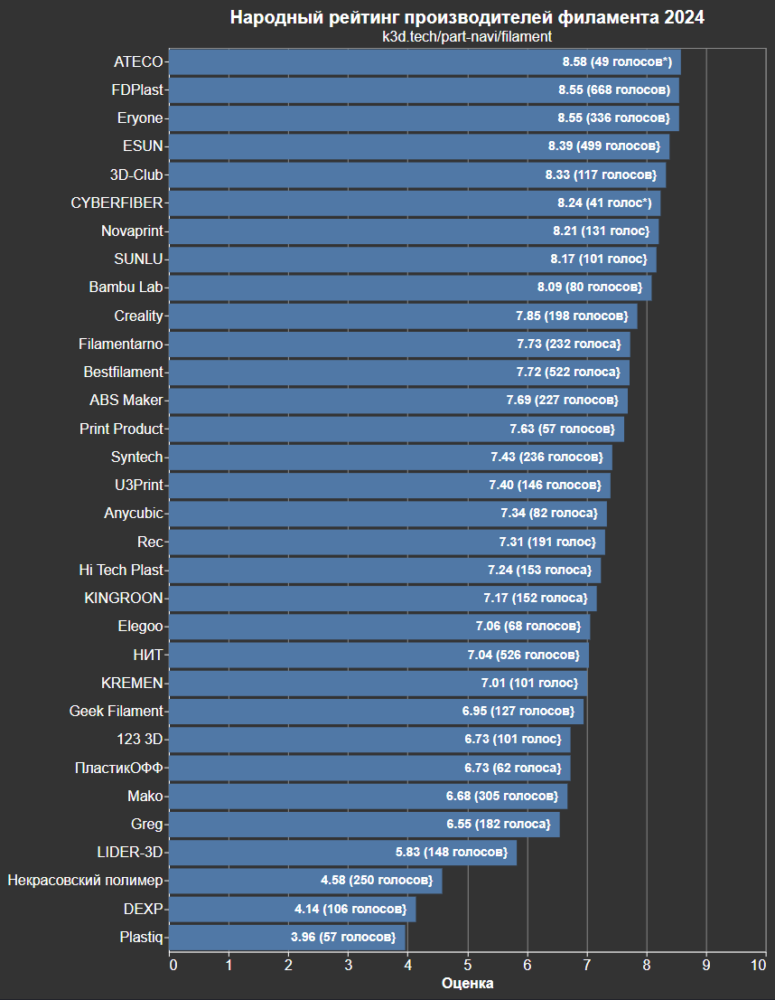

# 3D рекомендатор: филаменты и расходники

В этом разделе вы можете найти информацию по поводу того, какие филаменты от каких производителей, а также какие расходники стоит покупать, а какие нет.

- [:simple-telegram: Задать вопрос по поводу выбора комплектующих](https://t.me/K_3_D/1944033)
- [:simple-telegram: Сообщить об ошибке в telegram](https://t.me/K_3_D/1944075) - обязательно тегайте @dmitry_sorkin в сообщении, чтобы мне пришло уведомление
- [:octicons-mail-16: Сообщить об ошибке по e-mail](mailto:dbsorkin@gmail.com) - ⚠️ Только для сообщений об ошибках. На вопросы по e-mail не отвечаю

## Филаменты

### Тип филамента

=== "YouTube"

    <iframe width="900" height="506" src="https://www.youtube.com/embed/CzgOCkJbcxE?si=vsBjAMU5iFWQ6Lze" title="YouTube video player" frameborder="0" allow="accelerometer; autoplay; clipboard-write; encrypted-media; gyroscope; picture-in-picture; web-share" allowfullscreen></iframe>

=== "VK"

    <iframe src="https://vk.com/video_ext.php?oid=-168896673&id=456239418&hd=2" width="853" height="480" allow="autoplay; encrypted-media; fullscreen; picture-in-picture; screen-wake-lock;" frameborder="0" allowfullscreen></iframe>

Для FDM 3D принтеров выпускают очень большое количество видов филамента, каждый из которых обладает своими уникальными физико-механическими свойствами. Иными словами, нет "хороших" и "плохих" филаментов, они все нужны для решения разных задач. Основные отличия самых распространенных видов филамента между собой описаны в соответствующем ролике.

Новичкам рекомендуется учиться на более простых в печати филаментах. Для начала хорошо подойдут PLA и PETG. Они хороши по механическим свойствам, но имеют низкую температуру эксплуатации. Если нужен более термостойкий материал, то оптимальным для новичков является композитный ABS т.к. стоит относительно недорого и имеет очень низкую усадку. Обратите внимание, что для печати композитными материалами нужно износостойкое сопло.

### Производители филамента

Даже один и тот же филамент, будучи выпущенным разными компаниями, может не только отличаться по цене, но и иметь разные физико-механические свойства и качество. Поэтому 2 раза в год проводится народный рейтинг производителей филамента. Оценка в этом рейтинге показывает то, насколько другие пользователи рекомендовали бы филамент от указанных компаний. 

{ width=1000 }

Голосование проводилось в июле 2024 года среди подписчиков K3D. В нем участвовало 1393 человека, которые оценили своё желание рекомендовать филамент разных производителей другим печатникам по 5-балльной шкале.

Из полученных голосов было отсеяно 15 шт. т.к. они нарушали правила голосования (вместо пропуска неизвестных производителей всем были проставлены одинаковые оценки, чаще всего минимальные). Также были отсеяны производители филамента, набравшие менее 50 голосов, кроме ATECO и CYBERFIBER. Для них пришлось сделать исключение т.к. уже после окончания голосования выяснилось, что они объединились и теперь являются одним производителем. Суммировать их голоса было бы некорректно т.к., скорее всего, были люди, которые голосовали одновременно за обоих производителей. Отсеивать этого производителя было бы некорректно т.к., скорее всего, они не набрали пороговое значение голосов ввиду моей ошибки. Так что самым справедливым вариантом мне показалось добавить их в голосование с пометкой и объяснением ситуации.

Список производителей, которые не прошли в рейтинг: (1)
{ .annotate }

1. INFILL (42 голоса) STAR PLAST (35 голосов) Flashforge (30 голосов) Solid Filament (29 голосов) Polymaker (28 голосов) Wellhan (27 голосов) OPY (26 голосов) Element3D (24 голоса) EXOFLEX (23 голоса) Cactus (23 голоса) FusRock (21 голос) Tiger3D (20 голосов) Funtastique (18 голосов) PIC (17 голосов) UNID (17 голосов) ИКЦ (15 голосов) Raise 3D (15 голосов) Траектория 3D (12 голосов) SEM (12 голосов) JamgHe (11 голосов) ChiTu Systems (10 голосов) ОРФЕЙ (10 голосов) YouSu (9 голосов) NV Print (9 голосов) Q3T (6 голосов) Trianglelab (6 голосов) Onlyplast (6 голосов) ANYPLAST (6 голосов) BIQU (6 голосов) ColorFabb (5 голосов) VolPrint (5 голосов) Longer (5 голосов) Fulcrum (5 голосов) Sovol (5 голосов) R-Filament (5 голосов) RSPlast (4 голоса) Sting 3D (4 голоса) FL33 (4 голоса) TWO TREES (4 голоса) BEHANT (3 голоса) Charm3D (3 голоса) TOYAR (3 голоса) Studia 3D (3 голоса) Funtasy (3 голоса) Mindao (2 голоса) HELEOS (2 голоса) 3D Craft (1 голос) Jorden (1 голос) Sk-Plast (1 голос)

## Клей

`PLA`, `PETG`, `TPU`, `SBS`, `PVA`, `PVB` нормально липнут на стекло с покрытием Ultrabase или на стальной лист с покрытием PEI. Главное - обезжирить поверхность. `PP` липнет на стеклотекстолит FR-4. В других случаях требуется нанесение на стол клея.

| Наименование | Ссылки | Комментарий |
|:------------ |:------:|:----------- |
| 3D-клей | [:material-shopping:](https://www.ozon.ru/category/3d-kley/){ target="_blank" } [:material-shopping:](https://market.yandex.ru/search?text=3d%20%D0%BA%D0%BB%D0%B5%D0%B9&rs=eJwdUD0LQWEYfWUyyYy8o00p6eZeXf-ABQNFLP6BSddHSik2-UjXxmSifOUtTMpmkIE_otxzltPpOc9zznnfaMuddt1c4ps5OWiFj-DawUG10R2UOQMTH1TxBrf84HYBqtqDm9MEsIMr84QdOQSW5lBVhLwMZ3HHlZ2ip4dZC6aY9Blws8ImE8xFG552EXO1BgoNqqydyTGxc-xm8LZL5xh7vuBg_YBmj55bTuLcv6Kz9DJlxlbBJBx27M8U1We3Kq-e2LfyTFzy6kGHsYbEEd4i6_yBC9NXUNWHWTqbB8C_ITZpsGeTPKv_AQJfhpA%2C&allowCollapsing=1&local-offers-first=0){ target="_blank" } | Хорошо липнут `PLA`, `PETG`, `ABS`, `ASA`, `HIPS`, `TPU`, `PVA`, `PVB`, `SBS`, `SAN`. Средне липнут `PC`, `PA12`. Наносится тонким слоем, не влияет на внешний вид нижней поверхности |
| БФ-2 | [:material-shopping:](https://www.ozon.ru/product/kley-bf-2-solins-universalnyy-dlya-metalla-alyuminiya-keramiki-tkani-stali-plastikov-stekla-282539355/?asb=aDFtWa9TLph59Zk7AO3pf7DZXriRuM%252B9wwMXqXs7OVQ%253D&asb2=CXPORi2-s4-zMEmwM6TGgXFKWHiCaAVFM-aN9jCUN5sgVGt2s21HOekrUVhmejht&avtc=1&avte=2&avts=1698447793&keywords=%D0%B1%D1%84-2+solins){ target="_blank" } [:material-shopping:](https://www.ozon.ru/product/kley-bf-2-100-ml-0-08-kg-630977519/?advert=xHiVbuKE4It3U70aNbyoHILD-midKz5HVYVluxZcxqSnKSXm9RnKpv0LhRdujsQEFOgwaavRX_QJyI9fZZAf9WAe5wRIUu3SkRaF-SFVB4tuyoi7NeKUAU4pr8EjoVF6-KI5cusMhzyIaxUkrrB0IFZzJM_FX-RlGzvOXos17dE89jJWEtRia67_r8KSEJqhsuu4yFen3ZIZmhWhqWSFZFrhmEGh67I21JnFOg-cHNHjP0cx8jN_rJcB7glkZxoSFZsiFzyFUyGzMT7EcpLSBqpRKEW_WjdpPlv_EaWRAnqlhXn5R6eHoxHcOnKbLKn_jLXSM0ZO0VDR7mif4BpK_zqk&avtc=1&avte=4&avts=1698447853&keywords=%D0%B1%D1%84-2+solins){ target="_blank" } | Необходимо размешать с изопропанолом 1:1. Хорошо липнет всё, кроме `SEBS`. Слишком хорошо липнут нейлоны, могут быть проблемы с отделением от стола. Наносится кисточкой, может оставлять на модели следы |

## Смазка

Если производитель рекомендует использовать какую-то конкретную смазку, то следуйте этим рекомендациям. Если нигде не указано что и чем смазывать, то всё просто. Смазываются ходовые винты, а также направляющие кроме колёс. При этом, так как нагрузки и скорости в 3д печати низкие, то для этого подойдёт любая консистентная смазка для подшипников, например, литол-24. Проще всего купить в ближайшем автомагазине или на заправке.

!!! note "жидкие смазки в 3д принтерах не используются так как не встречаются системы подачи или удержания смазки"

| Наименование | Ссылки | Комментарий |
|:------------ |:------:|:----------- |
| Литол-24 | [:material-shopping:](https://www.ozon.ru/product/smazka-universalnaya-avtomobilnaya-vodostoykaya-gazpromneft-litol-24-150-gr-1046659010/?asb=NaMd2w6Wh4PC92ltjnz45wjObaO94DrNa0OS0eQ2Mog%253D&asb2=Bph6pI21MVLxpeNeZrqVtVfMIh4WxYi4a_rqE2_JLyl4TEDM7fuAgx7_3v51hfmE&avtc=1&avte=2&avts=1698448613&keywords=%D0%BB%D0%B8%D1%82%D0%BE%D0%BB+24){ target="_blank" } [:material-shopping:](https://market.yandex.ru/product--smazka-luxe-litol-24/673454000?nid=54800&show-uid=16984494965777696679016007&context=search&text=%D0%BB%D0%B8%D1%82%D0%BE%D0%BB-24&uniqueId=67601608&own-cards=67601608%3A100963245737&sku=100963245737&cpc=kZSAkpGfh0-OD3AFjzxADtzkbBxCBhYXaF8hg4CJr6XgTsXIpyYu9JqEDMIpvzAF88P-xsk8SwQtOmLMH2M6jSY2MjrSyfcSbtJCqMJGHm45pVScCkOYG7LMKUV08Ulal2YYWPcbe2ukBa3V6cossxRaUdleBQWlKBVzqCPzPrEXmGwkoQM9oVEXTLr4TdxE8o6JPK_zd95Jl3c92hiaNxB6Ar_y2wdwHXNL5LuKIbKVjhPMeXAe0kgr71onMOJXJ-Bp5vFZLgzCkhHFFchffQ%2C%2C&do-waremd5=8eqKNMjCfUMpTzoRaI9fdw&sponsored=1&rs=eJwzmsEcwFjFwvHzEOssRt4Luy_suNh0Yd-F3bpGJkcZGRSu7AWSCzbtAZINx7YDyQQLKyDJsM8GJL7aFsQuBLEfRILZTdYgNWdB7IReEKmwEyTScBFkAoMfiP2A3Q5IOkzfDZLtBOlt0AbZktAFUqPADBI5IL0PRJaBTGioBJsvBDZ_Atjk82Dxz2C9d0F6G9jAZMJ-kMmbwW47BhbRAJEMt0EiDFNBbIdPYNMyQC5hKAaZ82A1SCThGIi9oAmk5gDY5QmsYL3KIPYBiL0NYHdOAIfJb5AuBwGQXxY8AYfPdrD5QWBzZMCufQhWvwOkUoENbMJRsK91wSKcIBEHNnD4XAH7OhgcYmvA4nrWAATQkG8%2C){ target="_blank" } | Дешевая универсальная смазка |

## Растворители и обезжириватели

| Наименование | Ссылки | Комментарий |
|:------------ |:------:|:----------- |
| Изопропанол | [:material-shopping:](https://www.ozon.ru/product/spirt-izopropilovyy-absolyutirovannyy-99-97-dlya-dezinfektsii-lancet-1-l-1154450032/?asb=RU16isS5zWryRFcEBD88PyMXxj%252B%252BW%252FswaxyShRbL%252FRg%253D&asb2=yRxwGwbtV0-cuh9AHF5kNFVeCoudroMFFbImT7UgDy71QRqEx2p7wveYmrmyS_Mv&avtc=1&avte=2&avts=1698449291&keywords=%D0%B8%D0%B7%D0%BE%D0%BF%D1%80%D0%BE%D0%BF%D0%B0%D0%BD%D0%BE%D0%BB){ target="_blank" } [:material-shopping:](https://www.wildberries.ru/catalog/164292958/detail.aspx){ target="_blank" } | Используется для разбавления БФ-2, промывки направляющих и очистки деталей механики принтера. Для обезжиривания стола не лучший вариант т.к. оставляет тонкую плёнку, к которой липнет не так хорошо, как если стол хорошо обезжирен |
| Обезжириватель | [:material-shopping:](https://www.ozon.ru/product/obezzhirivatel-bystroisparyayushchiysya-1l-welltex-656712566/?asb=I8kWzx0VhHVrlkTHcRBhAJLnArY7fYt%252FZLI28DxzcW4%253D&asb2=vwJL80esrb_PWH9LcT6Zn-V-uuwGQQi5hFgNxIW1dYkKKHth12ujX-7vhzsZTh5T&avtc=1&avte=2&avts=1698449436&keywords=%D0%BE%D0%B1%D0%B5%D0%B7%D0%B6%D0%B8%D1%80%D0%B8%D0%B2%D0%B0%D1%82%D0%B5%D0%BB%D1%8C+welltex){ target="_blank" } [:material-shopping:](https://market.yandex.ru/search?text=%D0%BE%D0%B1%D0%B5%D0%B7%D0%B6%D0%B8%D1%80%D0%B8%D0%B2%D0%B0%D1%82%D0%B5%D0%BB%D1%8C%20welltex%201%D0%BB&rs=eJwzamIOYDzKyMAgYAskF9zeAyQdVtgASYWGvSDxCSC2w3kQe4EiSE2DHEiNghKI_eAoSFwhCkwW7gKSB1aAZA98B8kqFIHNbAez54LIhMbdIBOY9oHULALpSsgDkQ7rwCZfBpvjYwfSdRWsiwOsSx1MzgC5pAHsHoag_SDbtUF2PdADyTKstAbJ-oH0KjCD3fYfbAIzyMwDvGDyENico2DfGYBtLAGJN2iBffcZZBrDJbAtk8F6GcAulAT5y4Ef5OYF2mBzesCy9WDZXLAfX4LdsAHkOwdzsO0TwXbFgNlHwOJX9sD9_uAkSCRhHziEi_cAAFzViVQ%2C&allowCollapsing=1&local-offers-first=0){ target="_blank" } | Обезжиривает не оставляя следов, может использоваться для промывки направляющих или чистки механики принтера |
