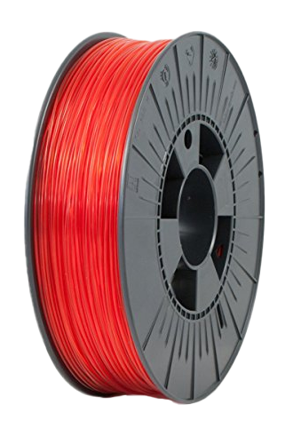

# 3D рекомендатор: филаменты и расходники

В этом разделе вы можете найти информацию по поводу того, какие филаменты от каких производителей, а также какие расходники стоит покупать, а какие нет.

- [:simple-telegram: Задать вопрос по поводу выбора комплектующих](https://t.me/K_3_D/1944033)
- [:simple-telegram: Сообщить об ошибке в telegram](https://t.me/K_3_D/1944075) - обязательно тегайте @dmitry_sorkin в сообщении, чтобы мне пришло уведомление
- [:octicons-mail-16: Сообщить об ошибке по e-mail](mailto:dbsorkin@gmail.com) - ⚠️ Только для сообщений об ошибках. На вопросы по e-mail не отвечаю

## Филаменты

### Рекомендации для новичков

{ align="left" width="200" }

В общем случае новичкам рекомендуется начинать с простых в печати филаментов, потому что это позволит больше времени уделить настройке принтера и слайсера. При этом то, что филаменты считаются простыми в печати не значит, что у них плохие механические свойства. Большинство опытных печатников продолжают часто применять эти филаменты в своей практике.

Рекомендуемый набор: по катушке PETG и PLA для обучения, чаще всего, достаточно. Если можете подготовить принтер под печать композитами[^1], то еще 1 катушка ABS с 10-13% наполнения. Если есть задачи под эластомеры, то TPU A95.

### Подробнее про виды филаментов

<iframe width="900" height="506" src="https://www.youtube.com/embed/CzgOCkJbcxE?si=vsBjAMU5iFWQ6Lze" title="YouTube video player" frameborder="0" allow="accelerometer; autoplay; clipboard-write; encrypted-media; gyroscope; picture-in-picture; web-share" allowfullscreen></iframe>

Подробнее про разные типы филаментов вы можете узнать в соответствующем видео.

### Народный рейтинг производителей

Был проведен [опрос](https://t.me/dsorkin/451), в котором поучаствовало 1530 подписчиков канала K3D. Задано два вопроса: "как вам качество филамента?" и "как вам цена филамента" от разных производителей. Собранные голоса были обработаны и вы можете посмотреть их в виде таблицы:

=== "По алфавиту"

    | Производитель | Оф.магазин | Кол-во голосов | Ср. оценка качества | Ср. оценка цены |
    |:------------- |:----------:|:--------------:|:-------------------:|:---------------:|
    | 3D-Club | [:material-store:](https://3d-club.ru) | 202 | 4.2 | 3.0 |
    | ABS Maker | [:material-store:](https://absmaker.ru) | 312 | 3.8 | 3.9 |
    | Bambu Lab | - | 53 | 4.4 | 1.3 |
    | Bestfilament | [:material-store:](https://bestfilament.ru) | 661 | 4.0 | 1.3 |
    | Creality | [:material-store:](https://alli.pub/6t6glz) | 208 | 4.0 | 2.1 |
    | Eryone | [:material-store:](https://alli.pub/6t6gm6) | 382 | 4.2 | 3.2 |
    | ESUN | [:material-store:](https://esun-3d.ru) | 573 | 4.3 | 2.4 |
    | FDPlast | [:material-store:](https://www.sopytka.ru/products/prutki-dlya-3d-printera/) | 763 | 4.2 | 4.3 |
    | Filamentarno | [:material-store:](https://filamentarno.ru/catalog.html) | 279 | 4.1 | 1.5 |
    | Greg | [:material-store:](https://greg-3d.ru) | 220 | 3.4 | 4.5 |
    | Hi Tech Plast | [:material-store:](https://h-t-p.ru) | 231 | 3.8 | 4.3 |
    | KREMEN | [:material-store:](https://kremen.ru) | 150 | 3.7 | 4.2 |
    | LIDER-3D | [:material-store:](https://lider-3d.ru/catalog/materialy/plastik_dlya_3d_printerov/) | 137 | 3.1 | 2.8 |
    | Mako | [:material-store:](https://3dmako.ru) | 203 | 3.9 | 5.0 |
    | Novaprint | [:material-store:](https://novaprint3d.ru) | 129 | 4.3 | 3.7 |
    | Plastiq | [:material-store:](http://plastiq.ru) | 96 | 2.6 | 2.8 |
    | Print Product | [:material-store:](https://printproduct3d.ru) | 108 | 3.9 | 1.8 |
    | Rec | [:material-store:](https://rec3d.ru) | 226 | 4.1 | 1.0 |
    | SUNLU | [:material-store:](https://alli.pub/6t6gr1) | 109 | 3.8 | 2.6 |
    | Syntech | [:material-store:](https://syntechlab.ru) | 267 | 3.9 | 3.9 |
    | U3Print | [:material-store:](https://u3print.com) | 209 | 3.9 | 3.5 |
    | НИТ | [:material-store:](https://plastik-nit.ru) | 472 | 3.6 | 4.1 |

=== "По ср.оценке качества"

    | Производитель | Оф.магазин | Кол-во голосов | Ср. оценка качества | Ср. оценка цены |
    |:------------- |:----------:|:--------------:|:-------------------:|:---------------:|
    | Bambu Lab | - | 53 | 4.4 | 1.3 |
    | ESUN | [:material-store:](https://alli.pub/6tddf2) | 573 | 4.3 | 2.4 |
    | Novaprint | [:material-store:](https://novaprint3d.ru) | 129 | 4.3 | 3.7 |
    | Eryone | [:material-store:](https://alli.pub/6t6gm6) | 382 | 4.2 | 3.2 |
    | FDPlast | [:material-store:](https://www.sopytka.ru/products/prutki-dlya-3d-printera/) | 763 | 4.2 | 4.3 |
    | 3D-Club | [:material-store:](https://3d-club.ru) | 202 | 4.2 | 3.0 |
    | Rec | [:material-store:](https://rec3d.ru) | 226 | 4.1 | 1.0 |
    | Filamentarno | [:material-store:](https://filamentarno.ru/catalog.html) | 279 | 4.1 | 1.5 |
    | Bestfilament | [:material-store:](https://bestfilament.ru) | 661 | 4.0 | 1.3 |
    | Creality | [:material-store:](https://alli.pub/6t6glz) | 208 | 4.0 | 2.1 |
    | Print Product | [:material-store:](https://printproduct3d.ru) | 108 | 3.9 | 1.8 |
    | Syntech | [:material-store:](https://syntechlab.ru) | 267 | 3.9 | 3.9 |
    | Mako | [:material-store:](https://3dmako.ru) | 203 | 3.9 | 5.0 |
    | U3Print | [:material-store:](https://u3print.com) | 209 | 3.9 | 3.5 |
    | Hi Tech Plast | [:material-store:](https://h-t-p.ru) | 231 | 3.8 | 4.3 |
    | ABS Maker | [:material-store:](https://absmaker.ru) | 312 | 3.8 | 3.9 |
    | SUNLU | [:material-store:](https://alli.pub/6t6gr1) | 109 | 3.8 | 2.6 |
    | KREMEN | [:material-store:](https://kremen.ru) | 150 | 3.7 | 4.2 |
    | НИТ | [:material-store:](https://plastik-nit.ru) | 472 | 3.6 | 4.1 |
    | Greg | [:material-store:](https://greg-3d.ru) | 220 | 3.4 | 4.5 |
    | LIDER-3D | [:material-store:](https://lider-3d.ru/catalog/materialy/plastik_dlya_3d_printerov/) | 137 | 3.1 | 2.8 |
    | Plastiq | [:material-store:](http://plastiq.ru) | 96 | 2.6 | 2.8 |

=== "По ср.оценке цены"

    | Производитель | Оф.магазин | Кол-во голосов | Ср. оценка качества | Ср. оценка цены |
    |:------------- |:----------:|:--------------:|:-------------------:|:---------------:|
    | Mako | [:material-store:](https://3dmako.ru) | 203 | 3.9 | 5.0 |
    | Greg | [:material-store:](https://greg-3d.ru) | 220 | 3.4 | 4.5 |
    | Hi Tech Plast | [:material-store:](https://h-t-p.ru) | 231 | 3.8 | 4.3 |
    | FDPlast | [:material-store:](https://www.sopytka.ru/products/prutki-dlya-3d-printera/) | 763 | 4.2 | 4.3 |
    | KREMEN | [:material-store:](https://kremen.ru) | 150 | 3.7 | 4.2 |
    | НИТ | [:material-store:](https://plastik-nit.ru) | 472 | 3.6 | 4.1 |
    | Syntech | [:material-store:](https://syntechlab.ru) | 267 | 3.9 | 3.9 |
    | ABS Maker | [:material-store:](https://absmaker.ru) | 312 | 3.8 | 3.9 |
    | Novaprint | [:material-store:](https://novaprint3d.ru) | 129 | 4.3 | 3.7 |
    | U3Print | [:material-store:](https://u3print.com) | 209 | 3.9 | 3.5 |
    | Eryone | [:material-store:](https://alli.pub/6t6gm6) | 382 | 4.2 | 3.2 |
    | 3D-Club | [:material-store:](https://3d-club.ru) | 202 | 4.2 | 3.0 |
    | Plastiq | [:material-store:](http://plastiq.ru) | 96 | 2.6 | 2.8 |
    | LIDER-3D | [:material-store:](https://lider-3d.ru/catalog/materialy/plastik_dlya_3d_printerov/) | 137 | 3.1 | 2.8 |
    | SUNLU | [:material-store:](https://alli.pub/6t6gr1) | 109 | 3.8 | 2.6 |
    | ESUN | [:material-store:](https://esun-3d.ru) | 573 | 4.3 | 2.4 |
    | Creality | [:material-store:](https://alli.pub/6t6glz) | 208 | 4.0 | 2.1 |
    | Print Product | [:material-store:](https://printproduct3d.ru) | 108 | 3.9 | 1.8 |
    | Filamentarno | [:material-store:](https://filamentarno.ru/catalog.html) | 279 | 4.1 | 1.5 |
    | Bestfilament | [:material-store:](https://bestfilament.ru) | 661 | 4.0 | 1.3 |
    | Bambu Lab | - | 53 | 4.4 | 1.3 |
    | Rec | [:material-store:](https://rec3d.ru) | 226 | 4.1 | 1.0 |

Методика перевода результатов голосования в цифровые оценки. Сначала были отсеяны производители филамента, за которые проголосовало менее 50 человек. После этого голоса участников за качество были переведены в цифровые: отлично = 5, хорошо = 4, средне = 3, плохо = 2, ужасно = 1, и взято среднее арифметическое от них. Это вы видите в колонке "ср.оценка качества".

Голоса участников за цену были переведены в цифровые: завышенная = -1, справедливая = 0, заниженая = 1. После этого диапазон данных был "растянут" таким образом, чтобы оцени оказались в диапазоне от 1 до 5. Эта методика в целом корректна, но может вызвать путаницу в восприятии данных.

Плюс к этому, в голосование не попали несколько производителей, которых я банально забыл, и которые не попались мне на первых страницах популярных маркетплейсов и поиска. Исправить это всё "на лету" было невозможно, поэтому в ближайшем будущем будет повторное голосование.

Необработанную статистику можно найти [тут](https://docs.google.com/forms/d/164chhVtdZsI9f6PYx4k5qtIiLljUAV1aJd3BAurTXZg/viewanalytics).

## Клей

`PLA`, `PETG`, `TPU`, `SBS`, `PVA`, `PVB` нормально липнут на стекло с покрытием Ultrabase или на стальной лист с покрытием PEI. Главное - обезжирить поверхность. `PP` липнет на стеклотекстолит FR-4. В других случаях требуется нанесение на стол клея.

| Наименование | Ссылки | Комментарий |
|:------------ |:------:|:----------- |
| 3D-клей | [:material-shopping:](https://www.ozon.ru/category/3d-kley/) [:material-shopping:](https://market.yandex.ru/search?text=3d%20%D0%BA%D0%BB%D0%B5%D0%B9&rs=eJwdUD0LQWEYfWUyyYy8o00p6eZeXf-ABQNFLP6BSddHSik2-UjXxmSifOUtTMpmkIE_otxzltPpOc9zznnfaMuddt1c4ps5OWiFj-DawUG10R2UOQMTH1TxBrf84HYBqtqDm9MEsIMr84QdOQSW5lBVhLwMZ3HHlZ2ip4dZC6aY9Blws8ImE8xFG552EXO1BgoNqqydyTGxc-xm8LZL5xh7vuBg_YBmj55bTuLcv6Kz9DJlxlbBJBx27M8U1We3Kq-e2LfyTFzy6kGHsYbEEd4i6_yBC9NXUNWHWTqbB8C_ITZpsGeTPKv_AQJfhpA%2C&allowCollapsing=1&local-offers-first=0) | Хорошо липнут `PLA`, `PETG`, `ABS`, `ASA`, `HIPS`, `TPU`, `PVA`, `PVB`, `SBS`, `SAN`. Средне липнут `PC`, `PA12`. Наносится тонким слоем, не влияет на внешний вид нижней поверхности |
| БФ-2 | [:material-shopping:](https://www.ozon.ru/product/kley-bf-2-solins-universalnyy-dlya-metalla-alyuminiya-keramiki-tkani-stali-plastikov-stekla-282539355/?asb=aDFtWa9TLph59Zk7AO3pf7DZXriRuM%252B9wwMXqXs7OVQ%253D&asb2=CXPORi2-s4-zMEmwM6TGgXFKWHiCaAVFM-aN9jCUN5sgVGt2s21HOekrUVhmejht&avtc=1&avte=2&avts=1698447793&keywords=%D0%B1%D1%84-2+solins) [:material-shopping:](https://www.ozon.ru/product/kley-bf-2-100-ml-0-08-kg-630977519/?advert=xHiVbuKE4It3U70aNbyoHILD-midKz5HVYVluxZcxqSnKSXm9RnKpv0LhRdujsQEFOgwaavRX_QJyI9fZZAf9WAe5wRIUu3SkRaF-SFVB4tuyoi7NeKUAU4pr8EjoVF6-KI5cusMhzyIaxUkrrB0IFZzJM_FX-RlGzvOXos17dE89jJWEtRia67_r8KSEJqhsuu4yFen3ZIZmhWhqWSFZFrhmEGh67I21JnFOg-cHNHjP0cx8jN_rJcB7glkZxoSFZsiFzyFUyGzMT7EcpLSBqpRKEW_WjdpPlv_EaWRAnqlhXn5R6eHoxHcOnKbLKn_jLXSM0ZO0VDR7mif4BpK_zqk&avtc=1&avte=4&avts=1698447853&keywords=%D0%B1%D1%84-2+solins) | Необходимо размешать с изопропанолом 1:1. Хорошо липнет всё, кроме `SEBS`. Слишком хорошо липнут нейлоны, могут быть проблемы с отделением от стола. Наносится кисточкой, может оставлять на модели следы |

## Смазка

Если производитель рекомендует использовать какую-то конкретную смазку, то следуйте этим рекомендациям. Если нигде не указано что и чем смазывать, то всё просто. Смазываются ходовые винты, а также направляющие кроме колёс. При этом, так как нагрузки и скорости в 3д печати низкие, то для этого подойдёт любая консистентная смазка для подшипников, например, литол-24. Проще всего купить в ближайшем автомагазине или на заправке.

!!! note "жидкие смазки в 3д принтерах не используются так как не встречаются системы подачи или удержания смазки"

| Наименование | Ссылки | Комментарий |
|:------------ |:------:|:----------- |
| Литол-24 | [:material-shopping:](https://www.ozon.ru/product/smazka-universalnaya-avtomobilnaya-vodostoykaya-gazpromneft-litol-24-150-gr-1046659010/?asb=NaMd2w6Wh4PC92ltjnz45wjObaO94DrNa0OS0eQ2Mog%253D&asb2=Bph6pI21MVLxpeNeZrqVtVfMIh4WxYi4a_rqE2_JLyl4TEDM7fuAgx7_3v51hfmE&avtc=1&avte=2&avts=1698448613&keywords=%D0%BB%D0%B8%D1%82%D0%BE%D0%BB+24) [:material-shopping:](https://market.yandex.ru/product--smazka-luxe-litol-24/673454000?nid=54800&show-uid=16984494965777696679016007&context=search&text=%D0%BB%D0%B8%D1%82%D0%BE%D0%BB-24&uniqueId=67601608&own-cards=67601608%3A100963245737&sku=100963245737&cpc=kZSAkpGfh0-OD3AFjzxADtzkbBxCBhYXaF8hg4CJr6XgTsXIpyYu9JqEDMIpvzAF88P-xsk8SwQtOmLMH2M6jSY2MjrSyfcSbtJCqMJGHm45pVScCkOYG7LMKUV08Ulal2YYWPcbe2ukBa3V6cossxRaUdleBQWlKBVzqCPzPrEXmGwkoQM9oVEXTLr4TdxE8o6JPK_zd95Jl3c92hiaNxB6Ar_y2wdwHXNL5LuKIbKVjhPMeXAe0kgr71onMOJXJ-Bp5vFZLgzCkhHFFchffQ%2C%2C&do-waremd5=8eqKNMjCfUMpTzoRaI9fdw&sponsored=1&rs=eJwzmsEcwFjFwvHzEOssRt4Luy_suNh0Yd-F3bpGJkcZGRSu7AWSCzbtAZINx7YDyQQLKyDJsM8GJL7aFsQuBLEfRILZTdYgNWdB7IReEKmwEyTScBFkAoMfiP2A3Q5IOkzfDZLtBOlt0AbZktAFUqPADBI5IL0PRJaBTGioBJsvBDZ_Atjk82Dxz2C9d0F6G9jAZMJ-kMmbwW47BhbRAJEMt0EiDFNBbIdPYNMyQC5hKAaZ82A1SCThGIi9oAmk5gDY5QmsYL3KIPYBiL0NYHdOAIfJb5AuBwGQXxY8AYfPdrD5QWBzZMCufQhWvwOkUoENbMJRsK91wSKcIBEHNnD4XAH7OhgcYmvA4nrWAATQkG8%2C) | Дешевая универсальная смазка |

## Растворители и обезжириватели

| Наименование | Ссылки | Комментарий |
|:------------ |:------:|:----------- |
| Изопропанол | [:material-shopping:](https://www.ozon.ru/product/spirt-izopropilovyy-absolyutirovannyy-99-97-dlya-dezinfektsii-lancet-1-l-1154450032/?asb=RU16isS5zWryRFcEBD88PyMXxj%252B%252BW%252FswaxyShRbL%252FRg%253D&asb2=yRxwGwbtV0-cuh9AHF5kNFVeCoudroMFFbImT7UgDy71QRqEx2p7wveYmrmyS_Mv&avtc=1&avte=2&avts=1698449291&keywords=%D0%B8%D0%B7%D0%BE%D0%BF%D1%80%D0%BE%D0%BF%D0%B0%D0%BD%D0%BE%D0%BB) [:material-shopping:](https://www.wildberries.ru/catalog/164292958/detail.aspx) | Используется для разбавления БФ-2, промывки направляющих и очистки деталей механики принтера. Для обезжиривания стола не лучший вариант т.к. оставляет тонкую плёнку, к которой липнет не так хорошо, как если стол хорошо обезжирен |
| Обезжириватель | [:material-shopping:](https://www.ozon.ru/product/obezzhirivatel-bystroisparyayushchiysya-1l-welltex-656712566/?asb=I8kWzx0VhHVrlkTHcRBhAJLnArY7fYt%252FZLI28DxzcW4%253D&asb2=vwJL80esrb_PWH9LcT6Zn-V-uuwGQQi5hFgNxIW1dYkKKHth12ujX-7vhzsZTh5T&avtc=1&avte=2&avts=1698449436&keywords=%D0%BE%D0%B1%D0%B5%D0%B7%D0%B6%D0%B8%D1%80%D0%B8%D0%B2%D0%B0%D1%82%D0%B5%D0%BB%D1%8C+welltex) [:material-shopping:](https://market.yandex.ru/search?text=%D0%BE%D0%B1%D0%B5%D0%B7%D0%B6%D0%B8%D1%80%D0%B8%D0%B2%D0%B0%D1%82%D0%B5%D0%BB%D1%8C%20welltex%201%D0%BB&rs=eJwzamIOYDzKyMAgYAskF9zeAyQdVtgASYWGvSDxCSC2w3kQe4EiSE2DHEiNghKI_eAoSFwhCkwW7gKSB1aAZA98B8kqFIHNbAez54LIhMbdIBOY9oHULALpSsgDkQ7rwCZfBpvjYwfSdRWsiwOsSx1MzgC5pAHsHoag_SDbtUF2PdADyTKstAbJ-oH0KjCD3fYfbAIzyMwDvGDyENico2DfGYBtLAGJN2iBffcZZBrDJbAtk8F6GcAulAT5y4Ef5OYF2mBzesCy9WDZXLAfX4LdsAHkOwdzsO0TwXbFgNlHwOJX9sD9_uAkSCRhHziEi_cAAFzViVQ%2C&allowCollapsing=1&local-offers-first=0) | Обезжиривает не оставляя следов, может использоваться для промывки направляющих или чистки механики принтера |

[^1]: для печати композитными материалами требуется цельнометаллическое или биметаллическое горло + износостойкое сопло, обычно стальное закалёное или медное с калёной вставкой. Титановые и медные никелированные сопла износостойкими не являются.