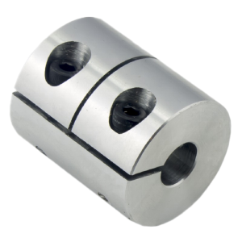
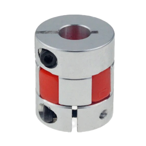

# 3D рекомендатор: механика

В этом разделе вы можете найти проверенные ссылки на детали механики для FDM 3D принтеров.

- [:simple-telegram: Задать вопрос по поводу выбора комплектующих](https://t.me/K_3_D/1944033)
- [:simple-telegram: Сообщить об ошибке в telegram](https://t.me/K_3_D/1944075) - обязательно тегайте @dmitry_sorkin в сообщении, чтобы мне пришло уведомление
- [:octicons-mail-16: Сообщить об ошибке по e-mail](mailto:dbsorkin@gmail.com) - ⚠️ Только для сообщений об ошибках. На вопросы по e-mail не отвечаю

## Направляющие серии MGN

У официального поставщика рельс HIWIN в РФ рельсы стоят неоправдано дорого, продаются только метровыми или двухметровыми отрезками, кареток с нужным преднатягом часто нет в наличии + есть подозрения, что иногда толкают контрафакт. В других магазинах, особенно на AliExpress, нарваться на оригинал HIWIN сложно. Так что ссылки на рельсы этого производителя я оставлять не буду.

Рельсы у китайских производителей кратно дешевле, но всегда являются лотереей. С одного лота может прийти как нормального качества, так и совсем фуфло. Это можно компенсировать покупкой рельс и кареток с запасом, а потом отсеиваением брака или покупкой шариков с рельсами и переборкой кареток для выбора люфта.

| Наименование | Типоразмер | KGT[^2] | RDBB[^3] | Комментарий |
|:------------ |:------:|:------:|:------:|:----------- |
| Рельса с кареткой | MGN9 | - | [:material-shopping:](https://alli.pub/6tvx6t?erid=2SDnjcbaDhS "CNA Mechanical Parts Store"){ target="_blank" } | Длина рельсы и тип каретки на выбор |
| Каретка | MGN9 | - | [:material-shopping:](https://alli.pub/6tvx7l?erid=2SDnjcg2BYU "CNA Mechanical Parts Store"){ target="_blank" } | C - короткая каретка, H - длинная |
| Шары | MGN9 | [:material-shopping:](https://alli.pub/6tvx7z?erid=2SDnjcizA7A "KGT Manufactor store"){ target="_blank" } | - | Шарики для переборки кареток. Цифры Z0, Z1 и т.д. - преднатяг[^4] |
| Рельса с кареткой | MGN12 | - | [:material-shopping:](https://alli.pub/6tvx8d?erid=2SDnjcmx8fr "CNA Mechanical Parts Store"){ target="_blank" } | Длина рельсы и тип каретки на выбор |
| Каретка | MGN12 | - | [:material-shopping:](https://alli.pub/6tvx95?erid=2SDnjcrQ6Wt "CNA Mechanical Parts Store"){ target="_blank" } | C - короткая каретка, H - длинная |
| Шары | MGN12 | [:material-shopping:](https://alli.pub/6tvx9c?erid=2SDnjcst5oE "KGT Manufactor store"){ target="_blank" } | - | Шарики для переборки кареток. Цифры Z0, Z1 и т.д. - преднатяг[^4] |

## Комплектующие Openbuilds

| Наименование | Ссылки | Комментарий |
|:------------ |:------:|:----------- |
| Колёса Openbuilds | [:material-shopping:](https://alli.pub/6tvxbh?erid=2SDnjd5jz3z "5A"){ target="_blank" } | Обычные колёса из ПОМ |
| Каретка Ender-3 в сборе | [:material-shopping:](https://alli.pub/6tvxbo?erid=2SDnjd7DyLL "IdeaFormer Official Store"){ target="_blank" } | Для установки печатающих голов для `Ender-3` на принтеры с другими каретками |
| Эксцентриковая гайка | [:material-shopping:](https://alli.pub/6tvxc2?erid=2SDnjd8hxcg "В комплекте 5 или 10шт. IdeaFormer Official Store"){ target="_blank" } | Служит для регулировки прижима колёс |
| Проставки под колёса 6мм | [:material-shopping:](https://alli.pub/6tvxc9?erid=2SDnjdABwu2 "В комплекте 10шт. IdeaFormer Official Store"){ target="_blank" } | Ставится между кареткой и колесом чтобы обеспечить нужный вылет |
| Проставки под колёса 8мм | [:material-shopping:](https://alli.pub/6tvxcg?erid=2SDnjdBfwBN "В комплекте 10шт. IdeaFormer Official Store"){ target="_blank" } | -//- |

## Покрытия для столов

### Стекло

Самое универсальное и при этом дешевое покрытие для стола - обычное оконное стекло. Оно очень дешево стоит, за счёт чего можно не влезая в кредиты купить несколько штук и подобрать наиболее ровное из них. Мажется любым клеем для 3д печати, за счёт чего подходит под все филаменты. Если слой клея будет очень тонкий, то даёт глянцевую нижнюю поверхность деталей. 

Покупается стекло в ближайшей стеклорезке, цена за кусок 235х235мм с обработкой краёв должна быть около 200-400р. Закалённые, боросиликатные, ситалловые и т.д. не нужны так как стоят дороже, а работают не лучше.

### Стальной лист без покрытия

Стальные листы без покрытия используются вместе с магнитной подложкой. Похожи на стекло тем, что тоже мажутся клеем, за счёт чего универсальны. Но имеют плюс - деталь снимается со стола вместе с листом, потом лист изгибается и деталь отлипает. Также можно лист с деталью положить на холодный стол или пол, чтобы быстрее остыло и отлипло. 

| Размер | Ссылки | Комментарий |
|:------ |:------:|:----------- |
| 235x235 мм | [:material-shopping:](https://alli.pub/6tvxd1?erid=2SDnjdD9vTi "ENERGETIC 3D Store"){ target="_blank" } | Используется на `Ender-3` / `Ender-3 Pro` / `Ender-3V2` / `Ender-3Neo` / `Ender-3S1` / `Ender-3S1 Pro` / `Ender-3 V3SE` / `Neptune 3Pro` / `Neptune 4` / `Creality K1` и подобных. Для принтеров с направляющими винтами придётся их выкрутить (очень просто) или вырезать ключи в листе самостоятельно |
| 310x310 мм | [:material-shopping:](https://alli.pub/6tvxdf?erid=2SDnjdG7u2Q "ENERGETIC 3D Store"){ target="_blank" } | Используется на `CR-10`, увеличенных версиях `Ender-3` / `Neptune 3` и многих других |

Другие размеры искать в каталоге производителя: [:material-shopping: ENERGETIC 3D](https://alli.pub/6tvxdt?erid=2SDnjdHbtJk){ target="_blank" }.

### Стальной лист с PEI

На такой простые пластики (PLA, PETG, SBS и т.п.) липнут хорошо, но адгезии для стабильной печати ABS-подобными хватает уже только на мелкие детали, а многие филаменты типа нейлонов вообще не липнут нормально. Поэтому предпочтительны листы с покрытием только с 1 стороны, чтобы вторую мазать клеем. При этом ничто не запрещает и покрытую сторону мазать клеем, просто лучше тогда покупать с разным покрытием с 2 сторон, чтобы визуально не путать какая сторона под клей, а какая под печать напрямую.

Из типов PEI мне больше всего нравится текстурированный т.к. оставляет красивую текстуру на нижнем слое модели и от него простые филаменты нормально отлипают. К гладкому немного лучше липнет, но часто деталь отрывает плёнку от листа. Другие виды почти не тестировал.

| Размер | Ссылки | Комментарий |
|:------ |:------:|:----------- |
| 235x235 мм | [:material-shopping:](https://alli.pub/6tvxe7?erid=2SDnjdN3r9n "ENERGETIC 3D Store"){ target="_blank" } | Используется на `Ender-3` / `Ender-3 Pro` / `Ender-3V2` / `Ender-3Neo` / `Ender-3S1` / `Ender-3S1 Pro` / `Ender-3 V3SE` / `Neptune 3Pro` / `Neptune 4` / `Creality K1` и подобных. Для принтеров с направляющими винтами придётся их выкрутить (очень просто) или вырезать ключи в листе самостоятельно |
| 257x230 мм | [:material-shopping:](https://alli.pub/6tvxee?erid=2SDnjdPXqS8 "ENERGETIC 2th Store"){ target="_blank" } | Для FBG6. Идёт в комплекте с наклейкой |
| 310x310 мм | [:material-shopping:](https://alli.pub/6tvxel?erid=2SDnjdR1piU "ENERGETIC 2th Store"){ target="_blank" } | Используется на `CR-10`, увеличенных версиях `Ender-3` / `Neptune 3` и многих других |

### Стеклотестолит FR-4

Стеклотекстолит используется для печати стеклонаполненным полипропиленом. Для этого он матуется очень крупной шкуркой, и `PP GF` филамент начинает липнуть к нему без клея. Обратную сторону листа при этом можно мазать клеем под любой филамент. По применимости заменяет стекло.

На данный момент готовые листы стеклотекстолита пропали с продажи на AliExpress, поэтому вам придётся купить и подготовить лист самостоятельно. Купить листы можно на торговых площадках или тут: [[:material-shopping: prodiel.ru]](https://prodiel.ru/izolyatsionnye-materialy/cteklotekstolit-prutki-fr-4-trubki-tsef/steklotekstolit-listy-i-prutki-fr-4/){ target="_blank" }

## Детали приводов

### Ремни 2GT

В подавляющем большинстве случаев в 3д принтерах используются неопреновые ремни 2GT со стекловолоконным кордом, и 20-зубые шкивы. Полиуретановые ремни со стальным кордом (белые) очень жесткие и быстро изнашиваются на принтерах, где ремень многократно изгибается. Поэтому покупать их смысла мало.

По ширине наиболее распространены 6мм. 9мм из популярных принтеров используются только в `FB Reborn 2`, но также их можно встретить в некоторых самосборах. Ремни шире (12, 15мм) используются редко. Но, если они нужны, их можно найти в том же магазине, что и 6\9мм.

| Производитель | 6 мм | 9 мм | Комментарий |
|:------------- |:----:|:----:|:----------- |
| POWGE | [:material-shopping:](https://alli.pub/6tvxfd?erid=2SDnjdVTnZW "POWGE Official Store"){ target="_blank" } | [:material-shopping:](https://alli.pub/6tvxgj?erid=2SDnjdbPjgt "POWGE Official Store"){ target="_blank" } | Цена низкая, качество хорошее. Себе покупаю такой и доволен |
| GATES | [:material-shopping:](https://alli.pub/6tvxfr?erid=2SDnjdYRm8C "POWGE Official Store"){ target="_blank" } | [:material-shopping:](https://alli.pub/6tvxgq?erid=2SDnjdcsiyE "POWGE Official Store"){ target="_blank" } | GATES стоит дороже POWGE и считается более качественным. Но лично я разницы по эксплуатации не видел, хоть многократно менял на разных принтерах одно на другое. Если шейх, то берите. Если работяга, то и POWGE норм :) |

### Кольцевые ремни 2GT

Кольцевые ремни подбираются по ширине и количеству зубов. Мнообразие размеров такое большое, что я не могу привести их все в таблице. Лучше сами выберите в каталогах: [[:material-shopping: GATES]](https://alli.pub/6tvxgx?erid=2SDnjdeMiFa){ target="_blank" } [[:material-shopping: POWGE]](https://alli.pub/6tvxh4?erid=2SDnjdfqhXv){ target="_blank" }

### Шкивы 2GT

| Кол-во зубов | 6 мм | 9 мм | Комментарий |
|:------------ |:----:|:----:|:----------- |
| 12 | [:material-shopping:](https://alli.pub/6tvxhp?erid=2SDnjdiog6c "GKTOOLS Official Store"){ target="_blank" } | [:material-shopping:](https://alli.pub/6tvxi3?erid=2SDnjdmmefJ "GKTOOLS Official Store"){ target="_blank" } | Используются как основа для печатных шкивов |
| 16 | [:material-shopping:](https://alli.pub/6tvxiv?erid=2SDnjdpjdDz "POWGE Official Store"){ target="_blank" } | [:material-shopping:](https://alli.pub/6tvxj2?erid=2SDnjdshbng "POWGE Official Store"){ target="_blank" } | Редко встречаются в 3д принтерах |
| 20 | [:material-shopping:](https://alli.pub/7051kv?erid=2SDnjcHRExS "POWGE Official Store"){ target="_blank" } | [:material-shopping:](https://alli.pub/6tvxjg?erid=2SDnjdvfaMN "POWGE Official Store"){ target="_blank" } | Самые распространенные шкивы на 3д принтерах. Под Nema 17 мотор брать с диаметром центрального отверстия 5мм |

Шкивы другого размера можно найти в каталоге: [[:material-shopping: POWGE]](https://alli.pub/6tvxjn?erid=2SDnjdx9Zdi){ target="_blank" }

### Шаговые двигатели

Последнее время набирают популярность моторы с поворотом за шаг 0.9° (у обычных 1.8°/шаг). Умозрительно кажется, что они точнее, но на практике это никак не заметно, в том числе не влияет на рябь. При этом у таких моторов крутящий момент будет ниже, а цена часто выше. Так что я моторы 0.9°/шаг не рекомендую и ссылок на них не даю. Также я не вносил в таблицу моторы с необходимым током > 2.2А т.к. такой ток поддерживают только tmc5160/tmc5161 и подобные, которые относительно редкие и рядовому пользователю не нужны.

| Типоразмер | Длина | Кр.момент | Ток_RMS | Ссылки | Комментарий |
|:----------:|:-----:|:---------:|:-------:|:------:|:----------- |
| Nema 14 | 17 мм | 60 мН*м | 0.35 А | - | `LDO 36STH17-0354AHG` с 10-зубой шестерней. Нужен для подающих механизмов, где крайне важна длина или масса. В противных случаях лучше брать аналогичный 20мм мотор |
| Nema 14 | 17 мм | 100 мН*м | 1 А | [:material-shopping:](https://alli.pub/7051l2?erid=2SDnjcTo9vr "BTT Brand Store"){ target="_blank" } | `Moons CSE14HRA1L410A-01` с 10-зубой шестерней. Распространенный вариант под небольшие подающие механизмы |
| Nema 14 | 20 мм | 100 мН*м | 1 А | - | `LDO 36STH20-1004AHG` с 10-зубой шестерней. Распространенный вариант под небольшие подающие механизмы |
| Nema 17 | 22 мм | 130 мН*м | 1 А | [:material-shopping:](https://alli.pub/6tvxls?erid=2SDnjeCySTA "Usongshine Official Store"){ target="_blank" } [:material-shopping:](https://alli.pub/6tvxm6?erid=2SDnjeETRjW "RRF 3D Shop"){ target="_blank" } | `Usongshine 17HS4023` Для подающих механизмов Titan, BMG и подобных |
| Nema 17 | 38 мм | 420 мН*м | 1.5 А | [:material-shopping:](https://alli.pub/6tvxmd?erid=2SDnjeFwR1r "Usongshine Official Store"){ target="_blank" } | `Usongshine 17HS4401` Дешевый, но относительно неплохой мотор, рябит слабо |
| Nema 17 | 48 мм | 600 мН*м | 2.5 А | [:material-shopping:](https://rrf3dshop.ru/catalog/mekhanika/motory/shagovyy-dvigatel-42cm06-leadshine/ "RRF 3D Shop"){ target="_blank" } | `Leadshine 42cm06` Хороший универсальный мотор. Качественный и хорошо сопротивляется ряби |
| Nema 17 | 60 мм | 800 мН*м | 2.5 А | [:material-shopping:](https://rrf3dshop.ru/catalog/mekhanika/motory/shagovyy-dvigatel-42cm08-leadshine/ "RRF 3D Shop"){ target="_blank" } | `Leadshine 42cm08` Хороший крупный мотор. Качественный и хорошо сопротивляется ряби |

Шаговые двигатели LDO на данный момент пропали с AliExpress, но есть в наличии в российских магазинах, например, в RRF3DSHOP.

### Ходовые винты и гайки

Лучший вариант привода оси Z - ходовой винт с трапецеидальной резьбой и гайка из POM. Такой привод стоит дешево, очень надежен и не даёт никаких дефектов печати, если ничего не сломано и не допущено конструктивных ошибок в установке. Винт с латунной гайкой работает сопоставимо, но допускает достаточно большой люфт, который в обычных условиях выбирается массой балки или стола, но, изредка, может давать дефекты на печати. Антилюфтовые гайки (с подпружиненным элементом) либо не дают никаких улучшений, либо могут давать дефекты сами по себе. Винты с тефлоновым покрытием не лучше обычных, но стоят заметно дороже.

| Наименование | Ссылки | Комментарий |
|:------------ |:------:|:----------- |
| Винт Tr8x8 (P2) с латунной гайкой | [:material-shopping:](https://alli.pub/6tvxqg?erid=2SDnjeidC64 "KINGROON Official Store"){ target="_blank" } | Четырёхзаходная резьба. Такие винты наиболее распространены среди 3д принтеров. Дают возможность перемещать ось Z относительно быстро. Не обладают самоторможением, то есть трогая стол/балку можно через гайку прокрутить винт |
| Гайка Tr8x8 (P2) POM обычная | [:material-shopping:](https://alli.pub/6tvxqn?erid=2SDnjek7BNQ "FYSETC Official Store"){ target="_blank" } [:material-shopping:](https://alli.pub/6tvxqu?erid=2SDnjembAek "VENTSPOW Official Store"){ target="_blank" } | Гайка из ПОМ типоразмера как используется на большинстве принтеров. Сидят плотнее, чем латунные гайки, за счёт чего ниже шанс дефектов печати |
| Гайка Tr8x8 (P2) POM под Ender | [:material-shopping:](https://alli.pub/6tvxr1?erid=2SDnjepZ9DS "TWOTREES Speciality Store"){ target="_blank" } | Гайка типоразмера как у Ender-3. Если не собираетесь менять стоковый винт, то вам нужна именно такая |
| Винт Tr8x2 с латунной гайкой | [:material-shopping:](https://alli.pub/6tvxrm?erid=2SDnjesX7n8 "KINGROON Official Store"){ target="_blank" } | Однозаходная резьба. Теоретически, в 4 раза точнее, чем винты с четырёхзаходной резьбой, но на практике это не ощущается. Обладают самоторможением, что бывает удобно в некоторых конструкциях |
| Гайка Tr8x2 POM обычная | [:material-shopping:](https://alli.pub/6tvxse?erid=2SDnjewy5dA "VENTSPOW Official Store"){ target="_blank" } | Гайка из ПОМ типоразмера как используется на большинстве принтеров. Сидят плотнее, чем латунные гайки, за счёт чего ниже шанс дефектов печати |

### Муфты

Если у вас нет проблем с работой привода оси Z, то муфты менять не нужно.

| Наименование | Изображение | Ссылка | Комментарий |
|:------------ |:-----------:|:------:|:----------- |
| Муфта продольно-свёртная 5х8мм | { width=100 } | [:material-shopping:](https://alli.pub/6w5vew?erid=2SDnjdbUsPe "5CNC Center Store"){ target="_blank" } | Лучший вариант для приводов оси Z. Стоит дешево, нормально центрирует вал и винт друг с другом, держит хорошо, вплоть до возможности установки мотора сверху винта |
| Муфта кулачковая 5х8мм | { width=100 } | [:material-shopping:](https://alli.pub/6tvyig?erid=2SDnjeids3v "VENTSPOW Official Store"){ target="_blank" } | Лучше продольно-стяжной тем, что частично поглощает вибрации. Хуже тем, что не скрепляет винт и мотор жестко |

`Реклама: ООО "АЛИБАБА.КОМ (РУ)" ИНН 7703380158`[^1]

[^1]: Нет человека или юр.лица, которые заказали бы создание этой страницы или рекламу товаров, приводимых на этой странице. Я создал все статьи в рекомендаторе сам, по своему желанию и в целях сообщества. Тем не менее, по законодательству РФ, любая ссылка на товар является рекламой. Поэтому я вынужден делать эту приписку, чтобы не получить штраф в 100000р.
[^2]: KGT - китайская компания, производящая рельсы. Качество лотерейное, может придти как вообще нормальная рельса, так и полное фуфло, которое даже не спасти, зато дешево. В случае брака нормально идут на контакт, меняют.
[^3]: RDBB - китайская компания, производящая рельсы. Среди вороноводов распространена практика брать такие рельсы пачками с запасом, отсеивать совсем неудачные, похуже ставить на стол, а получше на портал. Само по себе это уже говорит о стабильности качества. Тем не менее, куча воронов на таких рельсах работают, так что жить с этим точно можно. Не известно, меняют ли брак.
[^4]: Обычно рельсы поставляются с преднатягом Z0 или Z1. То есть, если вы при обслуживании потеряли шарики, то возьмите Z0 и Z1. Если у вас рельсы начали люфтить, то стоит взять шарики Z1 и Z2, и попробовать на каких люфт уйдёт. Минусовой преднатяг (гарантированный люфт) нужен для эксплуатации рельс в активной термокамере.