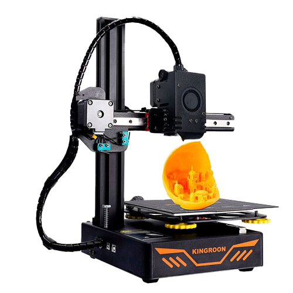
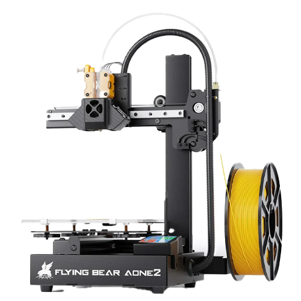
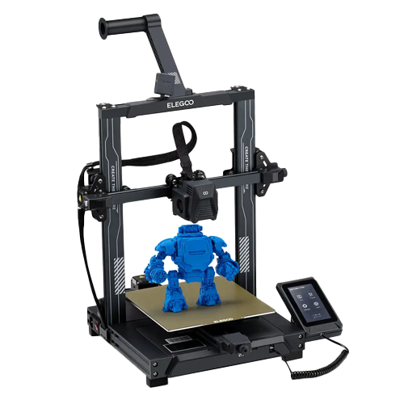
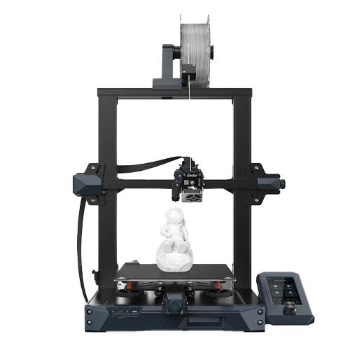
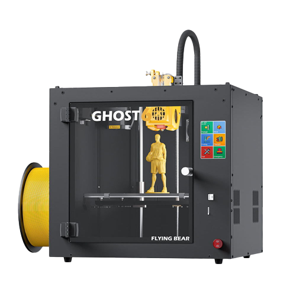
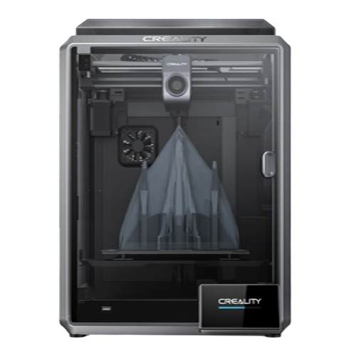
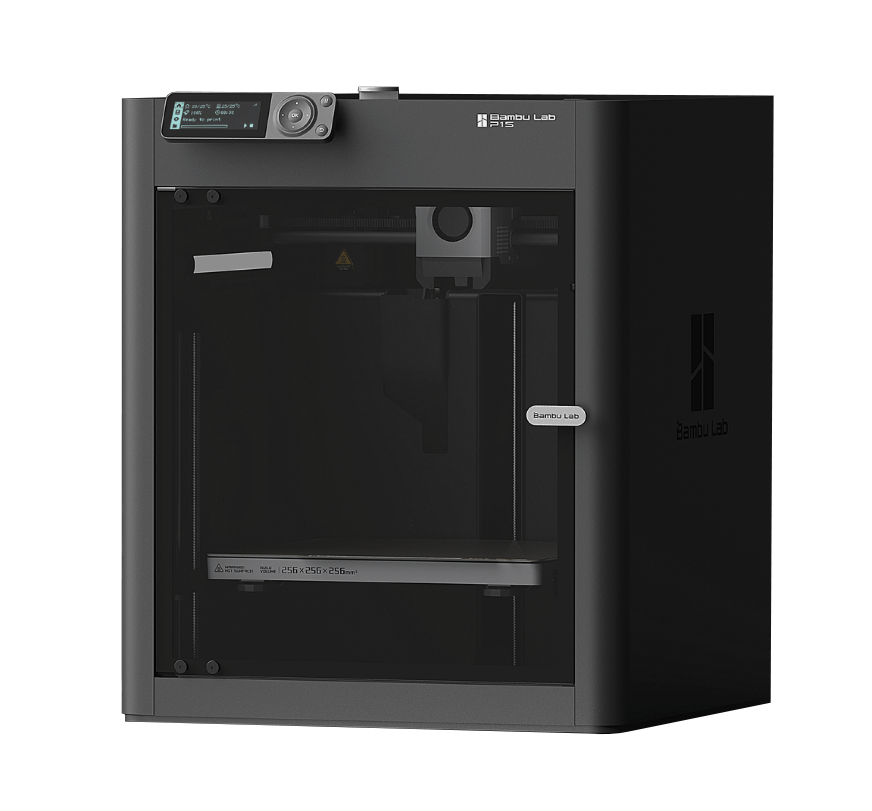
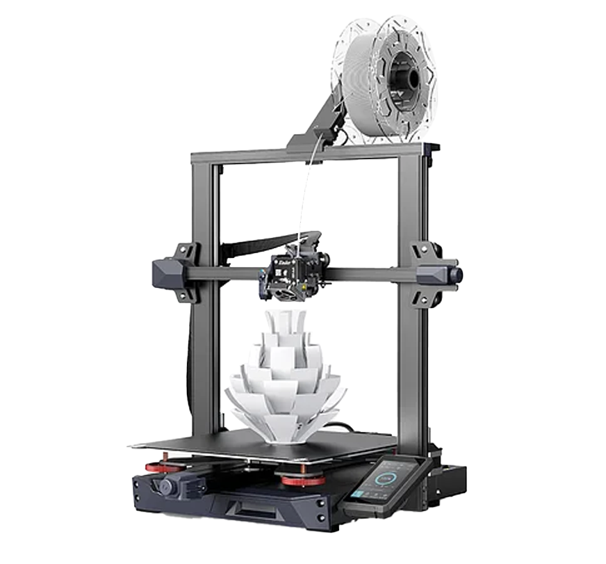
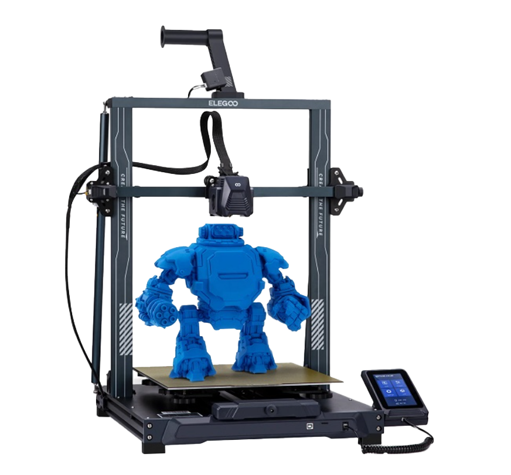

# 3D рекомендатор: принтеры

В этом разделе представлены ссылки на актуальные для покупки 3D принтеры в зависимости от бюджета и назначения. Рекомендуются только те принтеры, которые я тестировал, а также крайне близикие к ним конструктивно, например, увеличенные версии, если в них нет серьезных конструктивных изменений по сравнению с базовой.

- [:simple-telegram: Задать вопрос по поводу выбора комплектующих](https://t.me/K_3_D/1944033)
- [:simple-telegram: Сообщить об ошибке в telegram](https://t.me/K_3_D/1944075) - обязательно тегайте @dmitry_sorkin в сообщении, чтобы мне пришло уведомление
- [:octicons-mail-16: Сообщить об ошибке по e-mail](mailto:dbsorkin@gmail.com) - ⚠️ Только для сообщений об ошибках. На вопросы по e-mail не отвечаю

## Универсальный принтер до 200$

{ align="left" width="275" }

| Наименование   |                                 KINGROON KP3S                                  |                     KINGROON KP3S Pro                     |
| :------------- | :----------------------------------------------------------------------------: | :-------------------------------------------------------: |
| Стоимость      |                                    130-150$                                    |                         150-180$                          |
| Область печати |                                   180х180мм                                    |                         200х200мм                         |
| Обзор          | [:material-youtube: YouTube](https://youtu.be/19mHB4haXQI?si=y7Bi4MaD61pW5LbO) |                             -                             |
| Купить         |           [:material-shopping: AliExpress](https://alli.pub/6t8275)            | [:material-shopping: AliExpress](https://alli.pub/6t827j) |

 

Сразу две модели т.к. это, фактически, просто разные версии одного принтера. Главное достоинство - все основные агрегаты уже в стоке сделаны адекватно как для принтера с настолько низкой ценой, то есть это не заготовки под апгрейд, а уже, хоть и простенькие, но полноценные принтеры. Директ экструдер нормально печатает твёрдыми филаментами, и может печатать средне-мягкими эластомерами после небольшой доработки. Механика не жесткая, из-за чего оба принтера в стоке не быстрые, но и не совсем медленные. Электроника без интересных фишек, но и всё нужное есть - тихие драйверы, не проблемный микроконтроллер и не блокирующий функциональность прошивки экран.

В общем, простенькие агрегаты за мало денег. Сойдут чтобы попробовать печатать, решать простенькие задачи или как принтер-компаньон основного. Под апгрейды подходит слабо т.к. чтобы выжать из него что-то достойное, надо вложить столько денег, что дешевле будет взять сразу что-то с бóльшим потенциалом под апгрейд.

Основные отличия принтеров: у KP3S область печати немного меньше + блок питания внешний. Остальные отличия малозначительны.

[:material-file-document: Подробнее + про апгрейды](../printers/kp3s.md){ .md-button }

---

**Альтернативные варианты**

{ width="150" align="left" }

[Flying Bear Aone 2](https://alli.pub/6t83sw?erid=Kra23tUAn). По сравнению с KP3S Pro чуть дороже, чуть меньше область печати и значительно менее распространен, т.е. под него меньше инструкций, готовых модификаций и т.д. В остальном сопоставимы. Брать если почему-то вас обуяла лютая ненависть к компании KINGROON.   

## Универсальный принтер до 300$

{ align="left" width="275" }

| Наименование   |                              ELEGOO Neptune 3 Pro                              |
| :------------- | :----------------------------------------------------------------------------: |
| Стоимость      |                                    235-260$                                    |
| Область печати |                                 235х235мм[^2]                                  |
| Обзор          | [:material-youtube: YouTube](https://youtu.be/lpzA1QHWDTI?si=gm3FKnXyFaugx_Hh) |
| Купить         |           [:material-shopping: AliExpress](https://alli.pub/6t83yq)            |

 

Механически очень близок к Ender-3, поэтому имеет те же особенности: очень живучий и ремонтопригодный, очень тихий и хорошо поддаётся апгрейдам. В стоке не очень быстрый, но переводом на прошивку Klipper делается в 1.5-2 раза быстрее. Плюс есть возможность еще усилить приводы и сделать принтер еще быстрее.

Экструдер в полном стоке имеет низкокачественные подающие колёса, горло и сопло. Но эти детали дешевые и, фактически, являются расходниками. После их замены печатает всеми материалами, включая мягкие эластомеры, композиты и т.д. Обдув при этом на уровне конкурентов, то есть хватает на сток, но при апгрейде придётся менять.

Электроника нормальная. Экран и микроконтроллер не вызывают проблем, на голове есть переходная плата, благодаря которой немного проще обслуживать и ремонтировать экструдер. Драйверы тихие, в прошивке сразу включен Linear Advance и всё вполне адекватно настроено. То есть, в отличие от конкурентов, перепрошивать принтер не надо.

[:material-file-document: Подробнее + про апгрейды](../printers/neptune3pro.md){ .md-button }

---

**Альтернативные варианты**

{ width="150" align="left" } **Ender-3 S1** | :material-youtube: Обзор[^3] | [:material-shopping: Купить](https://alli.pub/6t9on8) | Очень похож на Neptune 3 Pro и по механике, и по экструдеру, и по электронике. Основные отличия: стол имеет регулировку; датчик автоуровня не индуктивный, а CRTouch; стоковая прошивка фуфло, надо сразу перепрошивать. В общем, возможности те же 1в1, усилий для приведения в хорошее рабочее состояние столько же, а стоит немного дороже. Брать если со скидкой будет дешевле нептуна или если нептуна не будет в наличии.  

{ width="150" align="left" } **Flying Bear Ghost 6** | [:material-youtube: Обзор](https://youtu.be/hOqHLGjwfpA?si=t56VTOTrZIYOTaKA) | [:material-shopping: Купить](https://alli.pub/6t9on8) | По скорости такой же что на прошивке Marlin, что на Klipper'е (тесты см. в обзоре). Экструдер хуже т.к. плохо справляется с эластомерами, особенно мягкими. Электроника сопоставимая по возможностям, но надо прошивать чтобы получить все нужные функции. Зато есть закрытая камера, которая позволит проще печатать материалами с высокой усадкой и\или с плохой спекаемостью (ABS, ASA, PC и подобное). Брать имеет смысл только если планируете в основном печатать этими материалами.

## Универсальный принтер до 600$

{ width="275" align="left" }

| Наименование   |                                                     Creality K1                                                     |
| :------------- | :-----------------------------------------------------------------------------------------------------------------: |
| Стоимость      |                                                      490-550$                                                       |
| Область печати |                                                      229х226мм                                                      |
| Обзор          |                   [:material-youtube: YouTube](https://youtu.be/Qdcv0IBwyc4?si=XZu0C80Z941kz-0p)                    |
| Купить         | [:material-shopping: AliExpress](https://alli.pub/6ta8cy) [:material-shopping: AliExpress](https://alli.pub/6ta8ew) |

 

Один из самых быстрых серийных принтеров. При этом полностью закрытая камера и относительно небольшие габариты. Экструдер способен стабильно печатать средне-мягкими эластомерами, плюс производительный хотэнд и мощное охлаждение. Электроника хорошая, есть все влияющие на характеристики принтера алгоритмы + удобный веб-интерфейс. В общем, принтер по соотношению цена\характеристики очень хорош...

Но всё описанное ранее становится правдой только если приложить к принтеру руки. В полном стоке у него может быть криво собрана механика или не протянуты соединения, из-за чего неправильно настроится Input Shaping[^4] и принтер может не быть таким быстрым. Система охлаждения сделана из не термостойкого материала и оплывает при печати с температурой стола выше 100°C. Низкокачественные шкивы вызывают рябь[^5]. Прошивка закрыта и криво сконфигурирована. В общем, в стоке принтер не очень и пользоваться им неприятно.

Почему я тогда его советую? Потому что все его дефекты исправляются за 1-2 вечера несложной работы + ~800 рублей. И, самое главное, исправлять эти дефекты в целом имеет смысл так как после этого характеристики становятся реально крутые, на уровне продвинутых самосборов с бюджетом в 2-3 раза выше. Иными словами, эта модель принтера - вариант для рукастых людей, желающих получить максимальные характеристики за относительно небольшие деньги.

[:material-file-document: Подробнее + про исправление косяков](../printers/k1.md){ .md-button }

---

**Альтернативные варианты**

{ width="175" align="left" } **Bambu Lab P1S** | Этот принтер очень близок с К1 по общим конструктивным решениям т.к. К1 "слизан" с предка этой модели. Печатает так же быстро и хорошо, как доведенный до ума К1, но при этом качественный и полностью готов "из коробки".  Минус - в РФ его и запчасти к нему возят только перекупы. Из этого вытекает и цена в 1.5 раза выше, чем на К1, и высокая цена на запчасти.

 

## Крупногабаритный принтер до 450$

{ width="275" align="left" }

| Наименование   |                                                   Ender-3 S1 Plus                                                   |
| :------------- | :-----------------------------------------------------------------------------------------------------------------: |
| Стоимость      |                                                        420$                                                         |
| Область печати |                                                      300х300мм                                                      |
| Обзор          |                                                        -[^6]                                                        |
| Купить         | [:material-shopping: AliExpress](https://alli.pub/6talkd) [:material-shopping: AliExpress](https://alli.pub/6tallx) |

Фактически, это просто Ender-3 S1 с увеличенным до 300х300мм столом. Несмотря на заметно выросший, и, соответственно, потяжелевший стол, в стоке принтер печатает с практически такими же ускорениями (около 1000мм/с²). Экструдер Sprite способен печатать всеми видами филамента, включая мягкие эластомеры. В стоке стоит биметаллическое горло. Материнская плата простая, но всё нужное есть - тихие драйверы, МК нормальный, есть готовые сборки Marlin и конфигурации Klipper. Обдув в стоке слабоват, но есть [проект мощного обдува на 2х5015](../esp/guide_s1.md).

Минус - у некоторого процента принтеров подающие шестерни изготовлены с эксцентриситетом. Из-за этого возникает дефект в виде полос на моделях. Но процент таких принтеров, судя по всему, не велик + шестерни в продаже есть + готовятся к выходу кастомные шестерни, производимые точно без эксцентриситета.

---

**Альтернативные варианты**

{ width="150" align="left" } **Neptune 3 Plus** | [:material-shopping: Купить](https://alli.pub/6taky7) | Увеличенная до 320х320 версия Neptune 3 Pro. По сравнению с ним имеет регулировку стола, в остальном все плюсы и минусы аналогичны. По сравнению с E3S1 чуть больше (320х320 против 300х300), стоит столько же, объём и сложность необходимых доработок сопоставимы. Лично я между этими двумя взял бы эндер т.к. он более распространен, но и нептун не будет плохим выбором.   

[^1]: Если снять ограничение в прошивке. В большинстве кастомных прошивок этих ограничений изначально нет.
[^2]: Производитель указывает 225х225мм, но физический размер стола 235х235, и его можно использовать целиком, если разблокировать в прошивке.
[^3]: К сожалению, у меня нет полноценного актуального обзора на этот принтер. Изначально он [вышел с критическим дефектом](https://youtu.be/HSClmZ8IYjg?t=9), из-за которого имел ужасные характеристики, и в [обзоре](https://youtu.be/mGZxazupZqU?si=gqbrmmN_V-yfukiA) я не рекомендовал его к покупке. Потом дефект исправили, из-за чего я [пересмотрел выводы из обзора](https://youtu.be/HSClmZ8IYjg?t=991). Чтобы составить полноценное впечатление о принтере, рекомендуется посмотреть оба видео.
[^4]: Input Shaping - программный алгоритм, который модифицирует траекторию прохождения углов так, чтобы в механике создавалось несколько вибраций в противофазе друг другу, и они частично или полностью гасились. Убирает или уменьшает эхо, за счёт чего можно заметно увеличить ускорения без потери качества печати.
[^5]: Рябь - дефект, выглядящий как повторяющиеся с шагом 2мм вертикальные полосы на модели. Обычно не убирается никак, просто находится диапазон скоростей, в котором амплитуда ряби меньше. Но на некоторых принтерах есть рабочие рецепты борьбы с этим дефектом.
[^6]: Принтер является просто увеличенной версией Ender-3S1, поэтому не имело смысла делать отдельный обзор. Экструдер и электроника такие же, отличие только в длине профилей рамы, размере стола и биметаллическом термобарьере в стоке.

*[LA]: Linear Advance - алгоритм, синхронизирующий экструзию филамента с перемещениями печатающей головы. Убирает множество дефектов печати. В некоторых прошивках может называться по-другому, например, Pressure Advance (PA) или Pressure Control.
*[МОР]: Максимальный Объёмный Расход хотэнда, то есть какой объём материала хотэнд способен эффективно прогреть за единицу времени. Считается как [скорость перемещения печатающей головки] x [высота слоя] x [ширина линии]
