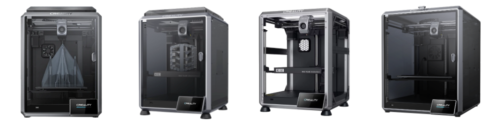
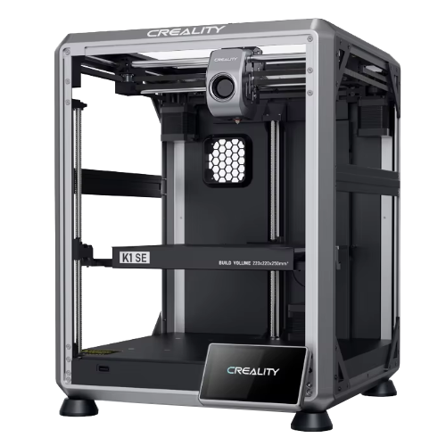
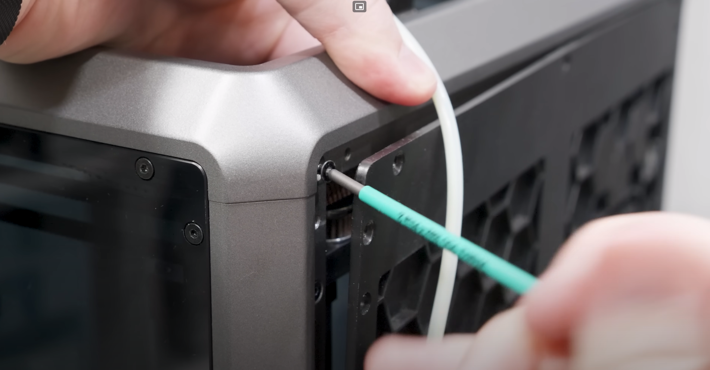
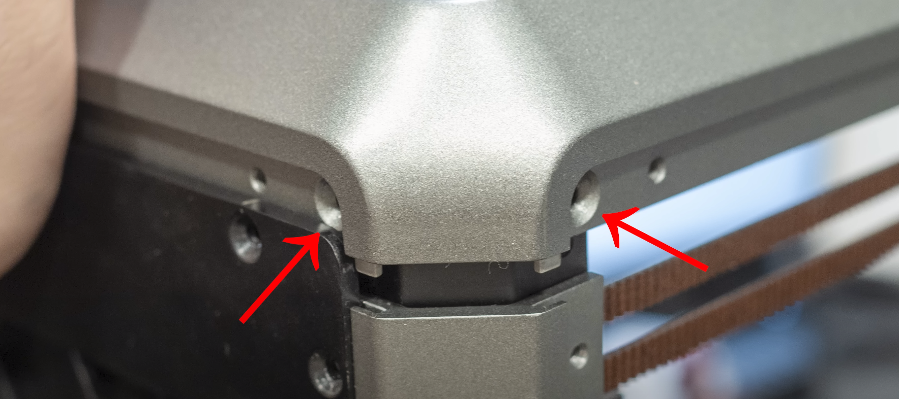
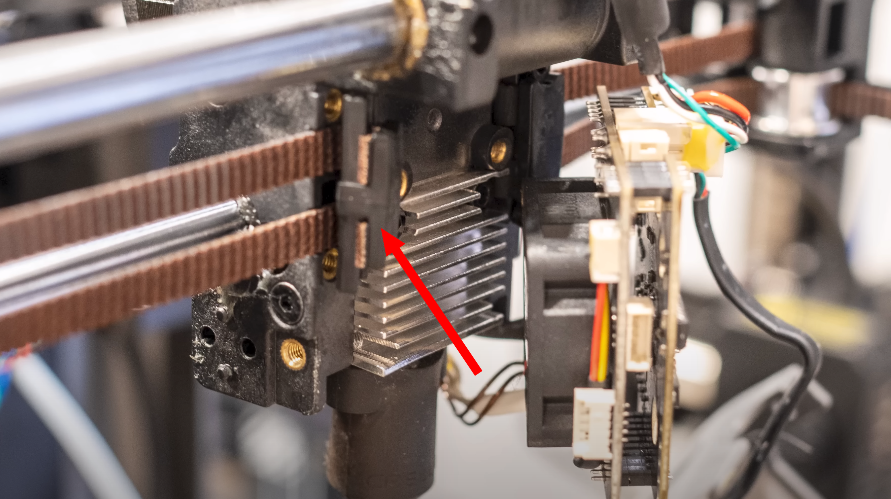
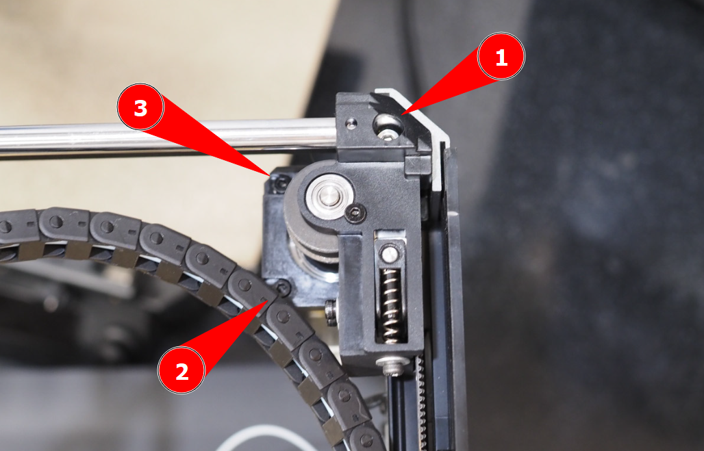

# Серия принтеров Creality K1

## Отличие версий K1 / K1C / K1SE / K1 Max

**K1** - изначально выпущенная версия принтера. Эта версия сильно рябит, из-за чего сразу после покупки необходимо заменить шкивы на моторах осей XY. Также не обладает веб-камерой и чистилкой для сопла.

**K1C** - доработанная версия принтера. Сразу стоят нормальные шкивы, что решает проблему слишком сильной ряби. Также добавлена веб-камера и чистилка для сопла. Хотэнд изменён под интегрированные сопла unicorn. Остальное идентично K1.

**K1SE** - удешевлённая версия K1C. Убраны зашивка, веб-камера, задний и боковой вентиляторы. В остальном идентична K1C.

**K1 Max** - версия с увеличенным до 300x300 столом. Ранние ревизии базировались на K1 и имели все его недостатки, в том числе сильную рябь. Поздние ревизии, которые продаются сейчас, базируются уже на K1C. Для того, чтобы отличить их друг от друга, стоит смотреть на то, большие или маленькие шкивы установлены на моторы осей XY. Также эта версия комплектуется лидаром для автоматической калибровки Pressure Advance, но ручная калибровка всё равно заметно точнее.

## Доработки современных версий

{ width="300" align=left }

В современных версиях (K1C, K1SE, K1 Max) есть 2 проблемы. Первая связана с механикой осей XY. Из-за большого усилия на страгивание печатающей головы, калибровка Input Shaping'а может проходить неверно и будут рекомендоваться очень плохие шейперы. Эта проблема плавающая. Её может вообще не быть, тогда делать, очевидно, ничего не надо. Если же вы всё-таки столкнётесь с этой проблемой, то решается она без доработок. В первую очередь стоит попробовать смазать направляющие осей XY жидкой смазкой. Если это не поможет, то должна помочь обновлённая версия автоматической калибровки Input Shaping'а, которая есть в свежих версиях Klipper'а. Для доступа к ней надо будет просто поставить кастомную прошивку и обновить Klipper, как сказано в инструкции [здесь](https://github.com/Tombraider2006/K1/blob/main/version_config/readme.md){ target="_blank" }.

Вторая проблема - стоковая прошивка. Принтер на ней работать, конечно же, будет, но функциональность будет заметно урезана + версия Klipper'а будет старая. Поэтому рекомендуется сразу после получения принтера получить root доступ и обновить версию Klipper'а, как сказано в статье выше.

## Доработки устаревших версий

У старых версий принтеров (K1, K1 Max) был ряд детских болячек. К ним относились плохо подобранные шкивы, из-за которых была очень сильная рябь, плавящаяся от нагрева стола система охлаждения и нефункциональная прошивка, требующая переустановки. Прошивка от современных версий принтеров подходит к старым т.к. электроника не менялась. Решение других проблем описано ниже.

!!! note "На современных версиях принтеров этих проблем уже нет, поэтому их исправление не требуется"

### Замена шкивов и переборка механики

В стоке у принтера стоят очень низкокачественные шкивы большого диаметра. Из-за них возникает рябь - дефект в виде вертикальных полос с шагом 2мм на модели. У некоторых амплитуда ряби послабее и их устраивает качество печати, у некоторых сильнее, но она есть у всех. Учитывая стоимость нормальных шкивов менее 10$, не имеет смысла оставлять штатные.

Также на некотором проценте принтеров механика может быть плохо собрана с завода. Например, не протянутые соединения могут вызывать люфты, из-за которых будет неправильно калиброваться Input Shaping[^1] и на деталях будет эхо[^2]. При замене шкивов придётся довольно много всего разобрать. Просто собирая всё обратно выравнивая всё кривое и протягивая всё не протянутое можно решить и эту проблему.

Порядок действий:

а. Купить 2 шкива 20 зубов под 6-10мм ремень с отверстием 5мм: [:material-shopping:](https://alli.pub/6u3lv1?erid=2SDnjeAACsA) и съёмник для подшипников: [:material-shopping:](https://www.vseinstrumenti.ru/product/peredvizhnoj-2-h-lapyj-semnik-s-fiksatorom-avtodelo-75-mm-f19-35-mm-41875-11632-1167274/) ;

б. Отсоединить разъёмы бокового вентилятора и камеры, после чего снять боковые панели;

в. Снять переднюю дверцу и аккуратно отклеить декоративные накладки справа и слева под ней;

г. Отогнуть заднюю панель и открутить винты сверху в углах под ней (1);
{ .annotate }

1. 

д. Открутить винты во всех других углах сверху. После этого портал должен легко сняться (1);
{ .annotate }

1. 

е. Максимально ослабить натяжители ремней в задней части принтера;

ж. Снять систему охлаждения с печатающей головы;

з. Открутить и отодвинуть в сторону переходные платы с вентилятором;

и.  Открутить крепления ремней от печатающей головы (1);
{ .annotate }

1. 

к. Открутить винты крепления моторов (по 3 винта на мотор) и снять их вниз (1);
{ .annotate }

1. 

л. Сделать фото на какой высоте находился шкив на каком моторе, после чего снять шкивы с помощью съёмника;

м. Надеть новые шкивы чтобы центр зубчатой части плюс-минус совпадал с центром зубчатой части стоковых шкивов. Крепежные винты сильно не затягивать на этом этапе;

н. Установить моторы обратно. Если шкив упирается в подшипник, то сместить его так, чтобы не упирался. Зазор можно выставить банковской карточкой или чем-нибудь подобным;

о. Закрепить ремни к печатающей голове и, не натягивая их сильно, проверить, что они нормально встают на шкив. Не обязательно, чтобы ремень ходил прямо по центру шкива, главное чтобы не упирался в бортик сильно;

п. Собрать всё в обратном порядке протягивая соединения и выравнивая всё криво стоящее. При протяжке соединений обратите внимание, что многие винты закручиваются в пластик, и прям сильно их тянуть нельзя. Если сорвёте резьбу, то придётся снимать пластиковую деталь и вплавлять туда резьбовую втулку;

р. Еще раз всё проверить, затянуть винты шкивов и натянуть ремни. После этого еще раз всё проверить :)

с. В прошивке изменить разрешение осей XY (RD=40мм) + [откалибровать чувствительность sensorless homing](https://www.klipper3d.org/TMC_Drivers.html#tuning) + откалибровать Input Shaping заново. Pressure Advance, шаги экструдера и т.д. калибровать не надо.

### Замена системы охлаждения

В стоке система охлаждения изготовлена из не термостойкого материала, ввиду чего нельзя печатать инженерными материалами, требующими более разогрева стола до более чем 100°C. Чтобы исправить это, надо [перепечатать систему охлаждения](https://www.printables.com/model/558128-creality-k1-k3d-cooling-system) из термостойкого материала. Подойдут `ABS`, `ASA`, `PC`, `PP`, а также композиты на их основе и большинство фотополимерных смол.

[^1]: Input Shaping - программный алгоритм, который модифицирует траекторию прохождения углов так, чтобы в механике создавалось несколько вибраций в противофазе друг другу, и они частично или полностью гасились. Убирает или уменьшает эхо, за счёт чего можно заметно увеличить ускорения без потери качества печати.
[^2]: Эхо - дефект в виде затухающих колебаний после прохождения поворота.
[^3]: Рябь - дефект, выглядящий как повторяющиеся с шагом 2мм вертикальные полосы на модели. Обычно не убирается никак, просто находится диапазон скоростей, в котором амплитуда ряби меньше. Но на некоторых принтерах есть рабочие рецепты борьбы с этим дефектом.

---

`Реклама: ООО "АЛИБАБА.КОМ (РУ)" ИНН 7703380158`

Нет человека или юр.лица, которые заказали бы создание этой страницы или рекламу товаров, приводимых на этой странице. Я создал все статьи в рекомендаторе сам, по своему желанию и в целях сообщества. Тем не менее, по законодательству РФ, любая ссылка на товар является рекламой. Поэтому я вынужден делать эту приписку, чтобы не получить штраф.

---