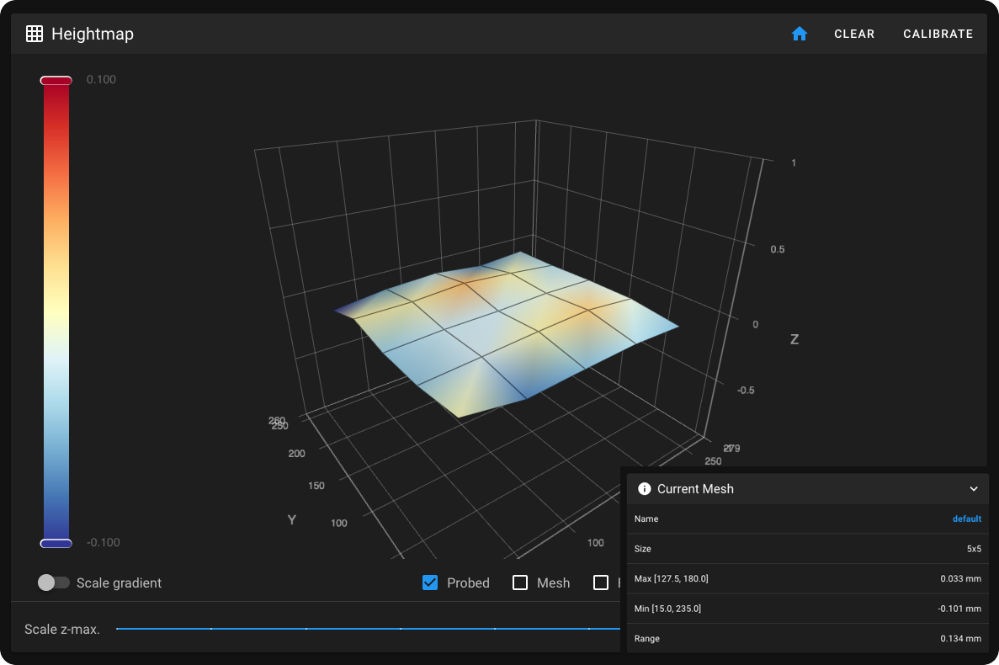
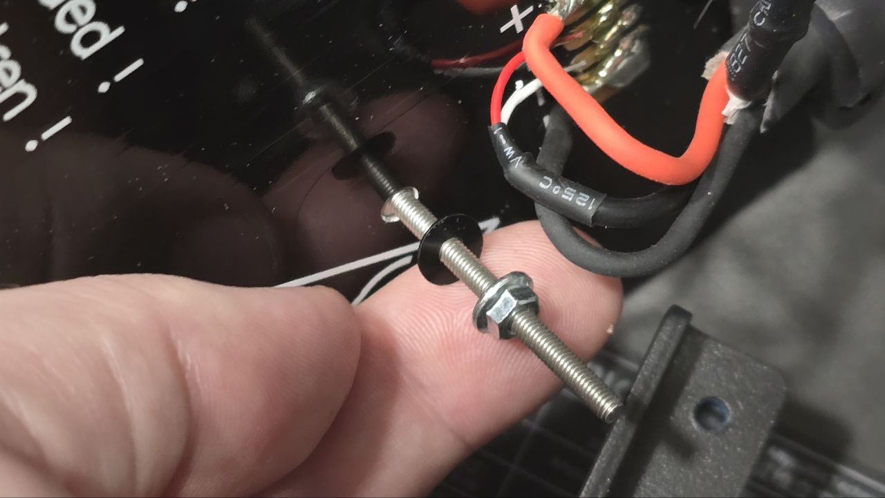
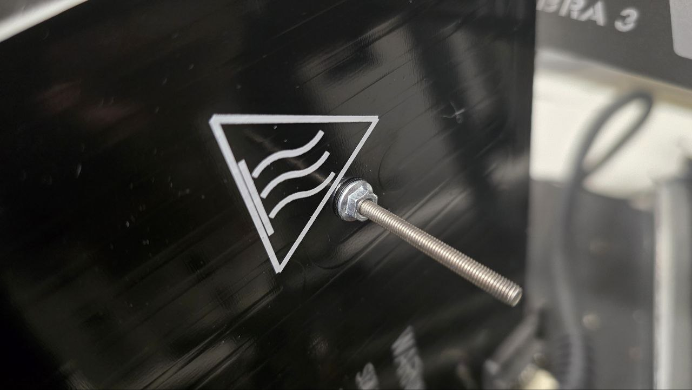

# Anycubic Kobra 3

## ВНИМАНИЕ!

!!! warning "К сожалению, хоть на момент выхода обзора на канале, принтер был неплох за свои деньги, на текущий момент кастомные прошивки для этого принтера могут приводить к окирпичиванию электроники. Поэтому я рекомендую не покупать этот принтер. А, если уже купили, то, либо пользоваться им как есть, либо, по крайней мере, уточнить в сообществах по этому принтеру текущее состояние прошивок"

## Обзор

=== "YouTube"

    <iframe width="900" height="506" src="https://www.youtube.com/embed/4Lj4GrW2LTA?si=6IMEVALVJuvU2jLH" title="YouTube video player" frameborder="0" allow="accelerometer; autoplay; clipboard-write; encrypted-media; gyroscope; picture-in-picture; web-share" allowfullscreen></iframe>

=== "VK"

    <iframe src="https://vk.com/video_ext.php?oid=-168896673&id=456239645&hd=2" width="853" height="480" allow="autoplay; encrypted-media; fullscreen; picture-in-picture; screen-wake-lock;" frameborder="0" allowfullscreen></iframe>

## Регулировка уровня стола

В стоке у Kobra 3 нет регулировки положения стола. Для печати художественных моделей это не критично, но при печати крупных технических приведёт к их искажению. Чтобы избежать этого стол надо выставить в горизонт. Это можно сделать двумя методами. Первый - с помощью подкладывания регулировочных шайб под стойки стола. Это неудобно, но делается единожды, а также не ухудшает характеристики принтера. Второй способ - перевести кобру на пружины. Это позволит удобно и быстро регулировать стол, но может привести к ухудшению характеристик.

### Метод с регулировочными шайбами

!!! success "Рекомендуемая модификация"
!!! note "Необходима кастомная прошивка"

Для этого необходимо приобрести:

| Наименование | Ссылка | Комментарий |
|:------------ |:------:|:----------- |
| Регулировочная шайба 4x8x0.1 - 10шт | [krepcom](https://krepcom.ru/catalog/shayby/shayba_regulirovochnaya_4kh8kh0_1_mm_din_988.htm){ .target="_blank" } | Рекомендуется взять сразу 2-3 комплекта по 10шт. |
| Регулировочная шайба 4x8x0.2 - 10шт | [krepcom](https://krepcom.ru/catalog/shayby/shayba_regulirovochnaya_4kh8kh0_2_mm_din_988.htm){ .target="_blank" } | Чтобы удобнее набирать большую толщину. Можно не покупать и купить больше шайб 0.1 |

Если возможности купить шайбы нет, то можно вырезать их из алюминиевой банки или использоваться альтернативный способ регулировки, описанный ниже.

Последовательность действий при регулировке стола при помощи шайб:

1. Автопарковка (`G28`);
2. Прогрейте стол до температуры, на которой чаще всего печатаете. Если не знаете, то до 90 градусов (`M140 S90`);
3. Перейдите во вкладку Heightmap и снимите карту высот;
4. Обновите страницу чтобы обновилась карта высот;
5. Посмотрите как завален стол и прикиньте какие углы надо поднимать и насколько сильно;
6. Снимите адгезивный лист;
7. Открутите винты вблизи тех углов стола, которые необходимо поднимать;
8. Засуньте необходимое количество регулировочных шайб под соответствующие стойки и заркутите винты обратно;
9. Повторяйте шаги 3-8 пока максимальный перепад высоты не станет минимально возможным или просто устраивающим вас.

### Перевод стола на пружины

!!! question "Эта модификация является опциональной"
!!! warning "Эта модификация может ухудшить характеристики принтера"

Для перехода на пружины необходимо:

| Наименование | Кол-во | Ссылка | Комментарий |
|:------------ |:------:|:------:|:----------- |
| Винт М3х40 | 4 |[krepcom](https://krepcom.ru/catalog/vinty-razdel/bolt_vint_s_vnutrennim_shestigrannikom_i_tsilindricheskoy_golovkoy_din_912_3x40_nerzhaveyka_a4.htm){ .target="_blank" } | Подойдут винты с полукруглой, цилиндрической и потайной головкой |
| Шайба пластиковая М3 | 4 | [krepcom](https://krepcom.ru/catalog/shayby/shayba-uvelichennaya-m3-din-9021-plastikovaya.htm){ .target="_blank" } | Можно заменить на металлические шайбы, если проклеить одну их сторону скотчем или изолентой, чтобы шайба случайно не замкнула дорожки на нагревателе стола |
| Гайки М3 | 8 | [krepcom](https://krepcom.ru/catalog/gayki-razdel/gayka_m_3_sh_gr___nerjav__a2_1.htm){ .target="_blank" } | |
| Пружины  | 4 | [AliExpress](https://alli.pub/72rxjb?erid=2SDnjeLGh8f){ .target="_blank" } | Пружины не обязательно ставить именно такие. Главное, чтобы они были достаточно жёсткими и хода регулировки хватало |

Опционально надо будет распечатать барашки, чтобы удобнее было крутить регулировки. Например, подойдут [барашки от VOSTOK'а](./models/vostok_bed_knob.stl){ .download="vostok_bed_knob.stl" }.

Последовательность действий:

а. Снимите адгезивный лист

б. Открутите все винты, крепящие стол к раме и снимите стол

в. Установите в стол винты М3х40 и зафиксируйте их с другой стороны гайками М3 через пластиковые шайбы (1) (2).
{ .annotate }

1. 
2. 

г. Наденьте на винты пружины

д. Установите стол на раму

е. Зафиксируйте гайками или барашками.

После перевода стола на пружины необходимо заново сделать калибровку Input Shaping'а, а также отрегулировать стол обычным образом. У меня получилось падение ускорений с 6000 до 4500. Зато перепад высот составил всего 0.134 и потрачено на это было менее 1 часа времени.

## Расходники для Kobra 3

В принтере нет каких-либо деталей, требующих замены сразу после покупки. Тем не менее, рано или поздно всё износится + может захотеться купить сопла другого вида или диаметра. Так что для удобства, я собрал здесь самые часто необходимые детали:

| Наименование | Ссылка | Комментарий |
|:------------ |:------:|:----------- |
| Сопло латунное | [:material-shopping:](https://alli.pub/72ry62?erid=2SDnjdvaEYs){ .target="_blank" } | Подходит для любых материалов кроме композитов, флуо- и люминесцентных |
| Сопло стальное закалённое | [:material-shopping:](https://alli.pub/72ry6n?erid=2SDnjeEN5w1){ .target="_blank" } | Для печати композитными, фосфоресцентными материалами |
| Стальные и латунные сопла Trianglelab | [:material-shopping:](https://alli.pub/72s3d4?erid=2SDnjcoUAkB){ .target="_blank" } | Качество выше, чем у оригинальных, но и цена тоже |
| Оригинальный хотенд в сборе | [:material-shopping:](https://alli.pub/72ry6u?erid=2SDnjeThyU7){ .target="_blank" } | Выбирать Standard hotend. На случай поломки, покупать прозапас смысла мало |
| Подающий механизм | [:material-shopping:](https://alli.pub/72ry7m?erid=2SDnjenyp8b){ .target="_blank" } | Для замены в случае износа подающих шестернй или других неисправностей |

---

`Реклама: ООО "АЛИБАБА.КОМ (РУ)" ИНН 7703380158`

Эта страница создана по собственной инициативе. Автор не сотрудничает ни с какими производителями. Маркировка рекламы - требование законодательства.

---