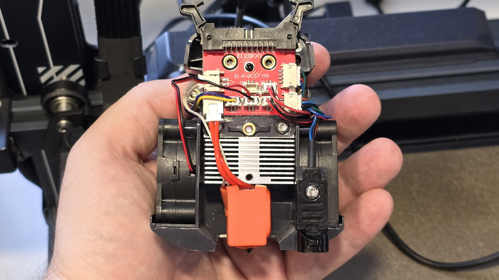
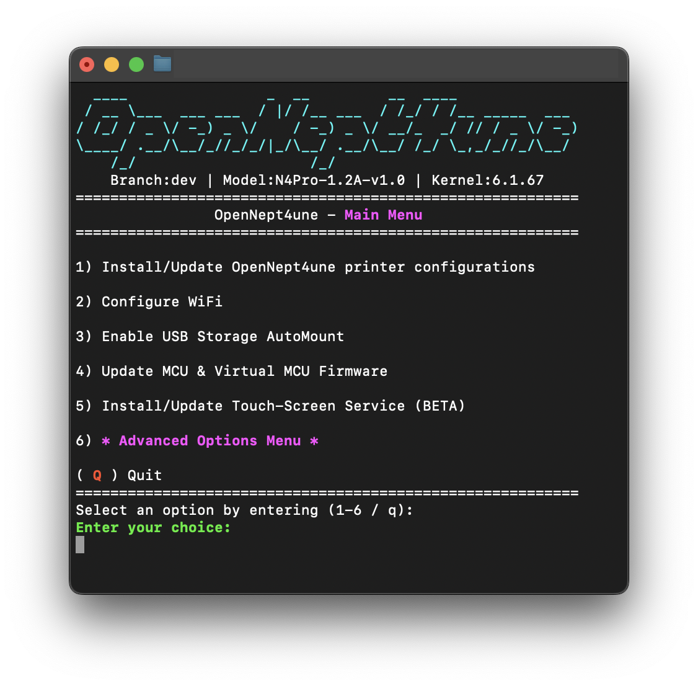

# Elegoo Neptune 4

## Обзор

=== "YouTube"

    <iframe width="900" height="506" src="https://www.youtube.com/embed/HnLohH1MFz0?si=e67PyFd5nP33c5N1" title="YouTube video player" frameborder="0" allow="accelerometer; autoplay; clipboard-write; encrypted-media; gyroscope; picture-in-picture; web-share" referrerpolicy="strict-origin-when-cross-origin" allowfullscreen></iframe>

=== "VK"

    <iframe src="https://vk.com/video_ext.php?oid=-168896673&id=456239570&hd=2" width="853" height="480" allow="autoplay; encrypted-media; fullscreen; picture-in-picture; screen-wake-lock;" frameborder="0" allowfullscreen></iframe>

Экструдер печатает всеми материалами, включая самые мягкие эластомеры, композиты и т.д. При этом в стоке уже стоят калёные шестерни и биметаллический термобарьер. Хотэнд производительнее обычных cr-10/V6, но менее производительный, чем Volcano. Тем не менее, Volcano ставится как родной. Обдув на 2х4015 по производительности сопоставим с охлаждением Bambu Lab P1S/Creality K1.

Электроника не кастрирована в плане SoC, ОЗУ и портов + стоит полноценный дистрибутив Linux, с "чистым" Klipper, функциональным веб-интерфейсом и т.д. Единственный минус - в стоке подключение к сети только проводом. Но это решается покупкой и установкой Wi-Fi адаптера.

Механика спорная. Конструкция взята у Ender-3, где отличается простотой, тишиной и настраиваемостью, ввиду чего получается принтер, который сложно сломать и легко починить. Но у Elegoo наличествует косяк, из-за которого иногда механику настроить сложнее, чем должно быть. Подробнее описано в видео про это [:material-youtube: на YouTube](https://youtu.be/19Ylp_yEUPY){ target=_blank } / [:simple-vk: в Vk](https://vk.com/video-168896673_456239565){ target=_blank }. Из-за этого я рекомендую принтер только опытным пользователям, которым описанная проблема покажется мелочью.

Перед покупкой принтера рекомендуется ознакомиться с:

- Видео версией обзора [:simple-youtube: на YouTube](https://youtu.be/HnLohH1MFz0?si=zF5VPuc0XpkL8oRZ){ target=_blank } / [:simple-vk: в Vk](https://vk.com/video-168896673_456239570){ target=_blank }
- Разбор проблемы с колёсами [:simple-youtube: на YouTube](https://youtu.be/19Ylp_yEUPY){ target=_blank } / [:simple-vk: в Vk](https://vk.com/video-168896673_456239565){ target=_blank }

[Купить Neptune 4](https://alli.pub/6xtus8?erid=2SDnjcNDgeM){ target=_blank }

## Доработки

В целом, обязательных для этого принтера доработок нет ввиду отсутствия у него косяков, которые заметно ухудшали бы характеристики или мешали бы эксплуатации принтера. Тем не менее, есть несколько вещей, которые могут улучшить опыт экспулатации принтера при небольшой стоимости. 

### Подключение Wi-Fi

Для того, чтобы появилась возможность подключить 3д принтер к сети через Wi-Fi, необходимо докупить Wi-Fi модем или точку доступа. Модем стоит дешевле и занимает меньше места, но с ним USB порт окажется занят и туда нельзя будет подключить USB-акселерометр. Потребуется докупить хаб. Точка доступа крупнее и дороже, но не занимает USB-порт. К тому же точка доступа может использоватья для подключения нескольких устройств к сети, так что для ферм или в некоторых случаях домашней эксплуатации она может оказаться выгоднее.

Несколько вариантов Wi-Fi модемов, не требующих установки драйверов:

| Тип устройства | Модель | Ссылки | Примечание |
|:--------------:|:------:|:------:|:---------- |
| Wi-Fi адаптер | TP-Link TL-WN725N V2 | [:material-shopping: OZON](https://www.ozon.ru/product/setevoy-adapter-wi-fi-tp-link-tl-wn725n-1256496647/){ target="_blank" } <br> [:material-shopping: DNS](https://www.dns-shop.ru/product/bcf490a4e2818499/wi-fi-adapter-tp-link-tl-wn725n/){ target="_blank" } | 600-900р. Персонально я использую такой. Проверяйте, чтобы версия была именно 2 |
| Wi-Fi адаптер | RTL8192 | [:material-shopping: Ali](https://alli.pub/6z8bdc?erid=2SDnjd15aAv){ target="_blank" } <br> [:material-shopping: DNS](https://www.dns-shop.ru/product/f849646f3c6b3330/wi-fi-adapter-dexp-wfa-301/characteristics/){ target="_blank" } | 300-600р. По информации из интернета, должен работать |
| Маршрутизатор | ZBT WE1626 | [:material-shopping: OZON](https://www.ozon.ru/product/wi-fi-marshrutizator-zbt-we1626-3g-4g-router-300mb-s-811816100/){ target="_blank" } | 1200р; 4 порта |
| Маршрутизатор | ноунейм | [:material-shopping: Ali](https://alli.pub/6z8d9s?erid=2SDnjeHGK5U){ target="_blank" } | ~450р; 1 порт; не знаю, будет ли конкретно этот нормально работать. Добавил в список скорее для примера, что подобные устройства существуют. Берите на свой страх и риск |

Если купите маршрутизатор, то вам надо будет подключить его к своей домашней сети, подключить принтер к маршрутизатору кабелем и всё, принтер должен определяться в сети. 

Если решили использовать Wi-Fi адаптер, то необходимо будет настроить подключение:

1. Подключите принтер к роутеру кабелем;
2. Откройте в Windows - powershell, в Linux или Mac - терминал;
3. Подключитесь к принтеру с помощью команды `ssh mks@xxx.xxx.xxx.xxx`, где `xxx.xxx.xxx.xxx` - IP адрес вашего принтера;
4. Введите пароль `makerbase`;
5. Установите приложение network-manager: `sudo apt install network-manager` и подтвердите паролем `makerbase`;
6. Введите команду `nmtui`;
7. Через псевдографический интерфейс установите подключение к своей Wi-Fi сети;
8. Отключите ethernet кабель. После этого принтер должен будет подключаться к Wi-Fi сети автоматически при перезагрузке.

Найти IP адрес принтера можно найти через экран принтера -> Settings -> About Machine, через веб-интерфейс роутера или с помощью [ZenMap](https://nmap.org/download){ target="_blank" }.

### Установка хотэнда Volcano

{ width=600 }

Стоковый хотэнд Neptune 4 неплох, и, если вам хватает его производительности, то рекомендую его не менять. Но, если вы хотите печатать быстрее или получать более прочные детали из плохо спекающихся материалов, вам может быть полезна установка хотэнда Volcano, благо для неё не надо даже провода обжимать, он встаёт как родной.

Необходимые детали для апгрейда:

| Наименование | Ссылки | Примечание |
|:------------ |:------:|:---------- |
| Термобарьер Chimera биметалл сталь+медь | [:material-shopping:](https://alli.pub/6ttg9h?erid=2SDnjeYW49n "5А"){ target="_blank" } | Выбирать smooth |
| Хитблок E3D Volcano | [:material-shopping:](https://alli.pub/6ttghu?erid=2SDnjdoWkTi "5A"){ target="_blank" } <br>[:material-shopping:](https://alli.pub/6ttgim?erid=2SDnjdvvgsS "Trianglelab"){ target="_blank" } | В большинстве случае обычный алюминиевый будет лучше всего |
| Носок E3D Volcano | [:material-shopping:](https://alli.pub/6ttjnl?erid=2SDnjdj89Rz "5A. Выбирать Volcano Pt100"){ target="_blank" } <br> [:material-shopping:](https://alli.pub/6ttjo6?erid=2SDnjdoa7H2 "Trianglelab"){ target="_blank" } | У 5А выбирать Volcano pt100 |
| Volcano медное с калёной вставкой | [:material-shopping:](https://alli.pub/6wggvq?erid=2SDnjchhhMz){ target="_blank" } | Универсальный тип сопел, хорошо подходящий как для обычных материалов, так и для композитов. В общем случае одного 0.4 хватит для всех задач, но по желанию можете приобрести сопла других типов и диаметров |
| PTFE трубка 2x4 мм | [:material-shopping:](https://alli.pub/6tupqw?erid=2SDnjbukeME "5A. Не брать FEP для использования внутри хотэнда!"){ target="_blank" } <br> [:material-shopping:](https://alli.pub/6w5vlp?erid=2SDnjf3zATJ "Trianglelab"){ target="_blank" } <br> [:material-shopping:](https://alli.pub/6tuprv?erid=2SDnjc4ea3J "Mellow"){ target="_blank" } | Ставится между фидером и горлом. Одного метра хватит с большим запасом |

Термистор и нагревательный элемент просто переносятся в новый хитблок, после чего хотэнд собирается как обычно. При установке хотэнда в радиатор надо будет отмерить и отрезать кусок трубки так, чтобы она стояла в распор между фидером и соплом. 

!!! warning "После установки хотэнда не забудьте протянуть сопло на горячую, а также откалибровать PID, PA и откаты"

Альтернативным вариантом является замена родного хотенда на [версию под Bambu сопла](https://alli.pub/705au5?erid=2SDnjbsxZ7p). Для neptune 4 и 4pro это не имеет большого смысла, так как у данного хотенда нет каких-то значимых преимуществ относительно volcano. Для версий plus и max имеет, так как в них заменить хотенд на volcano значительно труднее.

### Прошивка OpenNept4une

{ width=600 }

У большинства пользвователей стоковая прошивка не будет вызывать никаких проблем в эксплуатации. Но, если столкнётесь с какими-то мешающими лично вам ограничениями, или захотите дополнительных возможностей, то можно установить [пользовательский образ системы](https://github.com/OpenNeptune3D/OpenNept4une). 

Из важных по моему мнению особенностей этого образа:

- Решены проблемы с работой оси Z;
- Более свежая версия системы и ядра, за счёт чего поддерживается больше Wi-Fi адаптеров;
- Более адекватная конфигурация принтера.

Полный список изменений по сравнению со стоковой прошивкой можете прочитать на странице проекта. Если можете жить без какого-либо из этих изменений, то очень рекомендую не перепрошиваться т.к. золотое правило 3д печати - не трогай пока работает.

## Настройка

### Порядок калибровок

После получения принтера необходимо его правильно собрать и настроить. Общий порядок настроек:

1. Регулировка механики. Недостаточно просто скрутить 2 половины принтера, надо еще настроить эксцентрики так, чтобы все колёса касались профилей с одинаковыми усилиями. Общие принципы регулировки механики описаны в старом видео на моём канале [:simple-youtube: в YouTube](https://youtu.be/4H3O8I4-Myo?si=T1z-DjcMPbbN7Rv3){ target="_blank" } / [:simple-vk: в Vk](https://vk.com/video-168896673_456239508){ target="_blank" } или можете поискать аналогичных статьи и видео по интернету;
2. Разрешение экструдера калибруется по желанию т.к. оно в стоковой прошивке не очень далеко от правды;
3. Если меняли хотэнд, то [:material-file-document: PID](../calibrations/pid.md){ target="_blank" };
4. Стол обязательно нужно выставить в горизонт и настроить Z-offset. Подробнее в видео [:simple-youtube: на YouTube](https://youtu.be/doenKnVk0Ec?t=2804){ target="_blank" } / [:simple-vk: в Vk](https://vk.com/video-168896673_456239384?t=46m44s){ target="_blank" };
5. Первоначальная настройка слайсера описана в видео [:simple-youtube: на YouTube](https://youtu.be/doenKnVk0Ec?t=1385){ target="_blank" } / [:simple-vk: в Vk](https://vk.com/video-168896673_456239384?t=23m5s){ target="_blank" } или можете скачать [:material-download: пример профиля для PrusaSlicer](./profiles/k3d_n4_example.ini){ download="k3d_n4_example.ini" }. Обратите внимание, что предоставленный профиль - это не оптимальные настройки для этого принтера, а только пример для облегчения внесения первоначальных настроек в принтер;
6. [:material-file-document: Pressure Advance](../calibrations/la/calibrator.md){ target="_blank" };
7. [:material-file-document: Откаты](../calibrations/retractions/calibrator.md){ target="_blank" };
8. Input Shaping - как откалибровать его на этом принтере описано ниже;
9. Поток. Калибровка описана в видео [:simple-youtube: на YouTube](https://youtu.be/doenKnVk0Ec?t=3708){ target="_blank" } / [:simple-vk: в Vk](https://vk.com/video-168896673_456239384?t=1h1m48s){ target="_blank" }

### Калибровка Input Shaping

К сожалению, у Neptune 4 с завода не установлено акселерометров, которые могли бы помочь откалибровать Input Shaping в полуавтоматическом режиме. Физически возможно установить эти акселерометры самостоятельно, но я не вижу в этом большого смысла т.к. время и сил на установку акселерометра нужно не меньше, чем на калибровку IS вручную. Поэтому я буду описывать только процесс ручной калибровки. Если же вы захотите установить акселерометры, то вам необходимо будет найти инструкцию самостоятельно.

Для калибровки вам понадобится сделать несколько шагов:

1. Зайдите в конфигурационный файл принтера (в веб-интерфейсе конфигурация -> printer.cfg ) и внесите следующие изменения в раздел [printer]:
      1. `max_accel: 8000`;
      2. `max_accel_to_decel: 8000`;
2. Скачайте тестовую модель: [:material-download:k3d_ringing_tower.stl](../models/k3d_ringing_tower.stl){ download="k3d_ringing_tower.stl" };
3. Откройте её в любом слайсере и нарежьте со следующими параметрами:
      1. Материал тёмный, желательно глянцевый. Лучше всего чёрный PETG;
      2. Кол-во слоёв крышки и дна 0;
      3. Заполнение 0%;
      4. Кайма 5мм;
      5. Все скорости печати 200мм/с;
      6. 2 периметра;
      7. На предпросмотре печати включите отображение скоростей и убедитесь, что все периметры действительно печатаются на 200мм/с;
4. Загрузите файл в Klipper, но не запускайте печать;
5. Введите команды:
      1.  
          
          ```
          SET_INPUT_SHAPER SHAPER_TYPE_X=2hump_ei SHAPER_FREQ_X=60 SHAPER_TYPE_Y=2hump_ei
          ```

      2.  
          
          ```
          TUNING_TOWER COMMAND=SET_INPUT_SHAPER PARAMETER=SHAPER_FREQ_Y START=50 STEP_DELTA=2 STEP_HEIGHT=3
          ```

6. Запустите печать. Когда она закончится, осмотрите модель. На нижнем сегменте у вас на ось Y стоит шейпер 2hump_ei на частоте 50гц, дальше частота увеличивается на 2гц за сегмент. Посмотрите на какой максимальной частоте вас устраивает количество эхо на модели. Это и есть искомая частота шейпера для оси Y;
7. Введите команды:
      1. 
        
        ```
        SET_INPUT_SHAPER SHAPER_TYPE_X=mzv SHAPER_TYPE_Y=2hump_ei SHAPER_FREQ_Y=частота_подобранная_ранее
        
        ```
        
      2. 
        
        ```
        TUNING_TOWER COMMAND=SET_INPUT_SHAPER PARAMETER=SHAPER_FREQ_X START=50 STEP_DELTA=5 STEP_HEIGHT=3
        ```

8. Запустите печать. Когда она закончится, осмотрите модель. На нижнем сегменте у вас на оси X стоит шейпер mzv на частоте 50гц, дальше частота увеличивается на 5гц за сегмент. Посмотрите на какой максимальной частоте вас устраивает количество эхо. Это и есть искомая частота шейпера для оси X;
9.  Добавьте в printer.cfg следующую секцию: (или замените имеющуюся):

    ```
    [input_shaper]
    shaper_type_x = mzv
    shaper_freq_x = {значение для оси Х}
    shaper_type_y = 2hump_ei
    shaper_freq_y = {значение для оси Y}
    ```

10. По диаграмме (клик для увеличения) выберите максимальное ускорение печати для шейпера на оси Y. В дальнейшем рекомендуется не превышать эти ускорения при печати периметров. Для заполнения и перемещений можно поставить ускорения в 1.5-2 раза выше;

    { width=500 }

11. Если не хотите, чтобы принтер шумел при печати коротких зигзагов, укажите в printer.cfg `max_accel_to_decel: _половина_от_макс_ускорений_`. 

!!! note "Если у вас не получается откалибровать IS этим методом, например, эхо не уходит ни на каких частотах, то, возможно, вы не до конца правильно отрегулировали механику, что-то люфтит. Если вы уверены, что с механикой всё в порядке, то можете задать вопрос касательно этой калибровки в t.me/K_3_D с тегом @dmitry_sorkin"

`Реклама: ООО "АЛИБАБА.КОМ (РУ)" ИНН 7703380158`[^1]

[^1]: Нет человека или юр.лица, которые заказали бы создание этой страницы или рекламу товаров, приводимых на этой странице. Я создал все статьи сам, по своему желанию и в целях сообщества. Тем не менее, по законодательству РФ, любая ссылка на товар является рекламой. Поэтому я вынужден делать эту приписку, чтобы не получить штраф.