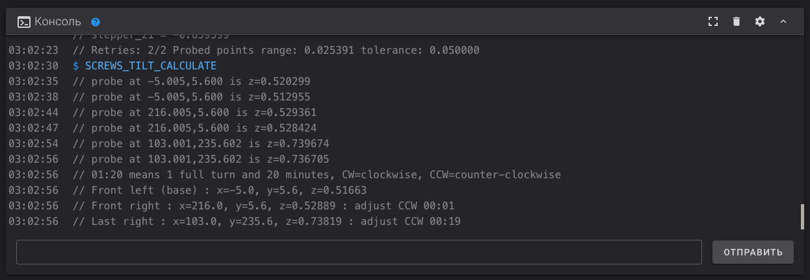

# QIDI Q1 Pro

## Обзор

=== "YouTube"

    <iframe width="853" height="480" src="https://www.youtube.com/embed/EVP7JcmSndU?si=70T0zcucv4BMO7uB" title="YouTube video player" frameborder="0" allow="accelerometer; autoplay; clipboard-write; encrypted-media; gyroscope; picture-in-picture; web-share" referrerpolicy="strict-origin-when-cross-origin" allowfullscreen></iframe>

=== "VK"

    <iframe src="https://vk.com/video_ext.php?oid=-168896673&id=456239634&hd=2" width="853" height="480" allow="autoplay; encrypted-media; fullscreen; picture-in-picture; screen-wake-lock;" frameborder="0" allowfullscreen></iframe>

QIDI Q1 Pro - это один из самых удачных принтеров в своём ценовом сегменте. Дело в том, что у него, конечно, есть минусы, куда же без них. Но большинство из них незначительны - некрасивый внешний вид, увеличенный габарит, долго греющийся стол. Значимый минус же только один, этот принтер довольно плохо справляется с эластомерами, может печатать только средне-мягкими.

Зато у принтера очень удачная механика, которая позволяет печатать на адекватных для этого ценового сегмента скоростях и очень слабо рябит. Экструдер уже в стоке подготовлен под печать композитными материалами, плюс греется аж до 350 градусов в стоке. Вкупе с нормальным обдувом, греющимся до 125 градусов столом и активной термокамерой до 60-65 градусов, это позволяет без каких-либо доработок хорошо печатать всеми твёрдыми материалами от самых простых типа ПЛА и ПЭТГ, до сложных инженерных типа ПА6, ППС и т.д. При этом, благодаря активной термокамере, прочность деталей, напечатанных на этом принтере, будет заметно выше, чем если их же напечатать на принтерах-конкурентах, не обладающих активной термокамерой.

В дополнение к этому у принтера отличная электроника, не кастрированная ни в чём, с относительно чистой и хорошо настроенной прошивкой и очень функциональным мобильным приложением. А также хорошая комплектация - веб-камера, подсветка, датчик запутывания филамента, датчик наличия филамента и т.д.

Как итог, единственный случай, когда этот принтер будет плохим выбором - это если надо много печатать эластомерами. Для печати твёрдыми пластиками же, Q1 Pro является одним из самых способных принтеров в этом ценовом сегменте.

Подробнее смотрите в полной версии обзора выше.

[Купить QIDI Q1 Pro](https://alli.pub/70skp5?erid=2SDnjeS8z1x){ target="_blank" }

## Обязательные

### Исправление проблемы с настройкой стола

Одним из плюсов QIDI Q1 Pro является то, что к нему не требуется докупать никакие детали, даже сопло можно не менять и печатать на стоковом любые материалы. Также принтер не требует каких-то физических доработок, только внесения незначительных изменений в конфигурацию:


После получения принтера подключите его к своей сети Wi-Fi и зайдите к нему в веб-интерфейс. В нём надо зайти на вкладку `Конфигурация` и открыть файл `printer.cfg`.

В этом файле надо будет найти следующий блок:

```
[z_tilt]
z_positions:
    -59,125
    307.5,125
points:
    0,125
    215,125
speed: 150
horizontal_move_z: 5
retries: 2
retry_tolerance: 0.05
```

И заменить его этим:

```
[z_tilt]
z_positions:
    -59,5
    307.5,5
points:
    0,5
    215,5
speed: 150
horizontal_move_z: 5
retries: 2
retry_tolerance: 0.05
```

После этого нажмите `Сохранить и перезагрузить` в верхнем правом углу окна.

### Как настроить стол

Перед началом регулировки стола следует выполнить автопарковку, после чего позволить принтеру выровнять положение передних регулировочных точек самостоятельно с помощью Z_TILT. Для этого в консоль введите последовательно команды:

```
G28
```

```
Z_TILT_ADJUST
```

После этого две передние регулировочные точки должны быть выставлены в горизонт. Осталось только отрегулировать заднюю точку. Для этого выполните команду:

```
SCREWS_TILT_CALCULATE
```



Принтер измерит расстояние до стола в точках над винтами и выдаст в консоль рекомендации по тому, куда вращать регулировочные винты. Эти рекомендации должны выглядеть примерно так, как на скриншоте выше.

Сами рекомендации - последние 3 строчки. Точка Front left (передняя левая) принимается как базовая, для неё нет рекомендаций по регулировке. Точка Front right (передняя правая), если всё правильно сделать, должна быть выставлена в горизонт автоматически и для неё должна быть предложена регулировка менее 00:05. Если предложена регулировка более, то это свидетельствует о какой-то ошибке. В таком случае перепроверьте правильность действий, и, если всё правильно, но проблема сохраняется - обратитесь в t.me/k_3_d с тегом `@dmitry_sorkin`.

Последней строчкой идёт рекомендация куда вращать задний винт. CW означает по часовой стрелке, CCW - против часовой. Цифры - количество оборотов. Например, 01:20 означает 1 полный оборот и 20 минут как если бы это были часы, то есть около трети оборота. 

При регулировке обратите внимание, что барашки законтрены гайками. На передних винтах откручивать эти гайки смысла нет т.к. там регулировка проходит автоматически. На заднем винте эту гайку можно снять и не ставить обратно после регулировки т.к. и без неё положение стола не сбивается.

После регулировки лучше проверить, что всё встало как должно повторным вводом команды `SCREW_TILT_CALCULATE`.

## Необязательные доработки

### Перенос "бесполезного" вентилятора

Температура в отсеке электроники в стоке не превышает допустимую, поэтому в общем случае рекомендуется не вмешиваться в работу принтера и просто эксплуатировать его спокойно. Но, если вас всё-таки беспокоит температура в отсеке электроники, можно перенести "бесполезный" вентилятор с задней части термокамеры на крышку отсека электроники на выдув. 


На крышке отсека электроники уже есть отверстия, в которые вентилятор можно прикрутить любыми винтами, которые вы найдёте в своей банке из под кофе (все же хранят старый крепеж в банках из под кофе, так?). Если у вас нет винтов, на которые можно было бы прикрепить вентилятор к крышке, то его можно приклеить любым удобным способом.

!!! note "Вентилятор должен быть направлен на выдув из отсека электроники. Если не знаете в какую сторону вентилятор дует, то на корпусе есть стрелочка" 

Для заглушки отверстия после переноса вентилятора можно воспользоваться скотчем или распечатать [заглушку](./models/6015_fan_dummy.3mf){ download="6015_fan_dummy.3mf" }

После установки вентилятора в `printer.cfg` необходимо удалить или закомментировать штатную секцию, отвечающую за работу этого вентилятора:

```
[fan_generic chamber_circulation_fan]
pin:U_1:PC9
shutdown_speed: 0.0
cycle_time: 0.100
hardware_pwm: false
kick_start_time: 0.100
off_below: 0.0
```

И добавить управление этим вентилятором в зависимости от того, включены ли какие-то моторы, нагреватели и т.д., или нет:

```
[controller_fan board_fan_2]
pin: U_1:PC9
max_power: 1.0
shutdown_speed: 1.0
cycle_time: 0.01
fan_speed: 0.5
stepper: stepper_x, stepper_y, stepper_z, stepper_z1
heater: extruder, heater_bed, chamber
```

При этом вентилятор будет крутиться на 50% когда включен какой-то из нагревателей или моторов, и будет выключаться при выключении потребителей. Если вы хотите увеличить или уменьшить обороты этого вентилятора, то надо изменить значение параметра `fan_speed`, от 0.2 (меньше не будет крутиться вообще) до 1.0 - полные обороты.

{ width="500" }

Нажмите кнопку `Сохранить`, после чего откройте файл `gcode_macro.cfg` и закомментируйте там строки в команде M106 как показано на скриншоте выше. 

### Вывод температуры процессора

{ width="500" }

Если вы хотите следить за температурой процессора, то в файл `printer.cfg` надо добавить следующую секцию в любое место:

```
[temperature_sensor CPU]
sensor_type: temperature_host
min_temp: 0
max_temp: 90
```

где `min_temp` и `max_temp` - минимальная и максимальная допустимые температуры для процессора. Если его температура выйдет за указанный диапазон, то прошивка упадёт в ошибку, печать прервётся. Поэтому рекомендуется не заужать диапазон температур, а давать небольшой запас.

После этого нажмите `Сохранить и перезагрузить`. На графике температур должна появиться еще одна - температура процессора материнской платы.

### Вывод температур микроконтроллеров

У QIDI Q1 Pro есть два микроконтроллера. Для вывода их температуры необходимо в `printer.cfg` в любое место добавить следующие секции:

Для вывода температуры микроконтроллера материнской платы:

```
[temperature_sensor Motherboard MCU]
sensor_type: temperature_mcu
sensor_mcu: U_1
min_temp: 0
max_temp: 90
```

Для вывода температуры микроконтроллера переходной платы на печатающей голове:

```
[temperature_sensor Printhead MCU]
sensor_type: temperature_mcu
min_temp: 0
max_temp: 120
```

После внесения изменений надо нажать `Сохранить и перезагрузить`. После перезагрузки температуры должны появиться на графике. В некоторых случаях для этого придётся обновить страницу вручную.

## Расходники для Q1 Pro

У принтера в стоке стоят качественные закалённые шестерни и биметаллическое сопло 0.4, так что каких-то расходников, которые обязательно надо было бы докупать нет. Тем не менее, рано или поздно всё износится + может захотеться купить сопла другого вида или диаметра. Так что для удобства, я собрал здесь самые часто необходимые детали:

| Наименование | Ссылка | Примечание |
|:------------ |:------:|:---------- |
| Сопло биметаллическое | [:material-shopping:](https://alli.pub/70ma22?erid=2SDnjcvyApi){ target="_blank" } | Оригинальные сопла QIDI. Подходит для композитных материалов |
| Сопло биметаллическое Trianglelab ZS-QD | [:material-shopping:](https://alli.pub/70ma2n?erid=2SDnjdAK4Mp){ target="_blank" } | Более дорогое, но и более качественное сопло. Подходит для композитных материалов |
| Хотэнд Q1 Pro | [:material-shopping:](https://alli.pub/70ma3f?erid=2SDnjdHizmY){ target="_blank" } | Весь хотэнд в сборе целиком. На случай поломки, покупать прозапас смысла мало |
| Подающий механизм Q1 Pro | [:material-shopping:](https://alli.pub/70ma40?erid=2SDnjdkQmqk){ target="_blank" } | Весь подающий механизм в сборе. Имеет смысл покупать только если сломались/износились детали кроме подающих колёс |
| Подающие колёса HGX | [:material-shopping:](https://alli.pub/70ma4l?erid=2SDnjduJhXp){ target="_blank" } | Набор, подающие колёса из которого подходят к подающему механизму Q1 Pro |
| Носки Q1 Pro | [:material-shopping:](https://alli.pub/70ma4s?erid=2SDnjdykfNr){ target="_blank" } | На случай, если штатный порвётся. Имеет смысл взять сразу т.к. уже после пары разборов хотэнда 99% что носок будет надорван хоть немного |

---

`Реклама: ООО "АЛИБАБА.КОМ (РУ)" ИНН 7703380158`

Нет человека или юр.лица, которые заказали бы создание этой страницы или рекламу товаров, приводимых на этой странице. Я создал все статьи в рекомендаторе сам, по своему желанию и в целях сообщества. Тем не менее, по законодательству РФ, любая ссылка на товар является рекламой. Поэтому я вынужден делать эту приписку, чтобы не получить штраф.

---