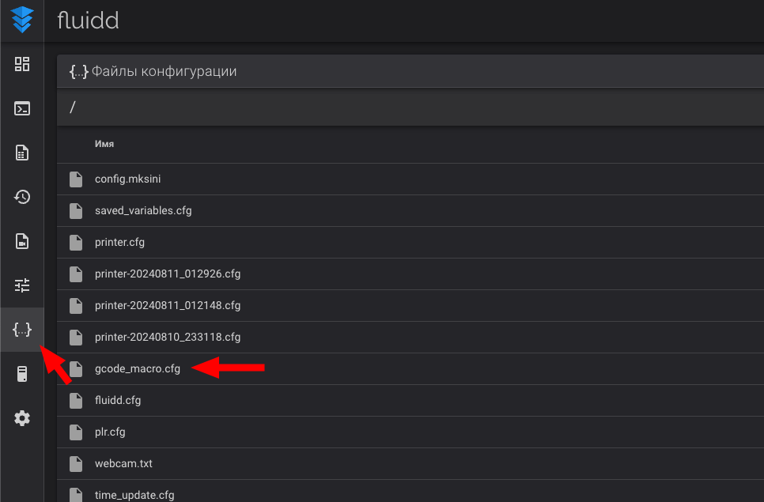
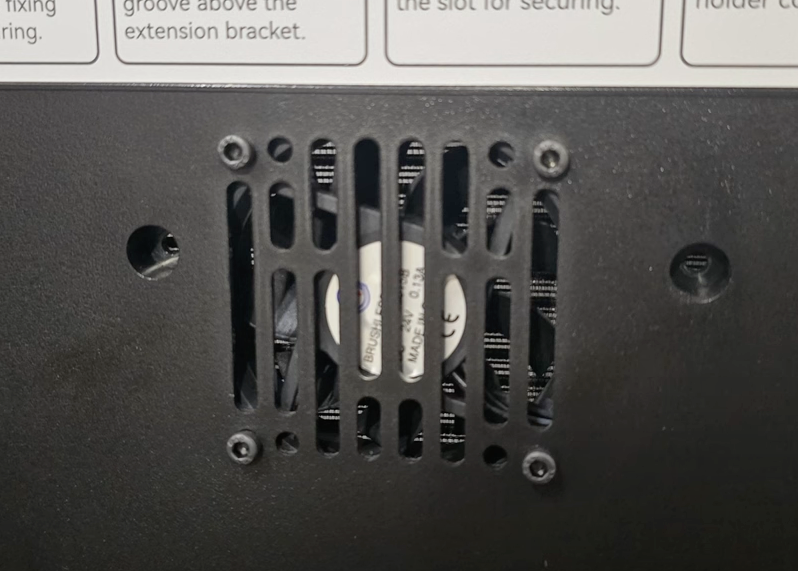
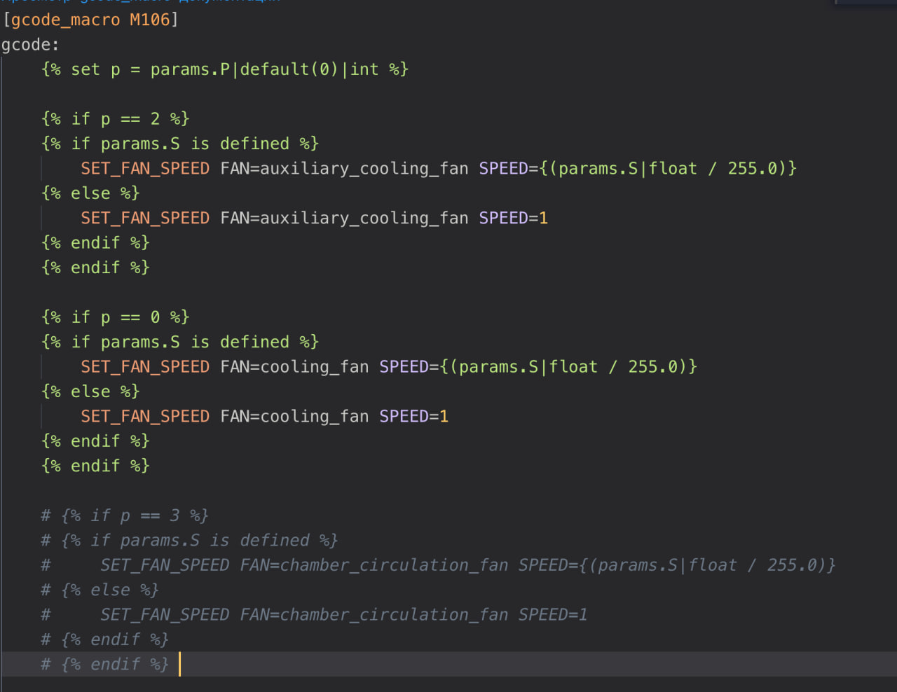
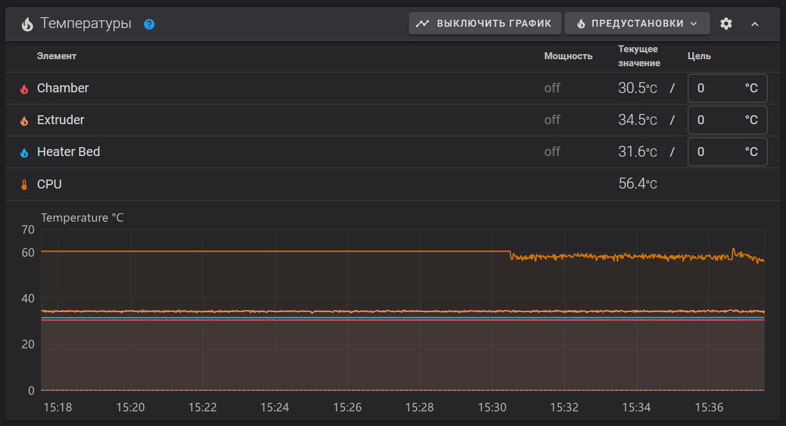
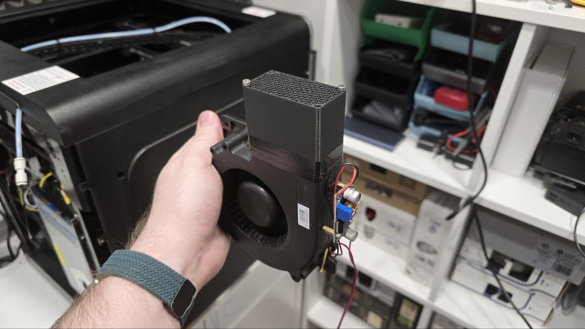
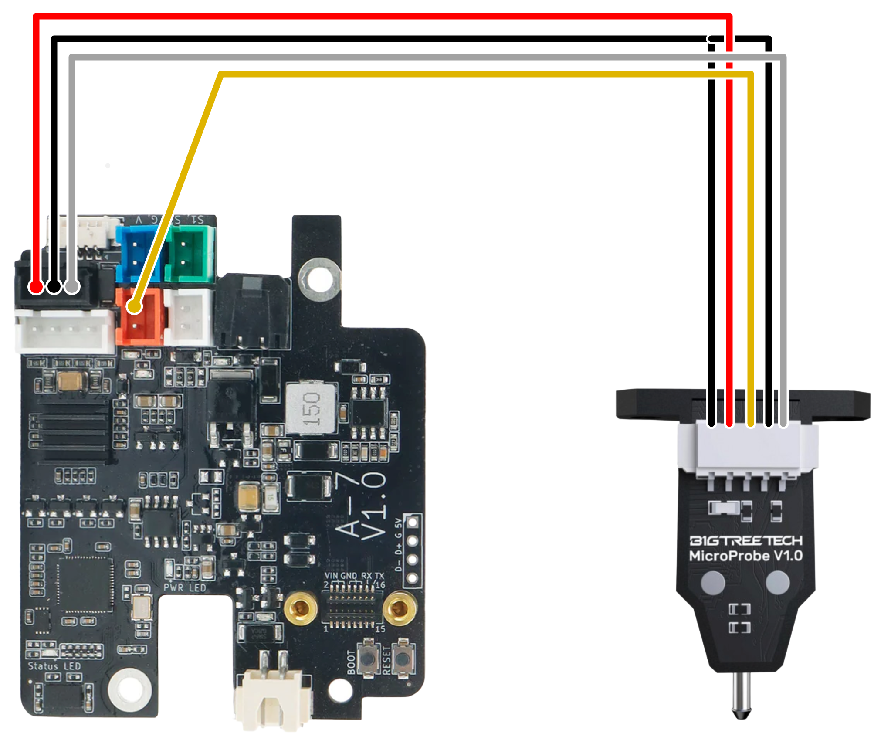
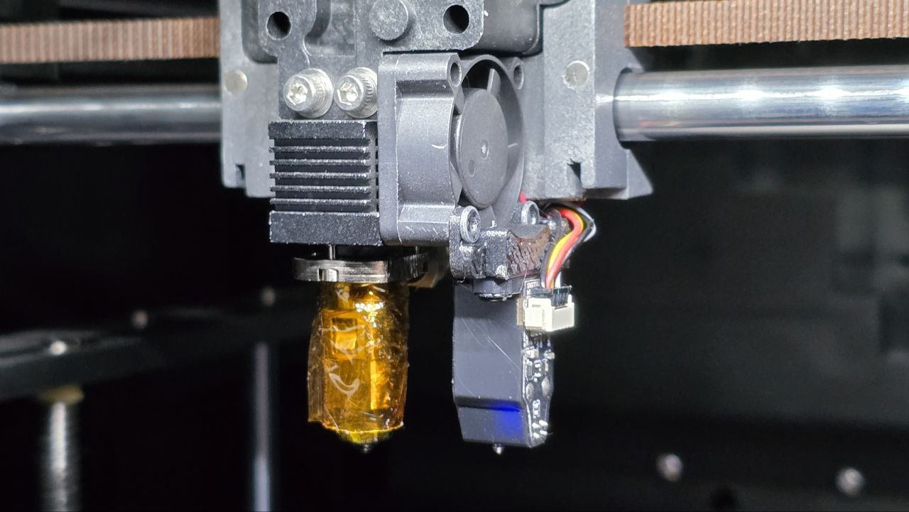
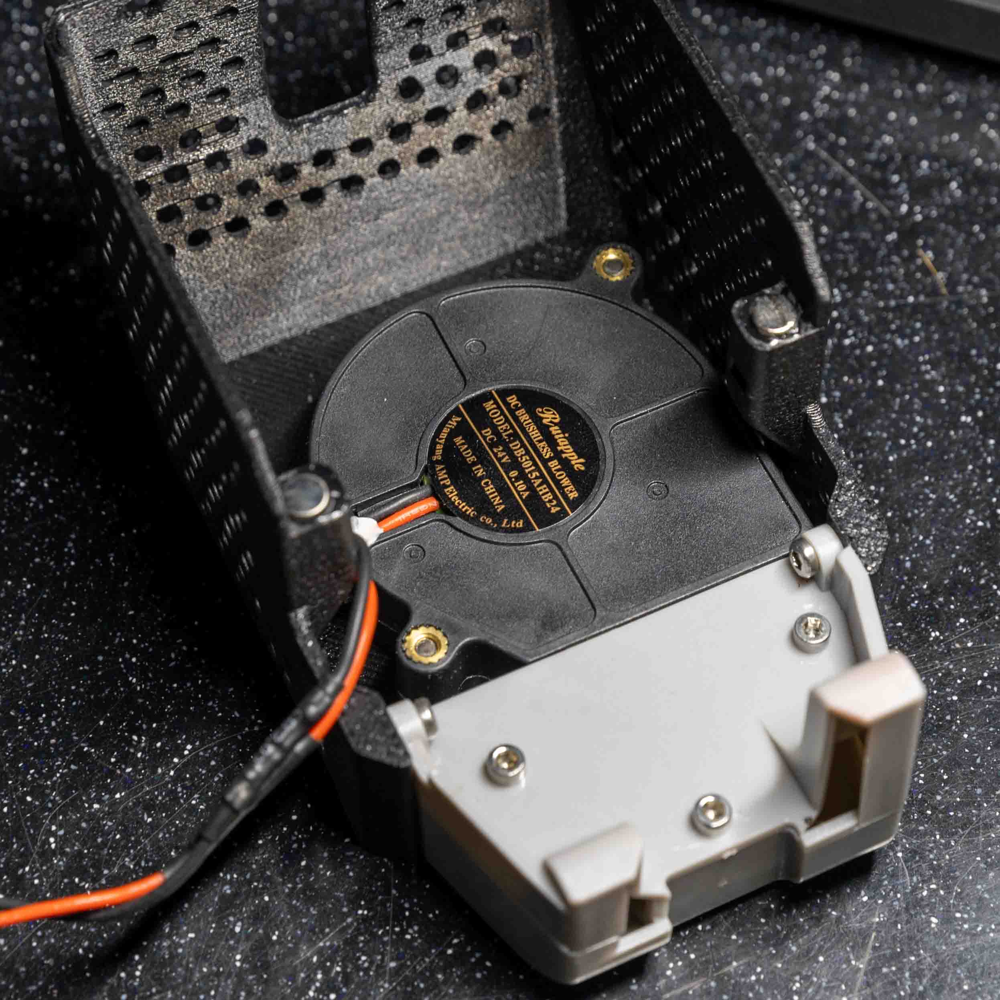
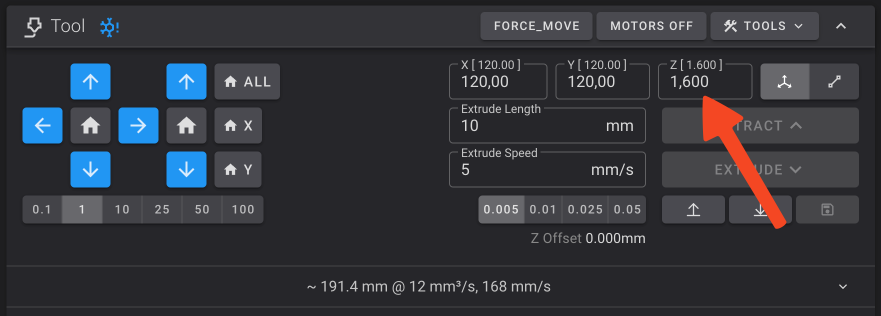

# QIDI Q1 Pro

## Обзор

=== "YouTube"

    <iframe width="853" height="480" src="https://www.youtube.com/embed/EVP7JcmSndU?si=70T0zcucv4BMO7uB" title="YouTube video player" frameborder="0" allow="accelerometer; autoplay; clipboard-write; encrypted-media; gyroscope; picture-in-picture; web-share" referrerpolicy="strict-origin-when-cross-origin" allowfullscreen></iframe>

=== "VK"

    <iframe src="https://vk.com/video_ext.php?oid=-168896673&id=456239634&hd=2" width="853" height="480" allow="autoplay; encrypted-media; fullscreen; picture-in-picture; screen-wake-lock;" frameborder="0" allowfullscreen></iframe>

QIDI Q1 Pro - это один из самых удачных принтеров в своём ценовом сегменте. Дело в том, что у него, конечно, есть минусы, куда же без них. Но большинство из них незначительны - некрасивый внешний вид, увеличенный габарит, долго греющийся стол. Значимый минус же только один, этот принтер довольно плохо справляется с эластомерами, может печатать только средне-мягкими.

Зато у принтера очень удачная механика, которая позволяет печатать на адекватных для этого ценового сегмента скоростях и очень слабо рябит. Экструдер уже в стоке подготовлен под печать композитными материалами, плюс греется аж до 350 градусов в стоке. Вкупе с нормальным обдувом, греющимся до 125 градусов столом и активной термокамерой до 60-65 градусов, это позволяет без каких-либо доработок хорошо печатать всеми твёрдыми материалами от самых простых типа ПЛА и ПЭТГ, до сложных инженерных типа ПА6, ППС и т.д. При этом, благодаря активной термокамере, прочность деталей, напечатанных на этом принтере, будет заметно выше, чем если их же напечатать на принтерах-конкурентах, не обладающих активной термокамерой.

В дополнение к этому у принтера отличная электроника, не кастрированная ни в чём, с относительно чистой и хорошо настроенной прошивкой и очень функциональным мобильным приложением. А также хорошая комплектация - веб-камера, подсветка, датчик запутывания филамента, датчик наличия филамента и т.д.

Как итог, единственный случай, когда этот принтер будет плохим выбором - это если надо много печатать эластомерами. Для печати твёрдыми пластиками же, Q1 Pro является одним из самых способных принтеров в этом ценовом сегменте.

Подробнее смотрите в полной версии обзора выше.

[Купить QIDI Q1 Pro](https://alli.pub/70skp5?erid=2SDnjeS8z1x){ target="_blank" }

## Обязательно - Исправление проблемы с настройкой стола

В принтере допущена конструктивная ошибка - автоматическое выставление положения рамы стола сделано неправильно, из-за чего конфликтует с ручной настройкой положения стола относительно рамы стола. Подробнее об этом рассказано в [обзоре](https://youtu.be/EVP7JcmSndU?si=Y0H9C7PfNRBiCNhZ){ target=_blank" }. Из-за этой ошибки оказывается невозможным нормально выставить положение стола так, как это задумывал разработчик.

Изначально я предлагал решение с изменением конфигурации, при котором работоспособность штатного метода выставления стола в горизонт восстанавливалась. Но, к сожалению, не у всех. У некоторой части пользователей возникали проблемы при использовании команды Z_TILT_ADJUST. Поэтому от этого метода было решено отказаться, равно как и вообще от использования автоматического выставления рамы стола. Ручной метод, хоть и требует действий со стороны пользователя, но работает надёжно и даёт наилучие результаты. Тем более, если всё делать правильно, то настроить надо будет только 1 раз и всё.

### 1. Выставление рамы стола

У QIDI Q1 Pro стол приводится в движение двумя механически не связанными приводами по бокам принтера. Если рама стола будет стоять очень криво, то это может создать проблемы в работе оси Z. Поэтому перед началом всех действий её надо выставить плюс-минус в горизонт. Это можно сделать множеством способов, но самый простой - использовать штатный метод:

1. Выполните автопарковку `G28`;
2. Выполните автоматическое выставление рамы стола командой `Z_TILT_ADJUST`.

После этого рама стола окажется в таком положении, при котором не будет проблем с работой оси Z. В дальнейшем важно не крутить ходовые винты вручную т.к. это собьёт положение рамы стола и придётся заново перекалибровывать стол.

### 2. Подготовка конфигурации

Важно не выполнять команду `Z_TILT_ADJUST` после калибровки стола т.к. это приведёт к изменению положения рамы и, следовательно, положения стола. В свою очередь, это приведёт к необходимости заново калибровать стол. Чтобы такого не происходило, надо убрать все вызовы `Z_TILT_ADJUST` из макросов:

{ width="600" }

1. В веб-интерфейсе принтера перейдите во вкладку `Configuration` и откройте файл `gcode_macro.cfg`;
2. В нём найдите все команды `Z_TILT_ADJUST` и либо удалите, либо закомментируйте их (поставьте перед ними #). Для поиска по файлу можно использовать ++ctrl+f++ ;
3. Нажмите кнопку `SAVE` вверху-справа, потом `CLOSE`.
4. Убедитесь, что в вашем слайсере в стартовом G-коде тоже нет команды `Z_TILT_ADJUST`.

### 3. Калибровка стола

Теперь, когда ничто не должно сбивать положение рамы стола, мы можем настроить положение стола относительно рамы стола:

1. Выполните автопарковку `G28`;
2. Отпустите контргайки на регулировочных винтах стола;
3. Выполните команду `SCREWS_TILT_CALCULATE`. При этом принтер с помощью датчика автоуровня измерит высоту в 3 точках над регулировочными винтами и подскажет в какую сторону и на сколько оборотов их крутить. Обратите внимание, что рекомендации даны не в градусах, а в оборотах и минутах. К примеру, если дана рекомендация крутить CCW 01:15, это означает, что винт надо повернуть против часовой стрелки (CCW) на 1 полный оборот, и угол, равный углу, который проходит минутная стрелка часов за 15 минут;
4. Повторяйте п.3 пока рекомендация по регулировке винтов не станет менее 00:05.

На этом регулировка закончена. При дальнейшей эксплуатации принтера не трогайте ходовые винты. Все движения оси Z совершайте с помощью управления столом в веб-интерфейсе принтера. Также не вызывайте команду `Z_TILT_ADJUST` т.к. после неё стол придётся переклабировывать.

!!! note "Если в какой-то момент вы собьёте положение рамы стола, то надо будет повторить весь процесс сначала. Естественно, за исключением поиска команд `Z_TILT_ADJUST` в макросах"

## Необязательные доработки

### Перенос "бесполезного" вентилятора

Температура в отсеке электроники в стоке не превышает допустимую, поэтому в общем случае рекомендуется не вмешиваться в работу принтера и просто эксплуатировать его спокойно. Но, если вас всё-таки беспокоит температура в отсеке электроники, можно перенести "бесполезный" вентилятор с задней части термокамеры на крышку отсека электроники на выдув. 



На крышке отсека электроники уже есть отверстия, в которые вентилятор можно прикрутить любыми винтами, которые вы найдёте в своей банке из под кофе (все же хранят старый крепеж в банках из под кофе, так?). Если у вас нет винтов, на которые можно было бы прикрепить вентилятор к крышке, то его можно приклеить любым удобным способом.

!!! note "Вентилятор должен быть направлен на выдув из отсека электроники. Если не знаете в какую сторону вентилятор дует, то на корпусе есть стрелочка" 

Для заглушки отверстия после переноса вентилятора можно воспользоваться скотчем или распечатать [заглушку](./models/6015_fan_dummy.3mf){ download="6015_fan_dummy.3mf" }

После установки вентилятора в `printer.cfg` необходимо удалить или закомментировать штатную секцию, отвечающую за работу этого вентилятора:

```
[fan_generic chamber_circulation_fan]
pin:U_1:PC9
shutdown_speed: 0.0
cycle_time: 0.100
hardware_pwm: false
kick_start_time: 0.100
off_below: 0.0
```

И добавить управление этим вентилятором в зависимости от того, включены ли какие-то моторы, нагреватели и т.д., или нет:

```
[controller_fan board_fan_2]
pin: U_1:PC9
max_power: 1.0
shutdown_speed: 1.0
cycle_time: 0.01
fan_speed: 0.5
stepper: stepper_x, stepper_y, stepper_z, stepper_z1
heater: extruder, heater_bed, chamber
```

При этом вентилятор будет крутиться на 50% когда включен какой-то из нагревателей или моторов, и будет выключаться при выключении потребителей. Если вы хотите увеличить или уменьшить обороты этого вентилятора, то надо изменить значение параметра `fan_speed`, от 0.2 (меньше не будет крутиться вообще) до 1.0 - полные обороты.

{ width="500" }

Нажмите кнопку `Сохранить`, после чего откройте файл `gcode_macro.cfg` и закомментируйте там строки в команде M106 как показано на скриншоте выше. 

### Вывод температуры процессора

{ width="500" }

Если вы хотите следить за температурой процессора, то в файл `printer.cfg` надо добавить следующую секцию в любое место:

```
[temperature_sensor CPU]
sensor_type: temperature_host
min_temp: 0
max_temp: 90
```

где `min_temp` и `max_temp` - минимальная и максимальная допустимые температуры для процессора. Если его температура выйдет за указанный диапазон, то прошивка упадёт в ошибку, печать прервётся. Поэтому рекомендуется не заужать диапазон температур, а давать небольшой запас.

После этого нажмите `Сохранить и перезагрузить`. На графике температур должна появиться еще одна - температура процессора материнской платы.

### Вывод температур микроконтроллеров

У QIDI Q1 Pro есть два микроконтроллера. Для вывода их температуры необходимо в `printer.cfg` в любое место добавить следующие секции:

Для вывода температуры микроконтроллера материнской платы:

```
[temperature_sensor Motherboard MCU]
sensor_type: temperature_mcu
sensor_mcu: U_1
min_temp: 0
max_temp: 90
```

Для вывода температуры микроконтроллера переходной платы на печатающей голове:

```
[temperature_sensor Printhead MCU]
sensor_type: temperature_mcu
min_temp: 0
max_temp: 120
```

После внесения изменений надо нажать `Сохранить и перезагрузить`. После перезагрузки температуры должны появиться на графике. В некоторых случаях для этого придётся обновить страницу вручную.

### Фильтр на боковой вентилятор

{ width="600" }

В стоке боковой вентилятор предполагается использовать для дополнительного охлаждения моделей. На практике это работает плохо т.к. этот вентилятор охлаждает не то, что нужно, а правый бок модели. Поэтому я заменил стоковый воздуховод на контейнер для пеллет из активированного угля, тем самым создав рециркуляционный фильтр. Запах при печати АБС очень сильно снизился, а при печати некоторых мало пахнущих видов АБС вообще не ощущается. При этом этот фильтр еще совершает перемешивание воздуха в активной термокамере, выравнивая температуру внизу и вверху.

[:material-download: Скачать модели](./models/q1_carbon_filter.7z){ download="q1_carbon_filter.7z" }

В моделях есть как основные детали, так и детали, помеченные `mod`. Это детали-модификаторы для того, чтобы сделать части основной модели решетками. Для этого загрузите обе модели одновременно, после чего для модели-модификатора переопределите настройки: 0 слоёв крышки и дна, 1 периметр, заполнение - на ваш вкус.

Распечатанный фильтр заполняется пеллетами из активированного угля и скрепляется на 2-4 винта M3x50. После этого он устанавливается вместо штатного воздуховода. При этом желательно герметизировать стык изолентой или скотчем.

!!! note "При включении перемешивания воздуха в термокамере, температура воздуха на термисторе активного нагревателя может довольно сильно упасть, или расти слишком медленно. Это может приводить к ошибкам из-за недостаточной скорости нагрева. В таком случае надо будет увеличить время в разделе конфигурации `[verify_heater chamber]`. В конфигурации комплексной модификации, которая описана ниже, время уже увеличено."

## Комплексная модификация K3D

Несмотря на то, что принтер хорошо работает в стоковом состоянии, его можно сделать немного удобнее и надёжнее. Сразу несколько проблем принтера имеют общее решение - переход с индуктивного датчика автоуровня на BigTreeTech MicroProbe. Это позволяет:

- Парковка и автоуровень становятся очень стабильными. Больше нет, хоть и редких, но всё же иногда возникающих ситуаций, когда сопло плохо почистилось, из-за этого неправильно автоматически выставился Z-offset датчика, из-за чего плохо выложился первый слой и печать надо начинаться заново. С MicroProbe надо только настроить 1 раз Z-offset вручную и дальше каждая печать начинается при одинаковом расстоянии от сопла до стола;
- Время подготовки к печати значительно сокращается;
- Отказ от индуктивного датчика автоуровня и тензодатчиков в столе делает ненужной чистилку сопла в задней части принтера. В свою очередь, это делает ненужным крышку, закрывающую плату на печатающей голове. Это позволяет снизить температуру микроконтроллера с ~92-95°С до ~78°С, что ниже максимальной температуры эксплуатации этого микроконтроллера (85°С). Это не только уменьшает шанс поломки платы на печатающей голове, но и позволяет греть активную термокамеру до ~65°С не боясь перегрева электроники;
- Установка нового датчика автоуровня возможна в две позиции - под использование стандартных и Volcano сопел. Если использовать Volcano, то немного вырастет производительность хотэнда. Кроме того, Volcano сопла более распространены и продаются в большем количестве вариаций. Некоторые из них, например, с CHT вставкой, позволяют еще лучше прогревать филамент, дополнительно увеличивая прочность деталей из плохо спекающихся материалов;
- При стоковом индуктивном датчике в качестве покрытия стола можно использовать только стальные листы. С MicroProbe можно использовать любые виды покрытия, включая стекло, стеклотекстолит и т.д.

### Покупные детали

Для установки этой модификации вам понадобится купить несколько деталей:

| Наименование | Ссылка | Примечание |
|:------------ |:------:|:---------- |
| BTT MicroProbe | [:material-shopping:](https://alli.pub/6tusx1?erid=2SDnjdbdWMe "BigTreeTech Official Store"){ target="_blank" } | Идёт сразу с винтами и проводами |
| Сопло Volcano | [:material-link:](../part-navi/extruder.md){ target="_blank" } | Сопло выбирайте на свой вкус. Лично я печатаю через стальное закалённое CHT 0.4 и 0.6мм. У вас могут быть другие предпочтения |
| 2 шт. Магнит Ø5x1 | - | Если будете перепечатывать систему охлаждения под Volcano сопла. О том, когда это необходимо, а когда нет, читайте в `печатные детали` |
| Разъём xh2.54 2pin мама | [:material-shopping:](https://alli.pub/73yzf5?erid=2SDnjccns4w){ target="_blank" } | Если есть обжимка, то лучше будет обжать пины в разъёмы xh2.54. Если нет, то можно использовать те разъёмы, которые идут в комплекте к MicroProbe и просто зафиксировать их каким-нибудь клеем, чтобы не слетали |
| Разъём xh2.54 3pin мама | [:material-shopping:](https://alli.pub/73yzf5?erid=2SDnjccns4w){ target="_blank" } |  |
| Радиатор для микроконтроллера | [:material-shopping:](https://alli.pub/73yzkl?erid=2SDnjecRu3q){ target="_blank" } | Пойдёт почти любой, который физически поместится и не будет ничего задевать |

### Печатные детали

| Наименование | Примечание |
|:------------ |:---------- |
| [Крепление MicroProbe под сток сопла](./models/k3d_q1_microprobe_mount_short.stl){ download="k3d_q1_microprobe_mount_short.stl"} | Печатать необходимо из жёсткого и стойкого к температуре материала. Самым простым из таковых будет ABS. Предпочтительно использовать сопло 0.4 мм т.к. деталь небольшая |
| [Крепление MicroProbe под Volcano сопла](./models/k3d_q1_microprobe_mount.stl){ download="k3d_q1_microprobe_mount.stl"} | Печатать необходимо из жёсткого и стойкого к температуре материала. Самым простым из таковых будет ABS. Предпочтительно использовать сопло 0.4 мм т.к. деталь небольшая |
| [Корпус системы охлаждения под Volcano сопла](./models/k3d_q1_volcano_cooling_system_adaptation.stl.stl){ download="k3d_q1_volcano_cooling_system_adaptation.stl.stl" } | Нужен для переноса системы охлаждения ниже при использовании Volcano сопел. Несовместим со стоковыми соплами |
| [Корпус системы охлаждения под Volcano сопла без отверстий](./models/k3d_q1_volcano_cooling_system_adaptation_no_holes.stl){ download="k3d_q1_volcano_cooling_system_adaptation_no_holes.stl" } | То же самое, только без отверстий для вентиляции. |

### Установка модификации

#### Демонтаж ненужного

1. Система очистки сопла крепится на 4 винта, доступ к которым открывается из отсека электроники. Открутив их, система просто снимается вперёд;
2. Крышка платы печатающей головы крепится на 4 винта по углам. Открутите их и снимите крышку;
3. Индуктивный датчик автоуровня крепится на 2 винта снизу за датчиком. Отсоедините разъём этого датчика с платы печатающей головы, открутите винты и снимите датчик.

#### Подключение MicroProbe

{ width="500" }

!!! warning "Все подключения делаются только на полностью обесточенном принтере!"

- Два чёрных провода (gnd) объединяются в любом месте и подключаются к центральному пину разъёма датчика автоуровня;
- Красный провод (+5v) подключается к разъёму датчика автоуровня, к пину ближе к краю платы;
- Белый провод (probe) подключается к разъёму датчика автоуровня, к пину ближе к центру платы;
- Жёлтый провод (servo) подключается к верхнему пину красного разъёма.

#### Установка MicroProbe

{ width="500" }

Датчик MicroProbe прикручивается к креплению и ставится прямо на хотэнд, под винты крепления вентилятора. Гроверные шайбы при этом необходимо снять. После монтажа MicroProbe, хотэнд устанавливается обратно на печатающую голову.

#### Конфигурация принтера

Для того, чтобы новый датчик работал, нужно внести изменения в конфигурацию принтера. К сожалению, изменений требуется так много, что проще будет скачать мою конфигурацию. В ней, кроме изменений, требуемых для работы MicroProbe, внесены также изменения, касающиеся переноса "бесполезного" вентилятора, вывод температур, а также вырезано всё лишнее. Если вы не переносили вентилятор или вносили какие-то другие изменения в свою конфигурацию, то мою конфигурацию придётся поправить перед использованием.

1. [:material-download: Скачайте конфигурацию](./files/qidi_q1_pro_printer.cfg){ download="printer.cfg" };
2. В веб-интерфейсе принтера в разделе `Configuration` переименуйте файл `printer.cfg` в `printer.cfg.bak`;
3. Загрузите новый `printer.cfg` вместо переименованного;
4. Перезагрузите прошивку (команда `FIRMWARE_RESTART`).

!!! warning "После установки конфигурации необходимо будет откалибровать Z-offset датчика (`z_offset` в разделе `probe`)"
!!! warning "В этой конфигурации откоючено автоматическое выравнивание рамы стола т.к. оно забаговано и может привести к проблемам. Поэтому не сбивайте положение рамы стола (не вращайте ходовые винты вручную). В случае, если собьёте положение рамы стола, её придётся выставлять в горизонт вручную"

#### Пользовательские G-коды слайсера

В новой конфигурации нет макросов начала и окончания печати. Поэтому инициализацию печати придётся вписать в начальный и конечный пользовательские G-коды

Начальный G-код для PS/OS

```
SET_HEATER_TEMPERATURE HEATER=extruder TARGET=150
SET_HEATER_TEMPERATURE HEATER=heater_bed TARGET={first_layer_bed_temperature[0]}
SET_HEATER_TEMPERATURE HEATER=chamber TARGET={chamber_temperature[0]}
G28
TEMPERATURE_WAIT SENSOR=heater_bed MINIMUM={first_layer_bed_temperature[0]}
BED_MESH_CALIBRATE PROFILE=kamp
SET_HEATER_TEMPERATURE HEATER=extruder TARGET={first_layer_temperature[0]}
TEMPERATURE_WAIT SENSOR=extruder MINIMUM={first_layer_temperature[0]} MAXIMUM={first_layer_temperature[0] + 2}
M220 S100
M221 S100
```

Конечный G-код для PS/OS

```
SET_HEATER_TEMPERATURE HEATER=extruder
SET_HEATER_TEMPERATURE HEATER=heater_bed
SET_HEATER_TEMPERATURE HEATER=chamber
M106 S0
SET_FAN_SPEED FAN=auxiliary_cooling_fan SPEED=0.0
G91
G1 Z1 F300
G1 E-5 F1800
G90
G1 X2 Y244 F18000
G1 Z{max_print_height}
M84
```

#### Замена сопла на Volcano

Выбор использовать ли стоковые сопла или переходить на Volcano остаётся за пользователем. Но лично я советую переходить на Volcano т.к. это даёт множество плюсов:

* Производительность хотэнда увеличивается за счёт увеличения длины горячей зоны;
* Производительность хотэнда может быть увеличена за счёт установки CHT сопел, которых под размер сопел QIDI не существует;
* Volcano сопла более распространены и дешевле стоят.

В случае перехода на Volcano сопла не требуется никаких особых действий. Это сопло просто устанавливается вместо штатного и протягивается на горячую.

#### Замена корпуса системы охлаждения

{ width="500" }

!!! note "Если не переходите на Volcano сопла, то пропустите этот шаг"

Корпус системы охлаждения отличается от штатного двумя вещами: креплением вентилятора и магнитами. Магниты Ø5x1 приклеиваются на выступы под них. Рекомендую преварительно проверить, что полюса не перепутаны.

Для крепления вентилятора я вплавил резьбовые втулки m3x3 в ушки вентилятора с задней стороны. После этого закрепил вентилятор винтами m3x16 с потайной головкой. Если винтов или втулок нет, то можно просто приклеить лицевую сторону вентилятора к внутренней стороны корпуса печатающей головы на двусторонний скотч.

Нижняя часть системы охлаждения крепится на штатные винты.

### Настройка Z-offset MicroProbe



После установки модификации необходимо подобрать Z-offset датчика MicroProbe. Для этого:

1. Убедитесь, что в конфигурации в разделе `probe` значение параметра `z_offset` стоит 0. Также убедитесь, что оно не переопределено внизу конфигурации;
2. Выполните автопарковку `G28`;
3. Сдвиньте печатающую голову примерно в центр стола `G1 X125 Y125`;
4. С помощью инструментов движения, поднимайте стол по 0.1мм пока сопло не притрёт бумажку;
5. Запишите значение координаты по оси Z **учитывая наличие минуса перед ним**;
6. Откройте `printer.cfg` и найдите в разделе `probe` параметр `z_offset`. Из его значения надо **вычесть** ранее записанную координату по Z. К примеру, если `z_offset: 1.0`, а ранее вы записали `-0.3`, то значение вашего `z_offset` будет $1.0 - ( -0.3 ) = 1.0 + 0.3 = 1.3$. Впишите полученное значение в параметр `z_offset`.
7. Сохраните изменения и перезагрузите прошивку.

### Настройка максимальной координаты по Z

Есть 2 способа установить максимальную координату по оси Z. Первый - упрощённый. Просто впишите в конфигурации в разделе `stepper_z` в параметрах `position_endstop` и `position_max` значение `240`. Это безопасное значение, которое работает на всех Q1 Pro. В таком случае в слайсере тоже стоит ограничить область печати по вертикали 240 миллиметрами.

Второй способ сложнее, но позволит выиграть несколько миллиметров области печати по оси Z.

1. В конфигурации в разделе `stepper_z` установите `position_endstop` равным 240, а `position_max` равным 250, после чего сохраните значения и перезагрузите прошивку;
2. Выполните автопарковку `G28`;
3. Опустите стол в координату 240 либо инструментами движения, либо выполнив команду `G1 Z240`;
4. Опускайте стол по миллиметру пока он не упрётся в раму принтера. При этом моторы Z пропустят шаги с характерным "дрдрдр";
5. В конфигурации в разделе `stepper_z` установите значения параметров `position_endstop` и `position_max` равными координате по оси Z минус 2 миллиметра. К примеру, если шаги пропустило на координате 246, то максимальную высоту стоит установить 244. После этого сохраните конфигурацию и перезагрузите прошивку;
6. Проверьте карту высот стола. Скорее всего, она сбилась и стол надо будет заново выставить в горизонт.

## Расходники для Q1 Pro

У принтера в стоке стоят качественные закалённые шестерни и биметаллическое сопло 0.4, так что каких-то расходников, которые обязательно надо было бы докупать нет. Тем не менее, рано или поздно всё износится + может захотеться купить сопла другого вида или диаметра. Так что для удобства, я собрал здесь самые часто необходимые детали:

| Наименование | Ссылка | Примечание |
|:------------ |:------:|:---------- |
| Сопло биметаллическое Trianglelab ZS-QD | [:material-shopping:](https://alli.pub/70ma2n?erid=2SDnjdAK4Mp){ target="_blank" } | Более дорогое, но и более качественное сопло. Подходит для композитных материалов |
| Хотэнд Q1 Pro | [:material-shopping:](https://alli.pub/70ma3f?erid=2SDnjdHizmY){ target="_blank" } | Весь хотэнд в сборе целиком. На случай поломки, покупать прозапас смысла мало |
| Подающий механизм Q1 Pro | [:material-shopping:](https://alli.pub/70ma40?erid=2SDnjdkQmqk){ target="_blank" } | Весь подающий механизм в сборе. Имеет смысл покупать только если сломались/износились детали кроме подающих колёс |
| Подающие колёса HGX | [:material-shopping:](https://alli.pub/70ma4l?erid=2SDnjduJhXp){ target="_blank" } | Набор, подающие колёса из которого подходят к подающему механизму Q1 Pro |
| Носки Q1 Pro | [:material-shopping:](https://alli.pub/70ma4s?erid=2SDnjdykfNr){ target="_blank" } | На случай, если штатный порвётся. Имеет смысл взять сразу т.к. уже после пары разборов хотэнда 99% что носок будет надорван хоть немного |

---

`Реклама: ООО "АЛИБАБА.КОМ (РУ)" ИНН 7703380158`

Нет человека или юр.лица, которые заказали бы создание этой страницы или рекламу товаров, приводимых на этой странице. Я создал все статьи в рекомендаторе сам, по своему желанию и в целях сообщества. Тем не менее, по законодательству РФ, любая ссылка на товар является рекламой. Поэтому я вынужден делать эту приписку, чтобы не получить штраф.

---