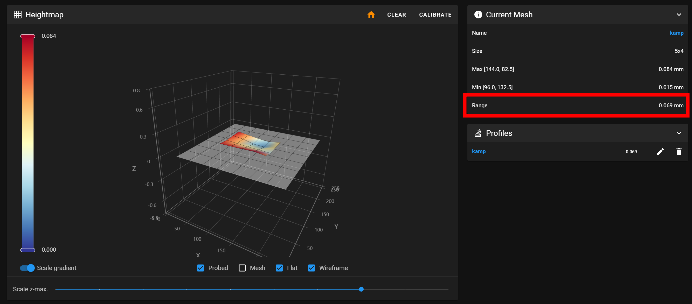

# QIDI Q1 Pro

## Обзор

=== "YouTube"

    <iframe width="853" height="480" src="https://www.youtube.com/embed/EVP7JcmSndU?si=70T0zcucv4BMO7uB" title="YouTube video player" frameborder="0" allow="accelerometer; autoplay; clipboard-write; encrypted-media; gyroscope; picture-in-picture; web-share" referrerpolicy="strict-origin-when-cross-origin" allowfullscreen></iframe>

=== "VK"

    <iframe src="https://vk.com/video_ext.php?oid=-168896673&id=456239634&hd=2" width="853" height="480" allow="autoplay; encrypted-media; fullscreen; picture-in-picture; screen-wake-lock;" frameborder="0" allowfullscreen></iframe>

QIDI Q1 Pro - это один из самых удачных принтеров в своём ценовом сегменте. Дело в том, что у него, конечно, есть минусы, куда же без них. Но большинство из них незначительны - некрасивый внешний вид, увеличенный габарит, долго греющийся стол. Значимый минус же только один, этот принтер довольно плохо справляется с эластомерами, может печатать только средне-мягкими.

Зато у принтера очень удачная механика, которая позволяет печатать на адекватных для этого ценового сегмента скоростях и очень слабо рябит. Экструдер уже в стоке подготовлен под печать композитными материалами, плюс греется аж до 350 градусов в стоке. Вкупе с нормальным обдувом, греющимся до 125 градусов столом и активной термокамерой до 60-65 градусов, это позволяет без каких-либо доработок хорошо печатать всеми твёрдыми материалами от самых простых типа ПЛА и ПЭТГ, до сложных инженерных типа ПА6, ППС и т.д. При этом, благодаря активной термокамере, прочность деталей, напечатанных на этом принтере, будет заметно выше, чем если их же напечатать на принтерах-конкурентах, не обладающих активной термокамерой.

В дополнение к этому у принтера отличная электроника, не кастрированная ни в чём, с относительно чистой и хорошо настроенной прошивкой и очень функциональным мобильным приложением. А также хорошая комплектация - веб-камера, подсветка, датчик запутывания филамента, датчик наличия филамента и т.д.

Как итог, единственный случай, когда этот принтер будет плохим выбором - это если надо много печатать эластомерами. Для печати твёрдыми пластиками же, Q1 Pro является одним из самых способных принтеров в этом ценовом сегменте.

Подробнее смотрите в полной версии обзора выше.

[Купить QIDI Q1 Pro](https://alli.pub/70skp5?erid=2SDnjeS8z1x){ target="_blank" }

## Обязательно - Исправление проблемы с настройкой стола

В принтере допущена конструктивная ошибка - автоматическое выставление положения рамы стола сделано неправильно, из-за чего конфликтует с ручной настройкой положения стола относительно рамы стола. Подробнее об этом рассказано в [обзоре](https://youtu.be/EVP7JcmSndU?si=Y0H9C7PfNRBiCNhZ){ target=_blank" }. Из-за этого не получится нормально выровнять стол в горизонт подкручиванием барашков, т.к. автоматическое выравнивание собьёт выставленное вручную положение. Кроме того, из-за того, что точек крепления стола всего 3, не получится регулировками убрать скручивание стола, из-за чего кривизна стола, чаще всего, будет достаточно большой.

Ранее предлагалось отказаться от автоматического выравнивания стола и выравнивать его вручную, плюс исправлять кривизну подклеиванием скотча под адгезивный лист. В краткосрочной перспективе это работало хорошо. Но в долгосрочной положение стола по чуть-чуть сбивается, и в итоге стол стоит криво, что приводит к дефектам укладки первого слоя. Поэтому была придумана новая методика исправления обоих дефектов одновременно. Текущая методика должна хорошо работать даже при полностью стоковом принтере.

### 1. Регулировка положения стола



В первую очередь надо выставить стол так, чтобы перепад высот был как можно меньше. Делается это следующим образом:

1. Выполните автопарковку (`G28`);
2. Выполните автоматическое выравнивание стола (`Z_TILT_ADJUST`);
3. Снимите карту высот стола (`BED_MESH_CALIBRATE`);
4. Посмотрите как наклонён стол и постарайтесь поправить это вращением барашков под столом. 1 полный оборот = перемещение точки стола над винтом на 0.5мм. Затягивание барашка опускает точку, откручивание барашка поднимает точку;
5. Повторяйте шаги 2-4 пока получается уменьшать перепад высот стола. Если удалось добиться перепада высот менее 0.2мм, то больше ничего делать не нужно. Если такого перепада высот добиться не удаётся, то остановитесь на максимально хорошем результате, которого удалось добиться, и переходите к следующему шагу.

### 2. Выравнивание стола

<iframe width="853" height="480" src="https://www.youtube.com/embed/9j_rT0ATjXo?si=Pd1nsemOINZpu2xq" title="YouTube video player" frameborder="0" allow="accelerometer; autoplay; clipboard-write; encrypted-media; gyroscope; picture-in-picture; web-share" referrerpolicy="strict-origin-when-cross-origin" allowfullscreen></iframe>

Исправление кривизны стола следует делать согласно [этому видео](https://youtu.be/9j_rT0ATjXo?si=3fwQL0DC2lBoZ58T){ target="_blank" }, но с одним изменением. Перед каждым снятием карты высот (`BED_MESH_CALIBRATE`) необходимо обязательно выполнять команду `Z_TILT_ADJUST`. Иными словами алгоритм будет такой:

1. Прогреваете стол до типичной рабочей температуры;
2. Выполняете автопарковку (`G28`);
3. Выполняете автоматическое выравнивание стола (`Z_TILT_ADJUST`);
4. Снимаете карту высот стола (`BED_MESH_CALIBRATE`);
5. Подклеиваете скотч в ямы по карте высот (подробнее в видео);
6. Повторяете пункты 2-5 пока кривизна стола не станет менее 0.15мм. Важно не пропускать никакие действия т.к. иначе снятая карта высот не будет соответствовать таковой при реальной печати.

## Необязательные доработки

### Перенос "бесполезного" вентилятора

Температура в отсеке электроники в стоке не превышает допустимую, поэтому в общем случае рекомендуется не вмешиваться в работу принтера и просто эксплуатировать его спокойно. Но, если вас всё-таки беспокоит температура в отсеке электроники, можно перенести "бесполезный" вентилятор с задней части термокамеры на крышку отсека электроники на выдув. 


На крышке отсека электроники уже есть отверстия, в которые вентилятор можно прикрутить любыми винтами, которые вы найдёте в своей банке из под кофе (все же хранят старый крепеж в банках из под кофе, так?). Если у вас нет винтов, на которые можно было бы прикрепить вентилятор к крышке, то его можно приклеить любым удобным способом.

!!! note "Вентилятор должен быть направлен на выдув из отсека электроники. Если не знаете в какую сторону вентилятор дует, то на корпусе есть стрелочка" 

Для заглушки отверстия после переноса вентилятора можно воспользоваться скотчем или распечатать [заглушку](./models/6015_fan_dummy.3mf){ download="6015_fan_dummy.3mf" }

После установки вентилятора в `printer.cfg` необходимо удалить или закомментировать штатную секцию, отвечающую за работу этого вентилятора:

```
[fan_generic chamber_circulation_fan]
pin:U_1:PC9
shutdown_speed: 0.0
cycle_time: 0.100
hardware_pwm: false
kick_start_time: 0.100
off_below: 0.0
```

И добавить управление этим вентилятором в зависимости от того, включены ли какие-то моторы, нагреватели и т.д., или нет:

```
[controller_fan board_fan_2]
pin: U_1:PC9
max_power: 1.0
shutdown_speed: 1.0
cycle_time: 0.01
fan_speed: 0.5
stepper: stepper_x, stepper_y, stepper_z, stepper_z1
heater: extruder, heater_bed, chamber
```

При этом вентилятор будет крутиться на 50% когда включен какой-то из нагревателей или моторов, и будет выключаться при выключении потребителей. Если вы хотите увеличить или уменьшить обороты этого вентилятора, то надо изменить значение параметра `fan_speed`, от 0.2 (меньше не будет крутиться вообще) до 1.0 - полные обороты.

{ width="500" }

Нажмите кнопку `Сохранить`, после чего откройте файл `gcode_macro.cfg` и закомментируйте там строки в команде M106 как показано на скриншоте выше. 

### Вывод температуры процессора

{ width="500" }

Если вы хотите следить за температурой процессора, то в файл `printer.cfg` надо добавить следующую секцию в любое место:

```
[temperature_sensor CPU]
sensor_type: temperature_host
min_temp: 0
max_temp: 90
```

где `min_temp` и `max_temp` - минимальная и максимальная допустимые температуры для процессора. Если его температура выйдет за указанный диапазон, то прошивка упадёт в ошибку, печать прервётся. Поэтому рекомендуется не заужать диапазон температур, а давать небольшой запас.

После этого нажмите `Сохранить и перезагрузить`. На графике температур должна появиться еще одна - температура процессора материнской платы.

### Вывод температур микроконтроллеров

У QIDI Q1 Pro есть два микроконтроллера. Для вывода их температуры необходимо в `printer.cfg` в любое место добавить следующие секции:

Для вывода температуры микроконтроллера материнской платы:

```
[temperature_sensor Motherboard MCU]
sensor_type: temperature_mcu
sensor_mcu: U_1
min_temp: 0
max_temp: 90
```

Для вывода температуры микроконтроллера переходной платы на печатающей голове:

```
[temperature_sensor Printhead MCU]
sensor_type: temperature_mcu
min_temp: 0
max_temp: 120
```

После внесения изменений надо нажать `Сохранить и перезагрузить`. После перезагрузки температуры должны появиться на графике. В некоторых случаях для этого придётся обновить страницу вручную.

### Фильтр на боковой вентилятор

{ width="600" }

В стоке боковой вентилятор предполагается использовать для дополнительного охлаждения моделей. На практике это работает плохо т.к. этот вентилятор охлаждает не то, что нужно, а правый бок модели. Поэтому я заменил стоковый воздуховод на контейнер для пеллет из активированного угля, тем самым создав рециркуляционный фильтр. Запах при печати АБС очень сильно снизился, а при печати некоторых мало пахнущих видов АБС вообще не ощущается. При этом этот фильтр еще совершает перемешивание воздуха в активной термокамере, выравнивая температуру внизу и вверху.

[:material-download: Скачать модели](./models/q1_carbon_filter.7z){ download="q1_carbon_filter.7z" }

В моделях есть как основные детали, так и детали, помеченные `mod`. Это детали-модификаторы для того, чтобы сделать части основной модели решетками. Для этого загрузите обе модели одновременно, после чего для модели-модификатора переопределите настройки: 0 слоёв крышки и дна, 1 периметр, заполнение - на ваш вкус.

Распечатанный фильтр заполняется пеллетами из активированного угля и скрепляется на 2-4 винта M3x50. После этого он устанавливается вместо штатного воздуховода. При этом желательно герметизировать стык изолентой или скотчем.

!!! note "При включении перемешивания воздуха в термокамере, температура воздуха на термисторе активного нагревателя может довольно сильно упасть, или расти слишком медленно. Это может приводить к ошибкам из-за недостаточной скорости нагрева. В таком случае надо будет увеличить время в разделе конфигурации `[verify_heater chamber]`. В конфигурации комплексной модификации, которая описана ниже, время уже увеличено."

## Комплексная модификация K3D

Несмотря на то, что принтер хорошо работает в стоковом состоянии, его можно сделать немного удобнее и надёжнее. Сразу несколько проблем принтера имеют общее решение - переход с индуктивного датчика автоуровня на BigTreeTech MicroProbe. Это позволяет:

- Парковка и автоуровень становятся очень стабильными. Больше нет, хоть и редких, но всё же иногда возникающих ситуаций, когда сопло плохо почистилось, из-за этого неправильно автоматически выставился Z-offset датчика, из-за чего плохо выложился первый слой и печать надо начинаться заново. С MicroProbe надо только настроить 1 раз Z-offset вручную и дальше каждая печать начинается при одинаковом расстоянии от сопла до стола;
- Время подготовки к печати значительно сокращается;
- Отказ от индуктивного датчика автоуровня и тензодатчиков в столе делает ненужной чистилку сопла в задней части принтера. В свою очередь, это делает ненужным крышку, закрывающую плату на печатающей голове. Это позволяет снизить температуру микроконтроллера с ~92-95°С до ~80°С, что ниже максимальной температуры эксплуатации этого микроконтроллера (85°С). Это уменьшает шанс поломки платы на печатающей голове;
- Установка нового датчика автоуровня возможна в две позиции - под использование стандартных и Volcano сопел. Если использовать Volcano, то немного вырастет производительность хотэнда. Кроме того, Volcano сопла более распространены и продаются в большем количестве вариаций. Некоторые из них, например, с CHT вставкой, позволяют еще лучше прогревать филамент, дополнительно увеличивая прочность деталей из плохо спекающихся материалов;
- При стоковом индуктивном датчике в качестве покрытия стола можно использовать только стальные листы. С MicroProbe можно использовать любые виды покрытия, включая стекло, стеклотекстолит и т.д.

### Покупные детали

Для установки этой модификации вам понадобится купить несколько деталей:

| Наименование | Ссылка | Примечание |
|:------------ |:------:|:---------- |
| BTT MicroProbe | [:material-shopping:](https://alli.pub/6tusx1?erid=2SDnjdbdWMe "BigTreeTech Official Store"){ target="_blank" } | Идёт сразу с винтами и проводами |
| Сопло Volcano | [:material-link:](../part-navi/extruder.md){ target="_blank" } | Сопло выбирайте на свой вкус. Лично я печатаю через стальное закалённое CHT 0.4 и 0.6мм. У вас могут быть другие предпочтения |
| 2 шт. Магнит Ø5x1 | - | Если будете перепечатывать систему охлаждения под Volcano сопла. О том, когда это необходимо, а когда нет, читайте в `печатные детали` |
| Разъём xh2.54 2pin мама | [:material-shopping:](https://alli.pub/773a9e?erid=2SDnjdQvU13){ target="_blank" } | Если есть обжимка, то лучше будет обжать пины в разъёмы xh2.54. Если нет, то можно использовать те разъёмы, которые идут в комплекте к MicroProbe и просто зафиксировать их каким-нибудь клеем, чтобы не слетали |
| Разъём xh2.54 3pin мама | [:material-shopping:](https://alli.pub/773a9e?erid=2SDnjdQvU13){ target="_blank" } |  |
| Радиатор для микроконтроллера | [:material-shopping:](https://alli.pub/73yzkl?erid=2SDnjecRu3q){ target="_blank" } | Пойдёт почти любой, который физически поместится и не будет ничего задевать |

### Печатные детали

| Наименование | Примечание |
|:------------ |:---------- |
| [Крепление MicroProbe под сток сопла](./models/k3d_q1_microprobe_mount_short.stl){ download="k3d_q1_microprobe_mount_short.stl"} | Печатать необходимо из жёсткого и стойкого к температуре материала. Самым простым из таковых будет ABS. Предпочтительно использовать сопло 0.4 мм т.к. деталь небольшая |
| [Крепление MicroProbe под Volcano сопла](./models/k3d_q1_microprobe_mount.stl){ download="k3d_q1_microprobe_mount.stl"} | Печатать необходимо из жёсткого и стойкого к температуре материала. Самым простым из таковых будет ABS. Предпочтительно использовать сопло 0.4 мм т.к. деталь небольшая |
| [Корпус системы охлаждения под Volcano сопла](./models/k3d_q1_volcano_cooling_system_adaptation.stl.stl){ download="k3d_q1_volcano_cooling_system_adaptation.stl.stl" } | Нужен для переноса системы охлаждения ниже при использовании Volcano сопел. Несовместим со стоковыми соплами |
| [Корпус системы охлаждения под Volcano сопла без отверстий](./models/k3d_q1_volcano_cooling_system_adaptation_no_holes.stl){ download="k3d_q1_volcano_cooling_system_adaptation_no_holes.stl" } | То же самое, только без отверстий для вентиляции. |

### Установка модификации

#### Демонтаж ненужного

1. Система очистки сопла крепится на 4 винта, доступ к которым открывается из отсека электроники. Открутив их, система просто снимается вперёд;
2. Крышка платы печатающей головы крепится на 4 винта по углам. Открутите их и снимите крышку;
3. Индуктивный датчик автоуровня крепится на 2 винта снизу за датчиком. Отсоедините разъём этого датчика с платы печатающей головы, открутите винты и снимите датчик.

#### Подключение MicroProbe

{ width="500" }

!!! warning "Все подключения делаются только на полностью обесточенном принтере!"

- Два чёрных провода (gnd) объединяются в любом месте и подключаются к центральному пину разъёма датчика автоуровня;
- Красный провод (+5v) подключается к разъёму датчика автоуровня, к пину ближе к краю платы;
- Белый провод (probe) подключается к разъёму датчика автоуровня, к пину ближе к центру платы;
- Жёлтый провод (servo) подключается к верхнему пину красного разъёма.

#### Установка MicroProbe

{ width="500" }

Датчик MicroProbe прикручивается к креплению и ставится прямо на хотэнд, под винты крепления вентилятора. Гроверные шайбы при этом необходимо снять. После монтажа MicroProbe, хотэнд устанавливается обратно на печатающую голову.

#### Конфигурация принтера

Для того, чтобы новый датчик работал, нужно внести изменения в конфигурацию принтера. К сожалению, изменений требуется так много, что описывать их все у меня нет времени и желания. Вместо этого я предлагаю скачать мою конфигурацию и, либо использовать её как есть, либо самостоятельно перенести нужные вам изменения из неё в свою конфигурацию.

!!! note "Важный момент - это не какая-то идеально составленная конфигурация. Я составлял её под свои практики печати, поэтому в ней вырезано или выключено множество всего, чем лично я не пользуюсь. Подробный список изменений есть в начале файла."

##### Установка конфигурации

1. [:material-download: Скачайте конфигурацию](./files/qidi_q1_pro_printer.cfg){ download="printer.cfg" };
2. В веб-интерфейсе принтера в разделе `Configuration` переименуйте файл `printer.cfg` в `printer.cfg.bak`;
3. Загрузите новый `printer.cfg` вместо переименованного;
4. Перезагрузите прошивку (команда `FIRMWARE_RESTART`).

##### Калибровки

В моей конфигурации, очевидно, отсутствуют данные калибровок, которые вы проводили на своём принтере. Вы можете либо перенести эти данные из старой конфигурации (`printer.cfg.bak`), либо провести калибровки заново. Список того, что необходимо перенести или перекалибровать:

* Разрешение экструдера;
* Данные Input Shaping'а;
* PID хотэнда;
* PID стола.

Только перекалибровывать (перенести нельзя):

* Z-offset датчика;
* Карта высот стола.

##### Шум моторов

В стоке драйверы двигателей XY работают в режиме StealthChop. Его преимуществом является низкий уровень шума от двигателей. Но при этом есть проблема с рассинхронизацией движений двигателей XY, из-за чего возникают искажения геометрии. Частным проявлением этой проблемы являются овалы вместо кругов, щели или переэкструзия между криволинейными периметрами, примыкание заполнение к одному периметру с переэкструзией в то время, когда до противоположного периметра заполнение не достаёт и т.д.

Чтобы избежать этих дефектов, в моей конфигурации драйверы двигателей XY переведены в режим работы SpreadCycle. В нём они работают заметно громче, но при этом искажений геометрии не возникает.

Если вам очень важен уровень шума и вы готовы терпеть небольшие искажения геометрии, то вы можете перевести драйверы обратно в StealthChop. Для этого в секциях `tmc2209 stepper_x` и `tmc2209 stepper_y` измените значение параметра `stealthchop_threshold` на 999999.

Если вы не хотите сталкиваться с искажениями геометрии, но хотите уменьшить уровень шума, то можете попробовать поставить другое дробление микрошага. К примеру, стоковые 1/16 можно поменять на 1/64 или 1/128. Для этого в секциях `stepper_x` и `stepper_y` измените значение параметра `microsteps`. Там указывается только знаменатель дроби.

##### Пользовательские G-коды слайсера

В новой конфигурации нет макросов начала и окончания печати. Процедуры инициализации и завершения печати должны быть прописаны напрямую в стартовом и конечном G-коде в слайсере:

Начальный G-код для PS/OS

```
M140 S{first_layer_bed_temperature[0]}
M141 S{chamber_temperature[0]}
TEMPERATURE_WAIT SENSOR=heater_bed MINIMUM={first_layer_bed_temperature[0]}
M104 S150
G28
BED_MESH_CALIBRATE PROFILE=kamp ADAPTIVE=1
SET_HEATER_TEMPERATURE HEATER=extruder TARGET={first_layer_temperature[0]}
TEMPERATURE_WAIT SENSOR=extruder MINIMUM={first_layer_temperature[0]} MAXIMUM={first_layer_temperature[0] + 2}
M220 S100
M221 S100
```

Конечный G-код для PS/OS

```
SET_HEATER_TEMPERATURE HEATER=extruder
SET_HEATER_TEMPERATURE HEATER=heater_bed
SET_HEATER_TEMPERATURE HEATER=chamber
M106 S0
SET_FAN_SPEED FAN=auxiliary_cooling_fan SPEED=0.0
G91
G1 Z1 F300
G1 E-5 F1800
G90
G1 X2 Y244 F18000
G1 Z{max_print_height}
M84
```

##### Включение датчика окончания филамента

В моей конфигурации **д**атчик **о**кончания **ф**иламента по стандарту отключен. Я это сделал т.к. срабатывание ДОФ приводит к дефекту в виде полосы на детали. При печати художественных деталей этот дефект неприемлем. При печати технических неприемлема потеря прочности, вызванная этим дефектом. Иными словами, даже если этот датчик сработает и даст возможность продолжить печать, её качество будет для меня неудовлетворительным. Поэтому лично я предпочитаю не пользоваться подобными датчиками. Вместо этого я перед печатью проверяю, достаточно ли филамента на катушке, и, если нет, то меняю катушку на новую.

Тем не менее, если вам подобная практика печати не близка, то вы можете включить ДОФ добавив в стартовый G-код в любое место следующую команду:

```
ENABLE_FILAMENT_WIDTH_SENSOR 
```

#### Замена сопла на Volcano

Выбор использовать ли стоковые сопла или переходить на Volcano остаётся за пользователем. Но лично я советую переходить на Volcano т.к. это даёт множество плюсов:

* Производительность хотэнда увеличивается за счёт увеличения длины горячей зоны;
* Производительность хотэнда может быть увеличена за счёт установки CHT сопел, которых под размер сопел QIDI не существует;
* Volcano сопла более распространены и дешевле стоят.

В случае перехода на Volcano сопла не требуется никаких особых действий. Это сопло просто устанавливается вместо штатного и протягивается на горячую.

#### Замена корпуса системы охлаждения

{ width="500" }

!!! note "Если не переходите на Volcano сопла, то пропустите этот шаг"

Корпус системы охлаждения отличается от штатного двумя вещами: креплением вентилятора и магнитами. Магниты Ø5x1 приклеиваются на выступы под них. Рекомендую преварительно проверить, что полюса не перепутаны.

Для крепления вентилятора я вплавил резьбовые втулки m3x3 в ушки вентилятора с задней стороны. После этого закрепил вентилятор винтами m3x16 с потайной головкой. Если винтов или втулок нет, то можно просто приклеить лицевую сторону вентилятора к внутренней стороны корпуса печатающей головы на двусторонний скотч.

Нижняя часть системы охлаждения крепится на штатные винты.

### Настройка Z-offset MicroProbe


После установки модификации необходимо подобрать Z-offset датчика MicroProbe. Для этого:

1. Убедитесь, что в конфигурации в разделе `probe` значение параметра `z_offset` стоит 0. Также убедитесь, что оно не переопределено внизу конфигурации;
2. Выполните автопарковку `G28`;
3. Сдвиньте печатающую голову примерно в центр стола `G1 X125 Y125`;
4. С помощью инструментов движения, поднимайте стол по 0.1мм пока сопло не притрёт бумажку;
5. Запишите значение координаты по оси Z **учитывая наличие минуса перед ним**;
6. Откройте `printer.cfg` и найдите в разделе `probe` параметр `z_offset`. Из его значения надо **вычесть** ранее записанную координату по Z. К примеру, если `z_offset: 1.0`, а ранее вы записали `-0.3`, то значение вашего `z_offset` будет $1.0 - ( -0.3 ) = 1.0 + 0.3 = 1.3$. Впишите полученное значение в параметр `z_offset`.
7. Сохраните изменения и перезагрузите прошивку.

### Настройка максимальной координаты по Z

Есть 2 способа установить максимальную координату по оси Z. Первый - упрощённый. Просто впишите в конфигурации в разделе `stepper_z` в параметрах `position_endstop` и `position_max` значение `240`. Это безопасное значение, которое работает на всех Q1 Pro. В таком случае в слайсере тоже стоит ограничить область печати по вертикали 240 миллиметрами.

Второй способ сложнее, но позволит выиграть несколько миллиметров области печати по оси Z.

1. В конфигурации в разделе `stepper_z` установите `position_endstop` равным 240, а `position_max` равным 250, после чего сохраните значения и перезагрузите прошивку;
2. Выполните автопарковку `G28`;
3. Опустите стол в координату 240 либо инструментами движения, либо выполнив команду `G1 Z240`;
4. Опускайте стол по миллиметру пока он не упрётся в раму принтера. При этом моторы Z пропустят шаги с характерным "дрдрдр";
5. В конфигурации в разделе `stepper_z` установите значения параметров `position_endstop` и `position_max` равными координате по оси Z минус 2 миллиметра. К примеру, если шаги пропустило на координате 246, то максимальную высоту стоит установить 244. После этого сохраните конфигурацию и перезагрузите прошивку;
6. Проверьте карту высот стола. Скорее всего, она сбилась и стол надо будет заново выставить в горизонт.

## Расходники для Q1 Pro

У принтера в стоке стоят качественные закалённые шестерни и биметаллическое сопло 0.4, так что каких-то расходников, которые обязательно надо было бы докупать нет. Тем не менее, рано или поздно всё износится + может захотеться купить сопла другого вида или диаметра. Так что для удобства, я собрал здесь самые часто необходимые детали:

| Наименование | Ссылка | Примечание |
|:------------ |:------:|:---------- |
| Сопло биметаллическое Trianglelab ZS-QD | [:material-shopping:](https://alli.pub/70ma2n?erid=2SDnjdAK4Mp){ target="_blank" } | Более дорогое, но и более качественное сопло. Подходит для композитных материалов |
| Хотэнд Q1 Pro | [:material-shopping:](https://alli.pub/70ma3f?erid=2SDnjdHizmY){ target="_blank" } | Весь хотэнд в сборе целиком. На случай поломки, покупать прозапас смысла мало |
| Подающий механизм Q1 Pro | [:material-shopping:](https://alli.pub/70ma40?erid=2SDnjdkQmqk){ target="_blank" } | Весь подающий механизм в сборе. Имеет смысл покупать только если сломались/износились детали кроме подающих колёс |
| Подающие колёса HGX | [:material-shopping:](https://alli.pub/70ma4l?erid=2SDnjduJhXp){ target="_blank" } | Набор, подающие колёса из которого подходят к подающему механизму Q1 Pro |
| Носки Q1 Pro | [:material-shopping:](https://alli.pub/70ma4s?erid=2SDnjdykfNr){ target="_blank" } | На случай, если штатный порвётся. Имеет смысл взять сразу т.к. уже после пары разборов хотэнда 99% что носок будет надорван хоть немного |

## В случае возникновения проблем

К сожалению, некоторые участники профильных чатов по принтерам Qidi испытывают колоссальные душевные страдания, когда к ним приходят с проблемами, касающимися моих инструкций. Поэтому, если вы пытались что-то сделать со своим принтером, и у вас не получилось, то лучше обратиться в мой [телеграм-чат K3D](https://t.me/K_3_D){ target="_blank" }. Таким образом можно будет убить сразу двух зайцев. Во-первых, я узнаю о наличии какой-то проблемы в инструкции и смогу её исправить. А, во-вторых, мы сохраним душевное спокойствие спокойствие самых нежных из обитателей профильных чатов.

---

`Реклама: ООО "АЛИБАБА.КОМ (РУ)" ИНН 7703380158`

Нет человека или юр.лица, которые заказали бы создание этой страницы или рекламу товаров, приводимых на этой странице. Я создал все статьи в рекомендаторе сам, по своему желанию и в целях сообщества. Тем не менее, по законодательству РФ, любая ссылка на товар является рекламой. Поэтому я вынужден делать эту приписку, чтобы не получить штраф.

---