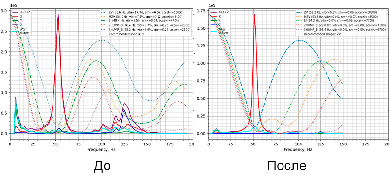

# QIDI Q2

!!! warning "Статья находится в стадии написания и тестирования. Если вы решитесь действовать по этой статье, то вы берёте на себя полную отвественность за все последствия"

!!! note "При возникновении проблем пишите в [телеграм-чат K3D](https://t.me/K_3_D){ target="_blank" }"

## Input Shaping

### Описание проблемы

Штатно у Qidi Q2 есть сразу несколько проблем с калибровкой Input Shaping'а:

1. В конфигурации переопределено значение максимального сглаживания углов, из-за чего рекомендуются завышенные ускорения;
2. Для штатного акселерометра сильно занижена частота дискретизации (400гц вместо 1600гц), из-за чего тот снимает показания неправильно и на АЧХ рисует сильные вибрации в районе низких частот (10-20гц);
3. Направляющие оси Y недостаточно жёсткие из-за чего частота шейперов в центре стола и с переднего/заднего краёв сильно отличаются.

Это всё приводит к тому, что шейперы, подобранные с помощью автоматической калибровки, в лучшем случае гасят вибрации не полностью и остаётся значимое эхо. Можно это скрыть, сильно занижая скорости и ускорения на внешних периметрах, а также используя композитные материалы или fuzzy skin. Но проблему можно достаточно просто решить изменением настроек прошивки.

### Уменьшение максимальной частоты теста



Проблемы, возникающие из-за низкой частоты дискретизации штатного акселерометра, можно решить, уменьшив максимальную тестируемую частоту Input Shaping'а до 100гц. Это уберёт значительную часть "неправильных" вибраций с графика и увеличит точность автоматического подбора шейперов.

1. В веб-интерфейсе принтера зайдите во вкладку `Конфигурация` и откройте файл `gcode_macro.cfg`;
2. Найдите макрос `SHAPER_CALIBRATE`;
3. Измените в нём значение параметра `FREQ_END` на 100;
4. Сохраните изменения и перезапустите прошивку.

### Избавление от дёрти хаков

Qidi, пытаясь решить проблему с плохо калибрующимся Input Shaping'ом, внесли в прошивку несколько дёрти хаков. Они, к сожалению, проблему не исправляют, а, немного маскируют. Но, если не убрать эти хаки, а проблему решить, то они приведут к подбору неоптимальных шейперов, при которых может быть довольно высокий уровень остаточных вибраций. Чтобы такого не произошло, надо убрать это из прошивки, вернув её работу к штатной:

1. В веб-интерфейсе принтера зайдите во вкладку `Конфигурация` и откройте файл `printer.cfg`;
2. Найдите раздел `resonance_tester`;
3. Закомментируйте строки `accel_per_hz` и `max_smoothing`;
4. Сохраните изменения и перезапустите прошивку.

### Исправление макроса PRINT_START

В стартовом макросе вызывается команда, которая переопределяет установленные в конфигурации параметры Input Shaping'а. Это помешает решить проблему, возникающую из-за недостаточной жёсткости направляющих оси Y. Да и, даже если не решать эту проблему, то углы у деталей будут скругляться сильнее, чем могли бы т.к. ваш щядящий шейпер, например, ZV или MZV, будет автоматически заменён на EI. Поэтому надо либо не пользоваться макросом `PRINT_START`, а прописывать код инициализации печати полностью в слайсере. Либо исправить макрос `PRINT_START`, что будет описано далее:

1. В веб-интерфейсе принтера зайдите во вкладку `Конфигурация` и откройте файл `gcode_macro.cfg`;
2. Найдите макрос `PRINT_START`;
3. Закомментируйте строку `AUTOTUNE_SHAPERS`;
4. (Опционально) Закомментируйте строку `CUT_FILAMENT_1`, если не пользуетесь Qidi Box. Таким образом перед печатью не будет обрезаться филамент, и нож не будет изнашиваться;
5. Сохраните изменения и перезапустите прошивку.

### Установка зависимостей для генерации АЧХ

Для правильной калибровки Input Shaping'а на Q2 придётся пользоваться штатным скриптом клиппера, под который в системе не установлены нужные зависимости. Поэтому необходимо будет их установить. Делается это один раз, потом можно будет генерировать графики сколько угодно раз.

1. Откройте терминал в вашей системе. Например, на Windows можно воспользоваться встроенным в систему PowerShell;
2. Подключитесь к принтеру по SSH. Для этого введите команду:
```
ssh mks@ip_адрес_принтера
```
IP можно посмотреть прямо через экран принтера, он, обычно, имеет вид `192.168.xxx.xxx`;
3. Спросит пароль. Введите `makerbase`. Символы при этом не отображаются, но знаки вводятся;
4. Введите команду
```
pip install numpy, matplotlib
```
5. Со всем соглашайтесь и ждите окончания установки. Если спросит пароль администратора, то введите `makerbase`. После окончания установки дополнительных действий не требуется.

### Калибровка Input Shaping

Из-за того, что направляющим оси Y не хватает жёсткости, частота шейпера по оси X будет зависеть от положения печатающей головы. К примеру, на моём принтере при голове в центре стола рекомендованный шейпер `MZV 51hz`, а при голове вблизи переднего края стола `MZV 73hz`. Если мы применим шейпер, снятый в центре стола, и попробуем с ним попечатать, то на мелких деталях, расположенных в центре стола, всё будет хорошо. Но на крупных деталях, стенки которых располагаются далеко от центра, будет эхо. Поэтому необходимо подобрать шейпер, который будет эффективно гасить вибрации и в центре стола, и вблизи края. Тогда эхо не будет нигде. Делается это относительно просто:

Для начала 

1. Убедитесь, что в файле `printer.cfg` в разделе `resonance_tester` указана точка [135, 135, 10]. Если это не так, то установите такие координаты;
2. Выполните автопарковку `G29`;
3. Снимите данные по оси Х
```
TEST_RESONANCES AXIS=X OUTPUT=raw_data
```
4. Снимите данные по оси Y 
```
TEST_RESONANCES AXIS=Y OUTPUT=raw_data
```
5. В файле `printer.cfg` измените точку, в которой будет происходить калибровка, на [135, 5, 10];
6. Выполните автопарковку `G29`;
7. Снимите данные по оси Х
```
TEST_RESONANCES AXIS=X OUTPUT=raw_data
```

Теперь необходимо будет полученные "сырые" данные скормить скрипту, который строит АЧХ. Для этого:

1. Подключитесь к принтеру по SSH `ssh mks@ip_адрес_принтера`, пароль `makerbase`;
2. Введите команду
```
~/klipper/scripts/calibrate_shaper.py /tmp/raw_data_x*.csv -o ~/printer_data/config/shapers/x.png
```
3. Введите команду
```
~/klipper/scripts/calibrate_shaper.py /tmp/raw_data_y*.csv -o ~/printer_data/config/shapers/y.png
```
4. Зайдите в веб-интерфейс принтера, в раздел `Конфигурация`. Там должна появиться папка `shapers`. В ней вы найдёте сгенерированные амплитудно-частотные характеристики. При этом АЧХ по оси X будет учитывать данные, снятые и с середины, и с края стола. Таким образом, рекомендованный для X шейпер будет хорошо работать по всей области печати, а не только в одной её точке;
5. В веб-интерфейсе введите команду
```
SET_INPUT_SHAPER SHAPER_TYPE_X=... SHAPER_FREQ_X=... SHAPER_TYPE_Y=... SHAPER_FREQ_Y=...`
```
Где в места пропусков впишите полученные типы и частоты шейперов;
6. В веб-интерфейсе введите команду `SAVE_CONFIG`.

!!! note "полученные АЧХ всё-равно будут показывать вибрации на низких частотах, просто в гораздо меньшем масштабе. На самом деле, этих вибраций нет, это просто остатки от артефактов, возникающих из-за низкой частоты дискретизации штатного акселерометра"

## В случае возникновения проблем

К сожалению, в профильных чатах по принтерам Qidi многие почему-то испытывают колоссальные душевные страдания, когда к ним приходят с проблемами, касающимися моих инструкций. Поэтому, если вы пытались что-то сделать со своим принтером, и у вас не получилось, то лучше обратиться в мой [телеграм-чат K3D](https://t.me/K_3_D){ target="_blank" }. Таким образом можно будет убить сразу двух зайцев: я узнаю о наличии какой-то проблемы в инструкции => смогу её исправить, а также мы сохраним душевное здоровье нежнейших из представителей 3д печатников.