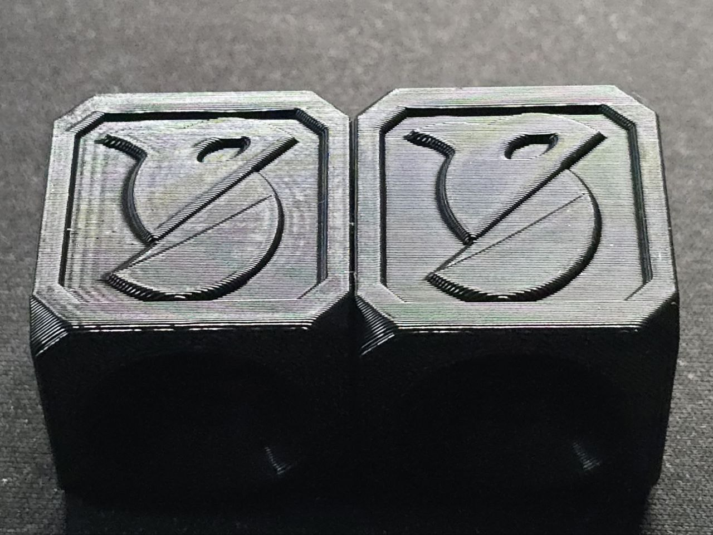
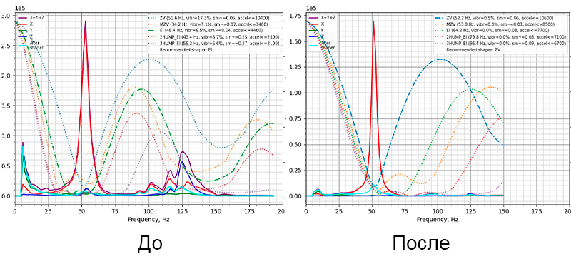

# QIDI Q2

<iframe width="1000" height="560" src="https://www.youtube.com/embed/V9vqKQp8-GM?si=4Ru6LB85Hvs_LVnE" title="YouTube video player" frameborder="0" allow="accelerometer; autoplay; clipboard-write; encrypted-media; gyroscope; picture-in-picture; web-share" referrerpolicy="strict-origin-when-cross-origin" allowfullscreen></iframe>

QIDI Q2 - принтер во многом сырой и требующий приложения рук. Зато он является самым универсальным в своём ценовом сегменте. Обладая областью печати 270х270х256мм, он находится ближе к крупногабаритным, чем к среднегабаритным. При этом внешний габарит и цена принтера ближе к среднеразмерным. А, благодаря открытой прошивке и наличию доступа в систему, любые софтверные проблемы принтера можно легко исправить. Также открытый софт позволяет дорабатывать принтер как душе угодно.

В задачах художественной печати Q2 будет давать отличное качество т.к. механика мало рябит. Но при меньшей относительно конкурентов скорости печати ввиду слабого обдува печатаемой детали. 
В задачах печати эластомерами Q2 продемонстрировал возможность стабильно работать даже с самыми мягкими, и, следовательно, сложными из них. В задачах инженерной печати этот принтер выступает сильно лучше других за счёт целого ряда особенностей. Во-первых, хотэнд греется до 350°C, а стол до 120-125°C, чего достаточно для печати всеми распространёнными видами материалов. Во-вторых, уже с завода стоят калёные шестерни и сопло с кончиком из закалённой стали, что даёт возможность без вложения дополнительных средств печатать инженерными материалами. И, в-третьих, наличие активной термокамеры до 65°C (потенциально до 70°C после доработок) позволяет увеличить прочность деталей до полутора раз относительно открытых принтеров и принтеров с пассивной термокамерой.

Иными словами, если ваши задачи ограничиваются базовой печатью из простых материалов (PLA, PETG и т.п.), то лучше присмотреть другую, менее косячную модель. Если же в вашей практике часто встречаются задачи инжереной печати, задачи печати эластомерами, или вам просто хочется наиболее универсальный принтер, то придётся брать Q2 т.к. других моделей с таким же набором функций за сходные деньги на данный момент не известно.

## Важно!

!!! warning "Выполняя действия из этой статьи, вы берёте всю ответственность за любые последствия на себя. Если не понимаете что делаете, то лучше остановитесь"

!!! example "Работа рекомендаций из статьи была проверена на прошивке версии 1.0.6. Работа на других версиях прошивки не гарантируется"

!!! note "Многие из описанных в этой статье действий будут отменены при обновлении или сбросе прошивки. Поэтому, единожды настроив принтер, рекомендуется не обновлять его прошивку. По крайней мере, если в новой версии нет каких-то очень полезных вещей"

!!! info "При возникновении проблем пишите в [телеграм-чат K3D](https://t.me/K_3_D){ target="_blank" }"

## Избавление от эхо

### Описание проблемы



Штатно у Qidi Q2 есть сразу 2 проблемы с калибровкой Input Shaping'а:

Превая - для штатного акселерометра сильно занижена частота дискретизации (400гц вместо 1600гц), из-за чего тот снимает показания неправильно, с большим количеством артефактов. Из-за них автокалибровщик не может подобрать оптимальные шейперы, и рекомендует неоптимальные, при которых остаётся большое количество эхо.

Вторая - направляющие оси Y недостаточно жёсткие и прогибаются при движении каретки по оси Х. Это приводит к тому, что резонансная частота, которую должен гасить Input Shaping, меняется в зависимости от координаты по оси Y. Иными словами, даже если мы подберём оптимальный шейпер в центре стола, то он будет нормально работать только в центре. На деталях, части которых расположены вблизи краёв, будет сильное эхо.

Был придуман способ откалибровать Input Shaping таким образом, чтобы заниженная частота дискретизации слабо влияла на результат, а также можно было учесть данные с разных точек по оси Y. Но, к сожалению, тесты полученных шейперов показали, что они, хоть и дают достаточно большие максимальные ускорения, но гасят вибрации не полностью. То есть на деталях из глянцевых материалов эхо видно будет. Поэтому на данный момент эта методика не рекомендуется. Вместо этого предлагается просто установить достаточно "жирный" шейпер, который загасит все вибрации начиная примерно с 50Гц. С ним максимальные ускорения будут немного ниже, но зато не надо ничего калибровать и поверхность будет гладкая.

### Рекомендуемый способ исправления

1. Натяните ремни как сказано в инструкции к принтеру;
2. В веб-интерфейсе принтера перейдите в раздел `Конфигурация` и откройте `printer.cfg`;
3. Промотайте в конец файла. Там будет много серых строк, начинающихся с `#*#`. Среди них найдите раздел `[input_shaper]`, который должен выглядеть примерно так:
```
#*# [input_shaper]
#*# shaper_type_x = zv
#*# shaper_freq_x = 50.1
#*# shaper_type_y = zv
#*# shaper_freq_y = 51.3
```
4. Поменяйте значения на следующие:
```
#*# [input_shaper]
#*# shaper_type_x = 2hump_ei
#*# shaper_freq_x = 80
#*# shaper_type_y = 2hump_ei
#*# shaper_freq_y = 80
```
5. Найдите раздел `[printer]`;
6. Поменяйте значение параметра `square_corner_velocity` на 5;
7. Нажмите кнопку `Сохранить и перезагрузить`

Всё, можете печатать с максимальными ускорениями до ~7200 мм/с^2.

Если небольшое эхо на деталях останется, то уменьшите частоты до 75 или 70Гц. Максимальные ускорения при этом составят ~6300 и ~5500 мм/с^2.

### Ручной подбор шейперов по АЧХ



!!! note "Этот метод не рекомендуется для рядового пользователя. Он оставлен в статье только для опытных пользователей, которые хотят попробовать настроить свой принтер получше, или проанализировать его работу"

#### Подготовка

Qidi, пытаясь решить проблему с плохо калибрующимся Input Shaping'ом, внесли в прошивку несколько дёрти хаков. Они, к сожалению, проблему не исправляют, а только лишь немного маскируют. Но, если мы решим проблему, то эти хаки приведут к подбору неоптимальных шейперов, при которых может быть довольно высокий уровень остаточных вибраций. Чтобы такого не произошло, надо убрать это из прошивки, вернув её работу к штатной:

1. В веб-интерфейсе принтера зайдите во вкладку `Конфигурация` и откройте файл `printer.cfg`;
2. Найдите раздел `resonance_tester`;
3. Закомментируйте строки `accel_per_hz` и `max_smoothing`;
4. Найдите раздел `printer`;
5. Измените значение параметра `square_corner_velocity` на 5;
6. Сохраните изменения и перезапустите прошивку.

Для правильной калибровки Input Shaping'а на Q2 придётся пользоваться штатным скриптом клиппера, под который в системе не установлены нужные зависимости. Поэтому необходимо будет их установить. Делается это один раз, потом можно будет генерировать графики сколько угодно раз, пока не переустановите прошивку.

1. Откройте терминал на вашем компьютере. Например, на Windows можно воспользоваться встроенным в систему PowerShell;
2. Подключитесь к принтеру по SSH. Для этого введите команду:
```
ssh mks@ip_адрес_принтера
```
IP можно посмотреть прямо через экран принтера, он, обычно, имеет вид `192.168.xxx.xxx`;
3. Спросит пароль. Введите `makerbase`. Символы при этом не отображаются, но знаки вводятся;
4. Введите команду
```
pip install numpy matplotlib
```
5. Со всем соглашайтесь и ждите окончания установки. Если спросит пароль администратора, то введите `makerbase`. После окончания установки дополнительных действий не требуется.

#### Получение данных калибровки

Из-за того, что направляющим оси Y не хватает жёсткости, частота шейпера по оси X будет зависеть от положения печатающей головы. К примеру, на моём принтере при голове в центре стола рекомендованный шейпер `MZV 51hz`, а при голове вблизи переднего края стола `MZV 73hz`. Если мы применим шейпер, снятый в центре стола, и попробуем с ним попечатать, то на мелких деталях, расположенных в центре стола, всё будет хорошо. Но на крупных деталях, стенки которых располагаются далеко от центра, будет эхо. Поэтому необходимо подобрать шейпер, который будет эффективно гасить вибрации и в центре стола, и вблизи края. Тогда эхо не будет нигде.

Второй проблемой являются артефакты из-за заниженной частоты дискретизации штатного акселерометра - те самые вибрации на низких и высоких частотах, которые на АЧХ есть, но на самом деле их нет. К счастью, от этих артефактов очень легко избавиться. Надо всего-лишь ограничить максимальную тестируемую частоту до 100Гц. В рамках данного гайда это делается внутри команд.

1. Выполните автопарковку `G28`;
2. Снимите данные по оси Х в трёх точках: по центру, на пол пути к краю, и около края:
```
TEST_RESONANCES AXIS=X FREQ_START=20 FREQ_END=100 OUTPUT=raw_data POINT=135,135,10
```
```
TEST_RESONANCES AXIS=X FREQ_START=20 FREQ_END=100 OUTPUT=raw_data POINT=135,70,10
```
```
TEST_RESONANCES AXIS=X FREQ_START=20 FREQ_END=100 OUTPUT=raw_data POINT=135,5,10
```
3. Снимите данные по оси Y 
```
TEST_RESONANCES AXIS=Y FREQ_START=20 FREQ_END=100 OUTPUT=raw_data POINT=135,135,10
```

#### Построение АЧХ

Теперь необходимо будет полученные "сырые" данные скормить скрипту, который строит амплитудно-частотные характеристики. Для этого:

1. Подключитесь к принтеру по SSH `ssh mks@ip_адрес_принтера`, пароль `makerbase`;
2. Создайте папку `shapers`, в которой потом появятся файлы:
```
mkdir ~/printer_data/config/shapers
```
3. Введите команду
```
~/klipper/scripts/calibrate_shaper.py /tmp/raw_data_x*.csv -o ~/printer_data/config/shapers/x.png
```
4. Введите команду
```
~/klipper/scripts/calibrate_shaper.py /tmp/raw_data_y*.csv -o ~/printer_data/config/shapers/y.png
```
5. Зайдите в веб-интерфейс принтера, в раздел `Конфигурация`. Там должна появиться папка `shapers`. В ней вы найдёте сгенерированные амплитудно-частотные характеристики. На них в правом-верхнем углу будут указаны подобранные автоподборщиком шейперы. Жирным выделен рекомендуемый шейпер;
6. Перейдите в раздел `Конфигурация` и откройте `printer.cfg`;
7. Промотайте в конец файла. Там будет много серых строк, начинающихся с `#*#`. Среди них найдите раздел `[input_shaper]`, который должен выглядеть примерно так:
```
#*# [input_shaper]
#*# shaper_type_x = zv
#*# shaper_freq_x = 50.1
#*# shaper_type_y = zv
#*# shaper_freq_y = 51.3
```
Поменяйте типы и частоты шейперов в этом разделе на рекомендованные в АЧХ;
9. Сохраните и перезагрузитесь

## Адаптивная карта высот стола

Адаптивная карта высот стола позволяет снимать карту высот только в тех зонах, где будет идти печать. Это позволяет тратить меньше времени на подготовку к печати, а также улучшает первый слой. В штатной конфигурации QIDI поломали работу адаптивной карты высот стола, после чего выключили её. Но её можно довольно легко починить:

1. Откройте терминал на вашем компьютере. Например, на Windows можно воспользоваться встроенным в систему PowerShell;
2. Подключитесь к принтеру по SSH. Для этого введите команду:
```
ssh mks@ip_адрес_принтера
```
IP можно посмотреть прямо через экран принтера, он, обычно, имеет вид `192.168.xxx.xxx`;
3. Спросит пароль. Введите `makerbase`. Символы при этом не отображаются, но знаки вводятся;
4. Удалите поломанную версию плагина KAMP:
```
sudo rm -rf ~/Klipper-Adaptive-Meshing-Purging
```
```
sudo rm -rf ~/printer_data/config/KAMP
```
```
sudo rm -rf ~/printer_data/config/KAMP_settings.cfg
```
Если спросит пароль, то введите `makerbase`. Файлы не обязательно удалять. Если хотите, можете переименовать их любым удобным вам способом;
5. Установите git:
```
sudo apt update
```
```
sudo apt install git
```
Со всем соглашайтесь. Если спросит пароль, то введите `makerbase`;
6. Установите чистую версию KAMP:
```
cd ~/
```
```
git clone https://github.com/kyleisah/Klipper-Adaptive-Meshing-Purging.git
```
```
ln -s ~/Klipper-Adaptive-Meshing-Purging/Configuration printer_data/config/KAMP
```
```
cp ~/Klipper-Adaptive-Meshing-Purging/Configuration/KAMP_Settings.cfg ~/printer_data/config/KAMP_Settings.cfg
```
7. Зайдите в веб-интерфейс принтера и во вкладке `Конфигурация` найдите и откройте файл `KAMP_Settings.cfg`;
8. В нём раскомментируйте (уберите `#` в начале строки) строку `[include ./KAMP/Adaptive_Meshing.cfg]`;
9. [Опционально] если хотите пользоваться адаптивной прочисткой сопла, то раскомментируйте еще и строку `[include ./KAMP/Line_Purge.cfg]`;
10. Установите значение параметра `variable_mesh_margin` на 10;
11. Установите значение параметра `variable_fuzz_amount` на 2;
12. Нажмите кнопку `Сохранить и перезапустить`

После этого адаптивная карта высот стола начнёт работать автоматически, никаких дополнительных действий и настроек не требуется. Адаптивная линия прочистки работать сама по себе не будет. Для неё надо будет еще исправить макрос старта печати, заменив вручную прописанную линию прочистки на макрос `LINE_PURGE`.

## Макросы старта и окончания печати

Стоковые макросы старта и окончания печати составлены неоптимально, и имеют ряд проблем:

- Инициализация печати занимает очень много времени;
- Парковка, выравнивание стола и снятие карты высот происходят до окончательного прогрева стола, что приводит к дефектам первого слоя;
- Половина логики инициализации/окончания печати прописана в макросе, половина в стартовом скрипте. Это нивелирует плюсы что одного, что другого подхода;
- В стартовом скрипте происходит обрезание прутка. Мало того, что для принтеров без QIDI Box это бесполезно, так еще и изнашивает нож.

Поэтому я составил макросы старта и окончания печати, которые призваны решить эти проблемы.

!!! warning "Эти макросы находятся в стадии тестирования. Используя их вы полностью берёте на себя ВСЕ риски"
!!! warning "Эти макросы не подходят к принтерам с QIDI Box"
!!! note "Если вы использовали эти макросы, и они вам понравились, или у вас есть какие-то претензии, то напишите об этом в [телеграм-чат K3D](https://t.me/K_3_D){ target="_blank" }. Обратная связь ускорит тестирование и поможет найти и устранить проблемы"

### Макросы

Скопируйте эти макросы в конец файла gcode_macro.cfg, после чего сохранитесь и перезгрузите прошивку.

```
[gcode_macro POEHALI]
gcode:
    
    
    
    SAVE_VARIABLE VARIABLE=qdc_ai_error_code VALUE='""'
    DISABLE_ALL_SENSOR
    CLEAR_PAUSE
    M140 S{ target_bed }
    M141 S{ target_chamber }
    G28
    M141 S{ target_chamber } # защита от багов. Не трогать
    CLEAR_NOZZLE HOTEND={ target_extruder }
    M190 S{ target_bed }
    M191 S{ target_chamber }
    G28
    M141 S{ target_chamber } # защита от багов. Не трогать
    Z_TILT_ADJUST
    M141 S{ target_chamber } # защита от багов. Не трогать
    BED_MESH_CALIBRATE
    M191 S{ target_chamber } # защита от багов. Не трогать
    M109 S{ target_extruder }
    M220 S100
    M221 S100
    G90
    M83
    G92 E0
    ENABLE_ALL_SENSOR
    set_zoffset
    LINE_PURGE

[gcode_macro HAROSH]
gcode:
    M141 S0
    M140 S0
    M104 S0
    DISABLE_ALL_SENSOR
    G1 E-3 F1800
    G91
    G1 Z3 F600
    G90
    G1 X90 F18000
    G1 Y270 F18000
    
        G1 Z{ printer['gcode_macro PRINTER_PARAM'].max_z_position / 2 }
    
    M220 S100
    G90
    M83
```

!!! warning "Если вы не переустанавливали KAMP, то удалите из макроса `POEHALI` строку `LINE_PURGE`. Прочистку сопла в таком случае выполняйте с помощью печати юбки"

### Стартовый и конечный G-коды

1. Откройте слайсер, которым планируете пользоваться. Макросы протестированы в PrusaSlicer и OrcaSlicer, но, возможно, будут работать и в других основанных на этих двух;
2. Зайдите в профиль принтера, в раздел `G-код принтера`;
3. Замените стартовый G-код на:
```
POEHALI H={first_layer_temperature[0]} B={first_layer_bed_temperature[0]} C={chamber_temperature[0]}
```
4. Замените завершающий G-код на:
```
HAROSH
```
5. Сохраните профиль

## Задваивание Z-offset

Z-offset - это параметр, отвечающий за расстояние от сопла до стола при печати первого слоя. Штатно его значение сохраняется в z-offset датчика автоуровня. Но QIDI, вдобавок к штатному способу, написали еще и свой, который автоматически сохраняет значение в отдельный файл при отмене или окончании печати. В итоге, если вы сохраните значение Z-offset штатным способом, а потом выполните печать, то значение задвоится. Это может привести как к печати первого слоя "в воздухе", так и, что хуже, к тому, что принтер соплом повредит адгезивный лист и, возможно, даже само сопло.

Конечно, можно просто не пользоваться кнопкой сохранения Z-offset'а. Но это не гарантирует того, что в какой-то момент вы случайно на неё не нажмёте и не повредите стол своего принтера. Кроме того, если у вас нет чёткого понимания в какой именно момент происходит это сохранение, а также нет хорошего понимания порядка выполнения скриптов из слайсера, то есть риск вызвать задваивание Z-offset'а использованием каких-либо кастомных макросов или стартовых/конечных G-кодов принтера или материала. Например, G-кодов для установки индивидуальных значений Z-offset для разных типов филаментов. Поэтому рекомендуется отключить автоматическое сохранение Z-offset'а, и пользоваться штатным для klipper'а методом.

1. Откройте файл `gcode_macro.cfg`;
2. Найдите макросы `save_zoffset` и `set_zoffset` и закомментируйте их содержимое:
```
[gcode_macro save_zoffset]
gcode:
    # 
    #    SAVE_VARIABLE VARIABLE=z_offset VALUE={printer.gcode_move.homing_origin.z}
    # 

[gcode_macro set_zoffset]        
gcode:
    # 
    # SET_GCODE_OFFSET Z={z} MOVE=0
```
3. Нажмите `Сохранить и перезапустить`.

После этого любой вызов этих макросов из любых других не будет вызывать ошибку, но при этом и происходить ничего не будет. То есть другие макросы не поломаются, но работа прошивки вернётся к штатной для klipper'а.

## Разный Z-offset для разных материалов

Так как Q2 может печатать очень разными материалами, требующими разные температуры хотэнда, стола и термокамеры, то, ввиду термического расширения хотэнда и деталей механики, для разных материалов нужен будет разный Z-offset. Проще всего прописать его в стартовый и конечный G-коды материала. Таким образом не придётся при каждой замене материала бегать к принтеру и руками подстраивать значение оффсета "на глаз".

1. В слайсере зайдите в профиль материала -> пользовательский G-код (в OrcaSlicer - Дополнительно);
2. В начало стартового скрипта допишите:
```
SET_GCODE_OFFSET Z=... MOVE=0
```
Где в пропуск впишите абсолютное значение вашего Z-offset. Оно написано в веб-интерфейсе или на экране принтера при ручной подстройке;
3. В начало конечного скрипта допишите:
```
SET_GCODE_OFFSET Z=0 MOVE=0
```

!!! warning "Работа этих команд без отключения макросов `save_zoffset` и `set_zoffset` не протестирована"

## Отключение algo_app

!!! abstract "За находку спасибо `rsa`" 

В стоковой прошивке принтера крутится сервис ИИ-фишек типа определения отлипания детали, нахождения посторонних объектов на столе и т.д. Этот сервис, даже будучи отключенным через меню принтера, отжирает очень большое количество ресурсов системы. Из-за этого та в некоторых ситуациях может работать нестабильно + SoC хоста сильно греется. Отключение этого сервиса приведёт к неработоспособности ИИ-фишек. Зато стабильность работы прошивки восстановится, а также снизится температура SoC. В свою очередь, это приведёт к возможности увеличения максимальной температуры термокамеры до 70°C, если захочется.

1. Откройте терминал на вашем компьютере. Например, на Windows можно воспользоваться встроенным в систему PowerShell;
2. Подключитесь к принтеру по SSH. Для этого введите команду:
```
ssh mks@ip_адрес_принтера
```
IP можно посмотреть прямо через экран принтера, он, обычно, имеет вид `192.168.xxx.xxx`;
3. Остановите работу сервиса `algo_app`:
```
sudo systemctl stop algo_app
```
4. Отключите сервис `algo_app`:
```
sudo systemctl disable algo_app
```

## В случае возникновения проблем

К сожалению, некоторые участники профильных чатов по принтерам Qidi испытывают колоссальные душевные страдания, когда к ним приходят с проблемами, касающимися моих инструкций. Поэтому, если вы пытались что-то сделать со своим принтером, и у вас не получилось, то лучше обратиться в мой [телеграм-чат K3D](https://t.me/K_3_D){ target="_blank" }. Таким образом можно будет убить сразу двух зайцев. Во-первых, я узнаю о наличии какой-то проблемы в инструкции и смогу её исправить. А, во-вторых, мы сохраним душевное спокойствие спокойствие самых нежных из обитателей профильных чатов.