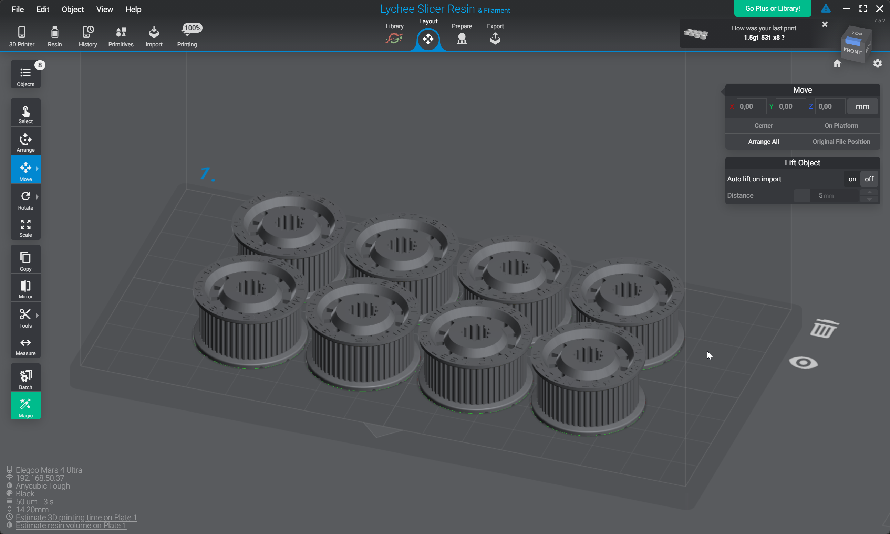

# Шкивы модифицированной геометрии

<iframe width="560" height="315" src="https://www.youtube.com/embed/OiUSk_XVRMw?si=rnjNqec4UyQ7baMe" title="YouTube video player" frameborder="0" allow="accelerometer; autoplay; clipboard-write; encrypted-media; gyroscope; picture-in-picture; web-share" referrerpolicy="strict-origin-when-cross-origin" allowfullscreen></iframe>

Шкивы модифицированной геометрии являются эффективным способом борьбы с рябью. Они не убирают дефект полностью, но уменьшают его амплитуду. В некоторых случаях этого может уже быть достаточно, чтобы довести качество печати до желаемого. В других случаях придётся сочетать эти шкивы с другими методами уменьшения амплитуды ряби - заменой моторов на качественные "не рябящие", изменение кинематики таким образом, чтобы зубчатая часть соприкасалась с как можно меньшим количеством свободных роликов, переходом на 1.5GT ремни и т.д.

На данный момент оптимальным способом изготовления подобных шкивов является их печать на фотополимерном принтере. Причём, если напечатать шкив как таковой, то из-за постоянной нагрузки от установочных винтов, шкив довольно быстро искривится и перестанет нормально работать. Поэтому печатается только зубчатая часть, которая должна насаживаться на покупной металлический шкив.

## Производство и сборка шкива

### Модели шкивов

!!! note "На данный момент выкладываются модели только под ремень шириной 10 миллиметров. Если вам нужен шкив под ремень другой ширины, то вы можете скачать модель в формате STEP и внести изменения самостоятельно"

| Внешняя часть | Модификация | Внутренняя часть | STEP | STL | Примечание |
| :------------ | :---------- | :--------------- | :---: | :---: | :--------- |
| 2GT 20t | -0.2mm | 2GT 12t | [:material-cube-outline:](./files/K3D_2GT-12t_to_2GT-20t_MOD-0.2.stp){ download="K3D_2GT-12t_to_2GT-20t_MOD-0.2.stp" } | [:material-cube-outline:](./files/K3D_2GT-12t_to_2GT-20t_MOD-0.2.stl){ download="K3D_2GT-12t_to_2GT-20t_MOD-0.2.stl" } |  |
| 2GT 40t | -0.2mm | 2GT 12t | [:material-cube-outline:](./files/K3D_2GT-12t_to_2GT-40t_MOD-0.2.stp){ download="K3D_2GT-12t_to_2GT-40t_MOD-0.2.stp" } | [:material-cube-outline:](./files/K3D_2GT-12t_to_2GT-40t_MOD-0.2.stl){ download="K3D_2GT-12t_to_2GT-40t_MOD-0.2.stl" } |  |
| 2GT 40t | -0.2mm | 2GT 20t | [:material-cube-outline:](./files/K3D_2GT-20t_to_2GT-40t_MOD-0.2.stp){ download="K3D_2GT-20t_to_2GT-40t_MOD-0.2.stp" } | [:material-cube-outline:](./files/K3D_2GT-20t_to_2GT-40t_MOD-0.2.stl){ download="K3D_2GT-20t_to_2GT-40t_MOD-0.2.stl" } |  |
| 1.5GT 27t | Нет | 2GT 12t | [:material-cube-outline:](./files/K3D_2GT-12t_to_1.5GT-27t_NO-MOD.stp){ download="K3D_2GT-12t_to_1.5GT-27t_NO-MOD.stp" } | [:material-cube-outline:](./files/K3D_2GT-12t_to_1.5GT-27t_NO-MOD.stl){ download="K3D_2GT-12t_to_1.5GT-27t_NO-MOD.stl" } | Аналог 2GT 20t |
| 1.5GT 27t | -0.15mm | 2GT 12t | [:material-cube-outline:](./files/K3D_2GT-12t_to_1.5GT-27t_MOD-0.15.stp){ download="K3D_2GT-12t_to_1.5GT-27t_MOD-0.15.stp" } | [:material-cube-outline:](./files/K3D_2GT-12t_to_1.5GT-27t_MOD-0.15.stl){ download="K3D_2GT-12t_to_1.5GT-27t_MOD-0.15.stl" } | Аналог 2GT 20t |
| 1.5GT 53t | Нет | 2GT 12t | [:material-cube-outline:](./files/K3D_2GT-12t_to_1.5GT-53t_NO-MOD.stp){ download="K3D_2GT-12t_to_1.5GT-53t_NO-MOD.stp" } | [:material-cube-outline:](./files/K3D_2GT-12t_to_1.5GT-53t_NO-MOD.stl){ download="K3D_2GT-12t_to_1.5GT-53t_NO-MOD.stl" } | Аналог 2GT 40t |
| 1.5GT 53t | -0.15mm | 2GT 12t | [:material-cube-outline:](./files/K3D_2GT-12t_to_1.5GT-53t_MOD-0.15.stp){ download="K3D_2GT-12t_to_1.5GT-53t_MOD-0.15.stp" } | [:material-cube-outline:](./files/K3D_2GT-12t_to_1.5GT-53t_MOD-0.15.stl){ download="K3D_2GT-12t_to_1.5GT-53t_MOD-0.15.stl" } | Аналог 2GT 40t |
| 1.5GT 53t | Нет | 2GT 20t | [:material-cube-outline:](./files/K3D_2GT-20t_to_1.5GT-53t_NO-MOD.stp){ download="K3D_2GT-20t_to_1.5GT-53t_NO-MOD.stp" } | [:material-cube-outline:](./files/K3D_2GT-20t_to_1.5GT-53t_NO-MOD.stl){ download="K3D_2GT-20t_to_1.5GT-53t_NO-MOD.stl" } | Аналог 2GT 40t |
| 1.5GT 53t | -0.15mm | 2GT 20t | [:material-cube-outline:](./files/K3D_2GT-20t_to_1.5GT-53t_MOD-0.15.stp){ download="K3D_2GT-20t_to_1.5GT-53t_MOD-0.15.stp" } | [:material-cube-outline:](./files/K3D_2GT-20t_to_1.5GT-53t_MOD-0.15.stl){ download="K3D_2GT-20t_to_1.5GT-53t_MOD-0.15.stl" } | Аналог 2GT 40t |

### Основы

Ссылки на шкивы, которые используются в качестве основы, вы можете найти в [3D рекомендаторе по деталям механики](../../part-navi/mechanics.md). Вам необходим шкив с типом и количеством зубов как указано в колонке `внутренняя часть`.

### Печать и сборка

Шкивы спроектированы таким образом, чтобы нормально печататься на фотополимерном принтере "от стола", как на изображении выше.

После печати, отмывки и дозасветки, шкивы просто надеваются на основы, предварительно смазанные клеем. В большинстве случаев для этих задач хватает обычного цианакрилатного клея.

## ЧАВО

### Можно ли модифицировать покупной шкив?

Нет. Несмотря на то, что сама модификация очень проста (просто уменьшается высота зубов), слесарная доработка покупных металлических шкивов невозможна т.к. после неё у зубчиков останутся острые края. Это приведёт к очень быстрому износу ремня. Поэтому на данный момент единственный адекватный способ получить такой шкив - напечатать его.

### Можно ли печатать на FDM принтере?

Можно, но для этого нужно специальное сопло. В идеале 0.15мм, но, возможно, получится и с помощью 0.2мм сопла, если на внешнем периметре использовать уменьшенную ширину линий. Толщину слоя стоит установить как можно меньше, к примеру, 0.05мм.

### Где купить такие шкивы?

Персонально я не занимаюсь производством и продажей таких шкивов. Занимается ли этим кто-то другой я не слежу.

### Нужен шкив с другим кол-вом зубов!

Я сделал модели только популярных размеров шкивов, или размеров, которые необходимы для каких-либо из моих проектов. Если вам требуется другой размер, то вам придётся моделировать такой шкив самостоятельно.