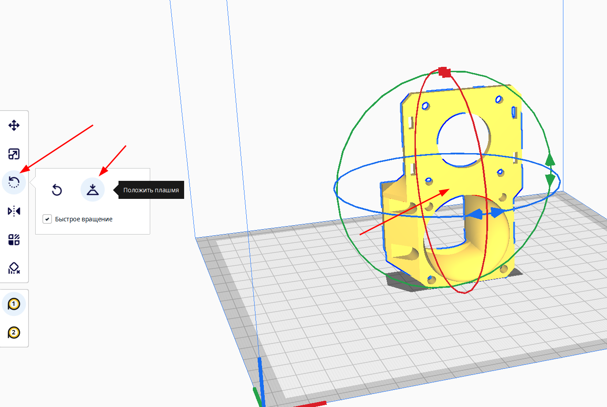
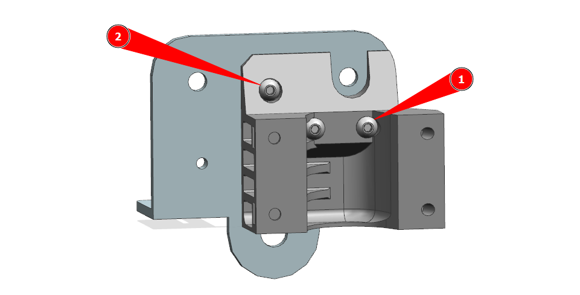

# K3D EBP - Ender-3 BMG Printhead


K3D EBP - открытый проект печатающей головы для Ender-3-подобных принтеров на основе подающего механизма BMG. Плюсами явлюятся простота и дешевизна, а также хороший обдув.

## Скачать

- Под шестигранные гайки М3:
    - [:material-printer-3d-nozzle: Кронштейн для Ender-3](./releases/3.1/k3d_ebp_mount_(hex_nuts).stl){ download="k3d_ebp_mount_(hex_nuts).stl" }
    - [:material-printer-3d-nozzle: Кронштейн для Aquila](./releases/3.2/k3d_ebp_mount_for_aquila_(hex_nuts).stl){ download="k3d_ebp_mount_for_aquila_(hex_nuts).stl" }
    - [:material-printer-3d-nozzle: Корпус](./releases/3.1/k3d_ebp_base_(hex_nuts).stl){ download="k3d_ebp_base_(hex_nuts).stl" }
    - [:material-printer-3d-nozzle: Сопло](./releases/3.1/k3d_ebp_fan_duct_(hex_nuts).stl){ download="k3d_ebp_fan_duct_(hex_nuts).stl" }
- Под вплавляемые втулки:
    - [:material-printer-3d-nozzle: Кронштейн для Ender-3](./releases/3.1/k3d_ebp_mount_(heat-set_inserts).stl){ download="k3d_ebp_mount_(heat-set_inserts).stl" }
    - [:material-printer-3d-nozzle: Кронштейн для Aquila](./releases/3.2/k3d_ebp_mount_for_aquila_(heat-set_inserts).stl){ download="k3d_ebp_mount_for_aquila_(heat-set_inserts).stl" }
    - [:material-printer-3d-nozzle: Корпус](./releases/3.1/k3d_ebp_base_(heat_set_inserts).stl){ download="k3d_ebp_base_(heat_set_inserts).stl" }
    - [:material-printer-3d-nozzle: Сопло](./releases/3.1/k3d_ebp_fan_duct_(heat-set_inserts).stl){ download="k3d_ebp_fan_duct_(heat-set_inserts).stl" }
- Крепления BLTouch:
    - [:material-printer-3d-nozzle: Крепление BLTouch для E3D V6](./releases/3.1/k3d_ebp_bltouch_mount_(v6).stl){ download="k3d_ebp_bltouch_mount_(v6).stl" }
    - [:material-printer-3d-nozzle: Крепление BLTouch для E3D Volcano](./releases/3.1/k3d_ebp_bltouch_mount_(volcano).stl){ download="k3d_ebp_bltouch_mount_(volcano).stl" }
- Сборка: 
    - [:material-video-3d: Сборка STEP](./releases/3.2/k3d_ebp_v3.2.stp){ download="k3d_ebp_v3.2.stp" }

Старые версии можно найти на странице [Релизы](./releases.md)

## Покупка деталей

Для сборки этой печатающей головы вам понадобится купить необходимые детали. Актуальные ссылки на всё нужное вы можете найти в разделах 3D рекомендатора:

- [:material-printer-3d-nozzle: Детали экструдеров](../../part-navi/extruder.md){ target="_blank" }
- [:fontawesome-solid-microchip: Электроника](../../part-navi/electronics.md){ target="_blank" }

### Детали экструдера и системы охлаждения

| Наименование | Кол-во | Примечание |
|:------------:|:------:|:---------- |
| Клон BMG | 1 | Предпочтительный способ - купить дешевый клон, например, от 5А, и перепечатать ему корпус на [BeMeGe](../bemege/index.md){ target="_blank" }. Но также можно купить дорогой клон с относительно качественным корпусом |
| Мотор Nema17 20-23 мм | 1 | Можно использовать мотор, уже имеющийся на принтере. Но часто там либо моторы неподходяшего размера, либо запрессован шкив, который сложно снять. В таком случае мотор проще купить |
| Радиатор E3D V6 | 1 | Хотэнд проще и дешевле собрать по частям, чем искать сразу готовый |
| Биметаллический термобарьер E3D V6 | 1 | Можно использовать и титановый, но биметалл лучше по характеристикам |
| Хитблок E3D V6 или Volcano | 1 | Рекомендуется Volcano т.к. более производительный, а минусов нет |
| Сопло | - | Сопла, соответствующие выбранному хитблоку. Обычно достаточно взять 1 медное с калёной вставкой 0.4 т.к. через него можно печатать всеми материалами и шириной линии от 0.35 до 0.8 без потери качества |
| Носок | 1 | Силиконовый носок, соответствующий типу хитблока. Нужен чтобы защитить хитблок от резких перепадов температуры при изменении оборотов вентиляторов обдува модели |
| Термистор в гильзе | 1 | Если штатный термистор без гильзы, то надо будет взять такого же типа, но в гильзе. Тип термистора на разных моделях разный, но, чаще всего, это 104GT-2 или NTC100K B3950 |
| Вентилятор 4010 осевой | 0-1 | Если штатный вентилятор отличается по размеру или не устраивает по уровню шума или вибраций |
| Вентилятор 5015 центробежный | 2 |  |
| Понижающий преобразователь 24-12в | 0-1 | Если вентиляторы будут 12в, то для их подключения понадобится понижающий преобразователь. Мощность не важна |

### Основной крепеж

=== "Вариант на шестигранных гайках М3"

    | Наименование | Кол-во | Примечание |
    |:------------ |:------:|:---------- |
    | Винт М3х6 DIN 7380  | 3  |  |
    | Винт М3х10 DIN 7380 | 2  |  |
    | Винт М3х12 DIN 7380 | 4  |  |
    | Винт М3х20 DIN 7380 | 4  |  |
    | Гайка М3 DIN 934    | 10 |  |

=== "Вариант на вплавляемых втулках"

    | Наименование | Кол-во | Примечание |
    |:------------ |:------:|:---------- |
    | Винт М3х6 DIN 7380      | 7  |  |
    | Винт М3х10 DIN 7380     | 2  |  |
    | Винт М3х12 DIN 7380     | 4  |  |
    | Винт М3х20 DIN 7380     | 6  |  |
    | Вплавляемая втулка М3х4 | 14 |  |

### Установка BLTouch/CRTouch

Установка BLTouch/CRTouch опциональна

| Наименование | Кол-во | Примечание |
|:------------:|:------:|:---------- |
| Датчик BLTouch или CRTouch | 1 |  |
| Винт М3х6 DIN 7380 | 2 | Дополнительно к винтам из основного набора |
| Винт М3х16 DIN 7380 | 2 | Заменяют 2 винта М3х12 |

## Печать деталей

### Список деталей

| Наименование | Кол-во | Примечание |
|:------------:|:------:|:----------:|
| Кронштейн (mount) | 1 | |
| Корпус (base) | 1 | |
| Сопло (fan duct) | 2 | Правое и левое сопла зеркальны друг другу, так что используют одну модель, которая отражается уже в слайсере |
| Крепление BLTouch (BLTouch mount) | 0-1 | Крепление опционально и выбирается согласно устанавливаемому хотэнду |

### Как отзеркалить модель

Так как левая модель сопла системы охлаждения зеркальна правой, то придётся отражать вторую модель вручную в слайсере. Другие детали не требуют таких манипуляций.

=== "Prusaslicer"

    

    1. Добавьте два экземпляра правого сопла
    2. В правой панели клик правой кнопкой мыши по любому из пары объектов -> `Set as a separated object`
    3. Правой кнопкой мыши по любому из сопел на столе -> `Mirror` -> `Along X axis`

=== "Cura"

    

    1. Добавьте два экземпляра правого сопла
    2. В левой панели выберите инструмент `Зеркало`
    3. Нажмите на любую из появившихся вокруг модели стрелочку

!!! note "Не забудьте проверить, правильно ли отраженная модель спозиционирована на столе. Если надо, позиционируйте её заново"

### Ориентация моделей


Все модели печатаются без поддержек в указанной на изображении ориентации. Повернуть детали правильным образом можно с помощью инструментов ориентации:

=== "Prusaslicer"

    

    В левом меню инструмент `Place on face` -> клик по поверхности, которой деталь должна соприкасаться со столом

=== "Cura"

    

    В левом меню инструмент `Вращение` -> `Положить плашмя` -> клик по поверхности, которой деталь должна соприкасаться со столом

### Подбор материалов

Детали печатающей головы можно условно разделить на две группы. Первая - сопла системы охлаждения. Практически не испытывают механических нагрузок, но нагружены термически. Так что для их печати не важны прочность и жесткость, но важна термостойкость. В случае, если у вас нет возможности напечатать сопла системы охлаждения из термостойких материалов, их можно напечатать из PETG и обклеить нижнюю часть фольгой. Такие сопла не деформируются при температуре стола до ~90-100°C. Тем не менее, не рекомендуется использовать это решение на постоянной основе.

Остальные детали мало нагружены термически, но сильно механически. Так что для лучших результатов рекомендуется их печать из жестких и прочных материалов.

| Деталь | Предпочтительные материалы | Возможные материалы |
|:------:|:--------------------------:|:-------------------:|
| Корпус | композиты на основе: `PP`, `PA` | `PETG`, `ABS`, `ASA`, `PC`, `PA`, композиты на их основе |
| Кронштейн | композиты на основе: `PP`, `PA` | `PETG`, `ABS`, `ASA`, `PC`, `PA`, композиты на их основе |
| Сопла | `ABS`, `ASA`, `PC`, композиты на их основе | Композиты на основе `PP`, `PA` |
| Крепление BLTouch | Любые материалы, кроме эластомеров | --- |

### Настройки печати

Все детали спроектированы так, что при правильной ориентации не требуют никаких поддержек. Все горизонтальные участки печатаются мостами, которые требуется настроить по [этому видео](https://www.youtube.com/watch?v=Xf8D3R_VADo){ target="blank" }. 

Также не стоит забывать, что от основной массы деталей требуется высокая прочность и жесткость. Так что, если вы собираетесь печатать детали из плохо спекающегося пластика (`ABS`, `ASA`, `PC`), то рекомендуется поднять температуру, замедлить печать, максимально уменьшить обдув. Для хорошо спекающихся материалов (`PETG`, `PA`, `PP`) это не нужно.

Рекомендуемые значения основных параметров:

| Параметр                         | Значение               | Комментарий |
| -------------------------------- |:----------------------:|:-----------:|
| Ширина линий                     | 0.3-0.6 мм             | Для сопел лучше не превышать 0.5 мм |
| Толщина слоя                     | 0.1-0.3 мм             | |
| Толщина периметров, крышки и дна | 2 мм                   | Для сопел 1-2 периметра |
| Заполнение                       | 100%                   | |
| Поддержки                        | Выключить              | |
| Обнаружение мостов               | Включить               | |
| Заполнение зазоров               | Включить               | |
| Генератор периметров             | Arachne | Для сопел очень желательно, так как они тонкостенные. Для остальных деталей не важно |

### Обработка деталей после печати

После печати детали надо обработать. К обычной обработке вроде удаления каймы и подобного добавляется только необходимость удалить мембраны в отверстиях, указанных на картинках ниже. Эти мембраны нужны только для упрощения печати, в сборке они помешают.

=== "Кронштейн (mount)"

    

=== "Корпус (base)"

    

## Сборка

### Подготовка кронштейна (mount)

=== "Вариант на шестигранных гайках М3"

    

    Вставьте 4 гайки в указанные места. Если они плохо держатся, то можно зафиксировать их капельками универсального клея

    !!! warning "Если гайки плохо лезут, то это означает, что вы плохо подобрали настройки печати и либо деталь дала сильную усадку, либо вы печатали с сильной переэкструзией. В таком случае вам придётся дорабатывать деталь вручную или перепечатать её после перенастройки своего принтера"

=== "Вариант на вплавляемых втулках"

    

    Вплавьте 4 резьбовые втулки в указанные отверстия. Обратите внимание, что отверстия справа не ортогональны основным граням детали, а идут под углом. Важно соблюсти этот угол, так как иначе всё может довольно плохо собираться. 

    Если в процессе вплавки втулок пластик попал внутрь резьбы, то пройдите резьбу метчиком М3.

    Если излишки пластика вылезли выше плоскости, которыми примыкают друг к другу кронштейн и корпус, то эти излишки необходимо будет срезать.

### Установка кронштейна (mount)



Установите кронштейн на каретку оси Х своего принтера и закрепите двумя винтами М3х6 (1). После этого закрутите еще один винт М3х6 (2).

Если в каретке вашего принтера нет отверстия под винт (2), то вы можете либо просверлить отвертие и нарезать в нём резьбу самостоятельно, либо пропустить этот шаг. Эта крепежная точка лишь немного увеличивает жесткость крепления, без неё всё будет работать практически так же.

### Подготовка корпуса (base)

=== "Вариант на шестигранных гайках М3"

    

    Вставьте 4 гайки М3 в указанные шестигранные углубления и просуньте их до конца. Если гайки плохо лезут, то можно помочь себе винтами, закрученными со стороны установки сопел системы охлаждения. Если гайки плохо держатся, то их можно зафиксировать капельками универсального клея.

=== "Вариант на вплавляемых втулках"

    

    Вплавьте 8 резьбовых втулок в указанные отверстия. Оси отверстий перпендикулярны поверхностям, так что по углу можете ориентироваться на это.

    Если в процессе вплавки втулок пластик попал внутрь резьбы, то пройдите резьбу метчиком М3.

    Если излишки пластика вылезли выше плоскости, которыми примыкают друг к другу кронштейн и корпус, то эти излишки необходимо будет срезать.

### Сборка экструдера


Экструдер собирается прямо на корпусе печатающей головы. При этом стоит повернуть хитблок таким образом, чтобы расстояние от него до корпуса было как можно больше.

### Установка вентилятора

=== "С установкой BLTouch"

    

    Если вы хотите установить BLTouch, то вентилятор крепится на 4 точки:
    - В точках (1) вентилятор крепится двумя винтами М3х16 через крепление BLTouch
    - В точках (2) двумя винтами М3х12

=== "Без установки BLTouch"

    

    Если вы не хотите устанавливать BLTouch, то вентилятор крепится двумя винтами М3х12 или М3х14 по диагонали.

### Установка экструдера на каретку принтера


Сборка из предыдущего шага устанавливается на кронштейн и прикручивается двумя винтами М3х20 (1) и двумя М3х10 (2). Лучше сначала закрутить винты слева (1), а потом справа (2).

### Подготовка сопел системы охлаждения

=== "Вариант на шестигранных гайках М3"

    

    Установите гайку в указанное углубление. Если гайка плохо держится, то её можно зафиксировать каплей универсального клея.

=== "Вариант для вплавляемых втулок"

    

    Вплавьте резьбовую втулку в указанное отверстие. Если излишки пластика будут выступать, то срежьте их.

### Установка сопел системы охлаждения


Сопла системы охлаждения устанавливаются каждое на пару винтов. Длина винтов зависит от вариант сборки. Для варианта на гайках используются винты М3х12, для варианта на втулках - М3х6.

:warning: У сопел системы охлаждения **нет** регулировки по высоте. Есть два положения: максимально вверх - для V6 хотэнда, максимально вниз - для Volcano хотэнда. 

:warning: Если вам не хватает возможностей перемещения сопел системы охлаждения, то, скорее всего, вы распечатали детали с переэкструзией, допустили очень сильную усадку или допустили провисание нависающих элементов. В этом случае стоит осмотреть деталь на наличие дефектов и либо исправить их, либо перепечатать деталь с лучше подобранными настройками.

### Установка вентиляторов


Установите вентиляторы в сопла системы охлаждения и закрепите их винтами М3х20, по 1 шт. на каждый вентилятор.

### Подключение электроники

Подключение новых элементов зависит от того, что вы меняли, какой у вас принтер и т.д. Поэтому универсальную инструкцию создать не представляется возможным. Тем не менее, некоторые советы по подключению и настройки электроники дать можно:

- Все вмешательства в электронику должны происходить на полностью отключенном от сети принтере;
- Термистор подключается вместо старого, полярность не важна;
- Если вентилятор обдува радиатора 24в, то он подключается напрямую вместо штатного. Полярность важна;
- Если вентилятор обдува радиатора 12в, то он подключается через понижающий преобразователь;
- Если вентиляторы системы охлаждения 24в, то они подключаются параллельно вместо штатного вентилятора обдува модели;
- Если вентиляторы системы охлаждения 12в, то плюс (красный провод) от них подключается в плюс на выходе понижающего преобразователя. Минусы объединяются и подключаются вместо минуса штатного вентилятора, напрямую в плату. Пример можно посмотреть [здесь](https://youtu.be/Ozurs525QfU?t=1050){ target="blank" };

## Что делать после установки

### Внесение изменений в прошивку

В целом, замена экструдера на директ в большинстве случаев не требует вмешательства в прошивку принтера. Исключения только два - если была произведена замена термистора или если был установлен датчик BLTouch, которого ранее не было.

#### Термистор

=== "Marlin"

    В прошивке Marlin требуется внести изменения в файл `Configuration.h`:

    В строке `#define TEMP_SENSOR_0` надо указать номер таблицы. Для NTC100k B3950 - `1`. Для 104GT или 104NT - `5`

    После этого надо пересобрать и установить прошивку. Для разных плат этот процесс различается, так что если вы не знаете как это делается, то вам придётся искать инструкцию самостоятельно.

=== "RepRapFirmware"

    В конфигурации вашего принтера в команде `M308` меняется два параметра:

    | Термистор | T | B |
    |:--------- |:-:|:-:|
    | NTC 100k B3950 | 100000 | 3950 |
    | 104GT или 104NT | 100000 | 4300 |

    Итого команда у вас должна получиться примерно такой:

    ```
    M308 S1 P"e0temp" Y"thermistor" T100000 B4300
    ```

=== "Klipper"

    В файле printer.cfg в разделе `extruder` меняется значение параметра `sensor_type`:

    - Для NTC100k B3950: `Generic 3950`
    - Для 104GT: `ATC Semitec 104GT-2`
    - Для 104NT: `ATC Semitec 104NT-4-R025H42G`

#### BLTouch

Такое положение датчика было выбрано для сохранения доступа к винтам крепления головы, чтобы её было легко снимать на обслуживание. Если этот функционал вам не нужен, то вы можете использовать любое другое крепление для этого проекта, например [это](https://www.thingiverse.com/thing:5569661){ target="blank" }.

Эта инструкция не носит цели объяснить как с нуля сконфигурировать BLTouch для всех прошивок. Такую инструкцию для интересующей вас прошивки вам придётся искать самостоятельно. Здесь я лишь опишу несколько параметров, специфичных именно для крепления K3D EBP.

=== "Marlin"

    В файле `Configuration.h`:

    ```
    #define NOZZLE_TO_PROBE_OFFSET { 4, -43.25, 0 }
    ```

    Вместо нуля можно указать значения Z-offset, если вы его заранее замерили. Если нет, то оставьте это на потом, этот параметр можно менять и извне прошивки.

=== "RepRapFirmware"

    В конфигурации вашего принтера:

    ```
    G31 P25 X4 Y-42.25 Z0
    ```

    Вместо нуля можно указать значения Z-offset, если вы его заранее замерили.

=== "Klipper"

    В файле `printer.cfg`:

    ```
    x_offset: 4
    y_offset: -43.25
    ```

### Калибровки

После внесения изменений в прошивку, стоит заново повторить все калибровки, которые зависят от печатающей головы в следующем порядке:

1. Калибровка стола и Z-offset
2. [Калибровка PID](https://youtu.be/aizbpcZ7LU0){ target="blank" }
3. [Калибровка разрешения экструдера](https://youtu.be/Mga_ezYDTNI){ target="blank" }. Поток можно оставить 100% для начала и калибровать только в случае пере- или недоэкструзии на моделях
4. [Подбор к-фактора Linear Advance](../../calibrations/la/index.md){ target="blank" }
5. [Подбор длины и скорости откатов](../../calibrations/retractions/index.md){ target="blank" }
6. [Подбор частоты Input shaping](https://youtu.be/ZFPkfZEB-XU){ target="blank" } (если он есть)