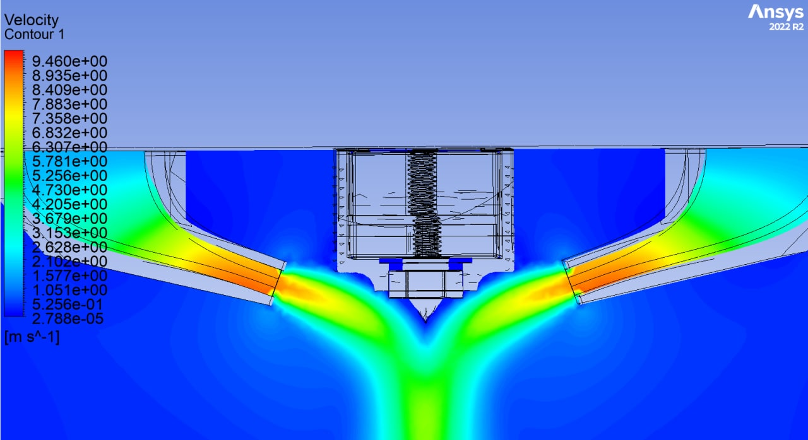
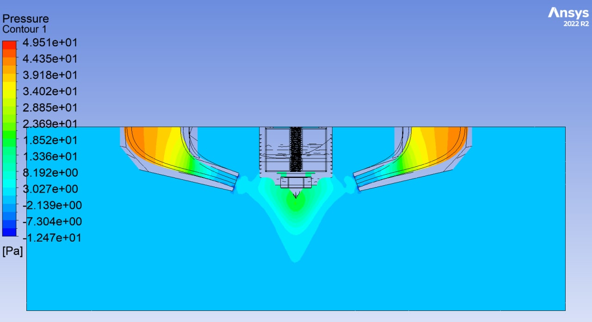
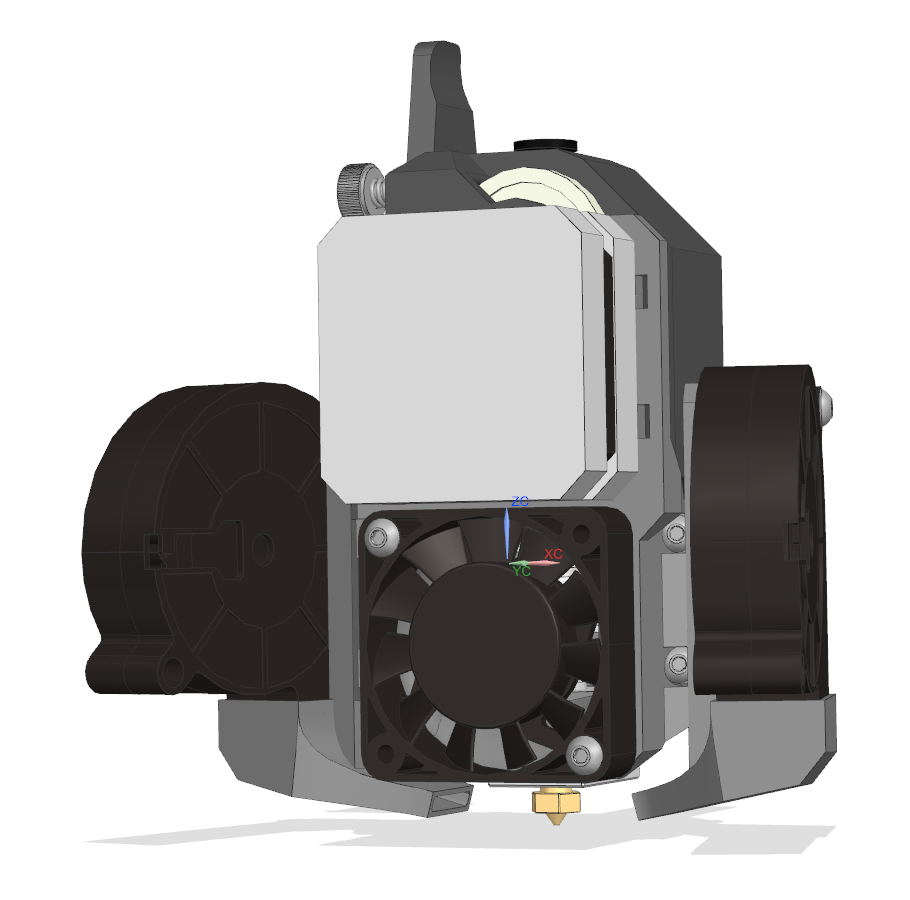
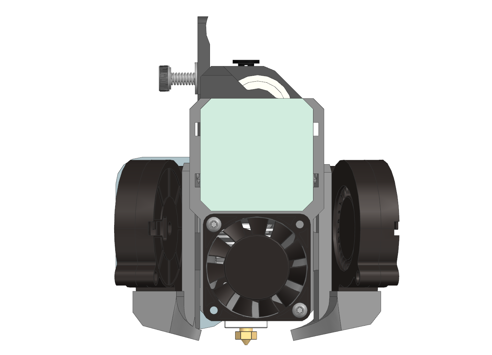

# Релизы K3D EBP

## Последние версии файлов

- Под шестигранные гайки М3:
    - [:material-printer-3d-nozzle: Кронштейн для Ender-3](./releases/3.1/k3d_ebp_mount_(hex_nuts).stl){ download="k3d_ebp_mount_(hex_nuts).stl" }
    - [:material-printer-3d-nozzle: Кронштейн для Aquila](./releases/3.2/k3d_ebp_mount_for_aquila_(hex_nuts).stl){ download="k3d_ebp_mount_for_aquila_(hex_nuts).stl" }
    - [:material-printer-3d-nozzle: Корпус](./releases/3.1/k3d_ebp_base_(hex_nuts).stl){ download="k3d_ebp_base_(hex_nuts).stl" }
    - [:material-printer-3d-nozzle: Сопло](./releases/3.1/k3d_ebp_fan_duct_(hex_nuts).stl){ download="k3d_ebp_fan_duct_(hex_nuts).stl" }
- Под вплавляемые втулки:
    - [:material-printer-3d-nozzle: Кронштейн для Ender-3](./releases/3.1/k3d_ebp_mount_(heat-set_inserts).stl){ download="k3d_ebp_mount_(heat-set_inserts).stl" }
    - [:material-printer-3d-nozzle: Кронштейн для Aquila](./releases/3.2/k3d_ebp_mount_for_aquila_(heat-set_inserts).stl){ download="k3d_ebp_mount_for_aquila_(heat-set_inserts).stl" }
    - [:material-printer-3d-nozzle: Корпус](./releases/3.1/k3d_ebp_base_(heat_set_inserts).stl){ download="k3d_ebp_base_(heat_set_inserts).stl" }
    - [:material-printer-3d-nozzle: Сопло](./releases/3.1/k3d_ebp_fan_duct_(heat-set_inserts).stl){ download="k3d_ebp_fan_duct_(heat-set_inserts).stl" }
- Крепления BLTouch:
    - [:material-printer-3d-nozzle: Крепление BLTouch для E3D V6](./releases/3.1/k3d_ebp_bltouch_mount_(v6).stl){ download="k3d_ebp_bltouch_mount_(v6).stl" }
    - [:material-printer-3d-nozzle: Крепление BLTouch для E3D Volcano](./releases/3.1/k3d_ebp_bltouch_mount_(volcano).stl){ download="k3d_ebp_bltouch_mount_(volcano).stl" }
- Сборка: 
    - [:material-video-3d: Сборка STEP](./releases/3.2/k3d_ebp_v3.2.stp){ download="k3d_ebp_v3.2.stp" }

## V3.2

### Изменения в версии

- Добавлены версии кронштейна под каретку Voxelab Aquila

### Скачать

- [:material-printer-3d-nozzle: Кронштейн для Voxelab Aquila под шестигранные гайки](./releases/3.2/k3d_ebp_mount_for_aquila_(hex_nuts).stl){ download="k3d_ebp_mount_for_aquila_(hex_nuts).stl" }
- [:material-printer-3d-nozzle: Кронштейн для Voxelab Aquila под вплавляемые втулки](./releases/3.2/k3d_ebp_mount_for_aquila_(heat-set_inserts).stl){ download="k3d_ebp_mount_for_aquila_(heat-set_inserts).stl" }
- [:material-video-3d: Сборка STEP](./releases/3.2/k3d_ebp_v3.2.stp){ download="k3d_ebp_v3.2.stp" }

## V3.1

### Изменения в версии

=== "Скорость"

    

=== "Давление"

    

- Добавлены версии деталей под вплавляемые втулки
- Добавлено крепление BLTouch
- Незначительно изменена геометрия деталей `base` и `mount`
- Значительно увеличено выходное сечение вентиляторов. Обдув расчитан заново

### Скачать

- Под шестигранные гайки М3:
    - [:material-printer-3d-nozzle: Кронштейн для Ender-3](./releases/3.1/k3d_ebp_mount_(hex_nuts).stl){ download="k3d_ebp_mount_(hex_nuts).stl" }
    - [:material-printer-3d-nozzle: Корпус](./releases/3.1/k3d_ebp_base_(hex_nuts).stl){ download="k3d_ebp_base_(hex_nuts).stl" }
    - [:material-printer-3d-nozzle: Сопло](./releases/3.1/k3d_ebp_fan_duct_(hex_nuts).stl){ download="k3d_ebp_fan_duct_(hex_nuts).stl" }
- Под вплавляемые втулки:
    - [:material-printer-3d-nozzle: Кронштейн для Ender-3](./releases/3.1/k3d_ebp_mount_(heat-set_inserts).stl){ download="k3d_ebp_mount_(heat-set_inserts).stl" }
    - [:material-printer-3d-nozzle: Корпус](./releases/3.1/k3d_ebp_base_(heat_set_inserts).stl){ download="k3d_ebp_base_(heat_set_inserts).stl" }
    - [:material-printer-3d-nozzle: Сопло](./releases/3.1/k3d_ebp_fan_duct_(heat-set_inserts).stl){ download="k3d_ebp_fan_duct_(heat-set_inserts).stl" }
- Крепления BLTouch:
    - [:material-printer-3d-nozzle: Крепление BLTouch для E3D V6](./releases/3.1/k3d_ebp_bltouch_mount_(v6).stl){ download="k3d_ebp_bltouch_mount_(v6).stl" }
    - [:material-printer-3d-nozzle: Крепление BLTouch для E3D Volcano](./releases/3.1/k3d_ebp_bltouch_mount_(volcano).stl){ download="k3d_ebp_bltouch_mount_(volcano).stl" }
- Сборка: 
    - [:material-video-3d: Сборка STEP](./releases/3.1/k3d_ebp_v3.1.stp){ download="k3d_ebp_v3.1.stp" }

## V3

### Изменения в версии

- Переработано крепление детали `base` к детали `mount`. Убрано зацепление печатного выступа, добавлено 2 дополнительных точки крепления
- Левое сопло системы охлаждения теперь зеркально правому

### Скачать

- [:material-printer-3d-nozzle: Крошнтейн](./releases/3.0/mount_v3.stl){ download="mount_v3.stl" }
- [:material-printer-3d-nozzle: Корпус](./releases/3.0/base_v3.stl){ download="base_v3.stl" }
- [:material-printer-3d-nozzle: Сопло](./releases/3.0/fan_duct_v3.stl){ download="fan_duct_v3.stl" }
- [:material-video-3d: Сборка STEP](./releases/3.0/k3d_e3_bmg_v6_printhead.stp){ download="k3d_e3_bmg_v6_printhead.stp" }

## V2

### Скачать

- [:material-printer-3d-nozzle: Кронштейн](./releases/2.0/k3d_ebp_mount_v2.stl){ download="k3d_ebp_mount_v2.stl" }
- [:material-printer-3d-nozzle: Корпус](./releases/2.0/k3d_ebp_base_v2.stl){ download="k3d_ebp_base_v2.stl" }
- [:material-printer-3d-nozzle: Левое сопло](./releases/2.0/k3d_ebp_left_fan_duct_v2.stl){ download="k3d_ebp_left_fan_duct_v2.stl" }
- [:material-printer-3d-nozzle: Правое сопло](./releases/2.0/k3d_ebp_right_fan_duct_v2.stl){ download="k3d_ebp_right_fan_duct_v2.stl" }
