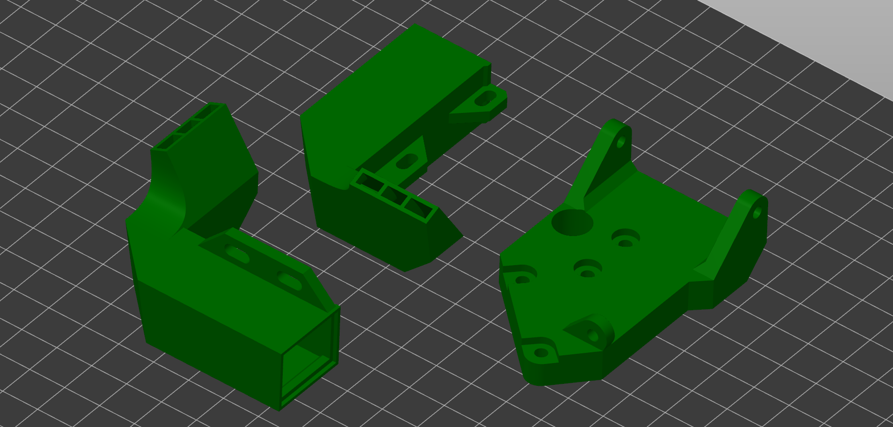
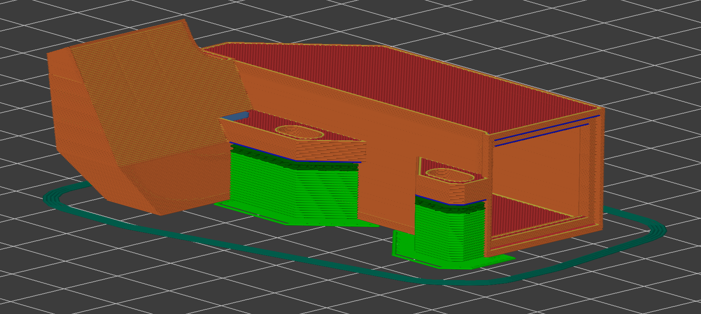
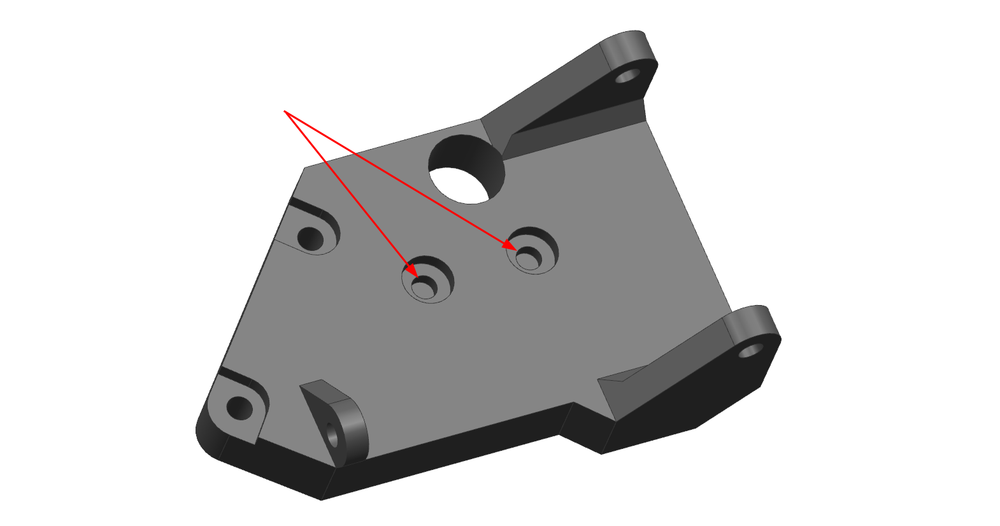
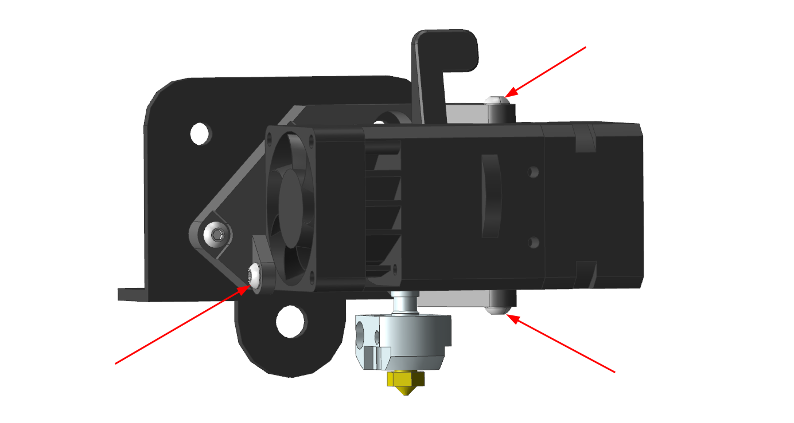
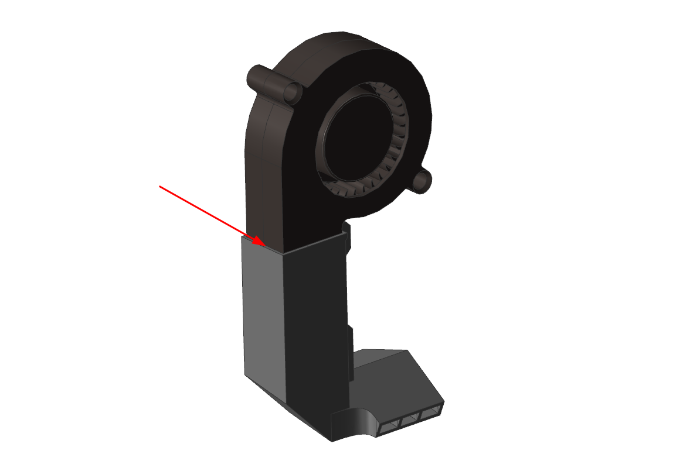
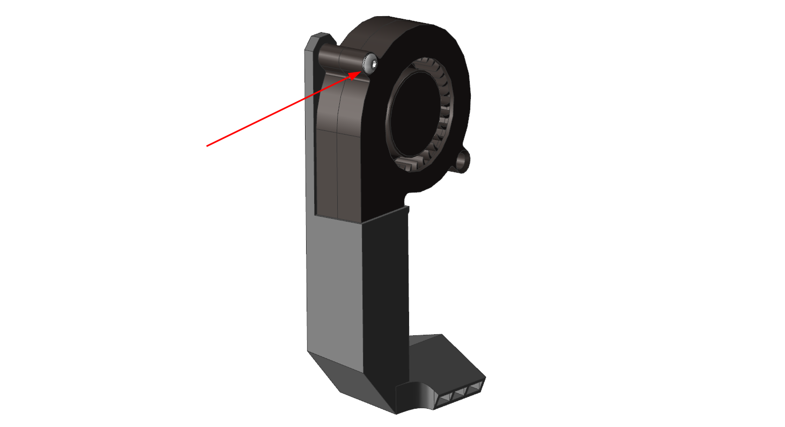
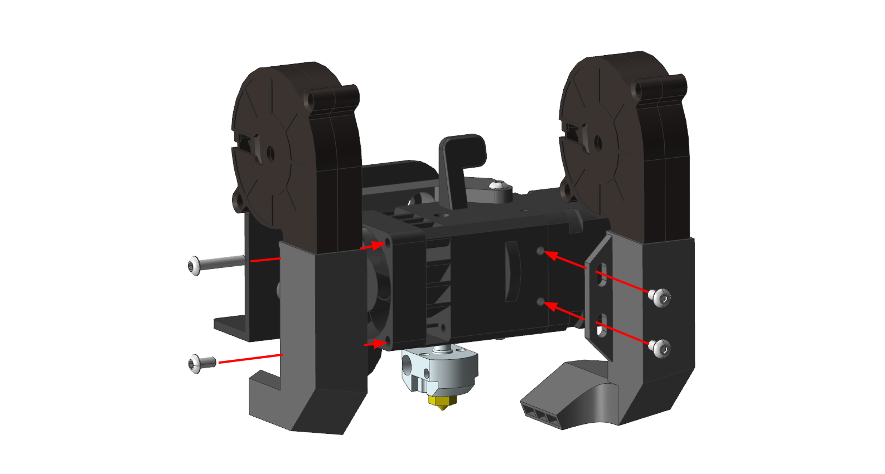

# Инструкция K3D EH2P

## Покупные детали и крепеж

Для Ender-3 и подобных принтеров не имеет смысла переплачивать за облегченную версию, и тем более за версию под Revo сопла.

| Наименование | Кол-во | Ссылки | Примечание |
|:------------ |:------:|:------:|:---------- |
| Biqu H2 V2 | 1 | [:material-shopping:](https://alli.pub/6ttfek?erid=2SDnje8mFCU) | Полный комплект вместе с V6-подобным хотэндом, вентилятором, термистором и нагревателем |
| Сопло E3D V6 медное с калёной вставкой | 0-1 | [:material-shopping:](https://alli.pub/6ttkdn?erid=2SDnjcomwDJ "Mellow") | Если захотите печатать композитными материалами на стоковом хитблоке |
| Хитблок Volcano | 0-1 | [:material-shopping:](https://alli.pub/6ttghu?erid=2SDnjdoWkTi) | Если хочется печатать с большим объёмным расходом. Выбирать `Aluminium` |
| Сопло Volcano латунное | 0-1 | [:material-shopping:](https://alli.pub/6ttkk9?erid=2SDnjdgBrGx "Trianglelab") [:material-shopping:](https://alli.pub/6ttkl8?erid=2SDnjdw1j6Q "Mellow") | Базовое сопло под Volcano хотэнд |
| Сопло Volcano медное с калёной вставкой | 0-1 | [:material-shopping:](https://alli.pub/6ttkml?erid=2SDnjePhWAc "Mellow") | Если хотите печатать композитами на Volcano хотэнде |
| Носок | 0-1 | [:material-shopping:](https://alli.pub/6ttjnl?erid=2SDnjdj89Rz) | Выбирать `Volcano PT100` |
| Вентилятор 5015 | 2 | [:material-shopping:](https://alli.pub/6tuuhm?erid=2SDnjcaM1Xe "Younuon Cooling Store") [:material-shopping:](https://alli.pub/6tku6t?erid=2SDnjefWUPr "RRF 3D Shop") | Первый вариант - подешевле, дуют хорошо, но иногда могут вибрировать. Второй вариант стоит дороже, но лучше во всём |
| Понижающий преобразователь | 0-1 | [:material-shopping:](https://alli.pub/6tustx?erid=2SDnjdEsgQp) | Нужен только в случае, если вы ставите 12в вентилятор в 24в принтер |

!!! warning "Не берите набор сопел всех диаметров. Через сопло 0.4 мм можно давить линии шириной от 0.35 до 0.6 миллиметра вообще без дефектов, до 1 мм с незначительными дефектами. Поэтому одного сопла 0.4 или 0.5 мм хватит на практически все случаи применения"

Также понадобится крепеж. Его состав будет зависеть от того, как вы хотите крепить вентиляторы к соплам системы охлаждения. Рекомендуемый вариант - крепить на термоклей, так как при этом детали проще и легче, а также клей герметизирует соединение. При этом детали, в том числе и вентиляторы, не повреждаются и в любой момент систему охлаждения можно легко разобрать без применения специальных инструментов.

=== "Под крепление вентиляторов на клей"

    | Наименование | Кол-во | Ссылки | Примечание |
    |:------------ |:------:|:------:|:---------- |
    | Винт М3х6 DIN 7380 | 7 | [:fontawesome-solid-basket-shopping:](https://krepcom.ru/catalog/vinty-razdel/vint_3kh6_s_polukrugloy_golovkoy_i_vnutrennim_shestigrannikom_din_7380_nerzh_stal_a2.htm) | Если не планируется установка BLTouch, то на 2 меньше |
    | Винт М3х10 DIN 7380 | 4 | [:fontawesome-solid-basket-shopping:](https://krepcom.ru/catalog/vinty-razdel/vint_3kh10_s_polukrugloy_golovkoy_i_vnutrennim_shestigrannikom_din_7380_nerzh_stal_a2.htm) | |
    | Винт М3х16 DIN 7380 | 2 | [:fontawesome-solid-basket-shopping:](https://krepcom.ru/catalog/vinty-razdel/vint_3kh16_s_polukrugloy_golovkoy_i_vnutrennim_shestigrannikom_din_7380_nerzh_stal_a2.htm) | |
    | Вплавляемая резьбовая вставка | 1 | [:fontawesome-solid-basket-shopping:](http://alli.pub/6hurpt) | | 

=== "Под крепление вентиляторов винтами"
    | Наименование | Кол-во | Ссылки | Примечание |
    |:------------ |:------:|:------:|:---------- |
    | Винт М3х6 DIN 7380 | 7 | [:fontawesome-solid-basket-shopping:](https://krepcom.ru/catalog/vinty-razdel/vint_3kh6_s_polukrugloy_golovkoy_i_vnutrennim_shestigrannikom_din_7380_nerzh_stal_a2.htm) | Если не планируется установка BLTouch, то на 2 меньше |
    | Винт М3х10 DIN 7380 | 4 | [:fontawesome-solid-basket-shopping:](https://krepcom.ru/catalog/vinty-razdel/vint_3kh10_s_polukrugloy_golovkoy_i_vnutrennim_shestigrannikom_din_7380_nerzh_stal_a2.htm) | |
    | Винт М3х16 DIN 7380 | 2 | [:fontawesome-solid-basket-shopping:](https://krepcom.ru/catalog/vinty-razdel/vint_3kh16_s_polukrugloy_golovkoy_i_vnutrennim_shestigrannikom_din_7380_nerzh_stal_a2.htm) | |
    | Винт М3х20 DIN 7380 | 2 | [:fontawesome-solid-basket-shopping:](https://krepcom.ru/catalog/vinty-razdel/vint_3kh20_s_polukrugloy_golovkoy_i_vnutrennim_shestigrannikom_din_7380_nerzh_stal_a2.htm) | | 
    | Вплавляемая резьбовая вставка | 1 | [:fontawesome-solid-basket-shopping:](http://alli.pub/6hurpt) | | 

## Печать

### Ориентация моделей



Модели следует расположить на столе так, как это показано на изображении выше. Для этого следует использовать средства ориентации в вашем слайсере: 

=== "Prusaslicer"

    

    В левом меню инструмент `Place on face` -> клик по поверхности, которой деталь должна соприкасаться со столом

=== "Cura"

    

    В левом меню инструмент `Вращение` -> `Положить плашмя` -> клик по поверхности, которой деталь должна соприкасаться со столом

### Подбор материалов

Детали печатающей головы можно условно поделить на две группы. Первая - сопла системы охлаждения. Практически не испытывают механических нагрузок, но нагружены термически. Так что для их печати не важны прочность и жесткость, но важна термостойкость. В случае, если у вас нет возможности напечатать сопла системы охлаждения из термостойких материалов, их можно напечатать из PETG и обклеить нижнюю часть фольгой. Такие сопла не деформируются при температуре стола до ~90-100°C. Тем не менее, не рекомендуется использовать это решение на постоянной основе.

Остальные детали мало нагружены термически, но сильно механически. Так что для лучших результатов рекомендуется их печать из жестких и прочных материалов.

| Деталь | Предпочтительные материалы | Возможные материалы |
|:------:|:--------------------------:|:-------------------:|
| Кронштейн | композиты на основе: `PP`, `PA` | `PETG`, `ABS`, `ASA`, `PC`, `PA`, композиты на их основе |
| Сопла | `ABS`, `ASA`, `PC`, композиты на их основе | Композиты на основе `PP`, `PA` |

### Настройки печати

Все детали, кроме левого сопла, спроектированы так, что при правильной ориентации не требуют никаких поддержек. Все горизонтальные участки печатаются мостами, которые требуется настроить по [этому видео](https://www.youtube.com/watch?v=Xf8D3R_VADo){ target="_blank" }.



Левое сопло имеет крепежные ушки, которые должны печататься на поддержках. При этом поддержек внутри модели быть не должно. Для этого лучше всего поставить поддержки "только от стола".

Также не стоит забывать, что от основной массы деталей требуется высокая прочность и жесткость. Так что, если вы собираетесь печатать детали из плохо спекающегося пластика (`ABS`, `ASA`, `PC`), то рекомендуется поднять температуру, замедлить печать, максимально уменьшить (или даже выключить) обдув. Для хорошо спекающихся материалов (`PETG`, `PA`, `PP`) это не нужно.

Рекомендуемые значения основных параметров:

| Параметр                         | Значение               | Комментарий |
| -------------------------------- |:----------------------:|:-----------:|
| Ширина линий                     | 0.3-0.6 мм             | Для сопел лучше не превышать 0.5 мм |
| Толщина слоя                     | 0.1-0.3 мм             | |
| Толщина периметров, крышки и дна | 2 мм                   | Для сопел 1-2 периметра |
| Заполнение                       | 100%                   | |
| Поддержки                        | Только от стола        | Для всех деталей, кроме левого сопла, можно выключить |
| Обнаружение мостов               | Включить               | |
| Заполнение зазоров               | Включить               | |
| Генератор периметров             | Arachne                | Для сопел очень желательно, так как они тонкостенные. Для остальных деталей не важно |

## Подготовка деталей

Кроме обычной обработки деталей типа удаления поддержек и т.д., для некоторых деталей требуются дополнительные приготовления

### Подготовка кронштейна



Для того, чтобы кронштейн печатался без поддержек, два отверстия в нём закрыты мембранами. Их следует удалить любым удобным способом: сверлом 3мм, ножом, надфилем и т.д.

### Подготовка вентилятора


Примерьте вентилятор к экструдеру и решите, в какой позиции он будет крепиться к нему. После этого, вплавьте резьбовую вставку в указанное отверстие. Это отверстие не используется для Biqu H2, так что установка резьбовой вставки в него никак не повлияет на работу экструдера.

Если вы по каким-то причинам боитесь вплавлять вставку в вентилятор, то можно заменить один из винтов М3х6 на винт М3х16. Тогда винт будет проходить через это отверстие вентилятора насквозь и его можно будет закрепить обычной шестигранной гайкой с обратной стороны. При этом регулировка вентиляторов по высоте будет заметно затруднена.

## Сборка

### Установка кронштейна


Установите кронштейн на каретку принтера и прикрутите на 4 винта М3х10 с полукруглой головкой.

### Установка экструдера в сборе



Установите экструдер в кронштейн и прикрутите на винты:

- Спереди один винт М3х16 сквозь вентилятор
- Сверху и снизу по одному винту М3х6

### Подготовка сопел системы охлаждения

=== "Под крепление вентиляторов на клей"

    

    Намажьте торец вентилятора 5015 термоклеем и засуньте в углубление в сопле системы охлаждения. Повторите для другого сопла. Излишки клея можно аккуратно обрезать ножом.

=== "Под крепление вентиляторов винтами"

    

    Установите вентилятор 5015 в углубление в сопле и прикрутите винтом М3х18 или М3х20. Повторите для другого сопла.

### Установка BLTouch

!!! note "Если вы не планируете устанавливать BLTouch, то пропустите этот шаг"


Прикрутите датчик BLTouch к кронштейну двумя винтами М3х6.

После этого приклейте кронштейн к левому соплу системы охлаждения так, чтобы направляющие на сопле совпали с выемками на кронштейне. Для пластиков типа `ABS`, `ASA`, `PC` и т.д. подойдёт суперклей (цианоакрилат).

### Установка сопел системы охлаждения



Установите сопла системы охлаждения на экструдер. Левое сопло крепится на 1 винт М3х6 и 1 винт М3х16. Правое сопло крепится на 2 винта М3х6. Не затягивайте крепления на этом этапе.

### Регулировка сопел системы охлаждения


Убедитесь, что сопло хотэнда протянуто на горячую, горло утоплено в радиатор до упора, хотэнд стоит в том положении, в котором он будет работать.

После этого подвиньте экструдер примерно в центр стола и опустите так, чтобы сопло экструдера упёрлось в поверхность. Под сопла системы охлаждения подложите любые элементы около 1мм толщиной, например, скидочные карточки. Убедитесь, что сопла располагаются вертикально, а также касаются карточек. Затяните винты крепления сопел системы охлаждения.

## Подключение электроники

Конкретная схема подключения электрических компонентов нового экструдера зависит от того, на какой принтер вы его устанавливаете. Поэтому создание универсальной схемы невозможно. Тем не менее, дам несколько советов по подключению.

### Нагревательный элемент и термистор

В подавляющем большинстве случаев, нагревательный элемент можно оставить штатный. Если нет, то новый нагреватель подключается вместо штатного без учета полярности.

Если термистор не отличается от штатного по форм-фактору, то можно оставить штатный. Если отличается, то новый термистор подключается вместо штатного без учета полярности.

### Двигатель

Мотор подключается вместо штатного мотора. В большинстве случаев для этого достаточно просто удлинить проводку. Не бойтесь подключить мотор неправильно, это не нанесет ему никакого вреда. После подключения, но перед проверкой, не забудьте отрегулировать ток на мотор экструдера. Некоторую информацию по этому поводу можно найти [в этом видео](https://www.youtube.com/watch?v=MQE7OZ34_eE).

Некоторые распространенные проблемы при подключении:

1. Если мотор вообще не реагирует при подаче команды на его движение, то, скорее всего, вы не прогрели хотэнд. В большинстве прошивок стоит защита от работы экструдера при недостаточной температуре;
2. Если мотор крутится не в ту сторону, то это можно исправить в прошивке. Если это затруднительно, то можно поменять порядок пинов в разъёме на зеркальный;
3. Если мотор стучит и не двигается, или двигается нестабильно со стуком, то:
      1. Поменяйте местами два центральных пина в разъёме мотора (2 и 3 пин);
      2. Если предыдущий совет не помог, то поменяйте местами 1 и 3 пин с любой из сторон;
      3. Если после этого мотор всё еще стучит при вращении, то он либо заблокирован (не может провернуть шестерни экструдера), либо разрыв в кабеле.


### Вентиляторы

Все вентиляторы подключается вместо штатных с обязательным соблюдением полярности. При этом вентиляторы обдува модели подключаются параллельно (все плюсы отдельно, все минусы отдельно).

Если вентиляторы системы охлаждения 12в, а питание принтера 24в, то плюс (красный провод) от них подключается в плюс на выходе понижающего преобразователя. Минусы объединяются и подключаются вместо минуса штатного вентилятора, напрямую в плату. Пример можно посмотреть [здесь](https://youtu.be/Ozurs525QfU?t=1050).

## Прошивка

В целом, замена экструдера на директ в большинстве случаев не требует вмешательства в прошивку принтера. Исключения только два - если была произведена замена термистора или если был установлен датчик BLTouch, которого ранее не было.

### Термистор

=== "Marlin"

    В прошивке Marlin требуется внести изменения в файл `Configuration.h`:

    В строке `#define TEMP_SENSOR_0` надо указать номер таблицы. Для NTC100k B3950 - `1`. Для 104GT или 104NT - `5`

    После этого надо пересобрать и установить прошивку. Для разных плат этот процесс различается, так что если вы не знаете как это делается, то вам придётся искать инструкцию самостоятельно.

=== "RepRapFirmware"

    В конфигурации вашего принтера в команде `M308` меняется два параметра:

    | Термистор | T | B |
    |:--------- |:-:|:-:|
    | NTC 100k B3950 | 100000 | 3950 |
    | 104GT или 104NT | 100000 | 4300 |

    Итого команда у вас должна получиться примерно такой:

    ```
    M308 S1 P"e0temp" Y"thermistor" T100000 B4300
    ```

=== "Klipper"

    В файле printer.cfg в разделе `extruder` меняется значение параметра `sensor_type`:

    - Для NTC100k B3950: `Generic 3950`
    - Для 104GT: `ATC Semitec 104GT-2`
    - Для 104NT: `ATC Semitec 104NT-4-R025H42G`

### BLTouch

Эта инструкция не носит цели объяснить как с нуля сконфигурировать BLTouch для всех прошивок. Такую инструкцию для интересующей вас прошивки вам придётся искать самостоятельно. Здесь я лишь опишу несколько параметров, специфичных именно для крепления K3D EBP.

=== "Marlin"

    В файле `Configuration.h`:

    ```
    #define NOZZLE_TO_PROBE_OFFSET { 0, -25.3, 0 }
    ```

    Вместо нуля можно указать значения Z-offset, если вы его заранее замерили. Если нет, то оставьте это на потом, этот параметр можно менять и извне прошивки.

=== "RepRapFirmware"

    В конфигурации вашего принтера:

    ```
    G31 P25 X0 Y-25.3 Z0
    ```

    Вместо нуля можно указать значения Z-offset, если вы его заранее замерили.

=== "Klipper"

    В файле `printer.cfg`:

    ```
    x_offset: 0
    y_offset: -25.3
    ```

## Калибровки

После внесения изменений в прошивку, стоит заново повторить все калибровки, которые зависят от печатающей головы в следующем порядке:

1. Калибровка стола и Z-offset
2. [Калибровка PID](https://youtu.be/aizbpcZ7LU0)
3. [Калибровка разрешения экструдера](https://youtu.be/Mga_ezYDTNI). Поток можно оставить 100% для начала и калибровать только в случае пере- или недоэкструзии на моделях
4. [Подбор к-фактора Linear Advance](../../calibrations/la/index.md)
5. [Подбор длины и скорости откатов](../../calibrations/retractions/index.md)
6. [Подбор частоты Input shaping](https://youtu.be/ZFPkfZEB-XU) (если он есть)

## Поддержать проект

Проект K3D существует и развивается за счёт поддержки сообществом. Если у вас есть желание поддержать автора и тем самым спонсировать выход новых подобных апгрейдов, то это можно сделать следующим образом:

- [Поддержать из РФ](https://donate.stream/dmitrysorkin)
- [Поддержать из-за рубежа](https://www.donationalerts.com/r/dsorkin)
