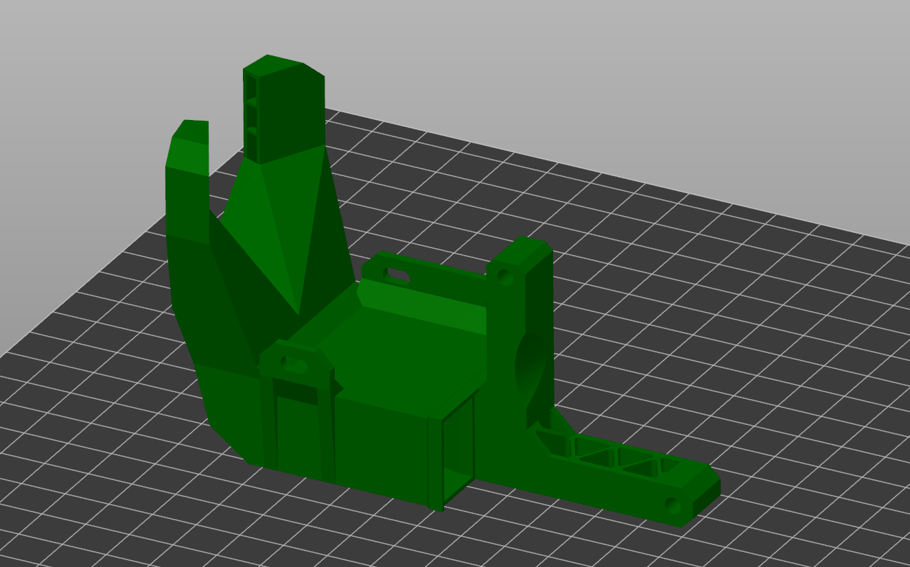
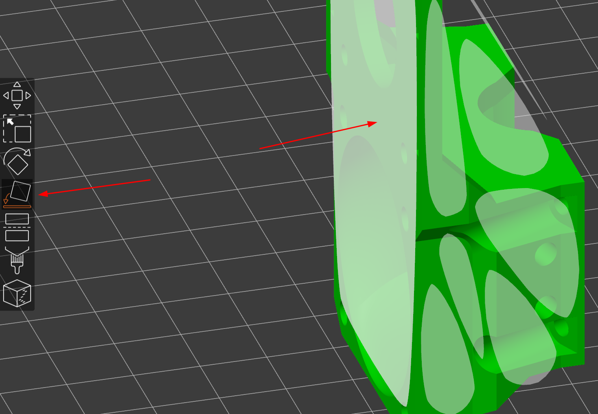
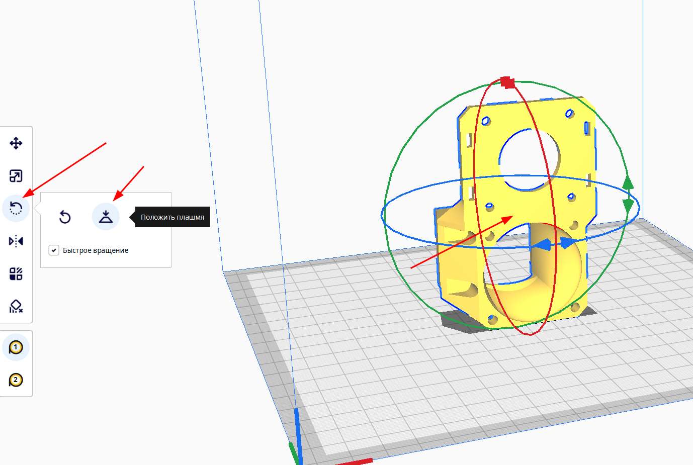
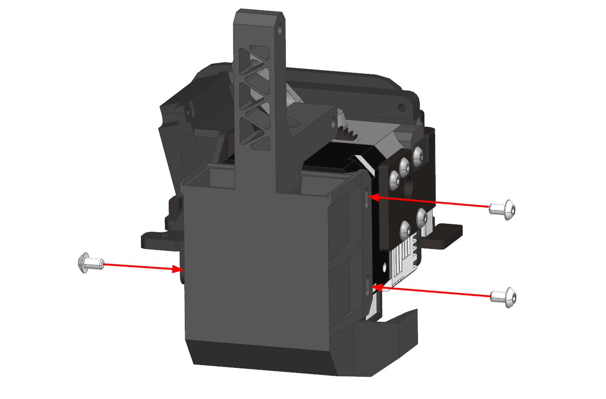
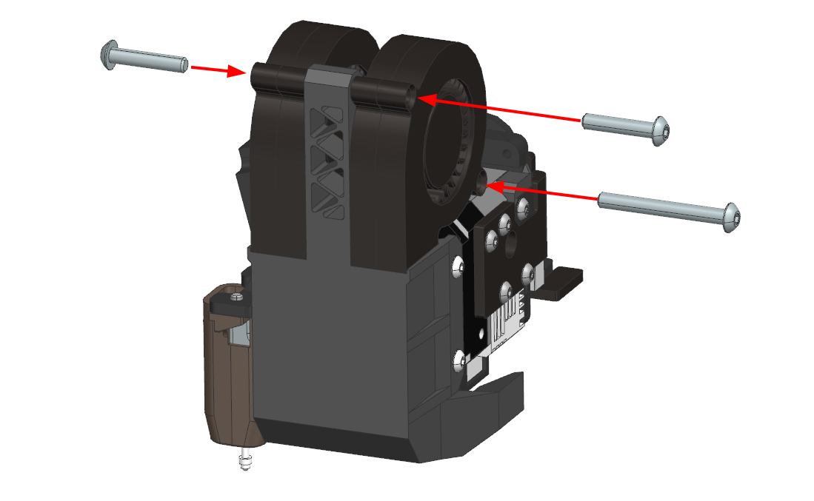
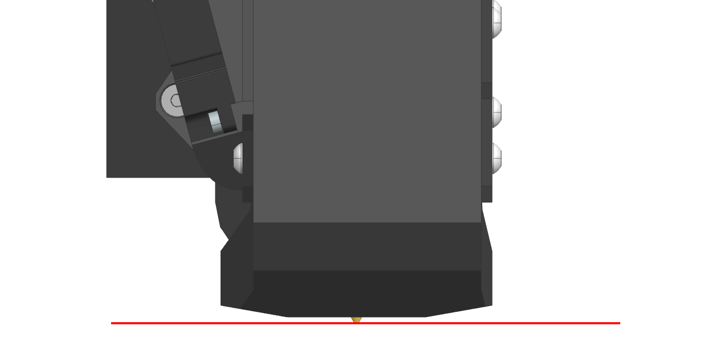

# Установка системы охлаждения на Ender-3 S1/S1 Pro/S1 Plus

## Покупка деталей

| Наименование | Кол-во | Ссылки | Примечание |
|:------------ |:------:|:------:|:---------- |
| Вентилятор 5015 | 2 | [12в](https://alli.pub/6tuuh8?erid=2SDnjcXP2xx "Younuon Cooling Store"){ target="_blank" } / [24в](https://alli.pub/6tuuhm?erid=2SDnjcaM1Xe "Younuon Cooling Store"){ target="_blank" } | |
| Винт М4х20 DIN 7380 | 2 | [:material-shopping:](https://krepcom.ru/catalog/vinty-razdel/vint_4kh20_s_polukrugloy_golovkoy_i_vnutrennim_shestigrannikom_din_7380_nerzh_stal_a2.htm){ target="blank" } |  |
| Винт М4х35 DIN 7380 | 1 | [:material-shopping:](https://krepcom.ru/catalog/vinty-razdel/vint_4kh35_s_polukrugloy_golovkoy_i_vnutrennim_shestigrannikom_din_7380_nerzh_stal_a2.htm){ target="blank" } |  |
| Винт М3х5 DIN 7380 | 3 | [:material-shopping:](https://krepcom.ru/catalog/vinty-razdel/vint_3kh5_s_polukrugloy_golovkoy_i_vnutrennim_shestigrannikom_din_7380_nerzh_stal_a2.htm){ target="blank" } | |
| Коннектор xh1.25 2pin | 2 | [:material-shopping:](https://alli.pub/6vp3s6?erid=2SDnjbvuEBz){ target="blank" } | Опционально. Ссылка не проверена |

## Печать деталей

Для установки системы охлаждения на принтеры Ender-3 S1/S1 Pro/S1 Plus требуется распечатать только сопло системы охлаждения под используемый вами хотэнд.

### Ориентация деталей

Модель следует расположить на столе так, как это показано на изображении выше. Для этого следует использовать средства ориентации в вашем слайсере: 

=== "Prusaslicer"

    
    
    В левом меню инструмент `Place on face` -> клик по поверхности, которой деталь должна соприкасаться со столом

=== "Cura"

    
    
    В левом меню инструмент `Вращение` -> `Положить плашмя` -> клик по поверхности, которой деталь должна соприкасаться со столом

### Материалы и настройки

Сопло системы охлаждения должно быть распечатано из термостойкого материала. Предпочтительные материалы: `ABS`, `ASA`, `PC`, композиты на их основе. Возможные материалы: Композиты на основе `PP`, `PA`.

В случае, если у вас нет возможности распечатать деталь из этих материалов, то в качестве временного варианта можно распечатать из `PETG` и обклеить нижнюю часть фольгой. Такое сопло поплывёт при печати на высокой температуре без охлаждения, но некоторое время можно пережить на таком решении.

Рекомендуемые значения основных настроек печати:

| Параметр                         | Значение               |
| -------------------------------- |:----------------------:|
| Ширина линий                     | 0.3-0.5 мм             |
| Толщина слоя                     | 0.1-0.3 мм             |
| Количество периметров | 1-2                   |
| Поддержки                        | Отключить              |
| Обнаружение мостов               | Включить               |
| Заполнение зазоров               | Включить               |
| Генератор периметров             | Arachne                |

Остальные настройки на ваше усмотрение.

## Сборка

### Подготовка

Для установки системы охлаждения придётся временно снять датчик автоуровня. После установки его можно будет поставить обратно.

### Установка системы охлаждения

Сопло системы охлаждения устанавливается на мотор экструдера и крепится тремя винтами М3х5.

Если система охлаждения распечатана из плохо спекающегося пластика типа ABS и подобных, то может быть хорошей идеей нарезать резьбу метчиком М4 или вплавить резьбовые втулки, так как подобные детали склонны расслаиваться от вкручивания винтов.

### Установка вентиляторов

Вентиляторы крепятся на 2 винта М4х20 в верхние отверстия, и один М4х35 в нижнее отверстие справа. Затягивать винты на этом этапе не нужно.

### Регулировка положения системы охлаждения

Убедитесь, что сопло хотэнда протянуто на горячую, горло утоплено в радиатор до упора, хотэнд стоит в том положении, в котором он будет работать.

После этого подвиньте экструдер примерно в центр стола и опустите так, чтобы сопло экструдера упёрлось в поверхность. Под сопла системы охлаждения подложите любые элементы около 1мм толщиной, например, скидочные карточки. Убедитесь, что сопла располагаются вертикально, а также касаются карточек. Затяните винты крепления сопел системы охлаждения.

### Подключение вентиляторов

Вентиляторы подключается вместо штатных с обязательным соблюдением полярности. При этом вентиляторы обдува модели подключаются параллельно (все плюсы отдельно, все минусы отдельно).

## Прошивка и калибровки

Замена системы охлаждения не требует внесения изменений в прошивку принтера. Также не требуются никакие калибровки.