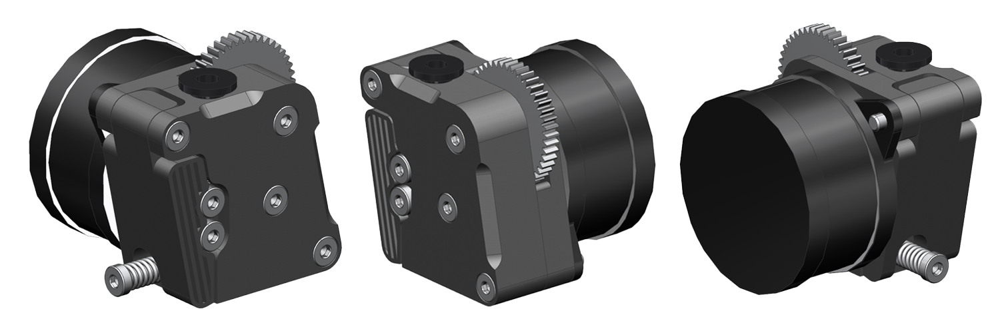
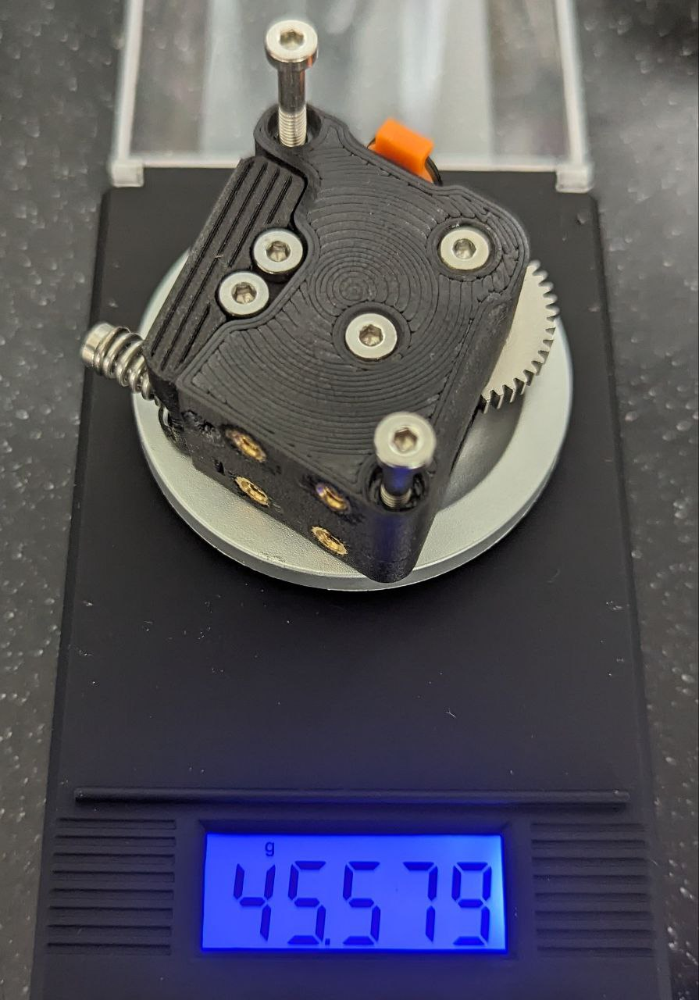

---
hide:
  - toc
title: K3D Feeder965 - описание
description: Открытый проект подающего механизма с крупным подающим колесом
---

# Feeder965

!!! warning "На данный момент проект находится в стадии заморозки"

**Feeder965** - это очень компактный подающий механизм на основе крупного подающего колеса и nema14 мотора.

## Габариты

В ширину **Feeder965** механизм уже 40мм вентилятора, что даёт возможность делать компактные печатающие головы. В глубину сам подающий механизм имеет габарит всего 18мм, что вкупе с 20мм мотором даёт 38мм, а с 17мм мотором - 35мм. То есть с 17мм мотором **Feeder965** оказывается в глубину даже меньше, чем Biqu H2 в ширину.

## Масса

{ width="400" }

Максимальная масса Feeder965 без мотора составляет менее 46г. Относительно высокая масса - следствие применение большого подаюшего колеса, обладающего массой более 10г, большого количества крепежа, а также высокой массы полностью стальной шестерни редуктора. В современных комплектах шестеренок шестерня редуктора идёт композитная, из стали и ПОМ.

Замена подающего колеса на более легкое не представляется возможной. Замена крепежа на более легкий даст уменьшение массы, но выйдет достаточно дорогим, так что нецелесообразно. Замена стальной шестерни редуктора на пластиковую печатную даст облегчение на примерно 8.6г. В таком случае масса подающего механизма составит примерно 37г.

## Другие особенности

{ width="500" }
{ width="500" }

**Feeder965** использует только 1 подающее колесо для того, чтобы исключить дефекты печати, вызванные взаимовлиянием двух подающих колёс. Подробнее про эти дефекты можно посмотреть в  [:simple-youtube: этом видео](https://youtu.be/32dTLRNIYmw).

Прижим осуществляется двумя небольшими подшипниками 63zz. Теоретически, это должно значительно увеличить площадь, участвующую в зацеплении подающего колёса и прутка, что должно сделать печать эластомерами стабильнее. Небольшой размер подшипников выбран для того, чтобы уменьшить расстояние между ними и, соответственно, уменьшить расстояние между точками, в которых пруток прижимается к подающему колесу. Возможна замена двух небольших подшипников на один обычный 623zz или подобный с незначительным изменением конструкции корпуса и качалки.

## Состояние проекта

В ходе тестирования проекта выяснилось, что используемые подающие колёса имеют крайне высокий процент брака из-за неудачного способа производства. Другие подобные подающие колёса тоже не внушают доверия по разным причинам. Учитывая это, а также тот факт, что Feeder965 на данный момент не используется в других проектах, было принято решение заморозить разработку до того момента, пока не появятся высококачественные подающие колёса нужного размера.