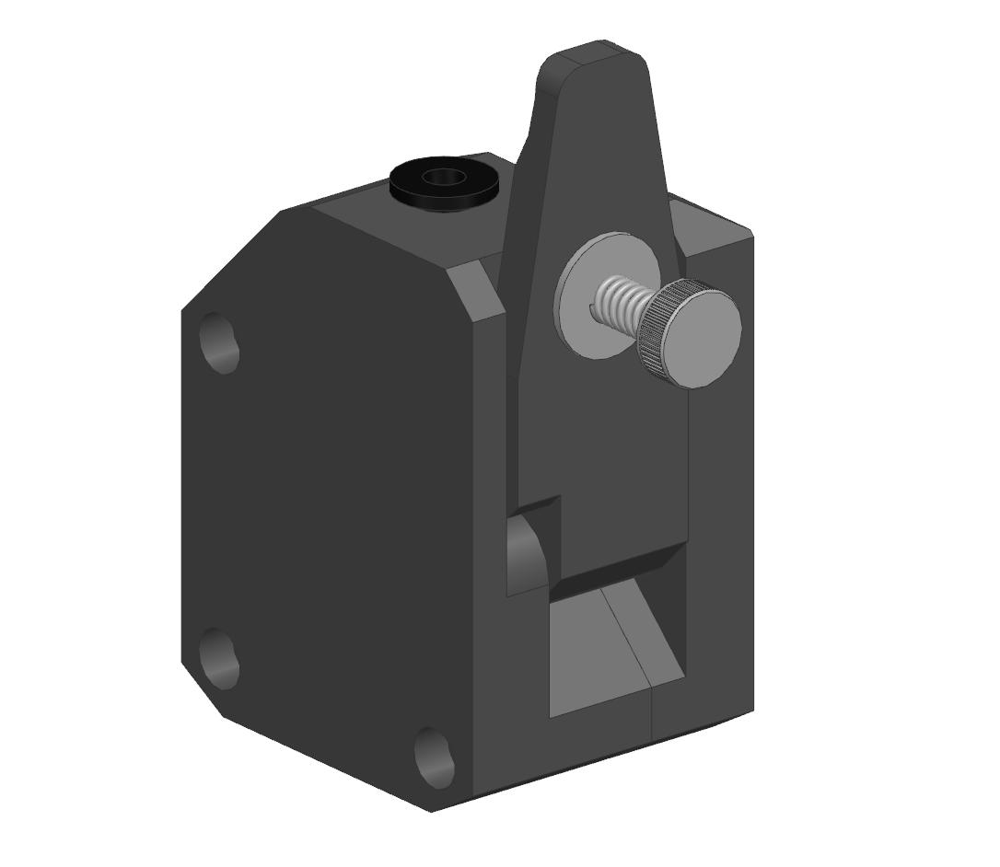
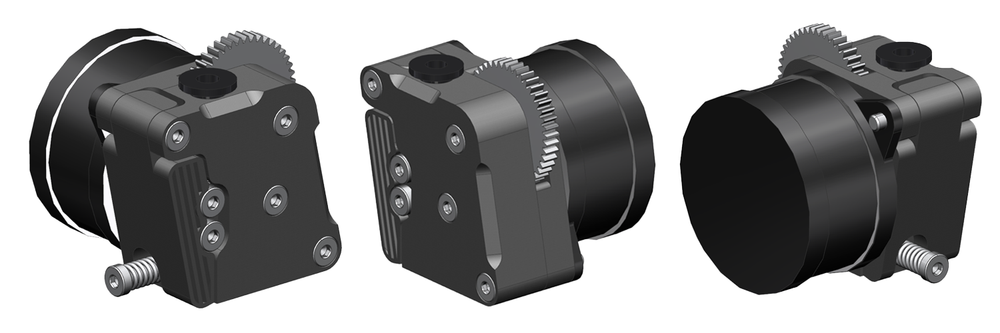

# Подающие механизмы K3D

## BeMeGe

{ width=350 }

**BeMeGe** - это печатный корпус для BMG подающего механизма. Лучше готовых корпусом тем, что можно подогнать так, чтобы не было зазоров и получалось печатать умеренно эластичными материалами.

[:octicons-link-external-16: Перейти к проекту](./bemege/pics/bemege_index.png)

## Minifeeder

**Minifeeder** - подающий механизм на основе BMG подающих колёс. Отличительной особенностью является очень малый габарит и совместимость с Bondtech LGX Lite по креплениям.

[:octicons-link-external-16: Перейти к проекту](./minifeeder/index.md)

## Feeder965

**Feeder965** - экспериментальный проект очень компактного подающего механизма на основе больших HGX подающих колёс. В настоящее время проект заморожен.

[:octicons-link-external-16: Перейти к проекту](./feeder965/index.md)