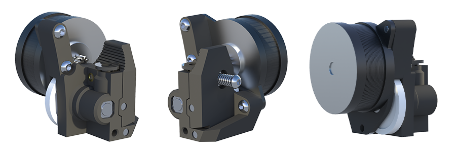
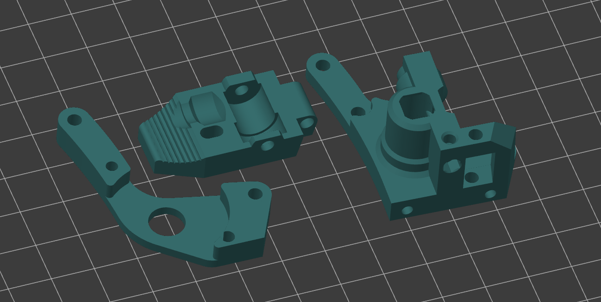
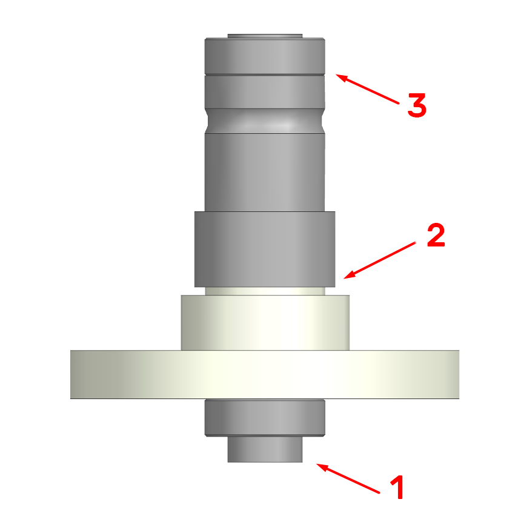
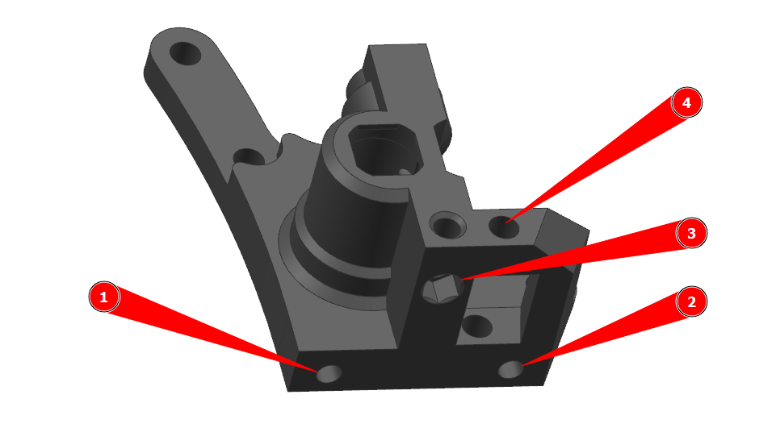
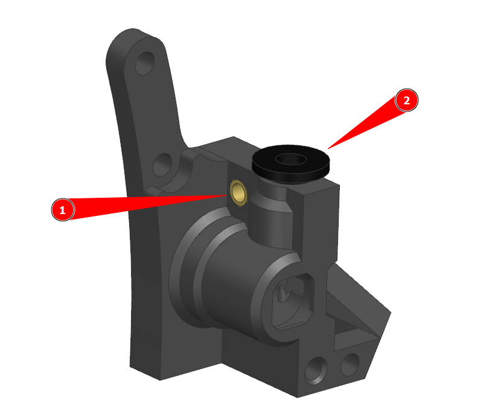
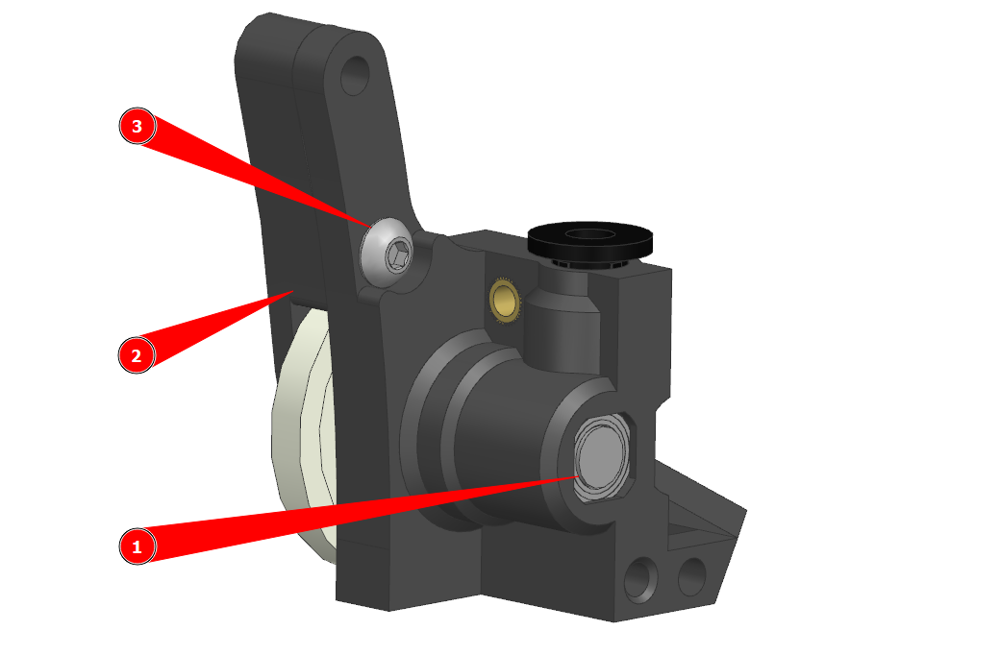
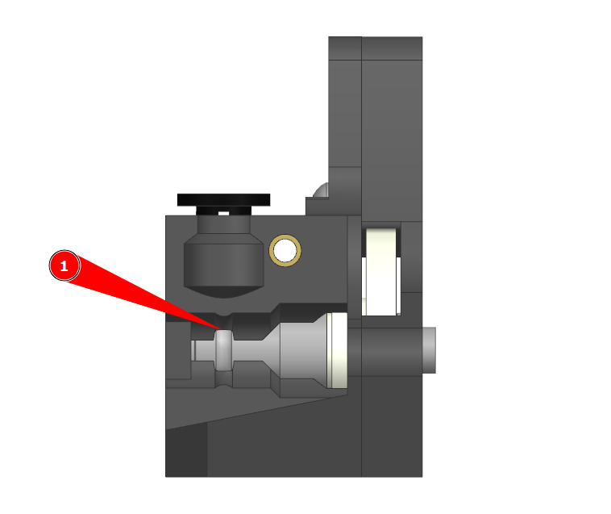
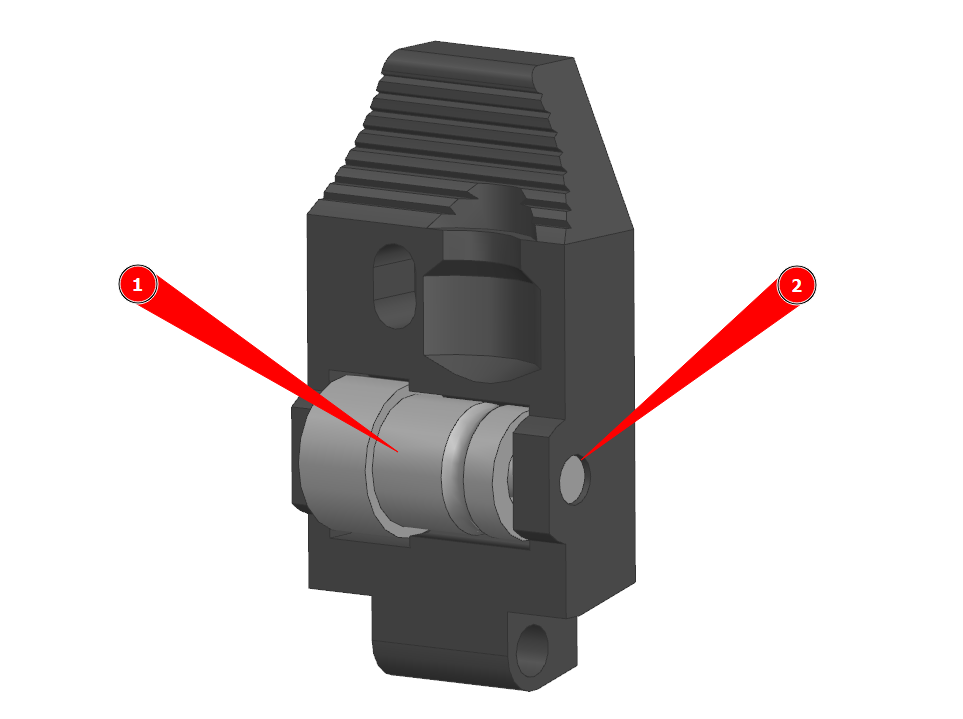
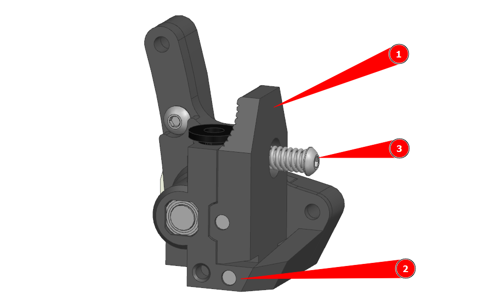
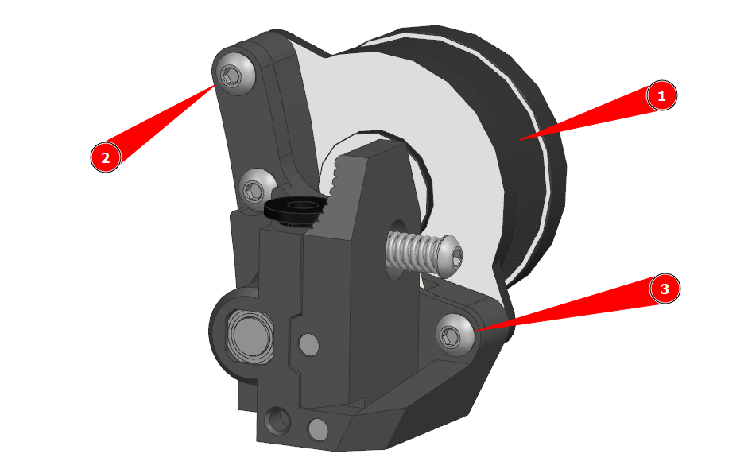

# K3D Minifeeder

**K3D Minifeeder** - это проект подающего механизма, который был спроектирован чтобы заменить LGX Lite на облегченной печатающей голове **K3D VOSTOK**.

- Малый габарит:
  - Ширина: 38,5 мм;
  - Высота: 47 мм;
  - Глубина без мотора: 27 мм;
- Малый вес. Масса с мотором Nema14 17 мм от 100г;
- Канал для прохождения пластика по центру;
- Точки крепления расположены относительно канала как у LGX Lite;
- Печать без поддержек;
- Открытые исходники.

## Скачать

- [:material-printer-3d-nozzle: Minifeeder front](./releases/v3/k3d_mf3_front.stl){ download="k3d_mf3_front.stl" }
- [:material-printer-3d-nozzle: Minifeeder back](./releases/v3/k3d_mf3_back.stl){ download="k3d_mf3_back.stl" }
- [:material-printer-3d-nozzle: Minifeeder lever](./releases/v3/k3d_mf3_lever.stl){ download="k3d_mf3_lever.stl" }
- [:material-video-3d: Minifeeder assembly](./releases/v3/mf-00_-_k3d_minifeeder.stp){ download="mf-00_-_k3d_minifeeder.stp" }

Старые версии можно найти на [странице релизов](./releases.md)

## Подготовка

### Необходимые детали

- Мотор Nema14 длиной 17-20 мм
- Детали от BMG или клона (все шестерни, штифты, подшипники, а также пружина и винт качалки)
- 2шт. Винт M3x10 c полукруглой или цилиндрической головкой
- 1шт. Винт М3x12 с полукруглой или цилиндрической головкой
- 1шт. Резьбовая вставка М3x5

### Необходимые инструменты

- Паяльник или любое другое устройство для установки резьбовых вставок
- Отвертки или ключи для винтов
- Нож
- Сверло 2мм
- (Возможно) Напильник или шкурка

## Печать деталей

### Файлы для печати

Скачать все необходимые файлы можно [на странице релизов](./releases.md)

### Выбор материала

| Деталь | Предпочтительно                | Возможно             | Нежелательно                 |
|:------:|:------------------------------:|:--------------------:|:----------------------------:|
| Back   | `PA`, `PP`, `PC` и композиты   | `ABS`, `ASA`         | `PLA`, `PETG`, `HIPS`        |
| Front  | `PA`, `PP`, `PC` и композиты   | `PETG`         | `ABS`, `ASA`, `PLA`,`HIPS`         |
| Lever  | `PC`, `PA6 GF`  | `ABS`,  `PETG`, `PP GF` | `PA`, `PLA`, `PP`, гибкие филаменты |

### Ориентация моделей

Модели следует расположить как показано на изображении. Все детали печатаются без поддержек. Для того, чтобы горизонтальные элементы печатались мостами, они закрыты мембранами на высоту 1 слоя.

### Рекомендуемые параметры печати

| Параметр                         | Значение    | Комментарий                                             |
| -------------------------------- |:-----------:| ------------------------------------------------------- |
| Ширина линий                     | 0.3-0.5 мм  |                                                         |
| Толщина слоя                     | 0.1-0.25 мм |                                                         |
| Толщина периметров, крышки и дна | 2 мм        |                                                         |
| Заполнение                       | 100%        |                                                         |
| Скорость печати                  | 20-60 мм/с  | Рекомендуется как можно ниже для более точной геометрии |
| Поддержки                        | Выкл.       |                                                         |

## Сборка

### Шаг 1. Подготовка деталей BMG

1.1 Наденьте подшипник на заднюю часть вала. Если вал выступает, то укоротите его так, чтобы он был вровень с подшипником;

1.2 Ослабьте установочный винт на подающей шестерне и сдвиньте её максимально близко к ведомой шестерне редуктора. **Затягивать винт на этом этапе не нужно!**;

1.3 Наденьте подшипник на переднюю часть вала.

### Шаг 2А. Подготовка передней детали

2А.1 Если деталь напечатана из материала с плохой спекаемостью (ABS, ASA, PC и т.д., включая композиты на их основе), то в первую очередь рекомендуется нарезать резьбу в отверстиях (1) и (2). Это единственные места, где закручивание винтов в деталь могут привести к её разрыву по слоям;

2А.2 Пройдите канал (3) подающего механизма сверлом 2 мм, чтобы убрать неровности, возникающие во время печати;

2А.3 Уберите мембрану из отверстия (4).

!!! warning "Внимание!"
  Не рекомендуется использовать резьбовые втулки для отверстий (1) и (2) так как 	толщина стенки слишком мала. Кроме того, практика показала, что втулки часто вырывает из детали так как недостаточно "мяса" вокруг. Если же вы всё-таки хотите использовать втулки, то не забудьте предварительно рассверлить отверстие под нужный диаметр.
    
### Шаг 2Б. Подготовка передней детали

2Б.1 Вплавьте резьбовую втулку в отверстие (1). Лучше это делать со обратной от качалки стороны, чтобы прочность соединения была выше. Если за втулкой набралась горка из пластика, то срежьте её и пройдите отверстие метчиком М3 (или винтом М3, если метчика нет);

2Б.2 Вставьте фиттинг. Он должен без излишнего усилия ходить вверх-вниз.

!!! warning "Внимание!"
  Некоторые вплавляемые втулки большого диаметра могут исказить деталь так, что часть расплавленного пластика сместится в выемку под фиттинг. В таком случае этот пластик придётся убрать с помощью небольшой шарошки. Если таких инструментов у вас нет, то придётся перепечатывать деталь и использовать втулки меньшего диаметра.
    
### Шаг 3. Сборка подающего механизма

3.1 Установите сборку из шага 1 в переднюю деталь. Передний подшипник должен упереться в выступы под него;

3.2 Установите заднюю деталь так, чтобы задний подшипник сборки из шага 1 вошёл в углубление под него;

3.3 Зафиксируйте заднюю деталь винтом М3x10.

### Шаг 4. Регулировка подающего колеса

4.1 Уприте подающую шестерню в передний подшипник и проверьте, совпадает ли канал в шестерне с каналом для прохождения пластика. Если совпадает, или смещение незначительно, то фиксируйте шестерню с помощью установочного винта на ней. Если нет, то, скорее всего, провисли мостики, в которые упирается передний подшипник. В таком случае стоит их аккуратно подрезать так, чтобы всё встало на свои места.

### Шаг 5. Сборка качалки

5.1 Установите ведомое подающее колесо с подшипниками в качалку;

5.2 Зафиксируйте штифтом длинной 19 мм;

5.3 Проверьте вращение ведомого подающего колеса. Оно должно вращаться свободно и не цепляться ни за что.

!!! info "Небольшой люфт вдоль оси заложен конструктивно"

### Шаг 6. Установка качалки

6.1 Установите качалку в переднюю деталь;

6.2 Зафиксируйте штифтом. Если длина штифта больше, чем нужно, то можно не обрезать его, а просто выровнять с передней гранью подающего механизма (пусть торчит под мотор);

6.3 Проверьте движение качалки. Если она вращается свободно, или открывается с небольшим щелчком, то это нормально. Если вращение качалки требует значимого усилия, то лучше рассверлить отверстие под штифт в ней;

6.4 Установите винт с пружиной от BMG.

### Шаг 7. Завершение сборки

7.1 Установите подающий механизм на мотор. Обратите внимание в какую сторону выходят провода. Для использования Minifeeder в VOSTOK лучше, чтобы провода выходили вниз;

7.2 Зафиксируйте винтами М3x12 (2) и М3x10 (3)
