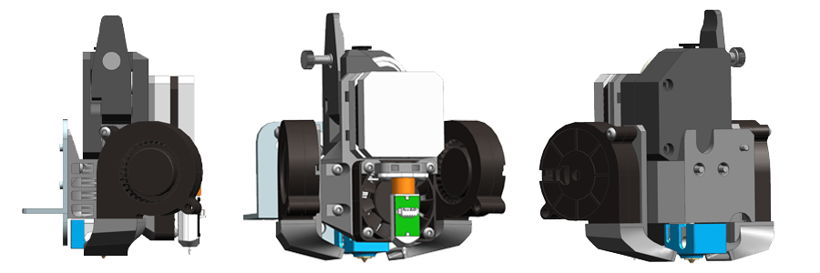

# Проекты печатающих голов K3D

## K3D Ender-3 BMG Printhead (K3D EBP)

**K3D EBP** - проект максимально простой, но при этом хорошо работающей печатющей головы. Целью проекта было использовать как можно больше стандартных деталей и как можно меньше печатных. Как итог, в качестве подающего механизма используется распространенный и дешевый BMG, в качестве хотэнда - стандартные E3D V6 или E3D Volcano, а печатных детали всего 4, каждая из которых печатается без поддержек.

Эта печатающая голова хорошо подходит для тех, кому надо перевести свой Ender-3-подобный принтер на директ экструдер с минимальным вложением средств и времени. При этом этой головы с лихвой хватит для печати всеми твёрдыми материалами без каких-либо проблем. Минусом является ограниченная работа с эластомерами.

[:octicons-link-external-16: Перейти к проекту](./ebp/index.md)

## K3D Ender-3 H2 Printhead

**K3D EHP** - проект продвинутой печатающей головы на основе экструдера Biqu H2. Этот экструдер отлично подходит для печати как твёрдыми, так и очень мягкими эластомерами, но стоит дороже BMG + V6. На данный момент этот экструдер является спорным выбором т.к. компания Biqu прекратила продажу сменных подающих колёс.

[:octicons-link-external-16: Перейти к проекту](./ehp/index.md)

## K3D Ender-3 Sprite Printhead

**K3D ESP** - проект продвинутой печатаюдей головы на основе экструдера Creality Sprite. Со стоковыми подающими колёсами этот экструдер будет отлично печатать твёрдыми материалами. Если заменить подающие колёса на кастомные от Fysetc, то получится печатать даже самыми мягкими и капризными эластомерами.

Эта печатающая голова является оптимальной для перехода на директ на данный момент. Она лучше EBP тем, что может хорошо печатать эластомерами при не сильно большей цене. И лучше EHP тем, что под Sprite в продаже есть все необходимые расходники.

[:octicons-link-external-16: Перейти к проекту](./esp/index.md)