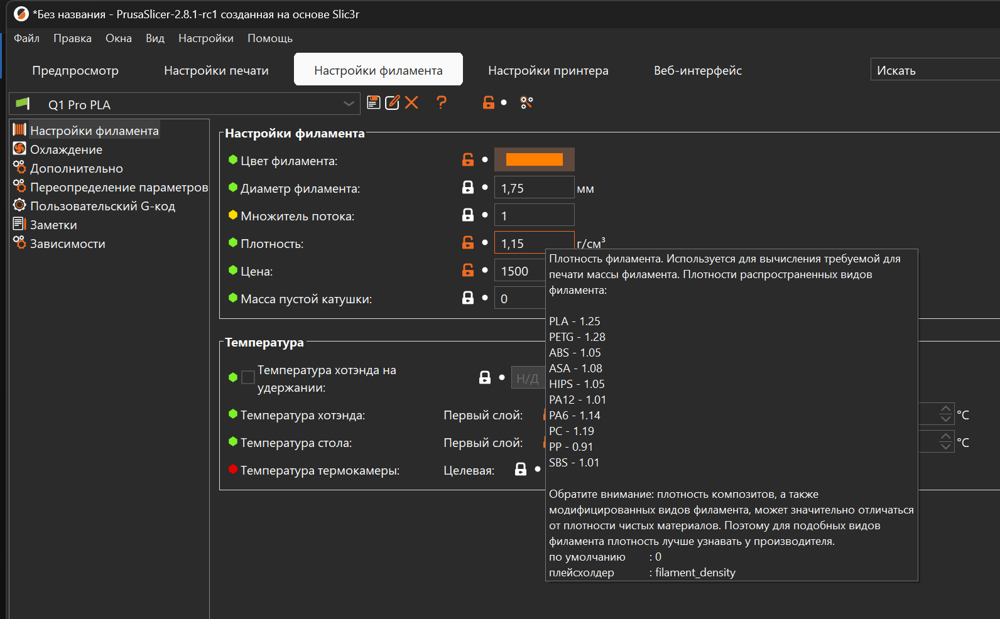

# Правильный перевод PrusaSlicer

## Описание

{ width="600"}

Использовать прюшаслайсер строго в правильном переводе ~~Гоблина~~ Соркина!

Этот перевод PrusaSlicer фактически, является не переводом, а глубокой переработкой всех названий и описаний параметров, а также текста в элементах интерфейса программы. Нужно это для решения сразу нескольких задач:

- Устаревшие и не прижившиеся термины заменены на общепринятые и актуальные. Так проще находить нужный параметр и не возникает проблем с коммуникацией с другими людьми;
- Исправлена проблема, когда одна физическая величина могла называться в разных местах по-разному;
- Непонятные названия параметров и функций переделаны так, чтобы можно было хотя бы понять к чему они относятся;
- Описания почти всех параметров переписаны с нуля. Теперь в них содержится очень большое количество информации о работе функции, зависимостях между разными функциями, рекомендации по подбору значений, стратегии использования, а также дополнительная справочная информация, чтобы не искать её каждый раз в интернете.

## Скачать последнюю версию

- [:material-download: Скачать перевод v2.9.4](./translations/2.9.4.mo){ download="PrusaSlicer.mo" }

## Установка

=== "Windows"

    1. Скачайте файл перевода для вашей версии PrusaSlicer из раздела `Релизы` внизу страницы;
    2. Зайдите в папку, где установлен PrusaSlicer. Обычно это `C:\Program Files\Prusa3D\PrusaSlicer\resources\localization`. Также можно найти этот каталог кликнув ПКМ по ярлыку -> дополнительно -> перейти к расположению файла;
    3. Далее откройте папку `resources/localization`. В ней находятся папки, каждая папка обозначает какой-то язык. Вы можете выбрать любой язык, которым не собираетесь пользоваться, например, испанский (es);
    4. Переместите скачанный файл в эту папку и подтвердите перезапись;
    5. В PrusaSlicer выберите тот язык, который заменяли. Приложение перезапустится само, после чего перевод должен подтянуться.

=== "Mac OS"

    1. Скачайте файл перевода для вашей версии PrusaSlicer из раздела `Релизы` внизу страницы;
    2. Зайдите в папку `Программы`, найдите PrusaSlicer, после чего ПКМ -> `Показать содержимое пакета`;
    3. Далее откройте папку `resources/localization`. В ней находятся папки, каждая папка обозначает какой-то язык. Вы можете выбрать любой язык, которым не собираетесь пользоваться, например, испанский (es);
    4. Переместите скачанный файл в эту папку и подтвердите перезапись;
    5. В PrusaSlicer выберите тот язык, который заменяли. Приложение перезапустится само, после чего перевод должен подтянуться.

=== "Linux"

    1. Скачайте файл перевода для вашей версии PrusaSlicer из раздела `Релизы` внизу страницы;
    2. На Linux файлы PrusaSlicer могут храниться в разных местах в зависимости от дистрибутива и способа установки. Поэтому вам будет необходимо найти папку `resourses` от PrusaSlicer самостоятельно, используя собственные знания или информацию из интернета;
    3. В папке `resources` находятся папки, каждая папка обозначает какой-то язык. Вы можете выбрать любой язык, которым не собираетесь пользоваться, например, испанский (es);
    4. Переместите скачанный файл в эту папку и подтвердите перезапись;
    5. В PrusaSlicer выберите тот язык, который заменяли. Приложение перезапустится само, после чего перевод должен подтянуться.

!!! note "Обновления перевода делаются таким же образом"
!!! note "Заменять можно любой язык, в том числе и русский. Но в общем случае рекомендуется оставить стандартную русскую локализацию без изменений чтобы если что была возможность включить её и посмотреть как тот или иной параметр называется"
!!! note "При замене не русского языка, некоторые всплывающие окна (выбор файла, выбор цвета) будут открываться на том языке, который заменяли. Обычно это не доставляет неудобств т.к. там и без перевода понятно какая кнопка что означает. Но, если вам такое не нравится, то заменяйте русский"

## Сообщить о проблемах

В случае, если вы нашли какие-то неточности или ошибки в переводе, или у вас есть предложения по его улучшению, то вы можете сообщить об этом мне несколькими способами:

- Предпочтительный: в [telegram чате K3D](https://t.me/dsorkin){ target="_blank" } с тегом @dmitry_sorkin
- По e-mail dbsorkin@gmail.com

## ЧаВо

### Почему не в основе?

Есть основной язык приложения, в случае PrusaSlicer - английский. Другие переводы должны быть именно переводами, без отсебятины. А мой "перевод" является даже не переводом, а глубокой переработкой названий и описаний параметров. Так что он и не должен быть в основном составе PrusaSlicer.

Если же кто-то хочет запихнуть результаты этой работы в основу, то сначала надо перевести всё на английский язык. Потом добиться принятия изменений в английские названия и описания параметров. И только после этого можно будет править русский перевод в основном составе PrusaSlicer. У меня, к сожалению, на это не хватит ни свободного времени, ни знаний.

### Будет ли перевод Orca Slicer?

На данный момент не планируется

### Почему не оставить английские названия?

Потому что многие люди не знают английский даже на базовом уровне. Для них английские названия в слайсере будут восприниматься как если знающему английский язык человеку заменить все названия на турецкие, например. Кроме того, это создаст еще целый ряд проблем, от проблем в коммуникации между людьми, до усложнения освоения слайсера новичками.

### Почему нет картинок?

К сожалению, в PrusaSlicer нет возможности вставлять картинки в описания параметров. Если такая возможность появится, то с удовольствием сделаю понятные картинки для описаний.

## Релизы

Релизы промаркированы по номеру версии PrusaSlicer, к которой они подходят. При внесении исправлений и изменений старый файл будет заменен новым т.к. не имеет смысла хранить и распространять старые версии перевода.

### v2.9.4

Время последнего обновления: 16.11.2025 19:07 (GMT+3)

- [:material-download: Скачать перевод v2.9.4](./translations/2.9.4.mo){ download="PrusaSlicer.mo" }
- [:material-download: Исходники перевода v2.9.4](./translations/2.9.4.po){ download="PrusaSlicer_k3d_2.9.4.po" }

### v2.9.0

Время последнего обновления: 19.12.2024 18:43 (GMT+3)

- [:material-download: Скачать перевод v2.9.0](./translations/2.9.0.mo){ download="PrusaSlicer.mo" }
- [:material-download: Исходники перевода v2.9.0](./translations/2.9.0.po){ download="PrusaSlicer_k3d_2.9.0.po" }

### v2.8.1

Время последнего обновления: 19.09.2024 13:15 (GMT+3)

- [:material-download: Скачать перевод v2.8.1](./translations/2.8.1.mo){ download="PrusaSlicer.mo" }
- [:material-download: Исходники перевода v2.8.1](./translations/2.8.1.po){ download="PrusaSlicer_k3d_2.8.1.po" }