---
authors:
  - sorkin
icon: material/image-multiple
title: Галерея
description: Принтеры VOSTOK, собранные участниками сообщества
show_created: false
show_updated: false
show_author: false
---

# 

<article class="gallery-post" markdown>
## &nbsp;v9.x&nbsp; | 380x250 { #post-016 }

-  

    !!! info ""

        - Автор: ЮРИЙ
        - Дата: 2025-09-27
        - [Оригинал в Telegram](https://t.me/k3d_vostok/365247){ target="_blank" }
        - Версия: 9.x
        - Типоразмер: 380x250
        - Хотэнды: CHC Pro

        - Комментарий автора: (1)
          { .annotate }

              1. Спустя почти год печати без зашивки его наконец-то одели. 🎉 Область печати 250х380х250. BTT Octopus,ТМС 2209, BTT Pi, одна cpap.  На оси Z 2 независимых мотора. Рама стола из стали 3мм. Хотенды chc pro, стоят датчики филомена на каждом держателе катушек.  Зашивка из листов 1,5мм ст3 с порошковой покраской чёрный муар. Купол - оргстекло 4мм, открывается назад, тк на рабочих столах будут стоять высокие принтеры близко друг к другу. Пластик ABS CF4 чёрный и PETG мятный. Из за долгой сборки принтер взял по не многу от ранних 8 и вплоть до 9 альфы + моё видение. За свою жизнь я собрал много самосборов, но я не мог пропустить проект человека, на материалах которого я учился всему, что знаю о 3D-печати. Этот принтер стал чем-то новым и не похожим на прошлые проекты! С механикой и корпусом всё было интуитивно понятно, а вот прошивка заставила меня как следует погрузиться в Klipper. Борьба с Востоком оказалась невероятно полезной — я открыл для себя много интересного! Огромное спасибо за такой замечательный проект 🙏 В будущем эти станки помогут многим людям

- 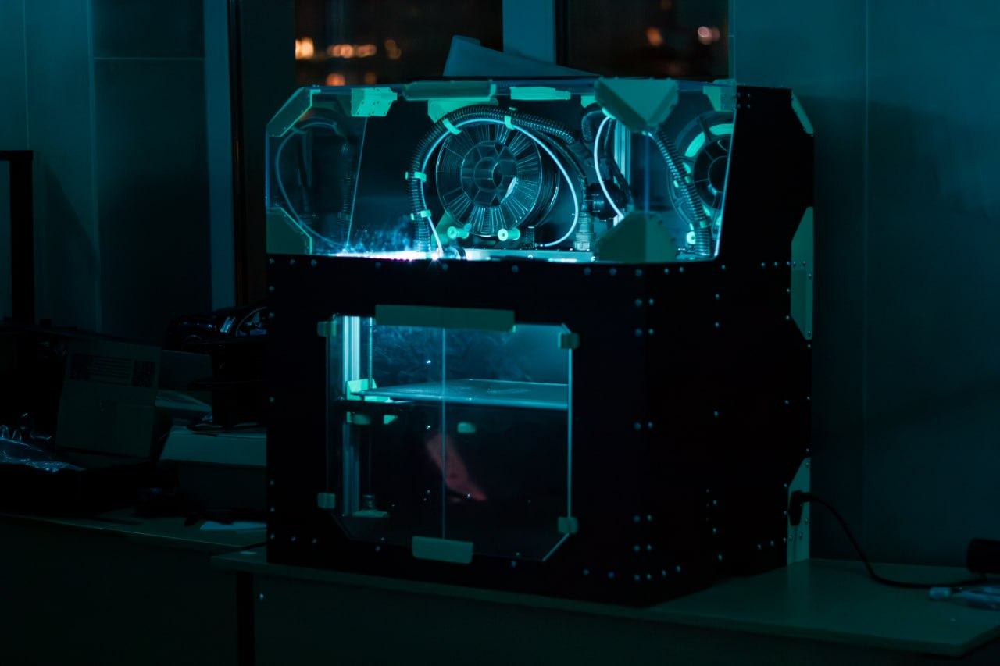{ loading="lazy" width="1280" height="853" }
- 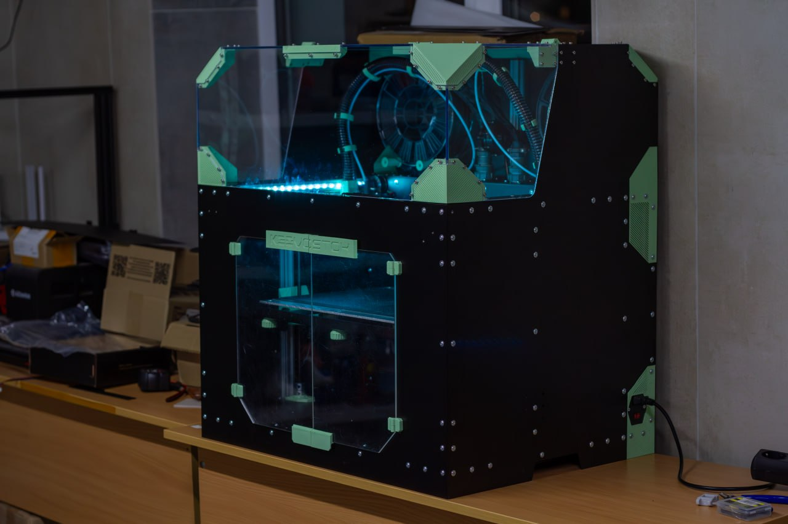{ loading="lazy" width="1280" height="853" }
- 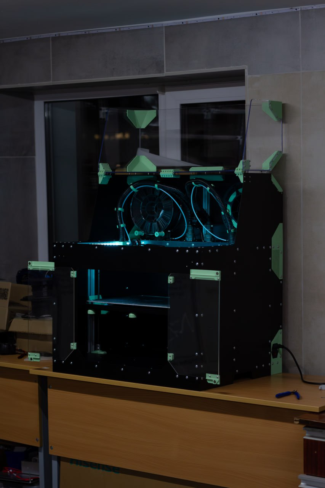{ loading="lazy" width="853" height="1280" }
- 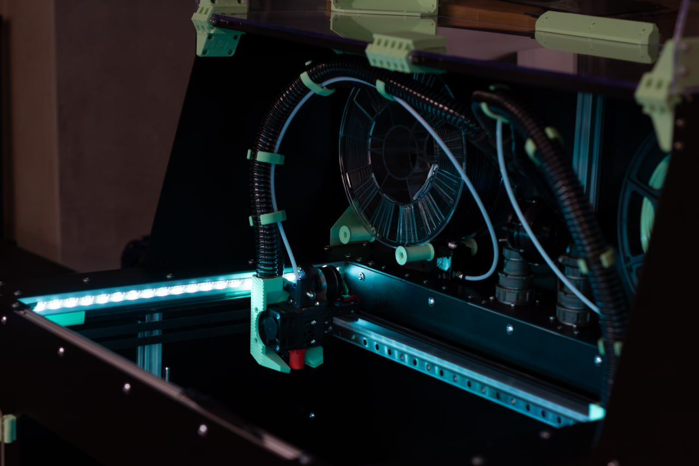{ loading="lazy" width="1280" height="853" }
- 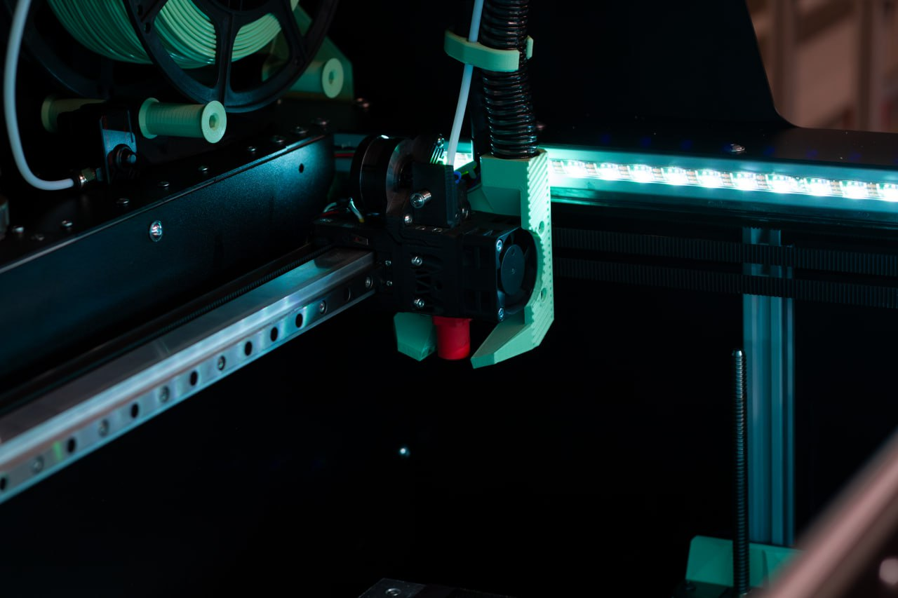{ loading="lazy" width="1280" height="853" }
- 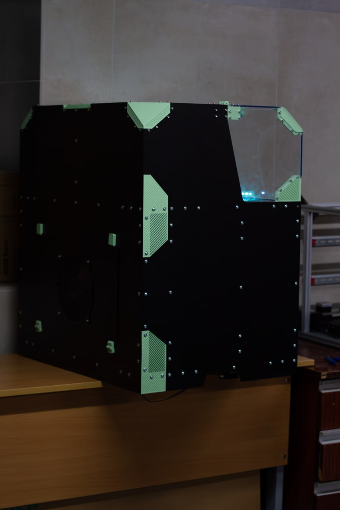{ loading="lazy" width="853" height="1280" }
- 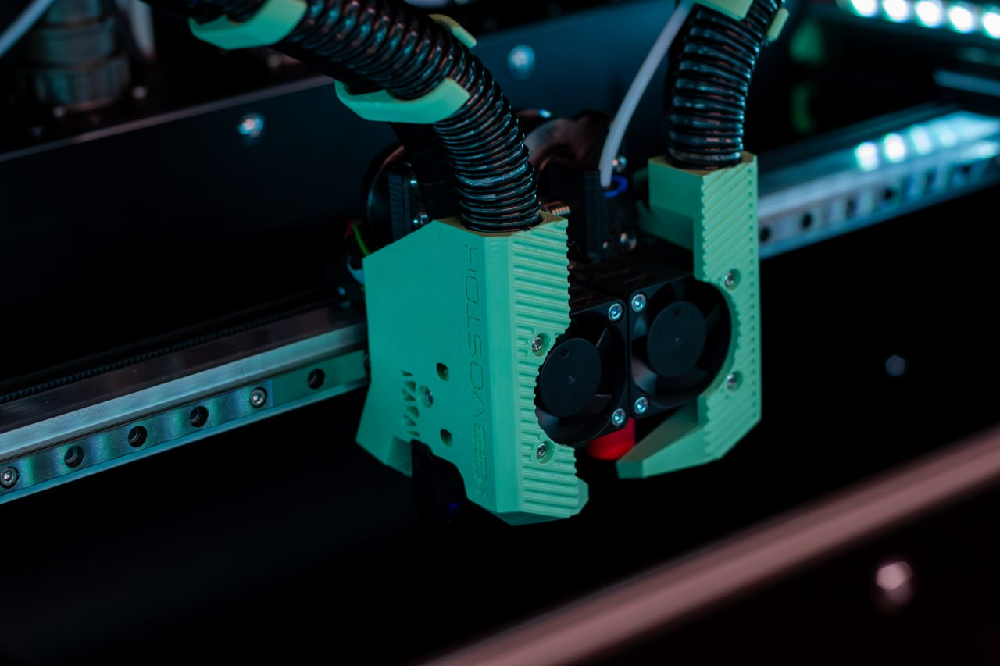{ loading="lazy" width="1280" height="853" }
- 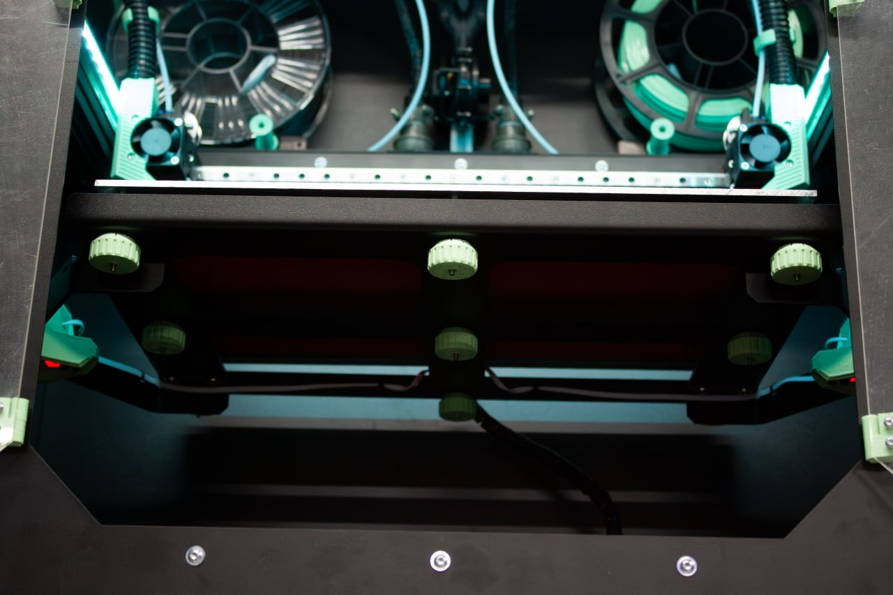{ loading="lazy" width="1280" height="853" }
- 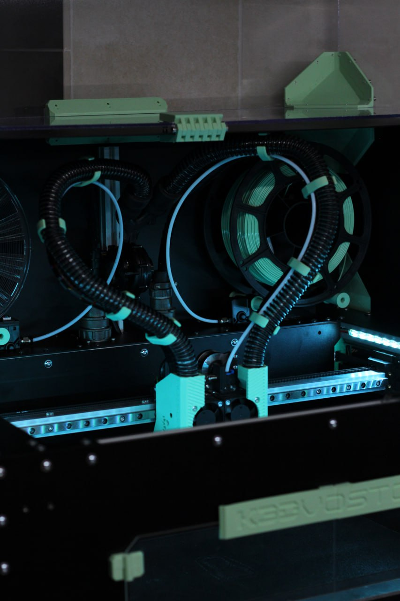{ loading="lazy" width="853" height="1280" }
- 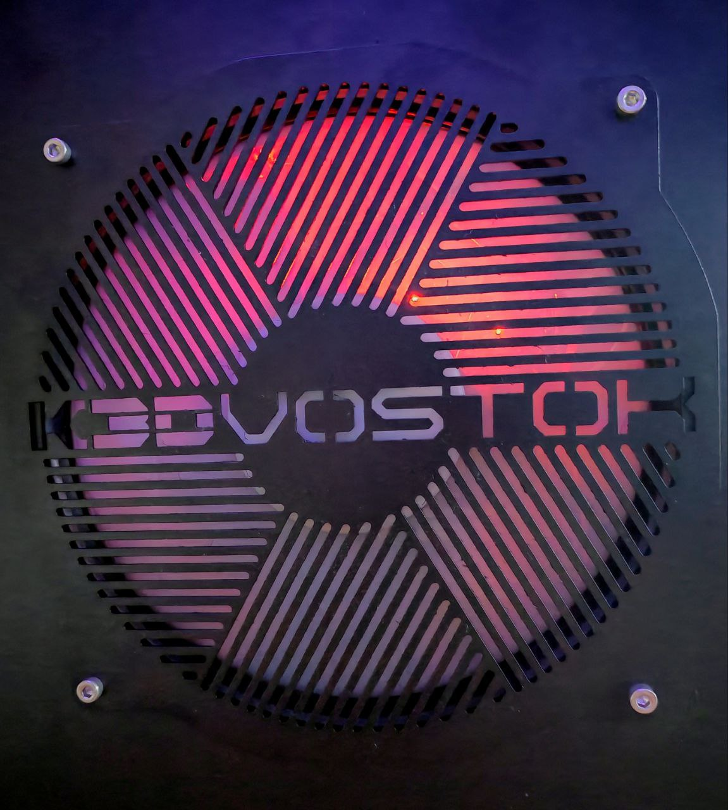{ loading="lazy" width="1151" height="1280" }

[Следующий пост &rarr;](#post-002){ .gallery-nav .gallery-nav--next }

</article>

<article class="gallery-post" markdown>
## &nbsp;v9.x&nbsp; | 400x250 { #post-002 }

[&larr; Предыдущий пост](#post-016){ .gallery-nav .gallery-nav--prev }

-  

    !!! info ""

        - Автор: Andrei Kureichyk
        - Дата: 2025-08-18
        - [Оригинал в Telegram](https://t.me/k3d_vostok/361484){ target="_blank" }
        - Версия: 9.x
        - Типоразмер: M (400x250)
        - Хотэнды: -

        - Комментарий автора: (1)
          { .annotate }

              1. Вот такой у меня красавец получился. Размер М. Хотенды CHC XL, Manta M8P. Живу в Минске. Идея собирать Восток появилась в ноябре 2024 - хотелось собрать двухголовый принтер :)  Первые детали заказал в марте, сборку закончил в июне. Все собрано по канону, единственное отличие - Manta M8p (она уже была в наличии, потому решил  Octopus не брать). Моторы Leadshine, ремни с шагом 1.5. Зашивка: портал - алюминий, пол и задняя стенка - алюмокомпозит, стенки и купол - поликарбонат. Из модов ещё поставил измененный держатель платы головы с жестким креплением провода. По резонансам - 18900 по Х, 13200 по Y - это на столе. На плиточном полу 20500 и 14600, соответственно. В принципе, мне более чем достаточно, но я ещё над этим работаю :). Детали оси Х и головы - PA-GF30, остальные внутренние детали PP-GF30, наружные - ASA-CF. Искренняя благодарность Дмитрию за прекрасно проработанный проект - никаких существенных проблем при сборке не возникло. Занимаюсь дописыванием и оптимизацией макросов и файлов конфигурации. :)

- 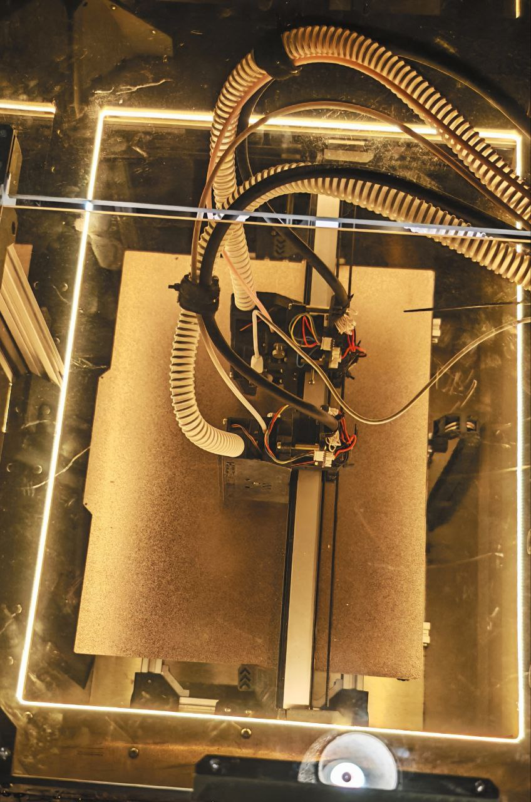{ loading="lazy" width="848" height="1280" }
- 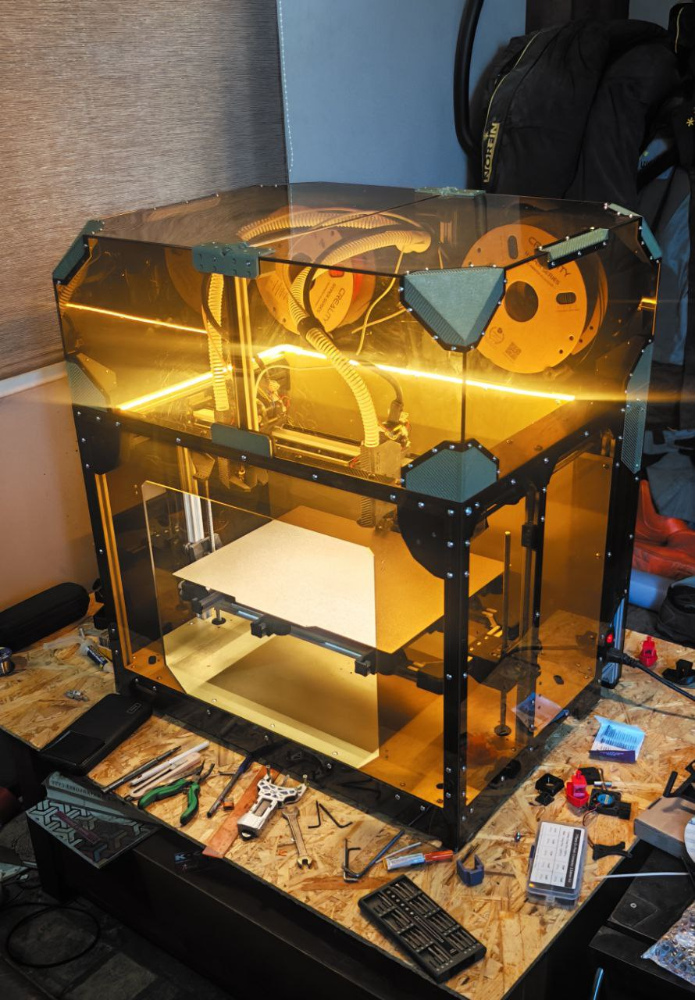{ loading="lazy" width="890" height="1280" }
- 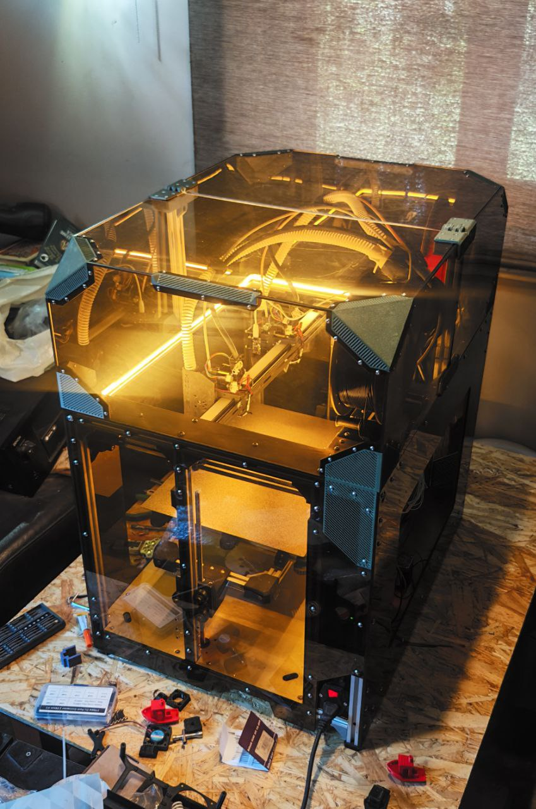{ loading="lazy" width="849" height="1280" }
- 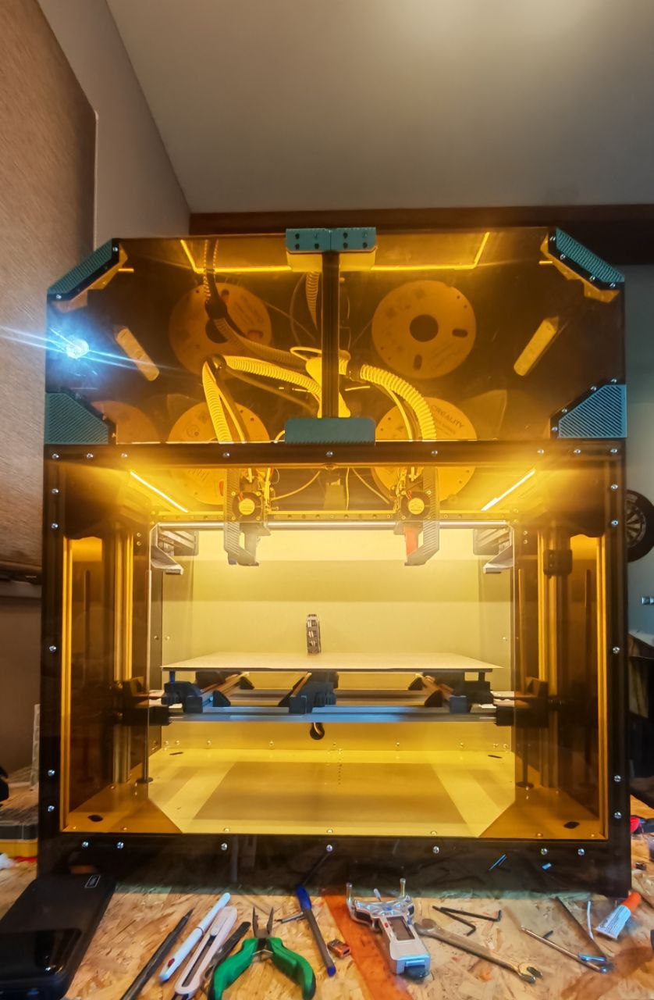{ loading="lazy" width="838" height="1280" }

[Следующий пост &rarr;](#post-021){ .gallery-nav .gallery-nav--next }

</article>

<article class="gallery-post" markdown>
## &nbsp;v9.x&nbsp; | 400x400 { #post-021 }

[&larr; Предыдущий пост](#post-002){ .gallery-nav .gallery-nav--prev }

-  

    !!! info ""

        - Автор: Михаил 🇷🇺
        - Дата: 2026-07-16
        - [Оригинал в Telegram](https://t.me/k3d_vostok/401984){ target="_blank" }
        - Версия: 9.x
        - Типоразмер: L (400x400)
        - Хотэнды: CHCB-V6DM

        - Комментарий автора: (1)
          { .annotate }

              1. Версия 9.1 собрана! Стандартный размер L. Всё делалось по проекту. Размер печати 400x400x400 Стол с грелкой на 220В на 4х направляющих и винтах и одним приводным мотором. Платы головы H36 Combo. Хотенды - CHCB. Из сложностей - на момент сборки не было полной инструкции по сборки этой версии. Так же были мелкие замечания, которые уже поправлены в следующих версиях. Не хватило винтиков M3x8 50 шт примерно и M4x8 с пресс шайбой штук 30. Проводов сигнальных наоборот почти не потребовалось - практически везде обошёлся укорачиванием комплектных. Спасибо за грамотный проект [@dmitry_sorkin](https://t.me/dmitry_sorkin) и мастеру, который делает зашивку [@Itdranikk](https://t.me/Itdranikk)! А так же всему чату, особенно Александр за неоценимую помощь по прошивке!

- 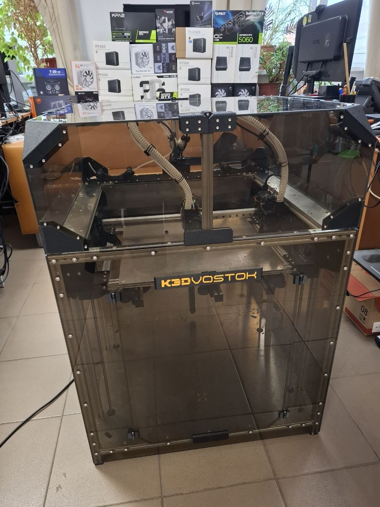{ loading="lazy" width="960" height="1280" }
- 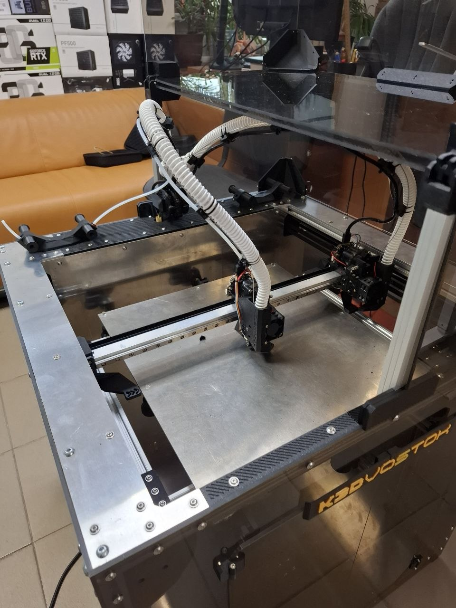{ loading="lazy" width="960" height="1280" }
- 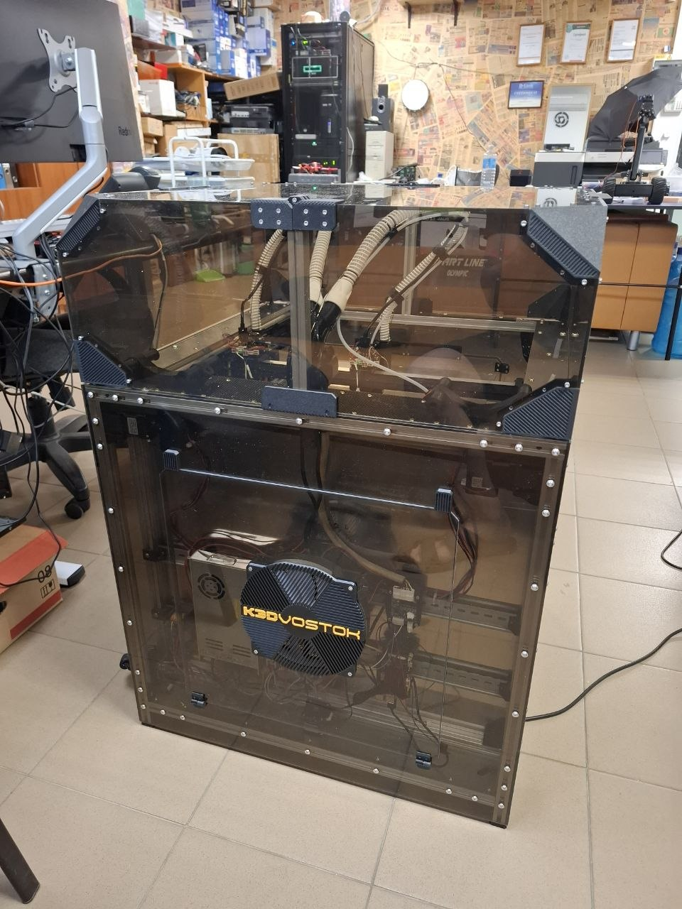{ loading="lazy" width="960" height="1280" }

[Следующий пост &rarr;](#post-020){ .gallery-nav .gallery-nav--next }

</article>

<article class="gallery-post" markdown>
## &nbsp;v9.x&nbsp; | 350x350 { #post-020 }

[&larr; Предыдущий пост](#post-021){ .gallery-nav .gallery-nav--prev }

-  

    !!! info ""

        - Автор: Дмитрий Никитин
        - Дата: 2026-03-13
        - [Оригинал в Telegram](https://t.me/k3d_vostok/385824){ target="_blank" }
        - Версия: 9.x
        - Типоразмер: 350x350
        - Хотэнды: -

        - Комментарий автора: (1)
          { .annotate }

              1. Мутант на базе Востока 9 из обрезков и остатков. Область 350х350х300 Все на OpenBuild))) Пока не зашит совсем. Ускорения 8000, но если положить блинчик 5 кг на низ рамы, иначе подпрыгивает и ускорения 4000 ))))))))) Самое интересное - головы полностью вписались под каретки OpenBuilds на малых колесах. Безопасный зазор между соплами 37,9 Делался по приколу в свободное время. Но если что - можно сделать сильно бюджетнее для желающих. Уважуха создателю проекта!

- 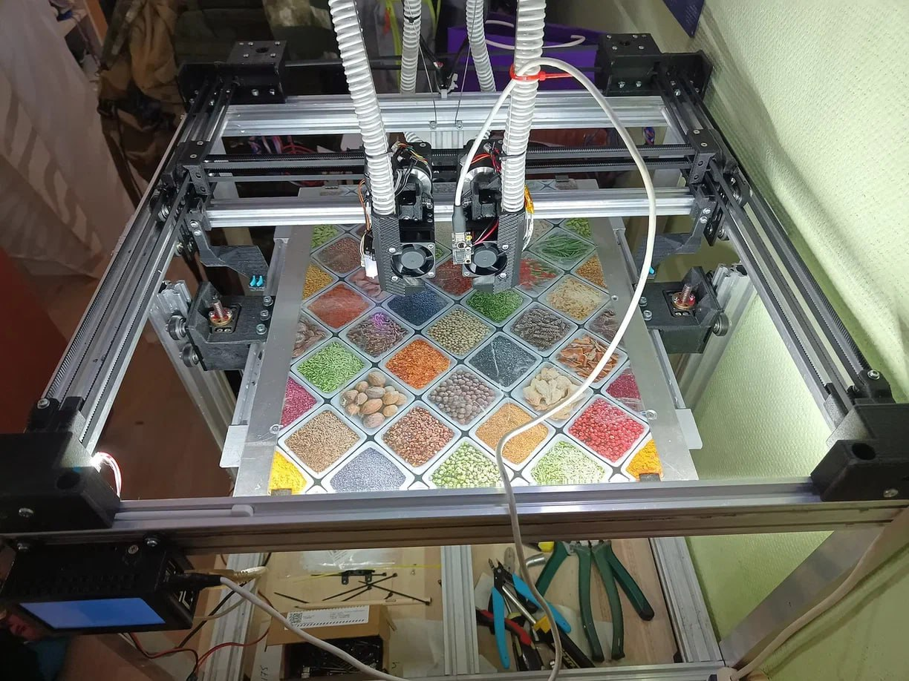{ loading="lazy" width="1224" height="918" }

[Следующий пост &rarr;](#post-019){ .gallery-nav .gallery-nav--next }

</article>

<article class="gallery-post" markdown>
## &nbsp;v9.x&nbsp; | 400x300 { #post-019 }

[&larr; Предыдущий пост](#post-020){ .gallery-nav .gallery-nav--prev }

-  

    !!! info ""

        - Автор: Владимир
        - Дата: 2025-09-28
        - [Оригинал в Telegram](https://t.me/k3d_vostok/365329){ target="_blank" }
        - Версия: 9.x
        - Типоразмер: 400x300
        - Хотэнды: Volcano

        - Комментарий автора: (1)
          { .annotate }

              1. V9 профиль SH, зашивка планируется сильно позже, шейперы и так хороши. Область Y на 500 больше, итог 400*300*250.  Флуоресцентный. В начале одну голову, теперь две (уговорили). Был volcano с MPH v1.4 от Laker87 на hgx 1,0, сейчас chcb-v c bmg. План два chc xl. Первый в жизни fdm e3 v3 se купил в январе, февралб закуп на восток, в марте дозаказ и начало сборки. 5мая собрал. 4 месяца от новичка до востока. Проблем небыло, только мосты на pa6 портили шейперы, перепечатал АБС нит, (exoflex красивее). Печатает очень красиво, слой к слою (См. фото). Именно я поднял тему красивых востоков и галереи, жалко не успел собрать. Стыдно. Но не стыдно, всё лето по больничкам. Вся электроника не простая, но и самосбор первый в жизни, а принтер второй. На график вибрации влияют chopper'ы, приложил график до и после настройки. Замоделил крепежи под DIN для плат, есть размеры от 10мм до 50мм, 65мм. Кому надо пишите в личку, потом выложу и эти и вторую версию разрабатываю с кабель держателями.

- 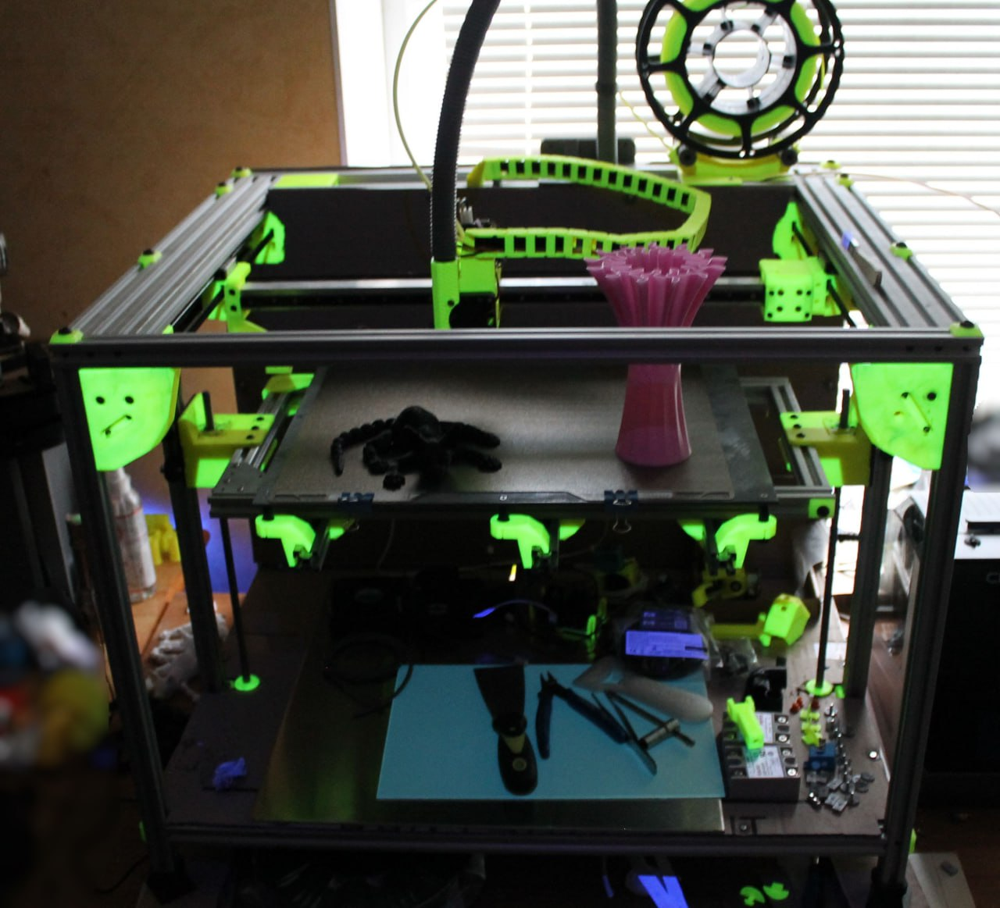{ loading="lazy" width="1280" height="1163" }
- 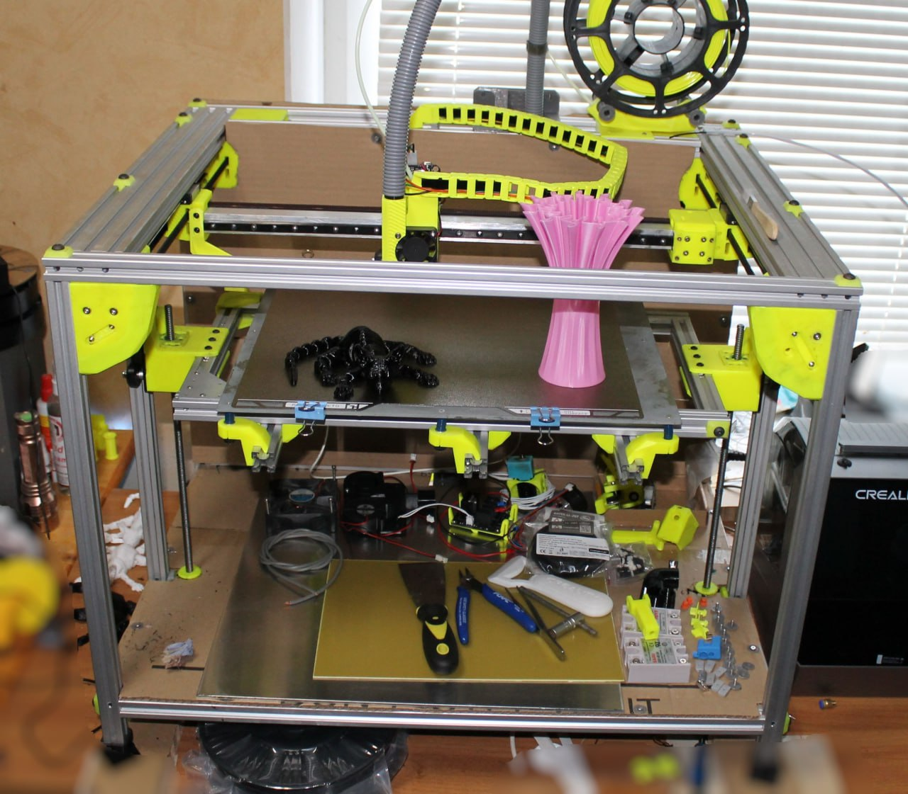{ loading="lazy" width="1280" height="1121" }
- 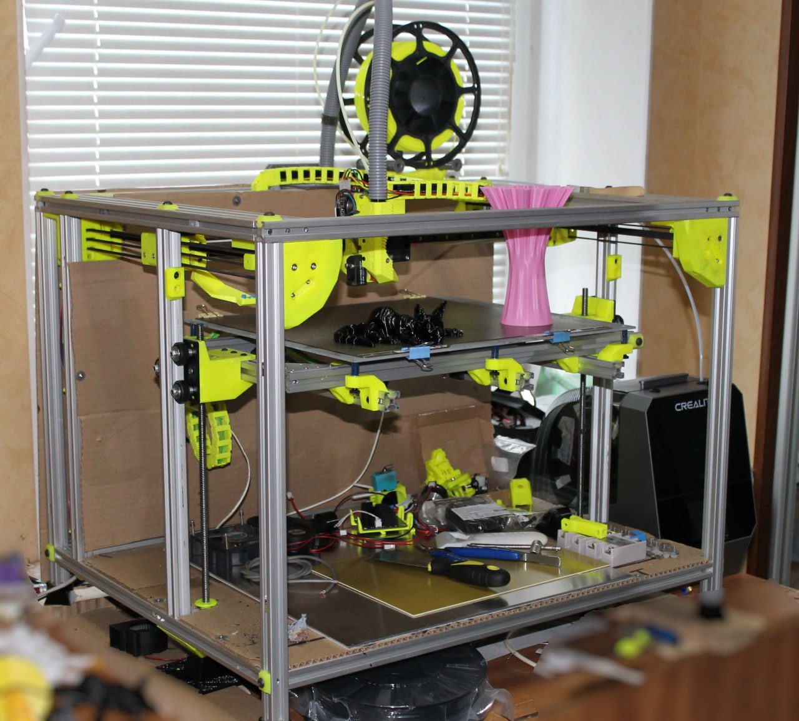{ loading="lazy" width="1280" height="1157" }
- 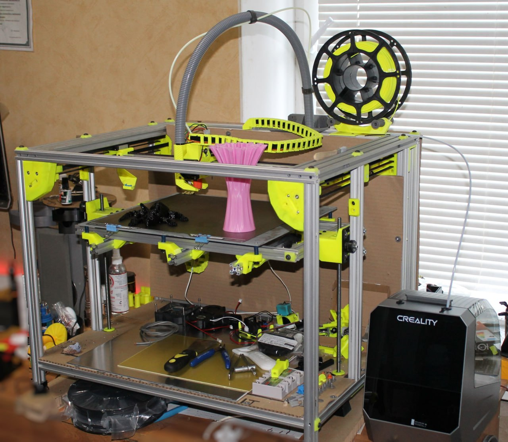{ loading="lazy" width="1280" height="1116" }
- 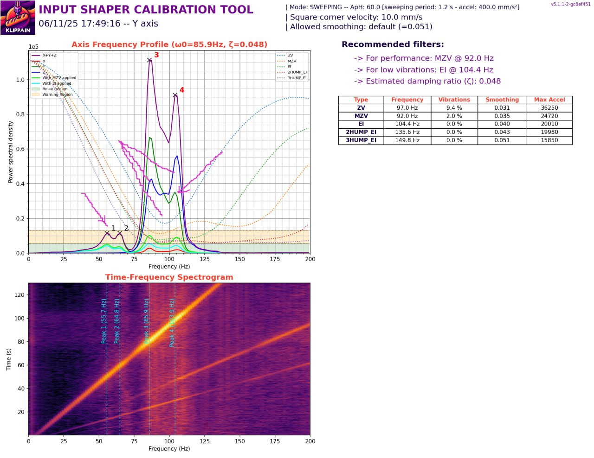{ loading="lazy" width="1280" height="989" }
- 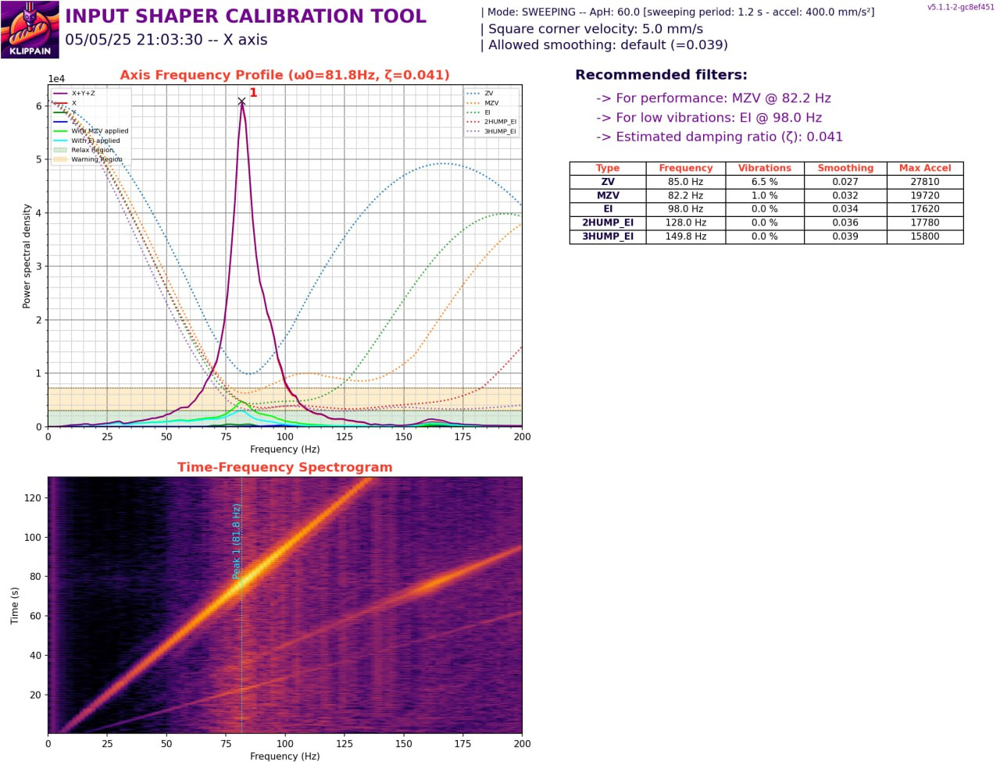{ loading="lazy" width="1280" height="989" }
- 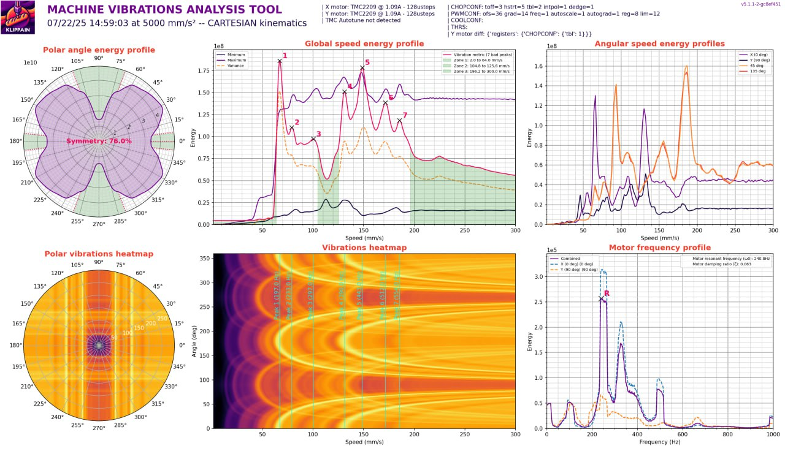{ loading="lazy" width="1280" height="736" }
- 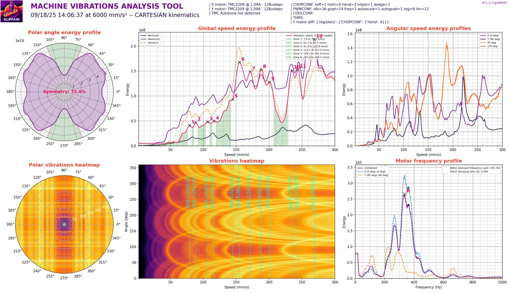{ loading="lazy" width="1280" height="736" }
- 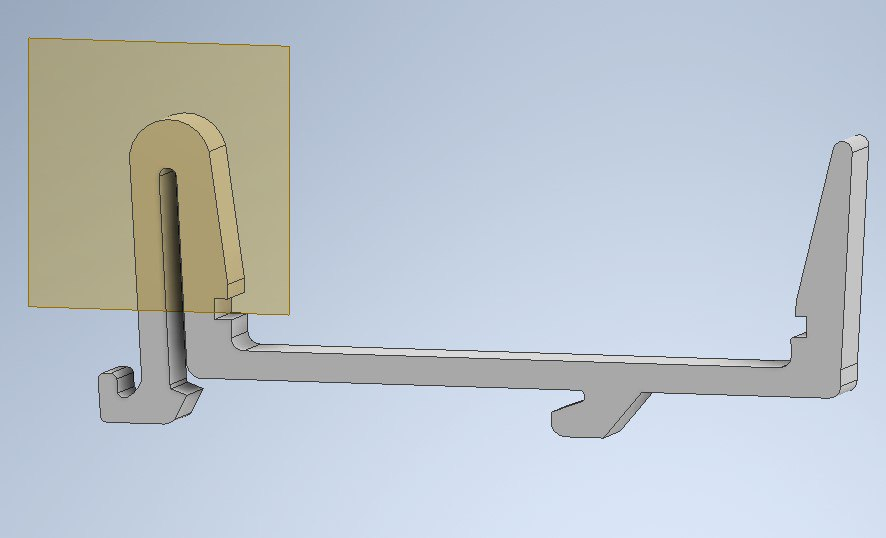{ loading="lazy" width="886" height="538" }

[Следующий пост &rarr;](#post-018){ .gallery-nav .gallery-nav--next }

</article>

<article class="gallery-post" markdown>
## &nbsp;v9.x&nbsp; | 300x300 { #post-018 }

[&larr; Предыдущий пост](#post-019){ .gallery-nav .gallery-nav--prev }

-  

    !!! info ""

        - Автор: Konstantin Rumyantsev
        - Дата: 2025-09-27
        - [Оригинал в Telegram](https://t.me/k3d_vostok/365292){ target="_blank" }
        - Версия: 9.x
        - Типоразмер: 300x300
        - Хотэнды: Volcano

        - Комментарий автора: (1)
          { .annotate }

              1. Восток 300*300 на основе 0.8 с плавным переходом на 0.9 Купол собирал кастомный на магнитах, по месту, чтоб влезал в шкаф. Зашивка из поликарбоната и оргстекла. Голова уже от 0.9, переделанная под орбитр. Квадратная балка ждёт своего часа. Z на 4х направляющих и 2х моторах. Изначально опыта не было, поэтому хотел собрать одноэкструдерный, с последующим расширением на второй. Но оказалось что в ревизии 0.8, если в боме выбрать вариант с одним экструдером он меняет общие размеры рамы, и теперь или переделывать раму, или отказываться от 2ого экструдера. Ну пока и так норм. Доделок ещё куча в голове, осталось только найти время))

- 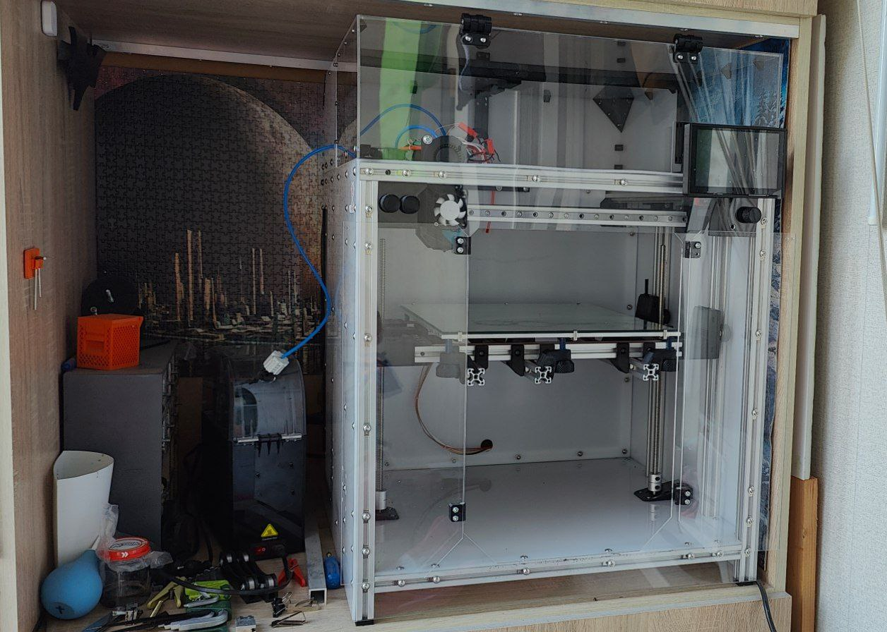{ loading="lazy" width="1256" height="896" }
- 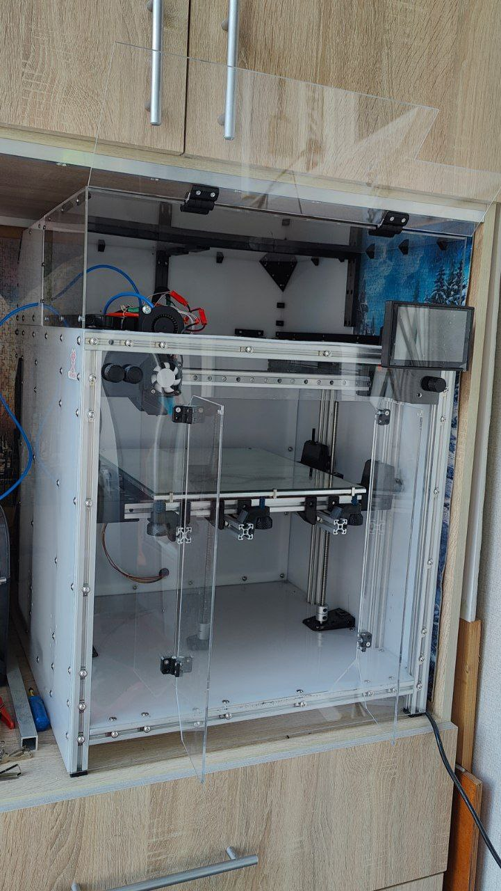{ loading="lazy" width="721" height="1280" }
- 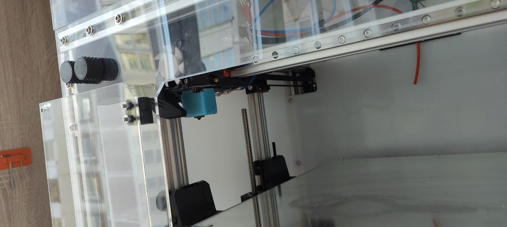{ loading="lazy" width="1280" height="573" }
- 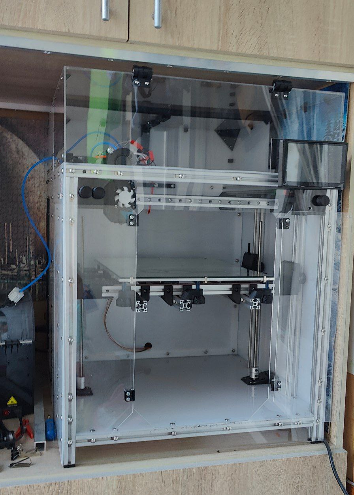{ loading="lazy" width="896" height="1251" }
- 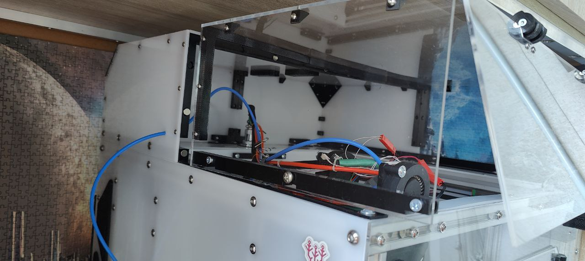{ loading="lazy" width="1280" height="573" }
- 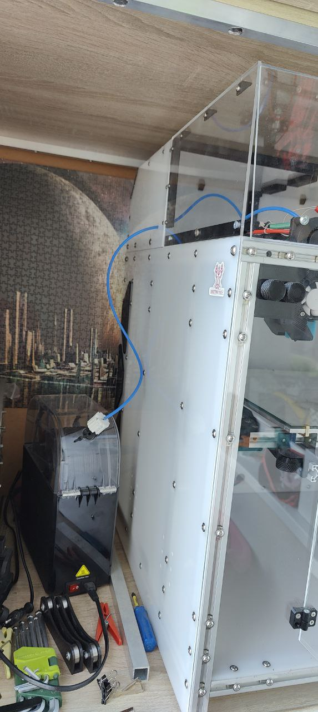{ loading="lazy" width="573" height="1280" }

[Следующий пост &rarr;](#post-015){ .gallery-nav .gallery-nav--next }

</article>

<article class="gallery-post" markdown>
## &nbsp;v9.x&nbsp; | &nbsp;&nbsp;&nbsp;-&nbsp;&nbsp;&nbsp; { #post-015 }

[&larr; Предыдущий пост](#post-018){ .gallery-nav .gallery-nav--prev }

-  

    !!! info ""

        - Автор: Artem
        - Дата: 2025-09-26
        - [Оригинал в Telegram](https://t.me/k3d_vostok/365198){ target="_blank" }
        - Версия: 9.x
        - Типоразмер: -
        - Хотэнды: CHC Pro

        - Комментарий автора: (1)
          { .annotate }

              1. Восток преальфа 0.9 со столом от 0.8.8. Начал собирать в мае 2024, закончил в начале 2025. Резьбу нарезал сам.  Установил свет, камеру. Накатил клиперскрин на старый хуавей(то ещё приключение). Подключил датчик температуры bme280. Пассивная камеры греется до 55 градусов при столе 135. Видоизменил слюнявчики, что б сопло закрывалось в простое (сильно меньше мусора при печати головами по очереди). На головах: chc-pro, горло под матрикс, и радик td6s. Выравнивать головы относительно друг друга - одно удовольствие! Каретки по Х слегка люфтят. Шейперы звезд с неба не хватают. Но 8000 по Y принтер может. Больше мне пока не надо. Спустя пол года эксплуатации отклеилась грелка, посадил на автомобильный герметик. Греет стол чуть дольше, зато теперь не оторвешь. В планах установить клики, спасибо Лакеру за крутой мод, уже стащил себе на дрыгу, отлично работает! Это мой второй принтер после кингруна. И не скажу что было сложно разобраться и собрать. Спасибо Дмитрию за огромный труд! Такое количество работы проделано!

- 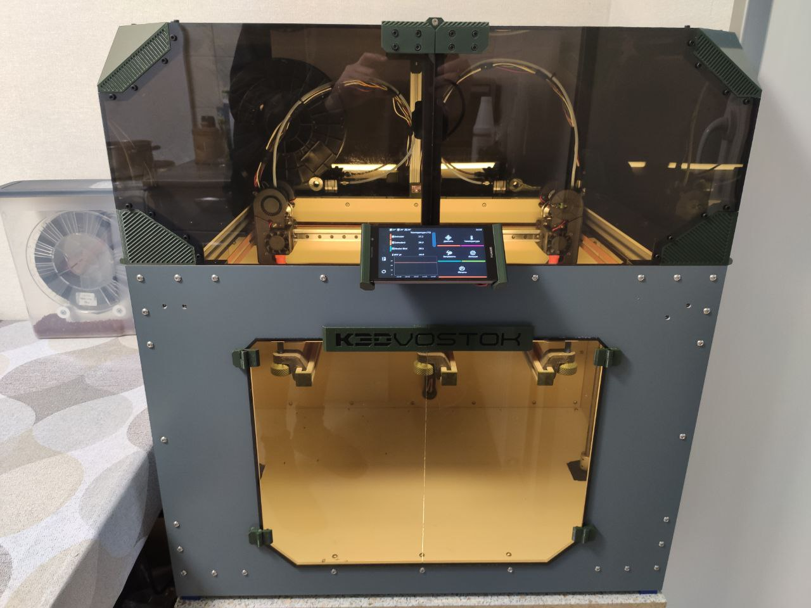{ loading="lazy" width="1280" height="960" }
- 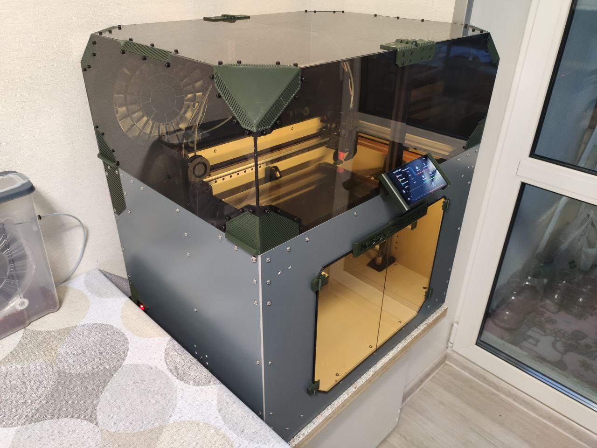{ loading="lazy" width="1280" height="960" }
- 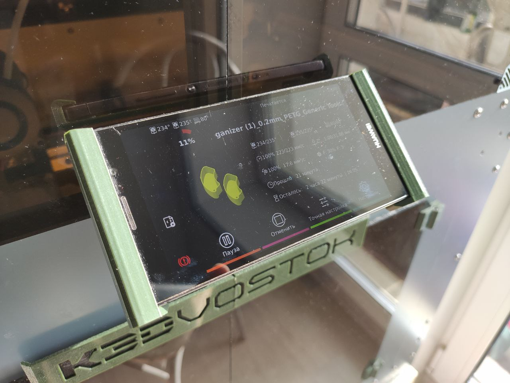{ loading="lazy" width="1280" height="960" }
- 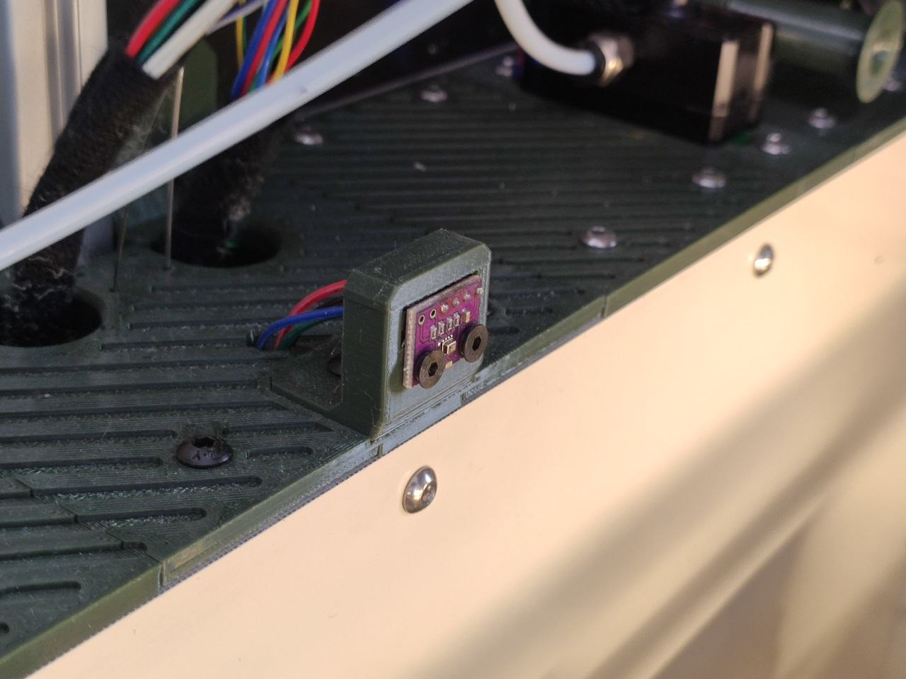{ loading="lazy" width="1280" height="960" }
- 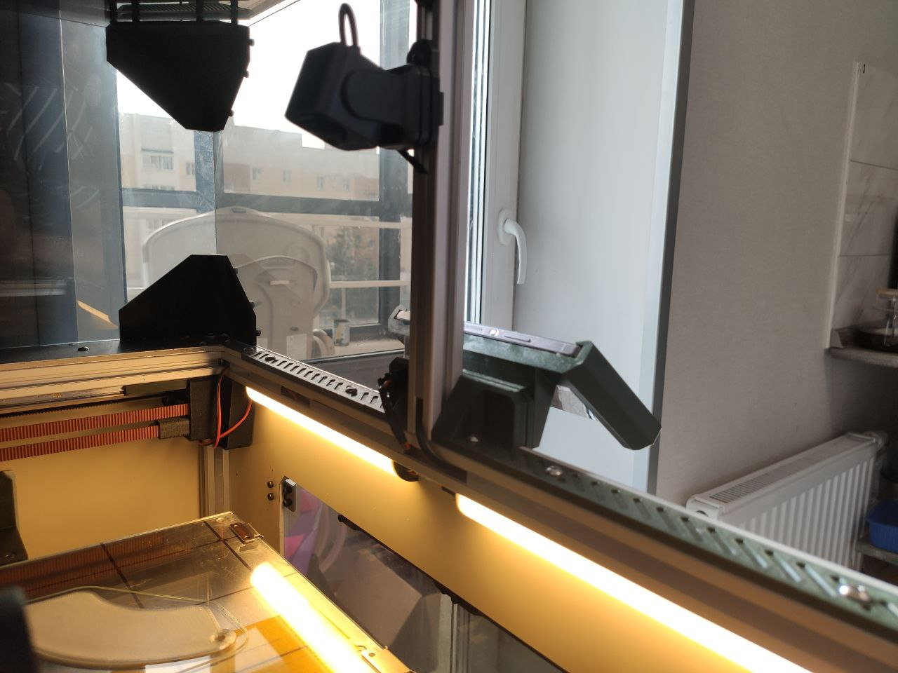{ loading="lazy" width="1280" height="960" }
- 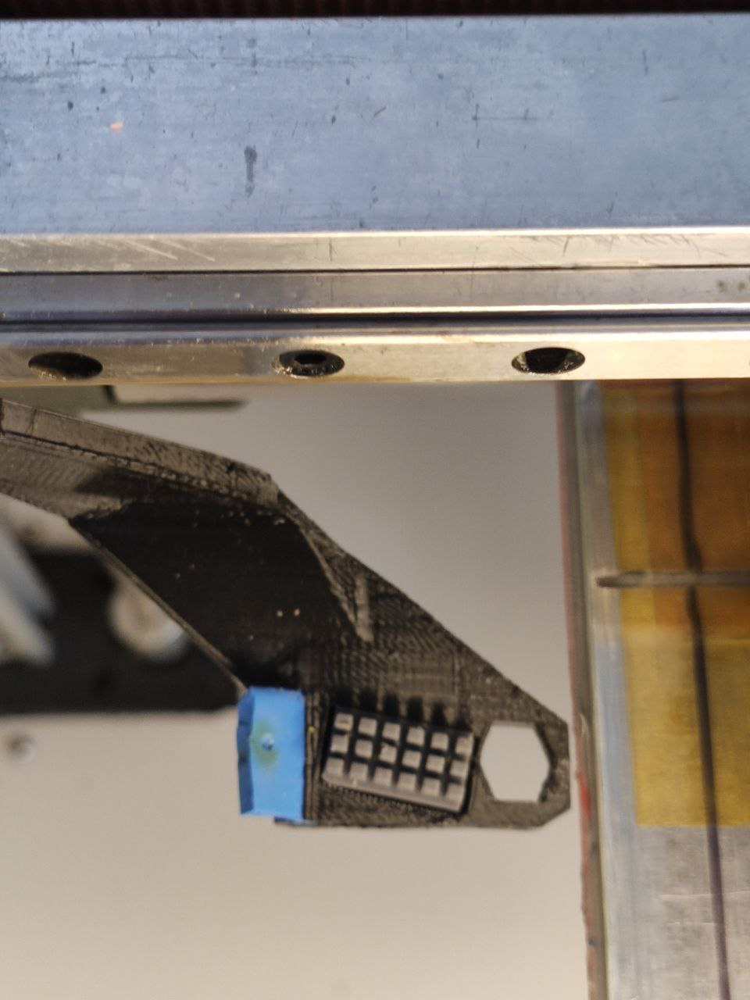{ loading="lazy" width="960" height="1280" }

[Следующий пост &rarr;](#post-014){ .gallery-nav .gallery-nav--next }

</article>

<article class="gallery-post" markdown>
## &nbsp;v9.x&nbsp; | 200x176 { #post-014 }

[&larr; Предыдущий пост](#post-015){ .gallery-nav .gallery-nav--prev }

-  

    !!! info ""

        - Автор: Oleg Romanenko
        - Дата: 2025-09-25
        - [Оригинал в Telegram](https://t.me/k3d_vostok/365154){ target="_blank" }
        - Версия: 9.x
        - Типоразмер: 200x176
        - Хотэнды: Volcano

        - Комментарий автора: (1)
          { .annotate }

              1. МикроВосток Размеры принтера 460х424х400 Область печати 200х176х170 Делался такой, чтобы помещаться в икеевский стеллаж с небольшим зазором.  WS7040 внутри отсека электроники, так как сверху места уже нет. Но забирает воздух из основного объема. Купола нет и не будет ещё долго. Дверки тоже пока без надобности. Но все нарезано и ждёт переезда. Электроника RPi3B+, octopus (подключен по uart), ebb36 (подключены по CAN через U2C). Высоковольтная часть внизу, низковольтная - сзади. Блоков питания должно было быть 3 - на 12В (ws7040, led  освещение, BTT pi), 24В (octopus, ebb36), 48В (моторы x,y,w), но BTT pi померла и вместе нее теперь Raspberry Pi3b+ с отдельным БП на 5В. Одно твердотельное реле на отключение принтера при аварии, второе на стол. Третье - запасное - для грелки камеры. Пока просто занимает место :) Собирать было интересно. Часть деталей переделывал уже под свои хотелки. Удобно, когда исходники проекта есть. Дмитрию большое спасибо.

- 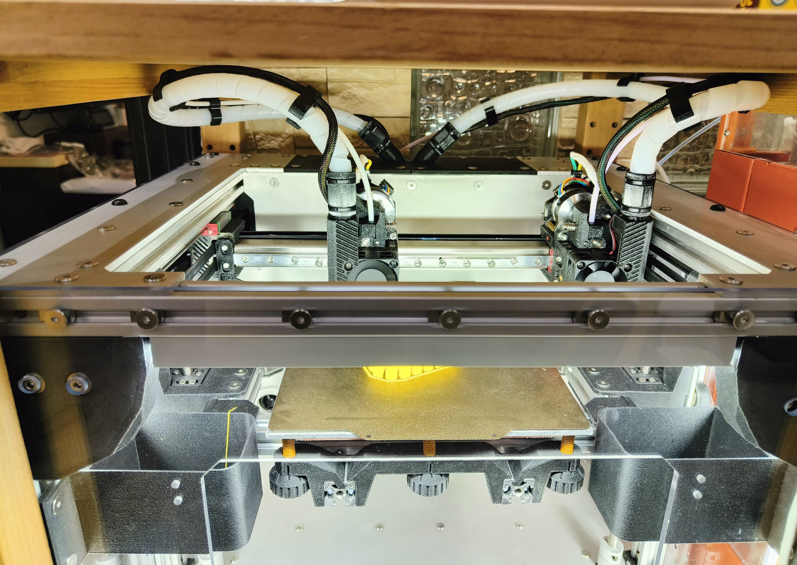{ loading="lazy" width="2560" height="1816" }
- 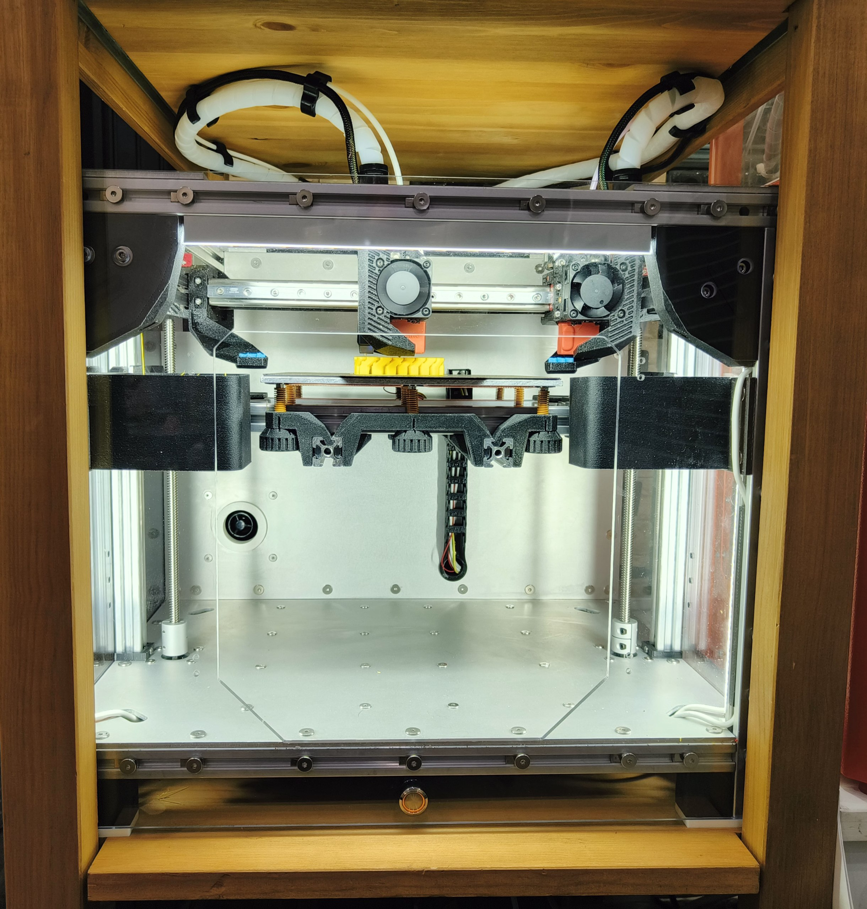{ loading="lazy" width="2440" height="2560" }
- 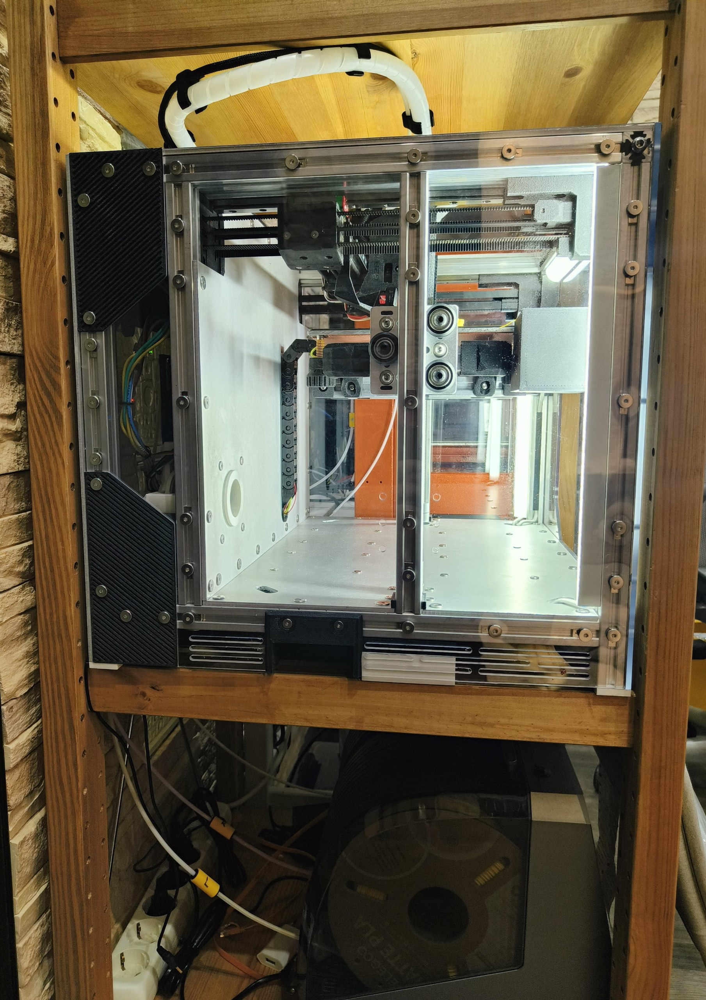{ loading="lazy" width="1809" height="2560" }
- 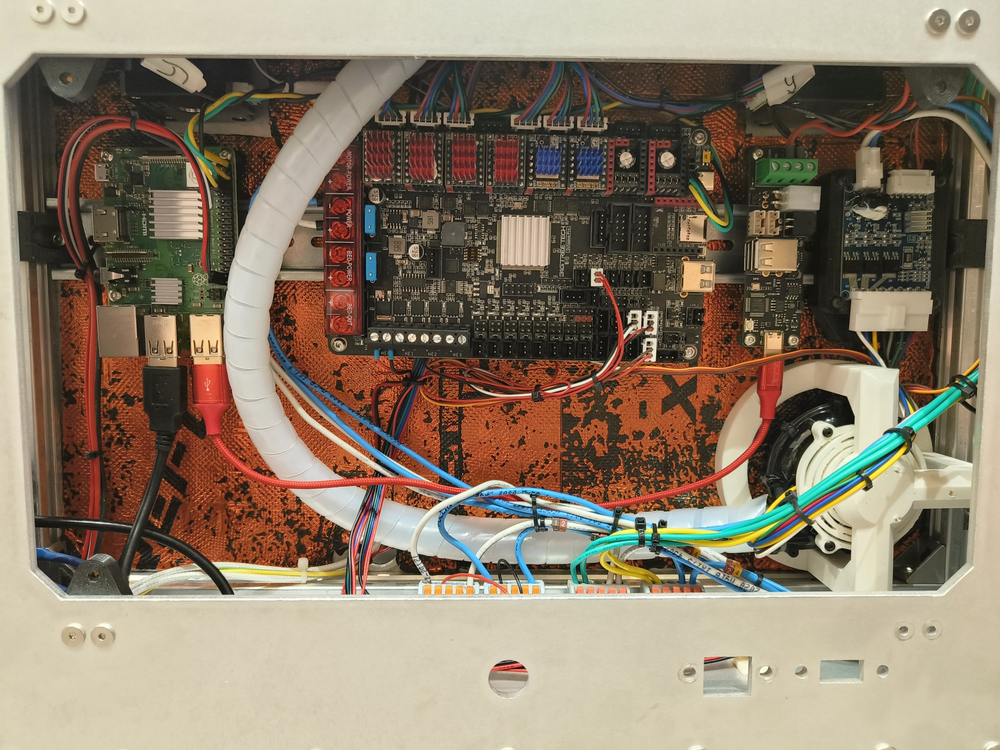{ loading="lazy" width="2560" height="1920" }
- 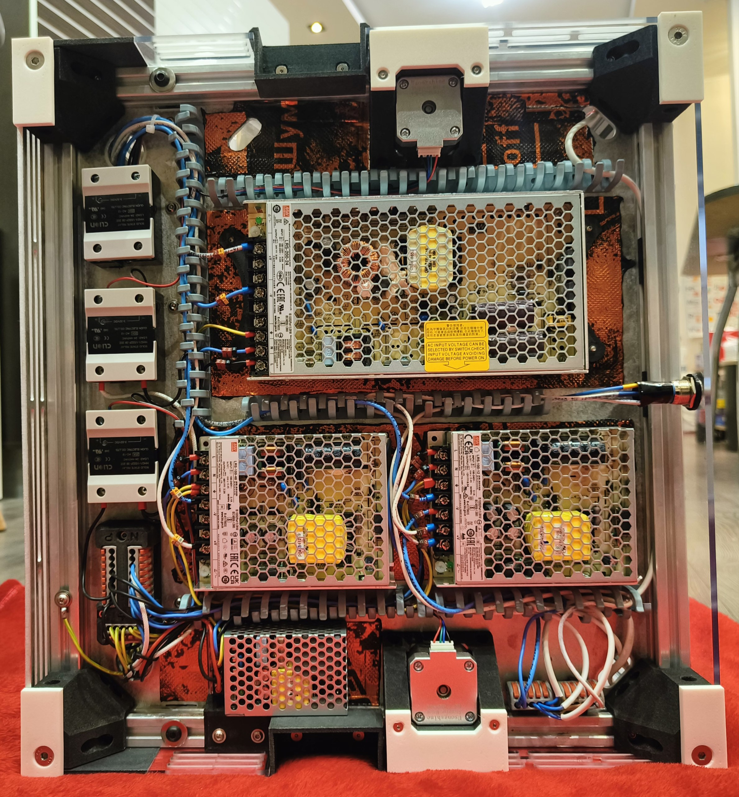{ loading="lazy" width="2377" height="2560" }

[Следующий пост &rarr;](#post-013){ .gallery-nav .gallery-nav--next }

</article>

<article class="gallery-post" markdown>
## &nbsp;v9.x&nbsp; | 400x300 { #post-013 }

[&larr; Предыдущий пост](#post-014){ .gallery-nav .gallery-nav--prev }

-  

    !!! info ""

        - Автор: Maks
        - Дата: 2025-09-25
        - [Оригинал в Telegram](https://t.me/k3d_vostok/365144){ target="_blank" }
        - Версия: 9.x
        - Типоразмер: 400x300
        - Хотэнды: CHC Pro

        - Комментарий автора: (1)
          { .annotate }

              1. Всем привет! Мой VOSTOK, изначально был версии 8.1, потом переделал балку Х на 9 версию. Одноголовый (забыл в боме поставить 2й экструдер🥲), но когда-нибудь поставлю вторую голову (честно-честно) По характеристикам: Область печати 400х300х300 Octopus 446 + orange pi 3lts; экран btt 12864; хотенд - контендер; переделан обдув радиатора (были пробки); обдув модели - 2х5015, стол Pei (2 мотора+4стойки, 7 точек); зашивка HPL панели 6мм; купол акрил 4мм; утеплен вибротермоизоляцией; фильтр улитка 12032 на 24в; детали из ppgf30 и ABS (стол и купол)  Вместо 2й головы стоит usb разъём (удобно акселерометр подключать) Держатели катушек снял, тк печатаю из сушилки Для активной термокамеры был куплен pts нагреватель на 450вт, но пока не придумал как его установить (пробовал под стол ставить, но съедается область печати по Z), но и с пассивной за полчаса работы набирается 55-60° На принтере печатаю, в основном, техничку из АБС (для игрушек из PLA есть Ender3) Спасибо Дмитрию за проект! Фото принтера и графиков прилагаю.

- 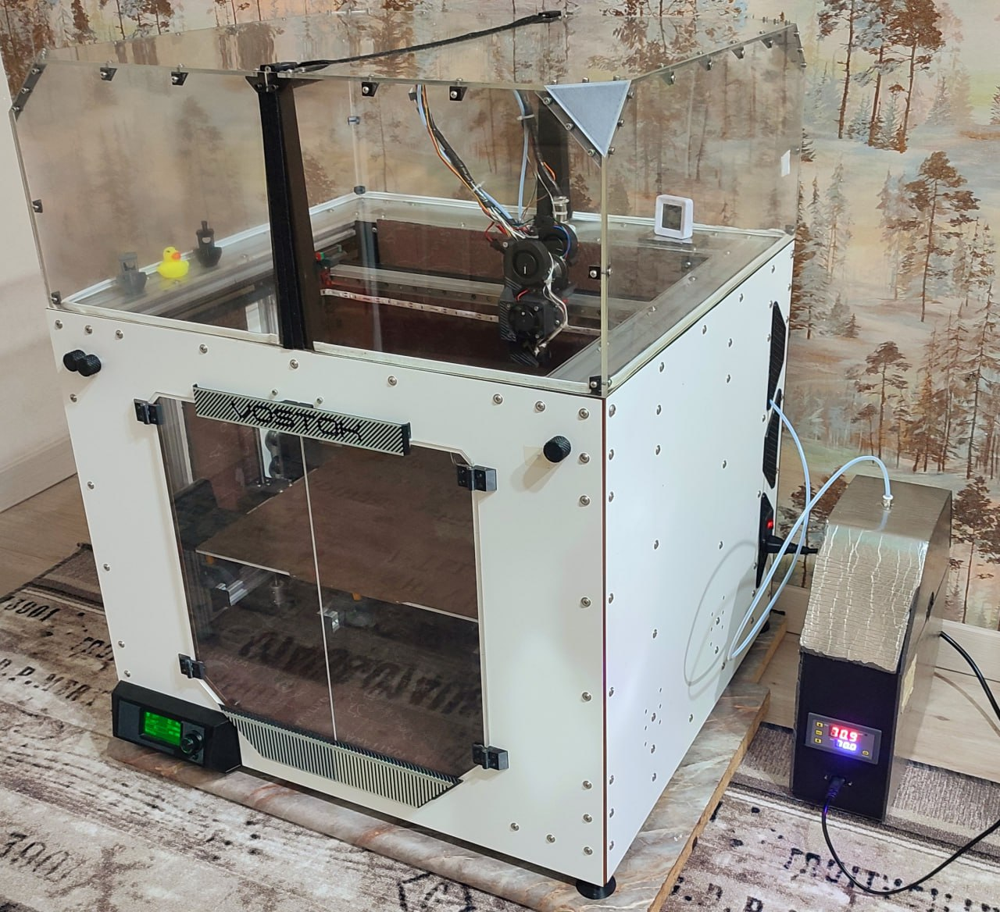{ loading="lazy" width="1280" height="1168" }
- 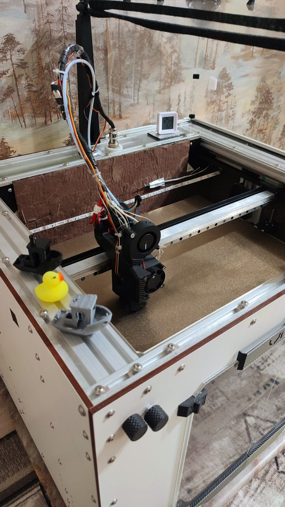{ loading="lazy" width="720" height="1280" }
- 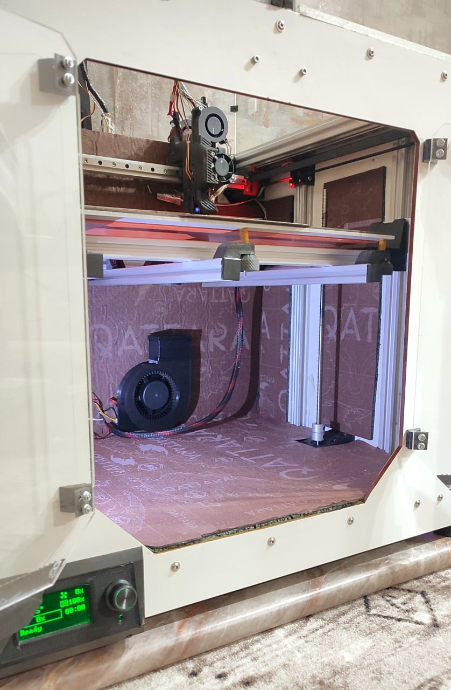{ loading="lazy" width="838" height="1280" }
- 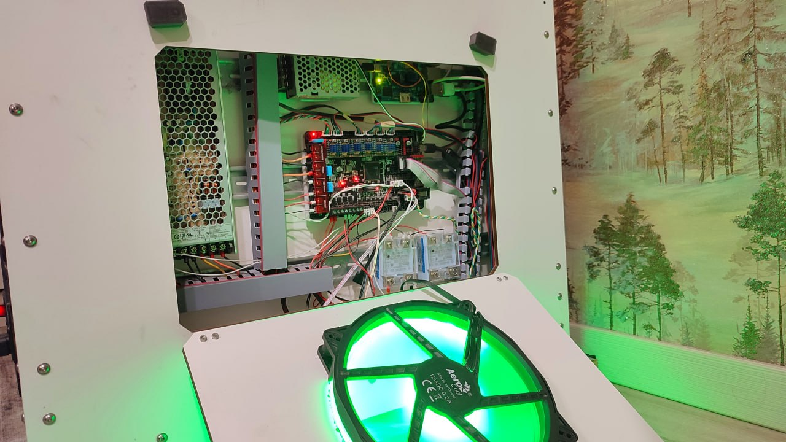{ loading="lazy" width="1280" height="720" }
- 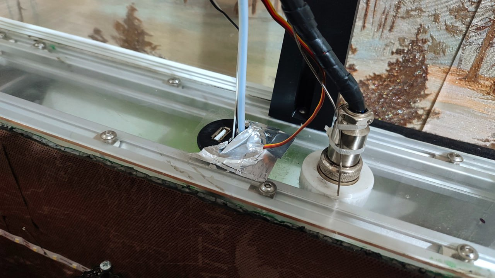{ loading="lazy" width="1280" height="720" }
- 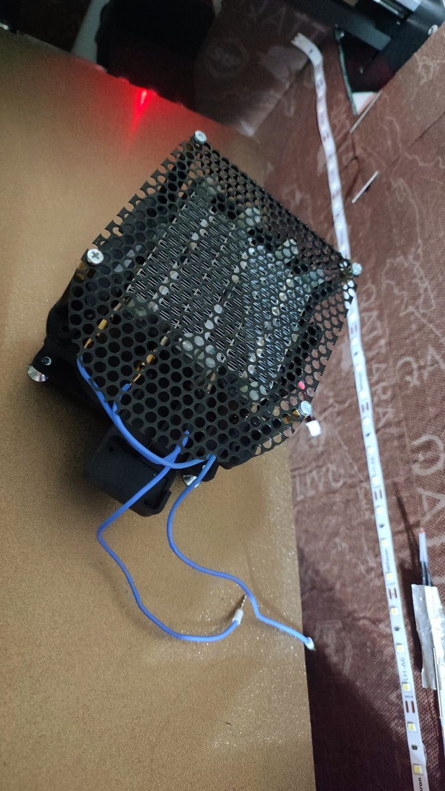{ loading="lazy" width="720" height="1280" }
- { loading="lazy" width="800" height="600" }
- { loading="lazy" width="800" height="600" }

[Следующий пост &rarr;](#post-012){ .gallery-nav .gallery-nav--next }

</article>

<article class="gallery-post" markdown>
## &nbsp;v9.x&nbsp; | 400x250 { #post-012 }

[&larr; Предыдущий пост](#post-013){ .gallery-nav .gallery-nav--prev }

-  

    !!! info ""

        - Автор: Андрей К.
        - Дата: 2025-09-25
        - [Оригинал в Telegram](https://t.me/k3d_vostok/365093){ target="_blank" }
        - Версия: 9.x
        - Типоразмер: M (400x250)
        - Хотэнды: CHC Pro

        - Комментарий автора: (1)
          { .annotate }

              1. Восток начал собирать больше двух лет назад. К августу 2023 уже был готов (на одно из фото), в версии 0.7.8. Очень смущала "жескость" балки Х на каретках. Но это не помешало использовать его. На нём распечатал для ванны светильник над зеркалом (белый пластик - керамо, прозрачный sbs, крепление лэд полоски ABS gf4). Из-за вышеперечисленого было решено переделать портал и головы, а с ними заодно и купол под версию 0.9.1. Стол до того был переделан на упорные подшипники. Область печати 400х250х250. Зашивка- дибон 3мм, купол - оргстекло 3мм.  Хотенды CHC Pro. Материнская плата BTT Octopus Pro, BTT Pi  и драйвера TMC 2209. Для кана используется плата u2c. Грелка стола 400w 230v. Блок питания пока 200W. Также ws7040 с родным драйвером и с модулем мосфета. Это была увлекательная сборка. Принтером доволен. Огромное спасибо Дмитрию Соркину за вложенное время и усилия и нервы. Очень импанирует его инженерный подход к делу, без излишних отвлечений на украшательства.

- { loading="lazy" width="1280" height="960" }
- { loading="lazy" width="1280" height="960" }
- { loading="lazy" width="1280" height="960" }
- { loading="lazy" width="960" height="1280" }
- { loading="lazy" width="960" height="1280" }
- { loading="lazy" width="1280" height="960" }
- { loading="lazy" width="1280" height="960" }
- { loading="lazy" width="1280" height="960" }
- { loading="lazy" width="960" height="1280" }

[Следующий пост &rarr;](#post-011){ .gallery-nav .gallery-nav--next }

</article>

<article class="gallery-post" markdown>
## &nbsp;v9.x&nbsp; | 400x280 { #post-011 }

[&larr; Предыдущий пост](#post-012){ .gallery-nav .gallery-nav--prev }

-  

    !!! info ""

        - Автор: Павел
        - Дата: 2025-09-24
        - [Оригинал в Telegram](https://t.me/k3d_vostok/364988){ target="_blank" }
        - Версия: 9.x
        - Типоразмер: 400x280
        - Хотэнды: CHC Pro

        - Комментарий автора: (1)
          { .annotate }

              1. Мой Восток. Собирал прошлой зимой. Область печати 400х280. Зашивка- алюмокомпозит, купол-поликарбонат.  Хотенды CHC Pro. Материнская плата BTT Octopus+BTT Pi  и драйвера TMC 2209.  Грелка термокамеры 600W 220В, с корпусом из ABC и передней защитной сеткой из   PA6 GF, мощности хватает.  Блок питания 300W.  Собирал принтер несколько месяцев было интересно и увлекательно, много в чем разобрался и научился. В итоге получился отличный принтер, все устраивает,  есть  еще что нужно доработать, но руки не доходят. За время эксплуатации   отклеилась грелка стола  пришлось  удалять с нее родной клеи  и клеить на высокотемпературный  герметик , сейчас держится отлично, еще спустя месяц эксплуатации сгорела кнопка включения , а так же сейчас стало заметно что один из роликов балки истирает ремень, тогда ремни в других местах совсем без износа.  В общем принтером доволен и огромное спасибо Дмитрию Соркину за потраченные усилия по разработке проекта!

- { loading="lazy" width="1280" height="720" }
- { loading="lazy" width="1280" height="720" }
- { loading="lazy" width="1280" height="720" }
- { loading="lazy" width="1280" height="720" }
- { loading="lazy" width="1280" height="720" }
- { loading="lazy" width="720" height="1280" }
- { loading="lazy" width="1280" height="720" }
- { loading="lazy" width="1280" height="720" }

[Следующий пост &rarr;](#post-010){ .gallery-nav .gallery-nav--next }

</article>

<article class="gallery-post" markdown>
## &nbsp;v9.x&nbsp; | 510x510 { #post-010 }

[&larr; Предыдущий пост](#post-011){ .gallery-nav .gallery-nav--prev }

-  

    !!! info ""

        - Автор: Сергей Ярков
        - Дата: 2025-09-23
        - [Оригинал в Telegram](https://t.me/k3d_vostok/364938){ target="_blank" }
        - Версия: 9.x
        - Типоразмер: 510x510
        - Хотэнды: -

        - Комментарий автора: (1)
          { .annotate }

              1. Всем привет! VOSTOK на производстве. Восток V9 начал собирать в марте этого года. Стол 510х510, после выравнивания винтами, перепад был 0.2мм по всему столу. Плата BTT Octopus, драйвера ТМС 2209. BTT Pi c экраном поставил впереди, мне так удобно управлять. Ось Z на 4 приводах. Хотенд Trianglelab CHC. Прикрутил Филамент сенсор от BBT, полезная штука. Зашивка оргстекло.Принтер работает почти без перерыва уже пол года. Из поломок выгорела кнопка включения, подключил через реле.

- { loading="lazy" width="1280" height="575" }
- { loading="lazy" width="1280" height="575" }
- { loading="lazy" width="1280" height="575" }
- { loading="lazy" width="800" height="600" }
- { loading="lazy" width="800" height="600" }

[Следующий пост &rarr;](#post-006){ .gallery-nav .gallery-nav--next }

</article>

<article class="gallery-post" markdown>
## &nbsp;v9.x&nbsp; | 500x500 { #post-006 }

[&larr; Предыдущий пост](#post-010){ .gallery-nav .gallery-nav--prev }

-  

    !!! info ""

        - Автор: Павел
        - Дата: 2025-08-22
        - [Оригинал в Telegram](https://t.me/k3d_vostok/361988){ target="_blank" }
        - Версия: 9.x
        - Типоразмер: XL (500x500)
        - Хотэнды: Goliath

        - Комментарий автора: (1)
          { .annotate }

              1. Выкладываю свой Восток.  Размер - XL Головы - 2шт Зашивка - алюминий + поликарбонат  Движки - Leadshine кроме Z Хотенды - голиафы  Почти всё по БОМ, кроме профиля 20х60(установлен V-слот вместо Т-слота) и плиты стола(установлена 5мм) На стол приклеен магнит из магазина и ещё куплен магнит у энергетиков вместе с PEI листом. Так же имеется FR4 на нерже.  Все печатные детали из ABS.  Дата заказа первой детали - 10 мая Дата первой печати - 13 августа Из модов - установлен 15 дюймовый сенсорный экран на регулируемой руке. Бюджет - 198622р без учета печатных деталей. В планах: откалибровать принтер на нужные пластики, включая композиты. Погонять какое-то время, после чего перепечатать детали, которые того требуют, из PA-GF30 и PP-GF30. Активная термокамера, видеокамера, подсветка.  Сборка Востока оказалась интересной. Особых проблем не возникало. По мелочи: нужно как то надежнее закрепить переходник дуйки СРАР, хотя он неплохо держится и сейчас. Допилить немного конфиг. Диме спасибо за продуманную разработку.

- { loading="lazy" width="1280" height="1218" }
- { loading="lazy" width="1117" height="1280" }
- { loading="lazy" width="960" height="1280" }
- { loading="lazy" width="1084" height="1280" }
- { loading="lazy" width="960" height="1280" }
- { loading="lazy" width="1280" height="960" }
- { loading="lazy" width="1030" height="1280" }
- { loading="lazy" width="1131" height="1280" }
- { loading="lazy" width="960" height="1280" }
- { loading="lazy" width="832" height="1280" }

[Следующий пост &rarr;](#post-001){ .gallery-nav .gallery-nav--next }

</article>

<article class="gallery-post" markdown>
## &nbsp;v9.x&nbsp; | 400x250 { #post-001 }

[&larr; Предыдущий пост](#post-006){ .gallery-nav .gallery-nav--prev }

-  

    !!! info ""

        - Автор: Александр Соколь
        - Дата: 2025-08-16
        - [Оригинал в Telegram](https://t.me/k3d_vostok/361174){ target="_blank" }
        - Версия: 9.x
        - Типоразмер: M (400x250)
        - Хотэнды: CHC Pro

        - Комментарий автора: (1)
          { .annotate }

              1. Собрал восток. Публикую фото для публикации в галереи. На данный момент есть проблемы с держателями катушек. И не смог настроить зеркало и копию. Но это не проблема принтера а чтото с моей прошивкой.Размер M ускорения не очень получились какая-то проблем с Y всего 8000. По итогу если сильнее натягивать ремни то 11000 получась. Но как показала практика при печати с такими ремнями начинаются пропуски шагов. По Х 18000. Но в целом меня все устраивает. Может позже переберу принтер посмотрю что в Y не так работает.

- { loading="lazy" width="1280" height="960" }
- { loading="lazy" width="1280" height="960" }
- { loading="lazy" width="1280" height="960" }
- { loading="lazy" width="1280" height="960" }
- { loading="lazy" width="1280" height="960" }
- { loading="lazy" width="720" height="1280" }
- { loading="lazy" width="1280" height="720" }
- { loading="lazy" width="720" height="1280" }

[Следующий пост &rarr;](#post-017){ .gallery-nav .gallery-nav--next }

</article>

<article class="gallery-post" markdown>
## v0.8.x | 400x250 { #post-017 }

[&larr; Предыдущий пост](#post-001){ .gallery-nav .gallery-nav--prev }

-  

    !!! info ""

        - Автор: Сергей Волошин
        - Дата: 2025-09-27
        - [Оригинал в Telegram](https://t.me/k3d_vostok/365263){ target="_blank" }
        - Версия: 0.8.x
        - Типоразмер: M (400x250)
        - Хотэнды: -

        - Комментарий автора: (1)
          { .annotate }

              1. 3D принтер в моей жизни давно, более 7 лет, но всегда это были какие то простые, дешевые, сырые аппараты. Вначале на работе, потом дома. А потом, скучая на рабочем месте, наткнулся на проект Восток. Вот тут я загорелся, еще пол года вынашивал желание собрать, думал, ждал когда же выйдет новый апдейт от Димы. И где то на версии 0.7-0.8 начал собирать, выбрал универсальный размер из малых 400х250х250. Бодро заказал комплектующие, нашел где подешевле нарезать раму,получилось, что большинство резов не перпендикулярные, да и точность хромает. В итоге нашел место, где ребята мне недорого подрезали каждый профиль на 2-3 мм с каждой стороны и уровняли размеры "одинаковых" элементов. Все остальные элементы принтера пришлось перепроектировать под изменение ребер каркаса. Потом еще примерно год собирал в свободное на работе время и .... оно ожило. Был счастлив как ребенок. [@dmitry_sorkin](https://t.me/dmitry_sorkin)

- { loading="lazy" width="2560" height="1922" }
- { loading="lazy" width="2560" height="1922" }
- { loading="lazy" width="2560" height="1922" }
- { loading="lazy" width="2485" height="2560" }

[Следующий пост &rarr;](#post-007){ .gallery-nav .gallery-nav--next }

</article>

<article class="gallery-post" markdown>
## v0.8.x | 400x250 { #post-007 }

[&larr; Предыдущий пост](#post-017){ .gallery-nav .gallery-nav--prev }

-  

    !!! info ""

        - Автор: Mikhail
        - Дата: 2025-09-18
        - [Оригинал в Telegram](https://t.me/k3d_vostok/364354){ target="_blank" }
        - Версия: 0.8.x
        - Типоразмер: 400x250
        - Хотэнды: CHC

        - Комментарий автора: (1)
          { .annotate }

              1. Уже больше 2.5 лет, как собрал Восток версии 0.8.1. До Востока юзал Zav и Эндер.  Из модов сразу собирал его под biqu h2. Размеры 400*250*200. Активная термокамера. Зашивка из алюКомпозита вырезанного канцелярским ножом ) Много печатаю деталей для моделей вертолетов из нейлона (даже шестерни микросерв). Как пример фотка пожившего вертолета Blade Mcpx BL с печатными лыжами, рамой, канопой, плавником, хвостовым винтом. Сверху рама для него, а две белые это шестереночки для сервы. Всё на этой фотке нейлон.  Часто использую idex для печати отделяемых поддержек. Периодически печатаю что-то большое или в режиме копии.  Принтер очень нравится, удобно обслуживать и что-то доделывать. Качество печати, что больших деталей, что мелочи соплом 0.1 - отличное.  Про недостатки даже не знаю, что написать - конструкция настолько удобная, что если есть какие то недостатки, то ты их под себя переделываешь, и их просто нет)) Ну да, платишь за это чуть большими габаритами, чем могли бы быть.

- { loading="lazy" width="2335" height="2560" }
- { loading="lazy" width="2560" height="1920" }
- { loading="lazy" width="2560" height="1920" }
- { loading="lazy" width="1920" height="2560" }
- { loading="lazy" width="1920" height="2560" }
- { loading="lazy" width="1920" height="2560" }

[Следующий пост &rarr;](#post-005){ .gallery-nav .gallery-nav--next }

</article>

<article class="gallery-post" markdown>
## v0.8.x | &nbsp;&nbsp;&nbsp;-&nbsp;&nbsp;&nbsp; { #post-005 }

[&larr; Предыдущий пост](#post-007){ .gallery-nav .gallery-nav--prev }

-  

    !!! info ""

        - Автор: Solos
        - Дата: 2025-08-20
        - [Оригинал в Telegram](https://t.me/k3d_vostok/361760){ target="_blank" }
        - Версия: 0.8.x
        - Типоразмер: -
        - Хотэнды: -

        - Комментарий автора: (1)
          { .annotate }

              1. Мой Восток двухгодичной давности. В данной версии был переработан почти весь обвес портала, включая всё на балке, и печатающие головы. Идея была в том, чтобы максимально близко совместить центры масс голов с точкой приложения усилия ремней к головам, до минимума сократить расстояние от подающих шестерен до сопла, а так же уместить 2х5015 на голову без потери области печати. Результатом доволен, трудится в практически неизменном виде до сих пор.

- { loading="lazy" width="1199" height="1280" }
- { loading="lazy" width="1111" height="1280" }
- { loading="lazy" width="1087" height="1280" }
- { loading="lazy" width="1171" height="1280" }
- { loading="lazy" width="1236" height="1280" }
- { loading="lazy" width="1280" height="1042" }
- { loading="lazy" width="783" height="614" }
- { loading="lazy" width="878" height="735" }

[Следующий пост &rarr;](#post-004){ .gallery-nav .gallery-nav--next }

</article>

<article class="gallery-post" markdown>
## v0.8.x | 330x300 { #post-004 }

[&larr; Предыдущий пост](#post-005){ .gallery-nav .gallery-nav--prev }

-  

    !!! info ""

        - Автор: Шуня
        - Дата: 2025-08-20
        - [Оригинал в Telegram](https://t.me/k3d_vostok/361735){ target="_blank" }
        - Версия: 0.8.x
        - Типоразмер: 330x300
        - Хотэнды: Dragon HF

        - Комментарий автора: (1)
          { .annotate }

              1. Младший брат принтера Лакера (Алексей), за что ему большое Спасибо, были и Проба, и Бика, и Картографер... Начинал с 8.8. с балкой из трубы под Бику, но, этот вариант более продуман, больше нравится положение рельсы сверху,  Стол 330х300х250, копия и зеркало особо не нужны, а вот поддержки из HIPS и двухцветка иногда помогает,  Манта М8Р с Rpi CM4, 2240, 2x EBB36, стол на рельсах и Олдхемах... Ну, что знал, рассказал

- { loading="lazy" width="960" height="1280" }
- { loading="lazy" width="1280" height="960" }
- { loading="lazy" width="1280" height="960" }
- { loading="lazy" width="1280" height="960" }
- { loading="lazy" width="960" height="1280" }

[Следующий пост &rarr;](#post-003){ .gallery-nav .gallery-nav--next }

</article>

<article class="gallery-post" markdown>
## v0.8.x | 600x400 { #post-003 }

[&larr; Предыдущий пост](#post-004){ .gallery-nav .gallery-nav--prev }

-  

    !!! info ""

        - Автор: Aleksey M
        - Дата: 2025-08-18
        - [Оригинал в Telegram](https://t.me/k3d_vostok/361516){ target="_blank" }
        - Версия: 0.8.x
        - Типоразмер: 600x400
        - Хотэнды: -

        - Комментарий автора: (1)
          { .annotate }

              1. Не знаю какой версии аппарат, что то около 8й + всякие нужные и не особо нужные эксперименты. Область печати 600*400*250. Ускорения и прочие скоростные характеристики неизвестны по причине лени владельца, да и печатает он в основном композиты в дубле - разгоняться некуда.

- { loading="lazy" width="715" height="691" }
- { loading="lazy" width="1066" height="663" }
- { loading="lazy" width="720" height="1280" }
- { loading="lazy" width="1138" height="604" }

[Следующий пост &rarr;](#post-009){ .gallery-nav .gallery-nav--next }

</article>

<article class="gallery-post" markdown>
## &nbsp;&nbsp;v?&nbsp;&nbsp; | 450x350 { #post-009 }

[&larr; Предыдущий пост](#post-003){ .gallery-nav .gallery-nav--prev }

-  

    !!! info ""

        - Автор: Alexey
        - Дата: 2025-09-20
        - [Оригинал в Telegram](https://t.me/k3d_vostok/364488){ target="_blank" }
        - Версия: -
        - Типоразмер: 450x350
        - Хотэнды: Dragon HF

        - Комментарий автора: (1)
          { .annotate }

              1. Мой Восток. Собирать начал, когда  была ещё версия 0.5 или 0.6, уже и не помню сейчас. Из стоковых деталей ничего не осталось, всё кастомное. Сначала собрал со столом 350х250, но потом оказалось, что маловато и было принято решение полностью пересобрать принтер уже с полем 450х350. Плата BTT Octopus Pro, драйверы 5160 на 48В на оси XY, остальные 2209. Orange pi 3LTS. Ось Z на 4 приводах с рельсами. Каретки XY алюминиевые, балка оси Х карбоновая труба. Хотенд на базе Dragon HF, только нагревательный кубик и нагреватель Dragon Ace. Самодельные сушилки на каждую голову, интегрированные под купол принтера, управляются с платы принтера. Зашивка АКП, купол акрил.

- { loading="lazy" width="1280" height="960" }
- { loading="lazy" width="1280" height="960" }
- { loading="lazy" width="1280" height="960" }
- { loading="lazy" width="1280" height="960" }
- { loading="lazy" width="1280" height="960" }
- { loading="lazy" width="1280" height="960" }
- { loading="lazy" width="960" height="1280" }
- { loading="lazy" width="960" height="1280" }
- { loading="lazy" width="960" height="1280" }

[Следующий пост &rarr;](#post-008){ .gallery-nav .gallery-nav--next }

</article>

<article class="gallery-post" markdown>
## &nbsp;&nbsp;v?&nbsp;&nbsp; | 500x400 { #post-008 }

[&larr; Предыдущий пост](#post-009){ .gallery-nav .gallery-nav--prev }

-  

    !!! info ""

        - Автор: Василий Косов
        - Дата: 2025-09-20
        - [Оригинал в Telegram](https://t.me/k3d_vostok/364451){ target="_blank" }
        - Версия: -
        - Типоразмер: 500x400
        - Хотэнды: Volcano

        - Комментарий автора: (1)
          { .annotate }

              1. Всем привет! Хочу рассказать, как я собирал VOSTOK — история получилась с приключениями. Причин взяться за это было две: во-первых, диплом, а во-вторых — давно «чесались руки» разобраться с 3D-печатью после всяких WorldSkills и конкурсов. Для диплома я придумал сделать модульную каретку для многоэкструдерного принтера: взять кинематику IDEX и добавить к ней toolchanger. В итоге принтер пришлось слегка перепроектировать под себя: между парами бегал в цех фрезеровать детальки и постепенно собирал всю систему. В конце концов всё заработало! Дальше улучшения я не развивал — как оказалось, для обычного 3D-печатника особого смысла в такой сложной системе нет. Зато главное — это не сам принтер, а тот опыт, который я получил. За короткое время я окунулся в кучу инженерных процессов: проектирование и фрезеровка, расчёт обдувов, магнитов — и ещё много всего интересного. По характеристикам все стандартно: v0.5, volcano, область 500х400х500 Спасибо Дмитрию и сообществу за поддержку — защита диплома прошла на отлично!

- { loading="lazy" width="960" height="1280" }
- { loading="lazy" width="960" height="1280" }
- { loading="lazy" width="960" height="1280" }
- { loading="lazy" width="960" height="1280" }
- { loading="lazy" width="960" height="1280" }
- { loading="lazy" width="1280" height="720" }
- { loading="lazy" width="960" height="1280" }

</article>

