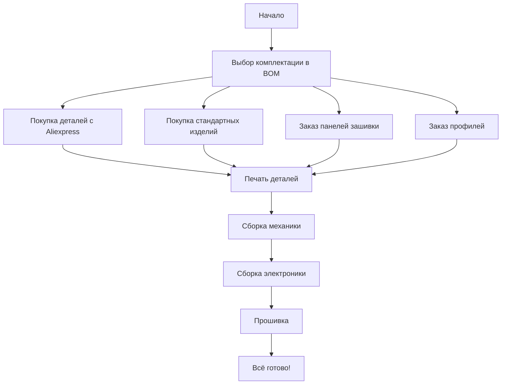

# Начало сборки K3D VOSTOK

K3D VOSTOK - это проект самосборного 3D принтера. Автор не планирует продавать ни готовые собранные принтеры, ни наборы для сборки. Так что, если вы хотите такой принтер, то собирать его вам придётся самостоятельно, начиная с покупки деталей. Эта страница призвана дать понимание где искать ту или иную информацию, необходимую для сборки принтера.

## Структура документации

Всю необходимую для сборки принтера документацию можно скачать [на странице релизов](./releases.md).

### Спецификация

Основной документ для сборки принтера - это спецификация, она же BOM. Она представляет из себя файл с таблицами, где можно выбрать желаемую конфигурацию и автоматически рассчитается:

- Состав и количество покупных деталей (моторы, рельсы, детали экструдера, электроника и т.д.);
- Состав и количество стандартных изделий (винты, гайки, подшипники и т.д.);
- Состав и количество печатных изделий, включая расчёт общего количества потребного филамента;
- Состав, количество и длину профилей для сборки рамы;
- [В разработке] Состав и количество проводов и разъёмов;
- Ориентировочный расчёт стоимости зашивки.

Для всех покупных товаров есть ссылки, так что процесс выбора и покупки деталей получается относительно простым и без подводных камней. Всё необходимое для сборки VOSTOK в выбранной комплектации спецификация учтёт самостоятельно.

### Генератор чертежей

Генератор чертежей выполнен в виде `.html` страницы, на которой вводятся данные профилей из спецификации, после чего можно сгенерировать чертежи для заказа резки панелей.

### Файлы для печати и общая сборка принтера

Файлы для печати предоставляются в формате `.stl`. Обратите внимание, что количество и основные параметры печати всех файлов расчитываются в спецификации.

Общая сборка принтера в формате `.step` предоставляется для двух целей. Во-первых, её можно использовать для создания модификаций. Во-вторых, если есть какие-то вопросы по тому, как узлы принтера должны выглядеть в собранном виде, это можно посмотреть именно в общей сборке.

### Инструкции по сборке

Инструкции по сборке и настройке принтера предоставлены на этом сайте в виде текстовых статей. 

## С чего начать сборку принтера?

Собирать VOSTOK в качестве первого принтера - это довольно плохая идея, так как проект не самый простой, требует печати большого количества деталей и т.д.. Так что, если у вас нет принтера, то лучше всего будет начать с покупки какого-либо готового и освоения работы на нём. Только после этого стоит переходить к сборке VOSTOK'а. 

В целом процесс сборки принтера выглядит так:

Единственным интересным моментом тут является то, что печать деталей предлагается отложить на как можно более поздний момент, так как пока вы будете ждать изготовления и доставки деталей, возможно обновление, из-за которого детали придётся перепечатывать.

## ЧАВО - частые вопросы и ответы на них

### Сколько стоит VOSTOK?

Стоимость принтера очень сильно варьируется в зависимости от размера, комплектации и используемых решений, так что однозначно ответить на этот вопрос невозможно. Лучшее что вы можете сделать - скачать спецификацию (BOM) и рассчитать стоимость для интересной вам комплектации.

### Можно ли собрать без зашивки?

Можно, но жесткость рамы будет сильно ниже, чем с зашивкой, и принтер окажется достаточно медленным. Кроме того, на зашивку крепится электроника, так что придётся искать другие способы закрепить её.

### Какой материал лучше использовать для зашивки?

Тесты показывают, что даже 3мм акрила хватает за глаза. Также можно использовать листы алюмокомпозита (листы пластика со слоями алюминия), поликарбонат, сталь, алюминий и что угодно еще что вам нравится.

### А не поведет ли раму от разности КЛТР у алюминия и акрила/ПК/чего угодно еще?

Тесты показывают, что если и ведет, то крайне незначительно. На печать не влияет.

### Где купить [подставьте название детали]?

Все ссылки есть в спецификации (BOM). Если там нет ссылок на что-то, значит и у автора их нет.

### Какие скорости будут у принтера?

Очень сильно зависит от качества деталей и габарита принтера. Но, в целом, с одной печатающей головой печать возможна до ~150-300мм/с при ускорениях 8-20м/с². С двумя печатающими головами помедленнее.

### Почему не тестируются версии больше, чем 510х510мм?

Чем больше размер области печати, тем длиннее балка оси X. Для размера стола более 510мм потребуется увеличить жесткость балки, ради чего, скорее всего, придётся ставить профиль 30х30 или 20х40. Это приведёт к изменению конструкции кареток осей X, U и Y. То есть под бОльший габарит области печати принтер требуется немного изменить, что автор на данный момент не делает так как занят другими работами.

### Где можно задать вопросы по сборке VOSTOK?

У проекта есть [чат в Telegram](https://t.me/k3d_vostok). Также вопросы по востоку можно задать на стримах [на YouTube канале автора](https://www.youtube.com/@SorkinDmitry).

---

<a property="dct:title" rel="cc:attributionURL" href="https://k3d.tech/vostok/">K3D VOSTOK</a> by Dmitry Sorkin is licensed under <a href="http://creativecommons.org/licenses/by/4.0/?ref=chooser-v1" target="_blank" rel="license noopener noreferrer" style="display:inline-block;">CC BY 4.0</a>
