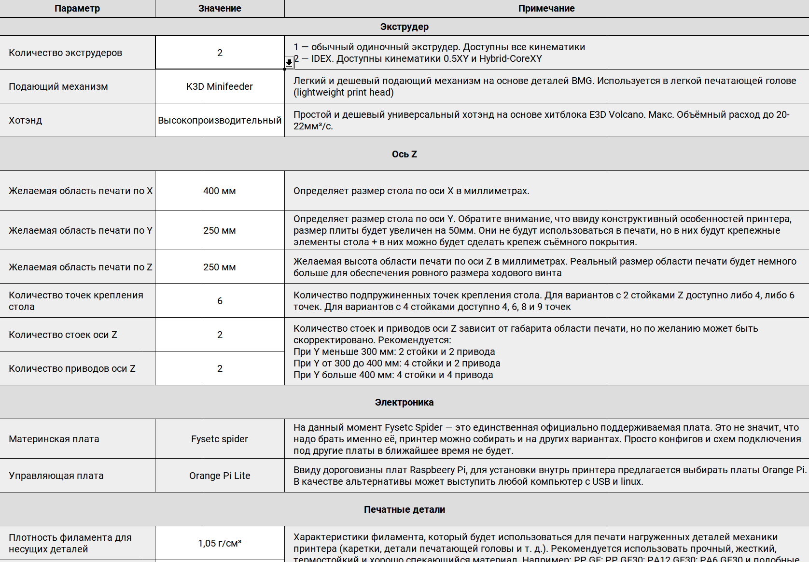
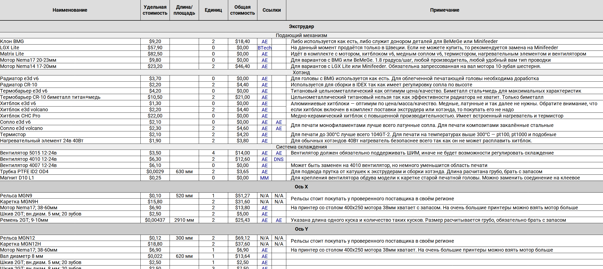
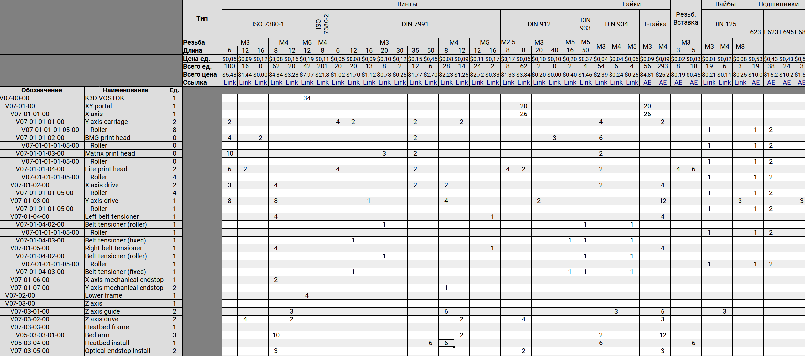
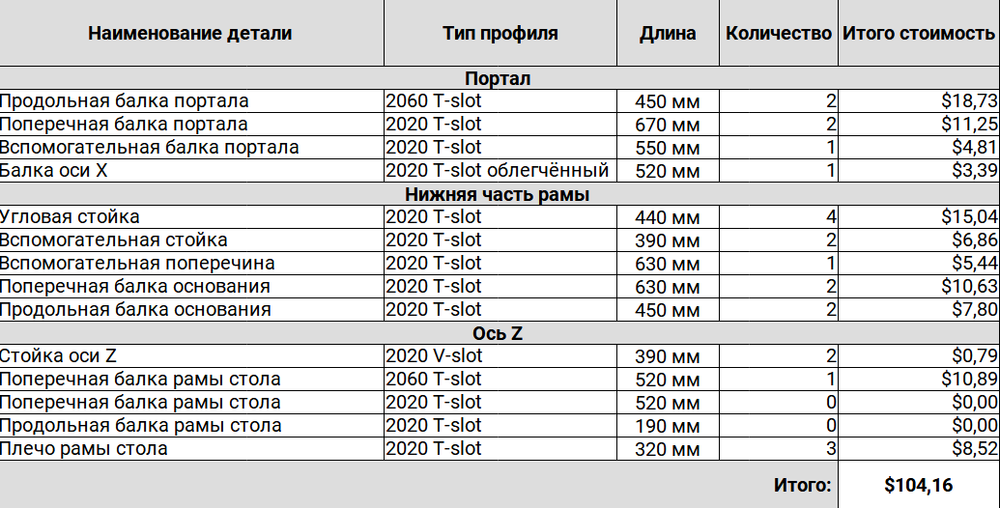
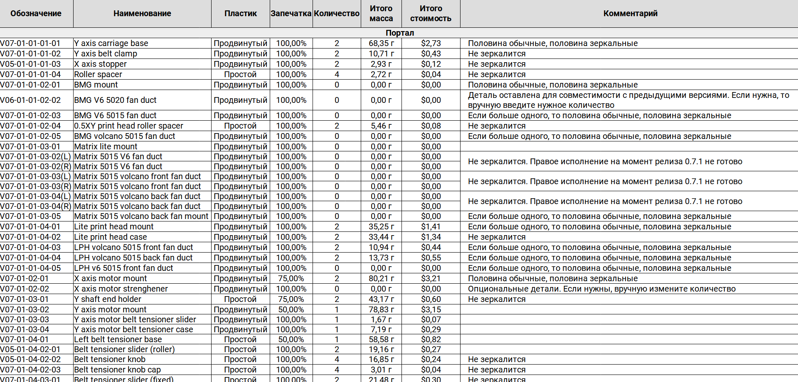
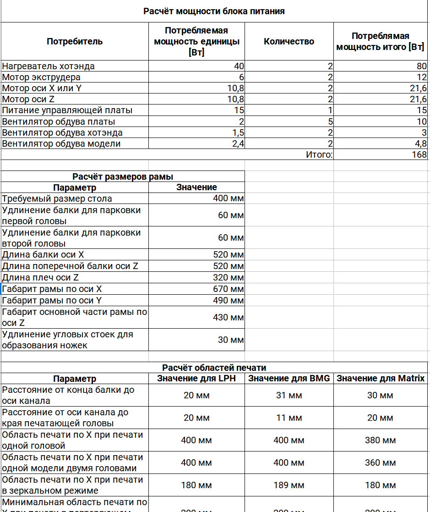

# Инструкция по использованию BOM

## Что такое BOM

BOM - это **B**ill **O**f **M**aterials, то есть список деталей, то есть спецификация. Это таблица [LibreOffice](https://ru.libreoffice.org/), в которой рассчитывается:

- Сколько и каких деталей купить
- Сколько и каких деталей распечатать
- Длины и количество алюминиевых профилей
- Некоторые характеристики принтера
- (В планах) Длины и типы проводов и разъёмов

Иными словами, это основной инструмент для расчёта своего принтера VOSTOK. 

## Лист Настройки



На данном листе вы можете ввести некоторые параметры, которые определят расчёт. Редактируемые поля располагаются в столбце `Значение` и подсвечены белым цветом. В большинстве случаев параметры нельзя вводить, но можно выбирать из списка (стрелка правее выделенной ячейки).

В столбце `Примечание` есть комментарии, которые либо сразу подсказывают что в каком случае выбрать, либо динамически меняются в зависимости от уже выбранного значения.

## Лист Покупные изделия



На этом листе происходит расчёт количества и типов покупных изделий. В общем случае тут ничего менять не надо, можно просто использовать это как список деталей для покупки.

- В столбце `Наименование` приводится название детали. Обратите внимание, что в названии некоторых деталей, например, грелки, есть динамически меняющиеся элементы;

- В столбце `Удельная стоимость` приводится стоимость либо единицы товара, либо одной единицы длины/площади (миллиметр или метр в квадрате). Если товар продаётся упаковками, то указывается цена не упаковки, а одной единицы;

- В столбце `Длина / Площадь` указывается длина **<u>одной единицы товара</u>**. При этом длины считаются без запаса вовсе. Если для рельс, стекол и т.д. это правильно, то для ремней и трубки надо при покупке самостоятельно добавить запас 10-20%;

- В столбце `Единиц` указывается количество деталей, которые надо купить;

- В стобце `Общая стоимость` подсчитывается стоимость всех единиц товара указанной длины / площади. По этому столбцу удобно мониторить какие именно детали выходят дороже всего и на чём можно сэкономить;

- В столбцах `Ссылки` есть ссылки на проверенные товары с Aliexpress и других магазинов. Часто в качестве альтернативной ссылки предлагается не такой же товар, как на первой, а немного другой. Например, если основная ссылка ведёт на латунное сопло, то альтернативная может вести на стальное закалённое;

- В столбце `Примечания` находится дополнительная информация по соответствующим деталям.

:warning: Обратите внимание, что некоторые позиции могут дублироваться в другом разделе. В таком случае надо купить суммарное количество этих деталей.

## Лист Стандартные изделия



На этом листе производится расчёт количества и типов стандартных изделий - винтов, шайб, гаек, подшипников и т.д.

### Оглавление слева

- В столбце `Обозначение` находится буквенно-цифровой идентификатор сборки. Он нужен чтобы находить нужную подсборку в общей сборке принтера;

- В столбце `Наименование` находится название сборки;

- В столбце `Единиц` указывается **<u>количество сборок</u>** в принтере.

### Оглавление сверху

- В строках `Тип`, `Резьба` и `Длина` указываются параметры винтов для покупки. При этом некоторые винты могут быть заменены, например, цилиндрическую головку на полукруглую почти всегда можно поменять безболезненно. Также ничто не мешает редкие винты получить обрезанием более длинных;

- В строке `Цена единицы` указана цена одной единицы товара нормального качества;

- В строке `Всего единиц` указано суммарное количество деталей на весь принтер. :warning: Обратите внимание, что это количество подсчитано без запаса. Покупать стоит на 10-20% больше;

- В строке `Всего цена` указана суммарная стоимость всех единиц этой детали. Служит для того, чтобы ориентироваться какие детали выходят дороже всего;

- В строке `Ссылка` указана ссылка на проверенный товар. Цена может отличаться так как цены в таблице обновляются редко.

## Лист Профиль алюминиевый



На этом листе рассчитывается сколько и каких профилей надо купить для сборки рамы. Положение отверстий при этом не рассчитывается так как они не обязательны для сборки.

В случае если у вас уже приобретены детали для принтера, но вы хотите обновиться на новую версию, то значения на листе `Настройки` надо выставить таким образом, чтобы набор и длина профилей совпали с уже купленным. В таком случае и зашивка тоже подойдёт от старой версии к новой.

## Лист Печатные изделия



На этом листе проводится расчёт сколько и каких деталей надо напечатать, в каком виде и из какого вида пластика. В общем случае здесь ничего трогать не надо, просто используйте как памятку при подготовке к сборке.

- В столбце `Обозначение` указыватся буквенно-цифровой номер детали. Служит для того, чтобы легче найти её в общей сборке принтера или в папке с файлами для печати;

- В столбце `Наименование` указывается название детали;

- В столбце `Пластик` указано из какого филамента желательно печатать эту деталь. При этом есть три варианта:
  
  - Простой - какой-нибудь простой в печати, но прочный филамент с термостойкостью от 80 градусов. Хорошо подходит `PETG`, но ничто не мешает использовать и композиты типа `PP GF` и т.д. Использование `ABS` и подобных нежелательно так как деталям может не хватить прочности;
  
  - Продвинутый - `PP GF30`, `PA12 GF30`, `PA6 GF30` и подобные хорошо спекающиеся, прочные и термостойкие материалы. В крайнем случае можно заменить на `PETG`, но тогда надо пристально следить чтобы моторы и другие контактирующие детали не грелись выше 70 градусов;
  
  - Эластомер - это какой-нибудь цепкий эластомер для печати ножек. 

- В столбце `Запечатка` указывается предпочтительное отношение массы напечатанной детали к массе детали при 100% заполнении. Иными словами, если тут стоит 100%, то надо ставить заполнение 100%. Но, если стоит меньше, то не надо ставить процент заполнения равным этому проценту запечатки. Надо ставить ниже т.к. периметры и крышка/дно дополнительно увеличивают запечатку. Более подробную информацию по печати ищите в инструкциях по сборке соответствующих агрегатов;

- В столбце `Количество` указывается количество деталей, которые надо напечатать. Отражаются они или нет - смотрите в столбце `Примечание`;

- В столбце `Итого масса` указывается общая масса всех единиц соответствующей детали. Служит для того, чтобы определить куда уходит наибольшее количество пластика и хватит ли остаткой на печать тех или иных деталей в нужном количестве;

- В столбце Итого стоимость указывается суммарная стоимость всех экземляров соответствующей детали;

- В столбце Примечание указывается дополнительная информация по печати. Чаще всего как печатать детали - зеркалить ли второй экземпляр, является ли деталь опционально и т.д. 

## Лист Расчёты



На этот лист вынесены некоторые расчёты с других листов.

### Расчёт мощности блока питания

Тут производится расчёт потребления электроэнергии агрегатами принтера. В случае, если вы собираетесь ставить какое-нибудь дополнительное оборудование на свой принтер, например, подсветку или активную термокамеру, то мощность здесь надо скорректировать на мощность вашего дополнительного оборудования.

### Расчёт областей печати

Так как VOSTOK поддерживает несколько печатающих голов, а также IDEX версия может работать в нескольких режимах (зеркальный, повторяющий и т.д.), то добавлен расчёт областей печати для разных случаев. По этим данным можно ориентироваться какая область печати окажется доступна вам при замене печатающей головы.

```
Дата: 25.04.2022
Автор: Дмитрий Соркин
Telegram: @dmitry_sorkin
E-mail: dbsorkin@gmail.com
```
