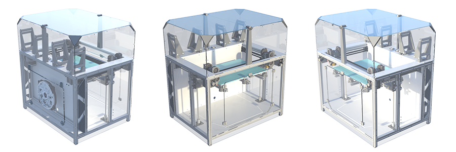

# 

<figure markdown>
  { width="800" }
  { width="800" }
</figure>

<figure markdown>
  { width="1000" }
</figure>

- :octicons-mirror-24:{ .lg .middle }   __IDEX__

    ---

    **I**ndependent **D**ouble **E**xtrusion - система, при которой на балку оси X можно установить 2 отдельные печатающие головки. Это позволяет:

    - Печатать одну деталь 2 разными материалами;
    - Печатать 2 одинаковых детали одновременно;
    - Печатать 2 зеркальных детали одновременно

- :material-clock-fast:{ .lg .middle }  __Высокая скорость печати__

    ---

    Зашивка включена в силовую конструкцию принтера, благодаря чему принтер может печатать с очень высокими ускорениями. К примеру, по тестам 2-головый VOSTOK с областью печати 400х250 обгоняет большинство конкурирующих конструкций с 1 печатающей головой и областью печати 250х250

- :material-view-module:{ .lg .middle } __Высокая степень модульности__

    ---

    Практически все части принтера выполнены в виде модулей, которые могут меняться отдельно от других. Это позволяет легко и дешево обновлять принтер на новые версии, а также легко модифицировать его конструкцию под себя

- :material-image-size-select-large:{ .lg .middle } __Широкая конфигурируемость__

    ---

    **K3D VOSTOK** можно собрать с габаритом области печати от 200х200 до 510х510, с 1 или 2 печатающими головами, с разными вариантами рамы стола, разной электроникой, разными печатающими головами и т.д. 

- :simple-opensourcehardware:{ .lg .middle } __Открытые исходники и свободная лицензия__

    ---

    **K3D VOSTOK** распространяется под лицензией [CC BY 4.0](http://creativecommons.org/licenses/by/4.0/?ref=chooser-v1){ target="_blank" } :fontawesome-brands-creative-commons: :fontawesome-brands-creative-commons-by:. Эта лицензия позволяет вам использовать проект и документацию к нему как вам угодно, в том числе в коммерческих целях, за исключением возможности присвоить себе авторство

- :material-comment-account-outline:{ .lg .middle } __Большое сообщество__

    ---

    Уже более 100 VOSTOK'ов печатают и еще больше на подходе. Присоединяйся!

    - [:simple-telegram: Новости проекта в TG](https://t.me/vostok3dp){ target="_blank" }
    - [:simple-telegram: Обсуждение проекта в TG](https://t.me/k3d_vostok){ target="_blank" }
    - [:material-forum: Форум K3D VOSTOK](https://forum.k3d.tech){ target=_blank }

