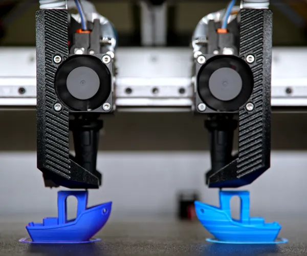
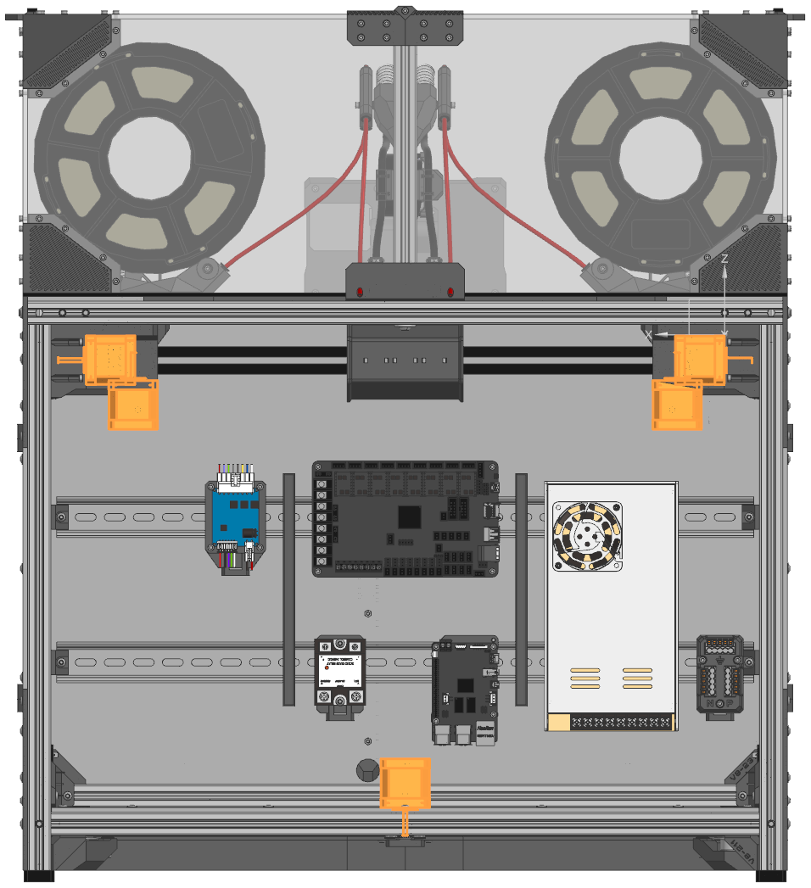

---
authors:
  - sorkin
icon: material/printer-3d
title: VOSTOK
description: Общее описание конструкции
show_created: false
show_updated: false
show_author: false
---

#

{ .notrounded width="900" }
{ .notrounded width="900" }

{ width="900" }

---

{ width="300" }

!!! fire "Полное время смены инструмента на VOSTOK составляет всего около половины секунды"

Для сравнения, принтеры с AMS-подобными системами меняют материал за ~90с, двойные экструдеры и тулченджеры за ~10с, а RatRig V4 IDEX ~5с[^1].

Этого удалось добиться за счёт использования кастомной ветки Klipper, поддерживающей независимое управление печатающими головами и экструдерами. Благодаря этому становится возможно прочистить неактивную печатающую голову пока активная еще печатает. Следовательно, после смены инструмента нет необходимости тратить время на печать черновой башенки и можно сразу приступать к печати детали.

---

{ width="300" }

В качестве хотэндов используются одни из лучших по максимальному объёмному расходу - Goliath или CHC XL. Система охлаждения модели, несмотря на очень малый габарит, является настолько производительной, что в реальных задачах её не бывает нужно включать выше 70%. Плюс рама, очень жёсткая благодаря силовой зашивке, и продуманная конструкция механики портала дают рекордно высокие по меркам IDEX принтеров ускорения.

Как итог, двухголовый VOSTOK в габарите 400х250х250 значительно быстрее даже серийных одноголовых принтеров с габаритом области печати вдвое меньше. А среди аналогичных ему IDEX принтеров VOSTOK не имеет конкурентов по скорости печати[^2].

---

{ width="330" }

Зеркальный и повторяющий режимы работы IDEX позволяют обеим печатающим головам работать параллельно, тем самым удваивая производительность принтера в задачах печати партий деталей.

При этом VOSTOK изначально проектируется как двухголовый принтер, благодаря чему все типичные для IDEX проблемы уже решены. У печатающих голов есть регулировка по высоте, а стол имеет систему, позволяющую сделать его ровным. Благодаря этому первый слой выкладывается хорошо даже в зеркальном и повторяющем режимах. Концевики всех осей расположены так, что тепловое расширение деталей механики не приводит к изменению XY-offset'ов правой печатающей головы. И так далее.

---

{ width="300" }

Принтер подготовлен под создание термокамеры:

- Все моторы, кроме моторов печатающих голов, вынесены из отсека печати;
- Парковка происходит таким образом, чтобы тепловое расширение деталей механики не приводило к изменению XY-offset'ов правой печатающей головы;
- Используются только теплостойкие компоненты, способные выдерживать повышенную температуру в термокамере;
- Есть штатное место для термистора и отверстия для прокидывания проводов к нагревателю термокамеры.

Поэтому, если вам необходима термокамера - просто добавляете нагреватель и можно печатать. Больше ничего делать не надо.

---

{ width="300" }

IDEX принтеры сложнее обычных в калибровке т.к. часть калибровок необходимо делать 2 раза - по 1 для каждой печатающей головы. А также есть набор своих специфичных для двухголовых принтеров калибровок.

У VOSTOK'а нет таких проблем. Обе печатающие головы идентичны, благодаря чему большинство калибровок, специфичных для экструдеров, можно проводить только по одному разу. Для калибровки Pressure Advance есть макрос, позволяющий за одну печать откалибровать значение PA на обе печатающие головы, в том числе при калибровке адаптивного PA. Калибровка Input Shaping'а тоже проходит через специальный макрос, который позволяет подобрать шейперы таким образом, чтобы они подходили для любого режима работы принтера. А для калибровки XY-offset'ов правой печатающей головы разработана [отдельная быстрая и точная методика](../calibrations/printhead_offset.md), которая не хуже калибровки оффсетов по камере.

[^1]: У RatRig есть Toolshift - хитрый макрос, позволяющий менять головы так же быстро, как и у VOSTOK. Но нет возможности прочистить печатающую голову перед сменой. Следовательно, либо при печати будут дефекты из-за того, что хотэнд не вошёл в рабочий режим перед началом печати, либо придётся печатать черновую башенку, которая сильно увеличивает полное время смены инструмента. Но, справедливости ради, на RatRig можно использовать не стоковую прошивку, а ту же ветку, которую использует VOSTOK. Тогда время смены инструмента будет одинаковым.
[^2]: RatRig V4 IDEX медленнее по механике (~6000 мм/с^2 против ~16000 мм/с^2 по аналогичным тестам), использует в полтора-два раза менее производительные Rapido хотэнды и не быстрее по смене материала. Поэтому он не может соперничать по скорости печати ни при упоре в механику, ни при упоре в производительность хотэнда. Другие проекты либо строятся на базе Voron 2.4/Trident, которые даже при 1 печатающей голове и небольшом размере области печати сильно уступают VOSTOK'у, либо это какие-то давно устаревшие решения, либо очень дорогие проприетарные, которые рядовой пользователь особо и не купит.
